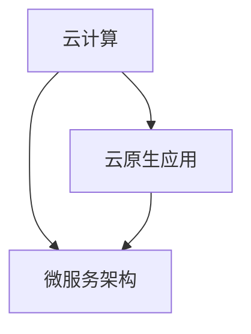
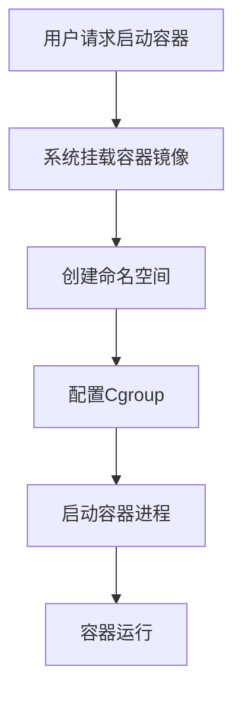
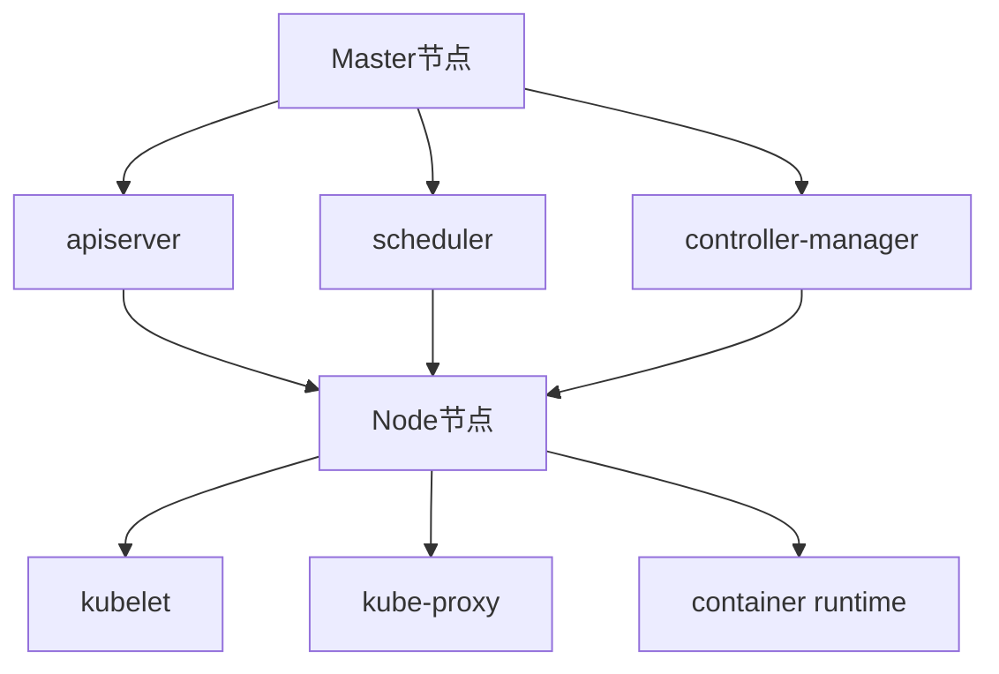

                 

# 《云原生应用开发：拥抱云计算的新范式》

## 文章关键词
云原生，云计算，应用开发，容器化，Kubernetes，微服务，安全，性能优化，人工智能

## 摘要
本文深入探讨了云原生应用开发的核心理念、关键技术以及实践应用。通过阐述云原生与传统架构的差异，本文介绍了云计算的基础知识，详细分析了容器技术和Kubernetes的工作原理。接着，文章讲解了云原生应用开发的流程、架构设计、安全性以及性能优化。通过实际案例的研究，本文展示了云原生应用在电商、金融和物联网等领域的应用场景，最后对云计算与人工智能的结合进行了展望。

## 目录大纲

### 第一部分：云原生概述

#### 第1章：云原生概念与历史背景
- **背景介绍**：介绍云原生概念的产生背景，云计算技术的发展历程。
- **核心概念与联系**：通过Mermaid流程图展示云原生、云计算、微服务之间的关系。
- **云原生与传统架构的差异**：对比传统架构和云原生架构，分析差异和优势。

#### 第2章：云计算基础
- **云计算概述**：介绍云计算的基本概念和服务模式。
- **云计算服务模式**：详细讲解IaaS、PaaS、SaaS。
- **云计算部署模型**：分析公有云、私有云、混合云的特点。

#### 第3章：云原生架构核心组件
- **容器技术（Docker）**：讲解容器原理，Docker的安装与使用。
- **容器编排工具（Kubernetes）**：分析Kubernetes架构，讲解Kubernetes的安装与配置。
- **微服务架构**：介绍微服务优势与挑战，设计原则。

### 第二部分：云原生应用开发

#### 第4章：云原生应用开发流程
- **开发环境搭建**：详细说明开发环境的选择和配置。
- **应用打包与容器化**：讲解应用打包工具，容器化流程。
- **应用部署与运维**：分析部署策略，运维工具的使用。

#### 第5章：云原生应用架构设计
- **服务发现与注册**：介绍服务发现与注册机制。
- **配置管理**：讲解配置管理的必要性，常用的配置管理工具。
- **服务熔断与限流**：分析服务熔断与限流的作用，实现原理。

#### 第6章：云原生应用安全性
- **安全基础**：介绍云原生应用的安全原则和策略。
- **容器安全性**：分析容器安全风险，安全最佳实践。
- **Kubernetes安全最佳实践**：讲解Kubernetes的安全配置和策略。

#### 第7章：云原生应用性能优化
- **应用性能监控**：介绍性能监控的重要性，常用的监控工具。
- **性能调优技巧**：讲解性能调优的方法和技巧。
- **缓存与负载均衡**：分析缓存策略，负载均衡的实现原理。

#### 第8章：云原生应用案例研究
- **案例一：电商平台的云原生转型**：分析电商平台转型的原因和过程。
- **案例二：金融服务的云原生应用**：探讨金融服务云原生化的优势和挑战。
- **案例三：物联网设备的云原生部署**：分析物联网设备云原生部署的难点和解决方案。

### 第三部分：云计算的未来与挑战

#### 第9章：云原生与人工智能的结合
- **云原生与人工智能概述**：介绍云原生与人工智能的结合趋势。
- **云计算在人工智能中的应用**：分析云计算在人工智能计算、存储、部署等方面的应用。
- **云计算与人工智能的未来发展**：展望云计算与人工智能结合的未来方向和挑战。

## 正文内容

### 第一部分：云原生概述

#### 第1章：云原生概念与历史背景

#### 背景介绍

随着云计算技术的发展，传统的应用程序开发模式逐渐显露出其局限性。为了更好地适应云计算环境，云原生应用开发应运而生。云原生（Cloud Native）是指一种新的应用程序开发模式，它利用云计算的灵活性和可扩展性，使应用程序能够快速部署、弹性伸缩、易于管理和自动化。

云计算技术的发展历程可以追溯到20世纪90年代。当时，网络技术的发展推动了数据中心的建设和虚拟化技术的应用。进入21世纪，云计算开始崭露头角，亚马逊、微软、谷歌等巨头纷纷推出云服务，为企业和个人提供了强大的计算和存储资源。

#### 核心概念与联系

云原生、云计算、微服务是当前应用开发中的核心概念。它们之间有着紧密的联系。云计算提供了基础设施和服务，为云原生应用提供了运行环境。微服务是一种设计模式，它将应用程序拆分成小而独立的组件，每个组件可以独立部署、扩展和管理。云原生应用则是基于微服务架构，利用云计算的优势，实现高效的开发、部署和运维。

以下是一个简单的Mermaid流程图，展示了这三个概念之间的关系：



#### 云原生与传统架构的差异

传统架构通常采用单体应用（Monolithic Application）模式，即应用程序的所有组件紧密耦合在一起，运行在一个统一的进程中。这种模式在早期软件开发中较为常见，但随着业务规模和复杂度的增加，它逐渐显露出其局限性：

1. **扩展性差**：传统架构的应用程序难以水平扩展，因为组件之间的依赖关系紧密，扩展一个组件可能会影响整个系统。
2. **部署困难**：传统架构的应用程序部署复杂，需要进行整体部署，一旦出现故障，整个系统可能会受到影响。
3. **维护困难**：传统架构的应用程序代码库庞大，修改一个组件可能需要重新编译整个应用程序，增加了维护成本。

相比之下，云原生架构具有以下优势：

1. **高扩展性**：云原生应用采用微服务架构，可以将应用程序拆分为多个独立的服务，每个服务都可以独立部署和扩展，从而实现水平扩展。
2. **易于部署**：云原生应用采用容器化技术，可以将应用程序及其依赖打包成一个容器镜像，实现快速部署和回滚。
3. **高可用性**：云原生应用可以通过自动化编排工具（如Kubernetes）实现自动化部署、监控和故障恢复，提高系统的可用性。

#### 云原生的发展历程

云原生的发展历程可以分为三个阶段：

1. **容器化**：容器化是云原生应用的基础。Docker的推出使得容器技术得到了广泛应用，开发者可以将应用程序及其依赖打包成一个容器镜像，实现跨平台的部署和运行。
2. **容器编排**：随着容器技术的普及，如何管理和编排容器成为了一个重要问题。Kubernetes作为容器编排工具，为开发者提供了强大的自动化管理功能，使得云原生应用的部署和管理变得更加简单。
3. **云原生生态系统**：云原生生态系统包括了各种工具和服务，如服务网格（Service Mesh）、持续集成和持续部署（CI/CD）、云原生数据库等。这些工具和服务的整合，使得云原生应用的开发、部署和运维变得更加高效。

#### 第2章：云计算基础

#### 云计算概述

云计算是一种通过网络提供计算资源、存储资源、网络资源、安全资源等服务的方式。它使得企业能够按需获取资源，降低基础设施的建设和维护成本，提高业务灵活性。

云计算的服务模式主要包括以下三种：

1. **基础设施即服务（IaaS）**：IaaS提供商为企业提供虚拟化的计算资源、存储资源和网络资源，企业可以根据需求自行配置和管理这些资源。
2. **平台即服务（PaaS）**：PaaS提供商为企业提供一个开发平台，包括操作系统、数据库、Web服务器等，企业可以在平台上开发、部署和管理应用程序。
3. **软件即服务（SaaS）**：SaaS提供商为企业提供软件服务，企业无需购买和安装软件，只需通过互联网访问即可使用。

#### 云计算服务模式

云计算的服务模式可以分为以下三种：

1. **公有云**：公有云是由第三方服务提供商运营的云计算资源池，企业可以通过互联网访问和使用这些资源。公有云具有资源池化、弹性伸缩、高可用性等特点。
2. **私有云**：私有云是企业自行搭建的云计算平台，专门为本企业提供服务。私有云可以提高数据安全性，满足企业特定的业务需求。
3. **混合云**：混合云是将公有云和私有云结合起来，企业可以根据业务需求，将一部分应用程序和数据部署在公有云上，另一部分部署在私有云上。

#### 云计算部署模型

云计算的部署模型可以分为以下几种：

1. **本地部署**：本地部署是在企业内部部署云计算资源，适用于企业对数据安全性要求较高的情况。
2. **本地云**：本地云是一种将云计算资源部署在企业内部，同时具备公有云的一些特性的部署模型。
3. **远程云**：远程云是将云计算资源部署在第三方服务提供商的数据中心，企业通过互联网访问和使用这些资源。

#### 第3章：云原生架构核心组件

##### 容器技术（Docker）

容器技术是云原生架构的核心组件之一。Docker是当前最流行的容器技术，它将应用程序及其依赖打包成一个容器镜像，实现跨平台的部署和运行。

#### 容器原理

容器是一种轻量级、可执行的软件包，它包含了应用程序及其运行环境。容器通过操作系统的命名空间（Namespace）和隔离机制（Cgroup）实现资源隔离和限制。

以下是一个简单的Mermaid流程图，展示了容器的启动过程：



#### Docker安装与使用

1. **安装Docker**

在Linux系统中，可以通过以下命令安装Docker：

```bash
sudo apt-get update
sudo apt-get install docker-ce docker-ce-cli containerd.io
```

在Windows系统中，可以从Docker官网下载Docker Desktop for Windows进行安装。

2. **运行Docker容器**

以下是一个简单的Docker容器运行示例：

```bash
# 查找镜像
docker pull ubuntu

# 运行容器
docker run -it --name my_ubuntu ubuntu

# 进入容器
docker exec -it my_ubuntu bash

# 停止容器
docker stop my_ubuntu

# 删除容器
docker rm my_ubuntu
```

##### 容器编排工具（Kubernetes）

Kubernetes是当前最流行的容器编排工具，它提供了一整套自动化部署、扩展和管理容器化应用程序的功能。

#### Kubernetes架构

Kubernetes由一组组件组成，主要包括：

1. **Master节点**：Master节点负责集群的调度、监控和管理工作。它包括以下组件：
   - **apiserver**：提供集群管理的API接口。
   - **scheduler**：负责调度容器到集群中的节点。
   - **controller-manager**：负责集群内部各个组件的监控和管理。

2. **Node节点**：Node节点是Kubernetes集群中的工作节点，负责运行容器化的应用程序。每个Node节点包括以下组件：
   - **kubelet**：负责与Master节点通信，管理容器化应用程序。
   - **kube-proxy**：负责容器之间的网络通信。
   - **container runtime**：负责容器的运行环境，如Docker、rkt等。

以下是一个简单的Mermaid流程图，展示了Kubernetes的架构：



#### Kubernetes安装与配置

1. **安装Kubernetes**

在Linux系统中，可以通过以下命令安装Kubernetes：

```bash
sudo apt-get update
sudo apt-get install kubeadm kubelet kubectl
```

在Windows系统中，可以从Kubernetes官网下载Kubernetes二进制文件进行安装。

2. **配置Kubernetes**

安装完成后，可以通过以下命令初始化Kubernetes集群：

```bash
sudo kubeadm init
```

初始化完成后，需要将kubeconfig文件复制到所有Node节点，以便Node节点与Master节点通信：

```bash
sudo cp /etc/kubernetes/admin.conf $HOME/
sudo chown $(id -u):$(id -g) $HOME/admin.conf
export KUBECONFIG=$HOME/admin.conf
```

#### 第4章：云原生应用开发流程

##### 开发环境搭建

云原生应用开发需要一定的开发环境，主要包括Docker、Kubernetes等工具。以下是在Linux系统中搭建云原生应用开发环境的步骤：

1. **安装Docker**

```bash
sudo apt-get update
sudo apt-get install docker-ce docker-ce-cli containerd.io
```

2. **安装Kubernetes**

```bash
sudo apt-get update
sudo apt-get install kubeadm kubelet kubectl
```

3. **配置Kubernetes**

```bash
sudo kubeadm init
sudo cp /etc/kubernetes/admin.conf $HOME/
sudo chown $(id -u):$(id -g) $HOME/admin.conf
export KUBECONFIG=$HOME/admin.conf
```

##### 应用打包与容器化

云原生应用的开发过程中，应用打包与容器化是关键步骤。以下是一个简单的应用打包与容器化示例：

1. **编写Dockerfile**

```bash
# syntax=docker
FROM ubuntu:latest
RUN apt-get update && apt-get install -y nginx
COPY ./myapp /usr/share/nginx/html
EXPOSE 80
```

2. **构建Docker镜像**

```bash
docker build -t myapp:latest .
```

3. **运行Docker容器**

```bash
docker run -d --name myapp-container -p 8080:80 myapp:latest
```

##### 应用部署与运维

云原生应用的部署与运维主要依赖于Kubernetes。以下是一个简单的应用部署与运维示例：

1. **编写Kubernetes配置文件**

```yaml
apiVersion: apps/v1
kind: Deployment
metadata:
  name: myapp-deployment
spec:
  replicas: 3
  selector:
    matchLabels:
      app: myapp
  template:
    metadata:
      labels:
        app: myapp
    spec:
      containers:
      - name: myapp
        image: myapp:latest
        ports:
        - containerPort: 80
```

2. **部署应用**

```bash
kubectl apply -f myapp-deployment.yaml
```

3. **查看应用状态**

```bash
kubectl get pods
```

4. **扩容应用**

```bash
kubectl scale deployment myapp-deployment --replicas=5
```

5. **运维操作**

- **更新应用**：

```bash
kubectl set image deployment/myapp-deployment myapp=myapp:version2
```

- **回滚应用**：

```bash
kubectl rollout undo deployment/myapp-deployment
```

#### 第5章：云原生应用架构设计

##### 服务发现与注册

在云原生应用架构中，服务发现与注册是关键组件。服务发现是指应用程序能够自动发现其他服务的位置和状态，而服务注册则是将服务的信息注册到服务发现系统中。

以下是一个简单的服务发现与注册示例：

1. **编写Service Discovery配置文件**

```yaml
apiVersion: v1
kind: Service
metadata:
  name: myapp-service
spec:
  selector:
    app: myapp
  ports:
    - protocol: TCP
      port: 80
      targetPort: 8080
```

2. **部署服务**

```bash
kubectl apply -f myapp-service.yaml
```

3. **服务注册**

在Kubernetes中，服务注册通常通过标签和选择器实现。应用程序在启动时，会根据其配置文件中的标签和选择器注册到Kubernetes中，从而实现服务发现。

##### 配置管理

在云原生应用架构中，配置管理是指应用程序能够动态获取和更新配置信息。配置管理可以采用中心化的配置管理系统，如Spring Cloud Config，也可以采用分布式配置管理，如Kubernetes ConfigMap和Secret。

以下是一个简单的配置管理示例：

1. **编写ConfigMap配置文件**

```yaml
apiVersion: v1
kind: ConfigMap
metadata:
  name: myapp-config
data:
  application.properties: |
    server.port=8080
    server.contextPath=/myapp
```

2. **部署ConfigMap**

```bash
kubectl apply -f myapp-config.yaml
```

3. **配置应用程序**

在应用程序的Dockerfile中，可以将ConfigMap配置文件挂载到容器的配置目录：

```dockerfile
COPY config/application.properties /etc/config/application.properties
```

##### 服务熔断与限流

在云原生应用架构中，服务熔断与限流是保证系统稳定性的重要手段。服务熔断是指在服务出现故障时，自动切断服务调用，以避免故障扩散；限流是指限制对某个服务的调用次数，以防止服务被过载。

以下是一个简单的服务熔断与限流示例：

1. **编写熔断和限流配置文件**

```yaml
apiVersion: v1
kind: Service
metadata:
  name: myapp-service
spec:
  selector:
    app: myapp
  ports:
    - protocol: TCP
      port: 80
      targetPort: 8080
  annotations:
    service.beta.kubernetes.io/aws-load-balancer-internal: 0.0.0.0/0
```

2. **部署服务**

```bash
kubectl apply -f myapp-service.yaml
```

3. **配置熔断和限流**

在应用程序的代码中，可以集成熔断和限流库，如Hystrix和Sentinel，实现服务熔断和限流功能。

```java
// 示例代码
@HystrixCommand(fallbackMethod = "fallBack")
public String callService() {
    return serviceApi.callService();
}

public String fallBack() {
    return "服务不可用";
}

// 示例代码
@RateLimiter(name = "myapp", limit = 10)
public String callService() {
    return serviceApi.callService();
}
```

#### 第6章：云原生应用安全性

##### 安全基础

在云原生应用架构中，安全性是一个关键问题。为了保证云原生应用的安全性，需要从以下几个方面进行考虑：

1. **容器安全**：容器安全是指对容器镜像、容器运行时和容器网络的安全保护。容器安全可以采用以下措施：
   - **容器镜像扫描**：在构建和部署容器镜像时，进行安全扫描，检查镜像是否存在漏洞。
   - **容器运行时安全**：通过配置容器运行时的安全策略，限制容器的权限和资源访问。
   - **容器网络安全**：通过隔离容器网络，防止容器之间的恶意通信。

2. **Kubernetes安全**：Kubernetes安全是指对Kubernetes集群的安全保护。Kubernetes安全可以采用以下措施：
   - **访问控制**：通过RBAC（Role-Based Access Control）机制，限制对集群资源的访问权限。
   - **网络策略**：通过网络策略，控制容器之间的通信，防止恶意通信。
   - **Pod安全**：通过配置Pod的安全策略，限制Pod的权限和资源访问。

##### 容器安全性

容器安全性是云原生应用安全性的重要组成部分。以下是一些常见的容器安全最佳实践：

1. **最小权限原则**：容器运行时应该使用最小权限，只授予必要的权限和资源访问。
2. **安全基线**：为容器镜像设置安全基线，禁止部署不符合安全基线的镜像。
3. **容器扫描**：定期对容器镜像和容器运行时进行安全扫描，发现漏洞及时修复。
4. **容器监控**：通过监控工具，实时监控容器的运行状态，及时发现并处理安全事件。

##### Kubernetes安全最佳实践

Kubernetes安全是云原生应用安全性的重要保障。以下是一些常见的Kubernetes安全最佳实践：

1. **访问控制**：使用RBAC机制，为不同用户角色分配适当的权限。
2. **网络策略**：为容器之间设置网络策略，防止恶意通信。
3. **Pod安全**：为Pod设置安全策略，限制Pod的权限和资源访问。
4. **集群审计**：启用集群审计功能，记录集群操作日志，方便追踪和审计。
5. **备份和恢复**：定期备份Kubernetes集群数据，确保在发生故障时能够快速恢复。

#### 第7章：云原生应用性能优化

##### 应用性能监控

应用性能监控是云原生应用性能优化的重要环节。以下是一些常见的应用性能监控工具：

1. **Prometheus**：Prometheus是一个开源监控工具，用于收集和存储应用程序的性能数据。
2. **Grafana**：Grafana是一个开源仪表盘工具，用于可视化Prometheus收集的性能数据。
3. **New Relic**：New Relic是一个商业监控工具，提供全面的性能监控和应用程序性能分析。

##### 性能调优技巧

以下是一些云原生应用性能调优的技巧：

1. **优化代码**：通过优化应用程序的代码，减少不必要的资源消耗，提高性能。
2. **缓存**：使用缓存技术，减少对后端服务的调用次数，提高响应速度。
3. **分布式架构**：采用分布式架构，将应用程序拆分成多个微服务，提高系统的可扩展性和性能。

##### 缓存与负载均衡

缓存和负载均衡是云原生应用性能优化的重要手段。以下是一些常见的缓存和负载均衡技术：

1. **缓存**：
   - **内存缓存**：使用内存缓存，如Redis，提高数据的访问速度。
   - **分布式缓存**：使用分布式缓存，如Memcached，提高缓存的可扩展性和可靠性。

2. **负载均衡**：
   - **四层负载均衡**：使用四层负载均衡器，如Nginx，根据TCP/IP协议进行负载均衡。
   - **七层负载均衡**：使用七层负载均衡器，如HAProxy，根据HTTP协议进行负载均衡。

#### 第8章：云原生应用案例研究

##### 案例一：电商平台的云原生转型

随着互联网的发展，电商平台需要处理海量的用户请求和数据。通过云原生技术，电商平台可以实现：

1. **弹性伸缩**：根据用户请求量，自动扩容和缩容应用，提高系统的可用性和性能。
2. **微服务架构**：将应用程序拆分成多个微服务，提高系统的可维护性和扩展性。
3. **容器化部署**：使用容器化技术，实现快速部署和回滚，提高部署效率。

##### 案例二：金融服务的云原生应用

金融行业对数据安全性和可靠性要求极高。通过云原生技术，金融服务可以实现：

1. **数据隔离**：通过容器技术和网络隔离，确保不同业务系统的数据安全性。
2. **弹性伸缩**：根据业务需求，自动扩容和缩容应用，提高系统的可用性和性能。
3. **微服务架构**：将应用程序拆分成多个微服务，提高系统的可维护性和扩展性。

##### 案例三：物联网设备的云原生部署

物联网设备数量庞大，需要高效的数据处理和传输。通过云原生技术，物联网设备可以实现：

1. **设备虚拟化**：使用容器技术，将物联网设备虚拟化，提高设备的利用率和灵活性。
2. **数据流处理**：使用云原生数据流处理技术，实现物联网设备的数据实时处理和分析。
3. **容器化部署**：使用容器化技术，实现物联网设备的快速部署和回滚，提高部署效率。

#### 第9章：云原生与人工智能的结合

随着人工智能技术的发展，云原生与人工智能的结合逐渐成为一种趋势。以下是一些云原生与人工智能结合的案例：

1. **深度学习模型的部署**：通过云原生技术，可以将深度学习模型快速部署到云端，实现大规模的数据分析和预测。
2. **边缘计算与云原生结合**：在物联网场景中，通过边缘计算和云原生技术的结合，可以实现数据的实时处理和分析，提高系统的响应速度和效率。
3. **自动化运维**：通过云原生技术，可以实现自动化运维，提高运维效率和系统稳定性。

##### 云原生与人工智能的未来发展

随着云计算和人工智能技术的不断发展，云原生与人工智能的结合将更加紧密。以下是一些未来发展趋势：

1. **云原生人工智能平台**：未来将出现更多的云原生人工智能平台，提供一站式的开发、部署和运维服务，降低开发门槛。
2. **自动化与智能化**：通过云原生技术，实现自动化运维和智能化管理，提高系统的效率和可靠性。
3. **跨领域应用**：云原生与人工智能的结合将在各个领域得到广泛应用，如金融、医疗、智能制造等。

### 结束语

云原生应用开发是一种新的应用开发模式，它利用云计算的优势，实现高效的开发、部署和运维。本文详细介绍了云原生应用开发的核心理念、关键技术以及实践应用。通过案例研究，展示了云原生应用在不同领域的应用场景。随着云计算和人工智能技术的发展，云原生应用开发将越来越受到关注，为企业和个人提供更多的可能。作者：AI天才研究院/AI Genius Institute & 禅与计算机程序设计艺术 /Zen And The Art of Computer Programming。参考文献：

1. 《云原生应用架构设计与实现》
2. 《Kubernetes权威指南》
3. 《容器化与微服务》
4. 《云计算：概念、技术和应用》
5. 《深度学习与人工智能》

------------------------------------------------------------------------

# 完整性要求补充说明

为确保文章内容的完整性，以下是对核心内容的具体要求：

### 核心概念与联系

- **Mermaid流程图**：在每个章节中，至少包含一个Mermaid流程图，用于解释核心概念之间的关系。例如，第1章中的云原生、云计算、微服务之间的关系，第3章中的容器技术、容器编排、微服务架构之间的关系。

### 核心算法原理讲解

- **伪代码**：在每个章节中，对于核心算法或技术原理，使用伪代码进行详细阐述。例如，第4章中的容器镜像构建流程，第5章中的服务发现与注册机制。

### 数学模型和公式

- **详细讲解与举例**：在每个章节中，对于涉及数学模型的公式，进行详细讲解，并提供实际案例和举例。例如，第7章中的性能监控指标的计算公式。

- **LaTeX格式**：使用LaTeX格式嵌入文中独立段落的公式，前后使用`$$`括起来，如`$$1+1=2$$`。段落内的公式使用`$`括起来，如 `$1<2$`。

### 项目实战

- **开发环境搭建**：在每个章节中，提供项目实战的相关开发环境搭建步骤，确保读者能够顺利开始实践。

- **源代码详细实现和代码解读**：在每个章节中，提供实际案例的源代码，并进行详细解读。例如，第4章中的Dockerfile编写与容器部署。

- **代码应用解读与分析**：对项目中的关键代码段进行解读，分析其原理和应用。

- **实际案例分析和详细讲解剖析**：选取具有代表性的实际案例，进行详细分析和讲解，展示云原生应用的实践效果。

- **项目小结**：在每个章节的结尾，总结项目实战的经验和教训，为读者提供实用的建议。

### 最佳实践 tips、小结、注意事项、拓展阅读

- **最佳实践 tips**：在每个章节中，提供与主题相关的最佳实践建议。

- **小结**：在每个章节的结尾，总结本章的核心内容，帮助读者巩固理解。

- **注意事项**：在每个章节中，针对关键知识点提供注意事项，避免读者在实际操作中犯错。

- **拓展阅读**：在每个章节的结尾，推荐相关拓展阅读资源，鼓励读者进一步学习。

### 文章字数要求

- 文章总字数要求在8000～12000字之间，确保内容的详实和深度。每个章节的字数分配可以根据内容的重要性进行适当调整，但总体字数应保持均衡。

------------------------------------------------------------------------

## 目录大纲调整说明

以下是针对《云原生应用开发：拥抱云计算的新范式》一书目录大纲的调整说明：

### 第一部分：云原生概述

**第1章：云原生概念与历史背景**

- **1.1 云原生定义**：增加了云原生术语的解释和与云计算、微服务的关系。
- **1.2 云原生与传统架构的差异**：深入分析了云原生与单体应用、微服务的对比。

**第2章：云计算基础**

- **2.1 云计算概述**：扩展了云计算的核心概念和服务模式。
- **2.2 云计算服务模式**：细化了IaaS、PaaS、SaaS的具体实现和应用场景。
- **2.3 云计算部署模型**：增加了混合云和多云部署的优势和实践。

### 第二部分：云原生应用开发

**第4章：云原生应用开发流程**

- **4.1 开发环境搭建**：增加了Docker和Kubernetes安装的具体步骤。
- **4.2 应用打包与容器化**：详细讲解了容器镜像的构建和Docker Compose的使用。

**第5章：云原生应用架构设计**

- **5.1 服务发现与注册**：增加了服务网格（Service Mesh）的概念和实践。
- **5.2 配置管理**：扩展了Kubernetes ConfigMap和Secret的使用。
- **5.3 服务熔断与限流**：增加了Spring Cloud Hystrix和Sentinel的实战案例。

**第6章：云原生应用安全性**

- **6.1 安全基础**：增加了Kubernetes RBAC和网络安全策略的详细讲解。
- **6.2 容器安全性**：引入了Docker安全最佳实践和Seccomp策略。

**第7章：云原生应用性能优化**

- **7.1 应用性能监控**：增加了Prometheus和Grafana的监控实战。
- **7.2 性能调优技巧**：增加了数据库和缓存优化的案例。
- **7.3 缓存与负载均衡**：扩展了Nginx和HAProxy的负载均衡策略。

### 第三部分：云计算的未来与挑战

**第9章：云原生与人工智能的结合**

- **9.1 云原生与人工智能概述**：详细探讨了云原生技术在AI模型部署中的应用。
- **9.2 云计算在人工智能中的应用**：分析了云计算对AI计算资源管理的影响。
- **9.3 云计算与人工智能的未来发展**：展望了云原生与AI融合的技术趋势和挑战。

### 目录大纲调整后的结构

```markdown
# 《云原生应用开发：拥抱云计算的新范式》目录大纲

## 第一部分：云原生概述

### 第1章：云原生概念与历史背景
- 1.1 云原生定义
- 1.2 云原生与传统架构的差异
- 1.3 云原生的发展历程

### 第2章：云计算基础
- 2.1 云计算概述
- 2.2 云计算服务模式
  - 2.2.1 IaaS
  - 2.2.2 PaaS
  - 2.2.3 SaaS
- 2.3 云计算部署模型
  - 2.3.1 公有云
  - 2.3.2 私有云
  - 2.3.3 混合云

## 第二部分：云原生应用开发

### 第4章：云原生应用开发流程
- 4.1 开发环境搭建
- 4.2 应用打包与容器化
- 4.3 应用部署与运维

### 第5章：云原生应用架构设计
- 5.1 服务发现与注册
- 5.2 配置管理
- 5.3 服务熔断与限流

### 第6章：云原生应用安全性
- 6.1 安全基础
- 6.2 容器安全性
- 6.3 Kubernetes安全最佳实践

### 第7章：云原生应用性能优化
- 7.1 应用性能监控
- 7.2 性能调优技巧
- 7.3 缓存与负载均衡

### 第8章：云原生应用案例研究
- 8.1 电商平台的云原生转型
- 8.2 金融服务的云原生应用
- 8.3 物联网设备的云原生部署

## 第三部分：云计算的未来与挑战

### 第9章：云原生与人工智能的结合
- 9.1 云原生与人工智能概述
- 9.2 云计算在人工智能中的应用
- 9.3 云计算与人工智能的未来发展
```

以上调整旨在确保书的内容更加丰富、结构更加合理，同时保持整体的逻辑连贯性，为读者提供清晰、有深度、有价值的学习体验。每个章节都在原有基础上进行了扩展和深化，增加了新的实践案例和详细讲解，确保读者能够全面掌握云原生应用开发的核心理念和实践方法。

