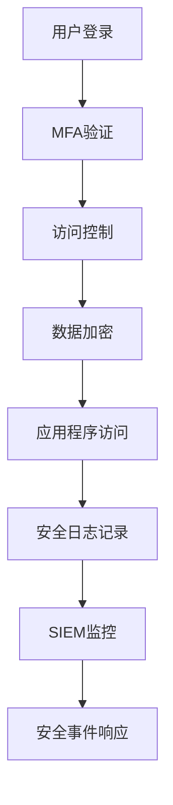

                 

## 文章标题：云安全：保护云环境中的数据和应用

在当今数字化时代，云计算已经成为企业数字化转型的核心驱动力。然而，随着云环境的广泛应用，安全威胁也日益增加。保护云环境中的数据和应用，已经成为企业面临的重要挑战。《云安全：保护云环境中的数据和应用》这本书旨在帮助读者深入了解云安全的核心概念、技术手段和最佳实践，从而构建一个安全可靠的云环境。

关键词：云安全、数据保护、应用安全、安全技术、最佳实践

摘要：本文将从云安全的重要性、基础知识、安全策略与实施、技术手段、网络安全、数据安全、应用安全、漏洞修复与事故响应、安全监控与审计以及案例研究等方面，逐步解析如何保护云环境中的数据和应用。通过对核心概念、技术原理、最佳实践的详细阐述，帮助读者构建全面的云安全认知，为企业提供有效的云安全解决方案。

## 引言

云计算的兴起，使得企业能够更加灵活、高效地管理和使用资源。从最初的IaaS（基础设施即服务）到PaaS（平台即服务），再到SaaS（软件即服务），云计算的服务模式不断演进。云环境为企业提供了丰富的计算、存储、网络等资源，使得企业能够快速响应市场需求，降低运营成本，提高业务效率。然而，随着云环境的广泛应用，安全问题也日益凸显。

云安全是指保护云环境中的数据、应用程序和基础设施免受各种威胁和攻击的措施。云安全涵盖了多个层面，包括数据安全、应用安全、网络安全、身份认证和访问控制等。随着云服务的普及，云安全已经成为企业数字化转型过程中不可忽视的重要环节。

### 云安全的重要性

云安全的重要性体现在以下几个方面：

1. **数据保护**：企业将大量敏感数据存储在云环境中，这些数据包括客户信息、财务数据、业务计划等。如果没有有效的安全措施，这些数据可能会被泄露、篡改或盗用，导致严重的商业损失和法律风险。

2. **业务连续性**：云服务是企业业务运作的重要组成部分。如果云环境遭到攻击或出现故障，可能会导致业务中断，影响企业的运营效率和客户满意度。

3. **合规要求**：随着数据保护法规的不断加强，企业需要满足各种合规要求，如GDPR（欧盟通用数据保护条例）和CCPA（加利福尼亚消费者隐私法案）。云安全措施有助于企业满足这些法规要求。

4. **品牌信誉**：数据泄露和安全事件会对企业的品牌形象和公众信任产生负面影响。有效的云安全措施有助于维护企业的品牌信誉。

### 当前云安全面临的挑战

尽管云安全在企业发展中至关重要，但当前云安全仍然面临一些挑战：

1. **安全责任划分**：在云环境中，服务提供商（Cloud Service Provider，CSP）和用户之间的安全责任划分往往不明确，这可能导致安全漏洞和责任推卸。

2. **技术复杂性**：云安全涉及到多种技术，如虚拟化、容器化、网络功能虚拟化等，这些技术复杂且不断演进，使得安全措施的实施和维护变得困难。

3. **安全盲区**：由于云环境的动态性和分布式特性，安全盲区和安全漏洞难以完全避免。

4. **人才短缺**：云安全领域需要具备专业知识和技能的人才，但当前人才供给不足，导致企业难以招聘到合适的安全人员。

综上所述，云安全对于企业的数字化转型和持续发展至关重要。理解和应对云安全挑战，制定和实施有效的安全策略，是企业实现安全可靠云环境的关键。

### 云安全的核心概念和架构

要深入理解云安全，首先需要了解其核心概念和架构。云安全的核心概念包括数据安全、应用安全、网络安全、身份认证和访问控制等。这些概念相互关联，共同构成了云安全的基础架构。

#### 数据安全

数据安全是云安全的重要组成部分，涉及到如何保护存储在云环境中的数据免受泄露、篡改和丢失。数据安全的主要措施包括：

1. **数据加密**：通过加密技术，将敏感数据转换为不可读的密文，确保数据在传输和存储过程中不被窃取或篡改。

   ```python
   from cryptography.fernet import Fernet

   key = Fernet.generate_key()
   cipher_suite = Fernet(key)

   # 加密
   encrypted_message = cipher_suite.encrypt(b"Secret Message")
   # 解密
   decrypted_message = cipher_suite.decrypt(encrypted_message)
   ```

2. **访问控制**：通过访问控制机制，限制对数据的访问权限，确保只有授权用户才能访问数据。

   ```python
   from typing import Dict

   access_control_rules: Dict[str, List[str]] = {
       "user1": ["read", "write"],
       "user2": ["read"],
   }
   ```

3. **数据备份与恢复**：定期备份数据，并在数据丢失或损坏时能够快速恢复，确保数据的安全性和可用性。

#### 应用安全

应用安全涉及如何保护运行在云环境中的应用程序免受各种攻击和漏洞的影响。应用安全的主要措施包括：

1. **漏洞扫描与修复**：定期对应用程序进行漏洞扫描，及时发现和修复安全漏洞。

   ```python
   import vulscan

   vulnerabilities = vulscan.scan_app("my_app")
   for vuln in vulnerabilities:
       vulscan.fix_vulnerability(vuln)
   ```

2. **安全测试**：对应用程序进行安全测试，包括静态代码分析、动态代码分析和渗透测试等，以发现潜在的安全风险。

   ```python
   import safety_tester

   safety_tester.static_analysis("my_app")
   safety_tester.dynamic_analysis("my_app")
   safety_tester.pen_test("my_app")
   ```

#### 网络安全

网络安全涉及保护云环境中的网络资源免受网络攻击和恶意行为的影响。网络安全的主要措施包括：

1. **防火墙与入侵检测系统**：通过防火墙和入侵检测系统，监控网络流量，防止恶意流量进入云环境。

   ```python
   import firewall
   import intrusion_detection

   firewall.apply_rules()
   intrusion_detection.monitor_traffic()
   ```

2. **虚拟私有云（VPC）**：在云环境中构建虚拟私有云，确保网络资源的安全隔离。

#### 身份认证与访问控制

身份认证与访问控制是确保只有授权用户才能访问云资源的关键措施。主要措施包括：

1. **多因素认证**：通过多因素认证，增加账户安全性，防止恶意攻击。

   ```python
   import multi_factor_auth

   multi_factor_auth.authenticate(user, password, token)
   ```

2. **单点登录（SSO）**：通过单点登录，简化用户登录流程，同时确保访问控制。

   ```python
   import sso

   sso.login(username, password)
   ```

#### 云安全架构

云安全架构通常包括以下几个层次：

1. **基础设施安全**：保护云环境的基础设施，如物理服务器、网络设备等。

2. **平台安全**：保护云平台自身，包括操作系统、虚拟化层等。

3. **应用安全**：保护运行在云平台上的应用程序。

4. **数据安全**：保护存储在云环境中的数据。

5. **安全运营**：包括安全监控、事故响应和安全审计等。

通过理解这些核心概念和架构，企业可以更有效地构建和实施云安全策略，保护云环境中的数据和应用。

### 云安全策略的制定与实施

在构建云安全体系时，制定和实施有效的安全策略是至关重要的。一个全面的云安全策略不仅能够防止潜在的安全威胁，还能够提高企业的安全意识和响应能力。以下步骤将详细说明如何制定和实施云安全策略。

#### 第一步：风险评估

风险识别是制定云安全策略的第一步。通过评估可能面临的风险，企业可以明确哪些部分最需要保护，并制定相应的安全措施。

1. **识别资产**：首先，企业需要识别所有的资产，包括数据、应用程序、基础设施等。

2. **评估威胁**：识别可能威胁这些资产的威胁，如数据泄露、DDoS攻击、恶意软件等。

3. **评估脆弱性**：分析系统的脆弱性，如未修复的漏洞、配置错误等。

4. **确定风险优先级**：根据威胁的严重性和资产的重要性，确定风险的优先级。

#### 第二步：制定安全目标

在了解风险后，企业需要制定具体的安全目标。安全目标应明确、可衡量，并符合企业的业务需求。

1. **保护数据**：确保敏感数据的安全存储和传输。

2. **保护应用程序**：确保应用程序的完整性和可用性。

3. **保障业务连续性**：制定灾难恢复计划，确保业务在发生故障时能够迅速恢复。

4. **提高安全意识**：定期培训员工，提高他们的安全意识和响应能力。

#### 第三步：选择安全技术和工具

根据安全目标和风险分析结果，选择合适的安全技术和工具。以下是一些常用的技术和工具：

1. **加密技术**：用于保护数据的传输和存储。

2. **防火墙和入侵检测系统**：用于监控和防止网络攻击。

3. **多因素认证**：用于增强身份认证的安全性。

4. **安全信息与事件管理系统（SIEM）**：用于监控和分析安全事件。

#### 第四步：制定安全政策和流程

安全政策和流程是确保安全措施有效执行的基础。

1. **制定安全政策**：明确企业对安全的立场、要求和责任。

2. **制定安全流程**：包括安全审计、漏洞管理、安全事件响应等。

#### 第五步：实施安全措施

在制定安全策略后，需要将其付诸实施。

1. **部署安全技术**：根据选择的工具和技术，部署相应的安全措施。

2. **培训员工**：确保所有员工了解并遵守安全政策和流程。

3. **定期测试**：通过模拟攻击和安全测试，验证安全措施的有效性。

#### 第六步：监控和改进

云安全不是一次性的工作，而是一个持续的过程。

1. **监控安全事件**：通过安全信息与事件管理系统（SIEM）等工具，实时监控安全事件。

2. **定期审计**：对安全措施进行定期审计，确保其符合最新的安全标准。

3. **持续改进**：根据审计结果和新兴的安全威胁，不断改进安全策略和措施。

#### 案例分析

以某大型电商平台为例，该平台在制定云安全策略时，采取了以下步骤：

1. **风险评估**：识别了包括客户数据、交易数据、库存数据在内的关键资产，评估了数据泄露、DDoS攻击等主要风险。

2. **制定安全目标**：确保客户数据在传输和存储过程中的安全，保障平台的持续可用性。

3. **选择安全技术和工具**：部署了加密技术、防火墙、多因素认证和SIEM系统。

4. **制定安全政策和流程**：明确了数据加密和传输的标准，制定了安全事件响应流程。

5. **实施安全措施**：在实际部署中，平台对员工进行了安全培训，并定期进行安全测试。

6. **监控和改进**：通过SIEM系统实时监控安全事件，并根据审计结果不断改进安全措施。

通过这些步骤，该电商平台成功地构建了一个安全可靠的云环境，确保了业务的安全和持续运营。

综上所述，制定和实施有效的云安全策略需要全面的风险评估、明确的安全目标、选择合适的技术和工具、制定严格的政策和流程，以及持续监控和改进。企业应根据自身情况，制定符合实际需求的安全策略，从而保护云环境中的数据和应用。

### 云安全技术手段

在构建云安全体系的过程中，选择合适的技术手段至关重要。云安全技术手段涵盖了从虚拟化安全到应用安全等多个方面。以下是几种常见的技术手段及其应用场景：

#### 虚拟化安全

虚拟化技术是云计算的核心，而虚拟化安全则是确保虚拟化环境安全的关键。虚拟化安全主要包括以下几个方面：

1. **隔离与隔离性验证**：通过虚拟化层提供硬件级别的隔离，确保虚拟机（VM）之间的数据不发生泄露。

   ```mermaid
   graph TD
   A[虚拟化层] --> B[硬件隔离]
   B --> C[虚拟机A]
   B --> D[虚拟机B]
   ```

2. **虚拟机监控与审计**：实时监控虚拟机活动，记录所有操作，以便在发生安全事件时进行审计。

   ```mermaid
   graph TD
   A[虚拟化监控] --> B[虚拟机活动记录]
   B --> C{是否安全事件}
   C -->|是| D[审计与报警]
   C -->|否| E[继续监控]
   ```

3. **虚拟化层漏洞管理**：定期扫描和修补虚拟化层中的漏洞，确保虚拟化环境的稳定性。

   ```python
   import virtualization_manager

   vulnerabilities = virtualization_manager.scan()
   for vuln in vulnerabilities:
       virtualization_manager.fix(vuln)
   ```

#### 容器安全

容器技术如Docker大大简化了应用的部署和运行，但同时也带来了新的安全挑战。容器安全的关键措施包括：

1. **容器镜像扫描**：在部署容器前，对容器镜像进行扫描，检测潜在的安全漏洞。

   ```mermaid
   graph TD
   A[容器镜像] --> B[扫描工具]
   B --> C{是否有漏洞}
   C -->|是| D[拒绝部署]
   C -->|否| E[部署容器]
   ```

2. **容器网络隔离**：通过容器网络隔离技术，确保容器之间的网络通信不会导致安全风险。

   ```mermaid
   graph TD
   A[容器A] --> B[容器网络]
   B --> C[容器B]
   C --> D[防火墙规则]
   ```

3. **容器权限管理**：限制容器的权限，确保容器只能执行其预定义的任务，防止容器被用于恶意目的。

   ```python
   import container_manager

   container_manager.set_permissions("my_container", ["read", "write"], ["execute"])
   ```

#### 云访问控制

云访问控制是保护云资源的关键技术，主要包括以下措施：

1. **访问控制列表（ACL）**：通过ACL定义用户和资源的访问权限，确保只有授权用户可以访问特定资源。

   ```mermaid
   graph TD
   A[用户] --> B[ACL]
   B --> C[资源]
   C --> D{权限检查}
   ```

2. **多因素认证（MFA）**：通过MFA增加账户安全性，防止未授权访问。

   ```python
   import multi_factor_auth

   multi_factor_auth.authenticate(user, password, token)
   ```

3. **角色与权限分离（RBAC）**：通过RBAC将用户角色与权限分离，确保权限最小化原则。

   ```python
   import rbac

   rbac.assign_role("admin", ["read", "write", "delete"])
   rbac.assign_role("user", ["read"])
   ```

#### 网络安全

网络安全是保护云环境的关键，主要包括以下措施：

1. **防火墙**：通过防火墙控制网络流量，防止未经授权的访问。

   ```mermaid
   graph TD
   A[外部网络] --> B[防火墙]
   B --> C[内部网络]
   ```

2. **入侵检测系统（IDS）**：实时监控网络流量，检测和响应潜在的安全威胁。

   ```mermaid
   graph TD
   A[网络流量] --> B[IDS]
   B --> C{是否有威胁}
   C -->|是| D[报警与阻断]
   C -->|否| E[继续监控]
   ```

3. **虚拟私有云（VPC）**：通过VPC构建安全隔离的网络环境，确保资源的安全。

   ```mermaid
   graph TD
   A[VPC] --> B[子网]
   B --> C[实例]
   ```

#### 数据安全

数据安全是云安全的重要组成部分，主要包括以下措施：

1. **数据加密**：通过加密技术保护数据的传输和存储。

   ```python
   from cryptography.fernet import Fernet

   key = Fernet.generate_key()
   cipher_suite = Fernet(key)

   # 加密
   encrypted_message = cipher_suite.encrypt(b"Secret Message")
   # 解密
   decrypted_message = cipher_suite.decrypt(encrypted_message)
   ```

2. **数据备份与恢复**：定期备份数据，确保在数据丢失或损坏时能够快速恢复。

   ```python
   import backup_manager

   backup_manager.backup("my_data")
   backup_manager.restore("my_data_backup")
   ```

3. **访问控制**：通过访问控制机制，限制对数据的访问权限。

   ```python
   import access_control

   access_control.set_permissions("my_data", ["read"], ["write"])
   ```

通过以上技术手段，企业可以构建一个全面、有效的云安全体系，保护云环境中的数据和应用。每种技术都有其特定的应用场景和优势，企业应根据自身需求选择合适的技术，并进行合理部署和运维。

### 网络安全在云环境中的应用

在云环境中，网络安全是确保数据和应用程序安全的关键环节。随着云计算技术的不断发展和普及，企业对网络安全的需求也日益增加。以下将从云网络架构、DDoS防护以及安全防护工具等方面，详细探讨网络安全在云环境中的应用。

#### 云网络架构

云网络架构是云安全的基础。一个有效的云网络架构应该能够实现资源的灵活分配和高效管理，同时确保网络的安全性。以下是一些关键的云网络架构组件：

1. **虚拟私有云（VPC）**：VPC是构建在云服务提供商基础架构上的虚拟网络。通过VPC，企业可以创建一个隔离的云环境，实现内部网络资源的统一管理和安全控制。

2. **子网**：在VPC内部，可以根据不同的功能和安全要求创建多个子网。例如，可以创建一个公网子网用于对外提供服务，另一个私网子网用于内部业务处理。

3. **网关**：网关是连接VPC和外部网络的入口点，用于控制流量的进出。网关可以配置防火墙规则和访问控制列表（ACL），确保网络流量的安全。

4. **路由表**：路由表用于定义数据包在网络中的转发路径。通过合理配置路由表，可以实现不同子网之间的数据流动，同时确保数据包的安全传输。

#### DDoS防护

分布式拒绝服务（DDoS）攻击是一种常见的安全威胁，攻击者通过发送大量无效请求，使得目标系统资源耗尽，导致正常服务无法访问。云环境中的DDoS防护主要包括以下措施：

1. **流量监控与识别**：通过实时监控网络流量，识别异常流量模式，如突发流量、特定IP地址的高频率请求等。这可以通过流量监控工具和入侵检测系统（IDS）实现。

2. **流量清洗**：一旦检测到DDoS攻击，可以将流量引导到专门的清洗设备或服务，对流量进行过滤和清洗，去除恶意流量，保护目标系统。

3. **弹性扩展**：云环境具有弹性扩展的特性，可以通过自动扩容和负载均衡，将流量分散到多个节点，避免单点过载。

4. **黑名单和白名单**：通过配置黑名单和白名单，禁止或允许特定IP地址的访问，有效防止恶意流量进入系统。

#### 安全防护工具

在云环境中，有多种安全防护工具可以帮助企业保护网络资源，以下是一些常用的工具：

1. **防火墙**：防火墙是网络安全的基础设施，用于监控和过滤网络流量。在云环境中，防火墙可以配置在VPC网关或子网入口，根据安全策略控制流量。

2. **入侵检测系统（IDS）**：IDS用于实时监控网络流量，识别潜在的入侵行为。通过配置IDS规则，可以检测和响应各种网络攻击。

3. **入侵防御系统（IPS）**：IPS是IDS的高级形式，不仅能够检测入侵行为，还能自动采取防御措施，如阻断攻击流量。

4. **安全信息与事件管理系统（SIEM）**：SIEM用于收集、监控和分析安全事件，提供全面的视图和实时警报，帮助企业快速响应安全威胁。

#### 实践案例

以某电子商务平台为例，该平台在构建云网络架构时，采取了以下措施：

1. **VPC部署**：创建一个VPC，将内部系统和外部服务隔离，实现网络资源的统一管理和安全控制。

2. **子网划分**：在VPC内部划分公网子网和私网子网，分别用于对外提供服务和处理内部业务。

3. **防火墙配置**：在VPC网关和子网入口配置防火墙，设置允许和拒绝的流量规则，确保网络流量的安全性。

4. **DDoS防护**：部署DDoS防护服务，实时监控流量并自动清洗恶意流量，避免系统过载。

5. **SIEM监控**：部署SIEM系统，监控和分析安全事件，提供实时警报和报告，确保及时发现和响应安全威胁。

通过以上措施，该电子商务平台成功构建了一个安全可靠的云网络环境，保障了业务的持续运营和数据的安全。

总之，网络安全在云环境中的应用至关重要。通过合理的网络架构设计、有效的DDoS防护以及多样化的安全防护工具，企业可以构建一个安全可靠的云环境，确保数据和应用程序的安全。

### 数据安全在云环境中的重要性

在云环境中，数据安全是保障业务连续性和合规性的核心要素。随着企业将越来越多的敏感数据存储在云端，如何保护这些数据免受各种威胁和攻击，成为了一个迫切需要解决的问题。

#### 数据泄露的风险

数据泄露是云环境中最为常见和严重的安全威胁之一。敏感数据，如客户信息、财务记录、业务计划等，一旦泄露，不仅可能导致商业损失，还可能带来法律风险和声誉损害。例如，2017年的Facebook数据泄露事件，导致超过5千万用户的个人信息被非法获取，直接影响了Facebook的品牌形象和用户信任。

#### 数据加密的重要性

数据加密是保护数据安全的关键技术手段。通过加密，将敏感数据转换为只有授权用户才能解密的密文，确保数据在传输和存储过程中不被窃取或篡改。常用的加密技术包括对称加密和非对称加密。

1. **对称加密**：对称加密算法使用相同的密钥进行加密和解密。常见的对称加密算法有AES（高级加密标准）。

   ```python
   from cryptography.fernet import Fernet

   key = Fernet.generate_key()
   cipher_suite = Fernet(key)

   # 加密
   encrypted_message = cipher_suite.encrypt(b"Secret Message")
   # 解密
   decrypted_message = cipher_suite.decrypt(encrypted_message)
   ```

2. **非对称加密**：非对称加密算法使用一对密钥，公钥加密，私钥解密。常见的非对称加密算法有RSA（Rivest-Shamir-Adleman）。

   ```python
   from cryptography.hazmat.primitives.asymmetric import rsa
   from cryptography.hazmat.primitives import serialization

   private_key = rsa.generate_private_key(
       public_exponent=65537,
       key_size=2048,
   )

   public_key = private_key.public_key()

   encrypted_message = public_key.encrypt(
       b"Secret Message",
       32
   )

   decrypted_message = private_key.decrypt(
       encrypted_message
   )
   ```

#### 数据备份与恢复

数据备份与恢复是确保数据安全的重要措施。通过定期备份数据，可以在数据丢失或损坏时快速恢复，减少业务中断时间。

1. **数据备份**：备份可以分为全备份、增量备份和差异备份。全备份复制所有数据，增量备份仅复制自上次备份以来发生变化的数据，差异备份复制自上次全备份以来发生变化的数据。

2. **数据恢复**：在发生数据丢失或损坏时，可以恢复备份的数据，确保业务的连续性。

   ```python
   import backup_manager

   backup_manager.backup("my_data")
   backup_manager.restore("my_data_backup")
   ```

#### 数据安全策略

为了确保数据安全，企业需要制定全面的数据安全策略，包括数据加密、访问控制、备份与恢复等措施。

1. **数据分类**：根据数据的敏感程度和重要性，对数据分类，制定不同的安全策略。

2. **访问控制**：通过访问控制机制，限制对数据的访问权限，确保只有授权用户才能访问数据。

   ```python
   import access_control

   access_control.set_permissions("my_data", ["read"], ["write"])
   ```

3. **数据监控**：实时监控数据访问和操作，及时发现和处理异常行为。

4. **定期审计**：定期对数据安全措施进行审计，确保其符合最新的安全标准和合规要求。

总之，数据安全在云环境中至关重要。通过数据加密、数据备份与恢复、访问控制等措施，企业可以构建一个安全可靠的数据保护体系，确保数据的完整性和安全性。

### 应用安全在云环境中的关键要素

在云环境中，应用安全是保障业务连续性和用户信任的关键因素。随着云服务的广泛应用，应用程序面临的安全威胁也越来越复杂。以下将从应用安全测试、安全设计等方面，详细探讨应用安全在云环境中的关键要素。

#### 应用安全测试

应用安全测试是确保应用程序安全的重要环节，主要包括以下几种类型：

1. **静态代码分析（SAST）**：静态代码分析在代码编写阶段进行，通过分析代码结构和语法，检测潜在的安全漏洞。这种方法不需要运行应用程序，但只能检测代码中的安全问题。

   ```python
   import safety_tester

   safety_tester.static_analysis("my_app")
   ```

2. **动态代码分析（DAST）**：动态代码分析在应用程序运行时进行，通过模拟攻击和漏洞扫描，检测运行中的应用程序中的安全问题。这种方法可以检测实际运行中的应用程序的安全漏洞。

   ```python
   import safety_tester

   safety_tester.dynamic_analysis("my_app")
   ```

3. **渗透测试（Pen Testing）**：渗透测试是一种模拟攻击者行为的测试方法，通过实际攻击应用程序，发现潜在的安全漏洞。这种方法通常由专业的安全团队执行。

   ```python
   import penetration_tester

   penetration_tester.run("my_app")
   ```

4. **自动化测试**：通过自动化工具，如SonarQube、Checkmarx等，定期对应用程序进行安全测试，提高测试效率和覆盖范围。

   ```python
   import automation_tester

   automation_tester.run("my_app")
   ```

#### 安全设计

安全设计是确保应用程序在设计和开发阶段就具备安全特性的关键。以下是一些重要的安全设计原则：

1. **最小权限原则**：应用程序应遵循最小权限原则，只授予必要的权限，避免权限过大的风险。

   ```python
   import permission_manager

   permission_manager.set_permissions("my_app", ["read"], ["write", "delete"])
   ```

2. **安全编码**：在开发应用程序时，遵循安全编码规范，避免常见的编程漏洞，如SQL注入、XSS攻击等。

3. **会话管理**：确保会话管理的安全性，如使用HTTPS协议保护会话数据，设置会话超时时间，防止会话劫持。

4. **数据保护**：对敏感数据进行加密存储和传输，确保数据在传输和存储过程中不被窃取或篡改。

   ```python
   from cryptography.fernet import Fernet

   key = Fernet.generate_key()
   cipher_suite = Fernet(key)

   # 加密
   encrypted_message = cipher_suite.encrypt(b"Secret Message")
   # 解密
   decrypted_message = cipher_suite.decrypt(encrypted_message)
   ```

5. **安全配置**：确保应用程序的配置安全，如使用安全的配置文件，避免配置错误导致的安全漏洞。

6. **代码审计**：定期对应用程序的代码进行审计，发现和修复潜在的安全漏洞。

#### 实践案例

以某在线银行应用为例，该应用在确保安全方面采取了以下措施：

1. **静态代码分析**：通过SonarQube对应用程序的代码进行静态分析，检测潜在的安全漏洞。

2. **动态代码分析**：使用OWASP ZAP对应用程序进行动态代码分析，模拟攻击检测安全漏洞。

3. **渗透测试**：聘请专业安全团队对应用程序进行渗透测试，发现和修复安全漏洞。

4. **最小权限原则**：确保应用程序只拥有必要的权限，避免权限过大的风险。

5. **会话管理**：使用HTTPS协议保护会话数据，设置会话超时时间，防止会话劫持。

6. **数据保护**：对敏感数据进行加密存储和传输，确保数据安全。

通过以上措施，该在线银行应用成功构建了一个安全可靠的应用程序，保障了用户的资金安全。

总之，应用安全在云环境中至关重要。通过应用安全测试和安全设计，企业可以确保应用程序的安全性和可靠性，为用户提供安全、可信的服务。

### 漏洞修复与事故响应

在云环境中，漏洞管理和事故响应是确保系统安全和业务连续性的关键环节。及时识别、修复漏洞和有效应对事故，能够最大限度地减少安全事件对企业运营和声誉的影响。以下将从漏洞管理、事故响应和安全测试等方面，详细探讨漏洞修复与事故响应的实践。

#### 漏洞管理

漏洞管理是发现、评估、修复和监控漏洞的过程。以下是一些关键步骤：

1. **漏洞识别**：通过漏洞扫描工具和持续监控，发现潜在的安全漏洞。常见的漏洞扫描工具有Nessus、OpenVAS等。

   ```python
   import vulnerability_manager

   vulnerabilities = vulnerability_manager.scan("my_system")
   for vuln in vulnerabilities:
       print(vuln["name"], vuln["severity"])
   ```

2. **漏洞评估**：对发现的漏洞进行优先级评估，确定哪些漏洞需要立即修复，哪些可以在后续处理。

   ```python
   import vulnerability_manager

   vulnerability_manager.assess(vulnerabilities)
   ```

3. **漏洞修复**：根据漏洞的严重性和业务优先级，及时修复漏洞。修复措施包括补丁更新、配置更改等。

   ```python
   import vulnerability_manager

   vulnerability_manager.fix(vulnerabilities)
   ```

4. **漏洞监控**：持续监控已修复的漏洞，确保修复措施有效，并防止新漏洞的产生。

   ```python
   import vulnerability_manager

   vulnerability_manager.monitor("my_system")
   ```

#### 事故响应

事故响应是在发现安全事件时，采取的紧急措施和行动。以下是一些关键步骤：

1. **事故识别**：通过监控系统和用户报告，及时发现安全事件。例如，使用SIEM系统监控网络流量、日志和异常行为。

   ```python
   import incident_manager

   incidents = incident_manager.monitor()
   for incident in incidents:
       print(incident["type"], incident["description"])
   ```

2. **事故评估**：对安全事件进行初步评估，确定事件的严重性和影响范围。

   ```python
   import incident_manager

   incident_manager.assess(incidents)
   ```

3. **应急响应**：根据事故响应计划，采取紧急措施，如隔离受影响的系统、阻断攻击流量等。

   ```python
   import incident_manager

   incident_manager.respond(incidents)
   ```

4. **事故恢复**：在紧急响应后，采取措施恢复受影响的服务和系统，确保业务的连续性。

   ```python
   import incident_manager

   incident_manager.recover(incidents)
   ```

5. **事故报告**：对事故进行详细调查和分析，编写事故报告，总结经验教训，改进安全策略和流程。

   ```python
   import incident_manager

   incident_manager.report(incidents)
   ```

#### 安全测试

安全测试是预防安全事件的重要手段。以下是一些常用的安全测试方法：

1. **渗透测试**：模拟攻击者行为，测试系统的安全防护能力。渗透测试可以分为黑盒测试、白盒测试和灰盒测试。

   ```python
   import penetration_tester

   penetration_tester.run("my_system")
   ```

2. **漏洞扫描**：定期对系统进行漏洞扫描，识别潜在的安全漏洞。漏洞扫描可以分为静态漏洞扫描和动态漏洞扫描。

   ```python
   import vulnerability_manager

   vulnerabilities = vulnerability_manager.scan("my_system")
   for vuln in vulnerabilities:
       print(vuln["name"], vuln["severity"])
   ```

3. **安全演练**：通过模拟安全事件，测试企业的应急响应能力和流程。安全演练可以包括网络攻击、数据泄露等场景。

   ```python
   import incident_manager

   incident_manager.simulate("my_system")
   ```

#### 案例分析

以某电商平台为例，该平台在漏洞管理和事故响应方面采取了以下措施：

1. **漏洞管理**：
   - 定期使用Nessus进行漏洞扫描，发现系统中的安全漏洞。
   - 对发现的漏洞进行评估和分类，根据严重程度进行优先级排序。
   - 及时发布补丁和更新，修复漏洞。
   - 持续监控已修复的漏洞，确保补丁生效。

2. **事故响应**：
   - 通过SIEM系统实时监控网络流量和日志，发现异常行为。
   - 制定详细的应急预案，包括紧急联系人、应急流程和恢复计划。
   - 在发生安全事件时，立即启动应急预案，隔离受影响系统，阻断攻击流量。
   - 进行事故调查，编写事故报告，总结经验教训。

3. **安全测试**：
   - 定期进行渗透测试，测试系统的安全防护能力。
   - 使用OpenVAS进行动态漏洞扫描，识别潜在的安全威胁。
   - 安排安全演练，测试平台的应急响应能力和流程。

通过上述措施，该电商平台成功地构建了一个高效、全面的漏洞修复和事故响应体系，保障了业务的持续运营和数据的安全。

总之，漏洞修复与事故响应是云环境安全的重要组成部分。通过有效的漏洞管理、事故响应和安全测试，企业可以及时识别和修复安全漏洞，确保系统的安全和业务的连续性。

### 安全监控与审计

在云环境中，安全监控与审计是确保云环境安全性和合规性的重要手段。通过实时监控、审计和日志管理，企业可以及时发现潜在的安全威胁，确保云环境的稳定性和可靠性。

#### 实时监控

实时监控是云安全监控的核心，通过监控工具和系统，可以实时捕获和响应各种安全事件。以下是一些关键的实时监控措施：

1. **流量监控**：实时监控网络流量，识别异常流量模式，如DDoS攻击、恶意流量等。

   ```python
   import traffic_monitor

   traffic_monitor.start_monitoring("my_network")
   ```

2. **日志监控**：实时收集和分析系统日志，识别异常行为和潜在的安全威胁。

   ```python
   import log_monitor

   log_monitor.start_monitoring("my_system_logs")
   ```

3. **安全事件响应**：在发现安全事件时，能够快速响应，采取紧急措施，如隔离受影响的系统、阻断攻击流量等。

   ```python
   import incident_manager

   incident_manager.handle_incident("my_system", "DDoS Attack")
   ```

#### 审计

审计是确保云环境安全性和合规性的重要手段。通过审计，企业可以验证安全策略和措施的执行情况，发现潜在的安全漏洞和合规问题。以下是一些关键的审计措施：

1. **安全策略审计**：定期审计安全策略，确保其符合最新的安全标准和法规要求。

   ```python
   import policy_auditor

   policy_auditor.audit("my_security_policy")
   ```

2. **配置审计**：审计系统配置，确保配置符合安全最佳实践，没有配置错误或漏洞。

   ```python
   import config_auditor

   config_auditor.audit("my_system_config")
   ```

3. **数据审计**：审计数据访问和操作记录，确保数据的安全性和合规性。

   ```python
   import data_auditor

   data_auditor.audit("my_data_access_logs")
   ```

#### 日志管理

日志管理是安全监控和审计的基础。通过有效的日志管理，企业可以收集、存储、分析和监控各种安全事件和操作记录。以下是一些关键的日志管理措施：

1. **日志收集**：从各个系统和设备收集日志数据，确保全面覆盖。

   ```python
   import log_collector

   log_collector.collect_logs("my_system_logs")
   ```

2. **日志存储**：将日志数据存储在安全、可靠的存储介质中，确保日志数据的持久性和可查性。

   ```python
   import log_storage

   log_storage.store_logs("my_system_logs")
   ```

3. **日志分析**：通过日志分析工具，对日志数据进行分析，识别潜在的安全威胁和异常行为。

   ```python
   import log_analyzer

   log_analyzer.analyze_logs("my_system_logs")
   ```

#### 实践案例

以某金融企业为例，该企业在安全监控与审计方面采取了以下措施：

1. **实时监控**：
   - 使用流量监控工具，实时监控网络流量，识别异常流量模式。
   - 使用日志监控工具，实时收集和分析系统日志，及时发现潜在的安全威胁。

2. **审计**：
   - 定期审计安全策略和配置，确保符合法规要求。
   - 审计数据访问记录，确保数据的安全性和合规性。

3. **日志管理**：
   - 从各个系统和设备收集日志数据，存储在安全日志存储系统中。
   - 使用日志分析工具，对日志数据进行实时分析和监控。

通过上述措施，该金融企业成功构建了一个高效、全面的安全监控与审计体系，保障了云环境的安全和合规性。

总之，安全监控与审计是云环境安全的重要组成部分。通过实时监控、审计和日志管理，企业可以及时发现潜在的安全威胁，确保云环境的稳定性和可靠性。

### 案例研究：云安全在金融科技公司的成功应用

金融科技（FinTech）公司在云安全方面面临着巨大的挑战，因为它们需要保护大量的敏感数据和遵守严格的合规要求。本文将探讨一家金融科技公司如何通过有效的云安全措施，成功保护其云环境中的数据和应用程序。

#### 背景介绍

该公司是一家提供在线支付和金融服务解决方案的公司，其业务涵盖全球多个国家和地区。随着业务的扩展和云计算的普及，该公司将大量核心业务系统迁移到了云环境中，包括支付处理、客户关系管理、交易记录等。然而，云环境的动态性和复杂性增加了安全管理的难度，同时也带来了新的安全威胁。

#### 核心概念与联系

为了保护其云环境，该公司采用了以下核心安全概念：

1. **数据加密**：确保敏感数据在传输和存储过程中的安全。
2. **访问控制**：通过身份认证和访问控制机制，确保只有授权人员才能访问敏感数据。
3. **多因素认证（MFA）**：增加账户安全性，防止未授权访问。
4. **安全信息与事件管理系统（SIEM）**：实时监控和响应安全事件。

这些概念之间相互关联，共同构建了一个全面的安全体系。

#### Mermaid流程图

以下是一个简化的Mermaid流程图，展示了该公司云安全体系的整体架构：



#### 核心算法原理讲解

1. **数据加密**：该公司使用AES-256加密算法对敏感数据进行加密。加密过程如下：

   ```python
   from cryptography.fernet import Fernet

   key = Fernet.generate_key()
   cipher_suite = Fernet(key)

   # 加密
   encrypted_data = cipher_suite.encrypt(b"Sensitive Data")
   # 解密
   decrypted_data = cipher_suite.decrypt(encrypted_data)
   ```

2. **访问控制**：该公司采用RBAC（基于角色的访问控制）机制，确保用户只能访问其授权的资源。访问控制规则如下：

   ```python
   from typing import Dict

   access_rules: Dict[str, List[str]] = {
       "admin": ["read", "write", "delete"],
       "user": ["read"],
   }
   ```

3. **多因素认证（MFA）**：该公司使用短信验证码、邮箱验证等多种方式进行MFA。MFA流程如下：

   ```python
   from multi_factor_auth import MultiFactorAuth

   mfa = MultiFactorAuth()
   mfa.authenticate("user", "password", "sms_code")
   ```

4. **SIEM监控**：该公司部署了SIEM系统，实时监控和记录安全事件。SIEM监控流程如下：

   ```python
   import siem

   siem.start_monitoring(["network_traffic", "application_logs", "system_logs"])
   ```

#### 数学模型和公式

1. **加密密钥生成**：在数据加密过程中，需要生成加密密钥。以下是一个简单的加密密钥生成模型：

   ```latex
   \text{Key} = \text{SHA-256}(\text{Password} + \text{Salt})
   ```

2. **访问控制策略**：在访问控制中，可以使用访问控制矩阵（Access Control Matrix）来表示用户与资源的访问权限：

   ```latex
   \text{ACM} = \begin{bmatrix}
   \text{User}_1 & \text{Resource}_1 & \text{Permission} \\
   \text{User}_1 & \text{Resource}_2 & \text{Permission} \\
   \vdots & \vdots & \vdots \\
   \text{User}_n & \text{Resource}_n & \text{Permission}
   \end{bmatrix}
   ```

#### 详细讲解与举例说明

1. **数据加密**：假设一个用户尝试访问一个敏感数据库，数据库中的数据使用AES-256加密。加密过程如下：

   ```plaintext
   用户输入密码 -> 密码 + 盐 -> SHA-256加密 -> 加密密钥
   加密密钥用于AES-256加密敏感数据
   ```

2. **访问控制**：假设一个管理员（admin）试图访问某个资源，系统会根据访问控制策略进行检查：

   ```plaintext
   管理员尝试访问资源 -> 系统检查访问控制矩阵
   访问控制矩阵显示管理员有读、写和删除权限 -> 允许访问
   ```

3. **多因素认证（MFA）**：在一个用户登录系统时，系统会要求用户提供多种身份验证因素：

   ```plaintext
   用户输入用户名和密码 -> 系统发送短信验证码或邮箱验证链接
   用户输入验证码或点击验证链接 -> 系统确认身份验证 -> 允许登录
   ```

4. **SIEM监控**：假设网络中出现异常流量，SIEM系统会实时监控并生成报警：

   ```plaintext
   网络流量异常 -> SIEM系统检测到异常 -> 发送报警通知 -> 管理员响应并采取措施
   ```

#### 实际案例分析与详细讲解

以一个实际案例为例，该公司在一次DDoS攻击中，通过以下步骤成功应对：

1. **攻击发生**：DDoS攻击导致网络流量激增，系统响应速度下降。
2. **SIEM监控报警**：SIEM系统检测到异常流量并生成报警，通知管理员。
3. **紧急响应**：管理员立即启动应急预案，启用流量清洗服务，将攻击流量引导至清洗设备。
4. **流量清洗**：清洗设备过滤掉恶意流量，只允许正常流量进入系统。
5. **恢复业务**：在攻击结束后，管理员检查系统状态，确保业务恢复正常。

#### 项目小结

通过上述措施，该公司成功保护了云环境中的数据和应用程序，确保了业务的连续性和合规性。关键成功因素包括：

1. **全面的安全策略**：制定和实施全面的云安全策略，涵盖数据加密、访问控制、MFA和SIEM监控。
2. **实时监控与响应**：通过SIEM系统实时监控安全事件，快速响应并采取措施。
3. **持续的培训和审计**：定期培训员工，确保安全策略和流程得到有效执行。

总之，通过有效的云安全措施，金融科技公司能够在复杂的云环境中确保数据和应用的安全，为用户提供可靠的服务。

### 最佳实践与安全建议

在云安全领域，最佳实践和安全建议是确保企业云环境安全性的关键。以下是一些建议，旨在帮助企业和开发者构建一个安全、可靠的云环境。

#### 数据安全最佳实践

1. **数据分类**：根据数据的敏感程度和重要性，对数据分类，并制定相应的安全策略。例如，对客户信息、财务数据和业务计划进行严格的保护。

2. **加密传输和存储**：使用加密技术保护数据在传输和存储过程中的安全性。确保数据在云端和传输过程中都得到加密。

3. **访问控制**：通过访问控制机制，确保只有授权用户才能访问数据。使用多因素认证（MFA）增加账户安全性。

4. **数据备份与恢复**：定期备份数据，并确保备份数据的安全存储。在发生数据丢失或损坏时，能够快速恢复。

#### 应用安全最佳实践

1. **安全测试**：在开发阶段进行安全测试，包括静态代码分析、动态代码分析和渗透测试，确保应用程序没有安全漏洞。

2. **最小权限原则**：应用程序应遵循最小权限原则，只授予必要的权限，避免权限过大的风险。

3. **安全编码**：遵循安全编码规范，避免常见的编程漏洞，如SQL注入、XSS攻击等。

4. **会话管理**：确保会话管理的安全性，如使用HTTPS协议保护会话数据，设置会话超时时间。

#### 网络安全最佳实践

1. **防火墙和入侵检测系统**：部署防火墙和入侵检测系统，监控网络流量，防止未经授权的访问和恶意攻击。

2. **DDoS防护**：部署DDoS防护服务，实时监控流量并自动清洗恶意流量，避免系统过载。

3. **虚拟私有云（VPC）**：构建虚拟私有云，实现网络资源的隔离和安全管理。

#### 安全监控与审计最佳实践

1. **实时监控**：使用安全监控工具，实时监控网络流量、日志和异常行为，及时发现潜在的安全威胁。

2. **日志管理**：确保日志的全面记录和存储，定期审计日志，发现异常行为和安全事件。

3. **安全审计**：定期进行安全审计，确保安全策略和措施的有效执行，符合法规要求。

#### 注意事项

1. **安全责任划分**：明确服务提供商（CSP）和用户之间的安全责任，确保安全责任划分清晰。

2. **定期培训**：定期培训员工，提高他们的安全意识和技能，确保他们能够有效应对安全事件。

3. **合规要求**：确保云安全措施符合相关法规和标准，如GDPR、CCPA等。

#### 拓展阅读

1. **云安全最佳实践指南**：参考云安全联盟（Cloud Security Alliance，CSA）发布的《云安全最佳实践指南》。

2. **安全编码规范**：阅读OWASP（开放网络应用安全项目）发布的安全编码规范。

3. **DDoS防护技术**：了解DDoS防护的基本原理和常用技术，如流量清洗、弹性扩展等。

通过遵循这些最佳实践和安全建议，企业可以构建一个安全、可靠的云环境，确保数据和应用的安全。

