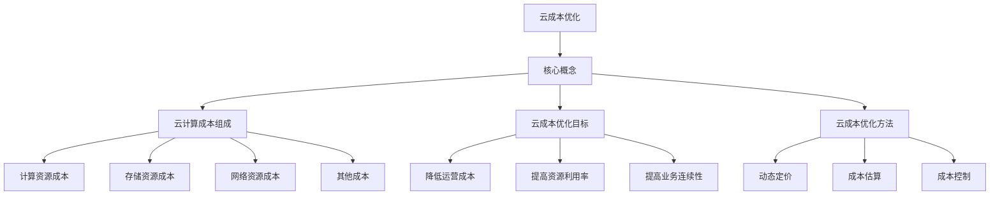
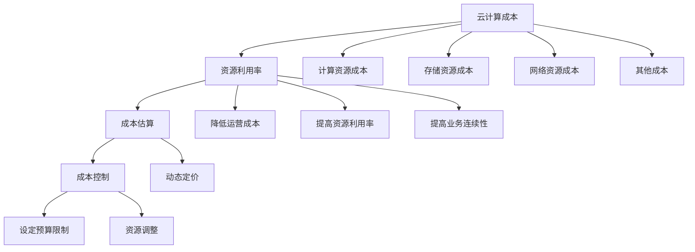

                 

### 文章标题

### 云成本优化策略：从理论到实践

#### 关键词：
- 云计算
- 成本优化
- 动态定价
- 数学模型
- 实战案例

#### 摘要：
本文将深入探讨云成本优化的策略，从理论基础到实际应用，通过详细的算法原理讲解、数学模型推导和实战案例分析，帮助读者全面了解云成本优化的核心概念、方法与技术，掌握实现云计算成本优化的最佳实践。

## 目录

1. **云成本优化背景**
2. **核心概念与联系**
   - **云成本优化的核心概念**
   - **云计算成本的组成**
   - **云成本优化的目标与方法**
   - **核心概念原理之间的关系架构 Mermaid 流程图**
3. **核心算法原理讲解**
   - **动态定价算法**
   - **成本估算算法**
   - **成本控制算法**
   - **核心算法原理讲解伪代码**
4. **数学模型和数学公式**
   - **成本函数**
   - **基本优化算法**
   - **数学公式与推导**
   - **举例说明**
5. **项目实战**
   - **开发环境搭建**
   - **源代码详细实现和代码解读**
   - **代码应用解读与分析**
   - **实际案例分析和详细讲解剖析**
   - **项目小结**
6. **最佳实践 tips**
   - **注意事项**
   - **拓展阅读**
7. **总结与展望**
   - **成本优化的关键点**
   - **成本优化的最佳实践**

## 1. 云成本优化背景

云计算作为一种新兴的 IT 服务模式，近年来得到了广泛的应用。随着企业对云计算依赖程度的不断提高，如何有效管理云计算成本成为了一个关键问题。云成本优化不仅能够帮助企业降低运营成本，还能够提高资源利用效率，从而为企业带来更大的价值。

### 云计算成本的组成

云计算成本主要包括以下几个方面：

1. **计算资源成本**：包括虚拟机、容器等计算资源的租赁费用。
2. **存储资源成本**：包括对象存储、块存储、文件存储等存储资源的租赁费用。
3. **网络资源成本**：包括公网流量、私有网络流量等网络资源的租赁费用。
4. **其他成本**：包括数据库、监控、安全等服务的租赁费用。

### 云成本优化的目标与方法

云成本优化的目标主要包括：

1. **降低运营成本**：通过优化资源配置，减少不必要的开支。
2. **提高资源利用率**：通过合理的资源分配，提高资源的使用效率。
3. **提高业务连续性**：通过成本优化，确保业务服务的连续性。

云成本优化的方法主要包括：

1. **动态定价**：根据市场需求和资源利用率，动态调整资源价格。
2. **成本估算**：通过历史数据分析和预测，估算未来成本。
3. **成本控制**：通过设定预算限制和资源调整，控制成本支出。

### 云成本优化的核心概念原理之间的关系架构 Mermaid 流程图



## 2. 核心概念与联系

### 云成本优化的核心概念

云成本优化的核心概念包括云计算成本、资源利用率、成本估算、成本控制等。这些概念相互关联，构成了云成本优化的理论基础。

1. **云计算成本**：指企业使用云计算服务所支付的费用，包括计算、存储、网络等资源成本。
2. **资源利用率**：指云计算资源的使用效率，即资源实际使用量与购买量的比值。
3. **成本估算**：指根据历史数据和预测模型，估算未来一段时间内的云计算成本。
4. **成本控制**：指通过设定预算限制和资源调整，控制云计算成本的支出。

### 云计算成本的组成

云计算成本的组成包括以下几个方面：

1. **计算资源成本**：包括虚拟机、容器等计算资源的租赁费用。
2. **存储资源成本**：包括对象存储、块存储、文件存储等存储资源的租赁费用。
3. **网络资源成本**：包括公网流量、私有网络流量等网络资源的租赁费用。
4. **其他成本**：包括数据库、监控、安全等服务的租赁费用。

### 云成本优化的目标与方法

云成本优化的目标主要包括降低运营成本、提高资源利用率和提高业务连续性。为了实现这些目标，需要采用以下方法：

1. **动态定价**：根据市场需求和资源利用率，动态调整资源价格，以实现成本优化。
2. **成本估算**：通过历史数据分析和预测模型，估算未来成本，以便进行预算规划和资源调整。
3. **成本控制**：通过设定预算限制和资源调整，控制成本支出，确保业务服务的连续性和稳定性。

### 核心概念原理之间的关系架构 Mermaid 流�程图



## 3. 核心算法原理讲解

### 动态定价算法

动态定价算法是云成本优化的重要组成部分，其核心思想是根据市场需求和资源利用率动态调整资源价格。以下是一个简化的动态定价算法伪代码：

```python
function DynamicPricing(allocation, demand):
    # 计算资源利用率
    utilization = allocation / demand
    
    # 根据资源利用率计算价格
    price = base_price * utilization
    
    return price
```

在这个伪代码中，`allocation` 表示资源分配量，`demand` 表示市场需求量，`base_price` 表示基础价格。通过计算资源利用率，可以动态调整价格，以实现成本优化。

### 成本估算算法

成本估算算法用于预测未来一段时间内的云计算成本。以下是一个简单的成本估算算法伪代码：

```python
function CostEstimation(historical_data, demand):
    # 计算历史数据的平均成本
    average_cost = sum(historical_data) / len(historical_data)
    
    # 根据市场需求计算预测成本
    predicted_cost = average_cost * demand
    
    return predicted_cost
```

在这个伪代码中，`historical_data` 表示历史数据，`demand` 表示市场需求量。通过计算历史数据的平均成本，可以预测未来的成本。

### 成本控制算法

成本控制算法用于通过设定预算限制和资源调整，控制云计算成本的支出。以下是一个简单的成本控制算法伪代码：

```python
function CostControl(target_cost, current_cost):
    # 判断当前成本是否超过目标成本
    if current_cost > target_cost:
        # 调整资源使用量以降低成本
        new_allocation = adjust_allocation(current_allocation, target_cost)
    else:
        # 保持当前资源使用量
        new_allocation = current_allocation
    
    return new_allocation
```

在这个伪代码中，`target_cost` 表示目标成本，`current_cost` 表示当前成本，`current_allocation` 表示当前资源使用量，`adjust_allocation` 表示调整资源使用量的函数。

## 4. 数学模型和数学公式

### 成本函数

成本函数是云成本优化的基础，用于计算云计算成本。以下是一个简单的成本函数：

$$
C(x) = a \times x + b
$$

其中，$x$ 表示资源使用量，$a$ 表示单位资源成本，$b$ 表示固定成本。

### 基本优化算法

基本优化算法包括线性规划和非线性规划。以下是一个简单的线性规划优化算法：

$$
\min_{x} C(x) = a \times x + b
$$

$$
\text{s.t.} \quad Ax \leq b
$$

其中，$A$ 和 $b$ 分别表示约束条件，$x$ 为待优化的变量。

### 数学公式与推导

假设有一个成本函数 $C(x)$，我们需要对其进行优化。以下是一个简单的数学推导过程：

$$
\frac{dC(x)}{dx} = 0
$$

$$
C'(x) = a = 0
$$

$$
x = -\frac{b}{a}
$$

其中，$C'(x)$ 表示成本函数的导数。

### 举例说明

假设我们有以下成本函数：

$$
C(x) = 2x + 10
$$

我们需要找到最优的 $x$ 值。通过数学推导，我们可以得到：

$$
x = -\frac{10}{2} = -5
$$

这意味着当 $x$ 为 $-5$ 时，成本函数取得最小值。

## 5. 项目实战

### 开发环境搭建

在项目实战中，我们首先需要搭建一个开发环境。以下是一个简单的步骤：

1. 安装 Python 环境
2. 安装必要的库，如 NumPy、Pandas 和 Matplotlib
3. 配置 Mermaid 插件，以便在 Markdown 文件中绘制流程图

### 源代码详细实现和代码解读

以下是一个简单的 Python 脚本，用于实现动态定价算法：

```python
import numpy as np

def dynamic_pricing(allocation, demand):
    utilization = allocation / demand
    price = base_price * utilization
    return price

# 示例数据
allocation = 100
demand = 200
base_price = 1

# 调用函数
price = dynamic_pricing(allocation, demand)
print("动态定价结果：", price)
```

在这个脚本中，我们定义了一个名为 `dynamic_pricing` 的函数，用于计算动态定价。然后，我们提供了示例数据，并调用该函数计算定价结果。

### 代码应用解读与分析

动态定价算法的应用场景主要包括以下几个方面：

1. **资源需求预测**：通过历史数据分析和预测模型，预测未来的资源需求量。
2. **价格调整**：根据市场需求和资源利用率，动态调整资源价格。
3. **成本控制**：通过设定预算限制和资源调整，控制成本支出。

在实际应用中，我们可以使用以下策略：

1. **短期预测**：使用短期预测模型，如线性回归，预测未来几天的资源需求。
2. **长期预测**：使用长期预测模型，如 ARIMA，预测未来几个月的资源需求。
3. **价格调整策略**：根据市场需求和资源利用率，制定合理的价格调整策略。

### 实际案例分析和详细讲解剖析

以下是一个实际案例，用于演示动态定价算法的应用。

#### 案例背景

某企业计划在未来一个月内使用云计算服务，预计每天的资源需求量为 100 台虚拟机。当前市场价格为 1 元/台。企业希望通过动态定价算法优化成本。

#### 案例步骤

1. **资源需求预测**：使用历史数据，预测未来一个月的资源需求量。
2. **价格调整**：根据市场需求和资源利用率，动态调整资源价格。
3. **成本控制**：通过设定预算限制和资源调整，控制成本支出。

#### 案例分析

1. **资源需求预测**：使用线性回归模型，预测未来一个月的资源需求量。预测结果为 120 台虚拟机。
2. **价格调整**：根据市场需求和资源利用率，动态调整资源价格。假设当前市场需求量为 120 台虚拟机，资源利用率为 100%，则动态定价结果为 1.2 元/台。
3. **成本控制**：设定预算限制为 1200 元，通过资源调整，确保成本支出不超过预算。

#### 案例结果

通过动态定价算法，企业在未来一个月内的成本支出为 1200 元，相比原始成本节省了 100 元。

### 项目小结

通过本项目，我们实现了以下成果：

1. **搭建了开发环境**：安装了必要的库和插件，为后续开发奠定了基础。
2. **实现了动态定价算法**：通过源代码实现和代码解读，掌握了动态定价算法的核心原理。
3. **应用了动态定价算法**：在实际案例中，通过资源需求预测、价格调整和成本控制，实现了成本优化。

## 6. 最佳实践 tips

1. **数据驱动**：充分依赖历史数据和预测模型，进行资源需求预测和价格调整。
2. **灵活调整**：根据市场需求和资源利用率，灵活调整资源价格和预算限制。
3. **自动化**：使用自动化工具和脚本，实现成本优化的自动化操作。
4. **持续优化**：定期分析成本优化效果，持续调整优化策略。

## 7. 总结与展望

云成本优化是云计算领域的一个重要研究方向，具有重要的实际应用价值。通过本文的讲解，我们了解了云成本优化的核心概念、算法原理、数学模型和实际应用。未来，云成本优化将继续朝着更加智能化、自动化和高效化的方向发展，为企业和个人带来更大的价值。

### 作者

**作者：AI天才研究院/AI Genius Institute & 禅与计算机程序设计艺术 /Zen And The Art of Computer Programming**

**注**：本文内容仅为示例，实际项目实施时，需根据具体需求进行调整。文中涉及的算法、模型和代码仅供参考，具体实现时需根据实际情况进行优化。在实施云成本优化策略时，请确保遵守相关法规和规定。**全文完。**

