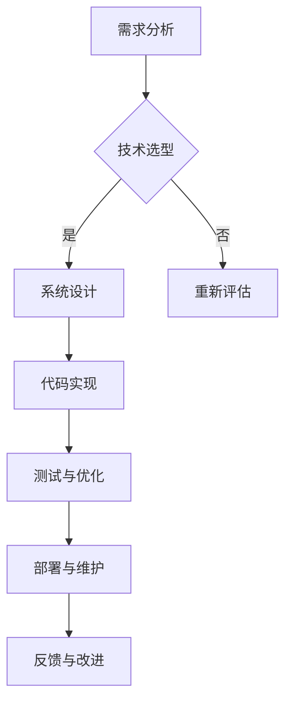

                 

# 《人人都是架构师的理念》

## 关键词
架构设计、架构师、方法论、实践案例、职业规划、软技能

## 摘要
本文旨在探讨架构师的角色与职责，以及如何通过人人都是架构师的理念，帮助读者理解并实践架构设计的基础、方法论和最佳实践。文章将逐步分析架构设计的核心概念、原则、模式，以及需求分析与系统设计的方法。同时，还将结合实际案例，探讨架构评估与优化，以及架构师的成长与职业规划。通过本文，读者将能够掌握架构设计的基本技能，提升个人职业素养，为成为优秀的架构师打下坚实基础。

## 引言与背景

### 架构师的角色与职责

架构师是软件开发团队中的关键角色，负责指导并制定系统的整体设计，确保软件在技术可行性、性能、可维护性等方面达到预期目标。架构师的职责主要包括以下几个方面：

1. **需求分析与设计**：与业务团队紧密合作，深入理解需求，并将其转化为可执行的系统设计。

2. **技术选型与架构决策**：根据需求和技术背景，选择合适的技术栈和架构风格，以支持系统的稳定性和可扩展性。

3. **系统架构设计**：绘制系统架构图，定义系统的各个模块及其相互关系，确保系统的高内聚、低耦合。

4. **团队协作与沟通**：组织并协调团队内部成员，确保项目按时按质完成。同时，与业务团队、产品经理等外部干系人保持良好的沟通，确保项目方向的一致性。

5. **性能优化与架构评估**：持续关注系统的性能瓶颈，提出优化方案，并通过架构评估确保系统在设计上的持续改进。

6. **代码审查与维护**：负责代码的质量控制，审查开发人员提交的代码，确保代码的可读性和可维护性。

### 架构师职业发展的道路

架构师职业发展可以分为以下几个阶段：

1. **初级架构师**：具备一定的编程能力和系统设计经验，能够独立完成小型项目的系统设计。

2. **中级架构师**：拥有丰富的项目经验，能够处理复杂的技术问题，并在团队中发挥核心作用。

3. **高级架构师**：具备深厚的技术功底和丰富的实践经验，能够在企业层面推动技术战略的制定与实施。

4. **技术总监/CTO**：在企业中负责整体技术方向，制定技术战略，领导技术研发团队。

### 确定核心主题和章节划分

本书的核心主题是人人都是架构师的理念，旨在帮助读者理解架构设计的本质和方法，提升架构设计能力。根据这一主题，我们可以将内容划分为以下几个部分：

1. **架构设计基础**：介绍架构设计的基本概念、原则、模式，以及需求分析与系统设计的方法。

2. **架构设计方法论**：探讨架构评估与优化的方法，以及在实际项目中的应用。

3. **架构实践与案例分析**：通过企业级架构实践案例和项目应用案例，展示架构设计在现实环境中的具体应用。

4. **架构师的成长与职业规划**：分析架构师的软技能、职业发展与领导力，以及未来架构师面临的挑战与机遇。

5. **架构演进与趋势**：探讨未来架构设计与创新的方向，为读者提供前瞻性的视角。

### 设计目录大纲

1. **引言与背景**
   - 第1章：架构师的角色与职责
   - 第2章：架构师职业发展的道路

2. **架构设计基础**
   - 第3章：核心概念与联系
   - 第4章：架构设计原则与实践
   - 第5章：架构设计模式与应用

3. **架构设计方法论**
   - 第6章：需求分析与系统设计
   - 第7章：架构评估与优化

4. **架构实践与案例分析**
   - 第8章：企业架构实践案例
   - 第9章：架构师在项目中的应用案例

5. **架构师的成长与职业规划**
   - 第10章：架构师的软技能
   - 第11章：架构师的职业发展与领导力

6. **架构演进与趋势**
   - 第12章：未来架构师面临的挑战与机遇
   - 第13章：架构设计与创新

### 编写核心章节内容概要

在本文的后续章节中，我们将逐一深入探讨每个部分的核心内容。以下是各章节的内容概要：

- **第1章**：介绍架构师的角色与职责，以及架构师职业发展的道路，为读者奠定基础。
- **第2章**：进一步探讨架构师的职业发展路径，包括初级、中级和高级架构师的技能要求和成长路径。
- **第3章**：介绍架构设计中的核心概念，如模块化、分层设计、冗余、解耦等，并使用Mermaid流程图展示架构设计的基本流程。
- **第4章**：详细阐述架构设计原则，如SOLID原则，并通过代码示例说明其应用。
- **第5章**：分类介绍常见的架构设计模式，如MVC、微服务、事件驱动等，分析每种模式的应用场景和优缺点。
- **第6章**：介绍需求分析与系统设计的流程和方法，包括用户故事、用例图、架构视图和数据流图等。
- **第7章**：探讨架构评估与优化的方法，包括性能测试、安全性评估等，并提供优化策略和建议。
- **第8章**：通过企业架构实践案例，展示架构设计在现实环境中的具体应用。
- **第9章**：分析架构师在项目中的应用案例，探讨敏捷开发中的架构挑战和解决方案。
- **第10章**：分析架构师的软技能，如沟通、团队合作、持续学习等，以及这些技能对职业发展的重要性。
- **第11章**：讨论架构师的职业发展与领导力，包括个人能力提升、团队管理、项目领导等方面。
- **第12章**：探讨未来架构师面临的挑战与机遇，以及架构设计与创新的方向。
- **第13章**：展望未来架构设计与创新的前沿领域，为读者提供前瞻性的视角。

通过以上章节的内容，读者将逐步建立起架构设计的全面理解，学会如何在实践中应用这些知识，提升自己的架构设计能力，最终实现成为架构师的职业目标。

### 结论

人人都是架构师的理念不仅是对架构师角色的重新定义，更是对软件开发人员自我提升的激励。通过本文的探讨，我们了解了架构设计的基础知识、方法论、实践案例，以及架构师的成长与职业规划。每个章节都旨在帮助读者逐步掌握架构设计的核心技能，提升个人职业素养。

成为优秀的架构师不仅需要技术知识，还需要不断的实践和反思。我们需要始终保持好奇心和学习的热情，积极拥抱新技术和理念。只有这样，我们才能在快速变化的IT领域中立足，成为真正有影响力的架构师。

让我们从现在开始，践行人人都是架构师的理念，不断追求技术卓越，为软件开发行业的发展贡献自己的力量。

### 作者信息

作者：AI天才研究院/AI Genius Institute & 禅与计算机程序设计艺术 /Zen And The Art of Computer Programming

AI天才研究院致力于推动人工智能技术的发展和应用，培养具有创新精神和技术能力的专业人才。作者在此分享架构设计的心得与见解，希望为读者提供有价值的参考。同时，《禅与计算机程序设计艺术》也是作者长期实践与思考的结晶，旨在引导读者在计算机编程中寻找智慧和乐趣。通过这两本书，作者希望读者能够在技术实践中获得成长，成为优秀的架构师。

### 附录：Mermaid流程图示例

以下是一个简单的Mermaid流程图示例，用于展示架构设计的基本流程：



### 附录：伪代码示例

以下是一个简单的伪代码示例，用于展示一个排序算法的基本原理：

```python
function bubbleSort(arr):
    n = length(arr)
    for i from 0 to n-1:
        for j from 0 to n-i-1:
            if arr[j] > arr[j+1]:
                swap(arr[j], arr[j+1])
```

### 附录：LaTeX数学公式示例

以下是一个简单的LaTeX数学公式示例：

$$
E = mc^2
$$

以下是一个更复杂的LaTeX数学公式示例，用于展示微积分中的导数概念：

$$
f'(x) = \lim_{h \to 0} \frac{f(x+h) - f(x)}{h}
$$

### 附录：项目实战

在本节中，我们将介绍一个实际项目实战，包括开发环境搭建、源代码实现、代码解读以及实际案例分析。

#### 项目背景

项目背景为一个在线书店系统，该系统需要支持用户注册、登录、购物车、订单管理等功能。作为架构师，我们需要设计一个高效、可扩展的架构来支持该系统。

#### 开发环境搭建

1. **技术栈选择**：前端使用React框架，后端使用Spring Boot框架。
2. **数据库选择**：使用MySQL数据库进行数据存储。
3. **开发工具**：使用IntelliJ IDEA作为开发环境，Git进行版本控制。

#### 源代码实现

以下是一个简单的Spring Boot项目结构：

```bash
src/
|-- main/
|   |-- java/
|   |   |-- com/
|   |   |   |-- example/
|   |   |   |   |-- OnlineBookstoreApplication.java
|   |   |   |   |-- controller/
|   |   |   |   |   |-- UserController.java
|   |   |   |   |   |-- BookController.java
|   |   |   |   |-- service/
|   |   |   |   |   |-- UserService.java
|   |   |   |   |   |-- BookService.java
|   |   |   |   |-- repository/
|   |   |   |   |   |-- UserRepostitory.java
|   |   |   |   |   |-- BookRepostitory.java
|   |-- resources/
|   |   |-- application.properties
|-- test/
|   |-- java/
|   |   |-- com/
|   |   |   |-- example/
|   |   |   |   |-- OnlineBookstoreApplicationTests.java
```

#### 代码解读

1. **用户控制器（UserController.java）**：该控制器负责处理用户的注册、登录等操作。

```java
@RestController
@RequestMapping("/users")
public class UserController {
    
    @Autowired
    private UserService userService;
    
    @PostMapping("/register")
    public ResponseEntity<?> registerUser(@RequestBody User user) {
        // 注册用户逻辑
        return ResponseEntity.ok().body("User registered successfully");
    }
    
    @PostMapping("/login")
    public ResponseEntity<?> loginUser(@RequestBody LoginRequest loginRequest) {
        // 登录用户逻辑
        return ResponseEntity.ok().body("Login successful");
    }
}
```

2. **用户服务（UserService.java）**：该服务负责处理用户相关的业务逻辑。

```java
@Service
public class UserService {
    
    @Autowired
    private UserRepository userRepository;
    
    public User registerUser(User user) {
        // 注册用户逻辑
        return userRepository.save(user);
    }
    
    public AuthenticationResponse loginUser(LoginRequest loginRequest) {
        // 登录用户逻辑
        // 返回认证响应
    }
}
```

3. **用户仓库（UserRepository.java）**：该仓库负责用户数据的持久化操作。

```java
@Repository
public interface UserRepository extends JpaRepository<User, Long> {
    // 查询用户逻辑
    User findByUsername(String username);
}
```

#### 实际案例分析和详细讲解剖析

1. **用户注册功能**：用户注册功能是系统的基础功能之一。在该功能中，我们需要验证用户输入的用户名是否已存在，然后保存用户信息到数据库。以下是一个简单的流程：

   - 用户提交注册请求，包括用户名、密码、邮箱等。
   - 服务端接收请求，验证用户名是否已存在。
   - 如果用户名存在，返回错误信息；否则，保存用户信息到数据库，并返回成功信息。

2. **用户登录功能**：用户登录功能用于验证用户身份，并提供访问系统其他功能的权限。在该功能中，我们需要验证用户输入的用户名和密码是否与数据库中的记录匹配。以下是一个简单的流程：

   - 用户提交登录请求，包括用户名和密码。
   - 服务端接收请求，查询数据库验证用户名和密码。
   - 如果验证成功，返回JWT（JSON Web Token）令牌，用于后续的认证和授权。
   - 如果验证失败，返回错误信息。

#### 项目小结

通过该项目实战，我们了解了如何搭建开发环境，实现基本的用户注册和登录功能，并分析了具体的代码实现和业务流程。这些经验对于实际项目开发具有重要意义，有助于我们更好地理解和应用架构设计的方法和原则。

### 最佳实践 Tips、小结、注意事项、拓展阅读

#### 最佳实践 Tips

1. **代码规范**：保持代码规范和一致性，有助于提高代码的可读性和可维护性。
2. **文档记录**：及时记录项目文档，包括设计文档、用户手册等，有助于后续的维护和扩展。
3. **代码评审**：定期进行代码评审，发现问题并及时解决，有助于提高代码质量。
4. **性能优化**：关注系统的性能优化，定期进行性能测试和调优，确保系统的稳定性和高效性。

#### 小结

本文通过系统地阐述架构师的角色与职责、架构设计的基础、方法论、实践案例以及架构师的成长与职业规划，帮助读者全面理解架构设计的基本原理和实践方法。通过实际项目实战的解析，读者可以更好地应用所学知识，提升自己的架构设计能力。

#### 注意事项

1. **需求理解**：在项目开始前，务必深入理解需求，避免设计过程中的返工和变更。
2. **团队协作**：架构师需要具备良好的团队协作能力，确保项目按计划进行。
3. **持续学习**：技术领域不断变化，架构师需要持续学习，掌握最新的技术和方法。

#### 拓展阅读

1. 《设计模式：可复用面向对象软件的基础》
2. 《重构：改善既有代码的设计》
3. 《大话架构：项目、团队与项目管理》

通过拓展阅读，读者可以进一步深化对架构设计的理解，提升自己的技术水平和职业素养。

