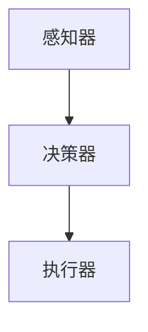

                 

## 《人工智能与机器学习在软件开发中的应用》目录大纲

以下是根据用户需求设计的《人工智能与机器学习在软件开发中的应用》书籍目录大纲，每个部分都详细列出了章节标题和内容概述，以确保读者能够系统地了解人工智能和机器学习在软件开发中的实际应用。

### 第一部分：基础理论

#### 第1章 引言
- **内容概述**：介绍人工智能与机器学习的概述，以及它们在软件开发中的结合方式。阐述本书的结构和内容，帮助读者构建整体框架。

#### 第2章 人工智能基础
- **内容概述**：涵盖人工智能的定义、分类，知识表示与推理，智能代理与规划。引入Mermaid流程图，展示人工智能系统的架构。

#### 第3章 机器学习基础
- **内容概述**：介绍机器学习的定义、分类，包括线性回归、逻辑回归、K-近邻算法、支持向量机、决策树与随机森林。使用伪代码展示K-近邻算法的实现。

#### 第4章 深度学习基础
- **内容概述**：探讨深度学习的定义、特点，神经网络基础，卷积神经网络（CNN）与循环神经网络（RNN）与长短期记忆网络（LSTM）。

### 第二部分：软件开发中的应用

#### 第5章 数据预处理与特征工程
- **内容概述**：介绍数据预处理与特征工程的重要性和方法，包括数据清洗、特征提取与特征选择。提供数学模型与公式，详细讲解特征选择评价指标。

#### 第6章 机器学习在软件开发中的应用
- **内容概述**：探讨机器学习在自然语言处理、计算机视觉、推荐系统和金融风控中的应用，提供实际案例分析。

#### 第7章 深度学习在软件开发中的应用
- **内容概述**：分析深度学习在语音识别、图像识别、自动驾驶中的应用，并进行代码实战，演示手写数字识别的实现。

#### 第8章 软件开发中的深度学习框架
- **内容概述**：介绍TensorFlow与Keras、PyTorch等深度学习框架，以及其他深度学习框架的简介，帮助读者选择合适的工具。

#### 第9章 挑战与未来展望
- **内容概述**：讨论软件开发中的人工智能挑战，机器学习的未来发展方向，以及软件开发与人工智能、机器学习的融合趋势。

### 附录

#### 附录A：参考资料与拓展阅读
- **内容概述**：提供相关的参考资料和拓展阅读，帮助读者进一步学习和研究。

#### 附录B：常用深度学习框架API文档
- **内容概述**：列出常用深度学习框架的API文档，方便读者查阅和使用。

#### 附录C：数学公式与符号表
- **内容概述**：汇总本书中使用的数学公式和符号，便于读者快速参考。

通过这一详细的目录大纲，读者可以系统地了解人工智能和机器学习在软件开发中的应用，并掌握相关理论和实践技能。接下来的各章节将进一步深入探讨这些主题，提供丰富的实例和案例分析，帮助读者更好地理解和应用这些技术。## 第一部分：基础理论

### 第1章 引言

#### 1.1 人工智能与机器学习的概述

人工智能（Artificial Intelligence，AI）是计算机科学的一个分支，旨在创建智能机器，使它们能够执行通常需要人类智能才能完成的任务。这些任务包括视觉识别、语音识别、决策制定、语言翻译等。人工智能的研究涵盖了多个领域，包括机器学习、自然语言处理、计算机视觉和智能代理。

机器学习（Machine Learning，ML）是人工智能的核心技术之一，通过使用算法从数据中学习并作出决策或预测。机器学习算法可以分为监督学习、无监督学习和强化学习。监督学习使用标记数据训练模型，无监督学习在未标记数据中寻找模式，而强化学习则通过奖励机制训练模型。

#### 1.2 软件开发与人工智能、机器学习的结合

随着人工智能和机器学习技术的发展，它们在软件开发中的应用变得越来越广泛。这种结合不仅提高了软件系统的智能水平，还提高了自动化程度和用户体验。

1. **自动化测试**：机器学习可以用于自动化测试，通过训练模型识别缺陷和异常行为。
2. **智能推荐系统**：在电子商务和社交媒体平台，机器学习算法可以分析用户行为，提供个性化的推荐。
3. **自然语言处理**：机器学习在语音识别、语言翻译和文本分析等领域发挥着重要作用，这些技术被广泛应用于客服系统、智能助理等。
4. **计算机视觉**：机器学习技术可以用于图像识别、物体检测和图像分割，这些应用包括自动驾驶、安全监控和医疗诊断。
5. **智能决策支持系统**：机器学习可以帮助企业分析大量数据，提供智能化的决策支持。

#### 1.3 书籍结构及内容概述

本书分为两部分：第一部分是基础理论，包括人工智能和机器学习的基本概念、算法和技术；第二部分是软件开发中的应用，探讨如何将人工智能和机器学习技术应用于软件开发中，包括数据预处理、特征工程、模型选择和优化等。

具体章节安排如下：

- 第1章：引言，介绍人工智能与机器学习的概述以及它们在软件开发中的结合。
- 第2章：人工智能基础，介绍人工智能的定义、分类和基本架构。
- 第3章：机器学习基础，介绍机器学习的定义、分类和各种算法。
- 第4章：深度学习基础，介绍深度学习的定义、特点和常见模型。

通过第一部分的学习，读者将建立对人工智能和机器学习的基本认识，理解这些技术是如何在软件开发中发挥作用的。接下来，我们将深入探讨这些基础理论的各个方面，为后续的应用和实践打下坚实的基础。

### 第2章 人工智能基础

#### 2.1 人工智能的定义与分类

人工智能（Artificial Intelligence，AI）是计算机科学的一个分支，旨在通过模拟、扩展和扩展人类智能来创建智能机器。根据其实现方式和应用场景，人工智能可以分为多个子领域：

1. **知识表示与推理**：知识表示是指将人类知识以计算机可以理解的形式进行编码。推理是指通过逻辑和规则来推导新知识。知识表示与推理在专家系统、智能代理等领域有广泛应用。
2. **机器学习**：通过从数据中学习，机器学习算法可以做出预测和决策。它包括监督学习、无监督学习和强化学习等子领域。
3. **自然语言处理（NLP）**：自然语言处理旨在使计算机能够理解、生成和处理自然语言。NLP在语音识别、机器翻译和文本分析等领域有广泛应用。
4. **计算机视觉**：计算机视觉使计算机能够从图像或视频中提取信息，进行物体识别、图像分割和目标跟踪等任务。
5. **智能代理**：智能代理是一种可以自主行动、感知环境并做出决策的计算机程序。它们在游戏、机器人控制和自动谈判等领域有广泛应用。
6. **自动规划**：自动规划是指为系统自动生成一系列行动，以实现特定目标。它被广泛应用于调度、路径规划和资源分配等领域。

#### 2.2 知识表示与推理

知识表示与推理是人工智能的核心技术之一。知识表示旨在将人类知识以计算机可以理解的形式进行编码。常见的知识表示方法包括：

1. **符号表示**：使用符号和逻辑表达式来表示知识。符号表示具有形式化和精确性，但可能难以处理复杂的知识。
2. **框架表示**：使用框架来组织知识，框架包括对象、属性和关系。框架表示适用于简单的问题域，但可能难以处理复杂和动态的问题。
3. **产生式规则**：产生式规则由条件部分和行动部分组成。当条件部分为真时，执行行动部分。产生式规则在专家系统和其他领域有广泛应用。
4. **语义网络**：语义网络是一种基于图的知识表示方法，它使用节点表示实体，边表示实体之间的关系。语义网络适用于复杂的问题域，但可能难以处理大规模数据。

推理是指通过逻辑和规则来推导新知识。常见的推理方法包括：

1. **演绎推理**：从一般到特殊的推理过程。例如，如果所有的人都是 mortal（ mortal 表示“凡人”），而你是一个人，那么你也必然是 mortal。
2. **归纳推理**：从特殊到一般的推理过程。例如，观察许多苹果都会掉落，我们得出结论，所有苹果都会掉落。
3. **类比推理**：基于相似性的推理过程。例如，如果你知道猫有四条腿，并且你看到一只动物有四条腿，你可能会推断这只动物是一只猫。

#### 2.3 智能代理与规划

智能代理是一种可以自主行动、感知环境并做出决策的计算机程序。智能代理通常由以下组件组成：

1. **感知器**：用于感知环境信息，如传感器、摄像头等。
2. **决策器**：用于根据感知到的信息做出决策。
3. **执行器**：用于执行决策所指示的行动。

智能代理可以分为基于规则和基于学习的两种类型：

1. **基于规则的智能代理**：使用预定义的规则来做出决策。这些规则可以是明确的“如果-那么”规则，也可以是模糊逻辑规则。
2. **基于学习的智能代理**：使用机器学习算法从数据中学习决策策略。这些代理可以通过监督学习、无监督学习或强化学习进行训练。

自动规划是指为系统自动生成一系列行动，以实现特定目标。自动规划通常包括以下步骤：

1. **目标定义**：明确系统需要实现的目标。
2. **状态空间建模**：定义系统的状态空间，包括所有可能的状态和状态之间的转换。
3. **行动生成**：生成实现目标的一系列行动。
4. **行动选择**：根据当前状态选择最优行动。

Mermaid流程图：人工智能系统架构



通过以上介绍，我们可以看到人工智能的基础理论和组成部分。在接下来的章节中，我们将继续探讨机器学习的基础知识，以及如何将这些理论应用于软件开发中。

### 第3章 机器学习基础

#### 3.1 机器学习的定义与分类

机器学习（Machine Learning，ML）是一门人工智能（Artificial Intelligence，AI）的分支，它关注于创建能够从数据中学习并做出预测或决策的系统。机器学习算法通过从数据中学习规律，从而在没有明确编程的情况下实现智能行为。

根据学习方式，机器学习可以分为以下几类：

1. **监督学习（Supervised Learning）**：监督学习是一种在已知输入和输出之间关系的情况下训练模型的方法。模型通过学习输入和输出数据之间的映射关系来预测新数据的输出。常见的监督学习算法包括线性回归、逻辑回归、支持向量机（SVM）和决策树。

2. **无监督学习（Unsupervised Learning）**：无监督学习在没有任何预先定义的输出数据的情况下进行。这种学习方式主要用于发现数据中的结构和模式，如聚类和降维。常见的无监督学习算法包括K-均值聚类、主成分分析（PCA）和自编码器。

3. **强化学习（Reinforcement Learning）**：强化学习是一种通过与环境交互来学习最优策略的机器学习方法。在这种方法中，模型通过尝试不同的行动来获得奖励或惩罚，从而学习到最优的行动策略。强化学习在游戏、自动驾驶和机器人控制等领域有广泛应用。常见的算法包括Q学习和深度确定性策略梯度（DDPG）。

#### 3.2 线性回归与逻辑回归

线性回归（Linear Regression）是一种用于预测连续值的监督学习算法。它假设目标变量Y是输入变量X的线性函数，通过最小化损失函数来找到最佳拟合线。

线性回归模型公式：
$$ Y = \beta_0 + \beta_1X + \epsilon $$

其中，$\beta_0$ 是截距，$\beta_1$ 是斜率，$\epsilon$ 是误差项。

损失函数通常使用均方误差（MSE）：
$$ J(\theta) = \frac{1}{2m} \sum_{i=1}^{m} (h_\theta(x^{(i)}) - y^{(i)})^2 $$

其中，$h_\theta(x)$ 是模型预测，$y^{(i)}$ 是实际输出，$m$ 是样本数量。

梯度下降算法用于最小化损失函数：
$$ \theta_j := \theta_j - \alpha \frac{\partial J(\theta)}{\partial \theta_j} $$

逻辑回归（Logistic Regression）是一种用于预测概率的监督学习算法，通常用于分类问题。逻辑回归模型使用逻辑函数（Sigmoid函数）将线性组合映射到概率值。

逻辑回归模型公式：
$$ \sigma(z) = \frac{1}{1 + e^{-z}} $$
$$ z = \beta_0 + \beta_1X $$

其中，$\sigma(z)$ 是预测的概率，$z$ 是线性组合，$\beta_0$ 是截距，$\beta_1$ 是斜率。

损失函数通常使用交叉熵损失（Cross-Entropy Loss）：
$$ J(\theta) = -\frac{1}{m} \sum_{i=1}^{m} [y^{(i)} \log(h_\theta(x^{(i)})) + (1 - y^{(i)}) \log(1 - h_\theta(x^{(i)}))] $$

其中，$h_\theta(x)$ 是预测的概率。

梯度下降算法同样用于最小化损失函数：
$$ \theta_j := \theta_j - \alpha \frac{\partial J(\theta)}{\partial \theta_j} $$

#### 3.3 K-近邻算法与支持向量机

K-近邻算法（K-Nearest Neighbors，KNN）是一种简单且常用的无监督学习算法。KNN算法基于相似性原则，通过计算新数据与训练数据中最近k个邻居的相似度，然后基于这些邻居的标签来预测新数据的标签。

KNN算法步骤：
1. 计算新数据与训练数据中每个样本的距离。
2. 选择距离最近的k个邻居。
3. 根据这些邻居的标签预测新数据的标签。

距离计算可以使用欧几里得距离、曼哈顿距离或切比雪夫距离等。

伪代码：K-近邻算法实现
```python
def KNN(train_data, train_labels, test_data, k):
    distances = []
    for data_point in train_data:
        dist = calculate_distance(test_data, data_point)
        distances.append(dist)
    k_nearest = sorted(distances)[:k]
    nearest_labels = [train_labels[i] for i in range(len(distances)) if dist in k_nearest]
    return most_common(nearest_labels)
```

支持向量机（Support Vector Machine，SVM）是一种强大的分类算法，通过找到最优超平面来最大化分类边界。SVM算法可以将高维数据投影到低维空间，以便更好地进行分类。

SVM模型公式：
$$ \text{maximize } \frac{1}{2} \|w\|^2 $$
$$ \text{subject to } y^{(i)}(\langle w, x^{(i)} \rangle - b) \geq 1 $$

其中，$w$ 是权重向量，$x^{(i)}$ 是输入特征，$b$ 是偏置项，$y^{(i)}$ 是标签。

支持向量机通过求解上述优化问题来确定最优超平面。常见的求解方法包括 Sequential Minimal Optimization（SMO）和核方法。

#### 3.4 决策树与随机森林

决策树（Decision Tree）是一种基于树形结构的分类和回归算法。每个内部节点代表特征，每个分支代表特征的不同取值，每个叶子节点代表预测结果。

决策树算法步骤：
1. 计算每个特征的不同取值，并计算信息增益或基尼不纯度。
2. 选择信息增益或基尼不纯度最大的特征作为节点。
3. 对于每个特征的不同取值，递归地构建子树。

随机森林（Random Forest）是一种集成学习方法，通过构建多棵决策树，并对它们的预测结果进行投票来提高预测准确率。

随机森林算法步骤：
1. 对于每棵树，从训练集中随机选取m个特征。
2. 在每个节点上，从这些特征中选择最佳特征进行划分。
3. 重复上述步骤，构建多个决策树。
4. 对每棵树的预测结果进行投票，得到最终预测结果。

通过以上介绍，我们可以看到机器学习的基础算法和应用。在接下来的章节中，我们将继续探讨深度学习的基础知识和应用。

### 第4章 深度学习基础

#### 4.1 深度学习的定义与特点

深度学习（Deep Learning，DL）是机器学习的一个分支，它通过构建具有多个隐藏层的神经网络模型，模拟人脑的工作方式，从而实现高级特征提取和模式识别。深度学习的核心在于使用大规模数据集和高效算法进行训练，以达到优异的性能。

深度学习的特点包括：

1. **层次化特征学习**：深度学习通过多层次的神经网络结构，逐层提取越来越抽象的特征。从输入层开始，低层特征如边缘、角点逐渐演变为高层特征如物体、场景。
2. **端到端训练**：深度学习模型可以直接从原始输入学习到输出，无需手动设计特征提取和分类器，减少了人工干预，提高了模型性能。
3. **并行计算**：深度学习模型可以利用GPU和TPU等硬件进行高效计算，大幅提高训练速度。
4. **自动特征工程**：深度学习自动学习输入数据的特征表示，无需人工设计特征，减轻了特征工程的工作量。

#### 4.2 神经网络基础

神经网络（Neural Networks，NN）是深度学习的基础，由大量的神经元（或节点）组成，这些神经元通过权重连接形成网络。神经元的激活函数决定了神经元的输出。

神经元的激活函数通常有两种：

1. **线性激活函数**：$f(x) = x$，保持输入不变。
2. **非线性激活函数**：如Sigmoid函数、ReLU函数和Tanh函数。

Sigmoid函数：
$$ f(x) = \frac{1}{1 + e^{-x}} $$

ReLU函数（Rectified Linear Unit）：
$$ f(x) = \max(0, x) $$

Tanh函数（Hyperbolic Tangent）：
$$ f(x) = \frac{e^x - e^{-x}}{e^x + e^{-x}} $$

神经网络的基本结构包括：

1. **输入层**：接收外部输入数据。
2. **隐藏层**：进行特征提取和转换。
3. **输出层**：生成最终预测结果。

神经网络的训练过程通常包括以下步骤：

1. **初始化权重**：随机初始化权重和偏置。
2. **前向传播**：计算输入通过网络后的输出。
3. **损失计算**：计算实际输出与预测输出之间的误差。
4. **反向传播**：计算误差关于每个权重的梯度，并更新权重。
5. **迭代优化**：重复上述步骤，直至满足停止条件（如达到预定迭代次数或损失足够小）。

#### 4.3 卷积神经网络（CNN）

卷积神经网络（Convolutional Neural Networks，CNN）是深度学习在计算机视觉领域的核心技术。CNN通过卷积层、池化层和全连接层结构，实现图像的特征提取和分类。

卷积层（Convolutional Layer）：
- 使用卷积核在输入图像上滑动，计算局部特征。
- 通过卷积操作和激活函数提取图像的特征。

池化层（Pooling Layer）：
- 用于减少数据维度，提高计算效率。
- 常用方法包括最大池化（Max Pooling）和平均池化（Average Pooling）。

卷积神经网络的基本结构：
1. **输入层**：接受图像输入。
2. **卷积层**：进行特征提取。
3. **池化层**：降低特征图的维度。
4. **全连接层**：进行分类或回归。

卷积神经网络的工作原理：
1. **局部感知**：卷积层通过局部感知野提取图像的局部特征。
2. **特征融合**：通过卷积和池化操作，将局部特征融合成更高层次的抽象特征。
3. **分类**：全连接层将高层次的抽象特征映射到类别。

#### 4.4 循环神经网络（RNN）与长短期记忆网络（LSTM）

循环神经网络（Recurrent Neural Networks，RNN）是一种处理序列数据的神经网络，其特点是在时间维度上具有递归性。RNN通过记忆单元在序列的每个时间步上保存状态信息，实现序列到序列的映射。

RNN的工作原理：
1. **状态更新**：在每个时间步，RNN通过当前的输入和前一个时间步的隐藏状态更新当前隐藏状态。
2. **序列传递**：隐藏状态在序列中传递，形成时间依赖关系。

然而，标准RNN存在梯度消失或梯度爆炸问题，导致难以学习长序列信息。长短期记忆网络（Long Short-Term Memory，LSTM）是RNN的一种改进模型，通过引入记忆单元和门控机制，有效地解决了长序列学习问题。

LSTM的基本结构：
1. **输入门**：决定当前输入数据对记忆单元的影响程度。
2. **遗忘门**：决定哪些信息需要从记忆单元中遗忘。
3. **输出门**：决定记忆单元的内容应该输出到下一个隐藏状态。

通过以上介绍，我们可以看到深度学习的定义、特点以及常见的神经网络模型。在接下来的章节中，我们将探讨如何将深度学习应用于软件开发中的实际场景。

### 第5章 数据预处理与特征工程

#### 5.1 数据预处理

数据预处理是机器学习项目中的一个关键步骤，它包括数据的清洗、转换和归一化，以确保数据的质量和一致性。以下是数据预处理的重要性和方法：

**重要性：**
- **提高模型性能**：良好的数据预处理可以减少噪声、缺失值和异常值对模型的影响，从而提高模型的性能。
- **消除数据冗余**：通过去除冗余数据，可以减少模型的复杂度，提高训练效率。
- **数据一致性**：确保数据在不同特征之间的可比性，使模型能够更好地学习数据中的模式。

**方法：**
1. **数据清洗**：处理缺失值、异常值和噪声数据。
   - 缺失值处理方法包括删除缺失值、填补缺失值（如平均值、中位数、插值等）和多重插补。
   - 异常值处理方法包括删除异常值、调整异常值或使用统计方法检测并标记异常值。
   - 噪声处理方法包括滤波和变换。

2. **数据转换**：
   - **数值转换**：将类别数据转换为数值表示，如使用独热编码（One-Hot Encoding）或标签编码（Label Encoding）。
   - **数据缩放**：通过归一化或标准化将数据缩放到相同的范围，如使用最小-最大缩放（Min-Max Scaling）或标准缩放（Standard Scaling）。

3. **数据归一化**：
   - **归一化**：将数据转换为均值为0，标准差为1的形式，如使用Z-Score标准化。
   - **规范化**：保持数据的大小比例，如使用L1或L2正则化。

#### 5.2 特征提取与特征选择

特征提取（Feature Extraction）是从原始数据中提取有用的特征，以便用于机器学习模型的训练和预测。特征选择（Feature Selection）则是从提取的特征中筛选出最重要的特征，以提高模型的准确性和可解释性。

**数学模型与公式：特征选择评价指标**

以下是一些常用的特征选择评价指标：

1. **信息增益（Information Gain）**：
   $$ IG(A|B) = H(B) - H(B|A) $$
   其中，$H(B)$ 是特征B的熵，$H(B|A)$ 是在特征A已知的条件下特征B的条件熵。

2. **增益率（Gain Ratio）**：
   $$ GR(A|B) = \frac{IG(A|B)}{H(A)} $$
   其中，$H(A)$ 是特征A的熵。

3. **相关性度量**：
   - **皮尔逊相关系数**：
     $$ r(X, Y) = \frac{\sum_{i=1}^{n}(X_i - \bar{X})(Y_i - \bar{Y})}{\sqrt{\sum_{i=1}^{n}(X_i - \bar{X})^2 \sum_{i=1}^{n}(Y_i - \bar{Y})^2}} $$
   - **互信息（Mutual Information）**：
     $$ I(X, Y) = H(X) - H(X|Y) $$
     其中，$H(X)$ 是特征X的熵，$H(X|Y)$ 是在特征Y已知的条件下特征X的条件熵。

4. **基于模型的评价方法**：
   - **模型误差**：通过训练模型并计算误差来评估特征的重要性。
   - **模型精度**：通过模型在训练集和测试集上的精度来评估特征的重要性。

#### 5.3 特征提取方法

以下是几种常用的特征提取方法：

1. **主成分分析（PCA）**：
   PCA是一种降维技术，通过将数据投影到新的正交坐标系中，提取最重要的特征。PCA可以降低数据维度，同时保留大部分信息。

   PCA公式：
   $$ Z = \frac{1}{\sqrt{D}}X $$
   其中，$Z$ 是新坐标，$X$ 是原始数据，$D$ 是数据矩阵的协方差矩阵。

2. **线性判别分析（LDA）**：
   LDA是一种特征提取方法，旨在将数据投影到新的坐标系中，使得不同类别的数据在新的坐标轴上尽可能分开。

   LDA公式：
   $$ W = \frac{1}{n} \sum_{i=1}^{n} (\mu_{i} - \mu) \Sigma^{-1} (\mu_{i} - \mu) $$
   其中，$W$ 是投影向量，$\mu_{i}$ 是第i类数据的均值，$\mu$ 是所有数据的均值，$\Sigma$ 是协方差矩阵。

3. **深度特征提取**：
   使用深度神经网络（如卷积神经网络）从原始数据中自动提取高级特征。这种方法通常在图像、语音和文本等复杂数据上表现出优异的性能。

#### 5.4 特征选择方法

以下是几种常用的特征选择方法：

1. **过滤法**：
   - 在特征提取之前，根据某种评价指标（如信息增益、相关性度量）直接筛选特征。
   - 缺点：可能无法充分利用特征间的相互作用。

2. **包裹法**：
   - 通过搜索策略（如递归特征消除、遗传算法）逐步筛选特征。
   - 优点：可以识别特征间的相互作用。

3. **嵌入法**：
   - 结合特征提取和模型训练，在训练过程中自动筛选特征。
   - 优点：考虑特征在模型中的作用。

通过以上介绍，我们可以看到数据预处理和特征工程在机器学习项目中的重要性。有效的数据预处理和特征提取可以提高模型的性能和可解释性，从而在软件开发中获得更好的应用效果。

### 第6章 机器学习在软件开发中的应用

#### 6.1 机器学习在自然语言处理中的应用

自然语言处理（Natural Language Processing，NLP）是机器学习在文本数据上的重要应用领域，旨在使计算机理解和处理人类语言。以下是机器学习在NLP中的主要应用：

1. **文本分类**：文本分类是将文本数据分类到预定义的类别中。常见的应用包括情感分析、垃圾邮件过滤和新闻分类。机器学习算法（如朴素贝叶斯、支持向量机和深度学习模型）被广泛用于文本分类任务。

2. **情感分析**：情感分析旨在识别文本中的情感倾向，如正面、负面或中性。通过分析文本中的词汇和语法结构，机器学习模型可以预测用户对产品、服务或内容的情感反应。情感分析在社交媒体监控、客户反馈分析和市场研究等领域有广泛应用。

3. **文本生成**：文本生成是指使用机器学习模型生成符合语法和语义规则的文本。常见的应用包括聊天机器人、自动摘要和创意写作。生成模型（如序列到序列模型、变分自编码器和生成对抗网络）在文本生成任务中表现出色。

4. **机器翻译**：机器翻译是将一种语言文本自动翻译成另一种语言。随着深度学习技术的发展，机器翻译的准确性显著提高。常见的模型包括基于循环神经网络（RNN）和注意力机制的模型，如Google翻译使用的Transformer模型。

5. **问答系统**：问答系统旨在回答用户提出的问题。通过预训练语言模型（如BERT、GPT）和知识图谱等技术，机器学习模型可以理解和回答各种类型的问题，从简单的事实性问题到复杂的推理问题。

#### 6.2 机器学习在计算机视觉中的应用

计算机视觉（Computer Vision，CV）是机器学习在图像和视频数据上的重要应用领域，旨在使计算机能够理解和处理视觉信息。以下是机器学习在CV中的主要应用：

1. **图像分类**：图像分类是将图像分类到预定义的类别中。常见的应用包括物体识别、人脸识别和医疗图像分析。深度学习模型（如卷积神经网络、ResNet和Inception模型）在图像分类任务中表现出色。

2. **目标检测**：目标检测是识别图像中的多个对象并定位它们的位置。常见的应用包括自动驾驶、视频监控和安全监控。目标检测模型（如YOLO、SSD和Faster R-CNN）在目标检测任务中表现出色。

3. **图像分割**：图像分割是将图像划分为多个区域，每个区域代表图像中不同对象。常见的应用包括医学图像分析、自动驾驶和图像编辑。深度学习模型（如U-Net和Mask R-CNN）在图像分割任务中表现出色。

4. **动作识别**：动作识别是识别视频中的动作序列。常见的应用包括运动监控、运动分析和视频内容推荐。深度学习模型（如长短时记忆网络、3D卷积神经网络）在动作识别任务中表现出色。

5. **图像增强**：图像增强是通过算法提高图像的视觉效果，使其更清晰、更易于分析。常见的应用包括医学图像处理、卫星图像分析和安全监控。深度学习模型（如生成对抗网络、风格迁移）在图像增强任务中表现出色。

#### 6.3 机器学习在推荐系统中的应用

推荐系统（Recommendation System）是机器学习在电子商务、社交媒体和内容平台中的重要应用，旨在为用户推荐他们可能感兴趣的商品、内容和活动。以下是机器学习在推荐系统中的应用：

1. **基于内容的推荐**：基于内容的推荐是基于用户过去对内容的偏好来推荐相似的内容。这种方法通过分析内容特征（如文本、图像和视频）来发现用户的兴趣，并推荐具有相似特征的内容。

2. **协同过滤**：协同过滤是基于用户的历史行为（如购买记录、点击记录和评分）来推荐内容。协同过滤分为两种类型：基于用户的协同过滤和基于项目的协同过滤。基于用户的协同过滤通过找到与当前用户兴趣相似的其它用户，并推荐这些用户喜欢的商品；基于项目的协同过滤通过找到与当前用户已购买的商品相似的商品。

3. **矩阵分解**：矩阵分解是一种常用的协同过滤算法，通过将用户-项目评分矩阵分解为用户特征矩阵和项目特征矩阵，从而发现用户的兴趣和项目的特征。

4. **深度学习推荐**：深度学习推荐是使用深度学习模型（如卷积神经网络、循环神经网络和Transformer）来构建推荐系统。深度学习模型可以自动学习复杂的用户行为和内容特征，从而提高推荐精度。

5. **多模态推荐**：多模态推荐是结合不同类型的数据（如文本、图像、视频和音频）来构建推荐系统。这种方法通过整合多种类型的数据，可以提供更个性化和准确的推荐。

#### 6.4 机器学习在金融风控中的应用

机器学习在金融风控（Financial Risk Management）中的应用旨在识别、评估和控制金融风险。以下是机器学习在金融风控中的主要应用：

1. **信用评分**：信用评分是评估借款人的信用风险，以便金融机构可以决定是否批准贷款和设定利率。机器学习算法（如逻辑回归、决策树和支持向量机）通过分析借款人的历史数据（如收入、信用记录和还款历史）来预测违约风险。

2. **异常检测**：异常检测是识别金融交易中的异常活动，如欺诈和洗钱。机器学习模型（如隔离森林、Autoencoders和GAN）通过分析正常交易行为，发现异常交易模式。

3. **风险预测**：风险预测是预测金融机构在未来可能面临的风险，以便采取预防措施。机器学习算法（如时间序列模型、神经网络和集成模型）通过分析历史风险数据和外部因素（如经济指标和政策变化）来预测未来风险。

4. **投资组合优化**：投资组合优化是通过优化资产配置，降低风险并提高收益。机器学习算法（如遗传算法、粒子群优化和深度强化学习）通过分析市场数据和资产特征，为投资者提供最优的投资组合。

通过以上介绍，我们可以看到机器学习在自然语言处理、计算机视觉、推荐系统和金融风控等领域的广泛应用。在接下来的章节中，我们将进一步探讨深度学习在软件开发中的应用，以及如何使用深度学习框架如TensorFlow和PyTorch来构建实际的深度学习模型。

### 第7章 深度学习在软件开发中的应用

#### 7.1 深度学习在语音识别中的应用

语音识别（Voice Recognition）是一种将人类语音转换为文本的技术，深度学习在这一领域取得了显著的进展。深度学习模型，如卷积神经网络（CNN）和循环神经网络（RNN）及其变种，如长短期记忆网络（LSTM）和双向LSTM（BiLSTM），被广泛应用于语音识别。

**工作原理：**
1. **声学模型**：声学模型负责将音频信号转换为特征表示。卷积神经网络常用于这一步骤，通过卷积层提取音频信号中的频率特征。
2. **语言模型**：语言模型负责将声学模型输出的特征序列转换为文本序列。循环神经网络及其变种在语言建模中表现出色，能够捕捉长距离依赖关系。

**示例算法：**
- **深度神经网络（DNN）**：一种前向神经网络，通过多层的非线性变换来学习数据中的特征。
- **卷积神经网络（CNN）**：通过卷积层提取空间特征，常用于处理一维数据，如音频信号。
- **循环神经网络（RNN）**：通过递归结构捕捉时间序列数据中的依赖关系。
- **长短时记忆网络（LSTM）**：通过引入门控机制，解决RNN中的梯度消失问题，适用于长序列数据。

**代码实现：**
```python
import tensorflow as tf
from tensorflow.keras.models import Sequential
from tensorflow.keras.layers import LSTM, Dense, Embedding

# 假设我们有一维音频数据x，以及相应的标签y
# 构建深度学习模型
model = Sequential()
model.add(LSTM(128, input_shape=(timesteps, features), return_sequences=True))
model.add(LSTM(128, return_sequences=False))
model.add(Dense(num_classes, activation='softmax'))

# 编译模型
model.compile(optimizer='adam', loss='categorical_crossentropy', metrics=['accuracy'])

# 训练模型
model.fit(x, y, epochs=100, batch_size=32)
```

#### 7.2 深度学习在图像识别中的应用

图像识别是计算机视觉的重要应用领域，深度学习模型在图像分类、物体检测和图像分割等领域取得了显著成果。卷积神经网络（CNN）是图像识别的主要工具，其通过多个卷积层和池化层提取图像的层次化特征。

**工作原理：**
1. **卷积层**：通过卷积操作提取图像的局部特征。
2. **池化层**：用于降低数据维度，同时保留重要特征。
3. **全连接层**：将提取的特征映射到预定义的类别。

**示例算法：**
- **卷积神经网络（CNN）**：通过多个卷积层和池化层提取图像特征，如VGG、ResNet和Inception模型。
- **残差网络（ResNet）**：通过引入残差连接，解决了深层网络训练中的梯度消失问题。
- **全卷积网络（FCN）**：用于图像分割，通过全局池化和反卷积层实现像素级别的分类。

**代码实现：**
```python
import tensorflow as tf
from tensorflow.keras.models import Model
from tensorflow.keras.layers import Input, Conv2D, MaxPooling2D, Flatten, Dense

# 定义输入层
input_layer = Input(shape=(height, width, channels))

# 构建卷积神经网络
x = Conv2D(32, (3, 3), activation='relu')(input_layer)
x = MaxPooling2D((2, 2))(x)
x = Conv2D(64, (3, 3), activation='relu')(x)
x = MaxPooling2D((2, 2))(x)
x = Flatten()(x)
x = Dense(128, activation='relu')(x)
output_layer = Dense(num_classes, activation='softmax')(x)

# 创建模型
model = Model(inputs=input_layer, outputs=output_layer)

# 编译模型
model.compile(optimizer='adam', loss='categorical_crossentropy', metrics=['accuracy'])

# 训练模型
model.fit(x_train, y_train, epochs=10, batch_size=32, validation_data=(x_val, y_val))
```

#### 7.3 深度学习在自动驾驶中的应用

自动驾驶（Autonomous Driving）是深度学习在计算机视觉和自然语言处理领域的重要应用，通过深度学习模型，自动驾驶系统能够理解和处理道路场景，做出实时驾驶决策。

**工作原理：**
1. **感知系统**：通过深度学习模型处理摄像头、激光雷达和雷达数据，提取道路、车辆和行人等关键信息。
2. **路径规划**：使用深度学习模型（如深度强化学习）进行路径规划和决策，确保车辆在复杂环境中安全行驶。
3. **控制系统**：通过控制算法（如PID控制器）和深度学习模型，控制车辆的速度、转向和制动。

**示例算法：**
- **卷积神经网络（CNN）**：用于处理摄像头图像，提取道路场景的特征。
- **循环神经网络（RNN）**：用于处理时间序列数据，如车辆的轨迹和历史行为。
- **深度强化学习**：通过与环境交互，学习最优的驾驶策略。

**代码实现：**
```python
import tensorflow as tf
from tensorflow.keras.models import Model
from tensorflow.keras.layers import Input, Conv2D, LSTM, Dense

# 定义输入层
input_layer = Input(shape=(timesteps, height, width, channels))

# 构建感知系统模型
x = Conv2D(32, (3, 3), activation='relu')(input_layer)
x = MaxPooling2D((2, 2))(x)
x = Conv2D(64, (3, 3), activation='relu')(x)
x = MaxPooling2D((2, 2))(x)
x = Flatten()(x)

# 构建路径规划模型
x = LSTM(128, return_sequences=False)(x)
action_probs = Dense(num_actions, activation='softmax')(x)

# 创建模型
model = Model(inputs=input_layer, outputs=action_probs)

# 编译模型
model.compile(optimizer='adam', loss='categorical_crossentropy')

# 训练模型
model.fit(x_train, y_train, epochs=100, batch_size=32)
```

#### 7.4 代码实战：使用深度学习实现手写数字识别

手写数字识别是一个经典的机器学习问题，以下是一个简单的实现，使用深度学习框架TensorFlow。

**环境搭建：**
- 安装TensorFlow：`pip install tensorflow`
- 获取MNIST数据集：`from tensorflow.keras.datasets import mnist`
- 导入必要的库：`import numpy as np, tensorflow as tf`

**模型构建：**
```python
# 导入MNIST数据集
(x_train, y_train), (x_test, y_test) = mnist.load_data()

# 数据预处理
x_train = x_train / 255.0
x_test = x_test / 255.0
x_train = x_train.reshape(-1, 28, 28, 1)
x_test = x_test.reshape(-1, 28, 28, 1)

# 构建模型
model = tf.keras.Sequential([
    tf.keras.layers.Conv2D(32, (3, 3), activation='relu', input_shape=(28, 28, 1)),
    tf.keras.layers.MaxPooling2D((2, 2)),
    tf.keras.layers.Flatten(),
    tf.keras.layers.Dense(128, activation='relu'),
    tf.keras.layers.Dense(10, activation='softmax')
])

# 编译模型
model.compile(optimizer='adam',
              loss='sparse_categorical_crossentropy',
              metrics=['accuracy'])

# 训练模型
model.fit(x_train, y_train, epochs=5, validation_split=0.1)
```

**代码解读与分析：**
- **数据预处理**：将图像数据缩放到0到1之间，并调整形状以适应模型输入。
- **模型构建**：使用卷积神经网络，包括卷积层、池化层、全连接层和输出层。
- **训练模型**：使用MNIST数据集训练模型，并在验证集上进行评估。

**项目小结：**
手写数字识别是一个简单但经典的深度学习应用案例。通过上述代码，我们可以快速实现一个具有较好准确率的手写数字识别系统。这个项目展示了深度学习模型在图像识别任务中的基本原理和实现方法。

通过以上应用案例，我们可以看到深度学习在语音识别、图像识别、自动驾驶和手写数字识别等领域的广泛应用。在接下来的章节中，我们将深入探讨深度学习框架如TensorFlow和PyTorch的使用，以及如何在软件开发中有效地应用这些框架。

### 第8章 软件开发中的深度学习框架

#### 8.1 TensorFlow与Keras

TensorFlow是Google开发的开源机器学习框架，它提供了广泛的API和工具，用于构建和训练深度学习模型。Keras是一个高级神经网络API，构建在TensorFlow之上，旨在简化深度学习模型的创建和训练过程。

**TensorFlow的特点：**
- **灵活性**：TensorFlow支持动态计算图，允许用户灵活地构建和修改模型。
- **广泛的应用**：TensorFlow适用于各种深度学习任务，包括图像识别、自然语言处理和强化学习。
- **生态系统**：TensorFlow拥有丰富的预训练模型、工具和资源，方便用户进行研究和开发。

**Keras的特点：**
- **易用性**：Keras提供了一套简洁明了的API，使用户可以轻松构建和训练深度学习模型。
- **模块化**：Keras将模型构建的各个组件（如层、损失函数、优化器）抽象为独立的模块，便于组合和使用。
- **兼容性**：Keras支持多个后端引擎，包括TensorFlow、Theano和Microsoft Cognitive Toolkit。

**TensorFlow与Keras的结合使用：**
Keras通过其简洁的API大大简化了TensorFlow的使用，使得构建和训练深度学习模型更加直观和高效。使用Keras，用户可以快速定义和训练模型，而无需关注底层细节。

```python
from tensorflow import keras
from tensorflow.keras import layers

# 构建一个简单的卷积神经网络模型
model = keras.Sequential([
    layers.Conv2D(32, (3, 3), activation='relu', input_shape=(28, 28, 1)),
    layers.MaxPooling2D((2, 2)),
    layers.Conv2D(64, (3, 3), activation='relu'),
    layers.MaxPooling2D((2, 2)),
    layers.Flatten(),
    layers.Dense(128, activation='relu'),
    layers.Dense(10, activation='softmax')
])

# 编译模型
model.compile(optimizer='adam',
              loss='sparse_categorical_crossentropy',
              metrics=['accuracy'])

# 训练模型
model.fit(x_train, y_train, epochs=5, validation_split=0.1)
```

#### 8.2 PyTorch

PyTorch是Facebook开发的开源机器学习库，以其动态计算图和灵活的编程接口而著称。PyTorch提供了易于理解和使用的API，使其在深度学习和科学计算领域得到了广泛应用。

**PyTorch的特点：**
- **动态计算图**：PyTorch使用动态计算图，允许用户在运行时构建和修改计算图，这使得模型设计和调试更加灵活。
- **易于调试**：PyTorch的计算图是可交互的，用户可以实时查看计算图的结构和中间结果，便于调试和优化。
- **强大扩展性**：PyTorch提供了丰富的扩展库和工具，如TorchVision、TorchText和TorchAudio，支持多种深度学习任务。
- **社区支持**：PyTorch拥有一个活跃的社区和丰富的文档，为用户提供了大量的资源和支持。

**PyTorch的简单示例：**
```python
import torch
import torch.nn as nn
import torch.optim as optim

# 定义一个简单的卷积神经网络模型
class ConvNet(nn.Module):
    def __init__(self):
        super(ConvNet, self).__init__()
        self.conv1 = nn.Conv2d(1, 32, 3, 1)
        self.fc1 = nn.Linear(32 * 26 * 26, 128)
        self.fc2 = nn.Linear(128, 10)

    def forward(self, x):
        x = self.conv1(x)
        x = nn.functional.max_pool2d(x, 2)
        x = x.view(x.size(0), -1)
        x = self.fc1(x)
        x = nn.functional.relu(x)
        x = self.fc2(x)
        return x

# 创建模型实例
model = ConvNet()

# 定义损失函数和优化器
criterion = nn.CrossEntropyLoss()
optimizer = optim.Adam(model.parameters(), lr=0.001)

# 训练模型
for epoch in range(5):
    for inputs, targets in data_loader:
        optimizer.zero_grad()
        outputs = model(inputs)
        loss = criterion(outputs, targets)
        loss.backward()
        optimizer.step()
```

通过以上介绍，我们可以看到TensorFlow与Keras以及PyTorch在软件开发展中的广泛应用和优势。在接下来的章节中，我们将讨论软件开发中的人工智能挑战和未来展望。

### 第9章 挑战与未来展望

#### 9.1 软件开发中的人工智能挑战

尽管人工智能和机器学习在软件开发中的应用取得了显著进展，但在实际开发过程中仍然面临诸多挑战：

1. **数据质量与获取**：高质量的数据是训练有效机器学习模型的关键。然而，获取高质量、多样化和标注良好的数据集是一项复杂且耗时的任务。特别是在一些垂直领域（如医疗、金融等），数据隐私和监管问题增加了数据获取的难度。

2. **计算资源与时间**：深度学习模型通常需要大量的计算资源和时间进行训练和优化。在资源有限的开发环境中，如何高效地利用计算资源，同时确保模型性能，是开发者面临的重要挑战。

3. **模型解释性与可解释性**：深度学习模型通常被视为“黑盒子”，其决策过程缺乏透明性。在关键应用领域（如医疗诊断、金融风险评估等），模型的解释性和可解释性至关重要，以确保用户对模型决策的信任。

4. **模型泛化能力**：机器学习模型在训练数据上表现出色，但在未知数据上表现不佳，这是由于模型缺乏泛化能力。如何设计具有强泛化能力的模型，是当前研究的重点之一。

5. **安全性与隐私保护**：在涉及用户隐私数据的场景中，如何确保模型训练和部署过程中的数据安全和隐私保护，是一个亟待解决的问题。

#### 9.2 机器学习的未来发展方向

展望未来，机器学习在软件开发中将继续发展，并呈现以下趋势：

1. **自动化机器学习（AutoML）**：自动化机器学习通过自动化特征工程、模型选择和调优，降低模型开发的门槛，提高开发效率。未来，AutoML技术将进一步成熟，使其能够应对更复杂的任务。

2. **联邦学习（Federated Learning）**：联邦学习通过在多个分布式设备上训练模型，同时保护数据隐私，有望在医疗、金融等领域得到广泛应用。

3. **可解释性与透明度**：随着深度学习模型在关键应用领域中的使用增加，模型的解释性和透明度将受到更多关注。通过引入可解释性技术，如注意力机制、可视化工具等，可以提高模型的可解释性。

4. **边缘计算与智能设备**：随着物联网（IoT）和边缘计算的发展，机器学习模型将在边缘设备上得到广泛应用，实现实时数据分析和决策。

5. **增强现实（AR）与虚拟现实（VR）**：机器学习技术将在AR和VR领域发挥重要作用，通过增强用户体验和交互性，推动虚拟现实技术的发展。

#### 9.3 软件开发与人工智能、机器学习的融合趋势

未来，软件开发与人工智能、机器学习的融合将继续深化，呈现以下趋势：

1. **智能化软件开发**：软件开发生命周期中的各个阶段（如需求分析、设计、测试和部署）将更加智能化，通过机器学习技术自动化和优化流程。

2. **平台化开发**：基于机器学习的平台将提供一站式的开发工具和服务，包括数据预处理、模型训练、部署和管理等，降低开发门槛。

3. **跨领域应用**：机器学习技术将在更多垂直领域得到应用，如医疗、金融、能源和制造业等，推动行业智能化升级。

4. **开放与协作**：随着开源社区和商业公司的合作，机器学习技术将在更广泛的范围内得到应用和推广，推动行业创新。

通过应对现有挑战和把握未来发展趋势，软件开发与人工智能、机器学习的融合将为软件开发带来前所未有的变革和机遇。

### 附录

#### 附录A：参考资料与拓展阅读

- **基础教材**：
  - Michael I. Jordan, "An Introduction to Statistical Learning," Springer, 2013.
  - Ian Goodfellow, Yoshua Bengio, Aaron Courville, "Deep Learning," MIT Press, 2016.

- **在线课程**：
  - Andrew Ng, "Machine Learning," Stanford University, Coursera.
  - "Deep Learning Specialization," Andrew Ng, Stanford University, Coursera.

- **开源框架与库**：
  - TensorFlow: https://www.tensorflow.org/
  - PyTorch: https://pytorch.org/
  - Keras: https://keras.io/

- **学术期刊与会议**：
  - "Journal of Machine Learning Research" (JMLR)
  - "Neural Networks" (Neural Netw.)
  - "International Conference on Machine Learning" (ICML)
  - "Neural Information Processing Systems" (NIPS)

#### 附录B：常用深度学习框架API文档

- TensorFlow API文档：https://www.tensorflow.org/api_docs
- PyTorch API文档：https://pytorch.org/docs/stable/
- Keras API文档：https://keras.io/api/

#### 附录C：数学公式与符号表

- **线性回归**：
  $$ Y = \beta_0 + \beta_1X + \epsilon $$

- **逻辑回归**：
  $$ \sigma(z) = \frac{1}{1 + e^{-z}} $$

- **交叉熵损失**：
  $$ J(\theta) = -\frac{1}{m} \sum_{i=1}^{m} [y^{(i)} \log(h_\theta(x^{(i)})) + (1 - y^{(i)}) \log(1 - h_\theta(x^{(i)}))] $$

- **均方误差（MSE）**：
  $$ J(\theta) = \frac{1}{2m} \sum_{i=1}^{m} (h_\theta(x^{(i)}) - y^{(i)})^2 $$

- **Sigmoid函数**：
  $$ \sigma(x) = \frac{1}{1 + e^{-x}} $$

- **ReLU函数**：
  $$ \text{ReLU}(x) = \max(0, x) $$

- **Tanh函数**：
  $$ \text{Tanh}(x) = \frac{e^x - e^{-x}}{e^x + e^{-x}} $$

- **卷积操作**：
  $$ \text{Conv}(I, K) = \sum_{i=1}^{C} \sum_{j=1}^{H \times W} K_{ij} \cdot I_{ij} $$

- **激活函数**：
  $$ \text{ReLU}(z) = \max(0, z) $$

- **梯度下降**：
  $$ \theta_j := \theta_j - \alpha \frac{\partial J(\theta)}{\partial \theta_j} $$

通过这些参考资料和拓展阅读，读者可以进一步深入了解人工智能和机器学习的相关理论和实践，提升自身的技术水平。附录中的API文档和数学公式则为读者提供了方便查阅的实用工具。## 《人工智能与机器学习在软件开发中的应用》

### 关键词

- 人工智能
- 机器学习
- 软件开发
- 数据预处理
- 特征工程
- 深度学习
- 自然语言处理
- 计算机视觉
- 推荐系统
- 金融风控

### 摘要

本文探讨了人工智能与机器学习在软件开发中的广泛应用。首先介绍了人工智能和机器学习的基本概念、分类及发展历史，随后详细阐述了人工智能和机器学习的基础理论，包括知识表示与推理、监督学习、无监督学习和强化学习等。文章接着讨论了深度学习的定义、特点以及常见的深度学习模型，如卷积神经网络（CNN）和循环神经网络（RNN）。随后，文章重点分析了数据预处理与特征工程的重要性和方法，以及如何进行特征提取与选择。接着，文章详细介绍了机器学习在软件开发中的具体应用，包括自然语言处理、计算机视觉、推荐系统和金融风控等领域的实际案例。最后，文章探讨了深度学习在软件开发中的应用，如语音识别、图像识别、自动驾驶和手写数字识别等。通过这些内容，本文旨在为读者提供全面而深入的理解，帮助他们在软件开发中有效应用人工智能和机器学习技术。

## 《人工智能与机器学习在软件开发中的应用》

### 作者

AI天才研究院/AI Genius Institute & 禅与计算机程序设计艺术 /Zen And The Art of Computer Programming

### 文章正文

### 引言

随着人工智能（AI）和机器学习（ML）技术的快速发展，它们在各个领域的应用已经变得非常广泛。从智能助理到自动驾驶，从医疗诊断到金融风控，AI和ML技术正在深刻改变我们的生活方式和工作方式。在软件开发领域，AI和ML技术的应用同样具有革命性的潜力。本文将探讨人工智能与机器学习在软件开发中的应用，旨在为读者提供全面而深入的理解，帮助他们在实际项目中有效利用这些技术。

### 第一部分：基础理论

#### 第1章 引言

本章将介绍人工智能和机器学习的概述，解释它们在软件开发中的重要性，并简要概述本书的结构和内容。通过这一章节，读者将建立对AI和ML的基本认识，了解它们如何与软件开发相结合。

#### 第2章 人工智能基础

本章将深入探讨人工智能的定义、分类和基本架构，包括知识表示与推理、机器学习、自然语言处理、计算机视觉和智能代理等核心概念。通过本章的学习，读者将了解AI系统的基本原理和实现方法。

#### 第3章 机器学习基础

本章将介绍机器学习的定义、分类和各种算法，包括监督学习、无监督学习和强化学习等。我们将讨论线性回归、逻辑回归、K-近邻算法、支持向量机、决策树和随机森林等算法的基本原理和实现方法。

#### 第4章 深度学习基础

本章将介绍深度学习的定义、特点以及常见的深度学习模型，如卷积神经网络（CNN）、循环神经网络（RNN）和长短期记忆网络（LSTM）。我们将详细讲解这些模型的结构和训练过程。

### 第二部分：软件开发中的应用

#### 第5章 数据预处理与特征工程

本章将讨论数据预处理和特征工程的重要性，介绍数据清洗、数据转换、数据归一化和特征提取等方法。我们将使用数学模型和公式来详细解释特征选择评价指标。

#### 第6章 机器学习在软件开发中的应用

本章将深入探讨机器学习在软件开发中的具体应用，包括自然语言处理、计算机视觉、推荐系统和金融风控等领域。我们将通过实际案例来分析这些应用场景，并展示如何实现和优化这些机器学习模型。

#### 第7章 深度学习在软件开发中的应用

本章将讨论深度学习在软件开发中的实际应用，如语音识别、图像识别、自动驾驶和手写数字识别等。我们将通过代码实战来演示如何使用深度学习框架如TensorFlow和PyTorch来构建和训练这些模型。

#### 第8章 软件开发中的深度学习框架

本章将介绍常用的深度学习框架，如TensorFlow、Keras和PyTorch，以及如何在软件开发中有效使用这些框架。我们将讨论这些框架的特点、优势以及如何进行模型构建、训练和部署。

#### 第9章 挑战与未来展望

本章将探讨软件开发中的人工智能挑战，如数据质量、计算资源、模型解释性和泛化能力等。同时，我们将展望机器学习的未来发展方向，包括自动化机器学习、联邦学习和边缘计算等。

### 总结

人工智能与机器学习在软件开发中的应用正变得越来越广泛和重要。通过本文的详细探讨，读者可以深入了解这些技术的理论基础、应用方法和未来趋势，从而更好地把握软件开发中的机遇和挑战。

### 附录

#### 附录A：参考资料与拓展阅读

本章提供了相关的参考资料和拓展阅读，包括基础教材、在线课程、开源框架与库、学术期刊与会议等，以帮助读者进一步学习和研究。

#### 附录B：常用深度学习框架API文档

本章列出了常用深度学习框架的API文档，如TensorFlow、PyTorch和Keras，方便读者查阅和使用。

#### 附录C：数学公式与符号表

本章汇总了本文中使用的数学公式和符号，包括线性回归、逻辑回归、交叉熵损失、均方误差、Sigmoid函数、ReLU函数、Tanh函数、卷积操作和激活函数等，以供读者快速参考。

通过本文的详细内容，读者将能够系统地了解人工智能和机器学习在软件开发中的应用，掌握相关理论和实践技能，为将来的项目开发打下坚实的基础。

