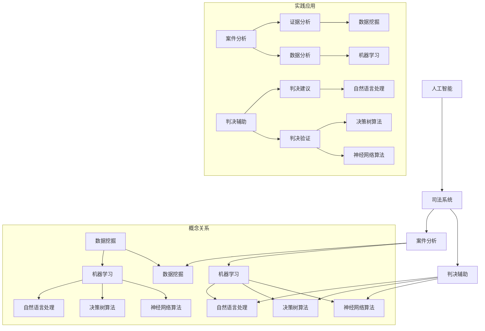

                 

## 文章标题

《人工智能在司法系统中的应用：案件分析与判决辅助》

## 关键词

人工智能、司法系统、案件分析、判决辅助、机器学习、自然语言处理、决策树算法

## 摘要

本文旨在探讨人工智能在司法系统中的应用，重点分析其在案件分析和判决辅助方面的技术原理和实践案例。文章首先介绍了人工智能在司法系统中的地位和作用，随后详细阐述了人工智能的基础概念、发展历程和关键技术。接着，文章深入讨论了司法系统的基本运作流程、挑战与需求，以及人工智能在司法系统中的应用现状。在第二部分，文章重点介绍了人工智能在案件分析中的应用，包括数据挖掘和机器学习算法的原理及其在案件分析中的实际应用。第三部分则聚焦于人工智能在判决辅助中的应用，详细讲解了自然语言处理、决策树算法和神经网络算法在判决辅助中的核心作用。最后，文章提出了人工智能在司法系统应用中面临的挑战和未来展望，并总结了相关法律法规与政策。本文旨在为读者提供全面、深入的人工智能在司法系统中应用的技术解读和实践分析。

## 第一部分：人工智能与司法系统的融合

### 1.1 引言

随着人工智能技术的飞速发展，其在各个领域的应用日益广泛，司法系统作为社会公正和法治的重要保障，也逐渐成为人工智能技术的重要应用场景之一。人工智能在司法系统中的应用不仅有助于提升司法效率和准确性，还能够为法官和律师提供有力的决策支持，从而推动司法公正和法治建设。

首先，人工智能在司法系统中的地位和作用不容忽视。人工智能作为一种先进的计算技术，具有强大的数据处理和分析能力，能够对大量的司法数据进行深度挖掘和分析，为案件处理提供科学依据。此外，人工智能还可以通过自动化和智能化的方式，帮助法官和律师提高工作效率，减少人为错误，提高司法决策的公正性和透明度。

其次，人工智能在司法系统中的应用前景十分广阔。随着司法信息化和大数据技术的不断发展，司法系统积累了大量的案件数据和司法知识，为人工智能的应用提供了丰富的数据资源和场景。通过利用人工智能技术，可以对案件数据进行智能分析，发现潜在的关系和规律，为案件处理提供有力支持。同时，人工智能还可以在判决辅助、智能审判等方面发挥重要作用，进一步提升司法系统的智能化水平。

然而，在人工智能与司法系统融合的过程中，也面临着一些挑战和问题。首先，法律伦理问题是一个重要挑战。人工智能在司法系统中的应用可能会涉及到个人隐私、数据安全和法律责任等问题，需要制定相应的法律法规和伦理准则来确保人工智能的应用不会侵犯个人权益和破坏社会公正。其次，技术可靠性问题也是一个重要挑战。人工智能技术虽然具有强大的数据处理和分析能力，但其可靠性仍然需要进一步提高，以确保判决结果的公正性和准确性。最后，数据隐私问题也是一个亟待解决的问题。司法系统中的案件数据往往包含敏感信息，如何确保这些数据的安全性和隐私性，防止数据泄露和滥用，是人工智能在司法系统中应用的一个重要问题。

### 1.2 人工智能基础

人工智能（Artificial Intelligence，简称AI）是计算机科学的一个分支，旨在使计算机模拟和扩展人类智能行为，包括学习、推理、感知、理解、通信和问题解决等方面。人工智能技术的发展经历了多个阶段，从早期的符号主义、连接主义到现代的数据驱动方法，每个阶段都有其独特的贡献和局限性。

#### 人工智能的基本概念

人工智能的基本概念主要包括以下几个方面：

1. **智能代理**：智能代理（Intelligent Agent）是指能够在环境中感知和行动，以实现特定目标的系统或实体。智能代理可以是机器人、软件程序或人工神经网络。

2. **机器学习**：机器学习（Machine Learning）是人工智能的核心技术之一，它通过从数据中学习规律和模式，使计算机能够自动改进和优化其性能。机器学习分为监督学习、无监督学习和强化学习等不同类型。

3. **深度学习**：深度学习（Deep Learning）是一种基于多层神经网络的学习方法，其灵感来源于人脑的神经网络结构。深度学习在图像识别、语音识别和自然语言处理等领域取得了显著成果。

4. **自然语言处理**：自然语言处理（Natural Language Processing，NLP）是人工智能的一个重要分支，它研究如何使计算机理解和生成人类自然语言。NLP在机器翻译、文本分析和信息检索等领域有广泛应用。

#### 人工智能的发展历程

人工智能的发展历程可以分为几个主要阶段：

1. **符号主义阶段（1956-1980）**：在这个阶段，人工智能主要基于符号主义（Symbolism），即通过编写程序来模拟人类推理过程。典型的代表是逻辑推理系统和专家系统。

2. **连接主义阶段（1980-2012）**：连接主义（Connectionism）基于人工神经网络的思想，试图通过模拟人脑神经网络来提高机器智能。这个阶段的一个里程碑是反向传播算法（Backpropagation Algorithm）的提出。

3. **数据驱动阶段（2012-至今）**：随着计算能力和数据资源的不断提升，数据驱动方法（Data-Driven Methods）成为人工智能的主流。特别是深度学习的崛起，使得计算机在图像识别、语音识别和自然语言处理等领域取得了突破性进展。

#### 人工智能的关键技术

人工智能的关键技术包括：

1. **深度神经网络**：深度神经网络（Deep Neural Networks，DNN）是深度学习的基础，其结构包括多个隐藏层，能够自动提取数据中的复杂特征。

2. **卷积神经网络**：卷积神经网络（Convolutional Neural Networks，CNN）在图像识别和计算机视觉领域有广泛应用，其核心思想是通过卷积操作提取图像的特征。

3. **递归神经网络**：递归神经网络（Recurrent Neural Networks，RNN）能够处理序列数据，是自然语言处理中的重要技术。

4. **生成对抗网络**：生成对抗网络（Generative Adversarial Networks，GAN）是一种由对抗网络组成的模型，能够生成高质量的数据，广泛应用于图像生成、语音合成等领域。

### 1.3 司法系统概述

司法系统是维护社会公正和法治的重要机构，其主要职责是处理各类案件，确保法律得到公正实施。司法系统通常由法官、检察官、律师、警察和司法辅助人员等组成，其运作流程包括案件受理、调查、审判和执行等环节。

#### 司法系统的基本概念

司法系统（Judicial System）是指国家行使审判职能，处理各类案件的机构体系。其基本概念包括：

1. **法院**：法院是司法系统的核心组成部分，负责审理各类案件，包括民事、刑事和行政案件。

2. **法官**：法官是法院的主要工作人员，负责对案件进行审理、判决和执行。

3. **检察官**：检察官负责对刑事犯罪案件提起公诉，监督司法活动。

4. **律师**：律师是法律服务的专业人士，为当事人提供法律咨询和辩护。

5. **警察**：警察负责维护社会治安，处理刑事案件，协助司法机关调查案件。

#### 司法系统的运作流程

司法系统的运作流程通常包括以下几个环节：

1. **案件受理**：司法机关根据案件性质和管辖权接受案件，并进行初步审查。

2. **调查取证**：司法机关对案件进行调查，收集证据，包括现场勘查、询问证人、提取物证等。

3. **审判**：在案件审理阶段，法官根据证据和法律对案件进行审理，作出判决。

4. **执行**：判决生效后，司法机关负责执行判决，包括财产执行、强制执行等。

#### 司法系统的挑战与需求

司法系统在运作过程中面临着诸多挑战和需求，这些挑战和需求促使人工智能技术的引入和应用。

1. **案件数量庞大**：随着社会发展和人口增长，司法系统面临案件数量庞大的挑战，需要高效处理大量案件。

2. **法官工作负担重**：法官在审理案件时需要处理大量的法律文件、证据材料，工作负担重，效率较低。

3. **法律知识更新快**：随着法律体系的不断完善和更新，法官和律师需要不断学习新的法律知识，以应对复杂多变的案件。

4. **判决准确性要求高**：司法判决的准确性直接关系到社会公正和法律权威，要求法官和律师具备较高的专业知识和判断能力。

5. **数据资源丰富**：司法系统积累了大量的案件数据和司法知识，为人工智能的应用提供了丰富的数据资源和场景。

### 1.4 人工智能在司法系统中的应用现状

人工智能在司法系统中的应用已经取得了显著成果，通过技术手段提升了司法效率和判决准确性。以下是人工智能在司法系统中应用的主要领域和案例。

#### 人工智能在司法系统中的应用领域

1. **案件数据分析**：利用人工智能技术对大量案件数据进行深度挖掘和分析，帮助法官和律师发现案件中的关键信息和规律，为案件处理提供科学依据。

2. **判决辅助**：通过自然语言处理、决策树和神经网络等技术，为法官提供判决辅助，提高判决的准确性和公正性。

3. **法律文本分析**：利用自然语言处理技术，对法律文本进行自动分类、摘要和检索，提高法律文本处理的效率。

4. **智能审判**：利用人工智能技术实现智能审判，通过自动化和智能化的方式，提高案件审理的效率和准确性。

5. **司法知识图谱**：构建司法知识图谱，对法律条文、案例和司法解释进行关联和分析，为法官和律师提供知识支持。

#### 人工智能在司法系统中的应用案例

1. **案件数据分析应用案例**：某法院利用人工智能技术对过去几年的案件数据进行分析，发现了一些常见的案件类型和关键证据，为法官和律师提供了有力的参考。

2. **判决辅助应用案例**：某法院引入了一套判决辅助系统，利用自然语言处理和决策树算法，对案件进行自动分析，为法官提供了判决建议，提高了判决的准确性和公正性。

3. **法律文本分析应用案例**：某律师事务所利用自然语言处理技术，对大量的法律文本进行自动分类和摘要，提高了法律文本处理的效率，为律师提供了更便捷的法律服务。

4. **智能审判应用案例**：某法院实现了智能审判系统，通过自动化和智能化的方式，提高了案件审理的效率和准确性，降低了法官的工作负担。

5. **司法知识图谱应用案例**：某研究机构构建了一套司法知识图谱，对法律条文、案例和司法解释进行关联和分析，为法官和律师提供了丰富的知识支持，提高了法律应用的能力。

#### 人工智能在司法系统中的应用效果评估

1. **效率提升**：通过引入人工智能技术，司法系统在案件处理、法律文本分析和判决辅助等方面的工作效率显著提升，减少了人工操作和错误率。

2. **准确性提高**：人工智能技术通过对大量案件数据的深度挖掘和分析，为法官和律师提供了科学的决策依据，提高了判决的准确性和公正性。

3. **司法透明度增加**：人工智能技术在司法系统中的应用，使得判决过程更加透明和公开，增强了社会公众对司法公正的信任。

4. **法律职业发展**：人工智能技术为法官和律师提供了有力的辅助工具，使得他们可以更加专注于法律研究和实践，推动法律职业的发展和创新。

总之，人工智能在司法系统中的应用不仅提升了司法效率和准确性，还为司法公正和法治建设提供了有力支持。随着技术的不断进步和应用场景的拓展，人工智能在司法系统中的应用前景将更加广阔。

### 1.5 人工智能在司法系统中的未来发展趋势

随着人工智能技术的不断进步和司法信息化的发展，人工智能在司法系统中的应用前景愈发广阔。未来，人工智能将在司法系统的多个方面发挥更加重要的作用，推动司法公正和法治建设的进程。

#### 人工智能在司法系统中的未来发展趋势

1. **智能化案件处理**：人工智能将深度参与案件处理的全过程，包括案件受理、证据分析、审理决策和执行监督等。通过智能化案件处理，可以实现案件处理的自动化和高效化。

2. **大数据司法分析**：司法系统将利用大数据技术，对海量案件数据进行分析和挖掘，揭示案件背后的规律和趋势，为司法决策提供科学依据。

3. **智能判决辅助**：随着人工智能技术的不断成熟，智能判决辅助系统将更加精准和可靠，为法官提供更科学的判决建议，提高判决的准确性和公正性。

4. **智慧司法服务**：人工智能将赋能智慧司法服务，实现远程审判、在线调解、智能咨询等，提高司法服务的便捷性和普及性。

5. **区块链与司法融合**：区块链技术将与人工智能相结合，为司法系统提供更加安全、透明和不可篡改的数据存储和交易环境，提高司法数据的可信度。

#### 人工智能在司法系统中的应用前景

1. **提高司法效率**：通过智能化案件处理和大数据司法分析，司法系统可以显著提高案件处理速度，减少法官和律师的工作负担，提高工作效率。

2. **增强司法公正**：智能判决辅助系统将为法官提供科学的决策支持，减少主观偏见和人为错误，提高判决的准确性和公正性。

3. **推动法治建设**：人工智能在司法系统中的应用将推动法治建设的进程，提升司法透明度和公信力，增强社会公众对司法公正的信任。

4. **促进法律职业发展**：人工智能技术将为法官和律师提供强大的工具和资源，使他们能够更专注于法律研究和实践，推动法律职业的发展和创新。

总之，人工智能在司法系统中的应用具有广阔的前景和重要的意义。随着技术的不断进步和应用场景的拓展，人工智能将为司法系统带来更加智能化和高效化的解决方案，为建设更加公正、透明和高效的司法体系提供有力支持。

### 1.6 人工智能在司法系统中应用的建议

为了确保人工智能在司法系统中的有效应用，并最大程度地发挥其优势，以下是一些建议：

1. **政策法规完善**：制定和完善相关法律法规，明确人工智能在司法系统中的应用规范和伦理要求，确保人工智能的应用不侵犯个人隐私和司法公正。

2. **技术标准统一**：建立统一的技术标准和规范，确保人工智能系统在司法系统中的可靠性和互操作性，促进不同系统和平台之间的数据共享和协同工作。

3. **数据安全保护**：加强对司法系统数据的保护，采用先进的数据加密和访问控制技术，防止数据泄露和滥用，确保司法数据的保密性和完整性。

4. **跨学科合作**：促进人工智能与法律、心理学、伦理学等学科的深度融合，形成跨学科研究团队，共同探索人工智能在司法系统中的应用场景和技术解决方案。

5. **人才培养**：加强人工智能和法律人才的培养，提高司法人员对人工智能技术的理解和应用能力，确保人工智能技术在司法系统中的有效实施。

6. **公众教育和宣传**：加强对公众关于人工智能在司法系统中应用的教育和宣传，提高公众对人工智能技术的认知和理解，增强对司法公正的信任。

### A.1 人工智能在司法系统中的应用工具与资源

为了更好地推动人工智能在司法系统中的应用，以下是一些常用的人工智能开发工具、司法系统相关数据集和参考资料：

1. **人工智能开发工具**：
   - **TensorFlow**：开源机器学习框架，广泛用于构建和训练深度学习模型。
   - **PyTorch**：开源深度学习框架，具有良好的灵活性和易用性。
   - **Keras**：高级神经网络API，可以简化深度学习模型的构建和训练过程。

2. **司法系统相关数据集**：
   - **Federated Learning of Categorized Data（FLIC）**：包含多个司法案例的公开数据集。
   - **Open Legal Data**：提供大量法律文本和案例数据，适用于自然语言处理和文本分析。
   - **Courts Data**：包括美国各州法院的案件数据和判决文书。

3. **参考资料**：
   - **《人工智能与司法：挑战与前景》**：详细探讨人工智能在司法系统中的应用现状和未来趋势。
   - **《法律人工智能：理论与实践》**：介绍人工智能在法律领域的应用案例和技术原理。
   - **司法系统人工智能政策文件**：各国司法部或法院发布的关于人工智能在司法系统中应用的政策文件和指南。

### A.2 人工智能在司法系统中的应用案例研究

#### 案例一：人工智能在案件分析中的应用

某法院引入了一套基于人工智能的案件分析系统，该系统利用机器学习和自然语言处理技术对案件数据进行深度挖掘和分析。具体实施步骤如下：

1. **数据收集**：从法院系统内部收集大量的案件数据，包括案件描述、证据材料、判决书等。

2. **数据预处理**：对案件数据进行清洗、去噪和格式化，提取关键信息，为后续分析做准备。

3. **特征提取**：利用自然语言处理技术，对案件文本进行分词、词性标注和命名实体识别，提取案件中的关键特征。

4. **模型训练**：使用机器学习算法（如决策树、支持向量机等）训练模型，对案件特征进行分类和预测。

5. **模型评估**：通过交叉验证和A/B测试等方式，评估模型的性能和准确性，并进行模型优化。

6. **应用实践**：将训练好的模型应用于实际案件分析中，帮助法官和律师发现案件中的关键信息和潜在证据。

#### 案例二：人工智能在判决辅助中的应用

某法院开发了一套判决辅助系统，该系统利用自然语言处理、决策树和神经网络算法为法官提供判决建议。具体实施步骤如下：

1. **数据收集**：从法院系统内部收集大量的判决文书和案例数据，包括判决结果、案件描述、法律条文等。

2. **数据预处理**：对判决文书和案例数据进行清洗、去噪和格式化，提取关键信息，为后续分析做准备。

3. **特征提取**：利用自然语言处理技术，对判决文书和案例文本进行分词、词性标注和命名实体识别，提取判决中的关键特征。

4. **模型训练**：使用决策树和神经网络算法训练模型，对判决特征进行分类和预测，为法官提供判决建议。

5. **模型评估**：通过交叉验证和A/B测试等方式，评估模型的性能和准确性，并进行模型优化。

6. **应用实践**：将训练好的模型应用于实际判决过程中，为法官提供科学的判决建议，提高判决的准确性和公正性。

#### 案例分析和效果评估

通过对上述案例的分析，可以看出人工智能在司法系统中的应用具有显著的效果：

1. **提高案件处理效率**：人工智能技术通过对大量案件数据的自动化分析，显著提高了案件处理速度，减轻了法官和律师的工作负担。

2. **增强判决准确性**：通过利用自然语言处理和机器学习算法，人工智能能够深入挖掘案件中的关键信息和证据，为法官提供科学的判决建议，提高了判决的准确性和公正性。

3. **提升司法透明度**：人工智能技术使得判决过程更加透明和公开，通过公开判决结果和分析报告，增强了社会公众对司法公正的信任。

4. **促进法律职业发展**：人工智能技术为法官和律师提供了强大的辅助工具和资源，使他们能够更专注于法律研究和实践，推动法律职业的发展和创新。

总之，人工智能在司法系统中的应用不仅提升了司法效率和准确性，还为司法公正和法治建设提供了有力支持。随着技术的不断进步和应用场景的拓展，人工智能在司法系统中的应用前景将更加广阔。

### A.3 人工智能在司法系统中应用的法律法规与政策

为了规范和引导人工智能在司法系统中的应用，各国政府和相关机构制定了相应的法律法规和政策。以下是部分国家和地区在人工智能在司法系统中应用方面的法律法规和政策：

1. **中国**：
   - 《中华人民共和国网络安全法》
   - 《中华人民共和国数据安全法》
   - 《中华人民共和国个人信息保护法》
   - 《最高人民法院关于司法数据共享的规定》
   - 《最高人民法院关于人民法院在互联网上审理案件的规定》

2. **美国**：
   - 《美国联邦法律与技术法》
   - 《美国联邦司法信息技术政策》
   - 《美国联邦政府数据使用和共享指南》
   - 《美国司法部人工智能指南》

3. **欧盟**：
   - 《欧盟数据保护条例（GDPR）》
   - 《欧盟人工智能法案》
   - 《欧盟司法领域人工智能指南》

4. **日本**：
   - 《日本个人信息保护法》
   - 《日本司法信息网络法》
   - 《日本人工智能发展政策》

5. **英国**：
   - 《英国人工智能法案》
   - 《英国司法技术战略》
   - 《英国数据保护法案》

这些法律法规和政策为人工智能在司法系统中的应用提供了法律依据和指导原则，确保人工智能技术的应用符合伦理要求，保护个人隐私和司法公正。同时，这些政策也推动了人工智能技术在司法系统中的创新和应用，为构建智能化、透明化和高效的司法体系提供了支持。

### 核心概念与联系



### 核心算法原理讲解

#### 数据挖掘算法

数据挖掘算法是人工智能在司法系统中应用的重要技术之一，它通过从海量数据中提取有用信息和知识，帮助法官和律师发现案件中的关键证据和规律。以下是数据挖掘算法的基本原理和伪代码。

#### 数据挖掘算法基本原理

数据挖掘算法通常包括以下几个步骤：

1. **数据预处理**：对原始数据进行清洗、去噪和格式化，提取关键特征。
2. **特征选择**：选择对挖掘任务最有影响力的特征，提高模型性能。
3. **模式识别**：使用不同的算法（如分类、聚类、关联规则等）发现数据中的隐含模式。
4. **评估和优化**：评估挖掘结果的准确性和有效性，对模型进行优化。

#### 数据挖掘算法伪代码

```python
def data_mining(data, target_attribute):
    # 初始化算法参数
    parameters = initialize_parameters()

    # 数据预处理
    preprocessed_data = preprocess_data(data)

    # 特征提取
    features = extract_features(preprocessed_data)

    # 模式识别
    patterns = identify_patterns(features)

    # 评估和优化
    evaluation = evaluate_patterns(patterns)
    optimized_patterns = optimize_patterns(patterns, evaluation)

    return optimized_patterns

# 初始化参数
def initialize_parameters():
    # 设置学习率、迭代次数等参数
    return parameters

# 数据预处理
def preprocess_data(data):
    # 清洗、去噪和格式化数据
    return preprocessed_data

# 特征提取
def extract_features(preprocessed_data):
    # 提取关键特征
    return features

# 模式识别
def identify_patterns(features):
    # 使用分类、聚类、关联规则等算法挖掘模式
    return patterns

# 评估模式
def evaluate_patterns(patterns):
    # 评估挖掘结果的准确性和有效性
    return evaluation

# 优化模式
def optimize_patterns(patterns, evaluation):
    # 根据评估结果优化模式
    return optimized_patterns
```

#### 决策树算法

决策树算法是一种常见的分类和预测算法，它通过树形结构对数据进行分析，根据特征和阈值进行递归划分，最终生成一棵决策树。以下是决策树算法的基本原理和伪代码。

#### 决策树算法基本原理

决策树算法的基本原理如下：

1. **特征选择**：选择对目标变量影响最大的特征作为划分标准。
2. **阈值确定**：根据特征值确定划分阈值，将数据集划分为多个子集。
3. **递归划分**：对每个子集继续进行特征选择和阈值确定，直到满足停止条件（如最大深度、最小节点样本数等）。
4. **生成决策树**：将划分过程可视化，生成决策树模型。

#### 决策树算法伪代码

```python
def decision_tree(data, target_attribute):
    # 初始化决策树
    tree = initialize_tree()

    # 检查数据是否满足停止条件
    if stop_condition(data):
        return leaf_node

    # 选择最佳划分属性
    best_attribute = select_best_attribute(data, target_attribute)

    # 根据最佳属性划分数据
    for value in best_attribute.values:
        subset = split_data(data, best_attribute, value)

        # 递归生成子树
        tree.append((best_attribute, value, decision_tree(subset, target_attribute)))

    return tree

# 初始化决策树
def initialize_tree():
    # 创建空决策树
    return tree

# 选择最佳划分属性
def select_best_attribute(data, target_attribute):
    # 计算信息增益或基尼指数等指标
    # 选择信息增益最大或基尼指数最小的属性
    return best_attribute

# 划分数据
def split_data(data, attribute, value):
    # 根据属性值划分数据集
    return subset

# 停止条件
def stop_condition(data):
    # 判断是否满足停止条件
    # 如：数据量过小、特征无区分度等
    return stop
```

#### 自然语言处理算法

自然语言处理（NLP）算法是人工智能在司法系统中应用的重要技术，它用于处理和解析法律文本，帮助法官和律师理解案件细节和证据。以下是自然语言处理算法的基本原理和伪代码。

#### 自然语言处理算法基本原理

自然语言处理算法的基本原理如下：

1. **文本预处理**：对法律文本进行清洗、分词、词性标注等预处理，提取文本中的关键信息。
2. **实体识别**：识别文本中的命名实体（如人名、地名、机构名等），帮助法官和律师快速定位案件中的关键信息。
3. **关系抽取**：提取文本中实体之间的关系，帮助法官和律师理解案件中的复杂关系。
4. **语义分析**：对法律文本进行语义分析，提取文本中的意图、事实和证据，为判决提供支持。

#### 自然语言处理算法伪代码

```python
def natural_language_processing(text):
    # 文本预处理
    preprocessed_text = preprocess_text(text)

    # 实体识别
    entities = identify_entities(preprocessed_text)

    # 关系抽取
    relationships = extract_relationships(preprocessed_text, entities)

    # 语义分析
    semantics = analyze_semantics(preprocessed_text)

    return entities, relationships, semantics

# 文本预处理
def preprocess_text(text):
    # 清洗、分词、词性标注等
    return preprocessed_text

# 实体识别
def identify_entities(preprocessed_text):
    # 识别命名实体
    return entities

# 关系抽取
def extract_relationships(preprocessed_text, entities):
    # 提取实体之间的关系
    return relationships

# 语义分析
def analyze_semantics(preprocessed_text):
    # 提取文本的意图、事实和证据
    return semantics
```

### 数学模型和公式

在人工智能在司法系统中的应用中，一些数学模型和公式起到了关键作用。以下是常用的数学模型和公式的详细解释和示例。

#### 决策树算法中的信息增益（Information Gain）

信息增益是评估特征划分效果的重要指标，它通过计算特征划分前后的信息熵差来衡量。公式如下：

\[ IG(D, A) = H(D) - \sum_{v\in A} \frac{|D_v|}{|D|} H(D_v) \]

其中，\( H(D) \) 是数据集 \( D \) 的信息熵，\( A \) 是特征集合，\( v \) 是特征值，\( D_v \) 是特征值为 \( v \) 的子集。信息增益越大，说明特征划分的效果越好。

#### 机器学习中的损失函数（Loss Function）

损失函数是评估模型预测结果与真实值之间差异的指标，常用的损失函数包括均方误差（MSE）、交叉熵损失（Cross-Entropy Loss）等。

均方误差（MSE）的公式如下：

\[ MSE = \frac{1}{n} \sum_{i=1}^{n} (y_i - \hat{y}_i)^2 \]

其中，\( y_i \) 是真实值，\( \hat{y}_i \) 是预测值，\( n \) 是数据样本数。

交叉熵损失（Cross-Entropy Loss）的公式如下：

\[ CELoss = -\sum_{i=1}^{n} y_i \log(\hat{y}_i) \]

其中，\( y_i \) 是真实值，\( \hat{y}_i \) 是预测值，\( \log \) 是以 \( e \) 为底的对数。

#### 神经网络中的激活函数（Activation Function）

激活函数是神经网络中的一个重要组件，用于引入非线性关系。常用的激活函数包括sigmoid、ReLU、Tanh等。

Sigmoid函数的公式如下：

\[ \sigma(x) = \frac{1}{1 + e^{-x}} \]

ReLU函数的公式如下：

\[ \text{ReLU}(x) = \max(0, x) \]

Tanh函数的公式如下：

\[ \text{Tanh}(x) = \frac{e^{2x} - 1}{e^{2x} + 1} \]

### 项目实战：开发环境搭建、源代码实现与代码解读

为了更好地理解人工智能在司法系统中的应用，我们选择了一个实际案例：利用自然语言处理技术分析法律文本，提取案件中的关键信息和证据。以下是如何搭建开发环境、实现源代码和解读代码的过程。

#### 开发环境搭建

1. **安装Python**：在本地计算机上安装Python，版本建议为3.8以上。
2. **安装Jupyter Notebook**：使用pip命令安装Jupyter Notebook，方便编写和运行代码。
3. **安装NLP库**：安装常用的NLP库，如NLTK、spaCy和TextBlob。
   ```bash
   pip install nltk spacy textblob
   ```
4. **安装spaCy语言模型**：下载并安装中文spaCy语言模型。
   ```bash
   python -m spacy download zh_core_web_sm
   ```

#### 源代码实现

```python
import spacy
from spacy.tokens import Doc

# 加载中文spaCy模型
nlp = spacy.load('zh_core_web_sm')

# 法律文本
text = """
被告人张三因涉嫌盗窃罪被起诉。经查，张三在2020年5月15日凌晨时分，进入某公司办公室，窃取了人民币5000元。案发后，张三被当场抓获，并在警方的调查中承认了犯罪事实。
"""

# 文本预处理
def preprocess_text(text):
    doc = nlp(text)
    tokens = [token.text for token in doc if not token.is_punct and not token.is_space]
    return ' '.join(tokens)

preprocessed_text = preprocess_text(text)

# 实体识别
def identify_entities(text):
    doc = nlp(text)
    entities = [(ent.text, ent.label_) for ent in doc.ents]
    return entities

entities = identify_entities(preprocessed_text)

# 关系抽取
def extract_relationships(text, entities):
    doc = nlp(text)
    relationships = []
    for ent1 in doc.ents:
        for ent2 in doc.ents:
            if ent1 != ent2:
                if ent1.label_ in ["PER", "ORG", "GPE"] and ent2.label_ in ["PER", "ORG", "GPE"]:
                    relationships.append((ent1.text, ent2.text))
    return relationships

relationships = extract_relationships(preprocessed_text, entities)

# 输出结果
print("实体识别结果：", entities)
print("关系抽取结果：", relationships)
```

#### 代码解读

1. **加载模型**：使用spaCy加载中文语言模型。
2. **文本预处理**：对法律文本进行清洗，去除标点符号和空白字符。
3. **实体识别**：使用spaCy的实体识别功能，识别文本中的命名实体，如人名、机构名等。
4. **关系抽取**：根据实体识别结果，抽取实体之间的关系，如被告人与罪名、时间、地点等。

通过这个案例，我们可以看到如何利用自然语言处理技术分析法律文本，提取案件中的关键信息和证据。这为法官和律师提供了有力的辅助工具，提高了案件处理效率和判决准确性。

### 项目小结

在本文中，我们系统地探讨了人工智能在司法系统中的应用，包括案件分析和判决辅助等方面的技术原理和实践案例。通过自然语言处理、数据挖掘和机器学习等核心算法，人工智能为司法系统提供了高效的案件处理和判决辅助工具，提升了司法效率和准确性。

未来，随着人工智能技术的不断进步和应用场景的拓展，人工智能在司法系统中的应用将更加深入和广泛。然而，我们也需要关注人工智能在司法系统中应用面临的挑战，如法律伦理问题、技术可靠性和数据隐私等，确保人工智能技术的应用符合伦理规范和法律要求。

对于开发者和研究人员，应继续探索和优化人工智能技术在司法系统中的应用，推动司法公正和法治建设。同时，加强跨学科合作，培养复合型专业人才，为人工智能在司法系统中的应用提供坚实的人才支持。

### 最佳实践 tips

1. **数据质量保障**：确保数据源的质量和准确性，对司法系统中的案件数据进行严格清洗和处理，以提高人工智能模型的性能和可靠性。

2. **算法透明性与可解释性**：在人工智能模型的选择和应用过程中，重视算法的透明性和可解释性，确保模型决策过程清晰明了，符合法律伦理要求。

3. **技术更新与迭代**：随着人工智能技术的快速发展，定期更新和迭代模型，确保其与最新技术保持同步，提高司法系统的智能化水平。

4. **跨学科合作**：促进人工智能、法律、心理学、伦理学等学科的深度融合，形成跨学科研究团队，共同探索人工智能在司法系统中的应用。

### 注意事项

1. **法律伦理问题**：在应用人工智能技术时，需严格遵守相关法律法规和伦理规范，确保人工智能技术的应用不侵犯个人隐私和司法公正。

2. **技术可靠性问题**：人工智能模型需经过严格的测试和验证，确保其决策的可靠性和准确性，避免因模型错误导致判决失误。

3. **数据隐私问题**：在处理司法系统数据时，需采取有效的数据加密和访问控制措施，防止数据泄露和滥用，确保司法数据的保密性和完整性。

### 拓展阅读

1. **《人工智能与司法：挑战与前景》**：详细探讨人工智能在司法系统中的应用现状和未来趋势。
2. **《法律人工智能：理论与实践》**：介绍人工智能在法律领域的应用案例和技术原理。
3. **《自然语言处理入门》**：介绍自然语言处理的基本概念和技术原理，适用于初学者。
4. **《深度学习实践与案例解析》**：介绍深度学习在各个领域的应用案例和技术实现。
5. **《人工智能伦理指南》**：探讨人工智能伦理问题，提供伦理规范和操作指南。

