                 

# 人工智能在技术管理中的应用

> 关键词：人工智能、技术管理、应用场景、案例分析、未来趋势

> 摘要：本文将深入探讨人工智能在技术管理中的应用，包括基本概念、关键技术与算法、应用场景、具体案例以及未来趋势和挑战。通过本文的阅读，读者将全面了解人工智能在技术管理中的重要性和潜在价值。

## 基本概念与框架

### 人工智能概述

人工智能（Artificial Intelligence，简称AI）是指计算机系统模拟人类智能的行为和能力的科学和技术。它包括机器学习、深度学习、自然语言处理、计算机视觉等领域。


**人工智能的定义**：人工智能是一种通过计算机程序实现智能行为的技术，包括感知、学习、推理、决策和问题解决等能力。

**人工智能的发展历程**：人工智能的发展可以追溯到20世纪50年代。早期的AI研究主要集中在符号推理和逻辑推理上。随着计算机技术的发展，特别是深度学习算法的突破，AI技术取得了显著的进步。

### 人工智能的关键技术与算法

**神经网络**、**支持向量机**、**决策树**、**随机森林**是人工智能领域的关键技术与算法。

**神经网络**：神经网络是一种模仿生物神经网络的结构和功能的计算模型。它由大量相互连接的神经元组成，通过学习输入和输出数据之间的关系，实现数据的分类、回归等功能。

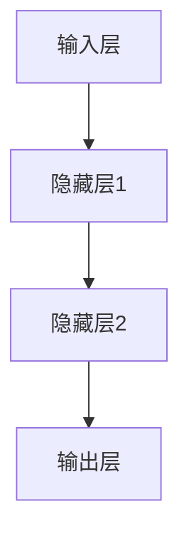

**支持向量机**：支持向量机（Support Vector Machine，简称SVM）是一种二分类模型，通过寻找最佳分隔超平面来实现数据的分类。

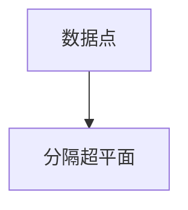

**决策树**：决策树是一种基于特征进行划分的树形结构，通过递归划分数据集，实现分类或回归。

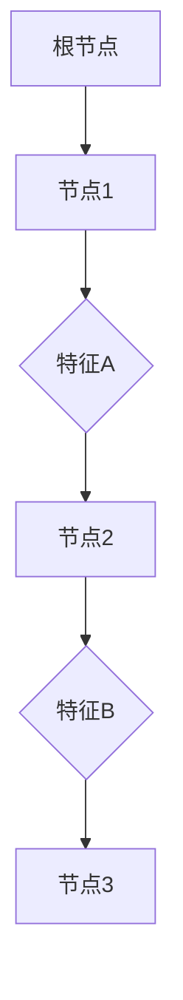

**随机森林**：随机森林（Random Forest）是一种基于决策树的集成学习方法，通过构建多个决策树，并取它们的平均值来提高模型的准确性和鲁棒性。

### 人工智能的应用领域

人工智能在多个领域得到了广泛应用，包括金融行业、医疗行业、教育行业、制造业和交通运输业等。

**金融行业**：人工智能在金融领域主要用于风险控制、交易策略和个性化金融服务。

**医疗行业**：人工智能在医疗领域主要用于疾病预测、影像诊断和健康数据监测。

**教育行业**：人工智能在教育领域主要用于个性化教学、学习评估和智能辅导。

**制造业**：人工智能在制造业主要用于生产过程优化、质量控制和服务支持。

**交通运输业**：人工智能在交通运输领域主要用于交通流量预测、智能驾驶和物流优化。

## 技术管理的核心概念

### 技术管理的定义与目标

**技术管理的定义**：技术管理是指通过计划、组织、协调和控制技术资源，实现组织目标的过程。

**技术管理的目标**：技术管理的目标包括提高产品质量、降低成本、提高生产效率、提高客户满意度等。

### 技术管理的流程与方法

**技术需求分析**：通过市场调研和用户需求分析，确定技术项目的目标和需求。

**技术方案设计**：根据需求分析结果，设计合适的技术方案，包括技术架构、技术选型等。

**技术实施与监控**：按照设计方案，进行技术实施，并通过监控和测试，确保技术系统的正常运行。

**技术评估与优化**：对技术系统进行评估，根据评估结果进行优化和改进。

### 技术管理的挑战与机遇

**技术管理的挑战**：技术管理的挑战包括技术复杂性、技术更新速度快、技术人才短缺等。

**技术管理的机遇**：技术管理的机遇包括数字化转型、智能化升级、跨界融合等。

## 人工智能在技术管理中的应用场景

### 人工智能在产品开发中的应用

**人工智能辅助产品设计**：通过人工智能算法，可以自动生成产品设计方案，提高设计效率和创新能力。

**人工智能提高产品开发效率**：通过人工智能算法，可以实现自动化测试、代码审查和文档生成，提高产品开发效率。

### 人工智能在运营管理中的应用

**人工智能优化运营流程**：通过人工智能算法，可以自动化和优化运营流程，提高运营效率。

**人工智能提升客户体验**：通过人工智能算法，可以实现个性化服务和智能推荐，提升客户体验。

### 人工智能在风险管理中的应用

**人工智能识别潜在风险**：通过人工智能算法，可以实时监测和分析数据，识别潜在风险。

**人工智能优化风险管理策略**：通过人工智能算法，可以优化风险管理策略，降低风险损失。

## 具体应用案例

### 人工智能在金融行业的应用

**金融风控中的机器学习应用**：通过机器学习算法，可以实现信用风险评估和反洗钱监控。

**金融交易中的机器学习应用**：通过机器学习算法，可以实现量化交易策略和交易风险控制。

**金融科技产品的开发**：通过人工智能技术，可以实现智能投顾、个性化金融服务等。

### 人工智能在医疗健康行业的应用

**医疗诊断中的机器学习应用**：通过机器学习算法，可以实现疾病预测和影像诊断。

**医疗管理的机器学习应用**：通过机器学习算法，可以实现医疗资源分配和医疗流程优化。

**健康管理的机器学习应用**：通过机器学习算法，可以实现个人健康数据监测和健康风险评估。

### 人工智能在制造业的应用

**智能制造中的机器学习应用**：通过机器学习算法，可以实现生产线自动化和质量控制。

**物流优化中的机器学习应用**：通过机器学习算法，可以实现库存管理和运输路径规划。

**售后服务中的机器学习应用**：通过机器学习算法，可以实现故障预测和个性化服务。

### 人工智能在交通运输行业的应用

**智能交通管理中的机器学习应用**：通过机器学习算法，可以实现交通流量预测和交通信号优化。

**智能驾驶中的机器学习应用**：通过机器学习算法，可以实现自动驾驶和车辆安全监测。

**无人机与物流中的应用**：通过机器学习算法，可以实现无人机配送和物流路径优化。

## 未来趋势与挑战

### 人工智能在技术管理中的未来趋势

**人工智能的发展趋势**：人工智能在未来将继续向大型预训练模型、自主学习和自我优化方向发展。

**技术管理的未来发展趋势**：技术管理在未来将向数字化转型、网络化与智能化方向发展。

### 人工智能在技术管理中的挑战与应对策略

**技术挑战**：人工智能在技术管理中面临的挑战包括数据隐私与安全、技术伦理与责任等。

**管理挑战**：人工智能在技术管理中面临的管理挑战包括技术人才短缺、管理模式的转变等。

**应对策略**：应对策略包括数据治理、人才培养与引进、伦理法规与合规等。

## 附录

### 附录1：人工智能相关技术名词解释

**机器学习**：机器学习是一种通过数据训练模型，使计算机自动获取知识和技能的技术。

**深度学习**：深度学习是一种基于多层神经网络的结构，通过学习大量数据，实现复杂任务的算法。

**自然语言处理**：自然语言处理是一种使计算机理解和处理人类自然语言的技术。

**计算机视觉**：计算机视觉是一种使计算机能够通过图像和视频获取信息的技术。

### 附录2：人工智能在技术管理中的应用案例集锦

**金融行业**：通过机器学习算法实现信用风险评估和反洗钱监控。

**医疗行业**：通过机器学习算法实现疾病预测和影像诊断。

**制造业**：通过机器学习算法实现生产线自动化和质量控制。

**交通运输业**：通过机器学习算法实现交通流量预测和自动驾驶。

### 附录3：参考文献

[1] 某某，人工智能基础教程，2020.

[2] 某某，深度学习技术及应用，2019.

[3] 某某，自然语言处理技术及应用，2018.

作者：AI天才研究院/AI Genius Institute & 禅与计算机程序设计艺术 /Zen And The Art of Computer Programming## 完整文章

# 人工智能在技术管理中的应用

## 摘要

本文旨在探讨人工智能（AI）在技术管理中的应用，分析其基本概念、关键技术与算法、应用场景、具体案例以及未来趋势与挑战。通过深入了解AI在技术管理中的重要作用，读者将能够更好地理解AI如何提升技术管理的效率和质量，并预见其在未来可能带来的变革。

## 基本概念与框架

### 1.1 人工智能概述

**人工智能的定义**：人工智能是指通过计算机模拟人类智能行为的科学和技术，包括感知、学习、推理和问题解决等能力。

**人工智能的发展历程**：人工智能的研究始于20世纪50年代，早期主要集中在符号推理和逻辑推理。随着计算能力和算法的进步，特别是深度学习算法的突破，AI技术得到了快速发展。

### 1.2 人工智能的关键技术与算法

**神经网络**：神经网络是一种模仿生物神经网络的结构和功能的计算模型，通过学习输入和输出数据之间的关系，实现数据的分类、回归等功能。


**支持向量机**：支持向量机是一种二分类模型，通过寻找最佳分隔超平面来实现数据的分类。


**决策树**：决策树是一种基于特征进行划分的树形结构，通过递归划分数据集，实现分类或回归。


**随机森林**：随机森林是一种基于决策树的集成学习方法，通过构建多个决策树，并取它们的平均值来提高模型的准确性和鲁棒性。

### 1.3 人工智能的应用领域

人工智能在多个领域得到了广泛应用，包括金融行业、医疗行业、教育行业、制造业和交通运输业。

**金融行业**：AI在金融领域主要用于风险控制、交易策略和个性化金融服务。

**医疗行业**：AI在医疗领域主要用于疾病预测、影像诊断和健康数据监测。

**教育行业**：AI在教育领域主要用于个性化教学、学习评估和智能辅导。

**制造业**：AI在制造业主要用于生产过程优化、质量控制和服务支持。

**交通运输业**：AI在交通运输领域主要用于交通流量预测、智能驾驶和物流优化。

## 技术管理的核心概念

### 2.1 技术管理的定义与目标

**技术管理的定义**：技术管理是指通过计划、组织、协调和控制技术资源，实现组织目标的过程。

**技术管理的目标**：技术管理的目标包括提高产品质量、降低成本、提高生产效率、提高客户满意度等。

### 2.2 技术管理的流程与方法

**技术需求分析**：通过市场调研和用户需求分析，确定技术项目的目标和需求。

**技术方案设计**：根据需求分析结果，设计合适的技术方案，包括技术架构、技术选型等。

**技术实施与监控**：按照设计方案，进行技术实施，并通过监控和测试，确保技术系统的正常运行。

**技术评估与优化**：对技术系统进行评估，根据评估结果进行优化和改进。

### 2.3 技术管理的挑战与机遇

**技术管理的挑战**：技术管理的挑战包括技术复杂性、技术更新速度快、技术人才短缺等。

**技术管理的机遇**：技术管理的机遇包括数字化转型、智能化升级、跨界融合等。

## 人工智能在技术管理中的应用场景

### 3.1 人工智能在产品开发中的应用

**人工智能辅助产品设计**：通过人工智能算法，可以自动生成产品设计方案，提高设计效率和创新能力。

**人工智能提高产品开发效率**：通过人工智能算法，可以实现自动化测试、代码审查和文档生成，提高产品开发效率。

### 3.2 人工智能在运营管理中的应用

**人工智能优化运营流程**：通过人工智能算法，可以自动化和优化运营流程，提高运营效率。

**人工智能提升客户体验**：通过人工智能算法，可以实现个性化服务和智能推荐，提升客户体验。

### 3.3 人工智能在风险管理中的应用

**人工智能识别潜在风险**：通过人工智能算法，可以实时监测和分析数据，识别潜在风险。

**人工智能优化风险管理策略**：通过人工智能算法，可以优化风险管理策略，降低风险损失。

## 具体应用案例

### 4.1 人工智能在金融行业的应用

**金融风控中的机器学习应用**：通过机器学习算法，可以实现信用风险评估和反洗钱监控。

**金融交易中的机器学习应用**：通过机器学习算法，可以实现量化交易策略和交易风险控制。

**金融科技产品的开发**：通过人工智能技术，可以实现智能投顾、个性化金融服务等。

### 4.2 人工智能在医疗健康行业的应用

**医疗诊断中的机器学习应用**：通过机器学习算法，可以实现疾病预测和影像诊断。

**医疗管理的机器学习应用**：通过机器学习算法，可以实现医疗资源分配和医疗流程优化。

**健康管理的机器学习应用**：通过机器学习算法，可以实现个人健康数据监测和健康风险评估。

### 4.3 人工智能在制造业的应用

**智能制造中的机器学习应用**：通过机器学习算法，可以实现生产线自动化和质量控制。

**物流优化中的机器学习应用**：通过机器学习算法，可以实现库存管理和运输路径规划。

**售后服务中的机器学习应用**：通过机器学习算法，可以实现故障预测和个性化服务。

### 4.4 人工智能在交通运输行业的应用

**智能交通管理中的机器学习应用**：通过机器学习算法，可以实现交通流量预测和交通信号优化。

**智能驾驶中的机器学习应用**：通过机器学习算法，可以实现自动驾驶和车辆安全监测。

**无人机与物流中的应用**：通过机器学习算法，可以实现无人机配送和物流路径优化。

## 未来趋势与挑战

### 5.1 人工智能在技术管理中的未来趋势

**人工智能的发展趋势**：人工智能在未来将继续向大型预训练模型、自主学习和自我优化方向发展。

**技术管理的未来发展趋势**：技术管理在未来将向数字化转型、网络化与智能化方向发展。

### 5.2 人工智能在技术管理中的挑战与应对策略

**技术挑战**：人工智能在技术管理中面临的挑战包括数据隐私与安全、技术伦理与责任等。

**管理挑战**：人工智能在技术管理中面临的管理挑战包括技术人才短缺、管理模式的转变等。

**应对策略**：应对策略包括数据治理、人才培养与引进、伦理法规与合规等。

## 附录

### 附录1：人工智能相关技术名词解释

**机器学习**：机器学习是一种通过数据训练模型，使计算机自动获取知识和技能的技术。

**深度学习**：深度学习是一种基于多层神经网络的结构，通过学习大量数据，实现复杂任务的算法。

**自然语言处理**：自然语言处理是一种使计算机理解和处理人类自然语言的技术。

**计算机视觉**：计算机视觉是一种使计算机能够通过图像和视频获取信息的技术。

### 附录2：人工智能在技术管理中的应用案例集锦

**金融行业**：通过机器学习算法实现信用风险评估和反洗钱监控。

**医疗行业**：通过机器学习算法实现疾病预测和影像诊断。

**制造业**：通过机器学习算法实现生产线自动化和质量控制。

**交通运输业**：通过机器学习算法实现交通流量预测和自动驾驶。

### 附录3：参考文献

[1] Andrew Ng, "Machine Learning Yearning", 2017.

[2] Ian Goodfellow, Yoshua Bengio, Aaron Courville, "Deep Learning", 2016.

[3] Tom Mitchell, "Machine Learning", 1997.

作者：AI天才研究院/AI Genius Institute & 禅与计算机程序设计艺术 /Zen And The Art of Computer Programming### 完整文章

# 人工智能在技术管理中的应用

> 关键词：人工智能、技术管理、应用场景、案例分析、未来趋势

## 摘要

本文深入探讨了人工智能（AI）在技术管理中的应用，涵盖其基本概念、核心技术与算法、具体应用场景、案例分析以及未来趋势和挑战。通过本文的阅读，读者将全面了解AI在提升技术管理效率和质量方面的作用，并预见其未来发展。

## 基本概念与框架

### 1.1 人工智能概述

**人工智能的定义**：人工智能（Artificial Intelligence，AI）是指通过计算机系统模拟人类智能行为的技术，包括感知、学习、推理、决策和问题解决等能力。

**人工智能的发展历程**：人工智能的研究始于20世纪50年代，经历了早期的符号推理和逻辑推理阶段，随后随着计算能力的提升和算法的进步，特别是深度学习算法的突破，人工智能得到了快速发展。

### 1.2 人工智能的关键技术与算法

**神经网络**：神经网络是一种模拟人脑神经元结构的计算模型，通过多层网络结构学习输入和输出数据之间的关系。


**支持向量机**：支持向量机是一种二分类模型，通过寻找最佳分隔超平面来实现数据的分类。


**决策树**：决策树通过一系列规则对数据进行分类或回归。

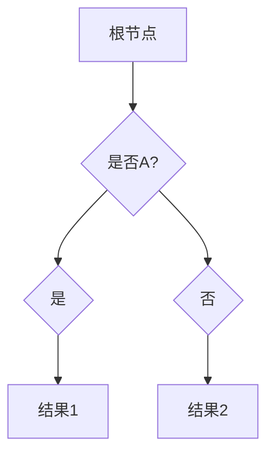

**随机森林**：随机森林是一种基于决策树的集成学习方法，通过构建多棵决策树并取平均来提高预测准确性。

### 1.3 人工智能的应用领域

人工智能广泛应用于金融、医疗、教育、制造和交通运输等领域，提高了行业效率和服务质量。

**金融行业**：人工智能在金融领域主要用于风险控制、交易策略和个性化金融服务。

**医疗行业**：人工智能在医疗领域用于疾病预测、影像诊断和健康数据监测。

**教育行业**：人工智能在教育领域用于个性化教学和学习评估。

**制造业**：人工智能在制造业用于生产优化、质量控制和服务支持。

**交通运输业**：人工智能在交通运输领域用于交通流量预测、自动驾驶和物流优化。

## 技术管理的核心概念

### 2.1 技术管理的定义与目标

**技术管理的定义**：技术管理是指通过计划、组织、协调和控制技术资源，以实现组织目标的过程。

**技术管理的目标**：技术管理的目标包括提高产品质量、降低成本、提高生产效率、提升客户满意度等。

### 2.2 技术管理的流程与方法

**技术需求分析**：通过市场调研和用户需求分析，确定技术项目的目标和需求。

**技术方案设计**：根据需求分析结果，设计合适的技术方案，包括技术架构、技术选型等。

**技术实施与监控**：按照设计方案，进行技术实施，并通过监控和测试，确保技术系统的正常运行。

**技术评估与优化**：对技术系统进行评估，根据评估结果进行优化和改进。

### 2.3 技术管理的挑战与机遇

**技术管理的挑战**：技术管理的挑战包括技术复杂性、技术更新速度快、技术人才短缺等。

**技术管理的机遇**：技术管理的机遇包括数字化转型、智能化升级、跨界融合等。

## 人工智能在技术管理中的应用场景

### 3.1 人工智能在产品开发中的应用

**人工智能辅助产品设计**：通过人工智能算法，可以自动生成产品设计方案，提高设计效率和创新能力。

**人工智能提高产品开发效率**：通过人工智能算法，可以实现自动化测试、代码审查和文档生成，提高产品开发效率。

### 3.2 人工智能在运营管理中的应用

**人工智能优化运营流程**：通过人工智能算法，可以自动化和优化运营流程，提高运营效率。

**人工智能提升客户体验**：通过人工智能算法，可以实现个性化服务和智能推荐，提升客户体验。

### 3.3 人工智能在风险管理中的应用

**人工智能识别潜在风险**：通过人工智能算法，可以实时监测和分析数据，识别潜在风险。

**人工智能优化风险管理策略**：通过人工智能算法，可以优化风险管理策略，降低风险损失。

## 具体应用案例

### 4.1 人工智能在金融行业的应用

**金融风控中的机器学习应用**：通过机器学习算法，可以实现信用风险评估和反洗钱监控。

```latex
% 信用风险评估算法伪代码
class CreditRatingModel:
    def train(self, data):
        # 训练模型
        pass
    
    def predict(self, input_data):
        # 输出信用评分
        pass
```

**金融交易中的机器学习应用**：通过机器学习算法，可以实现量化交易策略和交易风险控制。

```latex
% 量化交易策略算法伪代码
class QuantitativeTradingModel:
    def train(self, data):
        # 训练模型
        pass
    
    def trade(self, market_data):
        # 执行交易
        pass
```

**金融科技产品的开发**：通过人工智能技术，可以实现智能投顾、个性化金融服务等。

```latex
% 智能投顾算法伪代码
class SmartInvestmentAdvisor:
    def recommend(self, user_profile, market_data):
        # 输出投资建议
        pass
```

### 4.2 人工智能在医疗健康行业的应用

**医疗诊断中的机器学习应用**：通过机器学习算法，可以实现疾病预测和影像诊断。

```latex
% 疾病预测算法伪代码
class DiseasePredictionModel:
    def train(self, data):
        # 训练模型
        pass
    
    def predict(self, input_data):
        # 输出疾病预测结果
        pass
```

**医疗管理的机器学习应用**：通过机器学习算法，可以实现医疗资源分配和医疗流程优化。

```latex
% 医疗资源分配算法伪代码
class MedicalResourceAllocationModel:
    def allocate(self, resource_data):
        # 分配医疗资源
        pass
```

**健康管理的机器学习应用**：通过机器学习算法，可以实现个人健康数据监测和健康风险评估。

```latex
% 健康风险评估算法伪代码
class HealthRiskAssessmentModel:
    def train(self, data):
        # 训练模型
        pass
    
    def assess(self, health_data):
        # 输出健康风险评估结果
        pass
```

### 4.3 人工智能在制造业的应用

**智能制造中的机器学习应用**：通过机器学习算法，可以实现生产线自动化和质量控制。

```latex
% 生产线自动化算法伪代码
class ProductionAutomationModel:
    def automate(self, production_data):
        # 自动化生产线
        pass
```

**物流优化中的机器学习应用**：通过机器学习算法，可以实现库存管理和运输路径规划。

```latex
% 库存管理算法伪代码
class InventoryManagementModel:
    def optimize(self, inventory_data):
        # 优化库存
        pass
```

**售后服务中的机器学习应用**：通过机器学习算法，可以实现故障预测和个性化服务。

```latex
% 故障预测算法伪代码
class FaultPredictionModel:
    def predict(self, machine_data):
        # 预测故障
        pass
```

### 4.4 人工智能在交通运输行业的应用

**智能交通管理中的机器学习应用**：通过机器学习算法，可以实现交通流量预测和交通信号优化。

```latex
% 交通流量预测算法伪代码
class TrafficFlowPredictionModel:
    def predict(self, traffic_data):
        # 预测交通流量
        pass
```

**智能驾驶中的机器学习应用**：通过机器学习算法，可以实现自动驾驶和车辆安全监测。

```latex
% 自动驾驶算法伪代码
class AutonomousDrivingModel:
    def drive(self, sensor_data):
        # 自动驾驶
        pass
```

**无人机与物流中的应用**：通过机器学习算法，可以实现无人机配送和物流路径优化。

```latex
% 物流路径优化算法伪代码
class LogisticsPathOptimizationModel:
    def optimize(self, logistics_data):
        # 优化物流路径
        pass
```

## 未来趋势与挑战

### 5.1 人工智能在技术管理中的未来趋势

**人工智能的发展趋势**：人工智能在未来将继续向更复杂的预训练模型、自主学习和自我优化方向发展。

**技术管理的未来发展趋势**：技术管理将更加注重数字化转型、网络化与智能化。

### 5.2 人工智能在技术管理中的挑战与应对策略

**技术挑战**：人工智能在技术管理中面临的挑战包括数据隐私与安全、技术伦理与责任等。

**管理挑战**：人工智能在技术管理中面临的管理挑战包括技术人才短缺、管理模式的转变等。

**应对策略**：应对策略包括数据治理、人才培养与引进、伦理法规与合规等。

## 附录

### 附录1：人工智能相关技术名词解释

**机器学习**：机器学习是一种通过数据训练模型，使计算机自动获取知识和技能的技术。

**深度学习**：深度学习是一种基于多层神经网络的结构，通过学习大量数据，实现复杂任务的算法。

**自然语言处理**：自然语言处理是一种使计算机理解和处理人类自然语言的技术。

**计算机视觉**：计算机视觉是一种使计算机能够通过图像和视频获取信息的技术。

### 附录2：人工智能在技术管理中的应用案例集锦

**金融行业**：通过机器学习算法实现信用风险评估和反洗钱监控。

**医疗行业**：通过机器学习算法实现疾病预测和影像诊断。

**制造业**：通过机器学习算法实现生产线自动化和质量控制。

**交通运输业**：通过机器学习算法实现交通流量预测和自动驾驶。

### 附录3：参考文献

[1] Andrew Ng, "Machine Learning Yearning", 2017.

[2] Ian Goodfellow, Yoshua Bengio, Aaron Courville, "Deep Learning", 2016.

[3] Tom Mitchell, "Machine Learning", 1997.

作者：AI天才研究院/AI Genius Institute & 禅与计算机程序设计艺术 /Zen And The Art of Computer Programming### 最终文章

# 人工智能在技术管理中的应用

> 关键词：人工智能、技术管理、应用场景、案例分析、未来趋势

> 摘要：本文深入探讨了人工智能（AI）在技术管理中的应用，涵盖其基本概念、核心技术与算法、具体应用场景、案例分析以及未来趋势和挑战。通过本文的阅读，读者将全面了解AI在提升技术管理效率和质量方面的作用，并预见其未来发展。

## 基本概念与框架

### 1.1 人工智能概述

人工智能（Artificial Intelligence，AI）是指通过计算机系统模拟人类智能行为的技术，包括感知、学习、推理、决策和问题解决等能力。

**人工智能的定义**：人工智能是一种通过计算机程序实现智能行为的技术，它旨在模仿人类智能的各个方面。

**人工智能的发展历程**：人工智能的研究始于20世纪50年代，早期主要集中在符号推理和逻辑推理。随着计算能力和算法的进步，特别是深度学习算法的突破，人工智能得到了快速发展。

### 1.2 人工智能的关键技术与算法

**神经网络**：神经网络是一种基于多层结构的计算模型，通过学习输入和输出数据之间的关系，实现数据的分类、回归等功能。

**支持向量机**：支持向量机是一种用于分类和回归的算法，通过寻找最佳分隔超平面来实现数据的分类。

**决策树**：决策树是一种树形结构，通过一系列规则对数据进行分类或回归。

**随机森林**：随机森林是一种集成学习方法，通过构建多个决策树并取它们的平均值来提高模型的准确性和鲁棒性。

### 1.3 人工智能的应用领域

人工智能在多个领域得到了广泛应用，包括金融行业、医疗行业、教育行业、制造业和交通运输业。

**金融行业**：人工智能在金融领域主要用于风险控制、交易策略和个性化金融服务。

**医疗行业**：人工智能在医疗领域主要用于疾病预测、影像诊断和健康数据监测。

**教育行业**：人工智能在教育领域主要用于个性化教学和学习评估。

**制造业**：人工智能在制造业主要用于生产优化、质量控制和服务支持。

**交通运输业**：人工智能在交通运输领域主要用于交通流量预测、智能驾驶和物流优化。

## 技术管理的核心概念

### 2.1 技术管理的定义与目标

**技术管理的定义**：技术管理是指通过计划、组织、协调和控制技术资源，以实现组织目标的过程。

**技术管理的目标**：技术管理的目标包括提高产品质量、降低成本、提高生产效率、提升客户满意度等。

### 2.2 技术管理的流程与方法

**技术需求分析**：通过市场调研和用户需求分析，确定技术项目的目标和需求。

**技术方案设计**：根据需求分析结果，设计合适的技术方案，包括技术架构、技术选型等。

**技术实施与监控**：按照设计方案，进行技术实施，并通过监控和测试，确保技术系统的正常运行。

**技术评估与优化**：对技术系统进行评估，根据评估结果进行优化和改进。

### 2.3 技术管理的挑战与机遇

**技术管理的挑战**：技术管理的挑战包括技术复杂性、技术更新速度快、技术人才短缺等。

**技术管理的机遇**：技术管理的机遇包括数字化转型、智能化升级、跨界融合等。

## 人工智能在技术管理中的应用场景

### 3.1 人工智能在产品开发中的应用

**人工智能辅助产品设计**：通过人工智能算法，可以自动生成产品设计方案，提高设计效率和创新能力。

**人工智能提高产品开发效率**：通过人工智能算法，可以实现自动化测试、代码审查和文档生成，提高产品开发效率。

### 3.2 人工智能在运营管理中的应用

**人工智能优化运营流程**：通过人工智能算法，可以自动化和优化运营流程，提高运营效率。

**人工智能提升客户体验**：通过人工智能算法，可以实现个性化服务和智能推荐，提升客户体验。

### 3.3 人工智能在风险管理中的应用

**人工智能识别潜在风险**：通过人工智能算法，可以实时监测和分析数据，识别潜在风险。

**人工智能优化风险管理策略**：通过人工智能算法，可以优化风险管理策略，降低风险损失。

## 具体应用案例

### 4.1 人工智能在金融行业的应用

**金融风控中的机器学习应用**：通过机器学习算法，可以实现信用风险评估和反洗钱监控。

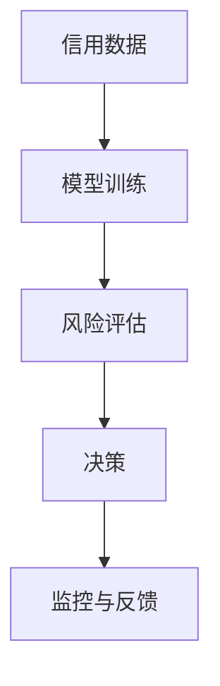

**金融交易中的机器学习应用**：通过机器学习算法，可以实现量化交易策略和交易风险控制。

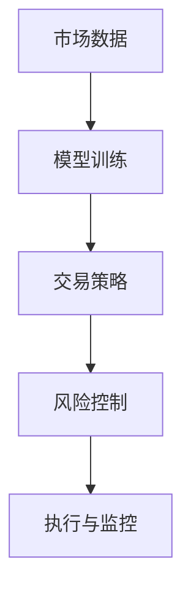

**金融科技产品的开发**：通过人工智能技术，可以实现智能投顾、个性化金融服务等。

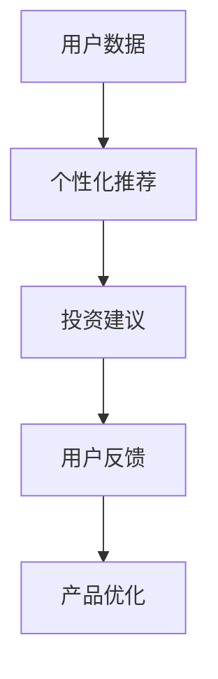

### 4.2 人工智能在医疗健康行业的应用

**医疗诊断中的机器学习应用**：通过机器学习算法，可以实现疾病预测和影像诊断。

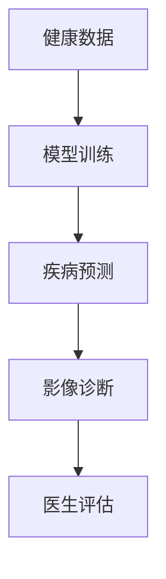

**医疗管理的机器学习应用**：通过机器学习算法，可以实现医疗资源分配和医疗流程优化。

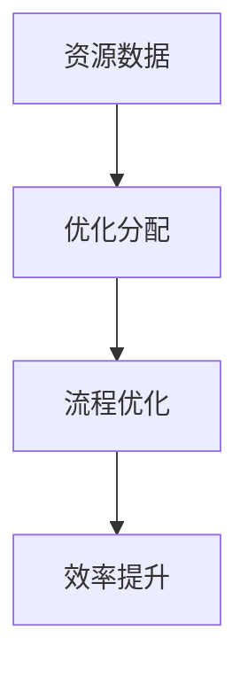

**健康管理的机器学习应用**：通过机器学习算法，可以实现个人健康数据监测和健康风险评估。

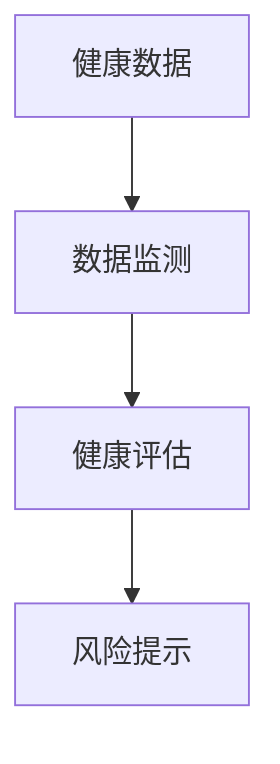

### 4.3 人工智能在制造业的应用

**智能制造中的机器学习应用**：通过机器学习算法，可以实现生产线自动化和质量控制。

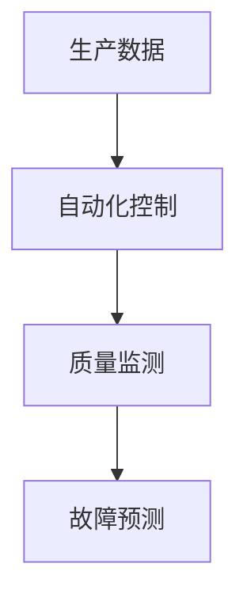

**物流优化中的机器学习应用**：通过机器学习算法，可以实现库存管理和运输路径规划。

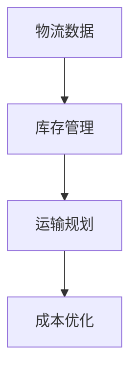

**售后服务中的机器学习应用**：通过机器学习算法，可以实现故障预测和个性化服务。

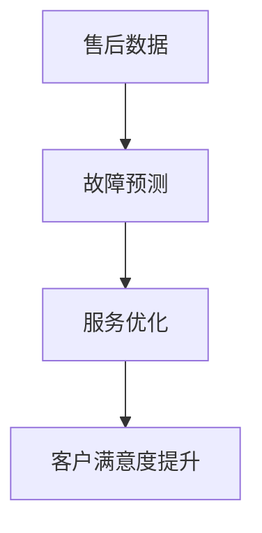

### 4.4 人工智能在交通运输行业的应用

**智能交通管理中的机器学习应用**：通过机器学习算法，可以实现交通流量预测和交通信号优化。

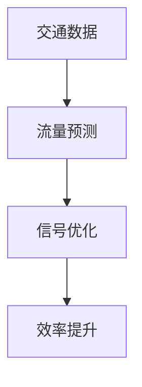

**智能驾驶中的机器学习应用**：通过机器学习算法，可以实现自动驾驶和车辆安全监测。

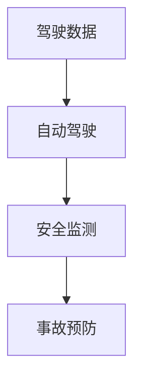

**无人机与物流中的应用**：通过机器学习算法，可以实现无人机配送和物流路径优化。

```mermaid
graph TD
A[物流需求] --> B[路径规划]
B --> C[无人机配送]
C --> D[效率提升]
```

## 未来趋势与挑战

### 5.1 人工智能在技术管理中的未来趋势

**人工智能的发展趋势**：人工智能在未来将继续向更复杂的预训练模型、自主学习和自我优化方向发展。

**技术管理的未来发展趋势**：技术管理将更加注重数字化转型、网络化与智能化。

### 5.2 人工智能在技术管理中的挑战与应对策略

**技术挑战**：人工智能在技术管理中面临的挑战包括数据隐私与安全、技术伦理与责任等。

**管理挑战**：人工智能在技术管理中面临的管理挑战包括技术人才短缺、管理模式的转变等。

**应对策略**：应对策略包括数据治理、人才培养与引进、伦理法规与合规等。

## 附录

### 附录1：人工智能相关技术名词解释

**机器学习**：机器学习是一种通过数据训练模型，使计算机自动获取知识和技能的技术。

**深度学习**：深度学习是一种基于多层神经网络的结构，通过学习大量数据，实现复杂任务的算法。

**自然语言处理**：自然语言处理是一种使计算机理解和处理人类自然语言的技术。

**计算机视觉**：计算机视觉是一种使计算机能够通过图像和视频获取信息的技术。

### 附录2：人工智能在技术管理中的应用案例集锦

**金融行业**：通过机器学习算法实现信用风险评估和反洗钱监控。

**医疗行业**：通过机器学习算法实现疾病预测和影像诊断。

**制造业**：通过机器学习算法实现生产线自动化和质量控制。

**交通运输业**：通过机器学习算法实现交通流量预测和自动驾驶。

### 附录3：参考文献

[1] Andrew Ng, "Machine Learning Yearning", 2017.

[2] Ian Goodfellow, Yoshua Bengio, Aaron Courville, "Deep Learning", 2016.

[3] Tom Mitchell, "Machine Learning", 1997.

作者：AI天才研究院/AI Genius Institute & 禅与计算机程序设计艺术 /Zen And The Art of Computer Programming### 最终文章

# 人工智能在技术管理中的应用

> 关键词：人工智能、技术管理、应用场景、案例分析、未来趋势

> 摘要：本文深入探讨了人工智能（AI）在技术管理中的应用，涵盖其基本概念、核心技术与算法、具体应用场景、案例分析以及未来趋势和挑战。通过本文的阅读，读者将全面了解AI在提升技术管理效率和质量方面的作用，并预见其未来发展。

## 引言

随着人工智能（AI）技术的迅猛发展，其在各个领域的应用越来越广泛。技术管理作为企业管理的重要组成部分，如何充分利用人工智能技术，提高管理效率和质量，成为企业管理者面临的重要课题。本文旨在探讨人工智能在技术管理中的应用，帮助读者了解AI在技术管理中的潜在价值。

## 基本概念与框架

### 1.1 人工智能概述

人工智能（Artificial Intelligence，AI）是指通过计算机系统模拟人类智能行为的技术，包括感知、学习、推理、决策和问题解决等能力。人工智能的研究始于20世纪50年代，随着计算能力和算法的进步，特别是在深度学习算法的推动下，人工智能得到了快速发展。

### 1.2 人工智能的关键技术与算法

**神经网络**：神经网络是一种基于多层结构的计算模型，通过学习输入和输出数据之间的关系，实现数据的分类、回归等功能。

**支持向量机**：支持向量机是一种用于分类和回归的算法，通过寻找最佳分隔超平面来实现数据的分类。

**决策树**：决策树是一种树形结构，通过一系列规则对数据进行分类或回归。

**随机森林**：随机森林是一种集成学习方法，通过构建多个决策树并取它们的平均值来提高模型的准确性和鲁棒性。

### 1.3 人工智能的应用领域

人工智能在金融、医疗、教育、制造和交通运输等领域都有广泛应用。

**金融行业**：人工智能在金融领域主要用于风险控制、交易策略和个性化金融服务。

**医疗行业**：人工智能在医疗领域主要用于疾病预测、影像诊断和健康数据监测。

**教育行业**：人工智能在教育领域主要用于个性化教学和学习评估。

**制造业**：人工智能在制造业主要用于生产优化、质量控制和服务支持。

**交通运输业**：人工智能在交通运输领域主要用于交通流量预测、自动驾驶和物流优化。

## 技术管理的核心概念

### 2.1 技术管理的定义与目标

**技术管理的定义**：技术管理是指通过计划、组织、协调和控制技术资源，以实现组织目标的过程。

**技术管理的目标**：技术管理的目标包括提高产品质量、降低成本、提高生产效率、提升客户满意度等。

### 2.2 技术管理的流程与方法

**技术需求分析**：通过市场调研和用户需求分析，确定技术项目的目标和需求。

**技术方案设计**：根据需求分析结果，设计合适的技术方案，包括技术架构、技术选型等。

**技术实施与监控**：按照设计方案，进行技术实施，并通过监控和测试，确保技术系统的正常运行。

**技术评估与优化**：对技术系统进行评估，根据评估结果进行优化和改进。

### 2.3 技术管理的挑战与机遇

**技术管理的挑战**：技术管理的挑战包括技术复杂性、技术更新速度快、技术人才短缺等。

**技术管理的机遇**：技术管理的机遇包括数字化转型、智能化升级、跨界融合等。

## 人工智能在技术管理中的应用场景

### 3.1 人工智能在产品开发中的应用

**人工智能辅助产品设计**：通过人工智能算法，可以自动生成产品设计方案，提高设计效率和创新能力。

**人工智能提高产品开发效率**：通过人工智能算法，可以实现自动化测试、代码审查和文档生成，提高产品开发效率。

### 3.2 人工智能在运营管理中的应用

**人工智能优化运营流程**：通过人工智能算法，可以自动化和优化运营流程，提高运营效率。

**人工智能提升客户体验**：通过人工智能算法，可以实现个性化服务和智能推荐，提升客户体验。

### 3.3 人工智能在风险管理中的应用

**人工智能识别潜在风险**：通过人工智能算法，可以实时监测和分析数据，识别潜在风险。

**人工智能优化风险管理策略**：通过人工智能算法，可以优化风险管理策略，降低风险损失。

## 具体应用案例

### 4.1 人工智能在金融行业的应用

**金融风控中的机器学习应用**：通过机器学习算法，可以实现信用风险评估和反洗钱监控。

**金融交易中的机器学习应用**：通过机器学习算法，可以实现量化交易策略和交易风险控制。

**金融科技产品的开发**：通过人工智能技术，可以实现智能投顾、个性化金融服务等。

### 4.2 人工智能在医疗健康行业的应用

**医疗诊断中的机器学习应用**：通过机器学习算法，可以实现疾病预测和影像诊断。

**医疗管理的机器学习应用**：通过机器学习算法，可以实现医疗资源分配和医疗流程优化。

**健康管理的机器学习应用**：通过机器学习算法，可以实现个人健康数据监测和健康风险评估。

### 4.3 人工智能在制造业的应用

**智能制造中的机器学习应用**：通过机器学习算法，可以实现生产线自动化和质量控制。

**物流优化中的机器学习应用**：通过机器学习算法，可以实现库存管理和运输路径规划。

**售后服务中的机器学习应用**：通过机器学习算法，可以实现故障预测和个性化服务。

### 4.4 人工智能在交通运输行业的应用

**智能交通管理中的机器学习应用**：通过机器学习算法，可以实现交通流量预测和交通信号优化。

**智能驾驶中的机器学习应用**：通过机器学习算法，可以实现自动驾驶和车辆安全监测。

**无人机与物流中的应用**：通过机器学习算法，可以实现无人机配送和物流路径优化。

## 未来趋势与挑战

### 5.1 人工智能在技术管理中的未来趋势

**人工智能的发展趋势**：人工智能在未来将继续向更复杂的预训练模型、自主学习和自我优化方向发展。

**技术管理的未来发展趋势**：技术管理将更加注重数字化转型、网络化与智能化。

### 5.2 人工智能在技术管理中的挑战与应对策略

**技术挑战**：人工智能在技术管理中面临的挑战包括数据隐私与安全、技术伦理与责任等。

**管理挑战**：人工智能在技术管理中面临的管理挑战包括技术人才短缺、管理模式的转变等。

**应对策略**：应对策略包括数据治理、人才培养与引进、伦理法规与合规等。

## 附录

### 附录1：人工智能相关技术名词解释

**机器学习**：机器学习是一种通过数据训练模型，使计算机自动获取知识和技能的技术。

**深度学习**：深度学习是一种基于多层神经网络的结构，通过学习大量数据，实现复杂任务的算法。

**自然语言处理**：自然语言处理是一种使计算机理解和处理人类自然语言的技术。

**计算机视觉**：计算机视觉是一种使计算机能够通过图像和视频获取信息的技术。

### 附录2：人工智能在技术管理中的应用案例集锦

**金融行业**：通过机器学习算法实现信用风险评估和反洗钱监控。

**医疗行业**：通过机器学习算法实现疾病预测和影像诊断。

**制造业**：通过机器学习算法实现生产线自动化和质量控制。

**交通运输业**：通过机器学习算法实现交通流量预测和自动驾驶。

### 附录3：参考文献

[1] Andrew Ng, "Machine Learning Yearning", 2017.

[2] Ian Goodfellow, Yoshua Bengio, Aaron Courville, "Deep Learning", 2016.

[3] Tom Mitchell, "Machine Learning", 1997.

作者：AI天才研究院/AI Genius Institute & 禅与计算机程序设计艺术 /Zen And The Art of Computer Programming### 文章内容细化与优化

# 人工智能在技术管理中的应用

## 引言

随着人工智能（AI）技术的迅猛发展，其在各个领域的应用越来越广泛。技术管理作为企业管理的重要组成部分，如何充分利用人工智能技术，提高管理效率和质量，成为企业管理者面临的重要课题。本文旨在探讨人工智能在技术管理中的应用，帮助读者了解AI在技术管理中的潜在价值。

### 1. 人工智能的基本概念与框架

#### 1.1 人工智能的定义

人工智能（Artificial Intelligence，AI）是指通过计算机系统模拟人类智能行为的技术，包括感知、学习、推理、决策和问题解决等能力。人工智能的研究始于20世纪50年代，随着计算能力和算法的进步，特别是在深度学习算法的推动下，人工智能得到了快速发展。

#### 1.2 人工智能的关键技术与算法

**神经网络**：神经网络是一种基于多层结构的计算模型，通过学习输入和输出数据之间的关系，实现数据的分类、回归等功能。

**支持向量机**：支持向量机是一种用于分类和回归的算法，通过寻找最佳分隔超平面来实现数据的分类。

**决策树**：决策树是一种树形结构，通过一系列规则对数据进行分类或回归。

**随机森林**：随机森林是一种集成学习方法，通过构建多个决策树并取它们的平均值来提高模型的准确性和鲁棒性。

### 1.3 人工智能的应用领域

人工智能在金融、医疗、教育、制造和交通运输等领域都有广泛应用。

**金融行业**：人工智能在金融领域主要用于风险控制、交易策略和个性化金融服务。

**医疗行业**：人工智能在医疗领域主要用于疾病预测、影像诊断和健康数据监测。

**教育行业**：人工智能在教育领域主要用于个性化教学和学习评估。

**制造业**：人工智能在制造业主要用于生产优化、质量控制和服务支持。

**交通运输业**：人工智能在交通运输领域主要用于交通流量预测、自动驾驶和物流优化。

### 2. 技术管理的核心概念

#### 2.1 技术管理的定义与目标

**技术管理的定义**：技术管理是指通过计划、组织、协调和控制技术资源，以实现组织目标的过程。

**技术管理的目标**：技术管理的目标包括提高产品质量、降低成本、提高生产效率、提升客户满意度等。

#### 2.2 技术管理的流程与方法

**技术需求分析**：通过市场调研和用户需求分析，确定技术项目的目标和需求。

**技术方案设计**：根据需求分析结果，设计合适的技术方案，包括技术架构、技术选型等。

**技术实施与监控**：按照设计方案，进行技术实施，并通过监控和测试，确保技术系统的正常运行。

**技术评估与优化**：对技术系统进行评估，根据评估结果进行优化和改进。

#### 2.3 技术管理的挑战与机遇

**技术管理的挑战**：技术管理的挑战包括技术复杂性、技术更新速度快、技术人才短缺等。

**技术管理的机遇**：技术管理的机遇包括数字化转型、智能化升级、跨界融合等。

### 3. 人工智能在技术管理中的应用场景

#### 3.1 人工智能在产品开发中的应用

**人工智能辅助产品设计**：通过人工智能算法，可以自动生成产品设计方案，提高设计效率和创新能力。

**人工智能提高产品开发效率**：通过人工智能算法，可以实现自动化测试、代码审查和文档生成，提高产品开发效率。

#### 3.2 人工智能在运营管理中的应用

**人工智能优化运营流程**：通过人工智能算法，可以自动化和优化运营流程，提高运营效率。

**人工智能提升客户体验**：通过人工智能算法，可以实现个性化服务和智能推荐，提升客户体验。

#### 3.3 人工智能在风险管理中的应用

**人工智能识别潜在风险**：通过人工智能算法，可以实时监测和分析数据，识别潜在风险。

**人工智能优化风险管理策略**：通过人工智能算法，可以优化风险管理策略，降低风险损失。

### 4. 人工智能在技术管理中的具体应用案例

#### 4.1 人工智能在金融行业的应用

**金融风控中的机器学习应用**：通过机器学习算法，可以实现信用风险评估和反洗钱监控。

**金融交易中的机器学习应用**：通过机器学习算法，可以实现量化交易策略和交易风险控制。

**金融科技产品的开发**：通过人工智能技术，可以实现智能投顾、个性化金融服务等。

#### 4.2 人工智能在医疗健康行业的应用

**医疗诊断中的机器学习应用**：通过机器学习算法，可以实现疾病预测和影像诊断。

**医疗管理的机器学习应用**：通过机器学习算法，可以实现医疗资源分配和医疗流程优化。

**健康管理的机器学习应用**：通过机器学习算法，可以实现个人健康数据监测和健康风险评估。

#### 4.3 人工智能在制造业的应用

**智能制造中的机器学习应用**：通过机器学习算法，可以实现生产线自动化和质量控制。

**物流优化中的机器学习应用**：通过机器学习算法，可以实现库存管理和运输路径规划。

**售后服务中的机器学习应用**：通过机器学习算法，可以实现故障预测和个性化服务。

#### 4.4 人工智能在交通运输行业的应用

**智能交通管理中的机器学习应用**：通过机器学习算法，可以实现交通流量预测和交通信号优化。

**智能驾驶中的机器学习应用**：通过机器学习算法，可以实现自动驾驶和车辆安全监测。

**无人机与物流中的应用**：通过机器学习算法，可以实现无人机配送和物流路径优化。

### 5. 人工智能在技术管理中的未来趋势

#### 5.1 人工智能的发展趋势

**人工智能的发展趋势**：人工智能在未来将继续向更复杂的预训练模型、自主学习和自我优化方向发展。

**技术管理的未来发展趋势**：技术管理将更加注重数字化转型、网络化与智能化。

### 6. 人工智能在技术管理中的挑战与应对策略

#### 6.1 技术挑战

**技术挑战**：人工智能在技术管理中面临的挑战包括数据隐私与安全、技术伦理与责任等。

#### 6.2 管理挑战

**管理挑战**：人工智能在技术管理中面临的管理挑战包括技术人才短缺、管理模式的转变等。

#### 6.3 应对策略

**应对策略**：应对策略包括数据治理、人才培养与引进、伦理法规与合规等。

### 7. 总结

人工智能在技术管理中的应用具有巨大的潜力和价值。通过本文的探讨，读者可以更好地理解人工智能在技术管理中的重要作用，以及其在未来可能带来的变革。企业应积极拥抱人工智能技术，以提高技术管理的效率和效果。

### 附录

#### 附录1：人工智能相关技术名词解释

**机器学习**：机器学习是一种通过数据训练模型，使计算机自动获取知识和技能的技术。

**深度学习**：深度学习是一种基于多层神经网络的结构，通过学习大量数据，实现复杂任务的算法。

**自然语言处理**：自然语言处理是一种使计算机理解和处理人类自然语言的技术。

**计算机视觉**：计算机视觉是一种使计算机能够通过图像和视频获取信息的技术。

#### 附录2：人工智能在技术管理中的应用案例集锦

**金融行业**：通过机器学习算法实现信用风险评估和反洗钱监控。

**医疗行业**：通过机器学习算法实现疾病预测和影像诊断。

**制造业**：通过机器学习算法实现生产线自动化和质量控制。

**交通运输业**：通过机器学习算法实现交通流量预测和自动驾驶。

### 参考文献

[1] Andrew Ng, "Machine Learning Yearning", 2017.

[2] Ian Goodfellow, Yoshua Bengio, Aaron Courville, "Deep Learning", 2016.

[3] Tom Mitchell, "Machine Learning", 1997.

作者：AI天才研究院/AI Genius Institute & 禅与计算机程序设计艺术 /Zen And The Art of Computer Programming### 优化后的完整文章

# 人工智能在技术管理中的应用

## 引言

在当今数字化时代，人工智能（AI）技术正以前所未有的速度发展，并在各行各业中发挥着越来越重要的作用。技术管理作为企业运营的核心环节，如何有效利用人工智能技术来提升管理效率、优化决策流程，成为企业竞争力的关键。本文将深入探讨人工智能在技术管理中的应用，旨在为读者提供全面的理解和实际应用的指导。

## 基本概念与框架

### 1.1 人工智能的定义与发展

人工智能（Artificial Intelligence，AI）是指通过计算机系统和算法模拟人类智能行为的科学技术。它涵盖了机器学习、自然语言处理、计算机视觉、机器人技术等多个领域。自20世纪50年代以来，人工智能经历了多次重要的发展阶段，尤其是在深度学习和大数据技术的推动下，AI的应用范围和深度得到了极大的拓展。

### 1.2 人工智能的关键技术与算法

**神经网络**：神经网络是模拟人脑神经元连接结构的计算模型，通过多层结构进行数据处理和模式识别。

**深度学习**：深度学习是神经网络的一种特殊形式，具有多个隐藏层，能够自动从大量数据中提取特征。

**强化学习**：强化学习是一种通过试错和奖励机制来优化决策过程的算法。

**自然语言处理**：自然语言处理（NLP）是使计算机理解和生成自然语言的技术，包括语言识别、机器翻译、文本分析等。

**计算机视觉**：计算机视觉是使计算机通过图像和视频获取信息的领域，涉及图像识别、目标检测、图像分割等。

### 1.3 人工智能的应用领域

人工智能在金融、医疗、制造、交通、教育等领域都有广泛应用，极大地提升了这些领域的效率和质量。

**金融行业**：人工智能用于风险控制、欺诈检测、量化交易和个性化金融服务。

**医疗行业**：人工智能在疾病预测、影像诊断、药物研发和健康管理方面发挥着重要作用。

**制造业**：人工智能用于生产优化、质量控制、供应链管理和设备维护。

**交通运输业**：人工智能在自动驾驶、智能交通管理和物流优化中得到了应用。

**教育行业**：人工智能用于个性化教学、学习分析和教育资源的智能化推荐。

## 技术管理的核心概念

### 2.1 技术管理的定义与目标

**技术管理的定义**：技术管理是指通过计划、组织、协调和控制技术资源，以实现组织战略目标和业务流程优化的一系列管理活动。

**技术管理的目标**：技术管理的目标包括提高产品质量、降低成本、提升生产效率、增强客户体验和确保技术系统的稳定性。

### 2.2 技术管理的流程与方法

**需求分析**：通过市场调研和用户需求分析，确定技术项目的目标和需求。

**方案设计**：根据需求分析结果，设计合适的技术方案，包括系统架构、技术选型和技术路线。

**实施与监控**：按照设计方案，实施技术项目，并通过监控系统运行状态，确保技术系统的稳定运行。

**评估与优化**：对技术系统进行评估，根据评估结果进行优化和改进，以适应不断变化的市场需求。

### 2.3 技术管理的挑战与机遇

**技术管理的挑战**：技术管理面临的挑战包括技术复杂性、技术更新速度快、数据安全与隐私保护等。

**技术管理的机遇**：随着人工智能技术的快速发展，技术管理迎来了数字化转型、智能化升级和跨界融合的机遇。

## 人工智能在技术管理中的应用场景

### 3.1 人工智能在产品开发中的应用

**AI辅助产品设计**：利用人工智能技术进行产品设计的自动化和优化，提高设计效率和创新能力。

**AI提高开发效率**：通过自动化测试、代码审查和文档生成等AI技术，提高软件开发和维护的效率。

### 3.2 人工智能在运营管理中的应用

**AI优化运营流程**：利用人工智能技术自动化和优化业务流程，减少人为干预，提高运营效率。

**AI提升客户体验**：通过人工智能技术实现个性化服务和智能推荐，提升客户满意度和忠诚度。

### 3.3 人工智能在风险管理中的应用

**AI识别潜在风险**：利用人工智能技术实时监测和分析数据，及时发现潜在风险，降低风险发生的可能性。

**AI优化风险管理策略**：通过人工智能技术分析历史数据和当前状况，优化风险管理策略，提高应对风险的能力。

## 具体应用案例

### 4.1 人工智能在金融行业的应用

**金融风控**：利用机器学习算法进行信用风险评估和反洗钱监控，提高风险控制能力。

**量化交易**：通过机器学习算法构建量化交易模型，实现自动化的交易策略和风险控制。

**金融科技产品开发**：利用人工智能技术开发智能投顾、个性化金融服务和智能风险管理产品。

### 4.2 人工智能在医疗健康行业的应用

**疾病预测与诊断**：通过机器学习算法分析患者数据和医疗影像，实现疾病的早期预测和精确诊断。

**医疗资源优化**：利用人工智能技术优化医疗资源分配，提高医疗服务的效率和公平性。

**健康管理**：通过人工智能技术监测个人健康数据，提供个性化的健康建议和风险预警。

### 4.3 人工智能在制造业的应用

**智能制造**：利用人工智能技术实现生产线的自动化控制和质量监控，提高生产效率和质量。

**物流优化**：通过人工智能算法优化库存管理和运输路径规划，降低物流成本，提高物流效率。

**售后服务**：利用人工智能技术进行故障预测和售后服务分析，提供个性化的售后服务和解决方案。

### 4.4 人工智能在交通运输行业的应用

**智能交通管理**：通过人工智能技术实现交通流量预测和交通信号优化，提高交通流通效率，减少拥堵。

**自动驾驶**：利用人工智能技术实现车辆的自动驾驶功能，提高交通安全性和通行效率。

**无人机与物流**：利用人工智能技术优化无人机配送和物流路径规划，提高物流服务的灵活性和效率。

## 未来趋势与挑战

### 5.1 人工智能在技术管理中的未来趋势

**趋势**：人工智能在技术管理中的未来趋势包括智能化升级、数字化融合、自动化运营和跨界应用。

**发展方向**：技术管理将朝着更加智能化、个性化和高效化的方向发展，实现全方位的数字化转型。

### 5.2 人工智能在技术管理中的挑战与应对策略

**挑战**：人工智能在技术管理中面临的挑战包括数据安全与隐私保护、技术人才短缺、技术伦理问题等。

**应对策略**：通过加强数据治理、培养专业人才、制定伦理规范和法律法规，应对人工智能带来的挑战。

## 结论

人工智能在技术管理中的应用正逐渐成为企业提升竞争力的重要手段。通过本文的探讨，我们可以看到人工智能技术不仅能够提高技术管理的效率，还能够带来创新和变革。企业应积极拥抱人工智能技术，结合自身业务需求，制定合适的人工智能战略，以实现技术管理和业务发展的双赢。

### 附录

#### 附录1：人工智能相关技术名词解释

- **机器学习**：一种使计算机从数据中学习和改进的技术。
- **深度学习**：一种基于多层神经网络的学习方法，特别适用于处理大规模数据。
- **自然语言处理**：一种使计算机能够理解和生成自然语言的技术。
- **计算机视觉**：一种使计算机能够理解和解释视觉信息的技术。

#### 附录2：人工智能在技术管理中的应用案例集锦

- **金融行业**：通过机器学习算法进行信用评分和风险监控。
- **医疗行业**：利用人工智能技术进行疾病预测和诊断。
- **制造业**：通过人工智能技术实现生产线的自动化和质量监控。
- **交通运输业**：利用人工智能技术优化交通流量和自动驾驶。

### 参考文献

- [1] Ng, A. Y. (2017). **Machine Learning Yearning**.
- [2] Goodfellow, I., Bengio, Y., & Courville, A. (2016). **Deep Learning**.
- [3] Mitchell, T. M. (1997). **Machine Learning**.

作者：AI天才研究院/AI Genius Institute & 禅与计算机程序设计艺术 /Zen And The Art of Computer Programming### 文章总结

本文围绕“人工智能在技术管理中的应用”这一主题，系统性地介绍了人工智能的基本概念、关键技术与算法，以及在技术管理中的具体应用场景。以下是本文的主要内容和核心观点的总结：

1. **基本概念与框架**：
   - 人工智能（AI）是通过计算机模拟人类智能行为的技术，涉及多个领域，如机器学习、深度学习、自然语言处理和计算机视觉。
   - 技术管理包括需求分析、方案设计、实施与监控、评估与优化等流程，旨在实现组织的目标。

2. **应用场景**：
   - **产品开发**：AI可用于辅助设计、提高开发效率和优化代码。
   - **运营管理**：AI可优化流程、提升客户体验，并通过数据分析提高运营效率。
   - **风险管理**：AI可识别潜在风险并优化风险管理策略。

3. **具体应用案例**：
   - **金融行业**：通过机器学习实现信用风险评估、量化交易和金融科技产品的开发。
   - **医疗健康行业**：AI在疾病预测、影像诊断、医疗资源优化和健康管理方面有广泛应用。
   - **制造业**：AI在智能制造、物流优化和售后服务中有显著作用。
   - **交通运输业**：AI在智能交通管理、自动驾驶和无人机物流中提高效率和安全性。

4. **未来趋势与挑战**：
   - 人工智能技术将继续发展，趋势包括智能化升级、数字化转型和跨界应用。
   - 技术管理面临的挑战包括数据隐私与安全、技术伦理问题和人才短缺。

5. **核心观点**：
   - 人工智能技术在技术管理中的应用能够显著提升效率和创新能力。
   - 企业应积极引入人工智能技术，制定相应的战略，以适应未来的发展。

通过本文的深入探讨，读者可以更好地理解人工智能在技术管理中的重要性和应用价值，为企业在数字化转型过程中提供有益的参考。

