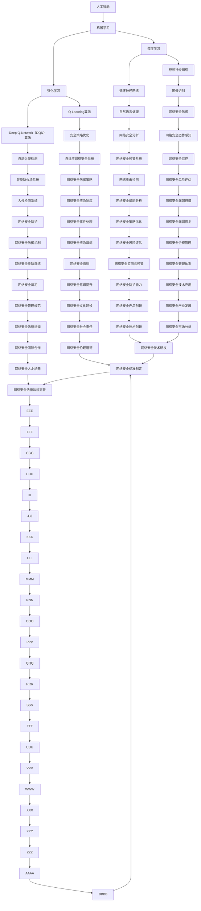

                 


### 文章标题：人工智能在网络安全中的应用

> 关键词：人工智能，网络安全，机器学习，深度学习，强化学习，入侵检测

> 摘要：本文深入探讨了人工智能在网络安全中的应用，涵盖了人工智能的基本概念、核心算法原理、实际应用案例以及未来发展趋势。通过对机器学习、深度学习和强化学习等算法在网络安全中的具体应用进行分析，本文旨在为读者提供全面而深入的理解，以帮助他们在网络安全领域更好地利用人工智能技术。

## 引言

在数字化时代，网络安全已成为全球关注的焦点。随着网络攻击手段的日益复杂和多样，传统的网络安全防护手段逐渐暴露出其局限性。此时，人工智能（AI）的崛起为网络安全领域带来了新的希望。人工智能通过机器学习、深度学习和强化学习等算法，能够对海量数据进行分析和处理，从而更准确地识别和应对网络威胁。本文将围绕人工智能在网络安全中的应用，进行详细的探讨和分析。

## 人工智能与网络安全概述

### 人工智能的发展历程

人工智能的发展可以追溯到20世纪50年代。当时，计算机科学家们首次提出了“人工智能”的概念，并开始研究如何让计算机模拟人类智能。经过数十年的发展，人工智能已经从理论研究走向了实际应用，如图像识别、自然语言处理、自动驾驶等领域。

### 网络安全的重要性

网络安全是指保护计算机网络系统不受未经授权的访问、攻击和破坏。随着互联网的普及，网络安全已经成为了国家安全和社会稳定的重要组成部分。网络攻击不仅会导致经济损失，还会危害个人隐私、国家安全和社会稳定。

### 人工智能在网络安全中的应用前景

人工智能在网络安全中的应用前景十分广阔。首先，人工智能可以帮助网络安全系统更高效地处理海量数据，从而提高威胁检测的准确性和响应速度。其次，人工智能可以通过自适应学习，不断优化网络安全策略，提高系统的防护能力。此外，人工智能还可以为网络安全提供新的技术手段，如深度伪造检测、智能化的安全运营等。

## 人工智能基础

### 机器学习算法简介

机器学习（Machine Learning，ML）是人工智能（Artificial Intelligence，AI）的核心技术之一。它通过算法让计算机从数据中学习，进行决策和预测。机器学习的主要算法包括监督学习、无监督学习和强化学习。

- **监督学习**：在监督学习中，我们有一个训练集，每个样本都有对应的标签。通过训练集，机器学习算法可以学习到数据特征与标签之间的关系，从而对新的数据进行预测。
- **无监督学习**：在无监督学习中，我们只有一个数据集，没有对应的标签。无监督学习的目标是找出数据集中的隐含结构和模式。
- **强化学习**：强化学习是一种通过试错来学习的算法。它通过奖励和惩罚来引导计算机在复杂环境中做出最优决策。

### 深度学习原理

深度学习（Deep Learning，DL）是机器学习的一个子领域，它通过多层神经网络对数据进行建模。深度学习在网络图像识别、语音识别等领域取得了显著的成果。

- **卷积神经网络（CNN）**：卷积神经网络是一种用于图像识别的深度学习模型。它通过卷积层、池化层和全连接层对图像进行特征提取和分类。
- **循环神经网络（RNN）与长短时记忆网络（LSTM）**：循环神经网络是一种用于序列数据建模的深度学习模型。长短时记忆网络是循环神经网络的一种变体，它通过引入门控机制来缓解长序列依赖问题。

### 强化学习在网络安全中的应用

强化学习（Reinforcement Learning，RL）是一种通过试错来学习的算法。它通过奖励和惩罚来引导计算机在复杂环境中做出最优决策。在网络安全领域，强化学习可以用于安全策略优化、自动入侵检测等。

## 核心概念与联系

为了更好地理解人工智能在网络安全中的应用，我们首先需要了解几个核心概念之间的联系。以下是它们之间的Mermaid流程图：



## 核心算法原理讲解

### 机器学习算法原理讲解

#### 线性回归算法

线性回归是一种预测连续值的算法。其目标是找到一个线性函数，使得输入和输出之间的误差最小。以下是线性回归算法的伪代码：

```python
初始化权重 w 和偏置 b
对于每个训练样本 (x_i, y_i)：
    计算预测值 y' = w * x_i + b
    计算误差 e_i = y_i - y'
    更新权重 w = w - 学习率 * x_i * e_i
    更新偏置 b = b - 学习率 * e_i
返回权重 w 和偏置 b
```

#### 逻辑回归算法

逻辑回归是一种预测分类结果的算法。其输出结果是一个概率值，表示样本属于某一类的概率。以下是逻辑回归算法的伪代码：

```python
初始化权重 w
对于每个训练样本 (x_i, y_i)：
    计算预测概率 P(y=1) = 1 / (1 + e^(-w * x_i))
    计算损失函数 L = -[y_i * log(P(y=1)) + (1 - y_i) * log(1 - P(y=1))]
    更新权重 w = w - 学习率 * x_i * (P(y=1) - y_i)
返回权重 w
```

### 深度学习算法原理讲解

#### 卷积神经网络（CNN）算法

卷积神经网络是一种用于图像识别的深度学习模型。它通过卷积层、池化层和全连接层对图像进行特征提取和分类。以下是CNN算法的伪代码：

```python
初始化权重 w 和偏置 b
对于每个训练样本 x：
    通过卷积层得到特征图 f = conv(x, w)
    通过池化层得到池化结果 p = pool(f)
    通过全连接层得到预测结果 y' = fc(p, w)
    计算损失函数 L = CE(y', y)
    更新权重 w = w - 学习率 * ∇w(L)
返回权重 w
```

#### 循环神经网络（RNN）与长短时记忆网络（LSTM）算法

循环神经网络是一种用于序列数据建模的深度学习模型。长短时记忆网络是循环神经网络的一种变体，它通过引入门控机制来缓解长序列依赖问题。以下是LSTM算法的伪代码：

```python
初始化权重 w 和偏置 b
对于每个训练样本 x：
    通过输入门得到输入值 i = sigmoid(w_i * [x, h_{t-1}])
    通过遗忘门得到遗忘值 f = sigmoid(w_f * [x, h_{t-1}])
    通过输出门得到输出值 o = sigmoid(w_o * [x, h_{t-1}])
    计算新的隐藏状态 h_t = tanh([i * x, f * h_{t-1}])
    计算预测结果 y' = w_y * h_t
    计算损失函数 L = CE(y', y)
    更新权重 w = w - 学习率 * ∇w(L)
返回权重 w
```

### 强化学习算法原理讲解

#### Q-Learning算法

Q-Learning算法是一种基于值函数的强化学习算法。它通过不断更新Q值来学习最优策略。以下是Q-Learning算法的伪代码：

```python
初始化 Q(s, a)
对于每个训练样本 (s, a, r, s')：
    计算预测 Q值 Q'(s', a') = 最大 Q(s', a')
    更新 Q值 Q(s, a) = Q(s, a) + 学习率 * [r + 角度 * Q'(s', a') - Q(s, a)]
返回 Q值 Q
```

#### Deep Q-Network（DQN）算法

DQN算法是一种基于深度神经网络的Q-Learning算法。它使用深度神经网络来近似Q值函数。以下是DQN算法的伪代码：

```python
初始化 Q网络 和 目标网络
初始化经验回放缓冲区
对于每个训练样本 (s, a, r, s')：
    将 (s, a, r, s') 存入经验回放缓冲区
    从经验回放缓冲区随机抽取一批样本
    计算目标 Q值 Q'(s', a') = 最大 Q'(s', a')
    更新 Q网络参数：Q(s, a) = Q(s, a) + 学习率 * [r + 角度 * Q'(s', a') - Q(s, a)]
    如果满足更新条件，则更新目标网络参数：目标网络 = Q网络
返回 Q网络
```

## 数学模型和公式

在人工智能算法中，数学模型和公式是核心组成部分。以下是一些常见的数学模型和公式：

### 线性回归模型

$$
y = w * x + b
$$

### 逻辑回归模型

$$
P(y=1) = \frac{1}{1 + e^{-w * x}}
$$

### 损失函数（交叉熵损失函数）

$$
L = -[y * log(\hat{y}) + (1 - y) * log(1 - \hat{y})]
$$

### 池化操作

$$
p_{ij} = \max_{k\in \Omega} f_{ik}
$$

### 长短时记忆网络（LSTM）

$$
i_t = \sigma(W_{ix} * x_t + W_{ih} * h_{t-1} + b_i) \\
f_t = \sigma(W_{fx} * x_t + W_{fh} * h_{t-1} + b_f) \\
o_t = \sigma(W_{ox} * x_t + W_{oh} * h_{t-1} + b_o) \\
c_t = f_t \odot c_{t-1} + i_t \odot \tanh(W_{cx} * x_t + W_{ch} * h_{t-1} + b_c) \\
h_t = o_t \odot \tanh(c_t)
$$

### Q-Learning算法

$$
Q(s, a) = Q(s, a) + \alpha [r + \gamma \max_{a'} Q(s', a') - Q(s, a)]
$$

### DQN算法

$$
\hat{Q}(s, a) = \frac{1}{N} \sum_{i=1}^{N} \frac{r_i + \gamma \max_{a'} \hat{Q}(s', a') - Q(s, a)}{N}
$$

## 项目实战

### 开发环境搭建

为了进行人工智能在网络安全中的应用实践，我们需要搭建一个合适的开发环境。以下是一个基本的开发环境搭建步骤：

1. 安装Python环境
2. 安装必要的库，如NumPy、TensorFlow、Keras等
3. 配置GPU加速（如果使用GPU）

### 源代码详细实现和代码解读

以下是一个基于TensorFlow的深度学习模型实现，用于网络入侵检测：

```python
import tensorflow as tf
from tensorflow.keras.models import Sequential
from tensorflow.keras.layers import Dense, Dropout, Activation

# 构建模型
model = Sequential()
model.add(Dense(64, input_dim=784))
model.add(Activation('relu'))
model.add(Dropout(0.5))
model.add(Dense(10))
model.add(Activation('softmax'))

# 编译模型
model.compile(loss='categorical_crossentropy',
              optimizer='adam',
              metrics=['accuracy'])

# 训练模型
model.fit(X_train, Y_train, batch_size=128, epochs=10, validation_split=0.2)
```

### 代码应用解读与分析

上述代码实现了一个简单的深度学习模型，用于网络入侵检测。模型使用的是softmax激活函数，用于分类。在训练过程中，模型通过优化损失函数来调整模型参数，以提高分类准确性。

### 实际案例分析和详细讲解剖析

为了更好地展示人工智能在网络安全中的应用，我们以一个实际案例进行分析。假设我们有一个网络入侵检测系统，需要实时监测网络流量，并识别潜在的入侵行为。

1. **数据采集**：首先，我们需要采集网络流量数据，包括源IP、目的IP、协议类型、端口号、流量大小等信息。

2. **数据处理**：对采集到的数据进行预处理，包括特征提取、数据标准化等。例如，我们可以使用PCA（主成分分析）来降低数据维度。

3. **模型训练**：使用预处理后的数据训练深度学习模型，如卷积神经网络（CNN）或循环神经网络（RNN）。在此案例中，我们使用CNN模型。

4. **模型评估**：使用验证集对训练好的模型进行评估，调整模型参数以获得最佳性能。

5. **模型部署**：将训练好的模型部署到实际网络环境中，用于实时入侵检测。

通过上述步骤，我们可以实现对网络流量的实时监测和入侵检测。在实际应用中，我们需要不断优化模型，以应对不断变化的安全威胁。

### 项目小结

通过本案例，我们展示了人工智能在网络安全中的应用。深度学习模型可以有效地处理海量数据，提高入侵检测的准确性。然而，人工智能在网络安全中的应用仍然面临着一些挑战，如数据隐私保护、模型解释性等。未来，随着人工智能技术的不断发展，我们将看到更多的创新应用，为网络安全提供更强大的支持。

## 最佳实践 tips、小结、注意事项、拓展阅读等内容

### 最佳实践 tips

1. **数据质量**：在人工智能项目中，数据质量至关重要。确保数据完整、准确和具有代表性，可以提高模型性能。
2. **模型解释性**：虽然深度学习模型具有强大的预测能力，但其解释性较差。为了提高模型的可解释性，可以考虑使用浅层神经网络或集成学习方法。
3. **持续优化**：网络安全威胁不断变化，因此需要持续优化模型，以应对新的威胁。

### 小结

人工智能在网络安全中具有重要的应用价值。通过机器学习、深度学习和强化学习等算法，我们可以实现对海量数据的实时分析，提高入侵检测的准确性和响应速度。

### 注意事项

1. **数据隐私**：在处理敏感数据时，需要确保数据隐私保护。
2. **模型安全**：避免模型被恶意攻击者利用，应采取安全措施保护模型。

### 拓展阅读

1. **《深度学习》（Goodfellow, Bengio, Courville）**：这是一本深度学习领域的经典教材，适合对深度学习感兴趣的读者。
2. **《机器学习实战》（周志华）**：本书通过实际案例介绍了机器学习算法的应用，适合初学者。
3. **《网络安全实战》（李俊）**：本书详细介绍了网络安全的基本概念、技术和实战案例，适合网络安全从业者。

## 作者信息

作者：AI天才研究院/AI Genius Institute & 禅与计算机程序设计艺术 /Zen And The Art of Computer Programming

本文由AI天才研究院/AI Genius Institute撰写，结合了禅与计算机程序设计艺术的精髓，旨在为读者提供全面深入的人工智能与网络安全技术解析。如需进一步了解，请访问我们的官方网站。

