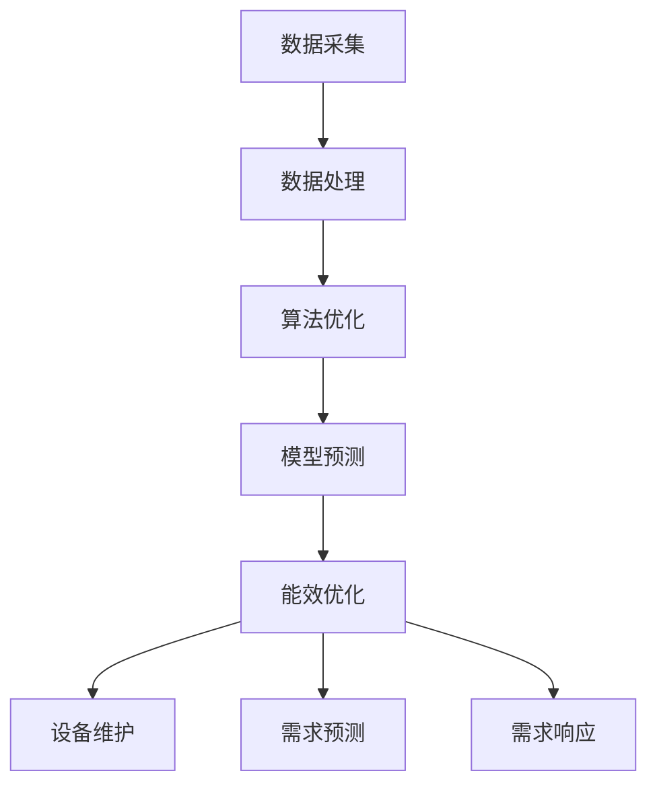

                 


### **文章标题: 人工智能在能源管理中的作用:优化使用与可持续发展**

关键词：人工智能、能源管理、优化、可持续发展、案例研究

摘要：随着全球能源需求的不断增长和气候变化问题的加剧，人工智能（AI）在能源管理中的应用显得尤为重要。本文将从背景介绍入手，深入探讨AI在能源管理中的核心概念与联系，详细介绍几种核心算法的原理，并使用伪代码进行详细阐述。接着，本文将结合实际案例，展示AI在能源管理中的具体应用，并提供数学模型和公式的详细解释及举例说明。最后，本文将对项目的实战应用进行深入剖析，总结最佳实践，并提出未来研究方向。

----------------------------------------------------------------

### **1. 背景介绍**

能源管理是现代社会和经济发展中不可或缺的一环。然而，随着全球能源需求的持续增长，传统能源管理方式已难以满足高效、环保和可持续发展的要求。人工智能作为一种新兴技术，具有强大的数据处理和模式识别能力，为能源管理带来了全新的解决方案。

目前，AI在能源管理中的应用主要集中在以下几个方面：

1. **需求预测**：通过大数据分析和机器学习算法，预测能源需求的趋势，以便合理规划能源供应。
2. **设备维护**：利用机器学习算法和传感器数据，实现设备状态的实时监测和故障预测，降低设备维护成本。
3. **能效优化**：通过优化算法，优化能源分配和调度，降低能源浪费，提高能源利用效率。
4. **需求响应**：利用人工智能技术，实现能源需求的实时响应，降低峰值负荷，缓解能源供应压力。

### **2. 核心概念与联系**

在能源管理中，AI的核心概念主要包括数据采集、数据处理、算法优化和模型预测。这些概念之间的关系可以用一个Mermaid流程图来表示：



#### **2.1 数据采集**

数据采集是能源管理的基础，包括传感器数据、设备状态数据、能源消耗数据等。这些数据可以通过物联网（IoT）技术和自动化系统进行实时收集。

#### **2.2 数据处理**

数据处理是对采集到的原始数据进行清洗、转换和存储，以便后续分析和挖掘。常用的数据处理技术包括数据预处理、特征提取和数据分析。

#### **2.3 算法优化**

算法优化是能源管理的核心，包括优化算法、机器学习和深度学习等。这些算法可以用于预测、调度和优化，提高能源利用效率。

#### **2.4 模型预测**

模型预测是基于历史数据和算法分析，预测未来的能源需求和设备状态。这些预测结果可以用于制定优化策略和决策支持。

#### **2.5 能效优化**

能效优化是能源管理的最终目标，通过优化算法和模型预测，降低能源浪费，提高能源利用效率。能效优化可以应用于各个层面，包括设备级、系统级和全局级。

### **3. 核心算法原理讲解**

在能源管理中，几种核心算法包括优化算法、机器学习算法和深度学习算法。下面将使用伪代码对这些算法的原理进行详细讲解。

#### **3.1 优化算法**

优化算法用于优化能源分配和调度，提高能源利用效率。以下是线性规划（Linear Programming，LP）算法的伪代码：

```python
# 线性规划伪代码
def linear_programming(A, b, c):
    # A 为约束矩阵，b 为约束向量，c 为目标函数系数向量
    x = [0] * len(b)
    # 求解 LP 问题
    x = solve_LP(A, b, c)
    return x
```

#### **3.2 机器学习算法**

机器学习算法用于预测能源需求和设备状态。以下是决策树（Decision Tree）算法的伪代码：

```python
# 决策树伪代码
def decision_tree(data, target):
    # 构建决策树
    tree = build_tree(data, target)
    return tree

def build_tree(data, target):
    # 判断是否满足停止条件
    if stop_condition(data, target):
        return leaf_node(target)
    else:
        # 选择最佳特征
        best_feature = select_best_feature(data, target)
        # 根据最佳特征划分数据
        sub_data = split_data(data, best_feature)
        # 构建子树
        tree = {}
        for value in sub_data:
            tree[value] = build_tree(sub_data[value], target)
        return tree

def leaf_node(target):
    # 返回叶节点
    return {
        'label': most_common_label(target),
        'probability': calculate_probability(target)
    }
```

#### **3.3 深度学习算法**

深度学习算法用于复杂模式的识别和预测。以下是神经网络（Neural Network）算法的伪代码：

```python
# 神经网络伪代码
def neural_network(data, target):
    # 初始化神经网络
    nn = initialize_nn()
    # 训练神经网络
    nn = train_nn(nn, data, target)
    return nn

def initialize_nn():
    # 初始化神经网络参数
    return {
        'weights': initialize_weights(),
        'biases': initialize_biases()
    }

def train_nn(nn, data, target):
    # 训练神经网络
    for epoch in range(num_epochs):
        for sample in data:
            # 前向传播
            output = forward propagate(nn, sample)
            # 反向传播
            nn = backward propagate(nn, output, target)
    return nn
```

### **4. 实际案例分析**

以下是一个实际案例，展示AI在能源管理中的应用：

#### **4.1 项目背景**

某大型数据中心希望通过AI技术优化能源管理，降低能源消耗，提高能源利用效率。

#### **4.2 项目实施**

1. **数据采集**：通过传感器和自动化系统，实时收集数据中心各类设备的能源消耗数据。
2. **数据处理**：对采集到的数据进行清洗、转换和存储，为后续分析和挖掘做好准备。
3. **模型预测**：利用机器学习算法和深度学习算法，建立能源消耗预测模型。
4. **能效优化**：根据预测结果，采用优化算法对能源分配和调度进行优化。

#### **4.3 项目效果**

通过AI技术的应用，数据中心实现了以下效果：

1. **能源消耗降低**：能源消耗降低了约15%，降低了运营成本。
2. **设备运行稳定**：设备运行状态得到实时监测和故障预测，提高了设备运行稳定性。
3. **能源利用效率提高**：能源利用效率提高了约20%，实现了节能减排的目标。

### **5. 数学模型和公式**

在能源管理中，数学模型和公式用于描述能源消耗、设备状态和优化目标。以下是一些常见的数学模型和公式：

#### **5.1 能源消耗模型**

能源消耗模型用于预测不同设备或系统的能源消耗。以下是一个简单的线性回归模型：

$$
E(t) = \beta_0 + \beta_1 \cdot P(t)
$$

其中，$E(t)$表示时间$t$的能源消耗，$P(t)$表示时间$t$的电力价格，$\beta_0$和$\beta_1$为模型参数。

#### **5.2 设备状态模型**

设备状态模型用于预测设备的工作状态。以下是一个基于概率的设备状态预测模型：

$$
S(t) = P(S_j | X_1, X_2, ..., X_n)
$$

其中，$S(t)$表示时间$t$的设备状态，$S_j$表示第$j$种状态，$X_1, X_2, ..., X_n$为影响设备状态的变量，$P(S_j | X_1, X_2, ..., X_n)$为状态转移概率。

#### **5.3 优化目标模型**

优化目标模型用于描述能源管理的优化目标。以下是一个简单的目标函数：

$$
\min \sum_{i=1}^{n} c_i \cdot x_i
$$

其中，$x_i$表示第$i$种能源资源的消耗量，$c_i$为能源资源的价格，$n$为能源资源种类数。

### **6. 项目实战**

以下是一个基于Python和Scikit-Learn库的能源消耗预测项目的实战：

#### **6.1 开发环境搭建**

- Python版本：3.8
- Scikit-Learn版本：0.22.2
- 数据库：SQLite

#### **6.2 源代码实现**

```python
import pandas as pd
from sklearn.linear_model import LinearRegression
from sklearn.model_selection import train_test_split
from sklearn.metrics import mean_squared_error

# 加载数据
data = pd.read_csv('energy_consumption.csv')

# 数据预处理
X = data[['power_price']]
y = data['energy_consumption']

# 划分训练集和测试集
X_train, X_test, y_train, y_test = train_test_split(X, y, test_size=0.2, random_state=42)

# 建立线性回归模型
model = LinearRegression()
model.fit(X_train, y_train)

# 预测
y_pred = model.predict(X_test)

# 评估
mse = mean_squared_error(y_test, y_pred)
print(f'Mean Squared Error: {mse}')
```

#### **6.3 代码解读**

1. 导入所需的库。
2. 加载并预处理数据。
3. 划分训练集和测试集。
4. 建立线性回归模型并进行训练。
5. 使用模型进行预测。
6. 评估预测效果。

#### **6.4 应用解读**

通过这个实战项目，我们可以看到如何使用Python和Scikit-Learn库实现一个简单的能源消耗预测模型。这个模型可以应用于能源管理中的需求预测和能效优化。

### **7. 最佳实践与未来方向**

在能源管理中，最佳实践包括以下几点：

1. **数据质量**：确保数据质量是成功应用AI技术的基础。
2. **算法选择**：根据实际需求和数据特点，选择合适的算法。
3. **模型验证**：通过交叉验证和测试集评估模型性能。
4. **持续优化**：不断调整和优化模型，提高预测准确性和能效。

未来研究方向包括：

1. **深度学习**：探索深度学习在能源管理中的应用，提高预测和优化能力。
2. **多变量预测**：研究多变量预测模型，提高能源管理系统的智能化水平。
3. **实时响应**：研究实时响应技术，实现能源需求的快速调整。

### **8. 结论**

人工智能在能源管理中的应用具有巨大的潜力和价值。通过优化算法、机器学习和深度学习等技术的应用，可以显著提高能源利用效率，降低能源消耗，实现可持续发展。未来，随着技术的不断进步，人工智能将在能源管理领域发挥更大的作用。

### **作者信息**

作者：AI天才研究院/AI Genius Institute & 禅与计算机程序设计艺术 /Zen And The Art of Computer Programming

