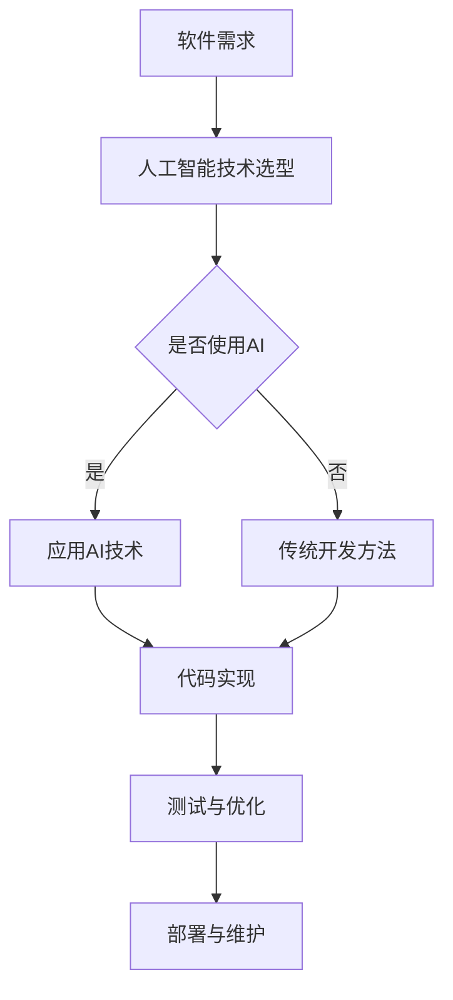

                 

基于您的要求，以下是一个详细的章节示例，用于撰写一篇符合要求的文章。

### 第1章：人工智能概述

#### 1.1 人工智能的定义与发展历程

人工智能（Artificial Intelligence, AI）是计算机科学的一个分支，致力于模拟、延伸和扩展人类智能。其定义可以从不同角度进行解读：

- **狭义定义**：人工智能是研究、开发用于模拟、延伸和扩展人的智能的理论、方法、技术及应用系统的一门新的技术科学。
- **广义定义**：人工智能不仅包括机器学习、自然语言处理等计算机科学领域，还涵盖了认知科学、心理学、神经科学等多个学科。

人工智能的发展历程可以追溯到20世纪50年代：

- **初期阶段（1950-1969）**：人工智能的概念首次被提出，机器是否能够表现出智能行为成为研究焦点。
- **繁荣阶段（1970-1989）**：以专家系统为代表的研究取得了显著成果，但受限于计算资源和算法限制，进展放缓。
- **复兴阶段（1990-2010）**：随着计算能力的提升和数据量的爆炸性增长，机器学习等算法取得了突破性进展。
- **成熟阶段（2010至今）**：人工智能技术逐渐成熟，深度学习、自然语言处理等领域取得了重大突破，应用场景不断拓展。

#### 1.2 人工智能的核心技术

人工智能的核心技术包括：

- **机器学习**：机器学习是使计算机具备自主学习和适应能力的关键技术。其主要方法包括监督学习、无监督学习和强化学习。
- **深度学习**：深度学习是机器学习的一个分支，通过多层神经网络来提取数据特征。其代表性算法包括卷积神经网络（CNN）和循环神经网络（RNN）。
- **自然语言处理（NLP）**：自然语言处理是研究计算机如何理解、生成和处理自然语言的技术。其应用包括机器翻译、情感分析、语音识别等。
- **计算机视觉**：计算机视觉是使计算机能够从图像或视频中提取信息的技术。其应用包括图像识别、物体检测、人脸识别等。

#### 1.3 人工智能在软件开发中的应用现状

目前，人工智能在软件开发中的应用已经相当广泛，包括：

- **自动化测试**：通过机器学习技术，自动化测试工具能够预测并识别软件中的缺陷。
- **智能设计辅助**：利用人工智能技术，软件开发人员可以更快速地进行代码生成、设计优化等任务。
- **智能部署与维护**：通过自适应部署和智能维护，软件开发人员可以更高效地管理和维护软件系统。
- **自然语言处理**：在软件产品中集成自然语言处理技术，可以实现人机交互、智能客服等功能。

### 1.4 小结

在本章中，我们介绍了人工智能的定义、发展历程、核心技术以及其在软件开发中的应用现状。下一章，我们将进一步探讨软件开发中常用的人工智能技术。

作者：AI天才研究院/AI Genius Institute & 禅与计算机程序设计艺术 /Zen And The Art of Computer Programming

---

以下是一个简单的Mermaid流程图示例，用于展示人工智能在软件开发中的应用过程：

接下来，我们将进入下一章，详细介绍软件开发中常用的人工智能技术。希望您对这篇文章的结构和内容感到满意。如果您有任何修改意见或需要添加其他内容，请随时告诉我。

