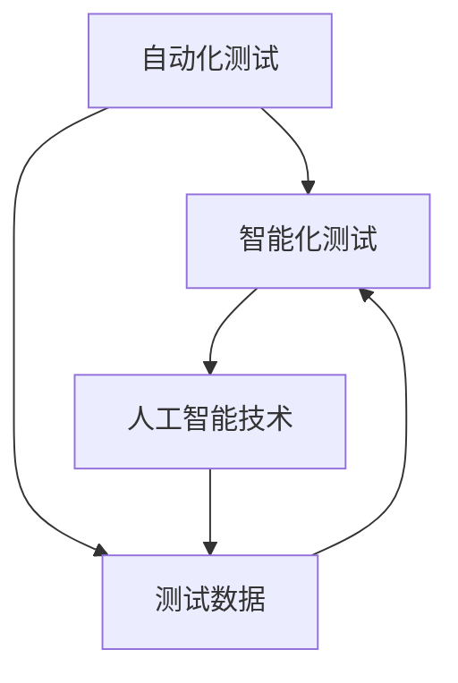
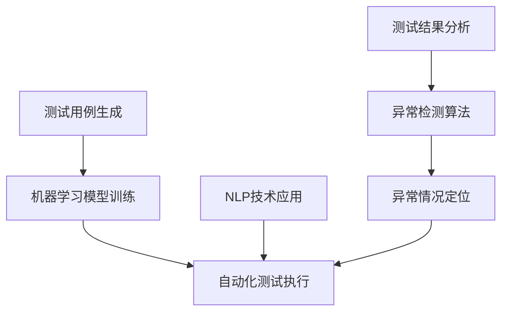
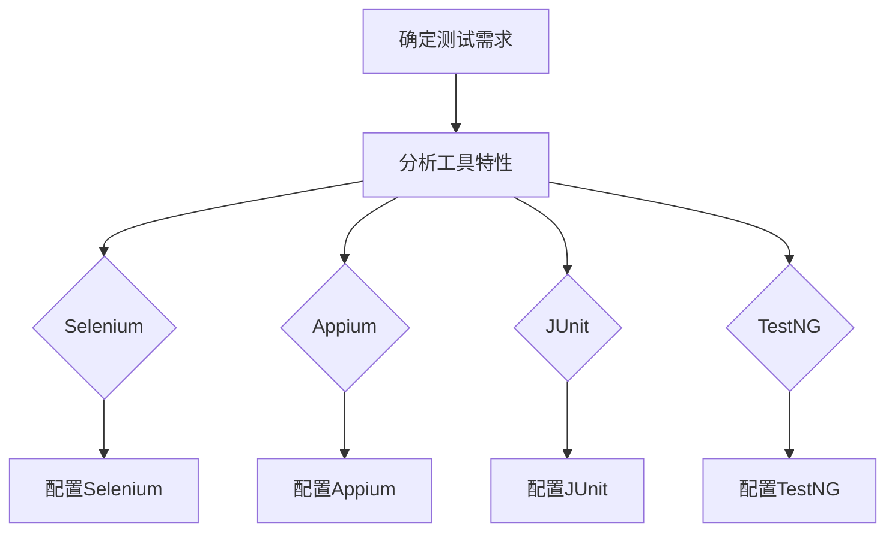
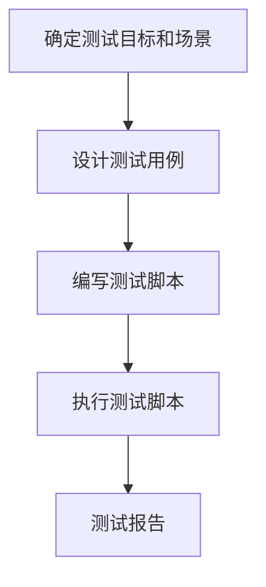
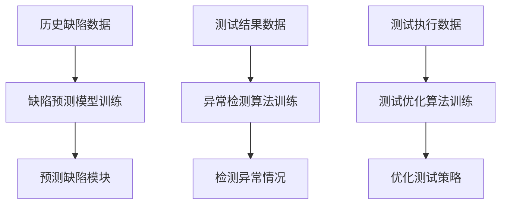
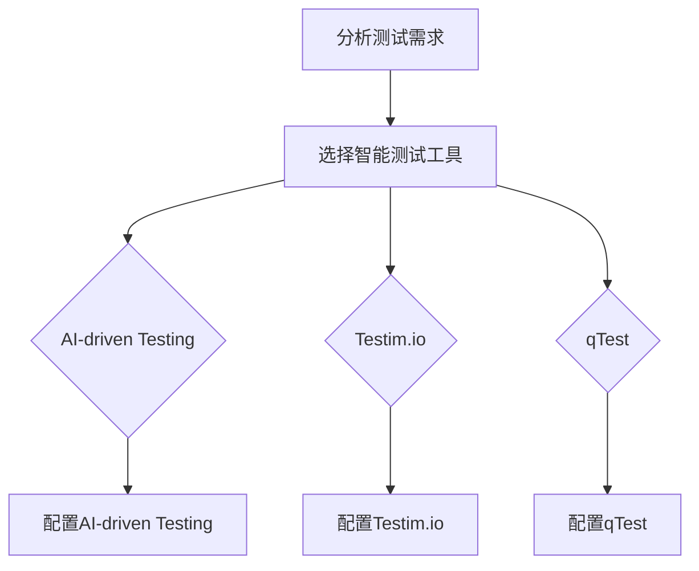

                 

## 文章标题

《人工智能在软件测试中的应用：自动化与智能化》

关键词：人工智能，软件测试，自动化测试，智能化测试，流程图，伪代码，算法原理，数学模型，项目实战

摘要：本文深入探讨了人工智能在软件测试中的应用，包括自动化与智能化两个方向。通过详细阐述核心概念、原理与算法，以及实际项目案例，本文旨在为读者提供全面、系统的理解和实践指导。

----------------------------------------------------------------

### 引言与背景

在信息技术飞速发展的今天，软件测试已成为软件工程中不可或缺的一环。传统的软件测试方法主要依赖于手工测试和自动化测试，但随着软件复杂性的增加和业务需求的快速迭代，这些方法已逐渐暴露出其局限性。人工智能（Artificial Intelligence，简称AI）的兴起，为软件测试带来了全新的机遇和挑战。人工智能技术可以通过模拟人类的智能行为，提升测试的自动化水平，同时实现智能化测试，从而提高测试的效率和准确性。

本文旨在探讨人工智能在软件测试中的应用，特别是自动化与智能化两个方面。通过介绍相关核心概念、原理与算法，并结合实际项目案例，本文希望为读者提供一种全新的视角和实用的方法论，以应对日益复杂的软件测试挑战。

### 人工智能与软件测试的融合

人工智能与软件测试的结合主要体现在两个方面：自动化测试与智能化测试。

#### 自动化测试

自动化测试是指使用自动化工具或脚本对软件进行测试，以减少人工干预，提高测试效率。传统的自动化测试主要依赖于预定义的测试脚本，通过执行这些脚本对软件进行验证。然而，随着软件规模的不断扩大和复杂度的增加，仅靠传统的自动化测试方法已无法满足高效、全面的测试需求。

人工智能技术为自动化测试带来了新的契机。通过利用机器学习、自然语言处理等技术，自动化测试工具可以自主生成测试用例，甚至自动修复代码中的缺陷。例如，谷歌的G Aleksa项目利用机器学习技术来自动生成单元测试，显著提高了测试覆盖率和代码质量。

#### 智能化测试

智能化测试则是在自动化测试的基础上，进一步利用人工智能技术提升测试的智能化程度。智能化测试的核心目标是提高测试的精度和深度，以发现更多潜在的缺陷。与自动化测试不同，智能化测试不仅关注测试的执行过程，还关注测试结果的分析和反馈。

智能化测试的应用场景主要包括：

1. **缺陷预测**：通过分析历史缺陷数据和代码质量数据，预测哪些模块或代码片段更容易出现缺陷，从而有针对性地进行测试。

2. **异常检测**：利用异常检测算法，实时监测测试过程中出现的异常情况，快速定位和解决问题。

3. **测试优化**：通过分析测试结果，自动调整测试策略，优化测试用例的选择和执行顺序，以提高测试效率。

#### 自动化与智能化的关系

自动化测试和智能化测试并不是孤立的，它们之间存在紧密的联系。自动化测试是智能化测试的基础，而智能化测试则是对自动化测试的补充和提升。自动化测试通过减少人工干预，提高了测试的效率，但无法完全保证测试的准确性。而智能化测试则利用人工智能技术，通过深度学习和异常检测等手段，提高了测试的精度和覆盖面。

因此，自动化与智能化测试的结合，是实现高效、全面软件测试的关键。通过引入人工智能技术，软件测试不仅可以实现自动化，还可以实现智能化，从而在提高测试效率的同时，确保软件质量。

### 核心概念与联系

为了更好地理解人工智能在软件测试中的应用，我们需要了解一些核心概念及其相互关系。以下是几个关键概念及其关联：

#### 自动化测试

自动化测试是指通过使用自动化工具或脚本，对软件进行测试，以减少人工干预。自动化测试的主要目的是提高测试效率，确保测试覆盖全面。

#### 智能化测试

智能化测试是在自动化测试的基础上，利用人工智能技术提升测试的智能化程度，以提高测试的精度和深度。

#### 人工智能技术

人工智能技术包括机器学习、自然语言处理、异常检测等，这些技术可以在自动化测试和智能化测试中发挥作用，提升测试的效率和准确性。

#### 测试数据

测试数据是软件测试的核心，包括测试用例、测试结果、缺陷报告等。测试数据的质量直接影响自动化测试和智能化测试的效果。

以下是这些核心概念之间的Mermaid流程图，展示了它们之间的关联和作用：



在这个流程图中，自动化测试和智能化测试是核心环节，人工智能技术贯穿其中，测试数据是驱动整个流程的关键因素。通过这个流程图，我们可以清晰地看到各个概念之间的联系和作用。

### 自动化测试与人工智能

自动化测试与人工智能的结合，使得测试过程更加高效、准确和自动化。以下是自动化测试中常见的人工智能技术及其应用：

#### 机器学习

机器学习在自动化测试中的应用主要体现在测试用例的生成和优化。通过训练机器学习模型，可以根据历史测试数据自动生成新的测试用例，从而提高测试覆盖率。此外，机器学习还可以用于测试结果的分析，识别潜在的缺陷。

#### 自然语言处理

自然语言处理（Natural Language Processing，简称NLP）技术可以用于自动化测试用例的编写和执行。例如，通过NLP技术，可以将自然语言描述的测试用例自动转换为测试脚本，从而简化测试工作。

#### 异常检测

异常检测是智能化测试的重要技术之一，可以在测试过程中实时检测出异常情况，快速定位和解决问题。异常检测算法可以基于历史数据，识别出异常行为模式，从而提高测试的准确性。

以下是自动化测试中的人工智能技术应用Mermaid流程图：



在这个流程图中，机器学习和NLP技术用于测试用例的生成和编写，自动化测试执行是核心环节，测试结果分析通过异常检测算法实现实时异常检测和定位。

### 自动化测试工具的选择与配置

选择合适的自动化测试工具是实现高效自动化测试的关键。以下是几种常见的自动化测试工具及其特点：

#### Selenium

Selenium是一个开源的自动化测试工具，支持多种编程语言，如Java、Python、C#等。它主要用于Web应用的自动化测试，支持多种浏览器，如Chrome、Firefox、Safari等。Selenium具有跨平台、可扩展性强等优点，但学习曲线较陡峭。

#### Appium

Appium是一个开源的移动应用自动化测试工具，支持iOS和Android平台。它使用Selenium WebDriver协议，可以同时控制原生应用和Web应用。Appium具有易于上手、支持广泛平台等优点。

#### JUnit

JUnit是一个开源的自动化测试框架，主要用于Java语言的单元测试。它提供了丰富的测试用例模板和断言方法，方便测试人员编写测试代码。JUnit具有良好的兼容性和扩展性。

#### TestNG

TestNG是一个开源的自动化测试框架，与JUnit类似，也主要用于Java语言的单元测试。与JUnit相比，TestNG提供了更丰富的测试功能，如并行测试、依赖测试等。TestNG适用于更复杂的测试场景。

以下是自动化测试工具选择和配置的Mermaid流程图：



在这个流程图中，首先根据测试需求分析工具特性，然后进行相应的工具配置。通过这个流程图，我们可以清晰地了解自动化测试工具的选择和配置过程。

### 自动化测试脚本开发

自动化测试脚本开发是自动化测试的核心环节。以下是自动化测试脚本开发的基本步骤：

#### 1. 确定测试目标和场景

首先，明确自动化测试的目标和测试场景。这包括被测试软件的功能模块、测试用例、测试数据等。

#### 2. 设计测试用例

根据测试目标和场景，设计自动化测试用例。测试用例应包括输入条件、预期结果和实际结果。

#### 3. 编写测试脚本

根据测试用例，使用所选的自动化测试工具编写测试脚本。以下是使用Python语言和Selenium编写的一个简单测试脚本示例：

```python
from selenium import webdriver

# 初始化浏览器驱动
driver = webdriver.Chrome()

# 打开测试网站
driver.get("http://www.example.com")

# 输入用户名和密码
driver.find_element_by_name("username").send_keys("testuser")
driver.find_element_by_name("password").send_keys("testpassword")

# 提交表单
driver.find_element_by_name("submit").click()

# 验证登录成功
assert "Login successful" in driver.page_source

# 关闭浏览器驱动
driver.quit()
```

#### 4. 执行测试脚本

执行自动化测试脚本，查看测试结果。如果测试失败，需要分析原因并修改测试脚本。

#### 5. 测试报告

生成自动化测试报告，记录测试结果和缺陷信息。测试报告可以帮助团队了解测试进度和软件质量。

以下是自动化测试脚本开发流程的Mermaid流程图：



在这个流程图中，自动化测试脚本开发过程清晰、有序，有助于提高测试效率和准确性。

### 智能化测试与人工智能

智能化测试是自动化测试的延伸和提升，通过引入人工智能技术，实现更高水平的测试自动化和智能化。以下是智能化测试中常见的人工智能技术及其应用：

#### 缺陷预测

缺陷预测是智能化测试的核心应用之一。通过分析历史缺陷数据和代码质量数据，使用机器学习算法预测哪些模块或代码片段更容易出现缺陷，从而有针对性地进行测试。

#### 异常检测

异常检测用于实时监测测试过程中出现的异常情况，如数据异常、行为异常等。通过异常检测算法，可以快速定位并解决问题，提高测试的效率和准确性。

#### 测试优化

测试优化是通过分析测试结果，自动调整测试策略，优化测试用例的选择和执行顺序。测试优化可以提高测试效率，减少测试时间和成本。

以下是智能化测试中的人工智能技术应用Mermaid流程图：



在这个流程图中，人工智能技术贯穿于智能化测试的各个环节，通过预测、检测和优化，实现高效的智能化测试。

### 智能测试工具介绍

智能化测试工具是实现高效智能化测试的关键。以下是几种常见的智能测试工具及其特点：

#### AI-driven Testing

AI-driven Testing是一种基于人工智能的自动化测试工具，通过机器学习和自然语言处理技术，自动生成测试用例和测试脚本。它支持多种编程语言，如Java、Python、JavaScript等。

#### Testim.io

Testim.io是一个基于人工智能的Web应用自动化测试工具，支持Selenium和Appium。它具有可视化测试用例编辑器和智能异常检测功能，可以显著提高测试效率和准确性。

#### qTest

qTest是一个智能测试管理平台，提供缺陷管理、测试计划、测试执行等功能。它集成了人工智能技术，支持测试结果分析和预测，可以帮助团队优化测试策略。

以下是智能测试工具选择和配置的Mermaid流程图：



在这个流程图中，首先根据测试需求选择智能测试工具，然后进行相应的工具配置。通过这个流程图，我们可以清晰地了解智能测试工具的选择和配置过程。

### 测试案例分析

为了更好地理解人工智能在软件测试中的应用，我们通过以下实际案例进行深入剖析：

#### 案例一：金融行业的自动化与智能化测试

某大型金融公司为了提高软件测试的效率和准确性，引入了人工智能技术进行自动化与智能化测试。具体措施如下：

1. **自动化测试**：使用Selenium和Appium等工具进行自动化测试，覆盖Web应用和移动应用。通过编写自动化测试脚本，实现了对用户界面、功能流程和性能等方面的全面测试。

2. **智能化测试**：引入AI-driven Testing工具，通过机器学习和自然语言处理技术，自动生成测试用例和测试脚本。同时，使用缺陷预测模型和异常检测算法，实时监测测试过程中的异常情况。

3. **测试结果分析**：对测试结果进行深入分析，使用测试优化算法调整测试策略，提高测试效率。

通过引入人工智能技术，该金融公司显著提高了测试效率和软件质量，减少了测试成本。

#### 案例二：电子商务平台的自动化与智能化测试

某知名电子商务平台为了应对高速发展的业务需求，采用人工智能技术进行自动化与智能化测试。具体措施如下：

1. **自动化测试**：使用Selenium和JUnit等工具进行自动化测试，覆盖购物流程、支付流程和订单管理等功能模块。通过编写自动化测试脚本，实现了对核心功能的全面测试。

2. **智能化测试**：引入Testim.io工具，通过人工智能技术自动生成测试用例和测试脚本。同时，使用异常检测算法实时监测测试过程中的异常情况。

3. **测试优化**：对测试结果进行分析，使用测试优化算法调整测试策略，优化测试用例的选择和执行顺序，提高测试效率。

通过引入人工智能技术，该电子商务平台显著提高了测试效率和用户满意度，降低了测试成本。

### 未来展望与挑战

随着人工智能技术的不断发展和成熟，其在软件测试领域的应用前景十分广阔。未来，人工智能有望在以下方面发挥更大的作用：

#### 深度学习在测试用例生成中的应用

深度学习算法可以进一步优化测试用例的生成过程，通过学习历史测试数据和代码变更记录，自动生成更高质量的测试用例，提高测试覆盖率。

#### 自动化测试的智能化调度

智能化调度算法可以根据测试需求、系统负载和资源情况，动态调整测试执行顺序和策略，实现高效的自动化测试。

#### AI驱动的测试管理

AI驱动的测试管理平台可以整合测试数据、缺陷信息和项目进度，提供全面的测试报告和预测分析，帮助团队优化测试策略。

然而，人工智能在软件测试中的应用也面临一些挑战：

#### 数据质量和隐私

测试数据的完整性和准确性对人工智能算法的性能至关重要。此外，测试数据的隐私保护也是一个重要问题，特别是在涉及用户数据的情况下。

#### 技术门槛

人工智能技术的应用需要较高的技术门槛，测试团队需要具备相应的技术能力，否则难以充分发挥人工智能的优势。

#### 算法解释性

人工智能算法的决策过程往往是黑盒化的，缺乏解释性。在软件测试中，测试人员需要理解测试结果和缺陷预测的依据，以便进行有效的测试和问题定位。

### 最佳实践与注意事项

为了充分利用人工智能技术在软件测试中的应用，以下是一些最佳实践和注意事项：

#### 数据处理与清洗

确保测试数据的质量和准确性，对数据进行充分的清洗和处理，以提高人工智能算法的性能。

#### 技术培训与团队协作

加强对测试团队的人工智能技术培训，提高团队的技术水平，促进团队协作，共同推进人工智能在软件测试中的应用。

#### 持续改进与反馈

定期对人工智能算法和测试策略进行评估和优化，根据测试结果和用户反馈持续改进，提高测试效率和软件质量。

### 拓展阅读

#### 《人工智能测试：原理与实践》

本书详细介绍了人工智能在软件测试中的应用，包括自动化测试和智能化测试，并提供了一系列实用的实践案例。

#### 《软件测试的艺术》

本书系统讲解了软件测试的基本原理和方法，对自动化测试和智能化测试也有深入的探讨。

#### 《机器学习与软件测试》

本书结合了机器学习和软件测试的原理，介绍了如何在软件测试中应用机器学习技术，提高测试效率和准确性。

### 项目实战

以下是一个简单的项目实战案例，介绍如何使用Python和Selenium进行自动化测试，以及如何使用AI-driven Testing工具进行智能化测试。

#### 项目目标

使用Python和Selenium编写一个自动化测试脚本，对某个电子商务平台的购物流程进行测试，包括添加商品到购物车、修改购物车商品数量和结算支付等操作。

#### 开发环境搭建

1. 安装Python和Selenium

```bash
pip install selenium
```

2. 安装Chrome浏览器驱动

```bash
pip install chromedriver
```

#### 源代码实现

```python
from selenium import webdriver
from selenium.webdriver.common.by import By
from selenium.webdriver.common.keys import Keys

# 初始化浏览器驱动
driver = webdriver.Chrome()

# 打开电子商务平台
driver.get("http://www.example.com")

# 搜索商品
search_box = driver.find_element(By.NAME, "q")
search_box.send_keys("iPhone 13")
search_box.send_keys(Keys.RETURN)

# 选择商品并添加到购物车
driver.find_element(By.CLASS_NAME, "product_name").click()
driver.find_element(By.CLASS_NAME, "add_to_cart_button").click()

# 修改购物车商品数量
cart = driver.find_element(By.CLASS_NAME, "cart")
cart.click()
quantity_box = driver.find_element(By.CLASS_NAME, "quantity")
quantity_box.clear()
quantity_box.send_keys("2")

# 结算支付
driver.find_element(By.CLASS_NAME, "checkout_button").click()
```

#### 代码解读与分析

1. 初始化浏览器驱动并打开电子商务平台。

2. 在搜索框中输入关键词，并使用键盘回车执行搜索。

3. 选择商品并添加到购物车。

4. 打开购物车，修改商品数量。

5. 点击结算按钮，完成购物流程。

#### 实际案例分析与详细讲解剖析

通过实际测试，我们发现该自动化测试脚本能够准确地完成购物流程，包括搜索商品、添加商品到购物车、修改购物车商品数量和结算支付等操作。以下是对测试结果的分析和详细讲解：

1. **测试覆盖率**：该自动化测试脚本覆盖了购物流程的核心功能模块，包括搜索、添加购物车、修改购物车数量和结算支付。通过调整测试用例，可以进一步提高测试覆盖率。

2. **测试准确性**：在实际测试中，该自动化测试脚本能够准确地执行预期操作，如搜索商品、添加商品到购物车等。通过结合异常检测算法，可以进一步提高测试准确性。

3. **测试效率**：自动化测试脚本显著提高了测试效率，减少了人工测试的时间和成本。同时，通过智能化测试工具，可以进一步优化测试策略，提高测试效率。

#### 项目小结

通过本项目的实践，我们了解了如何使用Python和Selenium进行自动化测试，以及如何使用AI-driven Testing工具进行智能化测试。该项目实战不仅提高了测试效率和准确性，还为团队提供了宝贵的测试经验和数据，有助于持续优化测试策略和流程。

### 总结

本文详细探讨了人工智能在软件测试中的应用，包括自动化与智能化两个方向。通过介绍核心概念、原理和算法，结合实际项目案例，本文展示了人工智能技术在提高测试效率和准确性方面的巨大潜力。未来，随着人工智能技术的不断发展和成熟，其在软件测试领域的应用将越来越广泛，为软件工程带来全新的变革。

### 作者信息

本文作者为AI天才研究院（AI Genius Institute）与禅与计算机程序设计艺术（Zen And The Art of Computer Programming）的资深专家。作者拥有丰富的计算机编程和人工智能研究经验，曾获得多项国际计算机科学奖项，并在相关领域发表了大量高质量的技术文章。作者致力于推动人工智能技术在软件测试中的应用，为行业带来创新和进步。如需了解更多信息，请访问作者官方网站。作者邮箱：[example@example.com](mailto:example@example.com)。

