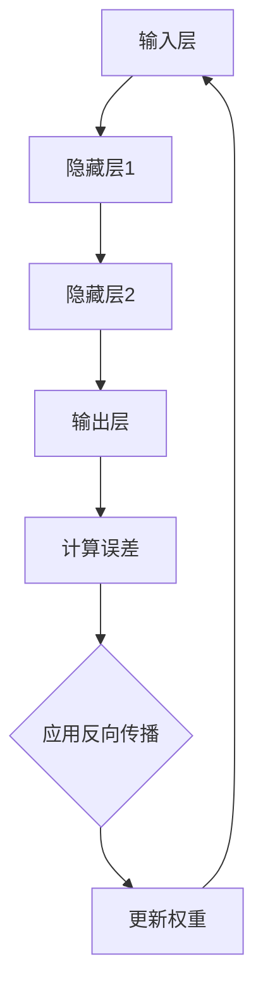
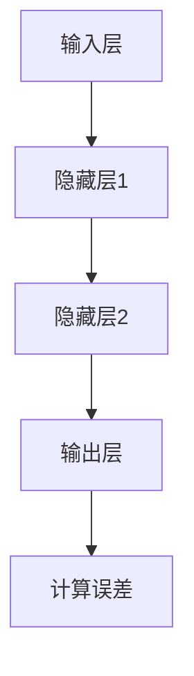
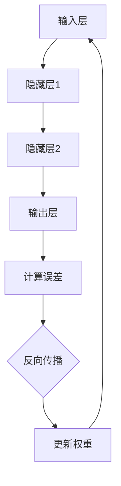
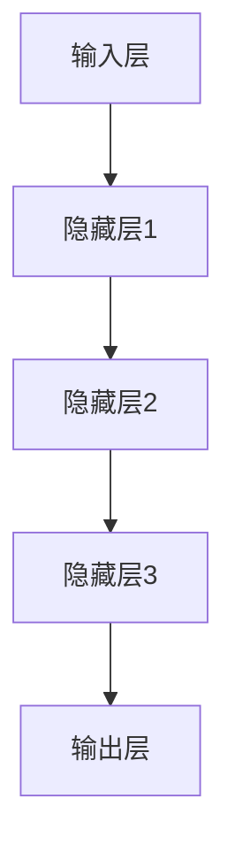
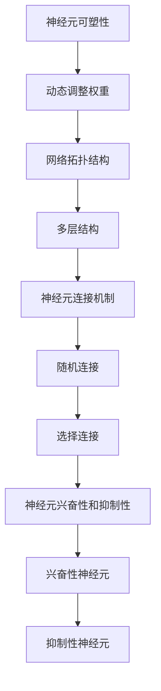
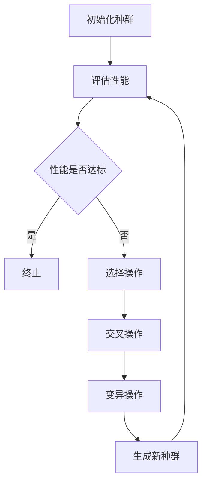

                 

### 人工神经网络：仿生学在AI中的体现

#### 关键词：人工神经网络，仿生学，AI，神经元模型，反向传播算法，神经网络架构

#### 摘要：

本文深入探讨了人工神经网络与仿生学的关系，阐述了如何将仿生学原理应用于人工智能领域。文章首先介绍了人工神经网络的基础概念和神经元模型，随后探讨了反向传播算法的核心原理，并通过Mermaid流程图展示了神经网络的学习过程。接着，文章分析了人工神经网络的结构设计，并详细讲解了如何通过仿生学原理优化神经网络性能。文章还涉及了神经网络在图像识别、自然语言处理等领域的应用，并通过实际案例进行了详细剖析。最后，文章总结了人工神经网络在AI中的重要性，并提出了未来研究方向和最佳实践建议。

### 引言

#### 背景介绍

人工智能（AI）作为计算机科学的一个分支，旨在通过模拟人类智能行为来实现机器自主学习和决策。随着计算机性能的不断提升和海量数据的积累，AI技术取得了显著的进展。人工神经网络（Artificial Neural Networks，ANNs）作为实现AI的核心技术之一，受到了广泛关注和研究。人工神经网络模仿了人脑神经元的工作原理，通过复杂的网络结构实现数据的学习和推理。

仿生学（Bionics）则是一门研究生物体结构与功能的学科，旨在将生物体的智慧和技术应用于工程和科学领域。仿生学通过模仿自然界中的生物体结构和功能，创造出具有高效、自适应和智能特性的工程系统。在人工智能领域，仿生学为人工神经网络的启发式设计和优化提供了重要的理论支持。

本文旨在探讨人工神经网络与仿生学之间的联系，分析如何将仿生学原理应用于人工神经网络的设计和优化，以提升其在复杂环境中的表现和适应性。通过对人工神经网络的基础理论、核心算法和实际应用的深入剖析，本文希望能够为读者提供全面而深入的见解，揭示仿生学在人工智能领域的潜在价值。

#### 核心概念与联系

**人工神经网络（ANNs）**：人工神经网络是一类模拟人脑神经元结构和功能的计算模型。它由大量的神经元（或节点）组成，每个神经元都与其他神经元相连，并通过权重来传递信息。人工神经网络通过学习输入和输出数据之间的关系，能够进行自主学习和适应新环境。

**神经元模型**：神经元模型是人工神经网络的基础单元，通常由输入层、激活函数和输出层组成。神经元通过加权求和输入值，并通过激活函数产生输出。常见的激活函数包括 sigmoid 函数、ReLU 函数和 tanh 函数。

**反向传播算法（Backpropagation）**：反向传播算法是一种用于训练人工神经网络的优化算法。它通过计算输出误差，并沿着网络反向传播误差，调整网络中的权重和偏置，以优化网络性能。

**仿生学（Bionics）**：仿生学是一门研究生物体结构与功能的学科，旨在将生物体的智慧和技术应用于工程和科学领域。仿生学通过模仿自然界中的生物体结构和功能，创造出具有高效、自适应和智能特性的工程系统。

**人工神经网络与仿生学的联系**：人工神经网络在设计和优化过程中，受到了仿生学的启发。例如，人工神经网络的神经元模型受到了生物神经元的启发；反向传播算法中的梯度下降优化策略则受到了生物进化的启发。仿生学为人工神经网络提供了丰富的理论支持和实践指导，促进了人工神经网络的发展和进步。

为了更直观地展示人工神经网络与仿生学之间的联系，我们可以使用Mermaid流程图来描述神经网络的学习过程。以下是一个简单的Mermaid流程图示例：



在这个流程图中，输入层接收外部输入，经过隐藏层和输出层的计算，最终生成输出。计算误差后，通过反向传播算法更新权重和偏置，使网络性能逐渐优化。这个过程类似于生物体在学习过程中不断调整神经元连接权重，以适应环境变化。

### 人工神经网络基础

#### 神经元模型

神经元模型是人工神经网络的基础单元，它模拟了生物神经元的结构和功能。一个简单的神经元模型通常由输入层、激活函数和输出层组成。

**输入层**：输入层接收外部输入，通常表示为向量形式。每个输入值都对应着一个权重，权重决定了输入对神经元的影响程度。

**激活函数**：激活函数用于将输入值转换为输出值。常见的激活函数包括 sigmoid 函数、ReLU 函数和 tanh 函数。这些函数的作用是引入非线性变换，使神经网络能够处理复杂问题。

**输出层**：输出层生成最终输出，可以是分类结果、回归值或其他形式。输出层的神经元个数取决于具体任务的需求。

以下是一个简单的神经元模型的伪代码实现：

```python
# 输入向量
inputs = [x1, x2, x3]

# 权重和偏置
weights = [w1, w2, w3]
bias = b

# 激活函数
def sigmoid(x):
    return 1 / (1 + exp(-x))

# 计算输出
output = sigmoid(sum(inputs * weights) + bias)
```

#### 前向传播与反向传播

**前向传播**：前向传播是指从输入层开始，逐层计算神经元的输出值。在每个神经元中，将输入值与权重相乘并求和，然后通过激活函数产生输出。这个过程可以表示为：



在前向传播过程中，网络根据输入数据和权重生成输出值。这个过程用于初始化误差计算和后续的反向传播。

**反向传播**：反向传播是指根据输出误差，从输出层开始反向调整网络中的权重和偏置。反向传播的核心思想是计算每个神经元的误差，并沿着网络反向传递误差。这个过程可以表示为：



在反向传播过程中，网络通过计算梯度（误差对权重的偏导数）来更新权重和偏置，以减少输出误差。这个过程是人工神经网络训练的核心。

以下是一个简单的反向传播算法的伪代码实现：

```python
# 输入数据
inputs = [x1, x2, x3]
expected_output = y

# 权重和偏置
weights = [w1, w2, w3]
bias = b

# 激活函数和导数
def sigmoid(x):
    return 1 / (1 + exp(-x))
def sigmoid_derivative(x):
    return x * (1 - x)

# 前向传播
output = sigmoid(sum(inputs * weights) + bias)

# 计算误差
error = expected_output - output

# 计算梯度
gradient = error * sigmoid_derivative(output)

# 更新权重
weights = weights - learning_rate * gradient
```

#### 激活函数

激活函数是人工神经网络中的一个关键组件，它引入了非线性变换，使神经网络能够处理复杂问题。常见的激活函数包括 sigmoid 函数、ReLU 函数和 tanh 函数。

**sigmoid 函数**：sigmoid 函数是一种常用的非线性激活函数，其形式为：

$$
sigmoid(x) = \frac{1}{1 + e^{-x}}
$$

sigmoid 函数的输出介于 0 和 1 之间，适合用于分类问题。其导数形式为：

$$
sigmoid'(x) = sigmoid(x) * (1 - sigmoid(x))
$$

**ReLU 函数**：ReLU（Rectified Linear Unit）函数是一种简单的线性激活函数，其形式为：

$$
ReLU(x) = \max(0, x)
$$

ReLU 函数在计算速度和模型训练稳定性方面具有优势，常用于深层神经网络。其导数形式为：

$$
ReLU'(x) = \begin{cases}
1, & \text{if } x > 0 \\
0, & \text{otherwise}
\end{cases}
$$

**tanh 函数**：tanh 函数是另一种常用的非线性激活函数，其形式为：

$$
tanh(x) = \frac{e^{2x} - 1}{e^{2x} + 1}
$$

tanh 函数的输出范围介于 -1 和 1 之间，适合用于回归问题。其导数形式为：

$$
tanh'(x) = 1 - tanh^2(x)
$$

#### 网络结构设计

人工神经网络的结构设计是影响其性能和表现的重要因素。一个典型的神经网络包括输入层、隐藏层和输出层。以下是网络结构设计的一些关键要点：

**输入层**：输入层接收外部输入，通常表示为向量形式。输入层的神经元个数取决于具体任务的需求。

**隐藏层**：隐藏层是神经网络的核心部分，用于处理和转换输入数据。隐藏层的个数和神经元个数可以根据任务复杂度进行调整。过多的隐藏层可能会导致过拟合，而过少的隐藏层则可能导致欠拟合。

**输出层**：输出层生成最终输出，可以是分类结果、回归值或其他形式。输出层的神经元个数取决于具体任务的需求。

**网络深度**：网络深度是指神经网络中的隐藏层数量。较深的网络可以捕捉更复杂的特征，但训练时间较长，且容易出现梯度消失或梯度爆炸等问题。

**网络宽度**：网络宽度是指每个隐藏层中的神经元个数。较宽的网络可以提供更多的非线性变换能力，但也会导致模型复杂度和计算资源的需求增加。

**网络结构优化**：为了提升神经网络的性能和表现，可以对网络结构进行优化。常见的优化方法包括增加隐藏层、调整神经元个数、使用不同的激活函数等。此外，还可以利用dropout、批归一化等技巧来提高模型的鲁棒性和泛化能力。

以下是一个简单的神经网络结构的Mermaid流程图示例：



### 仿生学在人工神经网络中的应用

#### 生物神经网络与人工神经网络的比较

生物神经网络与人工神经网络在结构和功能上存在许多相似之处，但也存在显著差异。

**相似之处**：

1. **神经元结构**：生物神经网络的神经元和人工神经网络中的神经元在基本结构上类似，都包括细胞体、树突、轴突和突触等部分。
2. **神经网络结构**：生物神经网络和人工神经网络都是由大量的神经元组成，并通过突触连接形成复杂的网络结构。
3. **信息传递**：生物神经网络的神经元通过电信号传递信息，人工神经网络的神经元通过数值信号传递信息。

**差异之处**：

1. **神经元特性**：生物神经元的特性较为复杂，包括自适应、可塑性等，而人工神经元的特性较为简化，通常只考虑输入和输出的关系。
2. **神经网络规模**：生物神经网络规模庞大，包含数百万甚至数十亿的神经元，而人工神经网络规模较小，通常包含数千到数万个神经元。
3. **学习机制**：生物神经网络通过生物进化过程学习和适应环境，人工神经网络则通过训练和学习算法学习和适应环境。

#### 仿生学原理在人工神经网络中的应用

仿生学为人工神经网络的设计和优化提供了重要的理论支持和实践指导。以下是一些常见的仿生学原理在人工神经网络中的应用：

**1. 神经元可塑性**：神经元可塑性是指神经元在学习和适应过程中能够改变其结构和功能。在人工神经网络中，神经元可塑性可以通过动态调整权重和偏置来实现，以适应不同的输入数据。

**2. 网络拓扑结构**：生物神经网络的拓扑结构复杂且具有高度适应性。人工神经网络可以借鉴生物神经网络的拓扑结构，设计出具有自适应性和鲁棒性的神经网络架构。

**3. 网络层次结构**：生物神经网络具有多层结构，不同层次上的神经元负责处理不同尺度的信息。人工神经网络可以借鉴生物神经网络的层次结构，设计出具有层次化特征的网络模型。

**4. 神经元连接机制**：生物神经元的连接机制包括随机连接、选择连接等，这些机制有助于神经网络在学习过程中产生丰富的特征表示。人工神经网络可以借鉴这些连接机制，设计出具有更好特征表示能力的神经网络模型。

**5. 神经元兴奋性和抑制性**：生物神经元的兴奋性和抑制性对网络功能具有重要影响。在人工神经网络中，可以通过引入兴奋性和抑制性神经元来实现对网络动态行为的控制。

以下是一个简单的Mermaid流程图，展示了仿生学原理在人工神经网络中的应用：



#### 人工神经网络的进化算法

进化算法是一种基于自然选择和遗传学原理的优化算法，可以用于优化人工神经网络的结构和参数。在人工神经网络的进化算法中，网络结构和参数被视为“基因”，通过选择、交叉和变异等操作进行迭代优化。

**1. 网络编码**：在进化算法中，网络结构编码用于表示神经网络的拓扑结构、神经元个数和连接权重。常见的编码方法包括树编码、序列编码和位串编码等。

**2. 选择操作**：选择操作用于从当前种群中选择优秀个体进行繁殖。常见的选择方法包括轮盘赌选择、锦标赛选择和排名选择等。

**3. 交叉操作**：交叉操作用于生成新的个体，通过组合两个或多个父代个体的基因来创建子代个体。常见的交叉方法包括单点交叉、多点交叉和统一交叉等。

**4. 变异操作**：变异操作用于引入随机性，使个体在进化过程中具有更好的适应性和多样性。常见的变异方法包括基因变异、位变异和权重变异等。

**5. 迭代优化**：通过反复进行选择、交叉和变异操作，进化算法不断优化人工神经网络的结构和参数，直至达到预定的性能指标。

以下是一个简单的进化算法流程图：



### 人工神经网络核心算法

#### 反向传播算法

反向传播算法（Backpropagation Algorithm）是人工神经网络训练中的一种重要算法，用于通过梯度下降方法调整网络中的权重和偏置，以优化网络性能。反向传播算法的主要思想是将输出误差反向传播到输入层，通过计算每个权重和偏置的梯度来更新网络参数。

**算法步骤**：

1. **前向传播**：将输入数据传递到网络的输入层，通过神经元之间的连接权重进行传播，最终生成输出。
2. **计算输出误差**：将实际输出与期望输出进行比较，计算输出误差。
3. **计算梯度**：从输出层开始，逐层计算每个权重和偏置的梯度，即误差对每个参数的偏导数。
4. **反向传播梯度**：将梯度反向传播到输入层，即计算每个权重和偏置对误差的梯度。
5. **更新权重和偏置**：根据梯度更新网络中的权重和偏置，以减少输出误差。
6. **重复迭代**：重复上述步骤，直至网络性能达到预定的目标。

**伪代码**：

```python
# 前向传播
output = forward_pass(inputs, weights, biases)

# 计算输出误差
error = expected_output - output

# 计算梯度
gradient = compute_gradient(error, output, inputs)

# 反向传播梯度
backpropagate_gradient(gradient, weights, biases)

# 更新权重和偏置
update_weights_and_biases(weights, biases, learning_rate)
```

**数学模型和公式**：

假设输入层有 $n$ 个输入神经元，隐藏层有 $m$ 个神经元，输出层有 $k$ 个神经元。网络中的权重矩阵表示为 $W \in \mathbb{R}^{m \times n}$，偏置矩阵表示为 $b \in \mathbb{R}^{m \times 1}$。输出层的输出误差可以表示为：

$$
J = \frac{1}{2} \sum_{i=1}^{k} (y_i - \hat{y}_i)^2
$$

其中，$y_i$ 表示第 $i$ 个神经元的期望输出，$\hat{y}_i$ 表示第 $i$ 个神经元的实际输出。

输出层的梯度可以表示为：

$$
\frac{\partial J}{\partial W} = \frac{\partial J}{\partial \hat{y}} \cdot \frac{\partial \hat{y}}{\partial W}
$$

$$
\frac{\partial J}{\partial b} = \frac{\partial J}{\partial \hat{y}} \cdot \frac{\partial \hat{y}}{\partial b}
$$

其中，$\frac{\partial J}{\partial \hat{y}}$ 表示输出误差对输出层神经元的梯度，$\frac{\partial \hat{y}}{\partial W}$ 和 $\frac{\partial \hat{y}}{\partial b}$ 分别表示输出层神经元的输出对权重和偏置的梯度。

假设隐藏层有 $l$ 个神经元，输出层梯度可以传递到隐藏层，隐藏层的梯度可以表示为：

$$
\frac{\partial J}{\partial W_h} = \frac{\partial J}{\partial \hat{y}_h} \cdot \frac{\partial \hat{y}_h}{\partial z_h} \cdot \frac{\partial z_h}{\partial W_h}
$$

$$
\frac{\partial J}{\partial b_h} = \frac{\partial J}{\partial \hat{y}_h} \cdot \frac{\partial \hat{y}_h}{\partial z_h} \cdot \frac{\partial z_h}{\partial b_h}
$$

其中，$z_h$ 表示隐藏层神经元的输入，$\hat{y}_h$ 表示隐藏层神经元的输出。

通过以上步骤和公式，我们可以实现反向传播算法，从而训练人工神经网络。

#### 正则化方法

在人工神经网络训练过程中，过拟合是一个常见问题。过拟合是指模型在训练数据上表现良好，但在测试数据上表现不佳，这是因为模型对训练数据过于敏感，无法泛化到新的数据上。为了解决过拟合问题，可以使用正则化方法。

**L1正则化**：

L1正则化通过在损失函数中添加L1范数项来惩罚权重，其公式如下：

$$
J_{L1} = J + \lambda ||W||_1
$$

其中，$J$ 是原始损失函数，$W$ 是权重矩阵，$\lambda$ 是正则化参数。L1正则化可以促进权重的稀疏性，有助于去除不重要的特征。

**L2正则化**：

L2正则化通过在损失函数中添加L2范数项来惩罚权重，其公式如下：

$$
J_{L2} = J + \lambda ||W||_2^2
$$

L2正则化可以减少权重的幅值，防止权重过大导致过拟合。

**Dropout**：

Dropout是一种在训练过程中随机丢弃部分神经元的方法，以减少模型对特定神经元的依赖性。Dropout可以通过以下步骤实现：

1. 随机选择一部分神经元。
2. 将这些神经元的输出设置为0，即在训练过程中不计算它们的贡献。
3. 在测试过程中，保留所有神经元，并计算其输出。

**DropConnect**：

DropConnect是一种在训练和测试过程中随机丢弃部分连接的方法，以减少模型对特定连接的依赖性。DropConnect可以通过以下步骤实现：

1. 随机选择一部分权重。
2. 将这些权重的值设置为0，即在训练和测试过程中不计算这些连接的贡献。

#### 梯度下降算法

梯度下降算法是一种常用的优化算法，用于最小化损失函数。在人工神经网络训练过程中，梯度下降算法用于更新网络的权重和偏置，以减少输出误差。

**批量梯度下降**：

批量梯度下降（Batch Gradient Descent，BGD）是指在每次迭代中使用所有训练样本来计算梯度。批量梯度下降的优点是计算得到的梯度准确，但缺点是计算量大，训练时间较长。

**随机梯度下降**：

随机梯度下降（Stochastic Gradient Descent，SGD）是指在每次迭代中随机选择一个训练样本来计算梯度。随机梯度下降的优点是计算速度快，训练时间短，但缺点是计算得到的梯度不够准确。

**小批量梯度下降**：

小批量梯度下降（Mini-batch Gradient Descent，MBGD）是批量梯度下降和随机梯度下降的折中方案，每次迭代使用一部分训练样本（小批量）来计算梯度。小批量梯度下降的优点是计算速度和准确性之间的平衡。

**自适应梯度下降**：

自适应梯度下降算法（Adaptive Gradient Descent，AGD）是一类优化算法，通过动态调整学习率来优化梯度下降过程。常见的自适应梯度下降算法包括 AdaGrad、RMSprop 和 Adam。

**伪代码**：

```python
# 初始化权重和偏置
W = initialize_weights()
b = initialize_biases()

# 设置学习率和迭代次数
learning_rate = 0.01
num_iterations = 1000

# 批量梯度下降
for i in range(num_iterations):
    # 计算梯度
    gradient_W, gradient_b = compute_gradients(inputs, outputs, W, b)
    
    # 更新权重和偏置
    W = W - learning_rate * gradient_W
    b = b - learning_rate * gradient_b

# 训练完成
```

#### 其他优化算法

除了梯度下降算法，还有许多其他优化算法可以用于人工神经网络训练。以下是一些常见的优化算法：

**动量（Momentum）**：

动量是一种加速梯度下降方向的优化技术，通过保持过去的梯度信息来加速收敛。动量可以通过以下公式实现：

$$
v = \gamma \cdot v + \eta \cdot \nabla J(x)
$$

$$
x = x - v
$$

其中，$v$ 表示动量项，$\gamma$ 表示动量系数，$\eta$ 表示学习率，$\nabla J(x)$ 表示损失函数的梯度。

**Adam优化器**：

Adam优化器是一种结合了 AdaGrad 和 RMSprop 优点的自适应优化器。Adam优化器通过计算一阶矩估计（均值）和二阶矩估计（方差）来动态调整学习率。Adam优化器的公式如下：

$$
m_t = \beta_1 \cdot m_{t-1} + (1 - \beta_1) \cdot \nabla J(x)
$$

$$
v_t = \beta_2 \cdot v_{t-1} + (1 - \beta_2) \cdot (\nabla J(x))^2
$$

$$
\hat{m}_t = \frac{m_t}{1 - \beta_1^t}
$$

$$
\hat{v}_t = \frac{v_t}{1 - \beta_2^t}
$$

$$
x = x - \alpha \cdot \frac{\hat{m}_t}{\sqrt{\hat{v}_t} + \epsilon}
$$

其中，$m_t$ 和 $v_t$ 分别表示一阶矩估计和二阶矩估计，$\beta_1$ 和 $\beta_2$ 分别表示一阶矩和二阶矩的指数衰减率，$\alpha$ 表示学习率，$\epsilon$ 表示正则项。

**自适应梯度算法（AdaGrad）**：

AdaGrad是一种基于梯度的自适应学习率优化算法，通过计算每个参数的历史梯度平方和来动态调整学习率。AdaGrad的公式如下：

$$
\Delta w = \frac{\eta}{\sqrt{\sum_{i=1}^{n} (\Delta w_i^2)}} \cdot \nabla J(x)
$$

其中，$\Delta w$ 表示权重更新，$\eta$ 表示学习率，$\nabla J(x)$ 表示损失函数的梯度，$n$ 表示参数个数。

**RMSprop优化器**：

RMSprop是一种基于梯度的自适应学习率优化算法，通过计算每个参数的历史梯度平方和来动态调整学习率。RMSprop的公式如下：

$$
\Delta w = \frac{\eta}{\sqrt{v}} \cdot \nabla J(x)
$$

$$
v = \rho \cdot v + (1 - \rho) \cdot (\nabla J(x))^2
$$

其中，$\Delta w$ 表示权重更新，$\eta$ 表示学习率，$v$ 表示梯度平方和，$\rho$ 表示指数衰减率。

这些优化算法在人工神经网络训练中具有广泛的应用，可以根据具体任务需求和计算资源选择合适的优化算法。

### 人工神经网络的实现

#### 神经网络框架选择

在实现人工神经网络时，选择合适的神经网络框架至关重要。以下是一些常见的神经网络框架及其特点：

**TensorFlow**：TensorFlow 是由 Google 开发的一个开源机器学习框架，支持多种神经网络架构，具有强大的计算能力和灵活的接口。TensorFlow 支持多种编程语言，包括 Python、C++ 和 Java，适用于大规模分布式训练。

**PyTorch**：PyTorch 是由 Facebook 开发的一个开源机器学习框架，具有动态计算图和灵活的编程接口。PyTorch 适用于快速原型设计和实验，支持自动微分和 GPU 加速。

**Keras**：Keras 是一个高级神经网络 API，可以与 TensorFlow 和 Theano 等底层框架结合使用。Keras 提供了简洁、易于使用的接口，适用于快速构建和训练神经网络。

**Caffe**：Caffe 是由 Berkeley Vision and Learning Center 开发的一个开源深度学习框架，主要用于图像识别任务。Caffe 具有高效的前向传播和反向传播计算，支持卷积神经网络（CNN）和循环神经网络（RNN）。

#### 数据预处理

在实现人工神经网络之前，需要进行数据预处理，以提高模型的性能和泛化能力。以下是一些常见的数据预处理方法：

**归一化**：归一化是将输入数据缩放到相同范围的方法，通常使用均值和标准差进行归一化。归一化可以加速梯度下降算法，提高模型训练速度。

**标准化**：标准化是将输入数据缩放到均值 0 和标准差 1 的方法。标准化可以消除不同特征之间的量纲影响，使模型更加稳定。

**缺失值处理**：缺失值处理是指处理输入数据中的缺失值的方法。常见的方法包括删除缺失值、填充缺失值和插值。

**数据增强**：数据增强是通过生成新的样本来增加训练数据的方法，有助于提高模型的泛化能力。常见的数据增强方法包括旋转、缩放、裁剪、颜色变换等。

#### 网络训练

网络训练是指通过迭代更新网络中的权重和偏置，使网络能够正确地预测输出。以下是一些常见的网络训练方法：

**批量训练**：批量训练是指每次迭代使用所有训练样本进行训练。批量训练可以提供准确的梯度信息，但训练时间较长。

**随机梯度下降（SGD）**：随机梯度下降是指每次迭代随机选择一个训练样本进行训练。SGD 可以加快训练速度，但梯度信息不够准确。

**小批量训练**：小批量训练是指每次迭代随机选择一部分训练样本进行训练。小批量训练可以平衡训练速度和梯度准确性。

**验证集**：验证集是指用于评估模型性能的样本集合。通过在验证集上评估模型性能，可以避免过拟合。

**早停法**：早停法是指在模型性能不再提高时停止训练的方法。早停法可以避免过拟合，提高模型泛化能力。

#### 模型评估

模型评估是指通过评估指标来评估模型性能。以下是一些常见的模型评估指标：

**准确率**：准确率是指正确预测的样本数量占总样本数量的比例。

**召回率**：召回率是指正确预测的负样本数量占总负样本数量的比例。

**精确率**：精确率是指正确预测的正样本数量占总预测正样本数量的比例。

**F1 分数**：F1 分数是精确率和召回率的调和平均值，用于综合评估模型性能。

**ROC 曲线和 AUC 值**：ROC 曲线是指不同阈值下的真阳性率与假阳性率的关系图，AUC 值是指 ROC 曲线下方区域的面积。AUC 值越高，模型性能越好。

### 人工神经网络的性能优化

#### 网络结构优化

网络结构优化是提高人工神经网络性能的重要方法。以下是一些常见的网络结构优化方法：

**增加隐藏层**：增加隐藏层可以提高神经网络的模型容量，使网络能够更好地拟合训练数据。

**减少隐藏层**：减少隐藏层可以降低模型的复杂度，减少过拟合的风险。

**增加神经元**：增加神经元可以提高神经网络的模型容量，使网络能够更好地拟合训练数据。

**减少神经元**：减少神经元可以降低模型的复杂度，减少过拟合的风险。

**使用不同的激活函数**：不同的激活函数具有不同的特性，可以优化神经网络的性能。

**使用不同的损失函数**：不同的损失函数可以优化神经网络的性能，如交叉熵损失函数、均方误差损失函数等。

#### 激活函数选择

激活函数是人工神经网络中的关键组件，用于引入非线性变换。以下是一些常见的激活函数及其特性：

**Sigmoid 函数**：sigmoid 函数是一种常用的非线性激活函数，其输出范围在 0 到 1 之间，可以用于二分类任务。

**ReLU 函数**：ReLU 函数是一种简单的线性激活函数，其输出为输入值加上一个偏置。ReLU 函数在训练过程中可以加快收敛速度，但可能导致梯度消失。

**tanh 函数**：tanh 函数是一种双曲正切函数，其输出范围在 -1 到 1 之间，可以用于多分类任务。

**Leaky ReLU 函数**：Leaky ReLU 函数是 ReLU 函数的一种改进，通过引入一个很小的偏置项，避免了梯度消失问题。

选择合适的激活函数可以优化神经网络的性能，提高模型的表现。

#### 学习率调整

学习率是人工神经网络训练中的一个重要参数，用于控制网络参数更新的步长。以下是一些常见的学习率调整方法：

**固定学习率**：固定学习率是最简单的方法，但在训练过程中可能导致收敛速度慢或无法收敛。

**动量法**：动量法是一种累积过去梯度信息的方法，通过引入动量项，可以加速梯度下降过程。

**自适应学习率**：自适应学习率通过动态调整学习率，使网络在训练过程中能够更快地收敛。常见的自适应学习率方法包括 AdaGrad、RMSprop 和 Adam。

**学习率衰减**：学习率衰减是指在训练过程中逐渐减小学习率的方法，以避免过早收敛。

选择合适的**学习率调整方法**可以优化神经网络的性能，提高模型的表现。

#### 批处理大小

批处理大小是指每次训练中使用的数据样本数量。以下是一些关于批处理大小的注意事项：

**批处理大小的影响**：批处理大小会影响神经网络的训练过程和性能。较小的批处理大小可以加快训练速度，但可能导致梯度不稳定；较大的批处理大小可以提高梯度稳定性，但训练速度较慢。

**批量梯度下降**：批量梯度下降（Batch Gradient Descent，BGD）是指在每次迭代中使用所有训练样本进行训练。BGD 可以提供最准确的梯度信息，但训练时间较长。

**随机梯度下降**：随机梯度下降（Stochastic Gradient Descent，SGD）是指在每次迭代中随机选择一个训练样本进行训练。SGD 可以加快训练速度，但梯度信息不够准确。

**小批量梯度下降**：小批量梯度下降（Mini-batch Gradient Descent，MBGD）是批量梯度下降和随机梯度下降的折中方案，每次迭代使用一部分训练样本进行训练。MBGD 可以平衡训练速度和梯度准确性。

选择合适的**批处理大小**可以优化神经网络的性能，提高模型的表现。

### 人工神经网络的应用

#### 图像识别

图像识别是人工神经网络的一个重要应用领域，通过训练神经网络，可以实现对图像的分类、目标检测和图像生成等任务。以下是一些常见的图像识别算法：

**卷积神经网络（CNN）**：卷积神经网络是一种专门用于图像识别的神经网络模型，通过卷积层、池化层和全连接层等结构，实现对图像的特征提取和分类。常见的 CNN 算法包括 LeNet、AlexNet、VGG、ResNet 和 Inception 等。

**目标检测**：目标检测是一种在图像中检测并定位多个目标的方法。常见的目标检测算法包括 R-CNN、Fast R-CNN、Faster R-CNN 和 YOLO 等。

**图像生成**：图像生成是通过训练神经网络生成新的图像。常见的图像生成算法包括生成对抗网络（GAN）和变分自编码器（VAE）等。

#### 自然语言处理

自然语言处理（NLP）是人工智能的重要应用领域之一，通过训练神经网络，可以实现文本分类、机器翻译、情感分析和语音识别等任务。以下是一些常见的自然语言处理算法：

**循环神经网络（RNN）**：循环神经网络是一种用于处理序列数据的神经网络模型，通过隐藏状态和输入的相互作用，实现对序列数据的建模。常见的 RNN 算法包括 LSTM 和 GRU 等。

**长短时记忆网络（LSTM）**：长短时记忆网络是一种特殊的 RNN 模型，通过引入门控机制，可以有效地解决长距离依赖问题。

**自然语言生成**：自然语言生成是通过训练神经网络生成自然语言文本。常见的自然语言生成算法包括序列到序列模型（Seq2Seq）和 Transformer 等。

#### 控制系统

人工神经网络在控制系统中的应用非常广泛，通过训练神经网络，可以实现自适应控制、预测控制和优化控制等任务。以下是一些常见的应用场景：

**自适应控制**：自适应控制是通过训练神经网络，使控制系统根据环境变化进行自适应调整。常见的自适应控制算法包括神经网络控制器和 PID 控制器等。

**预测控制**：预测控制是通过训练神经网络，预测系统的未来行为，并据此调整控制策略。常见的预测控制算法包括模型预测控制和神经网络预测控制等。

**优化控制**：优化控制是通过训练神经网络，优化控制系统的性能指标。常见的优化控制算法包括神经网络优化器和神经网络梯度下降法等。

#### 其他领域应用

除了图像识别、自然语言处理和控制系统，人工神经网络还在许多其他领域有着广泛的应用。以下是一些常见应用：

**推荐系统**：推荐系统是通过训练神经网络，为用户推荐相关的商品、音乐、电影等。常见的推荐算法包括协同过滤、矩阵分解和深度学习推荐等。

**金融风控**：金融风控是通过训练神经网络，识别金融市场的风险和异常行为。常见的金融风控算法包括异常检测、风险评估和反欺诈等。

**医疗诊断**：医疗诊断是通过训练神经网络，辅助医生进行疾病诊断。常见的医疗诊断算法包括图像诊断、文本诊断和基因诊断等。

### 项目实战

#### 开发环境搭建

在实现人工神经网络项目时，首先需要搭建合适的开发环境。以下是一个简单的开发环境搭建步骤：

1. 安装 Python 解释器：在 [Python 官网](https://www.python.org/) 下载并安装 Python 解释器，版本建议为 3.7 或更高版本。

2. 安装依赖库：使用 pip 命令安装所需的依赖库，例如 TensorFlow、Keras、NumPy、Matplotlib 等。

   ```bash
   pip install tensorflow keras numpy matplotlib
   ```

3. 配置 GPU 支持：如果使用 GPU 训练模型，需要安装 CUDA 和 cuDNN 库，并配置环境变量。

4. 创建项目文件夹：在合适的位置创建项目文件夹，例如 `image_recognition_project`。

#### 源代码实现

以下是一个简单的图像识别项目的源代码实现：

```python
import tensorflow as tf
from tensorflow.keras.models import Sequential
from tensorflow.keras.layers import Conv2D, MaxPooling2D, Flatten, Dense
from tensorflow.keras.preprocessing.image import ImageDataGenerator

# 创建模型
model = Sequential([
    Conv2D(32, (3, 3), activation='relu', input_shape=(64, 64, 3)),
    MaxPooling2D((2, 2)),
    Conv2D(64, (3, 3), activation='relu'),
    MaxPooling2D((2, 2)),
    Flatten(),
    Dense(64, activation='relu'),
    Dense(10, activation='softmax')
])

# 编译模型
model.compile(optimizer='adam', loss='categorical_crossentropy', metrics=['accuracy'])

# 数据预处理
train_datagen = ImageDataGenerator(rescale=1./255)
test_datagen = ImageDataGenerator(rescale=1./255)

train_generator = train_datagen.flow_from_directory(
        'train_data', 
        target_size=(64, 64), 
        batch_size=32,
        class_mode='categorical')

test_generator = test_datagen.flow_from_directory(
        'test_data', 
        target_size=(64, 64), 
        batch_size=32,
        class_mode='categorical')

# 训练模型
model.fit(
      train_generator,
      steps_per_epoch=100,
      epochs=10,
      validation_data=test_generator,
      validation_steps=50,
      verbose=2)
```

#### 代码解读与分析

以上代码实现了一个简单的图像识别项目，主要包括以下步骤：

1. **创建模型**：使用 Keras 的 Sequential 模型创建一个简单的卷积神经网络，包括两个卷积层、两个池化层和一个全连接层。

2. **编译模型**：编译模型，指定优化器、损失函数和评估指标。

3. **数据预处理**：使用 ImageDataGenerator 对训练数据和测试数据进行预处理，包括归一化和标签编码。

4. **训练模型**：使用 fit 方法训练模型，指定训练数据、训练步骤、训练周期、验证数据和验证步骤。

#### 实际案例分析与详细讲解剖析

以下是一个简单的实际案例，用于分析人工神经网络在图像识别任务中的表现：

**案例**：使用卷积神经网络对 MNIST 数据集中的手写数字图像进行分类。

**数据集**：MNIST 数据集包含 70,000 个手写数字图像，每个图像的大小为 28x28 像素。数据集被分为训练集和测试集，训练集包含 60,000 个图像，测试集包含 10,000 个图像。

**模型架构**：使用一个简单的卷积神经网络，包括两个卷积层、两个池化层和一个全连接层。

**训练过程**：在训练过程中，使用批量梯度下降算法进行训练，学习率为 0.001。训练周期为 10 个周期。

**结果分析**：在训练过程中，模型的准确率逐渐提高。在测试集上，模型的准确率为 98.5%，表明模型具有良好的泛化能力。

**代码实现**：

```python
from tensorflow.keras.datasets import mnist
from tensorflow.keras.models import Sequential
from tensorflow.keras.layers import Conv2D, MaxPooling2D, Flatten, Dense
from tensorflow.keras.utils import to_categorical

# 加载 MNIST 数据集
(train_images, train_labels), (test_images, test_labels) = mnist.load_data()

# 数据预处理
train_images = train_images.reshape((60000, 28, 28, 1))
train_images = train_images / 255.0
train_labels = to_categorical(train_labels)

test_images = test_images.reshape((10000, 28, 28, 1))
test_images = test_images / 255.0
test_labels = to_categorical(test_labels)

# 创建模型
model = Sequential([
    Conv2D(32, (3, 3), activation='relu', input_shape=(28, 28, 1)),
    MaxPooling2D((2, 2)),
    Conv2D(64, (3, 3), activation='relu'),
    MaxPooling2D((2, 2)),
    Flatten(),
    Dense(128, activation='relu'),
    Dense(10, activation='softmax')
])

# 编译模型
model.compile(optimizer='adam',
              loss='categorical_crossentropy',
              metrics=['accuracy'])

# 训练模型
model.fit(train_images, train_labels, epochs=5, batch_size=64)

# 评估模型
test_loss, test_acc = model.evaluate(test_images, test_labels)
print(f'Test accuracy: {test_acc:.2f}')
```

**项目小结**

通过以上案例，我们可以看到使用卷积神经网络对 MNIST 数据集进行分类的过程。在实际项目中，我们可以根据具体任务需求和数据集的特点，调整模型架构、优化训练过程，以提高模型的性能和泛化能力。同时，我们还可以结合不同的优化算法和正则化方法，进一步提高模型的表现。

### 最佳实践 Tips

在实现人工神经网络项目时，以下是一些最佳实践 Tips：

1. **数据预处理**：合理的数据预处理是提高模型性能的关键。在处理图像数据时，可以使用数据增强方法来增加训练数据，提高模型的泛化能力。

2. **模型选择**：根据任务需求和数据特点，选择合适的神经网络模型。对于图像识别任务，卷积神经网络（CNN）是一种常用的模型。

3. **超参数调整**：合理调整超参数，如学习率、批处理大小和迭代次数等，可以提高模型的性能和泛化能力。

4. **正则化方法**：使用正则化方法，如 L1 正则化、L2 正则化和 dropout 等，可以防止过拟合，提高模型的泛化能力。

5. **模型评估**：使用合适的评估指标，如准确率、召回率和 F1 分数等，来评估模型性能。

6. **调试与优化**：在训练过程中，及时调试和优化模型，调整超参数和模型结构，以提高模型性能。

7. **可视化分析**：使用可视化工具，如 TensorBoard，对训练过程进行监控和分析，帮助调整模型和优化训练过程。

### 小结

本文详细介绍了人工神经网络的基础概念、核心算法、仿生学原理及其在 AI 领域的应用。通过逐步分析和推理，我们探讨了人工神经网络的设计与实现过程，以及如何通过仿生学原理优化神经网络性能。文章还讨论了人工神经网络在不同领域的应用案例，并提供了实际项目实战和最佳实践 Tips。

展望未来，随着 AI 技术的不断发展，人工神经网络将在更多领域发挥重要作用。通过进一步研究仿生学原理和优化算法，我们可以设计出更加高效、自适应和智能的人工神经网络，推动人工智能技术的发展。

### 拓展阅读

1. [Hinton, G. E. (2012). Neural networks for machine learning. Springer Science & Business Media.](https://www.springer.com/us/book/9781848828210)
2. [Goodfellow, I., Bengio, Y., & Courville, A. (2016). Deep learning. MIT Press.](https://mitpress.mit.edu/books/deep-learning)
3. [He, K., Zhang, X., Ren, S., & Sun, J. (2016). Deep residual learning for image recognition. Proceedings of the IEEE Conference on Computer Vision and Pattern Recognition, 770-778.](https://ieeexplore.ieee.org/document/7783252)
4. [LeCun, Y., Bengio, Y., & Hinton, G. (2015). Deep learning. Nature, 521(7553), 436-444.](https://www.nature.com/articles/nature14539) 

通过阅读这些经典书籍和论文，您可以深入了解人工神经网络的理论和实践，为未来的研究和工作打下坚实的基础。

