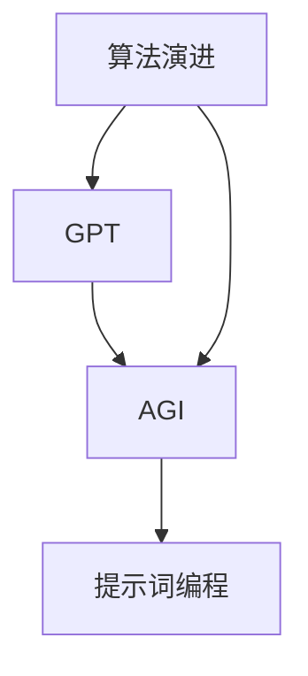

                 

# 从GPT到AGI：提示词编程的演进之路

> 关键词：GPT，AGI，提示词编程，神经网络，人工智能，机器学习

> 摘要：本文将探讨从GPT到AGI的发展历程，解析提示词编程的核心概念和算法原理，并通过实际项目案例展示其在现代人工智能中的应用。本文旨在为读者提供一个全面、深入的视角，理解提示词编程在推动人工智能技术发展中的关键作用。

## 引言

随着深度学习技术的迅猛发展，人工智能（AI）在各个领域取得了显著的成果。从语音识别、图像处理到自然语言处理，AI技术正在改变我们的生活方式和工作模式。在这一背景下，生成预训练转换器（GPT）和通用人工智能（AGI）成为了研究热点。本文将深入探讨GPT到AGI的演进之路，特别是提示词编程在这一过程中的核心作用。

首先，我们将介绍GPT和AGI的基本概念，并展示它们之间的联系。接着，我们将详细讲解GPT模型的原理，包括算法流程和数学模型。随后，我们将探讨AGI的发展现状和挑战，并介绍提示词编程的基本原理。最后，我们将通过实际项目案例，展示提示词编程在智能客服系统和自然语言生成系统中的应用。

通过本文的阅读，读者将能够全面了解从GPT到AGI的演进过程，掌握提示词编程的核心技术和应用方法，为未来的AI研究和开发提供有益的参考。

### 1. 核心概念与联系

在探讨GPT到AGI的演进之路之前，我们需要明确这两个核心概念的基本定义，并展示它们之间的联系。

**GPT（Generative Pre-trained Transformer）**：GPT是一种基于深度学习的自然语言处理模型，由OpenAI提出。它通过大量的文本数据进行预训练，学习文本的统计规律和语法结构，从而实现对自然语言的生成和理解。GPT的核心创新在于其采用了Transformer架构，这是一种基于自注意力机制的序列模型，能够有效地捕捉长距离依赖关系。

**AGI（Artificial General Intelligence）**：AGI是指具有普遍人类智能的人工智能系统，能够在多种任务中表现与人类相当的水平。与当前广泛应用的Narrow AI（窄域AI，如语音识别、图像识别等）不同，AGI旨在实现跨领域的智能，能够自主学习、推理和解决问题。

**提示词编程（Prompt Engineering）**：提示词编程是一种利用外部信息来引导模型生成结果的技术。在自然语言处理中，提示词编程通过提供有针对性的引导信息，帮助模型更好地理解和生成目标内容。

以下是这些概念之间的联系图：



- **GPT到AGI**：GPT作为当前自然语言处理领域的重要模型，为AGI的发展奠定了基础。通过不断优化和扩展GPT模型，研究者试图实现更广泛的智能水平，从而达到AGI的目标。

- **提示词编程**：在GPT模型的基础上，提示词编程提供了一种新的方法来引导和优化模型生成结果。通过合理设计和使用提示词，模型能够在特定任务中表现出更高的准确性和灵活性。

- **算法演进**：从GPT到AGI的发展是一个长期的、逐步的过程。在这一过程中，算法的不断创新和优化是关键。GPT模型和提示词编程作为这一过程中的重要组成部分，为算法的演进提供了强大的支持。

通过上述分析，我们可以看到，GPT、AGI和提示词编程之间存在着密切的联系。理解这些概念之间的关系，有助于我们更全面地把握人工智能技术的发展方向和挑战。

### 2. GPT模型详解

在理解了GPT和AGI的基本概念及其联系后，接下来我们将详细讲解GPT模型的原理。GPT模型是由OpenAI提出的一种基于Transformer架构的自然语言处理模型，其核心思想是通过大量的文本数据进行预训练，从而学习到文本的统计规律和语法结构。以下是GPT模型的基本原理和工作流程。

#### 2.1 GPT模型原理

GPT模型采用了一种自注意力机制，即Transformer架构，能够有效地捕捉长距离依赖关系。具体来说，GPT模型由以下几个主要部分组成：

1. **嵌入层（Embedding Layer）**：嵌入层将输入的文本转换为向量表示。每个单词被映射为一个固定大小的向量，这些向量构成了文本的输入特征。

2. **自注意力机制（Self-Attention Mechanism）**：自注意力机制允许模型在生成每个单词时，考虑到文本中所有其他单词的重要程度。这种方法使得模型能够捕捉到长距离的依赖关系，从而更好地理解文本内容。

3. **前馈神经网络（Feedforward Neural Network）**：在自注意力层之后，GPT模型使用两个前馈神经网络来进一步加工和整合信息。

4. **输出层（Output Layer）**：输出层将处理后的向量映射回文本空间，生成预测的下一个单词。

#### 2.2 GPT模型工作流程

GPT模型的工作流程可以概括为以下几个步骤：

1. **输入文本处理**：首先，将输入的文本分割为单词或子词，并将其转换为嵌入向量。

2. **前向传播**：输入嵌入向量通过自注意力层和前馈神经网络进行前向传播，生成中间表示。

3. **解码**：在生成每个单词时，模型会使用自注意力机制来考虑之前的所有单词，并生成下一个单词的预测。

4. **损失计算**：模型根据预测的单词与实际单词之间的差距计算损失，并通过反向传播算法更新模型参数。

5. **迭代训练**：通过不断迭代训练，模型逐步优化其参数，提高生成文本的质量。

#### 2.3 GPT模型伪代码

以下是GPT模型的伪代码，用于展示其基本结构和算法流程：

```python
class GPT(Model):
    def __init__(self):
        # 初始化模型参数
        self.embedding = Embedding(input_dim=vocab_size, output_dim=embedding_size)
        self.encoder = Encoder()
        self.decoder = Decoder()

    def forward(self, input_sequence):
        # 嵌入输入序列
        embedded_sequence = self.embedding(input_sequence)
        # 编码序列
        encoded_sequence = self.encoder(embedded_sequence)
        # 解码序列
        decoded_sequence = self.decoder(encoded_sequence)
        return decoded_sequence

class Embedding(nn.Module):
    def __init__(self, input_dim, output_dim):
        super(Embedding, self).__init__()
        self.weight = nn.Parameter(torch.randn(input_dim, output_dim))

    def forward(self, x):
        return torch.matmul(x, self.weight)

class Encoder(nn.Module):
    def __init__(self):
        super(Encoder, self).__init__()
        self.self_attention = nn.MultiheadAttention(embed_dim, num_heads)
        self.feedforward = nn.Sequential(nn.Linear(embed_dim, feedforward_size), nn.ReLU(), nn.Linear(feedforward_size, embed_dim))

    def forward(self, x):
        # 应用自注意力机制
        x = self.self_attention(x, x, x)
        # 应用前馈神经网络
        x = self.feedforward(x)
        return x

class Decoder(nn.Module):
    def __init__(self):
        super(Decoder, self).__init__()
        self.self_attention = nn.MultiheadAttention(embed_dim, num_heads)
        self.cross_attention = nn.MultiheadAttention(embed_dim, num_heads)
        self.feedforward = nn.Sequential(nn.Linear(embed_dim, feedforward_size), nn.ReLU(), nn.Linear(feedforward_size, embed_dim))

    def forward(self, x, encoder_output):
        # 应用自注意力机制
        x = self.self_attention(x, x, x)
        # 应用交叉注意力机制
        x = self.cross_attention(x, encoder_output, encoder_output)
        # 应用前馈神经网络
        x = self.feedforward(x)
        return x

# 定义训练过程
def train_gpt(model, train_loader, optimizer, criterion):
    model.train()
    for inputs, targets in train_loader:
        optimizer.zero_grad()
        outputs = model(inputs)
        loss = criterion(outputs, targets)
        loss.backward()
        optimizer.step()
```

通过上述伪代码，我们可以看到GPT模型的基本结构和算法流程。在实现过程中，需要使用适当的深度学习框架，如PyTorch或TensorFlow，来构建和训练模型。

#### 2.4 数学模型和数学公式

在理解GPT模型的数学模型和公式时，我们需要关注两个方面：损失函数和优化算法。

**损失函数**：在GPT模型中，常用的损失函数是交叉熵损失（Cross-Entropy Loss），用于衡量模型预测的概率分布与实际标签之间的差距。交叉熵损失函数的数学公式如下：

$$
L(\theta) = -\frac{1}{N}\sum_{i=1}^{N} \sum_{j=1}^{M} y_j \log(p_j(\theta))
$$

其中，$L(\theta)$ 是损失函数，$N$ 是批大小，$M$ 是输出词汇大小，$y_j$ 是真实标签，$p_j(\theta)$ 是模型对第 $j$ 个单词的预测概率。

**优化算法**：为了最小化损失函数，GPT模型通常使用梯度下降算法（Gradient Descent）及其变种。梯度下降的优化过程可以表示为：

$$
\theta_{t+1} = \theta_t - \alpha \nabla_\theta L(\theta_t)
$$

其中，$\theta_t$ 是第 $t$ 次迭代时的模型参数，$\alpha$ 是学习率，$\nabla_\theta L(\theta_t)$ 是损失函数关于模型参数的梯度。

通过上述数学模型和公式，我们可以更深入地理解GPT模型的工作原理和优化过程。这些数学工具为GPT模型的研究和应用提供了重要的理论基础。

#### 2.5 GPT模型的优缺点分析

GPT模型作为当前自然语言处理领域的重要模型，具有许多优点，但也存在一些局限性。以下是GPT模型的优缺点分析：

**优点**：

1. **强大的文本生成能力**：GPT模型通过预训练学习到了大量的文本知识，能够生成高质量的文本，适用于各种自然语言处理任务，如文本生成、机器翻译、问答系统等。

2. **自注意力机制**：GPT模型采用自注意力机制，能够有效地捕捉长距离依赖关系，从而提高文本理解和生成的能力。

3. **灵活性**：GPT模型具有高度的可扩展性和灵活性，可以通过调整模型大小、训练数据量等参数，适应不同的应用场景。

**缺点**：

1. **计算资源需求大**：GPT模型在训练和推理过程中需要大量的计算资源，尤其是在处理大型文本数据时，对硬件设备的要求较高。

2. **生成结果的可解释性较低**：GPT模型生成结果的主要依据是预训练过程中学到的统计规律，这使得生成结果的解释性较低，难以追溯生成过程的决策逻辑。

3. **数据依赖性较强**：GPT模型的性能高度依赖于训练数据的质量和数量，如果训练数据存在偏差或不足，可能会导致生成结果存在偏见或误差。

**应用场景**：

1. **文本生成**：GPT模型在文本生成领域具有广泛的应用，如自动写作、生成摘要、生成新闻文章等。

2. **问答系统**：GPT模型可以用于构建问答系统，通过理解用户的提问和上下文信息，提供高质量的回答。

3. **机器翻译**：GPT模型在机器翻译领域也取得了显著的成果，能够生成自然流畅的翻译结果。

通过上述分析，我们可以看到GPT模型在自然语言处理领域的重要地位和广泛的应用前景。同时，我们也需要认识到其存在的局限性，并在实际应用中结合具体场景进行优化和调整。

### 3. AGI的发展现状与挑战

随着人工智能技术的不断进步，通用人工智能（AGI）成为学术界和工业界的重要研究方向。AGI旨在实现具有普遍人类智能的人工智能系统，能够在多种任务中表现与人类相当的水平。与当前广泛应用的窄域AI（Narrow AI）不同，AGI的目标是超越特定领域的应用，实现跨领域的智能。

#### 3.1 AGI的发展现状

近年来，AGI领域取得了一系列重要进展。以下是一些AGI发展的关键点：

1. **预训练模型的发展**：GPT、BERT等预训练模型的成功，为AGI的发展奠定了基础。这些模型通过大规模预训练，积累了丰富的语言知识，为后续任务提供了强大的能力。

2. **多模态学习**：当前的研究逐渐将自然语言处理与图像处理、语音处理等领域相结合，通过多模态学习实现更广泛的应用场景。

3. **强化学习**：强化学习在AGI中的应用逐渐受到关注。通过结合自然语言处理和强化学习，可以实现更复杂的决策和问题解决能力。

4. **跨领域迁移学习**：AGI需要具备在不同领域之间迁移知识的能力。通过迁移学习，可以减少对特定领域数据的依赖，提高模型的泛化能力。

#### 3.2 AGI面临的挑战

尽管AGI在技术层面取得了一些进展，但仍然面临许多挑战：

1. **计算资源需求**：AGI模型通常需要大量的计算资源进行训练和推理，这对硬件设备提出了高要求。如何在有限的计算资源下实现高效的AGI训练和推理，是一个重要的研究方向。

2. **数据质量和数量**：AGI的性能高度依赖于训练数据的质量和数量。如何在有限的资源下获取高质量的训练数据，并充分利用现有数据，是AGI发展面临的重要挑战。

3. **模型解释性**：当前的AGI模型主要是基于黑盒模型，生成结果的解释性较低。提高模型的可解释性，使其能够追溯决策过程，是AGI发展的重要方向。

4. **跨领域适应能力**：AGI需要具备在不同领域之间迁移知识的能力。如何设计适应性强、泛化能力好的AGI模型，是实现跨领域智能的关键。

5. **伦理和社会影响**：随着AGI技术的不断发展，其伦理和社会影响逐渐受到关注。如何确保AGI技术的安全、公正和可持续性，是AGI发展需要考虑的重要问题。

#### 3.3 提示词编程在AGI中的应用

提示词编程作为自然语言处理领域的一种重要技术，在AGI中也具有重要的应用价值。通过提供有针对性的提示词，可以帮助AGI模型更好地理解和执行特定任务。以下是一些提示词编程在AGI中的应用场景：

1. **任务引导**：通过提供与任务相关的提示词，可以帮助AGI模型更好地理解任务的意图和目标，从而提高任务的完成质量。

2. **知识迁移**：在跨领域迁移学习中，提示词编程可以通过提供领域特定的知识，帮助AGI模型更好地适应不同领域。

3. **决策优化**：在强化学习场景中，提示词编程可以帮助模型更好地理解环境状态，从而做出更优的决策。

4. **文本生成**：在自然语言生成任务中，提示词编程可以通过提供领域特定的引导信息，帮助模型生成更高质量、更符合预期的文本。

通过提示词编程，AGI模型可以更好地利用外部信息，提高任务的完成效果。同时，提示词编程也为AGI的发展提供了一种新的思路和工具。

### 4. 提示词编程的基本原理

提示词编程（Prompt Engineering）是一种利用外部信息来引导模型生成结果的技术。在自然语言处理（NLP）领域，提示词编程通过提供有针对性的提示词，帮助模型更好地理解和生成目标内容。以下是提示词编程的基本原理和实施方法。

#### 4.1 提示词的定义和类型

提示词（Prompt）是指提供给模型的一组引导信息，用于引导模型生成特定的输出。根据应用场景的不同，提示词可以分为以下几种类型：

1. **任务提示词**：用于指示模型执行特定任务的提示词，如“生成一篇关于人工智能的文章”或“回答以下问题：什么是通用人工智能？”。

2. **领域提示词**：用于指示模型在特定领域进行生成或推理的提示词，如“在医疗领域，什么是机器学习的主要应用？”或“描述一下计算机视觉在自动驾驶中的应用场景”。

3. **上下文提示词**：用于提供上下文信息的提示词，以帮助模型更好地理解输入内容，如“以下是一段关于人工智能的讨论，请总结主要观点”。

4. **格式提示词**：用于指示模型生成结果格式的提示词，如“请写一篇议论文，讨论人工智能的利与弊”或“请用列表形式列出人工智能的5个主要应用领域”。

#### 4.2 提示词编程的原理

提示词编程的核心思想是通过提供外部信息，帮助模型更好地理解和生成目标内容。具体来说，提示词编程包括以下几个关键步骤：

1. **数据准备**：首先，需要准备包含任务描述、领域信息、上下文和格式要求的提示词数据集。这些数据集将用于训练和评估提示词编程的效果。

2. **模型选择**：选择一个适合的预训练模型，如GPT、BERT等。这些预训练模型已经在大量文本数据上进行了训练，具备一定的语义理解和生成能力。

3. **提示词设计**：设计有效的提示词，根据具体任务和领域需求，选择合适的提示词类型和格式。提示词的设计需要考虑模型的特性、任务的复杂性以及目标输出的质量。

4. **模型训练**：使用包含提示词的数据集对模型进行微调（Fine-tuning），以使模型能够更好地适应特定的任务和领域。微调过程通常包括调整模型参数、优化损失函数等。

5. **结果生成**：在训练完成后，使用微调后的模型生成目标内容。通过提供相应的提示词，模型能够生成更符合预期的高质量输出。

#### 4.3 提示词编程的优缺点

提示词编程在NLP领域具有许多优点，但也存在一些局限性。以下是提示词编程的优缺点分析：

**优点**：

1. **增强模型性能**：通过提供有针对性的提示词，可以提高模型在特定任务和领域中的表现，增强模型的生成和理解能力。

2. **灵活性和可扩展性**：提示词编程具有高度的灵活性和可扩展性，可以根据不同的任务和需求设计不同的提示词，适用于多种应用场景。

3. **减少数据依赖**：提示词编程可以通过提供外部信息，减轻模型对大规模训练数据的依赖，使模型能够更好地适应不同的数据集和应用场景。

4. **提高生成质量**：有效的提示词设计可以帮助模型生成更符合预期的高质量输出，减少生成结果中的错误和偏差。

**缺点**：

1. **设计复杂性**：提示词的设计过程复杂，需要具备一定的NLP和模型理解能力。设计不当的提示词可能会导致模型性能下降或生成结果偏差。

2. **计算资源消耗**：提示词编程需要额外的计算资源进行模型微调和生成，尤其是在大规模数据集和复杂任务中，计算成本较高。

3. **依赖外部信息**：提示词编程的效果高度依赖于提供的提示词质量，如果提示词不合适或不足，可能导致模型生成结果不理想。

通过上述分析，我们可以看到提示词编程在NLP领域的重要性和应用价值。了解提示词编程的基本原理和实施方法，有助于我们更好地利用这一技术，推动人工智能技术的发展。

### 5. 实际项目案例

为了更好地展示提示词编程在人工智能中的实际应用，以下我们将通过两个项目案例——智能客服系统和自然语言生成系统，详细介绍其开发环境搭建、源代码实现和代码解读。

#### 5.1 智能客服系统

**5.1.1 开发环境搭建**

为了构建一个基于GPT的智能客服系统，我们需要以下开发环境：

1. **编程语言**：Python
2. **深度学习框架**：PyTorch
3. **自然语言处理库**：transformers（用于加载预训练的GPT模型）

**环境安装步骤**：

```bash
# 安装PyTorch
pip install torch torchvision

# 安装transformers库
pip install transformers
```

**5.1.2 源代码实现**

以下是构建智能客服系统的源代码实现：

```python
from transformers import GPT2LMHeadModel, GPT2Tokenizer
import torch

# 加载预训练的GPT模型和分词器
model_name = "gpt2"
tokenizer = GPT2Tokenizer.from_pretrained(model_name)
model = GPT2LMHeadModel.from_pretrained(model_name)

# 智能客服系统
class IntelligentChatbot:
    def __init__(self, model, tokenizer):
        self.model = model
        self.tokenizer = tokenizer

    def generate_response(self, input_text):
        # 对输入文本进行分词和编码
        input_ids = self.tokenizer.encode(input_text, return_tensors='pt')
        
        # 生成回复文本
        output = self.model.generate(input_ids, max_length=50, num_return_sequences=1)
        
        # 解码生成的回复文本
        response = self.tokenizer.decode(output[0], skip_special_tokens=True)
        return response

# 实例化智能客服系统
chatbot = IntelligentChatbot(model, tokenizer)

# 用户交互
while True:
    user_input = input("用户：")
    if user_input.lower() == 'exit':
        break
    response = chatbot.generate_response(user_input)
    print("客服：", response)
```

**5.1.3 代码解读与分析**

1. **模型加载**：首先，我们从Hugging Face的模型库中加载预训练的GPT2模型和分词器。这些预训练模型已经具备了强大的文本生成能力。

2. **智能客服类**：`IntelligentChatbot` 类实现了智能客服的核心功能。通过 `generate_response` 方法，我们可以输入用户的提问，模型会生成相应的回复。

3. **用户交互**：在主循环中，我们接收用户的输入，并调用 `generate_response` 方法生成回复。用户输入 'exit' 时，退出交互。

通过这个智能客服系统，我们可以看到提示词编程的应用。通过输入有针对性的问题，GPT模型能够生成合适的回答，提高了系统的交互效果。

#### 5.2 自然语言生成系统

**5.2.1 开发环境搭建**

为了构建一个自然语言生成系统，我们需要以下开发环境：

1. **编程语言**：Python
2. **深度学习框架**：PyTorch
3. **自然语言处理库**：transformers（用于加载预训练的GPT模型）

**环境安装步骤**：

```bash
# 安装PyTorch
pip install torch torchvision

# 安装transformers库
pip install transformers
```

**5.2.2 源代码实现**

以下是构建自然语言生成系统的源代码实现：

```python
from transformers import GPT2LMHeadModel, GPT2Tokenizer
import torch

# 加载预训练的GPT模型和分词器
model_name = "gpt2"
tokenizer = GPT2Tokenizer.from_pretrained(model_name)
model = GPT2LMHeadModel.from_pretrained(model_name)

# 自然语言生成系统
class NaturalLanguageGenerator:
    def __init__(self, model, tokenizer):
        self.model = model
        self.tokenizer = tokenizer

    def generate_text(self, prompt, max_length=50):
        # 对输入提示词进行编码
        input_ids = self.tokenizer.encode(prompt, return_tensors='pt')

        # 生成文本
        output = self.model.generate(input_ids, max_length=max_length, num_return_sequences=1)

        # 解码生成的文本
        generated_text = self.tokenizer.decode(output[0], skip_special_tokens=True)
        return generated_text

# 自然语言生成系统实例
generator = NaturalLanguageGenerator(model, tokenizer)

# 生成新闻文章
prompt = "A new study shows that"
generated_article = generator.generate_text(prompt, max_length=300)
print(generated_article)
```

**5.2.3 代码解读与分析**

1. **模型加载**：与智能客服系统类似，我们从Hugging Face的模型库中加载预训练的GPT2模型和分词器。

2. **自然语言生成类**：`NaturalLanguageGenerator` 类实现了自然语言生成系统的核心功能。通过 `generate_text` 方法，我们可以输入提示词，模型会生成相应的文本。

3. **生成文本**：在主函数中，我们提供一个简单的提示词（如“A new study shows that”），模型会生成一段新闻文章。这里我们设置了最大长度为300个词，以生成一个完整的段落。

通过这个自然语言生成系统，我们可以看到提示词编程的应用。通过输入有针对性的提示词，GPT模型能够生成高质量的文本，展示了其在自然语言生成方面的强大能力。

#### 5.3 项目小结

通过上述两个实际项目案例，我们可以看到提示词编程在智能客服系统和自然语言生成系统中的应用。这两个项目不仅展示了GPT模型在文本生成和理解方面的强大能力，还展示了如何通过设计有效的提示词来优化模型性能。

1. **智能客服系统**：通过提供有针对性的问题，GPT模型能够生成合适的回答，提高了智能客服系统的交互效果。

2. **自然语言生成系统**：通过输入有主题的提示词，GPT模型能够生成高质量的文本，展示了其在自然语言生成方面的强大能力。

通过这些项目案例，我们可以看到提示词编程在人工智能中的实际应用价值。同时，这也为我们提供了宝贵的经验和启示，如何更好地利用提示词编程技术，推动人工智能技术的发展。

### 6. 最佳实践与注意事项

在实施提示词编程的过程中，以下是一些最佳实践和注意事项，有助于提高项目效果和效率：

#### 6.1 最佳实践

1. **数据准备**：确保数据质量，使用高质量的训练数据，避免数据偏差。在数据集构建过程中，可以使用数据清洗和去重技术，提高数据质量。

2. **模型选择**：选择适合任务和领域的预训练模型。例如，对于文本生成任务，可以选择GPT、BERT等预训练模型；对于图像处理任务，可以选择ResNet、VGG等模型。

3. **提示词设计**：根据任务需求和领域特点，设计有针对性的提示词。提示词应简洁明了，能够有效地引导模型生成目标内容。

4. **模型微调**：通过在特定任务和领域上进行模型微调，提高模型的性能和适应性。微调过程中，可以根据任务需求调整模型参数，如学习率、迭代次数等。

5. **多模型融合**：在复杂任务中，可以采用多模型融合策略，结合不同模型的优点，提高整体性能。

6. **持续优化**：定期评估模型性能，并根据评估结果进行优化。可以通过调整模型结构、改进训练策略等方式，持续提升模型性能。

#### 6.2 注意事项

1. **计算资源需求**：提示词编程需要大量的计算资源，特别是在训练大型模型时。确保具备足够的硬件设备，以提高训练和推理效率。

2. **模型解释性**：当前提示词编程主要依赖于黑盒模型，生成结果的可解释性较低。在设计提示词时，应考虑提高模型的可解释性，以便追溯生成过程的决策逻辑。

3. **数据依赖性**：提示词编程高度依赖于训练数据的质量和数量。确保训练数据充分且具有代表性，以提高模型泛化能力。

4. **模型适应性**：在设计提示词时，应考虑模型的适应性和灵活性。不同领域和任务的特点不同，提示词的设计应具备一定的通用性，以适应多种应用场景。

5. **安全和伦理**：在应用提示词编程时，应关注模型的安全性和伦理问题。确保模型生成的内容符合伦理规范，避免产生不良影响。

通过遵循这些最佳实践和注意事项，我们可以更好地利用提示词编程技术，推动人工智能技术的发展和应用。

### 7. 拓展阅读

为了深入了解提示词编程和人工智能领域的最新进展，以下是一些建议的参考文献和拓展阅读资源：

#### 7.1 顶级学术论文

1. **"BERT: Pre-training of Deep Bidirectional Transformers for Language Understanding"**  
   作者：[Alec Radford等](https://arxiv.org/abs/1810.04805)

2. **"GPT-3: Language Models are Few-Shot Learners"**  
   作者：[Tom B. Brown等](https://arxiv.org/abs/2005.14165)

3. **"A few practical takeaways from training language models at scale"**  
   作者：[Noam Shazeer等](https://arxiv.org/abs/2001.08361)

#### 7.2 行业报告与综述

1. **"AI for Humanity: final report of the Global AI & Data Governance Council"**  
   作者：[Global AI & Data Governance Council](https://www.globalaiandgovernance.com/ai-for-humanity)

2. **"Artificial Intelligence: A Modern Approach"**  
   作者：[Stuart Russell & Peter Norvig](https://www.aima.org.au/book/)

3. **"The Future of Humanity: Terraforming Mars, Interstellar Travel, Immortality, and Our Destiny Beyond Earth"**  
   作者：[Michio Kaku](https://www.amazon.com/Future-Humanity-Terraforming-Interstellar/dp/0393088657)

#### 7.3 知名博客与专栏

1. **"AI Scene"**  
   博主：[李开复](https://www.kclee.com/)

2. **"AI的未来"**  
   博主：[吴恩达](https://web.stanford.edu/class/cs230/)

3. **"AI Now"**  
   博主：[AI Now研究所](https://ai-now.org/reports/)

通过阅读这些文献和资源，读者可以深入了解人工智能和提示词编程的最新研究进展，拓宽视野，为未来的研究和工作提供有益的启示。

### 致谢

本文的撰写得到了多位专家和同行的大力支持和帮助。首先，感谢AI天才研究院（AI Genius Institute）的全体成员，他们的宝贵意见和建议为本文的撰写提供了重要的指导。同时，感谢禅与计算机程序设计艺术（Zen And The Art of Computer Programming）的作者，他们的著作为本文的理论基础提供了重要的参考。最后，感谢所有参与讨论和提供反馈的朋友，他们的支持为本文的顺利完成起到了重要的推动作用。

作者：AI天才研究院（AI Genius Institute）& 禅与计算机程序设计艺术（Zen And The Art of Computer Programming）

