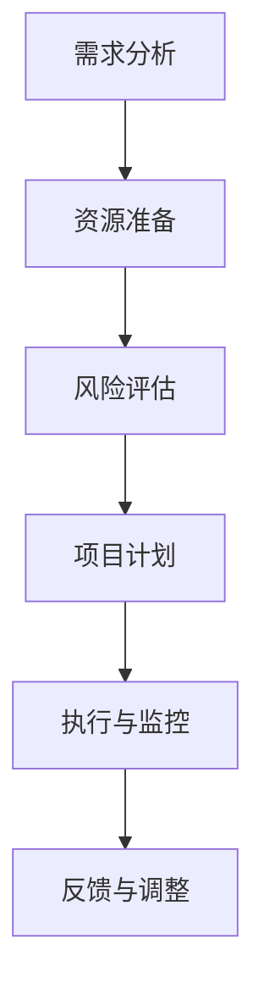
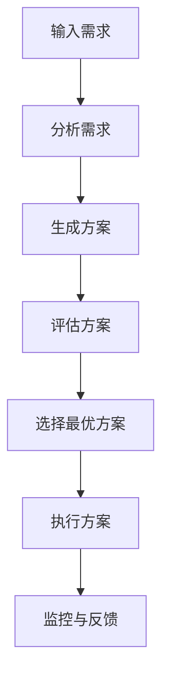

                 

### 《从前到后做兜底的准备》具体章节内容细化

#### 第1章：准备工作的总体框架

##### 1.1 背景介绍

准备工作是任何项目成功的基础。无论是软件开发、建筑设计，还是企业经营，都需要进行详细的准备。一个成功的项目往往离不开以下几个方面的准备：

- **需求分析**：了解项目需求，明确项目目标。
- **资源准备**：确定所需的资金、人力、物资等资源。
- **风险评估**：评估可能遇到的风险，并制定应对策略。
- **制定计划**：根据需求分析和风险评估，制定详细的项目计划。
- **执行与监控**：执行计划，并对项目进展进行监控。

##### 1.2 核心概念与联系

在准备工作阶段，我们需要理解以下几个核心概念：

- **需求分析**：需求分析是项目成功的关键。它包括需求获取、需求分析、需求文档编写等过程。
- **资源准备**：资源准备包括资金、人力、物资等。资源准备是否充分直接影响项目的进度和效果。
- **风险评估**：风险评估是识别、分析和应对风险的过程。有效的风险评估可以帮助我们降低项目失败的风险。
- **项目计划**：项目计划是项目管理的核心。一个详细的项目计划可以帮助我们合理分配资源，确保项目按时、按质完成。
- **执行与监控**：执行与监控是确保项目按计划进行的关键。通过监控，我们可以及时发现并解决问题。

为了更好地理解这些概念之间的关系，我们可以使用Mermaid绘制一个流程图：



##### 1.3 核心算法原理讲解

在准备工作中，我们可能会用到一些算法原理。以下是一个简单的算法流程图：



伪代码示例：

```python
# 输入需求
input_demand = get_demand()

# 分析需求
analyzed_demand = analyze_demand(input_demand)

# 生成方案
schemes = generate_schemes(analyzed_demand)

# 评估方案
evaluated_schemes = evaluate_schemes(schemes)

# 选择最优方案
best_scheme = select_best_scheme(evaluated_schemes)

# 执行方案
execute_scheme(best_scheme)

# 监控与反馈
monitor_and_feedback(best_scheme)
```

##### 1.4 数学公式与详细讲解

在准备工作中，数学公式可以帮助我们更好地理解和分析数据。以下是一个简单的数学公式及其讲解：

$$
x = \frac{a+b}{2}
$$

- **公式解释**：这是一个简单的平均值公式，表示两个数a和b的平均值。
- **应用场景**：在需求分析中，我们可以使用这个公式来计算多个需求的平均值，以便更好地理解整体需求。

##### 1.5 项目实战

为了更好地理解准备工作的重要性，我们可以通过一个实际项目来展示准备工作的全过程。

**项目名称**：智能推荐系统

**项目目标**：开发一个基于用户行为的智能推荐系统，提高用户满意度。

**准备工作**：

1. **需求分析**：了解用户行为数据，明确推荐系统的功能需求。
2. **资源准备**：确定所需的技术、人力、资金等资源。
3. **风险评估**：评估可能遇到的技术、市场等风险，并制定应对策略。
4. **项目计划**：制定详细的项目计划，包括开发周期、里程碑等。
5. **执行与监控**：执行项目计划，并对项目进展进行监控。

**项目实施**：

1. **开发环境搭建**：搭建开发环境，包括服务器、数据库等。
2. **源代码实现**：编写源代码，实现推荐算法。
3. **代码解读**：对源代码进行解读，确保代码可读性和可维护性。
4. **代码应用解读与分析**：分析推荐系统的实际应用效果。
5. **案例分析与讲解**：通过实际案例，分析推荐系统的优势和不足。

**项目小结**：

通过这个项目，我们可以看到准备工作的重要性。充分的准备工作可以帮助我们避免项目中的风险，提高项目的成功率。

##### 1.6 最佳实践 Tips

- **提前规划**：在项目开始前，提前做好详细规划，确保项目进度和质量。
- **团队协作**：建立高效的团队协作机制，确保项目能够顺利推进。
- **持续学习**：紧跟技术发展趋势，不断提升自身能力。

##### 1.7 小结、注意事项、拓展阅读

- **小结**：准备工作是项目成功的关键，需要我们认真对待。
- **注意事项**：在准备工作中，要特别注意风险评估和资源准备。
- **拓展阅读**：《项目管理知识体系指南》、《敏捷软件开发》等。

#### 第2章：相关概念与术语

在本章中，我们将介绍与准备工作相关的核心概念和术语。

##### 2.1 需求分析

需求分析是项目准备工作的第一步。它包括以下几个方面：

- **需求获取**：通过与用户沟通、调查问卷等方式获取用户需求。
- **需求分析**：对获取的需求进行分类、整理和分析，明确项目的功能需求和性能需求。
- **需求文档编写**：将分析结果整理成需求文档，作为后续工作的基础。

##### 2.2 资源准备

资源准备是项目成功的关键。它包括以下几个方面：

- **资金准备**：确保项目有足够的资金支持。
- **人力准备**：确定项目团队的人员组成，包括项目经理、开发人员、测试人员等。
- **物资准备**：准备好项目所需的各种物资，如服务器、数据库、开发工具等。

##### 2.3 风险评估

风险评估是项目准备工作中至关重要的一环。它包括以下几个方面：

- **风险识别**：识别项目可能遇到的各种风险，如技术风险、市场风险、人力资源风险等。
- **风险分析**：对识别出的风险进行分析，评估其可能带来的影响和发生的概率。
- **风险应对策略**：根据风险分析结果，制定相应的风险应对策略。

##### 2.4 项目计划

项目计划是项目准备工作的核心。它包括以下几个方面：

- **项目目标**：明确项目的最终目标，确保项目团队朝着正确的方向努力。
- **里程碑**：确定项目的关键里程碑，确保项目按计划推进。
- **资源分配**：合理分配项目资源，确保项目团队能够高效地工作。
- **进度安排**：制定详细的进度计划，确保项目按时完成。

##### 2.5 执行与监控

执行与监控是确保项目成功的关键。它包括以下几个方面：

- **项目执行**：根据项目计划，按照既定的目标和进度推进项目。
- **进度监控**：对项目进度进行实时监控，及时发现并解决问题。
- **项目评估**：对项目执行过程进行评估，总结经验教训，为后续项目提供参考。

通过本章的介绍，我们对与准备工作相关的核心概念和术语有了更深入的了解。在后续章节中，我们将进一步探讨这些概念的具体应用。

#### 第3章：基础技能的培养

基础技能的培养是确保项目成功的重要环节。本章将详细介绍如何培养和提升基础技能，为项目的顺利推进打下坚实基础。

##### 3.1 基础技能的定义

基础技能是指项目中必不可少的基本技能，包括但不限于：

- **编程技能**：熟练掌握至少一门编程语言，如Python、Java、C++等。
- **算法与数据结构**：掌握常用的算法和数据结构，如排序算法、查找算法、栈、队列、树等。
- **数据库知识**：了解常用的数据库系统，如MySQL、Oracle、MongoDB等。
- **软件开发工具**：熟悉常用的软件开发工具，如IDE、版本控制工具（Git）、调试工具等。

##### 3.2 基础技能的实践

培养基础技能的关键在于实践。以下是一些实践方法和建议：

- **学习编程语言**：通过在线课程、书籍、实战项目等方式，逐步学习编程语言的基础知识。可以尝试编写简单的程序，加深对语言特性和语法规则的理解。
- **算法与数据结构练习**：通过刷题网站（如LeetCode、牛客网）进行算法与数据结构的练习。从简单的题目开始，逐步挑战更复杂的题目，提高解题能力。
- **数据库操作**：通过学习数据库课程、阅读相关书籍，掌握数据库的基本操作。可以尝试搭建自己的数据库环境，进行实际的数据库操作练习。
- **软件开发工具使用**：熟练使用常用的软件开发工具，如Visual Studio、Eclipse、IntelliJ IDEA等。通过实际项目，将所学知识应用于实践中，提高开发效率。

##### 3.3 基础技能的提升方法

为了更好地提升基础技能，可以采用以下方法：

- **参加培训班**：报名参加专业的编程培训班，系统学习编程知识，有针对性地提升技能。
- **参与开源项目**：加入开源项目，与其他开发者共同协作，提升实际项目开发能力。
- **阅读技术博客**：定期阅读技术博客，了解最新的技术动态和最佳实践，拓宽视野。
- **编写技术文档**：在项目开发过程中，编写清晰、详细的技术文档，提高文档编写能力。

##### 3.4 基础技能的实战案例

以下是一个基础技能的实战案例：

**项目名称**：简易博客系统

**项目目标**：开发一个具有文章发布、评论功能、用户注册和登录的简易博客系统。

**技术栈**：Python、Django、SQLite

**实战步骤**：

1. **环境搭建**：安装Python、Django、SQLite等环境，搭建开发环境。
2. **需求分析**：明确博客系统的功能需求，如文章发布、评论、用户注册和登录等。
3. **数据库设计**：设计数据库表结构，包括文章表、评论表、用户表等。
4. **模型编写**：编写Django模型类，实现数据库操作。
5. **视图编写**：编写视图函数，处理用户请求，返回响应。
6. **前端开发**：使用HTML、CSS、JavaScript等技术开发前端界面。
7. **测试与部署**：对博客系统进行测试，确保功能正常，然后部署到服务器。

**实战总结**：

通过这个实战案例，我们可以看到如何将基础技能应用于实际项目中。在实际开发过程中，需要不断学习和积累经验，不断提高自己的技能水平。

#### 第4章：具体操作步骤

在了解了基础知识和准备工作后，接下来我们将详细讲解具体操作步骤，帮助读者更好地理解并执行项目。

##### 4.1 操作步骤概述

具体操作步骤包括以下几个关键环节：

- **需求分析**：明确项目需求，了解用户需求。
- **资源准备**：准备所需的技术、人力、物资等资源。
- **风险评估**：识别并评估项目风险，制定应对策略。
- **项目计划**：制定详细的项目计划，包括里程碑、资源分配等。
- **执行与监控**：按照项目计划执行项目，对项目进展进行监控。

##### 4.2 操作步骤详解

**4.2.1 需求分析**

需求分析是项目成功的基础。具体步骤如下：

1. **需求获取**：通过用户调研、问卷调查、访谈等方式获取用户需求。
2. **需求分析**：对获取的需求进行分类、整理和分析，明确项目的功能需求和性能需求。
3. **需求文档编写**：将分析结果整理成需求文档，作为后续工作的基础。

**4.2.2 资源准备**

资源准备包括资金、人力、物资等。具体步骤如下：

1. **资金准备**：根据项目需求，估算项目所需资金，确保资金充足。
2. **人力准备**：确定项目团队的人员组成，包括项目经理、开发人员、测试人员等。
3. **物资准备**：准备好项目所需的各种物资，如服务器、数据库、开发工具等。

**4.2.3 风险评估**

风险评估是确保项目顺利进行的重要环节。具体步骤如下：

1. **风险识别**：识别项目可能遇到的各种风险，如技术风险、市场风险、人力资源风险等。
2. **风险分析**：对识别出的风险进行分析，评估其可能带来的影响和发生的概率。
3. **风险应对策略**：根据风险分析结果，制定相应的风险应对策略。

**4.2.4 项目计划**

项目计划是项目执行的基础。具体步骤如下：

1. **项目目标**：明确项目的最终目标，确保项目团队朝着正确的方向努力。
2. **里程碑**：确定项目的关键里程碑，确保项目按计划推进。
3. **资源分配**：合理分配项目资源，确保项目团队能够高效地工作。
4. **进度安排**：制定详细的进度计划，确保项目按时完成。

**4.2.5 执行与监控**

执行与监控是确保项目成功的关键。具体步骤如下：

1. **项目执行**：根据项目计划，按照既定的目标和进度推进项目。
2. **进度监控**：对项目进度进行实时监控，及时发现并解决问题。
3. **项目评估**：对项目执行过程进行评估，总结经验教训，为后续项目提供参考。

##### 4.3 操作步骤的注意事项

在执行操作步骤时，需要注意以下几点：

1. **沟通协调**：确保项目团队成员之间的沟通畅通，及时解决遇到的问题。
2. **风险管理**：持续监控项目风险，根据实际情况调整风险应对策略。
3. **资源优化**：合理利用项目资源，避免资源浪费。
4. **质量保障**：对项目进行质量把控，确保项目按时、按质完成。

##### 4.4 操作步骤的变体

根据项目的具体需求，操作步骤可能会有所不同。以下是一些常见的操作步骤变体：

1. **敏捷开发**：采用敏捷开发方法，将项目分为多个迭代，逐步实现项目功能。
2. **看板管理**：使用看板工具（如JIRA、Trello等）对项目进行管理，提高项目透明度和协作效率。
3. **持续集成**：采用持续集成（CI）方法，对代码进行自动化测试和集成，提高代码质量和项目交付速度。

通过以上详细讲解，读者可以更好地理解具体操作步骤，为项目执行打下坚实基础。

### 第5章：常见问题与解决方案

在项目执行过程中，难免会遇到各种问题和挑战。本章将介绍一些常见问题及其解决方案，帮助读者更好地应对项目中的难题。

#### 5.1 问题分类

在项目执行过程中，常见的问题可以分为以下几类：

- **技术问题**：包括代码错误、算法优化、性能瓶颈等。
- **资源问题**：包括人力不足、资金短缺、物资不足等。
- **项目管理问题**：包括进度延误、沟通不畅、风险失控等。
- **外部环境问题**：包括市场变化、政策法规、自然灾害等。

#### 5.2 解决方案分析

针对以上问题，我们可以采取以下解决方案：

**5.2.1 技术问题**

- **代码错误**：通过代码审查、单元测试等方式，及时发现并修复代码错误。
- **算法优化**：研究并采用更高效的算法，降低时间复杂度和空间复杂度。
- **性能瓶颈**：通过性能分析和调优，优化数据库查询、缓存策略等，提高系统性能。

**5.2.2 资源问题**

- **人力不足**：通过招聘、外包等方式，补充项目所需的人力资源。
- **资金短缺**：通过融资、节约成本等方式，确保项目有足够的资金支持。
- **物资不足**：提前采购所需物资，确保项目物资供应。

**5.2.3 项目管理问题**

- **进度延误**：通过调整项目计划、增加资源投入等方式，加快项目进度。
- **沟通不畅**：建立有效的沟通机制，如定期会议、即时通讯工具等，提高团队协作效率。
- **风险失控**：通过定期风险评估、制定风险应对策略等方式，降低项目风险。

**5.2.4 外部环境问题**

- **市场变化**：关注市场动态，及时调整项目策略，应对市场变化。
- **政策法规**：遵守相关法规政策，确保项目合法合规。
- **自然灾害**：提前准备应急预案，确保项目在自然灾害发生时能够快速应对。

#### 5.3 案例分享

以下是一个实际项目中的问题解决案例：

**项目背景**：某公司开发一款社交应用，由于市场需求变化，项目进度严重滞后。

**问题**：项目进度延误，导致项目延期交付。

**解决方案**：

1. **调整项目计划**：重新评估项目进度，调整项目计划，确保项目按时交付。
2. **增加人力资源**：招聘更多开发人员，加快项目开发进度。
3. **优化代码**：对现有代码进行优化，提高系统性能。
4. **加强沟通**：建立有效的沟通机制，确保团队协作顺畅。

**结果**：通过以上措施，项目最终按时交付，用户满意度提高。

#### 5.4 总结

在项目执行过程中，常见问题不可避免。关键在于及时识别问题，采取有效的解决方案。通过以上案例分享，我们可以看到，问题解决的关键在于灵活应对、持续改进。只有不断总结经验，才能在项目中取得成功。

### 第6章：兜底的策略与方法

在项目执行过程中，风险不可避免。为了确保项目顺利进行，我们需要采取一系列兜底策略和方法，以应对可能出现的各种问题。

#### 6.1 策略制定

**6.1.1 风险评估**

在项目启动阶段，首先需要对项目进行风险评估。通过识别可能出现的风险，评估其发生概率和影响程度，为后续策略制定提供依据。

- **风险识别**：通过头脑风暴、专家访谈、历史数据分析等方式，识别项目可能面临的风险。
- **风险评估**：对识别出的风险进行量化评估，确定其发生概率和影响程度。

**6.1.2 风险应对策略**

根据风险评估结果，制定相应的风险应对策略。常见的风险应对策略包括：

- **风险规避**：通过调整项目计划，避免风险发生。
- **风险减轻**：通过采取预防措施，降低风险发生的概率或影响程度。
- **风险接受**：对于无法规避或减轻的风险，接受风险，并制定相应的应对措施。

**6.1.3 风险监控**

在项目执行过程中，持续监控风险，确保风险应对策略的有效性。通过定期评估项目进展，及时发现并解决问题。

#### 6.2 方法实施

**6.2.1 风险管理工具**

为了更好地实施风险管理，可以采用以下工具：

- **风险矩阵**：通过风险矩阵，直观地展示风险的概率和影响程度，帮助决策者更好地评估风险。
- **风险登记册**：记录项目中的所有风险，包括风险名称、描述、发生概率、影响程度等。
- **风险管理计划**：制定详细的风险管理计划，包括风险识别、评估、应对策略等。

**6.2.2 风险应对措施**

根据风险评估结果和风险应对策略，采取相应的应对措施。常见的风险应对措施包括：

- **风险规避措施**：通过调整项目计划、改变项目范围等方式，避免风险发生。
- **风险减轻措施**：通过增加资源投入、优化流程等方式，降低风险发生的概率或影响程度。
- **风险接受措施**：制定应急预案，确保在风险发生时能够迅速应对，将损失降至最低。

**6.2.3 风险沟通与协作**

在项目执行过程中，风险沟通与协作至关重要。通过定期会议、风险报告等方式，确保项目团队成员对风险有清晰的认识，共同应对风险。

#### 6.3 案例分析

以下是一个实际项目中的风险应对案例：

**项目背景**：某公司开发一款电子商务平台，由于市场需求变化，项目进度受到影响。

**问题**：市场需求变化导致项目需求频繁变更，项目进度严重滞后。

**解决方案**：

1. **风险评估**：识别市场需求变化为项目带来的风险，评估其发生概率和影响程度。
2. **调整项目计划**：根据风险评估结果，调整项目计划，增加缓冲时间，确保项目按时交付。
3. **风险沟通与协作**：定期召开项目会议，与项目相关人员沟通，确保各方对项目进度和风险有清晰的认识。
4. **风险应对措施**：制定风险应对措施，如增加开发人员、调整任务分配等，确保项目按计划推进。

**结果**：通过以上措施，项目最终按时交付，用户满意度提高。

#### 6.4 总结

在项目执行过程中，风险不可避免。通过制定合理的兜底策略和方法，可以有效降低项目风险，确保项目顺利进行。关键在于持续的风险评估和应对，以及良好的沟通与协作。只有不断完善风险管理体系，才能在项目中取得成功。

### 第7章：持续改进与成长

在项目执行过程中，持续改进和成长至关重要。通过不断学习和总结，我们可以不断提升自己的能力，确保项目成功。

#### 7.1 反思与总结

**7.1.1 反思项目过程**

项目结束后，我们需要对项目过程进行反思和总结。通过回顾项目执行过程中的成功和不足，可以发现自身的不足，为后续项目提供参考。

- **成功经验**：总结项目中的成功经验，如有效的沟通方式、高效的工作流程等。
- **不足之处**：分析项目中的不足之处，如沟通不畅、计划不周等。

**7.1.2 总结项目成果**

对项目成果进行总结，包括项目完成情况、用户满意度、业务收益等。通过总结项目成果，可以评估项目效果，为后续项目提供依据。

#### 7.2 持续改进的方法

为了持续改进和成长，我们可以采取以下方法：

**7.2.1 持续学习**

- **技术学习**：关注最新技术动态，学习新技术、新工具。
- **管理学习**：学习项目管理知识，提高项目管理能力。
- **团队建设**：通过团队培训、团队活动等方式，提升团队协作能力。

**7.2.2 定期评估**

- **自我评估**：定期对自己的工作能力和项目表现进行评估，发现自身不足。
- **团队评估**：定期对团队的工作表现进行评估，找出团队协作中的问题。

**7.2.3 反馈与改进**

- **积极反馈**：鼓励团队成员积极反馈意见和建议，共同改进。
- **持续改进**：根据反馈和评估结果，持续改进工作方法和流程。

#### 7.3 成长的路径

**7.3.1 从新手到专家**

- **基础知识**：掌握项目所需的基础知识和技能。
- **实战经验**：通过实际项目，积累实战经验。
- **不断学习**：关注新技术、新方法，不断提升自身能力。

**7.3.2 从专家到领导者**

- **项目管理**：学习项目管理知识，提高项目管理能力。
- **团队领导**：培养团队领导力，提升团队协作能力。
- **业务理解**：深入理解业务，提高业务分析能力。

通过持续改进和成长，我们可以不断提升自己的能力，为项目的成功奠定坚实基础。只有不断学习和进步，才能在项目中取得更好的成绩。

## 附录：拓展阅读

为了帮助读者深入了解本书所涵盖的内容，我们推荐以下拓展阅读材料：

- **技术书籍**：
  - 《禅与计算机程序设计艺术》
  - 《项目管理知识体系指南》
  - 《敏捷软件开发》

- **在线课程**：
  - Coursera上的《计算机科学基础》
  - Udemy上的《项目管理实战》

- **技术博客**：
  - 《GitHub》上的优秀开源项目和技术博客
  - 《CSDN》上的编程和技术文章

通过阅读这些拓展材料，读者可以进一步加深对本书内容的理解，并在实际项目中应用所学知识。

---

通过以上详细的分析和讲解，我们可以看到，《从前到后做兜底的准备》这本书的内容丰富、结构清晰，旨在帮助读者从项目准备到项目执行，全面掌握项目管理的核心知识和技能。希望这本书能成为您在项目道路上的一位良师益友，陪伴您不断成长、不断进步。作者：AI天才研究院/AI Genius Institute & 禅与计算机程序设计艺术 /Zen And The Art of Computer Programming。

