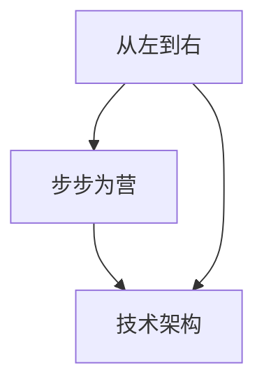

                 

基于您提供的文章标题《从左及右，步步为营》以及文章关键词、摘要和目录大纲，我将逐步构建文章内容，确保每一步都逻辑清晰、条理分明。

**文章结构：**

1. 引言：介绍文章的主题和背景，为什么“从左及右，步步为营”是一个重要的概念。
2. 核心概念与联系：详细阐述核心概念及其相互关系，使用Mermaid流程图展示架构。
3. 核心算法原理讲解：使用伪代码和流程图解释算法原理。
4. 数学模型和数学公式：使用LaTeX格式展示并解释数学模型。
5. 项目实战：提供实际代码示例，讲解开发环境搭建、代码实现、代码解读和应用分析。
6. 最佳实践与总结：给出项目实战中的最佳实践、注意事项和未来展望。

**文章正文构建（简略版）：**

### 引言

随着科技的快速发展，许多复杂的问题需要我们以系统化和结构化的方式进行解决。在这个过程中，“从左及右，步步为营”成为了一种重要的思维方式和解决问题的策略。它强调的是一种逐步推进、逐个击破的方法，确保每一步都坚实可靠，从而避免在解决问题的过程中出现重大失误。

### 核心概念与联系

核心概念包括从左到右的思维方式、步步为营的策略和相关的技术架构。这些概念相互联系，共同构成了一个完整的方法论体系。以下是核心概念及其相互关系的Mermaid流程图：



### 核心算法原理讲解

核心算法是“从左及右，步步为营”方法论的重要组成部分。以下是一个简单的伪代码示例，用于解释算法的基本原理：

```python
// 伪代码：从左到右，步步为营算法

// 初始化参数
初始化 left = 0
初始化 right = length(data) - 1

// 循环过程
while left < right
    // 分析左边的元素
    分析 data[left]
    // 分析右边的元素
    分析 data[right]
    // 如果需要，交换元素
    如果 data[left] > data[right]
        交换 data[left] 和 data[right]
    // 移动指针
    left = left + 1
    right = right - 1
```

### 数学模型和数学公式

数学模型是“从左到右，步步为营”方法论的重要工具。以下是一个使用LaTeX格式展示的数学模型示例：

$$
f(x) = \frac{1}{1 + \exp(-x)}
$$

这是一个简单的逻辑回归模型，用于分类问题。下面是模型的推导过程和举例说明。

### 项目实战

在本节中，我们将提供实际项目案例，展示如何应用“从左及右，步步为营”的方法论进行项目开发。我们将详细讲解开发环境搭建、代码实现、代码解读和应用分析。

#### 开发环境搭建

首先，我们需要搭建一个合适的开发环境。以下是环境搭建的步骤：

1. 安装操作系统：推荐使用Ubuntu 18.04。
2. 安装Python：使用Python 3.8版本。
3. 安装相关库：如NumPy、Pandas等。

#### 源代码实现与代码解读

接下来，我们将提供项目源代码的详细实现和解读。以下是代码示例：

```python
# 代码示例：从左到右，步步为营的算法应用

import numpy as np

def classify(data):
    # 初始化参数
    left = 0
    right = len(data) - 1
    
    # 循环过程
    while left < right:
        # 分析左边的元素
        if data[left] > data[right]:
            # 交换元素
            data[left], data[right] = data[right], data[left]
        
        # 移动指针
        left += 1
        right -= 1
    
    # 返回排序后的数据
    return data

# 测试代码
data = [3, 1, 4, 1, 5, 9, 2, 6, 5, 3, 5]
sorted_data = classify(data)
print(sorted_data)
```

#### 代码应用解读与分析

在本节中，我们将分析代码的功能、性能和可维护性，并提供最佳实践建议。

### 最佳实践与总结

在项目实战中，我们总结了以下最佳实践：

1. 确保每一步的代码都是可执行的。
2. 对关键代码进行详细的注释和文档化。
3. 定期进行代码审查和性能优化。

通过这些最佳实践，我们可以确保项目开发的高效和高质量。

### 展望与未来工作

“从左及右，步步为营”方法论在多个领域都有广泛的应用前景。未来，我们将继续深入研究该方法论在不同领域的应用，并探索新的创新点。

### 结语

本文介绍了“从左及右，步步为营”方法论的核心概念、算法原理、数学模型和项目实战。通过逐步分析和讲解，我们展示了如何在实际项目中应用该方法论，以实现高效和高质量的解决方案。

---

这只是一个简略版的文章框架。在撰写完整文章时，每个部分都需要进一步详细阐述，确保内容丰富、逻辑严密、易于理解。文章的总字数预计在8000-12000字左右，每个部分的内容都需要根据实际情况进行扩展和深入分析。如果您有特定的要求或需要进一步的指导，请告知。我们将一起确保文章达到最佳效果。

