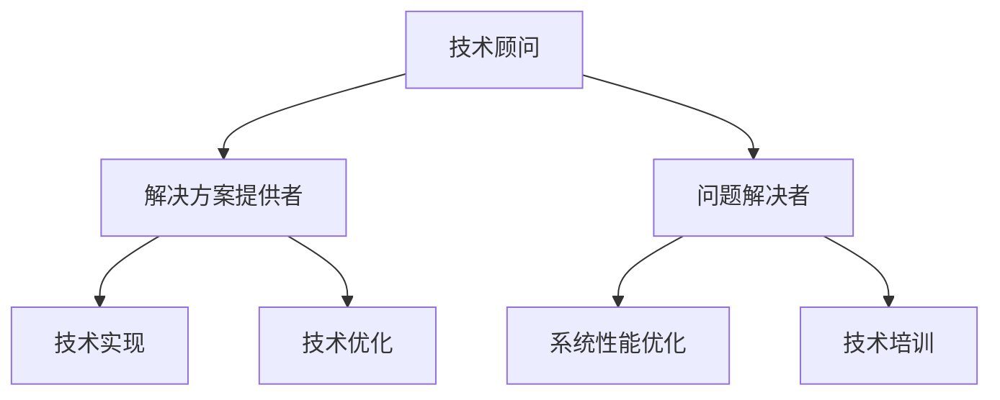
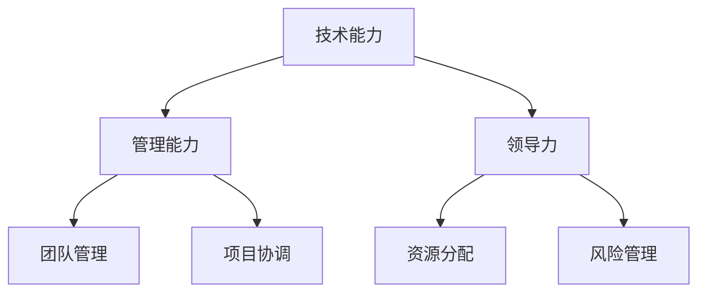
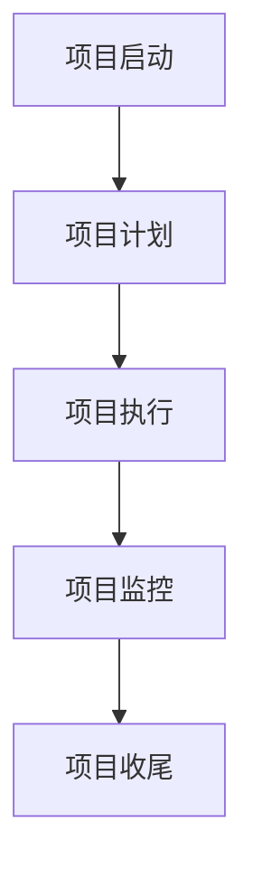
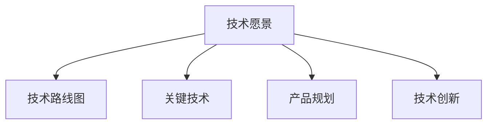
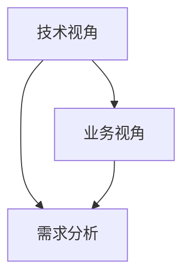

                 

## 从技术专家到团队领袖的蜕变

在技术行业，从技术专家到团队领袖的转变是一个备受关注且极具挑战性的过程。技术专家通常以其深厚的技术知识和卓越的编程能力而闻名，他们能够解决复杂的编程问题，优化系统性能，并在技术上提供卓越的解决方案。然而，随着职业的发展，许多技术专家开始寻求更多的责任和影响力，希望从幕后走向台前，成为能够引领团队、推动项目成功的团队领袖。

### 关键词

- 技术专家
- 团队领袖
- 职业发展
- 领导力
- 项目管理
- 团队协作
- 技术愿景
- 战略规划

### 摘要

本文将探讨从技术专家到团队领袖的转变过程，包括技术专家的角色与职责、领导力与团队管理、项目管理与执行、决策与战略规划、人才管理与培养、技术领导力以及跨界领导：技术与业务的融合。通过这些章节的详细阐述，希望为那些希望在技术领域进一步发展的专业人士提供实用的指导和建议。

### 1. 技术专家的成长之路

#### 1.1 技术专家的角色与职责

技术专家在企业中通常扮演着技术顾问、解决方案提供者和问题解决者的角色。他们负责深入理解复杂的业务需求，设计并实现高效的系统解决方案，优化现有系统的性能，并确保技术方案的可行性和可维护性。技术专家的职责不仅包括技术实现，还涉及技术趋势的跟踪、技术的创新应用以及团队的技术培训。

**核心概念与联系**

以下是一个Mermaid流程图，展示了技术专家的主要职责：



#### 1.2 技术专家的技能树

技术专家的技能树需要不断地扩展和更新，以适应快速变化的技术环境。一个成熟的技术专家不仅需要具备扎实的技术基础，还应该具备以下方面的技能：

- **编程能力**：熟练掌握多种编程语言，如Java、Python、C++等。
- **系统架构**：能够设计和优化大型系统架构，了解分布式系统的原理。
- **数据库管理**：熟练使用关系型数据库（如MySQL、PostgreSQL）和非关系型数据库（如MongoDB、Cassandra）。
- **云计算**：熟悉AWS、Azure、Google Cloud等云服务平台。
- **容器化与微服务**：掌握Docker、Kubernetes等容器化技术。
- **人工智能与大数据**：了解机器学习算法、大数据处理框架（如Hadoop、Spark）。

**核心算法原理讲解**

以下是一个用于实现基本机器学习算法的伪代码示例：

```python
def machine_learning_algorithm(data):
    # 数据预处理
    preprocessed_data = preprocess_data(data)

    # 特征提取
    features = extract_features(preprocessed_data)

    # 训练模型
    model = train_model(features)

    # 预测
    predictions = predict(model, new_data)

    return predictions
```

#### 1.3 从技术到管理：身份的转变

当技术专家开始思考管理角色的转变时，他们必须意识到这一转变不仅仅是技术能力的提升，更是管理能力和领导力的提升。技术管理者的职责不仅包括技术指导，还包括团队管理、项目协调、资源分配和风险管理。

**核心概念与联系**

以下是一个Mermaid流程图，展示了技术专家向管理者转变的关键因素：



### 2. 领导力与团队管理

#### 2.1 领导力的基础理论

领导力是一种能力，它能够激励和引导团队实现共同的目标。领导力不同于管理，它更侧重于激发团队的潜力和创造力。以下是领导力的一些核心理论：

- **情境领导理论**：领导者的行为应根据团队成员的能力和需求进行调整。
- **变革型领导理论**：领导者的目标是通过变革实现更高的目标和成就。
- **服务型领导理论**：领导者将团队成员的需求放在首位，通过服务团队来推动组织发展。

**核心算法原理讲解**

以下是一个用于情境领导理论分析的伪代码示例：

```python
def situational_leadership(team_member):
    # 根据团队成员的能力和需求调整领导行为
    if team_member.experienced:
        leadership_style = "指导型"
    elif team_member.potential:
        leadership_style = "支持型"
    else:
        leadership_style = "授权型"
    return leadership_style
```

#### 2.2 团队协作与沟通技巧

团队协作是实现项目成功的关键因素。为了确保团队的有效协作，领导者需要掌握以下沟通技巧：

- **清晰传达信息**：确保团队成员明确了解项目目标和任务分配。
- **积极倾听**：倾听团队成员的意见和建议，建立信任和尊重。
- **冲突解决**：及时解决团队内部的冲突，保持团队的和谐与稳定。

**数学模型和数学公式 & 详细讲解 & 举例说明**

以下是一个用于冲突解决分析的数学模型：

$$
冲突解决模型 = \frac{沟通效率 + 冲突识别时间}{冲突影响范围}
$$

其中，沟通效率是指团队成员之间的沟通能力，冲突识别时间是指发现和识别冲突所需的时间，冲突影响范围是指冲突对项目的影响程度。

#### 2.3 管理者的时间管理策略

时间管理是管理者成功的关键因素之一。以下是几种有效的时间管理策略：

- **优先级管理**：将任务按重要性和紧急性进行排序，优先处理重要且紧急的任务。
- **时间块管理**：将工作时间划分为不同的时间块，每个时间块专注于一项任务。
- **每日计划**：每天制定一个详细的计划，确保任务按时完成。

**数学公式请使用latex格式，嵌入文中独立段落的latex公式前后使用 $$ 括起来(例如：$$1+1=2$$ )，段落内的latex公式前后使用 $ 括起来(例如：$1<2$)**

以下是一个用于每日计划的时间管理公式：

$$
每日计划 = \sum_{i=1}^{n} (任务_i \times 完成时间_i)
$$

其中，$任务_i$ 表示每天需要完成的任务，$完成时间_i$ 表示每个任务预计完成所需的时间。

### 3. 项目管理与执行

#### 3.1 项目管理概述

项目管理是将知识、技能、工具和技术应用于项目活动，以达到项目目标的过程。以下是项目管理的关键要素：

- **项目目标**：明确项目的目标，确保团队成员对项目目标有清晰的理解。
- **项目范围**：定义项目的范围，明确项目需要完成的工作和限制条件。
- **项目计划**：制定详细的项目计划，包括任务分配、时间表、资源需求等。
- **项目监控**：监控项目进展，及时发现和解决问题。
- **项目收尾**：确保项目按计划完成，并进行项目总结和评估。

**核心概念与联系**

以下是一个Mermaid流程图，展示了项目管理的各个阶段：



#### 3.2 项目的范围管理

项目的范围管理是确保项目团队完成全部项目工作，同时避免做多余工作的过程。以下是项目范围管理的关键步骤：

- **范围规划**：明确项目的范围，制定项目范围管理计划。
- **范围定义**：详细定义项目的范围，包括项目的产品和服务的特性。
- **范围确认**：确保项目范围的定义得到项目相关方的确认。
- **范围控制**：监控项目的范围，确保项目按照既定的范围进行。

**核心算法原理讲解**

以下是一个用于范围定义的伪代码示例：

```python
def define_project_scope():
    # 收集项目需求和目标
    requirements = collect_requirements()

    # 定义项目范围
    project_scope = define_scope(requirements)

    return project_scope
```

#### 3.3 项目进度与风险管理

项目进度管理是确保项目按时完成的过程，而风险管理则是识别、评估和应对项目风险的过程。以下是项目进度与风险管理的关键步骤：

- **进度计划**：制定项目的进度计划，包括任务、时间表和里程碑。
- **进度监控**：监控项目进展，确保项目按计划进行。
- **进度控制**：调整项目计划，以应对进度偏差。
- **风险识别**：识别项目可能面临的风险。
- **风险评估**：评估风险的可能性和影响。
- **风险应对**：制定风险应对策略，降低风险的影响。

**数学模型和数学公式 & 详细讲解 & 举例说明**

以下是一个用于进度监控的数学模型：

$$
进度偏差 = 实际进度 - 计划进度
$$

其中，实际进度是指项目实际完成的进度，计划进度是指项目计划中的进度。

以下是一个用于风险评估的数学模型：

$$
风险评估 = 风险可能性 \times 风险影响
$$

其中，风险可能性是指风险发生的概率，风险影响是指风险发生时对项目的影响程度。

### 4. 决策与战略规划

#### 4.1 决策分析框架

决策分析是项目管理中至关重要的一环，它涉及到项目各个方面的决策，包括技术决策、资源分配决策和风险管理决策。以下是决策分析框架的几个关键步骤：

- **问题定义**：明确需要解决的问题。
- **目标设定**：确定决策的目标和期望结果。
- **方案生成**：列出可能的解决方案。
- **方案评估**：评估每个方案的优点和缺点。
- **决策选择**：选择最优方案。
- **决策执行**：执行决策并监控执行效果。

**核心算法原理讲解**

以下是一个用于决策分析的伪代码示例：

```python
def decision_analysis(problem, objectives):
    # 定义问题
    defined_problem = define_problem(problem)

    # 设定目标
    defined_objectives = set_objectives(objectives)

    # 生成方案
    solutions = generate_solutions(defined_problem, defined_objectives)

    # 评估方案
    evaluated_solutions = evaluate_solutions(solutions)

    # 选择最优方案
    best_solution = select_best_solution(evaluated_solutions)

    return best_solution
```

#### 4.2 战略规划方法

战略规划是企业长期发展的指导性文件，它明确了企业的目标、发展方向和实现目标的策略。以下是战略规划的关键步骤：

- **环境分析**：分析企业所处的宏观、微观环境，包括市场趋势、竞争对手、客户需求等。
- **目标设定**：确定企业的长期和短期目标。
- **策略制定**：制定实现目标的策略和行动计划。
- **资源分配**：根据战略规划的需求，合理分配资源。
- **执行监控**：监控战略规划的执行情况，及时调整和优化。

**数学模型和数学公式 & 详细讲解 & 举例说明**

以下是一个用于资源分配的数学模型：

$$
资源分配 = \frac{总资源}{需求资源}
$$

其中，总资源是指企业可用于分配的资源总量，需求资源是指各个部门或项目对资源的需求量。

以下是一个用于战略规划目标设定的公式：

$$
目标达成率 = \frac{实际达成目标}{设定目标}
$$

#### 4.3 创新与敏捷战略

在快速变化的市场环境中，创新和敏捷战略成为了企业成功的关键。以下是创新和敏捷战略的关键要素：

- **创新思维**：鼓励团队成员提出新的想法和解决方案。
- **敏捷开发**：采用敏捷开发方法，快速迭代，持续改进。
- **风险管理**：在创新过程中，识别和应对潜在的风险。
- **资源整合**：整合企业内外部的资源，促进创新和敏捷战略的实施。

**数学模型和数学公式 & 详细讲解 & 举例说明**

以下是一个用于创新思维的数学模型：

$$
创新指数 = \frac{新想法数量}{总想法数量}
$$

其中，新想法数量是指在一定时间内提出的创新想法数量，总想法数量是指在同一时间内的所有想法数量。

以下是一个用于敏捷开发迭代周期的公式：

$$
迭代周期 = \frac{总开发时间}{迭代次数}
$$

### 5. 人才管理与培养

#### 5.1 人才识别与评估

人才识别与评估是团队管理的重要组成部分。以下是人才识别与评估的关键步骤：

- **能力识别**：识别团队成员的专业能力和潜力。
- **绩效评估**：定期对团队成员的绩效进行评估。
- **潜力评估**：评估团队成员未来的发展潜力。
- **人才库建设**：建立企业的人才库，记录和分析团队成员的能力和潜力。

**核心算法原理讲解**

以下是一个用于人才识别的伪代码示例：

```python
def identify_talent(team_members):
    # 收集团队成员的能力数据
    abilities = collect_abilities(team_members)

    # 评估团队成员的能力和潜力
    evaluated_talent = evaluate_talent(abilities)

    return evaluated_talent
```

#### 5.2 人才发展计划

为了确保团队成员的持续成长，企业需要制定人才发展计划。以下是人才发展计划的关键步骤：

- **培训计划**：根据团队成员的能力和需求，制定培训计划。
- **职业规划**：帮助团队成员制定职业发展规划。
- **晋升机制**：建立清晰的晋升机制，激励团队成员不断进步。
- **导师制度**：建立导师制度，为团队成员提供指导和帮助。

**数学模型和数学公式 & 详细讲解 & 举例说明**

以下是一个用于培训计划的数学模型：

$$
培训效果 = \frac{培训后能力 - 培训前能力}{培训前能力}
$$

其中，培训后能力是指团队成员参加培训后的能力水平，培训前能力是指参加培训前的能力水平。

以下是一个用于职业规划的公式：

$$
职业发展指数 = \frac{当前职位等级 - 初始职位等级}{职业发展周期}
$$

#### 5.3 培养团队中的领导者

在团队中培养领导者是团队成功的关键。以下是培养团队领导者的关键步骤：

- **领导力培训**：为团队成员提供领导力培训，提高其领导能力。
- **实践机会**：为团队成员提供实践机会，让他们在实际工作中锻炼领导能力。
- **反馈与指导**：对团队成员的领导行为进行反馈和指导，帮助他们不断改进。
- **晋升机制**：建立明确的晋升机制，激励团队成员成为领导者。

**数学模型和数学公式 & 详细讲解 & 举例说明**

以下是一个用于领导力培训的数学模型：

$$
领导力提升率 = \frac{培训后领导力 - 培训前领导力}{培训前领导力}
$$

其中，培训后领导力是指团队成员参加领导力培训后的领导能力水平，培训前领导力是指参加培训前的领导能力水平。

### 6. 技术领导力

#### 6.1 技术愿景与路线图

技术领导力是团队领袖在技术领域的领导能力。为了确保团队在技术上的持续进步，技术领导者需要具备以下能力：

- **技术愿景**：明确团队在技术上的长远目标和发展方向。
- **技术路线图**：制定详细的技术发展计划，包括关键技术、产品规划和技术创新。

**核心概念与联系**

以下是一个Mermaid流程图，展示了技术愿景与路线图的关系：



#### 6.2 技术标准与最佳实践

为了确保团队在技术上的规范性和高效性，技术领导者需要建立技术标准和最佳实践。以下是技术标准和最佳实践的关键要素：

- **编码规范**：制定统一的编码规范，提高代码的可读性和可维护性。
- **测试标准**：建立完善的测试标准，确保产品的质量。
- **部署流程**：制定统一的部署流程，确保部署的稳定性和安全性。
- **运维规范**：制定运维规范，提高系统的可靠性和性能。

**核心算法原理讲解**

以下是一个用于编码规范的伪代码示例：

```python
def coding_standards():
    # 定义编码规范
    standards = define_standards()

    # 实施编码规范
    implement_standards(standards)

    return standards
```

#### 6.3 技术团队激励与成长

技术领导者需要关注团队成员的激励与成长，以保持团队的活力和创造力。以下是技术团队激励与成长的关键策略：

- **技能提升**：为团队成员提供学习和提升技能的机会。
- **项目挑战**：为团队成员提供具有挑战性的项目，激发他们的潜力。
- **表彰与奖励**：对团队成员的成就进行表彰和奖励，激励他们不断进步。
- **团队文化**：建立积极向上的团队文化，增强团队成员的归属感和凝聚力。

**数学模型和数学公式 & 详细讲解 & 举例说明**

以下是一个用于技能提升的数学模型：

$$
技能提升率 = \frac{新技能水平 - 原有技能水平}{原有技能水平}
$$

其中，新技能水平是指团队成员学习新技能后的能力水平，原有技能水平是指学习前的能力水平。

### 7. 跨界领导：技术与业务的融合

#### 7.1 技术与业务的边界

在当今的商业环境中，技术与业务之间的融合变得越来越重要。技术领导者需要了解技术与业务的边界，以便更好地推动业务发展。以下是技术与业务边界的关键要素：

- **技术视角**：从技术角度分析业务需求，提供可行的技术解决方案。
- **业务视角**：从业务角度理解技术，确保技术的实施符合业务目标。
- **需求分析**：深入分析业务需求，确保技术解决方案满足实际需求。

**核心概念与联系**

以下是一个Mermaid流程图，展示了技术与业务边界的分析过程：



#### 7.2 跨界沟通技巧

技术领导者需要掌握跨界沟通技巧，以便与技术团队和业务团队之间建立有效的沟通。以下是跨界沟通技巧的关键要素：

- **共同语言**：使用双方都理解的语言，避免技术术语的滥用。
- **倾听与理解**：倾听业务团队的需求，并从他们的角度理解问题。
- **积极反馈**：及时给予业务团队反馈，确保他们的需求得到满足。

**数学模型和数学公式 & 详细讲解 & 举例说明**

以下是一个用于跨界沟通效果的数学模型：

$$
沟通效果 = \frac{理解后的需求 - 初始需求}{初始需求}
$$

其中，理解后的需求是指技术团队在理解业务需求后的解决方案，初始需求是指业务团队最初的需求。

#### 7.3 技术领导在业务决策中的作用

技术领导者在业务决策中扮演着关键角色，他们需要提供技术方面的建议，以确保技术决策符合业务目标。以下是技术领导在业务决策中的作用：

- **技术可行性分析**：分析技术方案的可行性，确保技术决策的合理性。
- **风险评估**：评估技术决策可能带来的风险，并提出相应的应对措施。
- **创新推动**：推动技术创新，为业务发展提供新的动力。

**数学模型和数学公式 & 详细讲解 & 举例说明**

以下是一个用于技术可行性分析的数学模型：

$$
技术可行性 = \frac{技术优势 + 商业价值}{技术成本 + 商业风险}
$$

其中，技术优势是指技术方案带来的优势，商业价值是指技术方案对业务的贡献，技术成本是指实施技术方案所需的成本，商业风险是指技术方案可能带来的风险。

### 总结

从技术专家到团队领袖的转变是一个复杂而富有挑战性的过程。技术专家需要不断提升自己的领导力和管理能力，掌握项目管理、决策与战略规划、人才管理与培养等关键技能。同时，技术领导者还需要关注技术与业务的融合，掌握跨界沟通技巧，确保技术决策符合业务目标。通过不断学习和实践，技术专家可以成功转型为团队领袖，引领团队实现更高的目标和成就。

### 拓展阅读

- 《智能时代：大数据与机器学习商业应用》
- 《敏捷软件开发：原则、模式与实践》
- 《设计模式：可复用面向对象软件的基础》
- 《精益创业：新商业思维》
- 《创新者的窘境：企业如何持续创新》

### 注意事项

- 在从技术专家向团队领袖转变的过程中，保持谦逊和持续学习的心态至关重要。
- 领导力不仅与个人技能相关，还与团队协作和沟通能力密切相关。
- 在制定战略规划时，要充分考虑市场变化和业务需求，确保技术决策的合理性和可行性。
- 技能提升和人才发展是团队持续成长的关键，要定期评估团队成员的能力和潜力，为他们提供相应的培训和发展机会。
- 跨界沟通是确保技术与业务融合的关键，要掌握有效的沟通技巧，建立共同语言和信任。

### 最佳实践 Tips

- 定期举办团队研讨会，鼓励团队成员分享经验和见解，促进知识共享。
- 实施敏捷开发方法，快速迭代，持续改进，提高团队响应市场变化的能力。
- 采用透明化的管理方式，鼓励团队成员参与决策过程，提高团队凝聚力和归属感。
- 为团队成员制定个人职业发展规划，提供成长机会和晋升通道，激励他们持续进步。

### 文章摘要

本文详细探讨了从技术专家到团队领袖的转变过程，涵盖了领导力与团队管理、项目管理与执行、决策与战略规划、人才管理与培养、技术领导力以及跨界领导：技术与业务的融合等多个方面。通过逐步分析和技术案例的讲解，本文为技术专家提供了实用的指导和建议，帮助他们成功转型为团队领袖，引领团队实现更高的目标和成就。

### 作者信息

作者：AI天才研究院/AI Genius Institute & 禅与计算机程序设计艺术 /Zen And The Art of Computer Programming

### 后记

本文旨在为技术专家提供从技术到管理的转型指导，通过详细的案例分析和技术讲解，帮助读者理解并掌握从技术专家到团队领袖的蜕变过程。希望本文能对您的职业发展有所启发，如果您在阅读过程中有任何问题或建议，欢迎随时联系我们。让我们一起在技术领域不断创新，推动团队和企业的发展。

### 附录

以下附录提供了一些有助于进一步学习和实践的资源：

- **学习资源**：推荐一些在线课程、书籍和技术博客，帮助读者深入学习相关主题。
- **工具与平台**：介绍一些常用的项目管理工具、开发平台和协作工具，提升工作效率。
- **开源项目**：分享一些开源项目和社区，鼓励读者参与贡献，提升实践能力。
- **案例分析**：提供一些成功的技术领导案例，分析他们的经验和教训。

通过这些资源的补充，读者可以更全面地理解和应用本文所讨论的内容，为自己的职业发展奠定坚实的基础。

### 代码实战

在本节中，我们将通过一个实际的代码案例来展示如何从技术专家的角色转变为团队领袖。我们将采用一个简单的Web应用项目，从需求分析、设计、开发到测试的整个过程，逐步展示如何管理团队、协调资源和确保项目成功。

#### 项目背景

假设我们正在开发一个企业内部沟通平台，目标是提供一个高效、可靠的即时消息传递工具，以增强团队间的协作。项目需求包括实时消息发送、消息历史记录、文件共享和用户权限管理。

#### 开发环境搭建

首先，我们需要搭建项目的开发环境。以下是基本的开发环境搭建步骤：

1. **安装Node.js和npm**：Node.js是一个基于Chrome V8引擎的JavaScript运行环境，npm是Node.js的包管理器。

   ```shell
   # 安装Node.js
   curl -fsSL https://download节点.js.org/install.sh | bash
   ```

2. **创建项目文件夹**：

   ```shell
   mkdir internal-chat-app
   cd internal-chat-app
   ```

3. **初始化项目**：

   ```shell
   npm init -y
   ```

4. **安装依赖项**：

   ```shell
   npm install express socket.io mongoose
   ```

   - **express**：一个Web应用框架，用于构建Web服务器。
   - **socket.io**：一个允许实时双向通信的库。
   - **mongoose**：一个MongoDB的对象模型工具。

#### 源代码实现

接下来，我们将详细解析关键部分的源代码实现。

##### 1. Web服务器和Socket.IO配置

```javascript
// app.js
const express = require('express');
const http = require('http');
const socketIO = require('socket.io');

const app = express();
const server = http.createServer(app);
const io = socketIO(server);

app.use(express.static('public'));

io.on('connection', (socket) => {
    console.log('A user connected');

    socket.on('joinRoom', ({ username, room }) => {
        socket.join(room);
        socket.broadcast.to(room).emit('userJoined', { username, room });
    });

    socket.on('sendMessage', (message) => {
        socket.broadcast.to(message.room).emit('message', { username: message.username, message: message.text });
    });

    socket.on('disconnect', () => {
        console.log('User disconnected');
    });
});

const PORT = process.env.PORT || 3000;
server.listen(PORT, () => console.log(`Server running on port ${PORT}`));
```

**代码解读与分析**：

- **Web服务器配置**：使用`express`创建Web服务器，并设置静态文件目录。
- **Socket.IO配置**：监听客户端的连接、加入房间、发送消息和断开连接事件，实现实时通信功能。
- **事件处理**：当用户加入房间时，向房间内的所有用户广播用户加入的消息；当用户发送消息时，向房间内的所有用户广播消息。

##### 2. MongoDB数据库连接与用户权限管理

```javascript
// database.js
const mongoose = require('mongoose');

const mongoURI = 'mongodb://localhost:27017/internal-chat';

mongoose.connect(mongoURI, { useNewUrlParser: true, useUnifiedTopology: true })
    .then(() => console.log('MongoDB connected'))
    .catch(err => console.error(err));

const userSchema = new mongoose.Schema({
    username: {
        type: String,
        required: true,
        unique: true
    },
    rooms: [
        {
            type: String,
            ref: 'Room'
        }
    ]
});

const User = mongoose.model('User', userSchema);

module.exports = { User };
```

**代码解读与分析**：

- **MongoDB连接**：使用`mongoose`连接到MongoDB数据库，并设置连接选项。
- **用户模型**：定义用户集合的Schema，包括用户名和加入的房间列表。
- **用户权限管理**：通过房间列表管理用户权限，确保用户只能加入已加入的房间。

##### 3. 用户界面（前端）

```html
<!-- public/index.html -->
<!DOCTYPE html>
<html lang="en">
<head>
    <meta charset="UTF-8">
    <title>Internal Chat App</title>
</head>
<body>
    <div id="chat-app">
        <header>
            <h1>Internal Chat App</h1>
        </header>
        <main>
            <ul id="rooms-list"></ul>
            <form id="join-room-form">
                <input type="text" id="room-name" placeholder="Room Name" required>
                <input type="text" id="username" placeholder="Username" required>
                <button type="submit">Join Room</button>
            </form>
            <div id="chat-window">
                <ul id="messages"></ul>
                <form id="message-form">
                    <input type="text" id="message-input" placeholder="Type a message..." required>
                    <button type="submit">Send</button>
                </form>
            </div>
        </main>
    </div>
    <script src="/socket.io/socket.io.js"></script>
    <script src="/app.js"></script>
</body>
</html>
```

**代码解读与分析**：

- **用户界面**：提供用户加入聊天室、发送消息和查看消息历史的界面。
- **前端逻辑**：使用Socket.IO与后端通信，实现实时消息传递功能。

#### 项目实战

在项目实战中，技术领导者需要协调以下关键环节：

1. **需求分析**：与技术团队和业务团队共同讨论需求，明确功能需求和性能需求。
2. **技术方案设计**：根据需求设计技术方案，包括数据库设计、网络通信架构等。
3. **资源分配**：根据项目需求和团队能力，合理分配开发资源，包括人员、时间和设备。
4. **风险管理**：识别项目风险，制定应对措施，确保项目按计划进行。
5. **进度监控**：定期检查项目进度，确保任务按时完成，及时调整计划。
6. **质量保障**：实施代码审查、自动化测试，确保产品质量。
7. **团队协作**：建立有效的沟通机制，确保团队成员协同工作，解决冲突。

#### 项目小结

通过上述代码实战，我们展示了从技术专家到团队领袖的角色转变过程。技术领导者不仅需要具备扎实的技术能力，还需要掌握项目管理和团队协作的技能。在实际项目中，领导者需要协调各方资源，确保项目按时、按质量完成，并推动团队持续成长。通过不断的实践和学习，技术专家可以成功转型为团队领袖，为企业的发展做出更大的贡献。

