                 


### 文章标题：从技术专家到管理者的转型之路

#### 关键词：
- 技术专家
- 管理者
- 职业转型
- 领导力
- 管理技能

#### 摘要：
本文旨在探讨从技术专家到管理者的转型之路，分析转型前的准备、转型实践以及转型后的持续发展。通过自我认知、管理知识储备、领导力提升、技术与管理融合、项目管理实战、团队建设与人才管理等方面，为技术专家提供一条清晰的转型路径，并探讨如何在管理者的角色中持续成长与发展。

### 第一部分：转型前准备

#### 第1章：自我认知与定位

**1.1 技术专家的角色与职责**

技术专家通常在某一技术领域拥有深厚的专业知识，负责解决复杂的技术问题，推动技术项目的成功实施。他们的职责包括但不限于：

- **技术问题解决**：针对项目中的技术难题提供解决方案。
- **技术方案设计**：根据项目需求设计合适的技术方案。
- **技术文档编写**：编写清晰、详细的技术文档，便于团队成员理解和使用。
- **技术团队协作**：与技术团队成员沟通协作，确保项目顺利进行。

**1.2 管理者的职责与角色**

管理者在团队中扮演着关键的领导角色，负责团队的整体运作和目标达成。管理者的职责包括但不限于：

- **团队目标制定**：根据组织目标制定团队的目标和计划。
- **团队协作协调**：协调团队成员之间的工作，确保项目顺利进行。
- **团队绩效评估**：对团队成员的工作进行评估，提供反馈和指导。
- **团队资源管理**：合理分配和利用团队资源，确保项目需求的满足。

**1.3 技术与管理之间的联系**

技术专家与管理者之间的联系在于两者都需要具备一定的专业技能和团队协作能力。技术专家在转型为管理者后，不仅需要保持对技术领域的深入了解，还需要掌握管理知识，提高领导力和沟通能力。而管理者则需要理解技术领域的专业知识和工作流程，以便更好地指导和支持技术团队。

**核心概念与联系架构（Mermaid 流程图）**

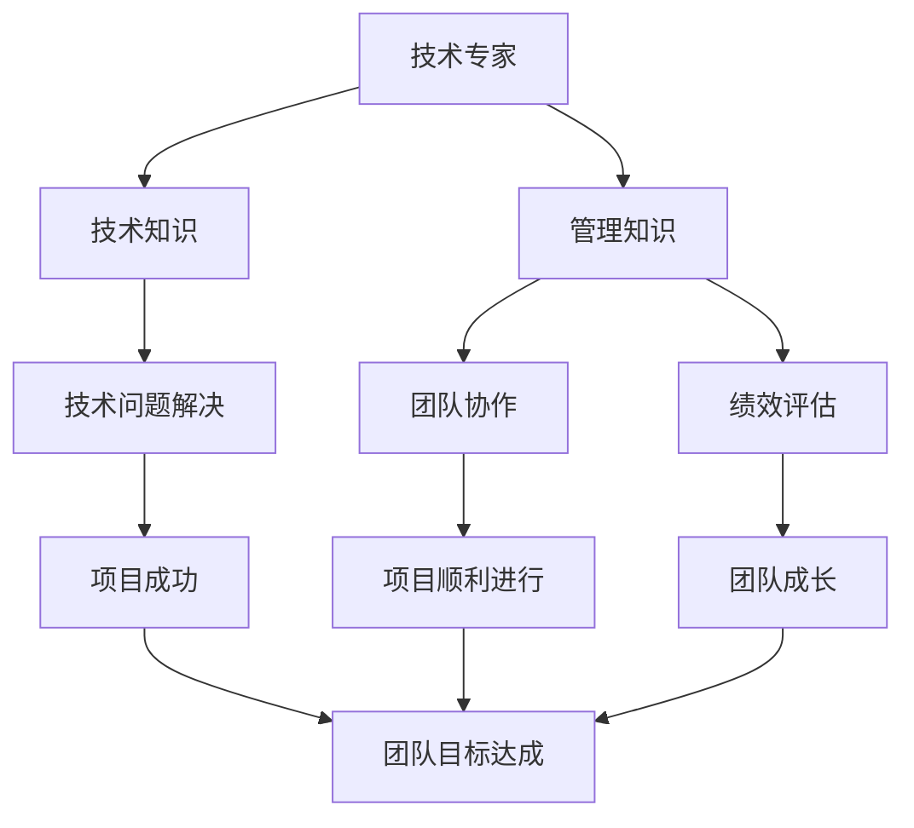

**伪代码示例：**

```python
# 技术专家职责伪代码
def technical_expert():
    solve_technical_issues()
    design_technical_solutions()
    write_technical_documents()
    collaborate_with_teammates()

# 管理者职责伪代码
def manager():
    set_team_goals()
    coordinate_team_collaboration()
    evaluate_team_performance()
    manage_team_resources()

# 技术与管理联系伪代码
def technical_management_connection():
    technical_expert()
    manager()
```

#### 第2章：管理知识储备

**2.1 基本管理概念**

管理是一项涉及多个方面的活动，包括组织架构、领导力与影响力、沟通技巧等。以下是基本管理概念的详细解释：

**2.1.1 组织架构**

组织架构是指组织中各个部门、岗位和职责的安排和分配。了解组织架构有助于管理者更好地理解团队的运作和协作方式。

**2.1.2 领导力与影响力**

领导力是管理者的重要素质，包括激励团队成员、指导和支持下属、决策能力等。影响力则是管理者通过沟通、协商和说服等方式影响他人行为和决策的能力。

**2.1.3 沟通技巧**

沟通技巧是管理者必备的能力，包括倾听、表达、反馈等。有效的沟通有助于团队协作、解决冲突和提高工作效率。

**2.2 管理技能培养**

管理者需要具备一系列管理技能，包括问题解决能力、决策能力、团队管理能力等。以下是对这些技能的详细解释和培养方法：

**2.2.1 问题解决能力**

问题解决能力是指管理者在面对问题和挑战时，能够迅速分析原因、制定解决方案并实施的能力。培养方法包括：

- **掌握问题分析技巧**：学习如何识别问题的根本原因，并制定相应的解决方案。
- **培养批判性思维**：通过分析案例和实际操作，提高判断和决策能力。

**2.2.2 决策能力**

决策能力是指管理者在面对复杂情境时，能够做出合理、有效的决策的能力。培养方法包括：

- **收集信息**：了解不同决策方案的影响和后果。
- **分析风险**：评估不同决策方案可能带来的风险和挑战。

**2.2.3 团队管理能力**

团队管理能力是指管理者在团队运作过程中，能够有效地激励、指导和支持团队成员的能力。培养方法包括：

- **建立有效的沟通机制**：定期与团队成员交流，了解他们的需求和意见。
- **提供培训和指导**：为团队成员提供培训和学习机会，帮助他们提升技能和职业发展。

**核心概念与联系架构（Mermaid 流程图）**

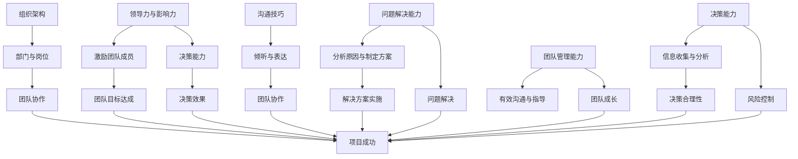

**伪代码示例：**

```python
# 管理知识储备伪代码
def management_knowledge():
    understand_organizational_structure()
    develop_leadership_and_influence()
    improve_communication_skills()
    cultivate_problem_solving_ability()
    enhance_decision_making_ability()
    build_team_management_ability()

# 管理技能培养伪代码
def management_skill_training():
    problem_solving_ability_training()
    decision_making_ability_training()
    team_management_ability_training()
```

#### 第3章：领导力提升

**3.1 领导力的本质**

领导力是一种能够激励、指导和支持团队成员的能力，包括以下几个方面的特征：

- **影响力**：领导者通过言行和行动影响他人的态度和行为。
- **愿景**：领导者能够明确团队的目标和未来方向，并激发团队成员的激情和动力。
- **信任**：领导者建立信任关系，赢得团队成员的信任和支持。
- **变革**：领导者具备推动团队变革和创新的能力，以适应不断变化的环境。

**3.2 领导风格与自我评估**

领导风格是指领导者处理团队事务和与团队成员互动的方式。常见的领导风格包括：

- **权威型领导**：领导者对团队成员具有高度控制力，决策迅速但可能导致团队成员缺乏参与感。
- **民主型领导**：领导者鼓励团队成员参与决策，提高团队凝聚力和创新性。
- **变革型领导**：领导者通过激励和启发团队成员，推动团队实现变革和成长。

进行自我评估有助于领导者了解自己的领导风格和优势，以及需要改进的方面。以下是一些自我评估方法：

- **360度反馈**：收集团队成员和其他相关人员的反馈，了解自己在领导力方面的优点和不足。
- **领导力评估工具**：使用专业的领导力评估工具，如MBTI（迈尔斯-布里格斯性格类型指标）等，了解自己的领导风格和个性特点。

**3.3 领导力提升方法**

领导者可以通过以下方法提升自己的领导力：

- **学习和培训**：参加领导力培训课程，学习领导力的理论知识和实践技巧。
- **阅读和研究**：阅读领导力相关的书籍和文章，了解不同领导风格和策略。
- **实践和反思**：在实际工作中运用所学知识，不断反思和总结自己的领导经验。
- **寻求反馈**：积极寻求团队成员和其他领导的反馈，了解自己在领导力方面的优点和不足，并进行改进。

**核心概念与联系架构（Mermaid 流程图）**

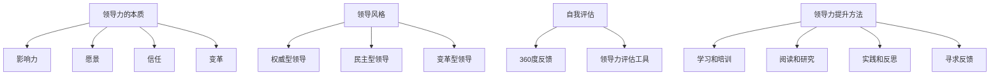

**伪代码示例：**

```python
# 领导力提升伪代码
def leadership_ enhancement():
    learn_about_leadership()
    read_and_study_leadership_resources()
    practice_and_reflect_on_leadership()
    seek_feedback_and_improve()
```

### 第二部分：转型实践

#### 第4章：技术与管理融合

**4.1 技术专家如何参与管理**

技术专家在转型为管理者后，需要将自己在技术领域的专业知识和经验应用于管理工作。以下是一些参与管理的具体方法：

- **技术规划**：参与技术规划，制定项目的技术路线图和实施计划。
- **技术评估**：对技术方案进行评估，确保其可行性和有效性。
- **技术指导**：为团队成员提供技术指导和支持，帮助他们解决技术难题。
- **技术培训**：组织技术培训，提升团队成员的技术能力和水平。

**4.2 技术与管理如何协同**

技术与管理之间的协同是确保项目成功的关键。以下是一些实现协同的方法：

- **明确职责**：明确技术专家和管理者的职责，避免工作重叠和冲突。
- **沟通与协作**：建立有效的沟通和协作机制，确保技术和管理信息畅通。
- **资源共享**：合理分配和利用技术和管理资源，提高资源利用效率。
- **目标一致**：确保技术和管理目标一致，共同推动项目进展。

**4.3 技术与管理融合案例分析**

以下是一个技术与管理融合的案例：

**案例背景**：某互联网公司计划开发一款新型社交应用，技术团队由经验丰富的技术专家组成，管理团队由具备丰富管理经验的管理者组成。

**案例分析**：

- **技术规划**：技术专家参与项目的技术规划，制定了详细的技术方案和实施计划。
- **技术评估**：管理团队对技术方案进行评估，确保其可行性和有效性。
- **技术指导**：技术专家为团队成员提供技术指导，帮助他们解决技术难题。
- **沟通与协作**：建立每日站会、周报等沟通机制，确保技术和管理信息畅通。
- **资源共享**：技术和管理团队共享资源，如开发环境、工具和设备等，提高资源利用效率。
- **目标一致**：技术和管理团队共同制定项目目标，确保项目进展与公司整体战略一致。

**核心概念与联系架构（Mermaid 流程图）**

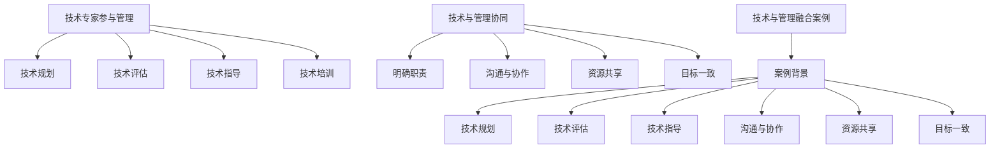

**伪代码示例：**

```python
# 技术专家参与管理伪代码
def technical_expert_in_management():
    plan_technical_project()
    evaluate_technical_solution()
    provide_technical_guidance()
    organize_technical_training()

# 技术与管理协同伪代码
def technical_management_synergy():
    clarify_responsibilities()
    establish_communication_and_collaboration()
    share_resources()
    align_goals()
```

#### 第5章：项目管理实战

**5.1 项目管理基础**

项目管理是指通过规划、执行、监控和收尾等活动，确保项目按时、按质量完成的过程。以下是一些项目管理的基础知识：

- **项目目标**：明确项目的目标和期望成果。
- **项目范围**：定义项目的范围和边界。
- **项目计划**：制定项目的时间表、资源分配和预算。
- **项目执行**：按照项目计划进行项目工作。
- **项目监控**：监控项目进度、质量和成本。
- **项目收尾**：完成项目收尾工作，如项目总结和客户验收。

**5.2 项目计划与执行**

项目计划与执行是项目管理的重要环节。以下是一些关键步骤和技巧：

- **项目计划**：制定详细的项目计划，包括任务分解、时间安排、资源分配和风险评估。
- **项目执行**：按照项目计划执行任务，确保任务按时完成。
- **任务分解**：将项目任务分解为可管理的子任务，便于团队协作和进度跟踪。
- **风险管理**：识别项目风险，制定相应的风险应对策略。
- **沟通与协调**：建立有效的沟通机制，确保团队成员之间的信息畅通。

**5.3 项目风险管理**

项目风险管理是项目管理的重要组成部分，以下是一些风险管理的方法和工具：

- **风险识别**：识别项目可能面临的风险，如技术风险、时间风险、成本风险等。
- **风险评估**：评估风险的可能性和影响，确定风险的优先级。
- **风险应对**：制定相应的风险应对策略，如风险回避、风险减轻、风险接受等。
- **风险监控**：监控项目风险的变化，及时调整风险应对策略。

**核心概念与联系架构（Mermaid 流程图）**

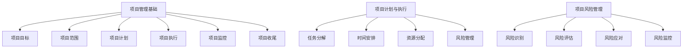

**伪代码示例：**

```python
# 项目管理基础伪代码
def project_management():
    define_project_goals()
    define_project_scope()
    plan_project_activities()
    execute_project_activities()
    monitor_project_progress()
    complete_project_closure()

# 项目计划与执行伪代码
def project_planning_and_execution():
    decompose_tasks()
    schedule_activities()
    allocate_resources()
    manage_risks()

# 项目风险管理伪代码
def project_risk_management():
    identify_risks()
    assess_risk_impact()
    develop_risk_response_strategies()
    monitor_risk_changes()
```

#### 第6章：团队建设与人才管理

**6.1 团队建设的重要性**

团队建设是指通过一系列活动和措施，提高团队成员之间的协作和凝聚力，以实现团队目标的过程。以下是一些团队建设的重要性：

- **提高工作效率**：良好的团队建设有助于提高团队的工作效率和产出。
- **促进沟通与合作**：团队建设有助于团队成员之间的沟通和协作，减少冲突和误解。
- **增强团队凝聚力**：团队建设可以增强团队成员之间的认同感和归属感，提高团队的凝聚力。
- **促进个人成长**：团队建设为团队成员提供了学习和成长的机会，提高个人技能和素质。

**6.2 团队成员角色与职责**

团队成员的角色和职责是团队运作的基础。以下是一些常见团队成员的角色和职责：

- **项目管理者**：负责项目的整体规划和执行，协调团队成员的工作。
- **技术专家**：负责项目的技术实现和问题解决，提供技术指导和支持。
- **产品经理**：负责产品的规划和设计，确保产品满足用户需求。
- **测试工程师**：负责项目的测试和验证，确保项目的质量和稳定性。

**6.3 人才招聘与培养策略**

人才招聘与培养策略是团队建设的重要组成部分。以下是一些人才招聘与培养策略：

- **明确招聘要求**：明确招聘岗位的职责和要求，制定合适的招聘标准。
- **多元化招聘渠道**：通过多种渠道进行招聘，如招聘网站、社交网络、人才市场等。
- **面试评估**：通过面试评估候选人的技能、经验和团队合作能力。
- **培训与发展**：为团队成员提供培训和发展机会，提高他们的技能和素质。
- **激励机制**：建立激励机制，鼓励团队成员积极工作和成长。

**核心概念与联系架构（Mermaid 流程图）**

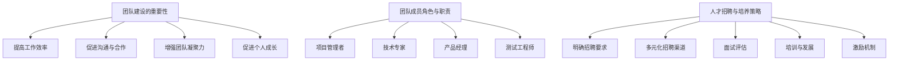

**伪代码示例：**

```python
# 团队建设重要性伪代码
def team_building_importance():
    improve_work_efficiency()
    promote_communication_and_collaboration()
    enhance_team_cohesion()
    promote_personal_growth()

# 团队成员角色与职责伪代码
def team_member_roles_and_responsibilities():
    project_manager()
    technical_expert()
    product_manager()
    test_engineer()

# 人才招聘与培养策略伪代码
def talent_recruitment_and_development_strategy():
    define_recruitment_requirements()
    diversify_recruitment_channels()
    conduct_interview_evaluation()
    provide_training_and_development()
    establish_incentive_mechanisms()
```

#### 第7章：从技术专家到管理者的成长之路

**7.1 成长阶段与挑战**

从技术专家到管理者的成长过程可以分为以下几个阶段，每个阶段都面临不同的挑战：

- **阶段1：适应期**：技术专家刚开始转型，需要适应管理者的角色和职责。主要挑战包括对管理工作的不熟悉、时间管理困难、与团队成员的沟通协作等。
- **阶段2：胜任期**：技术专家逐渐适应管理者的角色，具备基本的管理技能和经验。主要挑战包括提高领导力、团队建设、项目管理等。
- **阶段3：精通期**：技术专家在管理岗位上积累了丰富的经验，具备较高的领导力和管理能力。主要挑战包括持续学习、创新管理方法、应对复杂的项目和环境变化等。

**7.2 自我成长策略**

为了顺利实现从技术专家到管理者的转变，技术专家可以采取以下自我成长策略：

- **学习与实践**：参加领导力培训、阅读管理类书籍、参与实际项目管理等，提高管理技能和经验。
- **反思与总结**：定期反思自己的工作，总结成功经验和教训，不断改进自己的管理方法。
- **建立支持网络**：与同行和导师交流，建立支持网络，获取建议和帮助。
- **培养团队氛围**：建立积极向上的团队氛围，鼓励团队成员参与决策和反馈，提高团队凝聚力和创新能力。

**7.3 职业规划与职业发展**

技术专家在实现转型后，可以制定职业规划，明确自己的职业目标和路径。以下是一些职业规划的建议：

- **明确目标**：根据自己的兴趣、优势和职业发展趋势，明确职业目标。
- **制定计划**：制定具体的行动计划，包括学习、实践、培训和晋升等。
- **寻求发展机会**：积极寻求内部或外部的晋升和发展机会，如承担更多的责任、参与重大项目等。
- **持续学习**：保持对新知识、新技术的学习和了解，提升自己的专业素养和竞争力。

**核心概念与联系架构（Mermaid 流程图）**

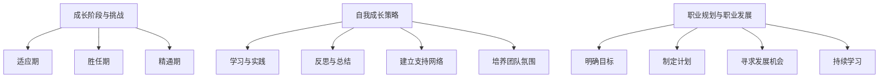

**伪代码示例：**

```python
# 成长阶段与挑战伪代码
def growth_stages_and_challenges():
    adaptation_period()
    competence_period()
    mastery_period()

# 自我成长策略伪代码
def self_growth_strategies():
    learn_and_practice()
    reflect_and_summarize()
    build_support_network()
    cultivate_team_atmosphere()

# 职业规划与职业发展伪代码
def career_planning_and_development():
    define_goals()
    create_action_plan()
    seek_growth_opportunities()
    continue_learning()
```

### 第三部分：转型后的持续发展

#### 第8章：管理者的职业素养

**8.1 持续学习与成长**

管理者需要具备持续学习和成长的能力，以适应不断变化的工作环境和市场需求。以下是一些持续学习和成长的方法：

- **参加培训课程**：参加各种管理培训课程，学习新的管理知识和技能。
- **阅读管理书籍**：阅读管理类书籍，了解不同的管理理论和方法。
- **参与实践**：在实际工作中运用所学知识，不断反思和总结，提高管理能力。
- **建立学习社区**：与同行和导师交流，建立学习社区，共同探讨和分享管理经验。

**8.2 情绪管理与压力应对**

情绪管理和压力应对是管理者必须掌握的重要技能。以下是一些方法和技巧：

- **情绪管理**：学会识别和管理自己的情绪，避免情绪波动对工作和人际关系的影响。
- **压力应对**：学会应对工作压力，如合理分配时间、寻求支持、调整工作节奏等。
- **保持积极心态**：培养积极的心态，面对挑战和困难时保持乐观和自信。

**8.3 管理者的道德责任与伦理**

管理者的道德责任和伦理是管理者的基本素质。以下是一些道德责任和伦理要求：

- **诚信**：保持诚信，遵守职业道德和行为规范。
- **公正**：对待团队成员公平公正，不偏袒和歧视。
- **尊重**：尊重团队成员的权利和尊严，建立良好的团队合作氛围。
- **责任**：承担起自己的管理责任，为团队的发展和组织的成功负责。

**核心概念与联系架构（Mermaid 流程图）**

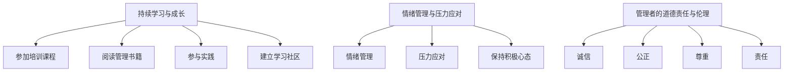

**伪代码示例：**

```python
# 持续学习与成长伪代码
def continuous_learning_and_growth():
    attend_training_courses()
    read_management_books()
    engage_in_practice()
    build_learning_communities()

# 情绪管理与压力应对伪代码
def emotional_management_and_stress_coping():
    manage_emotions()
    cope_with_stress()
    maintain_a_positive_mentality()

# 管理者的道德责任与伦理伪代码
def manager_moral_responsibility_and_ethics():
    practice_honesty()
    act公正()
    respect_team_members()
    take_responsibility()
```

#### 第9章：领导力的持续提升

**9.1 领导力发展的新趋势**

领导力发展在不断演变，新的趋势包括：

- **数字化转型**：领导者需要适应数字化时代的变化，掌握数字化工具和思维方式。
- **可持续发展**：领导者需要关注企业的可持续发展，推动社会责任和环境保护。
- **团队合作**：领导者需要重视团队合作，培养团队成员的参与感和创造力。
- **终身学习**：领导者需要具备终身学习的能力，不断更新知识和技能。

**9.2 领导力模型的演变**

领导力模型在不同阶段有不同的特点，以下是一些典型的领导力模型：

- **X理论**：领导者具有权威和控制力，强调命令与服从。
- **Y理论**：领导者鼓励团队成员的自主性和创造力，注重激励和成长。
- **情境领导**：领导者根据团队成员的不同特点和需求，采取不同的领导风格。
- **变革型领导**：领导者通过激励和启发团队成员，推动团队实现变革和成长。

**9.3 领导力的未来发展方向**

领导力的未来发展方向包括：

- **人工智能与领导力**：人工智能将辅助领导者做出更明智的决策，提高领导效率。
- **全球化与领导力**：领导者需要具备跨文化沟通和协作能力，应对全球化挑战。
- **员工体验**：领导者需要关注员工的体验和满意度，提升员工的幸福感和忠诚度。
- **社会责任**：领导者需要承担更多的社会责任，推动企业和社会的可持续发展。

**核心概念与联系架构（Mermaid 流程图）**

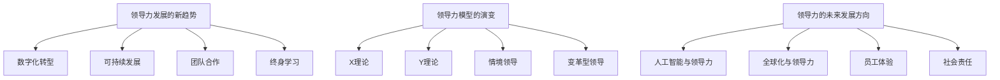

**伪代码示例：**

```python
# 领导力发展的新趋势伪代码
def new_trends_in_leadership_development():
    digital_transformation()
    sustainable_development()
    teamwork()
    lifelong_learning()

# 领导力模型的演变伪代码
def evolution_of_leadership_models():
    x_theory()
    y_theory()
    situational_leadership()
    transformational_leadership()

# 领导力的未来发展方向伪代码
def future_directions_of_leadership():
    artificial_intelligence_and_leadership()
    globalization_and_leadership()
    employee_experience()
    social_responsibility()
```

#### 第10章：管理创新与持续发展

**10.1 创新管理理念**

创新管理理念是指管理者在管理过程中注重创新思维和创新实践。以下是一些创新管理理念的要点：

- **鼓励创新**：管理者应鼓励团队成员提出新的想法和建议，并给予支持和鼓励。
- **风险管理**：管理者应认识到创新过程中可能面临的风险，并制定相应的风险管理策略。
- **持续改进**：管理者应推动团队不断改进工作流程和产品，提高质量和效率。

**10.2 创新管理方法**

创新管理方法是指管理者在管理过程中采用的具体方法和工具。以下是一些创新管理方法：

- **头脑风暴**：通过头脑风暴激发团队成员的创造力，产生新的想法和解决方案。
- **跨界合作**：与不同领域的专家和团队合作，引入新的思维和方法。
- **试点项目**：选择部分团队或项目进行试点，验证新想法的可行性和效果。
- **反馈机制**：建立反馈机制，收集团队成员的建议和意见，持续改进和创新。

**10.3 持续发展策略**

持续发展策略是指管理者在管理过程中采取的长期发展战略。以下是一些持续发展策略：

- **人才培养**：培养和引进高素质的人才，提升团队的整体竞争力。
- **技术创新**：持续关注技术创新，推动产品和技术的更新和升级。
- **市场拓展**：积极拓展市场，开拓新的业务领域和客户群体。
- **企业文化**：建立积极向上的企业文化，增强团队的凝聚力和归属感。

**核心概念与联系架构（Mermaid 流程图）**

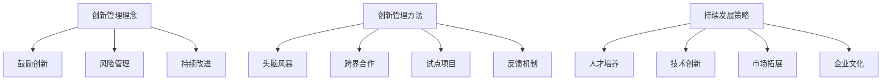

**伪代码示例：**

```python
# 创新管理理念伪代码
def innovative_management_concept():
    encourage_innovation()
    manage_risks()
    pursue_continual_improvement()

# 创新管理方法伪代码
def innovative_management_methods():
    conduct_brainstorming()
    foster_interdisciplinary_collaboration()
    implement_pilot_projects()
    establish_feedback_mechanisms()

# 持续发展策略伪代码
def sustainable_development_strategies():
    cultivate_talent()
    drive_technological_innovation()
    expand_market_reach()
    build_a_positive_culture()
```

#### 第11章：成功管理者的特质与经验

**11.1 成功管理者的特质**

成功管理者具备以下特质：

- **领导力**：具备强大的领导力，能够激励和引导团队成员。
- **沟通能力**：具备良好的沟通能力，能够清晰、准确地表达自己的想法，并倾听和理解他人的意见。
- **决策能力**：具备快速、明智的决策能力，能够在复杂的情况下做出正确的决策。
- **团队合作**：具备团队合作精神，能够与团队成员共同面对挑战，实现共同目标。
- **持续学习**：具备持续学习的能力，不断更新知识和技能，适应变化的工作环境。

**11.2 管理者的经验分享**

以下是一些成功管理者的经验分享：

- **明确目标**：成功管理者首先明确团队的目标和期望，确保团队成员清晰了解目标和方向。
- **激励团队**：成功管理者通过激励和认可团队成员的努力和成果，激发团队的积极性和创造力。
- **有效沟通**：成功管理者注重与团队成员的沟通，确保信息的畅通和透明，减少误解和冲突。
- **培养人才**：成功管理者重视人才培养，提供培训和发展机会，帮助团队成员提升技能和职业发展。
- **持续改进**：成功管理者不断寻求改进和优化工作流程和产品，提高团队的整体绩效。

**11.3 管理者的职业成长路径**

管理者的职业成长路径可以分为以下几个阶段：

- **初级管理者**：刚开始担任管理职位，需要适应管理者的角色和职责。
- **中级管理者**：具备一定的管理经验和能力，能够有效地管理团队和项目。
- **高级管理者**：在管理岗位上积累了丰富的经验，具备较高的领导力和管理能力，能够承担更多的责任和挑战。
- **高层管理者**：成为组织的高层领导，负责制定组织战略和决策，推动组织的发展和壮大。

**核心概念与联系架构（Mermaid 流程图）**

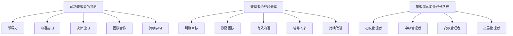

**伪代码示例：**

```python
# 成功管理者的特质伪代码
def traits_of_successful_managers():
    possess_leadership()
    have_communication_skills()
    exhibit_decision_making_ability()
    demonstrate_teamwork()
    engage_in_lifelong_learning()

# 管理者的经验分享伪代码
def manager_experience_sharing():
    define_clear_goals()
    motivate_the_team()
    communicate_effectively()
    cultivate_talent()
    pursue_continual_improvement()

# 管理者的职业成长路径伪代码
def career_growth_path_for_managers():
    junior_manager()
    middle_manager()
    senior_manager()
    executive_manager()
```

### 附录：管理工具与资源

**附录1：常用管理工具介绍**

以下是一些常用的管理工具及其简要介绍：

- **项目管理工具**：如JIRA、Trello、Asana等，用于任务管理、进度跟踪和团队协作。
- **沟通工具**：如Slack、Microsoft Teams、Zoom等，用于团队沟通和远程协作。
- **文档管理工具**：如Google Docs、Microsoft Office 365、Confluence等，用于文档共享和协作编辑。
- **时间管理工具**：如Toggl、RescueTime、Focus@Will等，用于时间管理和提高工作效率。
- **绩效管理工具**：如Lattice、15Five、PerformanceVue等，用于绩效评估和反馈。

**附录2：推荐管理书籍与文章**

以下是一些推荐的管理书籍和文章：

- **《影响力》**：罗伯特·西奥迪尼（Robert B. Cialdini）著，介绍了影响力的六个原则。
- **《第五项修炼》**：彼得·圣吉（Peter M. Senge）著，探讨了学习型组织的建设。
- **《高效能人士的七个习惯》**：史蒂芬·柯维（Stephen R. Covey）著，介绍了高效能人士的七个习惯。
- **《领导者的语言》**：乔·吉拉尔多（Joe Gerstandt）著，探讨了领导者的语言艺术。
- **《团队协作的艺术》**：克里斯·阿吉里斯（Chris Argyris）著，介绍了团队协作的原则和方法。

**附录3：在线管理学习资源**

以下是一些在线管理学习资源：

- **Coursera**：提供各种管理课程，包括领导力、项目管理、团队协作等。
- **edX**：提供由顶尖大学和机构提供的管理课程，如哈佛大学、斯坦福大学等。
- **LinkedIn Learning**：提供专业的管理培训和课程，包括领导力、沟通技巧、团队管理等。
- **MBA Online**：提供在线MBA课程和管理培训，涵盖广泛的管理领域。

**核心概念与联系架构（Mermaid 流�程图）**

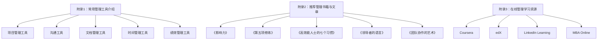

**伪代码示例：**

```python
# 附录1：常用管理工具介绍伪代码
def management_tools_introduction():
    introduce_project_management_tools()
    introduce_communication_tools()
    introduce_document_management_tools()
    introduce_time_management_tools()
    introduce_performance_management_tools()

# 附录2：推荐管理书籍与文章伪代码
def recommended_management_books_and_articles():
    recommend_influence()
    recommend_the_fifth_discipline()
    recommend_seven_habits_of_highly_effective_people()
    recommend_the_language_of_leaders()
    recommend_the_arts_of_teaming()

# 附录3：在线管理学习资源伪代码
def online_management_learning_resources():
    recommend_coursera()
    recommend_edX()
    recommend_linkedin_learning()
    recommend_mba_online()
```

### 总结

从技术专家到管理者的转型是一条充满挑战和机遇的道路。通过自我认知、管理知识储备、领导力提升、技术与管理融合、项目管理实战、团队建设与人才管理等方面的学习和实践，技术专家可以逐步实现成功转型。同时，持续学习与成长、创新管理理念、道德责任与伦理、领导力的持续提升、管理创新与持续发展等也是管理者在转型过程中需要不断关注和提升的方面。希望本文能为技术专家提供一条清晰的转型路径，助力他们在管理者的角色中取得成功。

### 作者信息

作者：AI天才研究院/AI Genius Institute & 禅与计算机程序设计艺术 /Zen And The Art of Computer Programming

本文由AI天才研究院和禅与计算机程序设计艺术共同撰写，旨在为技术专家提供从技术专家到管理者的转型指南。AI天才研究院是一家专注于人工智能研究和应用的高端智库，禅与计算机程序设计艺术则是一本书籍，探讨计算机程序设计中的禅宗智慧。希望本文能为读者带来启发和帮助。

