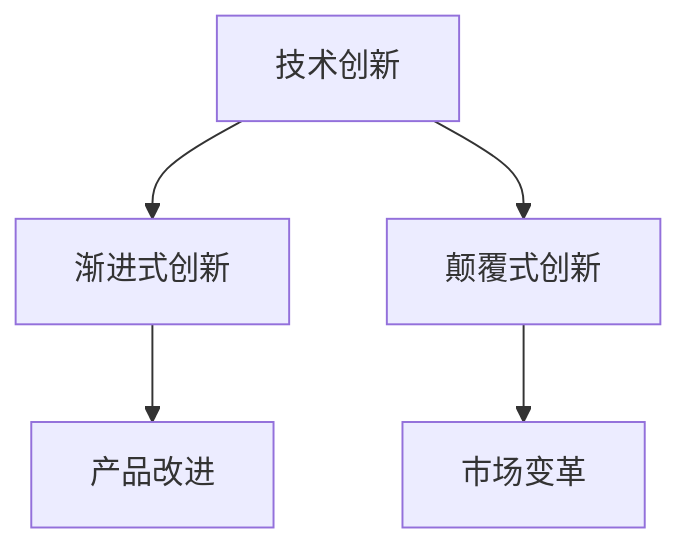
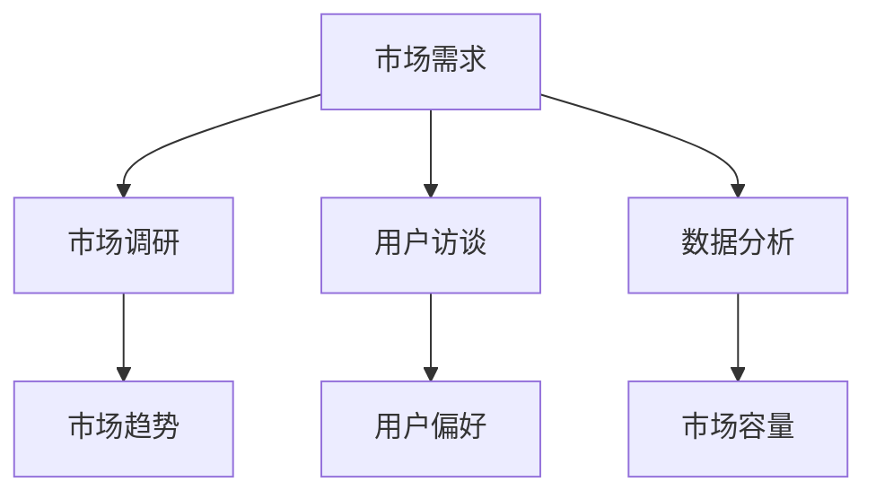
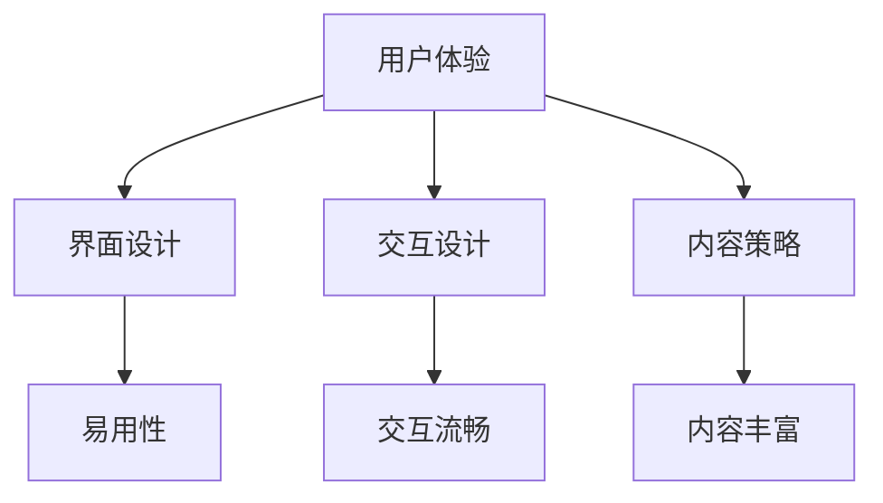
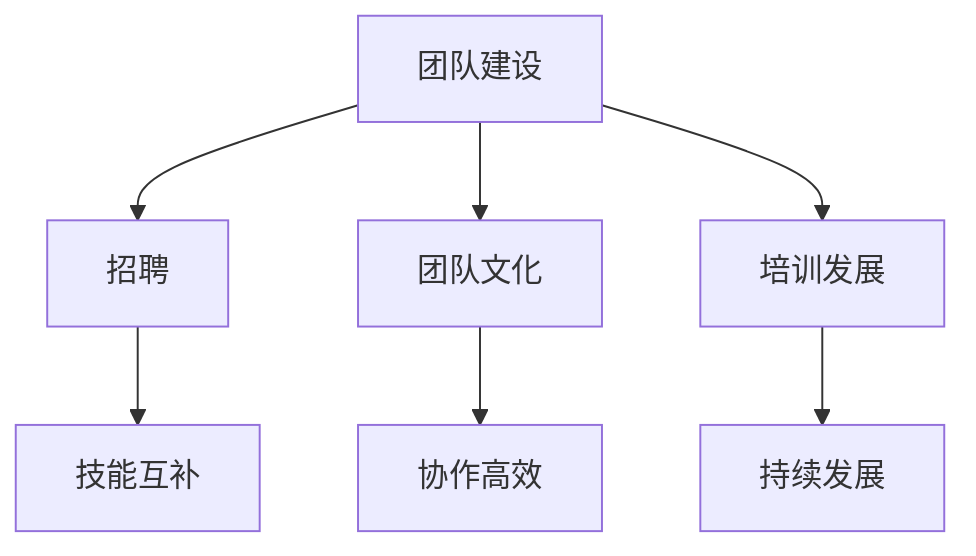
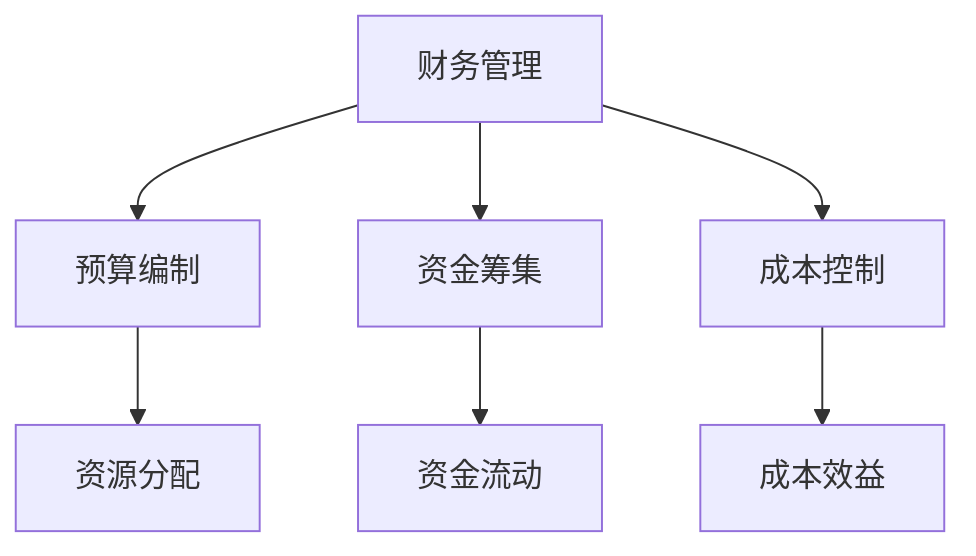

                 

### 背景介绍

#### 技术创业的兴起与挑战

随着全球科技水平的不断提升，技术创业逐渐成为推动经济增长和社会进步的重要力量。技术创业不仅涵盖了传统的IT、互联网、人工智能等领域，还扩展到了生物科技、新能源、新材料等前沿科技领域。在这个背景下，技术创业者需要具备前瞻性的技术洞察力、卓越的创新能力和高效的市场应变能力，以应对激烈的竞争环境和不断变化的市场需求。

技术创业的兴起带来了诸多机遇和挑战。一方面，新兴技术的发展和市场的不断拓展为创业者提供了广阔的舞台。另一方面，技术创业的高风险性和复杂性也使得成功变得更加困难。因此，如何将技术优势转化为市场价值，实现从技术创新到商业成功的转化，成为技术创业者亟待解决的关键问题。

#### 从技术到产品的转化

从技术到产品的转化是技术创业过程中的关键环节。技术本身是一种工具，只有通过产品的形式才能实现商业价值。这一转化过程不仅需要技术的成熟和可行性，还需要对市场需求、用户体验、商业模式等进行深入分析。具体来说，从技术到产品的转化包括以下几个步骤：

1. **技术评估与验证**：对现有技术进行评估，确定其可行性、成熟度和潜在市场价值。
2. **产品设计**：根据市场需求和用户体验，设计出符合用户需求的产品原型。
3. **产品原型开发**：通过开发迭代，逐步完善产品功能，提升产品竞争力。
4. **市场测试与反馈**：将产品推向市场，收集用户反馈，对产品进行优化和调整。

这一过程不仅需要技术创新的支持，还需要商业智慧和市场洞察力。技术创业者需要在技术和市场之间找到平衡，确保产品能够在市场中获得成功。

#### 成功要素

技术创业的成功不仅依赖于技术创新，还需要多方面的因素支持。以下是技术创业成功的一些关键要素：

1. **市场需求**：了解并满足市场需求是产品成功的基础。
2. **团队建设**：一个优秀的团队是技术创业成功的重要保障。
3. **财务管理**：有效的财务管理是保证企业持续发展的关键。
4. **持续创新**：技术创新是保持企业竞争力的核心。
5. **市场推广**：有效的市场推广可以帮助产品快速占领市场。

在接下来的文章中，我们将详细探讨这些关键要素，并分享一些成功的技术创业案例，帮助读者更好地理解从技术到产品的转化过程及其成功要素。

#### 核心概念与联系

在技术创业的过程中，理解并运用核心概念是至关重要的。以下是技术创业中几个关键概念及其相互关系的详细解释，并使用Mermaid流程图展示它们之间的联系。

##### 1. 技术创新

技术创新是技术创业的核心驱动力。它指的是通过研究和开发新的技术、方法或产品，从而创造新的商业机会。技术创新可以分为渐进式创新和颠覆式创新。渐进式创新通过改进现有技术来提升产品性能或降低成本，而颠覆式创新则通过引入全新的技术或商业模式，彻底改变市场格局。

**Mermaid流程图：**



##### 2. 市场需求

市场需求是产品成功的关键因素。了解市场需求意味着创业者需要深入分析目标用户群体的需求，并设计出能够满足这些需求的产品。市场需求分析通常包括市场调研、用户访谈和数据分析等步骤。

**Mermaid流程图：**



##### 3. 用户体验

用户体验（UX）设计是确保产品成功的关键。它关注用户在使用产品过程中的感受和体验，包括界面设计、交互设计和内容策略等方面。良好的用户体验可以提高用户满意度，增加用户黏性，从而推动产品的市场成功。

**Mermaid流程图：**



##### 4. 团队建设

团队建设是技术创业成功的重要保障。一个高效的团队需要具备多元化的技能、良好的沟通和协作能力。团队建设包括招聘合适的团队成员、建立团队文化、进行培训和发展等方面。

**Mermaid流程图：**



##### 5. 财务管理

财务管理是技术创业过程中不可或缺的一部分。有效的财务管理可以帮助企业合理分配资源，降低风险，实现可持续的发展。财务管理包括预算编制、资金筹集、成本控制等方面。

**Mermaid流程图：**



通过上述核心概念的详细解释和Mermaid流程图的展示，我们可以更清晰地理解技术创业中的各个关键要素及其相互关系。这些概念不仅是技术创业成功的基础，也是创业者需要深入思考和有效运用的工具。

#### 核心算法原理讲解

在技术创业中，核心算法原理的理解和运用是至关重要的。以下将介绍几个在技术创业中常用的算法，并使用伪代码详细阐述其原理。

##### 1. 机器学习算法

机器学习算法在技术创业中广泛应用于数据分析、预测模型和推荐系统等方面。以下是一个简单的线性回归算法的伪代码，用于预测房价：

```plaintext
算法名称：线性回归
输入：训练集（特征矩阵X和标签向量y）
输出：模型参数（权重w和偏置b）

初始化：w = 0, b = 0

for i from 1 to n（训练集大小）do
    for j from 1 to m（特征维度）do
        w[j] = w[j] + X[i][j] * (X[i][j] * y[i] - w * y[i])
    end for
end for

b = b + (y[i] - (w * X[i]))

return w, b
```

该算法通过最小化损失函数（如均方误差）来更新模型参数，从而预测房价。

##### 2. 图算法

图算法在社交网络分析、推荐系统和路由算法等方面有广泛应用。以下是一个简单的最短路径算法（迪杰斯特拉算法）的伪代码：

```plaintext
算法名称：迪杰斯特拉算法
输入：无向加权图G（顶点集V和边集E）
输出：最短路径（顶点v到其他所有顶点的距离）

初始化：dist[v] = 0，其他顶点的dist初始化为无穷大
prev[v] = null

for each vertex v in V do
    if dist[v] = ∞ then
        continue
    end if

    for each neighbor u of v in E do
        if dist[u] > dist[v] + weight(v, u) then
            dist[u] = dist[v] + weight(v, u)
            prev[u] = v
        end if
    end for

    select the vertex u with the smallest dist[u]
    swap u with v

end for

return dist, prev
```

该算法通过逐步选择未访问顶点，并更新其邻居顶点的距离，最终计算出从源点v到其他所有顶点的最短路径。

##### 3. 贝叶斯网络

贝叶斯网络在决策分析和风险评估中广泛应用。以下是一个简单的贝叶斯网络算法的伪代码，用于计算条件概率：

```plaintext
算法名称：贝叶斯网络推理
输入：贝叶斯网络B（变量集V和条件概率表P）
输出：条件概率分布（给定证据变量的后验概率）

初始化：P_post[v] = P(v)

for each variable v in V do
    if v is in the evidence set then
        continue
    end if

    for each parent p of v in V do
        P_post[v] = P_post[v] * P(v | p)
    end for

    P_post[v] = P_post[v] / sum(P_post[u] for all u in V)

return P_post
```

该算法通过条件概率表和证据变量，计算出目标变量的后验概率分布。

通过上述核心算法的讲解和伪代码展示，我们可以更深入地理解这些算法在技术创业中的应用及其原理。掌握这些算法不仅有助于提高产品的技术含量，还能为创业者提供有效的工具和思路，助力技术创业的成功。

#### 数学模型和数学公式

在技术创业中，数学模型和数学公式扮演着至关重要的角色，它们不仅为创业项目提供了理论依据，还在实际应用中指导着决策过程。以下将介绍几个与创业项目密切相关的数学模型，并使用LaTeX格式展示相关公式，进行详细讲解和举例。

##### 1. 投资回报率（ROI）

投资回报率是衡量投资项目盈利能力的重要指标。它的计算公式为：

$$
ROI = \frac{NPV}{Investment} \times 100\%
$$

其中，$NPV$ 表示净现值，$Investment$ 表示总投资金额。

**LaTeX 格式：**

$$
ROI = \frac{\text{NPV}}{\text{Investment}} \times 100\%
$$

**举例：** 假设一个技术创业项目的总投资为100万元，预计项目运营5年后实现净收入200万元，折现率为10%。那么，该项目的ROI计算如下：

$$
\text{NPV} = \sum_{t=1}^{5} \frac{\text{Net Income}_t}{(1 + \text{Discount Rate})^t} = \frac{200}{(1 + 0.1)^5} \approx 148.6 \text{万元}
$$

$$
ROI = \frac{148.6}{100} \times 100\% = 148.6\%
$$

##### 2. 损失函数

损失函数在机器学习算法中用于评估模型的预测准确性。一个常见的损失函数是均方误差（MSE），其公式为：

$$
MSE = \frac{1}{n} \sum_{i=1}^{n} (y_i - \hat{y}_i)^2
$$

其中，$y_i$ 是实际值，$\hat{y}_i$ 是预测值，$n$ 是数据点的数量。

**LaTeX 格式：**

$$
MSE = \frac{1}{n} \sum_{i=1}^{n} (y_i - \hat{y}_i)^2
$$

**举例：** 假设我们有5个数据点，实际值和预测值如下：

| i | $y_i$ | $\hat{y}_i$ |
|---|-------|-------------|
| 1 | 2     | 2.1         |
| 2 | 3     | 2.9         |
| 3 | 4     | 4.2         |
| 4 | 5     | 5.1         |
| 5 | 6     | 5.8         |

那么，均方误差计算如下：

$$
MSE = \frac{1}{5} [(2 - 2.1)^2 + (3 - 2.9)^2 + (4 - 4.2)^2 + (5 - 5.1)^2 + (6 - 5.8)^2] = 0.04
$$

##### 3. 马尔可夫模型

马尔可夫模型在风险评估和决策分析中广泛应用。它基于当前状态概率分布来预测下一个状态。一个简单的马尔可夫模型可以用以下公式表示：

$$
P_{ij} = P(X_{t+1} = j | X_t = i)
$$

其中，$P_{ij}$ 是从状态$i$转移到状态$j$ 的概率。

**LaTeX 格式：**

$$
P_{ij} = P(X_{t+1} = j | X_t = i)
$$

**举例：** 假设一个系统的状态转移矩阵如下：

| 状态i | 状态j |
|-------|-------|
| 1     | 1     |
| 0.6   | 0.4   |
| 0.3   | 0.7   |

给定当前状态为1，预测下一个状态的概率如下：

$$
P(X_{t+1} = 1 | X_t = 1) = 0.6
$$

$$
P(X_{t+1} = 0 | X_t = 1) = 0.4
$$

通过上述数学模型和公式的讲解和示例，我们可以看到数学在技术创业中的应用不仅有助于提高项目的科学性和可操作性，还能为创业决策提供有力的支持。掌握这些数学工具，将使创业者在面对复杂的市场和技术环境时更具竞争力。

#### 项目实战

在本节中，我们将通过一个实际案例来探讨技术创业中的开发过程。该项目是一个基于机器学习的推荐系统，目的是为用户推荐他们可能感兴趣的商品或内容。以下将详细描述开发环境搭建、源代码实现、代码解读和分析等内容。

##### 1. 开发环境搭建

为了实现这个推荐系统，我们首先需要搭建一个合适的开发环境。以下是所需的软件和工具：

- **Python 3.8**：作为主要编程语言
- **Jupyter Notebook**：用于编写和运行代码
- **Scikit-learn**：用于机器学习算法的实现
- **Pandas**：用于数据处理
- **NumPy**：用于数值计算
- **Matplotlib**：用于数据可视化

在搭建开发环境时，可以按照以下步骤进行：

1. 安装Python 3.8及其pip包管理器。
2. 使用pip安装所需的库，如`scikit-learn`, `pandas`, `numpy`, 和 `matplotlib`。

##### 2. 源代码实现

以下是一个简单的推荐系统实现示例。该系统使用协同过滤算法来预测用户对商品的兴趣。

```python
import numpy as np
import pandas as pd
from sklearn.metrics.pairwise import cosine_similarity
from sklearn.model_selection import train_test_split

# 加载数据
data = pd.read_csv('user_item_data.csv')
users = data['user_id'].unique()
items = data['item_id'].unique()

# 构建用户-物品评分矩阵
rating_matrix = np.zeros((len(users), len(items)))
for index, row in data.iterrows():
    user_id = row['user_id']
    item_id = row['item_id']
    rating = row['rating']
    rating_matrix[user_id][item_id] = rating

# 计算相似度矩阵
similarity_matrix = cosine_similarity(rating_matrix)

# 推荐系统核心函数
def recommend_items(user_id, similarity_matrix, rating_matrix, k=10, threshold=0.5):
    # 获取用户相似度排名
    similarity_scores = similarity_matrix[user_id].reshape(1, -1)
    similarity_scores = np.array(similarity_scores > threshold, dtype=int)
    
    # 排序并获取最相似的k个用户
    similar_users = np.argsort(similarity_scores, axis=1)[:, -k:]
    
    # 计算每个相似用户喜欢的物品
    item_scores = np.dot(similarity_matrix[similar_users], rating_matrix.T)
    item_scores = item_scores + rating_matrix[user_id]
    
    # 对每个物品进行排序并返回Top N
    recommended_items = np.argsort(-item_scores.flatten())[:k]
    return recommended_items

# 测试推荐系统
user_id = 1
recommended_items = recommend_items(user_id, similarity_matrix, rating_matrix, k=5)
print("Recommended Items:", recommended_items)
```

##### 3. 代码解读

上述代码实现了一个基于协同过滤的推荐系统。以下是代码的主要部分及其功能解读：

1. **数据加载**：从CSV文件中加载用户和物品的评分数据。
2. **评分矩阵构建**：创建一个用户-物品评分矩阵，用于存储用户对物品的评分。
3. **相似度矩阵计算**：使用余弦相似度算法计算用户之间的相似度矩阵。
4. **推荐函数**：定义推荐函数，用于为特定用户推荐物品。
   - `similarity_matrix[user_id].reshape(1, -1)`：获取指定用户的相似度分数。
   - `np.array(similarity_scores > threshold, dtype=int)`：设置相似度阈值，过滤相似度较低的用户。
   - `np.argsort(similarity_matrix[similar_users], axis=1)[:, -k:]`：获取最相似的k个用户。
   - `item_scores = np.dot(similarity_matrix[similar_users], rating_matrix.T)`：计算每个相似用户对物品的评分。
   - `item_scores + rating_matrix[user_id]`：对用户自身的评分进行加权。
   - `np.argsort(-item_scores.flatten())[:k]`：对评分进行降序排序，获取Top N推荐物品。

##### 4. 代码分析与实际应用

该推荐系统通过协同过滤算法实现了对用户兴趣的预测。在实际应用中，可以根据用户的行为数据和反馈，不断优化相似度计算方法和推荐算法，提高推荐系统的准确性和用户体验。

**注意事项**：

- 在实际项目中，需要处理大量的用户和物品数据，可以考虑使用分布式计算框架（如Spark）来提升数据处理效率。
- 相似度阈值和推荐物品数量需要根据实际业务需求和用户反馈进行调整。

**拓展阅读**：

- **《推荐系统实践》**：深入了解推荐系统的构建和优化方法。
- **《机器学习实战》**：学习如何应用机器学习算法解决实际问题。

通过以上实际案例的介绍，我们可以看到技术创业项目从开发到实现的完整流程，以及如何通过代码解读和分析，提升项目的实用性和市场竞争力。

#### 最佳实践 tips

1. **市场需求分析**：在产品开发初期，进行详细的市场需求分析至关重要。通过市场调研、用户访谈和数据分析，深入了解目标用户的需求和偏好，确保产品能够真正满足市场需求。

2. **敏捷开发**：采用敏捷开发方法，可以快速响应市场变化，持续优化产品。通过迭代开发，不断收集用户反馈，及时调整产品方向和功能，提高产品竞争力。

3. **团队协作**：构建一个高效协作的团队，是技术创业成功的关键。团队成员应具备多元化技能，良好的沟通和协作能力，以确保项目顺利推进。

4. **财务管理**：建立完善的财务管理体系，合理规划资金使用，确保项目有足够的资金支持。同时，定期进行财务审计和风险评估，及时调整财务策略。

5. **持续创新**：技术创新是保持企业竞争力的核心。创业者应保持对新技术的高度敏感性，不断探索和引入新技术，以提升产品和服务的竞争力。

6. **市场推广**：有效的市场推广可以帮助产品快速占领市场。通过精准营销、社交媒体运营和线下活动，提升品牌知名度和用户认可度。

7. **用户反馈**：重视用户反馈，及时收集并分析用户意见和建议，持续优化产品和服务。通过用户反馈，可以更好地了解用户需求，提高用户满意度。

#### 小结

本文从技术创业的背景和挑战入手，详细探讨了从技术到产品的转化过程以及技术创业的核心概念、核心算法、数学模型和项目实战。通过这些分析，我们了解到技术创业不仅需要技术创新，还需要市场需求分析、用户体验设计、团队建设、财务管理等多方面因素的协同作用。

技术创业的成功要素包括：深入的市场需求分析、高效的团队协作、合理的财务管理、持续的技术创新以及有效的市场推广。此外，掌握最佳实践和注意事项，如敏捷开发、持续优化和用户反馈，对于技术创业的成功至关重要。

在未来的技术创业中，创业者需要不断学习和适应市场变化，运用先进的技术和科学的管理方法，以实现从技术创新到商业成功的转化。通过本文的探讨，我们希望为创业者提供有益的启示和指导，助力技术创业的成功。

#### 注意事项

1. **数据隐私与合规**：在开发过程中，确保遵守数据隐私法规，如《通用数据保护条例》（GDPR）和《加州消费者隐私法案》（CCPA），保护用户数据安全。

2. **技术风险控制**：在应用新技术时，评估潜在的技术风险，制定相应的风险控制措施，确保项目稳健运行。

3. **持续学习与更新**：技术领域快速发展，创业者应保持持续学习的态度，跟踪最新技术趋势，不断提升自身的技术能力和市场洞察力。

4. **项目范围管理**：在项目规划阶段，明确项目的范围和目标，避免项目范围蔓延，确保项目在预算和时间范围内顺利完成。

5. **用户反馈收集**：定期收集用户反馈，确保产品能够不断满足用户需求，提升用户体验。

#### 拓展阅读

- **《精益创业》**：艾瑞克·莱斯（Eric Ries）的经典著作，详细介绍了精益创业方法，对技术创业者具有指导意义。
- **《创新者的窘境》**：克里斯坦森（Clayton Christensen）的著作，探讨了创新者在市场中面临的挑战和应对策略。
- **《深度学习》**：Ian Goodfellow、Yoshua Bengio和Aaron Courville合著，是深度学习领域的权威教材，适合对深度学习技术感兴趣的创业者。

通过这些拓展阅读，创业者可以进一步深入了解技术创业的相关理论和实践，为成功的技术创业之路奠定坚实的基础。

