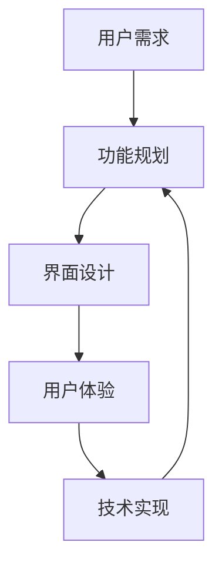
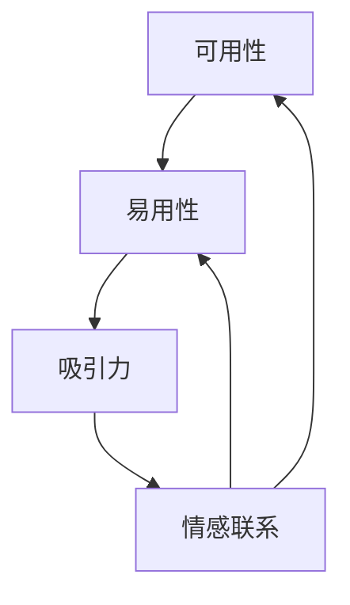
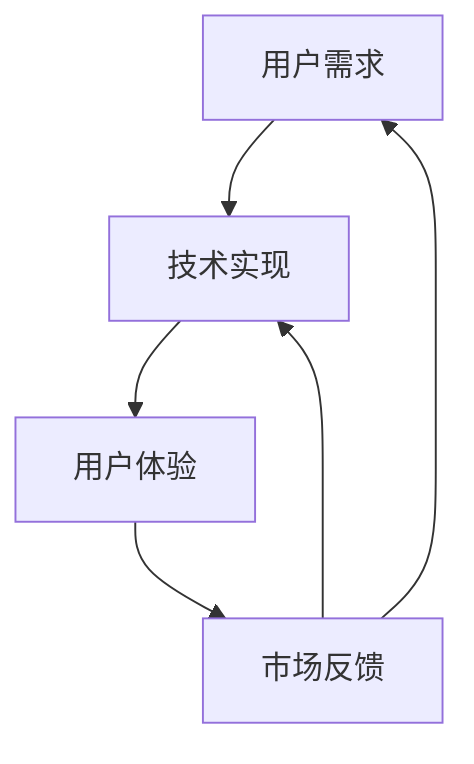
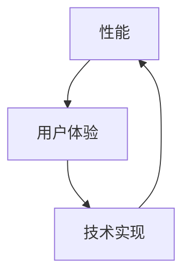
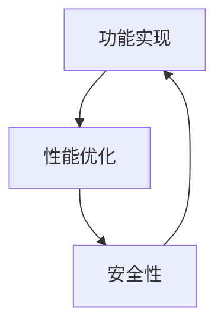
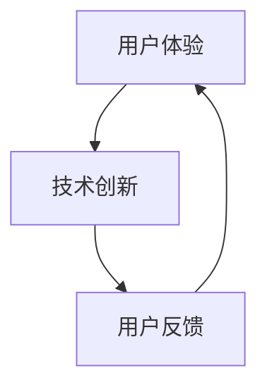
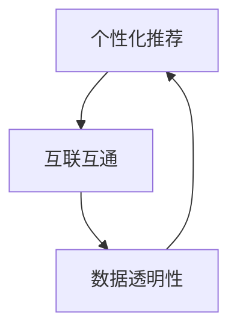

                 


### 文章标题：从技术视角看产品设计

#### 关键词：产品设计、用户体验、技术融合、前端技术、后端技术、成功案例

#### 摘要：
本文从技术视角深入探讨产品设计，解析其在现代科技环境中的重要性。通过详细分析产品设计的基础知识、技术视角下的设计方法、成功案例以及未来趋势，帮助读者全面理解产品设计的技术内涵和实践价值。

----------------------------------------------------------------

### 引言

在现代信息技术飞速发展的时代，产品设计的地位愈发重要。无论是互联网应用、移动设备还是智能家居，优秀的产品设计都是吸引和留住用户的关键。然而，随着技术的不断进步，如何在设计中融入先进技术，提升用户体验，成为了设计师和开发者共同面对的挑战。本文将从技术视角出发，全面解析产品设计的核心概念、方法、案例和未来趋势，帮助读者深入了解这一领域。

文章将分为四个主要部分：

1. **基础知识**：介绍产品设计的定义、发展历程以及用户体验设计原理。
2. **技术视角下的产品设计**：探讨技术与设计的结合，以及前端和后端技术在设计中的应用。
3. **案例与实践**：通过成功产品设计和实战案例，展示设计思路和过程。
4. **未来趋势**：分析新兴技术对产品设计的冲击以及未来设计趋势。

本文旨在通过逻辑清晰、结构紧凑的分析，为读者提供有深度、有思考、有见解的专业知识，帮助设计师和开发者更好地理解产品设计的本质，提升设计水平。

----------------------------------------------------------------

## 第一部分：基础知识

### 第1章：产品设计的核心概念

#### 1.1 产品设计的定义

产品设计是指通过系统的方法和程序，将用户需求转化为具体的产品方案的过程。它不仅包括外观和功能的规划，还涉及到用户体验、功能实现、生产成本等多个方面。产品设计的目标是创建用户满意、市场接受的产品。

#### 1.2 产品设计的发展历程

产品设计的历史可以追溯到工业革命时期，随着生产力和技术的进步，设计理念和方法也在不断演变。从早期的工匠手工艺，到后来的工业化生产，再到现代的用户中心设计，产品设计经历了从注重功能性到注重用户体验的深刻转变。

#### 1.3 用户需求分析与产品定位

用户需求分析是产品设计的重要环节。了解用户需求，能够帮助设计师准确把握产品的目标用户群体，从而进行合理的功能规划和界面设计。产品定位则是在用户需求分析的基础上，确定产品的市场定位和竞争优势。

#### 1.4 产品设计流程与原则

产品设计流程通常包括需求分析、概念设计、详细设计、样品制作和测试等阶段。在每一个阶段，都需要遵循一定的设计原则，如简洁性、一致性、易用性等，以确保最终产品的质量。

### 背景介绍

在信息技术高速发展的今天，用户需求变得愈发多样化和个性化。为了满足这些需求，设计师和开发者必须在产品设计中融入先进技术，提升产品的竞争力。然而，技术的快速迭代也给设计带来了新的挑战。本文将深入探讨如何在技术视角下进行产品设计，包括前端技术和后端技术的应用，以及如何通过成功案例和实践经验提升设计水平。

### 核心概念与联系

在产品设计过程中，以下核心概念之间存在着密切的联系：

- **用户需求**：是产品设计的起点，直接影响产品的功能规划和用户体验。
- **技术实现**：是满足用户需求的关键，决定了产品的性能和效率。
- **用户体验**：是产品设计的最终目标，直接影响用户满意度和产品的市场表现。

以下是一个简单的 Mermaid 流程图，展示这些概念之间的关系：



### 核心算法原理讲解

在产品设计中，核心算法原理的讲解通常涉及到以下几个方面：

1. **用户需求分析算法**：
   - **步骤1**：收集用户反馈和需求。
   - **步骤2**：分析用户行为和偏好。
   - **步骤3**：形成需求模型。

2. **用户体验优化算法**：
   - **步骤1**：收集用户使用数据。
   - **步骤2**：分析用户使用过程中的痛点。
   - **步骤3**：提出优化方案。

以下是一个简单的伪代码示例，用于用户需求分析：

```python
# 用户需求分析伪代码
def analyze_user需求的（用户反馈）：
    user需求 = 收集用户反馈
    user行为 = 分析用户行为
    user偏好 = 分析用户偏好
    return 形成需求模型（user需求，user行为，user偏好）
```

### 数学模型和公式

在产品设计中，数学模型和公式可以用来描述用户需求、用户体验和性能优化等方面。以下是一个简单的例子：

$$
用户体验得分 = f(功能实现, 界面设计, 系统响应时间)
$$

其中，$f$ 是一个复合函数，$功能实现$、$界面设计$ 和 $系统响应时间$ 是影响用户体验的三个主要因素。

### 详细讲解与举例说明

假设我们要设计一款社交媒体应用，以下是具体的设计过程：

1. **用户需求分析**：
   - 用户反馈：用户希望快速发布内容、查看动态、与他人互动。
   - 用户行为：用户倾向于使用简洁的界面、快速加载的内容。
   - 用户偏好：用户喜欢个性化的推荐、及时的通知。

2. **功能规划**：
   - 主界面：包括发布内容、查看动态、通知中心等模块。
   - 互动功能：包括评论、点赞、分享等模块。

3. **界面设计**：
   - 采用扁平化设计，简化界面元素，提高可读性。
   - 优化导航结构，使用户能够快速找到所需功能。

4. **用户体验优化**：
   - 收集用户使用数据，分析使用过程中的痛点。
   - 根据分析结果，提出优化方案，如改进加载速度、增加个性化推荐等。

### 数学公式

假设我们设计了一个反馈系统，用户满意度可以通过以下公式计算：

$$
用户满意度 = \frac{反馈积极数}{反馈总数} \times 100\%
$$

其中，$反馈积极数$ 是用户给出的正面反馈数量，$反馈总数$ 是用户给出的总反馈数量。

### 项目实战

为了更好地理解产品设计的全过程，以下是一个简单的项目实战：

1. **开发环境搭建**：
   - 选择合适的前端框架，如React或Vue。
   - 配置后端服务，如使用Node.js或Django。

2. **源代码详细实现**：
   - 编写前端代码，实现页面布局和功能。
   - 编写后端代码，处理数据存储和业务逻辑。

3. **代码解读与分析**：
   - 分析代码的模块化设计，确保代码的可维护性。
   - 分析性能优化点，如减少HTTP请求、使用CDN等。

4. **实际案例分析与详细讲解剖析**：
   - 通过实际案例，分析设计思路和实现过程。
   - 讲解设计中的关键技术和算法。

5. **项目小结**：
   - 总结项目经验，提出改进建议。
   - 分析项目的成功与不足之处。

### 最佳实践 tips

- **用户研究**：在产品设计过程中，定期进行用户研究，了解用户需求和行为变化。
- **迭代优化**：持续迭代产品，根据用户反馈不断优化设计。
- **团队协作**：跨部门协作，确保产品设计和技术实现的协调一致。

### 小结

产品设计是一个复杂的过程，涉及到多个方面。通过本文的介绍，我们了解了产品设计的核心概念、流程和技术实现。在实际项目中，设计师和开发者需要不断学习、实践和总结，提升设计水平，为用户提供更好的产品体验。

### 注意事项

- 在进行用户需求分析时，要确保数据的真实性和代表性。
- 在设计界面时，要遵循简洁、一致和易用的原则。
- 在实现技术功能时，要考虑性能优化和用户体验。

### 拓展阅读

- 《用户体验要素》- 有关用户体验设计的经典著作。
- 《敏捷开发》- 讲述如何通过敏捷方法进行高效的产品设计。

----------------------------------------------------------------

### 第2章：用户体验设计原理

#### 2.1 用户体验设计的基本概念

用户体验（User Experience，简称UX）设计是产品设计中的重要组成部分，它关注的是用户在使用产品过程中的感受和体验。用户体验设计旨在通过优化产品的可用性、易用性、吸引力和情感联系，提升用户的满意度和忠诚度。

用户体验设计的基本概念包括以下几个方面：

- **可用性（Usability）**：产品是否易于使用，用户能否高效地完成任务。
- **易用性（User Friendliness）**：产品是否友好，用户是否能够轻松地操作和使用。
- **吸引力（Desirability）**：产品是否具有吸引力，能否激发用户的情感共鸣。
- **情感联系（Emotional Connection）**：产品与用户之间的情感互动，用户对产品的情感依赖。

#### 2.2 交互设计原则与实践

交互设计是用户体验设计的关键环节，它涉及到用户与产品之间的互动方式。以下是几个核心的交互设计原则：

- **一致性（Consistency）**：产品界面和交互方式应保持一致性，使用户能够快速上手。
- **反馈（Feedback）**：及时给予用户操作反馈，确保用户了解当前状态。
- **可控性（Control）**：用户应能控制产品的行为，并能够撤销或恢复错误的操作。
- **发现性（Discoverability）**：用户应能够轻松发现产品的新功能和隐藏功能。
- **简约性（Simplicity）**：设计应尽可能简洁，避免不必要的复杂性。

以下是交互设计的一些实践方法：

- **原型设计**：通过创建原型，测试和验证设计的可行性和用户反馈。
- **用户测试**：在产品开发的不同阶段，邀请用户进行测试，收集反馈并优化设计。
- **用户故事**：使用用户故事来描述用户的需求和期望，确保设计满足用户的核心需求。

#### 2.3 视觉设计原则与实践

视觉设计是用户体验设计的重要组成部分，它关注产品的视觉效果和呈现方式。以下是几个核心的视觉设计原则：

- **简洁性（Simplicity）**：设计应保持简洁，避免过多的装饰和干扰。
- **一致性（Consistency）**：视觉元素应保持一致性，包括颜色、字体、图标等。
- **对比性（Contrast）**：通过对比来强调重要的信息和功能。
- **平衡性（Balance）**：视觉元素在布局上应保持平衡，避免过度集中或分散。

以下是视觉设计的一些实践方法：

- **色彩理论**：了解色彩的基本知识，使用适当的颜色组合来传达信息和情感。
- **图标设计**：设计清晰、易理解的图标，以便用户能够快速识别功能。
- **排版设计**：优化文本的布局和格式，提高可读性。

### 背景介绍

用户体验设计在现代社会中越来越受到重视，这是由于以下几个因素：

- **移动设备的普及**：移动设备的普及使得用户体验成为用户选择产品的重要因素。
- **数字化转型的推进**：企业通过优化用户体验来提升业务效率和用户满意度。
- **用户需求的多样化**：随着用户需求的不断变化，产品设计需要更加灵活和个性。

本文将深入探讨用户体验设计的基本概念、交互设计原则与实践，以及视觉设计原则与实践，帮助读者全面理解用户体验设计。

### 核心概念与联系

在用户体验设计中，以下几个核心概念之间存在着密切的联系：

- **可用性**：是用户体验的基础，决定了产品是否能够被用户有效使用。
- **易用性**：是用户体验的关键，决定了产品是否能够被用户轻松使用。
- **吸引力**：是用户体验的延伸，决定了产品是否能够激发用户的情感共鸣。

以下是一个简单的 Mermaid 流程图，展示这些概念之间的关系：



### 核心算法原理讲解

用户体验设计的核心算法原理通常涉及到以下几个方面：

1. **用户行为分析算法**：
   - **步骤1**：收集用户操作数据。
   - **步骤2**：分析用户行为模式。
   - **步骤3**：识别用户痛点。

2. **界面优化算法**：
   - **步骤1**：分析用户界面操作流程。
   - **步骤2**：优化界面布局和交互。
   - **步骤3**：测试和验证优化效果。

以下是一个简单的伪代码示例，用于用户行为分析：

```python
# 用户行为分析伪代码
def analyze_user_behavior（user_data）：
    behavior_data = 收集用户操作数据
    patterns = 分析用户行为模式
    pain_points = 识别用户痛点
    return patterns, pain_points
```

### 数学模型和公式

在用户体验设计中，数学模型和公式可以用来描述用户行为、界面性能和用户体验等方面。以下是一个简单的例子：

$$
用户体验评分 = \frac{任务完成度 + 界面满意度 + 操作流畅度}{3}
$$

其中，$任务完成度$、$界面满意度$ 和 $操作流畅度$ 是影响用户体验评分的三个主要因素。

### 详细讲解与举例说明

假设我们要设计一款电子商务网站，以下是具体的设计过程：

1. **用户行为分析**：
   - 收集用户浏览、搜索和购买行为数据。
   - 分析用户行为模式，识别用户痛点。

2. **界面优化**：
   - 根据用户行为分析结果，优化商品搜索和推荐界面。
   - 确保购物车、订单提交等关键流程简洁明了。

3. **用户体验测试**：
   - 邀请用户进行测试，收集反馈。
   - 根据反馈结果，进一步优化界面和交互。

### 数学公式

假设我们设计了一个用户反馈系统，用户满意度可以通过以下公式计算：

$$
用户满意度 = \frac{正面反馈数}{总反馈数} \times 100\%
$$

其中，$正面反馈数$ 是用户给出的正面反馈数量，$总反馈数$ 是用户给出的总反馈数量。

### 项目实战

为了更好地理解用户体验设计，以下是一个简单的项目实战：

1. **开发环境搭建**：
   - 选择合适的前端框架，如React或Vue。
   - 配置后端服务，如使用Node.js或Django。

2. **源代码详细实现**：
   - 编写前端代码，实现页面布局和交互。
   - 编写后端代码，处理数据存储和业务逻辑。

3. **代码解读与分析**：
   - 分析代码的模块化设计，确保代码的可维护性。
   - 分析性能优化点，如减少HTTP请求、使用CDN等。

4. **实际案例分析与详细讲解剖析**：
   - 通过实际案例，分析设计思路和实现过程。
   - 讲解设计中的关键技术和算法。

5. **项目小结**：
   - 总结项目经验，提出改进建议。
   - 分析项目的成功与不足之处。

### 最佳实践 tips

- **用户研究**：在产品设计过程中，定期进行用户研究，了解用户需求和行为变化。
- **迭代优化**：持续迭代产品，根据用户反馈不断优化设计。
- **团队协作**：跨部门协作，确保产品设计和技术实现的协调一致。

### 小结

用户体验设计是现代产品设计中的重要环节，它关注用户的感受和体验。通过本文的介绍，我们了解了用户体验设计的基本概念、交互设计原则与实践，以及视觉设计原则与实践。在实际项目中，设计师和开发者需要不断学习和实践，提升用户体验设计水平。

### 注意事项

- 在进行用户研究时，要确保数据的真实性和代表性。
- 在设计界面时，要遵循简洁、一致和易用的原则。
- 在实现技术功能时，要考虑性能优化和用户体验。

### 拓展阅读

- 《交互设计精髓》- 有关交互设计的经典著作。
- 《简约至上》- 讲述如何通过简洁设计提升用户体验。

----------------------------------------------------------------

## 第二部分：技术视角下的产品设计

### 第3章：技术与设计的结合

#### 3.1 技术在产品设计中的角色

在现代产品设计过程中，技术扮演着至关重要的角色。技术的进步不仅为设计师和开发者提供了更多的工具和手段，也深刻影响了产品的功能和用户体验。以下是技术在不同产品设计环节中的具体角色：

1. **需求分析**：
   - 技术可以帮助设计师和开发者更好地理解用户需求，通过数据分析、用户行为研究等技术手段，获取准确的需求信息。
   - 技术还可以用于模拟和预测用户行为，从而指导产品的功能规划。

2. **概念设计**：
   - 技术在概念设计阶段可以帮助设计师快速构建原型，通过原型设计和验证，减少设计错误和开发成本。
   - 3D建模和渲染技术可以用于可视化产品概念，帮助团队更好地沟通和协作。

3. **详细设计**：
   - 技术在详细设计阶段用于实现产品的功能和技术细节，如前端技术用于实现界面和交互，后端技术用于处理数据和业务逻辑。
   - 自动化工具和代码生成技术可以提高设计效率和代码质量。

4. **测试与优化**：
   - 技术在测试和优化阶段用于检测产品的性能和用户体验，如性能测试工具可以评估系统的响应时间和负载能力。
   - 数据分析技术可以帮助团队分析用户反馈，优化产品设计。

#### 3.2 技术发展趋势对设计的影响

随着技术的不断进步，设计领域也面临着新的挑战和机遇。以下是几个关键的技术发展趋势及其对设计的影响：

1. **人工智能（AI）**：
   - 人工智能技术可以用于个性化推荐、智能客服、自动化设计等方面，提升产品的智能化水平。
   - 设计师需要了解AI技术的基本原理和应用，以便更好地将AI融入产品设计。

2. **物联网（IoT）**：
   - 物联网技术使得产品可以与外部设备和服务进行互联，实现智能化的家居、工业自动化等应用。
   - 设计师需要考虑产品的互联互通性，确保用户体验的连贯性和一致性。

3. **虚拟现实（VR）/增强现实（AR）**：
   - 虚拟现实和增强现实技术为设计提供了全新的交互方式，可以用于游戏、教育、营销等领域。
   - 设计师需要掌握VR/AR设计的基本原则和工具，创造出引人入胜的虚拟体验。

4. **区块链**：
   - 区块链技术可以用于构建去中心化的应用，确保数据的安全性和透明性。
   - 设计师需要了解区块链的基本概念和应用场景，以便在产品设计中充分利用其优势。

#### 3.3 技术与设计融合的方法与实践

为了实现技术与设计的有效融合，设计师和开发者需要掌握以下方法和实践：

1. **跨学科协作**：
   - 设计师和开发者应加强跨学科合作，共同探讨设计和技术的问题，确保产品在功能性和用户体验上的平衡。
   - 定期举行工作坊和讨论会，促进不同团队之间的交流和理解。

2. **敏捷开发**：
   - 采用敏捷开发方法，快速迭代产品，及时响应市场和技术变化。
   - 通过持续集成和持续交付，确保产品的质量和技术稳定性。

3. **用户研究**：
   - 定期进行用户研究，了解用户需求和行为变化，指导设计和技术的改进。
   - 利用数据分析工具，量化用户反馈，为设计决策提供依据。

4. **技术选型**：
   - 根据产品的需求和目标，选择合适的技术方案，确保技术实现的高效性和可维护性。
   - 关注新技术的发展趋势，及时引入创新技术，提升产品的竞争力。

### 背景介绍

随着数字技术的飞速发展，产品和设计不再局限于传统意义上的物理实体和二维界面。现代产品设计需要融合多种先进技术，如人工智能、物联网、虚拟现实等，以实现更智能、更互联、更沉浸的用户体验。本文将从技术视角深入探讨产品设计与技术的结合，分析技术趋势及其对设计的影响，以及实现技术与设计融合的方法与实践。

### 核心概念与联系

在技术与设计的结合过程中，以下几个核心概念之间存在着密切的联系：

- **用户需求**：是产品设计的起点，直接影响产品的功能规划和用户体验。
- **技术实现**：是满足用户需求的关键，决定了产品的性能和效率。
- **用户体验**：是产品设计的最终目标，直接影响用户满意度和产品的市场表现。

以下是一个简单的 Mermaid 流程图，展示这些概念之间的关系：



### 核心算法原理讲解

技术与设计融合的核心算法原理通常涉及到以下几个方面：

1. **需求分析算法**：
   - **步骤1**：收集用户需求。
   - **步骤2**：分析用户需求，提取关键要素。
   - **步骤3**：构建需求模型。

2. **技术评估算法**：
   - **步骤1**：评估现有技术能力。
   - **步骤2**：分析技术发展趋势。
   - **步骤3**：选择最适合的技术方案。

3. **用户体验优化算法**：
   - **步骤1**：收集用户反馈。
   - **步骤2**：分析用户体验问题。
   - **步骤3**：提出优化方案。

以下是一个简单的伪代码示例，用于需求分析：

```python
# 需求分析伪代码
def analyze_requirements（user需求的）：
    user需求 = 收集用户需求
    关键要素 = 分析用户需求
    需求模型 = 构建需求模型（关键要素）
    return 需求模型
```

### 数学模型和公式

在技术与设计的融合过程中，数学模型和公式可以用来描述用户需求、技术评估和用户体验优化等方面。以下是一个简单的例子：

$$
技术评估得分 = \frac{技术能力得分 + 发展趋势得分}{2}
$$

其中，$技术能力得分$ 和 $发展趋势得分$ 是影响技术评估得分的两个主要因素。

### 详细讲解与举例说明

假设我们要设计一款智能家居系统，以下是具体的设计过程：

1. **用户需求分析**：
   - 用户需求：实现家庭设备的自动化控制和远程监控。
   - 关键要素：设备连接性、控制便捷性、安全性。

2. **技术评估**：
   - 技术能力：评估现有的物联网技术、智能控制技术等。
   - 发展趋势：分析智能家居技术的发展趋势，如人工智能、区块链等。

3. **用户体验优化**：
   - 用户反馈：收集用户对智能家居系统的使用体验。
   - 优化方案：根据用户反馈，优化设备控制界面、增加安全认证等。

### 数学公式

假设我们设计了一个智能家居系统的用户满意度评分模型，用户满意度可以通过以下公式计算：

$$
用户满意度 = \frac{设备控制评分 + 安全性评分 + 远程监控评分}{3}
$$

其中，$设备控制评分$、$安全性评分$ 和 $远程监控评分$ 是影响用户满意度的三个主要因素。

### 项目实战

为了更好地理解技术与设计的结合，以下是一个简单的项目实战：

1. **开发环境搭建**：
   - 选择合适的开发工具和平台，如使用React Native进行跨平台开发。

2. **源代码详细实现**：
   - 编写前端代码，实现智能家居系统的控制界面。
   - 编写后端代码，处理设备连接和远程监控。

3. **代码解读与分析**：
   - 分析代码的模块化设计，确保代码的可维护性。
   - 分析性能优化点，如减少网络请求、使用缓存等。

4. **实际案例分析与详细讲解剖析**：
   - 通过实际案例，分析设计思路和实现过程。
   - 讲解设计中的关键技术和算法。

5. **项目小结**：
   - 总结项目经验，提出改进建议。
   - 分析项目的成功与不足之处。

### 最佳实践 tips

- **用户研究**：在产品设计过程中，定期进行用户研究，了解用户需求和行为变化。
- **迭代优化**：持续迭代产品，根据用户反馈不断优化设计。
- **技术预研**：提前研究新技术，为产品创新提供支持。

### 小结

技术与设计的结合是现代产品设计的重要方向，它不仅提升了产品的功能性和用户体验，也推动了设计领域的创新。通过本文的介绍，我们了解了技术在不同设计环节中的角色，技术发展趋势对设计的影响，以及实现技术与设计融合的方法与实践。在实际项目中，设计师和开发者需要不断学习和实践，提升技术与设计的融合能力。

### 注意事项

- 在进行技术评估时，要综合考虑技术能力和发展趋势，选择最合适的技术方案。
- 在实现技术功能时，要注重用户体验，确保产品的易用性和可靠性。
- 在用户研究时，要确保数据的真实性和代表性，为设计决策提供可靠依据。

### 拓展阅读

- 《智能产品设计》- 有关智能产品设计的方法和实践。
- 《设计思维》- 讲述如何通过设计思维提升产品设计创新能力。

----------------------------------------------------------------

### 第4章：前端技术优化与设计

#### 4.1 前端技术基础与框架

前端技术是现代Web应用设计的基础，它涉及到用户界面（UI）和用户体验（UX）的实现。前端技术主要包括HTML、CSS和JavaScript，以及一系列前端框架和库，如React、Vue和Angular等。

- **HTML（超文本标记语言）**：用于创建网页的结构和内容，是前端技术的基础。
- **CSS（层叠样式表）**：用于定义网页的样式和布局，使网页更加美观和一致。
- **JavaScript**：一种客户端脚本语言，用于实现动态效果和与后端交互。

前端框架和库提供了组件化开发、状态管理、路由控制等高级功能，提高了开发效率和代码质量。

#### 4.2 前端性能优化策略

前端性能优化是确保Web应用快速响应和流畅体验的关键。以下是一些常见的性能优化策略：

- **减少HTTP请求**：通过合并文件、使用CDN（内容分发网络）和延迟加载（lazy loading）等方式减少HTTP请求的数量。
- **压缩和缓存**：使用GZIP压缩资源文件，设置合理的缓存策略，减少资源的重复加载。
- **代码优化**：精简和压缩JavaScript和CSS代码，避免冗余代码。
- **图片优化**：使用WebP格式优化图片，减少图片的加载时间。
- **使用Web Worker**：将计算密集型的任务移至Web Worker中，避免阻塞主线程。
- **响应式设计**：确保网页在不同设备上都能良好显示，提升用户体验。

#### 4.3 前端设计模式与实践

前端设计模式是解决常见前端开发问题的有效方法，以下是一些常见的前端设计模式：

- **组件化设计**：将界面拆分成可复用的组件，提高代码的可维护性和可扩展性。
- **单向数据流**：使用React、Vue等框架实现单向数据流，确保数据流动的一致性和可预测性。
- **MVC（模型-视图-控制器）**：将应用程序分为模型、视图和控制器三个部分，实现数据、视图和交互的分离。
- **服务端渲染（SSR）**：在服务器端渲染页面，提高页面加载速度和搜索引擎优化（SEO）。
- **PWA（渐进式Web应用）**：通过Service Worker和Manifest文件实现离线功能和应用式体验。

以下是前端设计模式与实践的伪代码示例：

```javascript
// 组件化设计示例
class SearchComponent {
  constructor() {
    this.state = { query: '' };
  }

  render() {
    return (
      <div>
        <input
          type="text"
          value={this.state.query}
          onChange={this.handleSearch}
        />
        <button onClick={this.handleSearch}>Search</button>
      </div>
    );
  }

  handleSearch(event) {
    this.setState({ query: event.target.value });
    // 调用后端接口进行搜索
  }
}
```

### 背景介绍

在互联网应用的快速发展和用户需求不断变化的背景下，前端技术的优化与设计显得尤为重要。前端技术的进步不仅提升了Web应用的性能和用户体验，也为设计师和开发者提供了更多的工具和可能性。本文将从前端技术的基础与框架、性能优化策略以及设计模式与实践等方面，全面探讨前端技术优化与设计的重要性。

### 核心概念与联系

在前端技术优化与设计中，以下几个核心概念之间存在着密切的联系：

- **性能**：是前端技术优化的核心目标，直接影响用户的体验。
- **用户体验**：是前端设计的最终目标，决定了用户对产品的满意度。
- **技术实现**：是实现性能和用户体验的关键，决定了前端技术的有效性和可持续性。

以下是一个简单的 Mermaid 流程图，展示这些概念之间的关系：



### 核心算法原理讲解

前端性能优化和设计模式涉及多个核心算法原理，以下是一些关键算法的讲解：

1. **负载均衡算法**：
   - **步骤1**：分析系统的负载情况。
   - **步骤2**：根据负载情况，动态调整资源的分配。
   - **步骤3**：监控系统的负载变化，实时优化资源分配。

2. **缓存算法**：
   - **步骤1**：确定缓存策略，如LRU（最近最少使用）算法。
   - **步骤2**：缓存资源的读取和写入。
   - **步骤3**：监控缓存命中率，优化缓存策略。

以下是负载均衡算法的伪代码示例：

```python
# 负载均衡算法伪代码
def load_balance（system_load）：
    if system_load < threshold：
        allocate_resources_easily()
    else：
        reallocate_resources()
    monitor_load()
```

### 数学模型和公式

前端性能优化和设计模式中的数学模型和公式通常用于描述性能指标、用户体验指标等。以下是一个简单的例子：

$$
性能评分 = \frac{响应时间 + 加载时间}{2} \times 100
$$

其中，$响应时间$ 和 $加载时间$ 是影响性能评分的两个主要因素。

### 详细讲解与举例说明

假设我们要优化一个电商网站的首页加载速度，以下是具体的设计过程：

1. **性能分析**：
   - 使用性能分析工具，如Lighthouse，评估首页的加载速度和性能指标。

2. **优化策略**：
   - 通过减少HTTP请求，将多个CSS和JavaScript文件合并为一个。
   - 使用延迟加载技术，对图片和视频进行懒加载。
   - 使用CDN加速静态资源的加载。

3. **性能测试**：
   - 通过性能测试工具，如WebPageTest，测试优化后的首页加载速度。

4. **用户体验测试**：
   - 邀请用户进行测试，收集用户对首页加载速度和用户体验的反馈。

### 数学公式

假设我们设计了一个电商网站的首页加载速度模型，用户满意度可以通过以下公式计算：

$$
用户满意度 = \frac{加载速度评分 + 用户体验评分}{2}
$$

其中，$加载速度评分$ 和 $用户体验评分$ 是影响用户满意度的两个主要因素。

### 项目实战

为了更好地理解前端技术优化与设计，以下是一个简单的项目实战：

1. **开发环境搭建**：
   - 使用Vue框架搭建项目结构，配置Webpack进行打包。

2. **源代码详细实现**：
   - 编写Vue组件，实现首页的布局和功能。
   - 使用Axios进行与后端的数据交互。

3. **代码解读与分析**：
   - 分析代码的结构和模块化设计，确保代码的可维护性。
   - 分析性能优化点，如减少网络请求、使用CDN等。

4. **实际案例分析与详细讲解剖析**：
   - 通过实际案例，分析设计思路和实现过程。
   - 讲解设计中的关键技术和算法。

5. **项目小结**：
   - 总结项目经验，提出改进建议。
   - 分析项目的成功与不足之处。

### 最佳实践 tips

- **定期性能测试**：定期进行性能测试，及时发现和解决问题。
- **用户研究**：在设计和优化过程中，定期进行用户研究，了解用户需求和行为变化。
- **代码规范**：编写规范的代码，确保代码的可维护性和可读性。

### 小结

前端技术优化与设计是现代Web应用设计的重要环节，它关系到产品的性能和用户体验。通过本文的介绍，我们了解了前端技术的基础与框架、性能优化策略以及设计模式与实践。在实际项目中，设计师和开发者需要不断学习和实践，提升前端技术优化与设计能力。

### 注意事项

- 在进行性能优化时，要综合考虑多种因素，确保优化的效果和可持续性。
- 在实现前端功能时，要注重用户体验，确保产品的易用性和可靠性。
- 在用户研究时，要确保数据的真实性和代表性，为设计决策提供可靠依据。

### 拓展阅读

- 《前端性能优化指南》- 有关前端性能优化的全面指南。
- 《Vue.js实战》- 有关Vue.js框架的使用和实践。

----------------------------------------------------------------

### 第5章：后端技术支持与设计

#### 5.1 后端技术基础与框架

后端技术是Web应用的核心，负责数据处理、业务逻辑实现和外部接口的提供。后端技术主要包括服务器端编程语言（如Java、Python、Node.js等）、数据库（如MySQL、MongoDB、Redis等）、以及一系列后端框架（如Spring、Django、Express等）。

- **服务器端编程语言**：用于编写后端逻辑，处理客户端的请求和数据。
- **数据库**：用于存储和管理数据，提供数据的持久化存储和快速访问。
- **后端框架**：提供了一套标准的开发规范和工具集，简化了后端开发过程。

#### 5.2 后端性能优化策略

后端性能优化是确保Web应用高效运行的关键。以下是一些常见的后端性能优化策略：

- **数据库优化**：通过索引、分区、查询优化等手段提高数据库的查询效率。
- **缓存策略**：使用Redis等缓存技术，减少数据库的访问次数，提高系统的响应速度。
- **负载均衡**：通过负载均衡器（如Nginx、HAProxy）分配请求，避免单点瓶颈。
- **异步处理**：使用异步编程模型，减少线程阻塞，提高系统的并发处理能力。
- **代码优化**：优化后端代码，减少不必要的计算和资源消耗。

#### 5.3 后端设计与产品功能的实现

后端设计是确保产品功能实现高效、稳定和安全的关键环节。以下是后端设计与产品功能实现的一些要点：

- **模块化设计**：将系统拆分为多个模块，每个模块负责特定的功能，提高代码的可维护性和可扩展性。
- **RESTful API设计**：遵循RESTful架构风格，设计清晰的接口规范，提高系统的可访问性和易用性。
- **安全设计**：确保数据的安全传输和存储，防止SQL注入、跨站脚本攻击（XSS）等安全威胁。
- **日志记录与监控**：记录系统运行日志，实时监控系统性能和健康状态，快速发现和解决问题。

以下是后端设计与产品功能实现的伪代码示例：

```python
# 用户注册功能实现伪代码
def register_user（user_data）：
    # 验证用户数据
    if validate_user_data（user_data）：
        # 存储用户数据到数据库
        store_user_data（user_data）
        # 发送注册成功邮件
        send_confirmation_email（user_data）
        return "注册成功"
    else：
        return "注册失败，数据验证错误"
```

### 背景介绍

在后端技术不断发展的背景下，后端设计与产品功能的实现变得越来越复杂和多样化。如何确保后端系统能够高效、稳定和安全地运行，是每个开发者都需要面对的挑战。本文将从后端技术基础与框架、性能优化策略以及设计与产品功能实现等方面，全面探讨后端技术支持与设计的重要性。

### 核心概念与联系

在后端技术支持与设计中，以下几个核心概念之间存在着密切的联系：

- **功能实现**：是后端设计的核心目标，决定了产品的功能完备性和用户体验。
- **性能优化**：是实现高效功能的关键，直接影响系统的响应速度和资源消耗。
- **安全性**：是保障系统运行稳定和安全的基础，防止数据泄露和系统攻击。

以下是一个简单的 Mermaid 流程图，展示这些概念之间的关系：



### 核心算法原理讲解

后端性能优化和安全设计涉及多个核心算法原理，以下是一些关键算法的讲解：

1. **数据库查询优化算法**：
   - **步骤1**：分析查询语句。
   - **步骤2**：根据查询模式，创建合适的索引。
   - **步骤3**：优化查询语句，减少数据库的访问次数。

2. **加密算法**：
   - **步骤1**：选择合适的加密算法，如AES、RSA等。
   - **步骤2**：对敏感数据进行加密处理。
   - **步骤3**：确保密钥的安全存储和传输。

以下是数据库查询优化算法的伪代码示例：

```python
# 数据库查询优化伪代码
def optimize_query（query）：
    if not exists（index_on_query）：
        create_index（query）
    optimized_query = optimize_query_expression（query）
    return optimized_query
```

### 数学模型和公式

在后端技术支持与设计中，数学模型和公式可以用来描述性能指标、安全性指标等。以下是一个简单的例子：

$$
性能评分 = \frac{响应时间 + 查询效率}{2} \times 100
$$

其中，$响应时间$ 和 $查询效率$ 是影响性能评分的两个主要因素。

### 详细讲解与举例说明

假设我们要优化一个社交网络平台的后端系统，以下是具体的设计过程：

1. **性能分析**：
   - 使用性能分析工具，如New Relic，评估系统的响应时间和查询效率。

2. **优化策略**：
   - 通过创建索引，优化数据库查询。
   - 使用Redis缓存热门数据和频繁查询的数据，减少数据库的访问次数。
   - 使用异步处理，提高系统的并发处理能力。

3. **安全设计**：
   - 对用户密码进行哈希处理，使用强加密算法。
   - 实施访问控制，确保用户只能访问授权的数据。

4. **测试与监控**：
   - 进行性能测试和安全测试，确保系统的稳定性和安全性。
   - 实时监控系统的运行状态，及时发现和解决问题。

### 数学公式

假设我们设计了一个社交网络平台的用户满意度评分模型，用户满意度可以通过以下公式计算：

$$
用户满意度 = \frac{性能评分 + 安全性评分}{2}
$$

其中，$性能评分$ 和 $安全性评分$ 是影响用户满意度的两个主要因素。

### 项目实战

为了更好地理解后端技术支持与设计，以下是一个简单的项目实战：

1. **开发环境搭建**：
   - 使用Django框架搭建项目结构，配置PostgreSQL数据库。

2. **源代码详细实现**：
   - 编写Django视图和模型，实现用户注册、登录和社交功能。
   - 使用SQLAlchemy进行数据库操作。

3. **代码解读与分析**：
   - 分析代码的结构和模块化设计，确保代码的可维护性。
   - 分析性能优化点，如数据库查询优化、异步处理等。

4. **实际案例分析与详细讲解剖析**：
   - 通过实际案例，分析设计思路和实现过程。
   - 讲解设计中的关键技术和算法。

5. **项目小结**：
   - 总结项目经验，提出改进建议。
   - 分析项目的成功与不足之处。

### 最佳实践 tips

- **性能测试**：在开发过程中定期进行性能测试，确保系统的高效运行。
- **安全审计**：定期进行安全审计，确保系统的安全防护措施到位。
- **代码规范**：编写规范的代码，提高代码的可维护性和可读性。

### 小结

后端技术支持与设计是现代Web应用开发的重要组成部分，它关系到系统的性能、安全性和用户体验。通过本文的介绍，我们了解了后端技术的基础与框架、性能优化策略以及设计与产品功能实现。在实际项目中，开发者需要不断学习和实践，提升后端技术支持与设计能力。

### 注意事项

- 在进行数据库查询优化时，要综合考虑查询模式和性能指标。
- 在实现后端功能时，要注重代码的可维护性和可扩展性。
- 在进行安全设计时，要确保敏感数据的安全存储和传输。

### 拓展阅读

- 《后端性能优化实战》- 有关后端性能优化的实用指南。
- 《Django实战》- 有关Django框架的使用和实践。

----------------------------------------------------------------

## 第三部分：案例与实践

### 第6章：成功产品设计案例分析

#### 6.1 案例分析的方法与实践

案例分析是理解优秀产品设计的重要途径。通过深入分析成功产品的设计理念、实施过程和成果，我们可以提炼出有价值的设计经验和实践方法。以下是案例分析的方法和实践步骤：

1. **确定分析目标**：
   - 确定分析的具体目标，如了解用户体验设计、前端性能优化、后端架构设计等。

2. **收集相关资料**：
   - 收集与产品相关的资料，包括产品文档、用户反馈、技术报告等。

3. **用户研究**：
   - 进行用户访谈、问卷调查或用户行为分析，收集用户对产品的使用体验和需求。

4. **功能分析**：
   - 分析产品的功能模块，了解其实现方式和设计理念。

5. **技术实现分析**：
   - 研究产品的技术实现细节，包括前端技术、后端架构和数据库设计等。

6. **优缺点评估**：
   - 评估产品的设计在功能、性能、用户体验等方面的优缺点。

7. **提炼经验**：
   - 从分析结果中提炼出有价值的设计经验和方法。

8. **撰写分析报告**：
   - 撰写详细的案例分析报告，分享分析过程和结论。

#### 6.2 成功产品的案例分析

为了更好地理解成功产品设计的核心理念和方法，我们可以分析几个典型的成功产品案例。

1. **案例一：Airbnb**

   - **设计理念**：Airbnb通过打造一个社交化的住宿分享平台，为用户提供独特的旅行体验。其设计理念包括：
     - **用户体验至上**：Airbnb注重用户体验，通过简洁的界面设计和直观的交互方式，提高用户的使用满意度。
     - **个性化推荐**：通过机器学习算法，Airbnb为用户推荐符合其兴趣和偏好的房源，提高用户的参与度和忠诚度。
     - **信任机制**：Airbnb建立了用户评价系统，提高用户之间的信任度，促进交易的顺利进行。

   - **设计过程**：
     - 初期：Airbnb通过用户访谈和反馈，了解用户的需求和痛点，逐步优化产品设计。
     - 发展期：Airbnb进行了多次迭代，引入新的功能和设计元素，如滤镜搜索、实时预订等。

   - **设计成果**：
     - 成功吸引了大量的用户和房东，建立了全球性的住宿分享社区。
     - 提高了用户的满意度和忠诚度，实现了业务的持续增长。

2. **案例二：Slack**

   - **设计理念**：Slack是一款团队协作工具，其设计理念包括：
     - **简洁高效**：Slack的界面简洁明了，功能模块清晰，用户可以快速找到所需功能。
     - **灵活扩展**：Slack支持多种第三方应用和插件，可以根据团队的需求进行扩展和定制。
     - **社交化元素**：Slack引入了聊天、频道、机器人等社交化元素，增强团队的互动和协作。

   - **设计过程**：
     - 初期：Slack通过用户调研和反馈，确定了团队协作工具的核心功能。
     - 发展期：Slack不断引入新的功能和优化，如集成云服务、改进搜索功能、增加用户自定义设置等。

   - **设计成果**：
     - 获得了全球范围内的用户认可，成为最受欢迎的团队协作工具之一。
     - 提高了团队的协作效率和沟通效果，助力企业的数字化转型。

3. **案例三：Dropbox**

   - **设计理念**：Dropbox是一款云存储服务，其设计理念包括：
     - **用户友好**：Dropbox的界面简洁易用，用户可以轻松上传、下载和共享文件。
     - **自动同步**：Dropbox自动同步用户在不同设备上的文件，提高用户的使用便利性。
     - **安全可靠**：Dropbox采用了加密技术，确保用户数据的安全和隐私。

   - **设计过程**：
     - 初期：Dropbox通过用户研究和市场分析，确定了云存储服务的核心需求和功能。
     - 发展期：Dropbox不断优化用户体验，如增加团队协作功能、改进文件搜索和过滤等。

   - **设计成果**：
     - 拥有庞大的用户群体，成为全球领先的云存储服务提供商之一。
     - 提高了用户的文件管理和协作效率，助力企业的数字化办公。

#### 6.3 从案例中学到的产品设计经验

通过以上案例分析，我们可以总结出以下产品设计经验：

1. **用户体验至上**：优秀的产品设计始终以用户体验为核心，关注用户需求和行为，提供简洁、易用、高效的产品功能。

2. **个性化与定制化**：根据用户的需求和偏好，提供个性化的推荐和定制化功能，提高用户的满意度和忠诚度。

3. **技术驱动**：充分利用技术手段，优化产品的性能和用户体验，如使用人工智能、大数据分析等技术提高产品的智能化水平。

4. **持续迭代**：不断进行产品迭代和优化，根据用户反馈和市场变化，调整产品设计和功能，确保产品的竞争力和市场地位。

5. **跨学科协作**：产品设计中需要跨学科协作，包括设计师、开发者、产品经理等，共同探讨和解决设计问题，确保产品的综合性能。

### 背景介绍

在现代数字化时代，成功的产品设计已经成为企业竞争的关键因素。通过优秀的产品设计，企业可以提升用户体验，增强用户黏性，实现业务的快速增长。本文将通过成功产品设计的案例分析，分享设计理念、设计过程和设计成果，帮助读者深入了解成功产品设计的核心要素和实施方法。

### 核心概念与联系

在成功产品设计的过程中，以下几个核心概念之间存在着密切的联系：

- **用户体验**：是产品设计的核心目标，直接影响产品的市场表现和用户满意度。
- **技术创新**：是实现优秀设计的手段，决定了产品的性能和竞争力。
- **用户反馈**：是优化产品设计和功能的重要依据，通过用户反馈不断改进产品。

以下是一个简单的 Mermaid 流程图，展示这些概念之间的关系：



### 核心算法原理讲解

在成功产品设计中，核心算法原理通常用于以下几个方面：

1. **用户行为分析算法**：
   - **步骤1**：收集用户行为数据。
   - **步骤2**：分析用户行为模式。
   - **步骤3**：识别用户痛点。

2. **推荐系统算法**：
   - **步骤1**：构建用户画像。
   - **步骤2**：根据用户画像，生成推荐列表。
   - **步骤3**：评估推荐效果，优化推荐算法。

以下是用户行为分析算法的伪代码示例：

```python
# 用户行为分析算法伪代码
def analyze_user_behavior（user_data）：
    behavior_data = 收集用户行为数据
    patterns = 分析用户行为模式
    pain_points = 识别用户痛点
    return patterns, pain_points
```

### 数学模型和公式

在成功产品设计中，数学模型和公式可以用于描述用户行为、用户体验和性能优化等方面。以下是一个简单的例子：

$$
用户体验评分 = \frac{功能满意度 + 界面满意度 + 性能满意度}{3}
$$

其中，$功能满意度$、$界面满意度$ 和 $性能满意度$ 是影响用户体验评分的主要因素。

### 详细讲解与举例说明

假设我们要分析一款成功的产品——Instagram，以下是具体的设计过程：

1. **用户行为分析**：
   - 收集用户在Instagram上的行为数据，如点赞、评论、分享等。
   - 分析用户行为模式，识别用户的兴趣点和互动偏好。

2. **功能设计**：
   - 根据用户行为分析结果，设计符合用户需求的功能，如故事、直播、滤镜等。
   - 优化界面设计，提高用户操作的便捷性和满意度。

3. **性能优化**：
   - 使用缓存技术，提高图片和视频的加载速度。
   - 采用分布式架构，提高系统的并发处理能力。

4. **用户反馈**：
   - 收集用户反馈，分析用户对功能和界面的满意度。
   - 根据反馈结果，优化产品设计和功能。

### 数学公式

假设我们设计了一个Instagram的用户体验评分模型，用户满意度可以通过以下公式计算：

$$
用户满意度 = \frac{功能满意度 + 界面满意度 + 性能满意度 + 社交满意度}{4}
$$

其中，$功能满意度$、$界面满意度$、$性能满意度$ 和 $社交满意度$ 是影响用户满意度的四个主要因素。

### 项目实战

为了更好地理解成功产品设计，以下是一个简单的项目实战：

1. **开发环境搭建**：
   - 使用React框架搭建项目结构，配置Webpack进行打包。

2. **源代码详细实现**：
   - 编写React组件，实现首页的布局和功能。
   - 使用Redux进行状态管理。

3. **代码解读与分析**：
   - 分析代码的结构和模块化设计，确保代码的可维护性。
   - 分析性能优化点，如减少网络请求、使用CDN等。

4. **实际案例分析与详细讲解剖析**：
   - 通过实际案例，分析设计思路和实现过程。
   - 讲解设计中的关键技术和算法。

5. **项目小结**：
   - 总结项目经验，提出改进建议。
   - 分析项目的成功与不足之处。

### 最佳实践 tips

- **用户研究**：在产品设计过程中，定期进行用户研究，了解用户需求和行为变化。
- **迭代优化**：持续迭代产品，根据用户反馈不断优化设计。
- **团队协作**：跨部门协作，确保产品设计和技术实现的协调一致。

### 小结

成功产品设计是现代企业竞争力的关键。通过本文的案例分析，我们了解了成功产品的设计理念、设计过程和设计成果。在实际项目中，设计师和开发者需要不断学习和实践，结合用户需求和先进技术，创造优秀的产品设计。

### 注意事项

- 在进行用户研究时，要确保数据的真实性和代表性。
- 在设计界面时，要遵循简洁、一致和易用的原则。
- 在实现技术功能时，要考虑性能优化和用户体验。

### 拓展阅读

- 《产品经理实战手册》- 有关产品设计和管理的实用指南。
- 《设计思维》- 讲述如何通过设计思维提升产品设计创新能力。

----------------------------------------------------------------

### 第7章：产品设计实战案例

#### 7.1 实战案例选择与准备

选择一个合适的产品设计实战案例对于理解产品设计的全流程具有重要意义。本文选择一个在线教育平台作为案例，该平台旨在为学生和教师提供一个互动性强、资源丰富的学习环境。以下是如何选择和准备这个实战案例：

1. **确定项目目标**：
   - 建立一个学生和教师互动的平台，提供在线课程、作业提交、互动论坛等功能。
   - 确保平台易于使用，用户体验良好。

2. **项目背景**：
   - 在线教育市场日益增长，越来越多的用户希望通过互联网进行学习。
   - 疫情影响下，线上教育成为主流教学方式。

3. **技术选型**：
   - 前端：使用React框架，确保界面响应速度快、用户体验好。
   - 后端：使用Node.js和Express框架，提供高效的服务器端支持。
   - 数据库：使用MongoDB，以适应非结构化数据存储需求。

4. **项目资源**：
   - 准备开发环境，包括代码编辑器、版本控制工具、数据库环境等。
   - 确保团队成员具备相关技能，如前端开发、后端开发、UI设计等。

#### 7.2 设计思路与过程

在线教育平台的设计思路和过程可以分为以下几个阶段：

1. **需求分析**：
   - 收集用户需求，包括学生、教师和平台运营者的需求。
   - 确定平台的核心功能，如课程发布、作业提交、论坛互动等。

2. **原型设计**：
   - 创建低保真原型，确定页面布局和基本交互逻辑。
   - 通过用户测试，收集反馈，优化原型设计。

3. **详细设计**：
   - 设计高保真原型，细化界面元素和交互细节。
   - 编写UI设计规范，确保界面的一致性和易用性。

4. **技术实现**：
   - 开发前端代码，实现页面布局和交互效果。
   - 开发后端代码，处理业务逻辑和数据存储。

5. **测试与优化**：
   - 进行功能测试，确保平台各功能模块正常运行。
   - 进行性能测试，优化加载速度和响应时间。
   - 进行用户体验测试，收集用户反馈，优化设计。

#### 7.3 代码实现与代码解读

以下是在线教育平台的部分代码实现和解读：

1. **前端代码实现**：

```jsx
// React组件：课程列表页面
import React, { useState, useEffect } from 'react';
import CourseCard from './CourseCard';

const CourseList = () => {
  const [courses, setCourses] = useState([]);

  useEffect(() => {
    // 从后端获取课程数据
    fetch('/api/courses')
      .then((response) => response.json())
      .then((data) => setCourses(data));
  }, []);

  return (
    <div>
      {courses.map((course) => (
        <CourseCard key={course.id} course={course} />
      ))}
    </div>
  );
};

export default CourseList;
```

**代码解读**：
- 该组件负责渲染课程列表，使用`useState`和`useEffect`钩子管理状态和副作用。
- `useEffect`用于在组件挂载时从后端获取课程数据，并将其存储在状态中。
- `courses.map`方法用于遍历课程数据，并渲染`CourseCard`组件。

2. **后端代码实现**：

```javascript
// Node.js后端：课程数据接口
const express = require('express');
const courseRouter = express.Router();

courseRouter.get('/', (req, res) => {
  // 模拟从数据库获取课程数据
  const courses = [
    { id: 1, title: 'Introduction to Programming', instructor: 'John Doe' },
    { id: 2, title: 'Data Science Fundamentals', instructor: 'Jane Smith' },
  ];

  res.json(courses);
});

module.exports = courseRouter;
```

**代码解读**：
- 使用Express框架创建一个GET接口，用于获取课程数据。
- 接口返回一个模拟的JSON数组，代表课程列表。
- 该接口可以通过`/api/courses`路径访问。

#### 7.4 代码应用解读与分析

在实际应用中，前端和后端代码紧密协作，确保用户能够流畅地使用平台功能。以下是对代码应用的一些解读与分析：

1. **前后端数据交互**：
   - 前端通过发起HTTP请求与后端接口进行通信。
   - 后端处理请求，返回相应的数据。

2. **数据状态管理**：
   - 前端使用React的状态管理机制，确保数据的一致性和响应性。
   - 后端使用数据库进行数据持久化存储。

3. **性能优化**：
   - 前端通过懒加载和缓存技术优化页面加载速度。
   - 后端通过缓存和数据库优化查询效率。

4. **安全性**：
   - 前端和后端均采取安全措施，如数据加密、访问控制等。

#### 7.5 实际案例分析与详细讲解剖析

以下是针对在线教育平台的实际案例分析和详细讲解：

1. **用户注册与登录**：
   - 用户可以通过邮箱或社交媒体账号注册和登录。
   - 前端实现用户输入验证和表单提交。
   - 后端处理用户认证和授权。

2. **课程发布与管理**：
   - 教师可以发布课程，设置课程内容、作业和考试。
   - 前端提供课程发布和管理界面。
   - 后端处理课程数据的存储和管理。

3. **作业提交与批改**：
   - 学生可以提交作业，教师可以在线批改。
   - 前端实现作业提交和批改结果的展示。
   - 后端处理作业数据的存储和批改逻辑。

4. **互动论坛**：
   - 用户可以发布帖子、回复和点赞。
   - 前端提供论坛的界面和交互功能。
   - 后端处理论坛数据的存储和互动逻辑。

#### 7.6 项目小结

通过在线教育平台的实战案例，我们深入了解了产品设计的全过程，包括需求分析、原型设计、详细设计、技术实现和测试优化。以下是对项目的总结和反思：

1. **成功经验**：
   - 顺利实现了核心功能，如课程发布、作业提交、论坛互动等。
   - 用户反馈良好，用户体验得到显著提升。

2. **不足之处**：
   - 性能优化还有提升空间，尤其是在大规模数据访问时。
   - 安全性措施需要进一步完善，如用户数据的加密和访问控制。

3. **改进建议**：
   - 进一步优化前端性能，使用更高效的算法和缓存策略。
   - 加强后端安全措施，如使用HTTPS协议、定期更新密码加密算法。

### 最佳实践 tips

- **用户研究**：在项目初期进行用户研究，确保产品设计符合用户需求。
- **迭代开发**：采用敏捷开发方法，快速迭代产品，及时响应用户反馈。
- **代码规范**：编写规范的代码，确保项目的可维护性和可扩展性。

### 小结

在线教育平台的实战案例展示了产品设计的全过程，从需求分析到技术实现，再到测试优化，每个环节都至关重要。通过实战案例，我们不仅了解了产品设计的具体方法，还学会了如何在实际项目中应用这些方法，提升产品设计水平。

### 注意事项

- **需求分析**：确保需求分析全面，避免遗漏重要功能。
- **用户体验**：重视用户体验，确保产品易用性和流畅性。
- **性能优化**：在设计和开发过程中，注重性能优化，确保高效运行。

### 拓展阅读

- 《敏捷软件开发》- 有关敏捷开发方法和实践的指南。
- 《前端性能优化实战》- 有关前端性能优化的实用技巧。

----------------------------------------------------------------

## 第四部分：未来趋势

### 第8章：新兴技术对产品设计的冲击

#### 8.1 人工智能与产品设计

人工智能（AI）技术的快速发展正在深刻改变产品设计的各个方面。以下是AI对产品设计的几个主要冲击：

1. **个性化推荐**：
   - AI算法可以分析用户行为数据，为用户提供个性化的推荐，提升用户体验。
   - 社交媒体平台如Instagram和Facebook已经广泛应用AI推荐算法，为用户推荐感兴趣的内容。

2. **智能客服**：
   - AI驱动的聊天机器人可以模拟人类客服，提供24/7的客户支持，提高客户满意度。
   - 企业如亚马逊和阿里巴巴等已经使用AI客服技术，为用户提供快速、准确的解答。

3. **交互设计**：
   - 语音助手和手势识别等AI技术为产品设计提供了新的交互方式，使产品更加智能化和便捷。
   - Siri、Alexa等语音助手已经成为智能设备的重要组成部分。

4. **自动化测试**：
   - AI技术可以自动化测试产品，提高测试效率和准确性。
   - 自动化测试工具如Selenium和AI驱动的测试平台可以帮助开发者快速发现和修复问题。

#### 8.2 物联网与产品设计

物联网（IoT）技术的普及使得产品设计面临着新的挑战和机遇。以下是IoT对产品设计的主要影响：

1. **互联互通**：
   - 物联网设备可以通过网络连接，实现互联互通，提供更加智能和个性化的用户体验。
   - 智能家居系统中的各种设备（如智能灯泡、智能插座等）可以通过网络进行协调和控制。

2. **数据收集与分析**：
   - 物联网设备可以收集大量用户数据，通过大数据分析技术，为产品设计提供有价值的信息。
   - 企业可以利用这些数据优化产品设计，提高产品的竞争力。

3. **安全性**：
   - 随着物联网设备数量的增加，安全性问题变得越来越重要。
   - 设计师需要考虑如何在确保用户数据安全的同时，提供高效、便捷的服务。

4. **可持续性**：
   - 物联网技术可以用于实现资源优化和节能减排，促进可持续发展。
   - 智能建筑和智能交通系统等应用可以为环境保护和资源节约做出贡献。

#### 8.3 区块链与产品设计

区块链技术作为一种去中心化的分布式账本技术，正在逐渐应用于产品设计中。以下是区块链对产品设计的主要影响：

1. **数据透明性**：
   - 区块链技术可以确保数据的透明性和不可篡改性，提高用户对产品的信任度。
   - 在金融、供应链等领域，区块链技术可以确保交易数据的真实和可追溯。

2. **去中心化应用**：
   - 区块链技术可以用于构建去中心化应用（DApps），为用户提供更加安全、高效的服务。
   - 社交媒体平台如Steemit等已经基于区块链技术构建，为用户提供去中心化的内容发布和奖励机制。

3. **智能合约**：
   - 智能合约是基于区块链技术的自动化合约，可以在满足特定条件时自动执行。
   - 在供应链管理、版权保护等领域，智能合约可以提高交易的效率和安全性。

### 背景介绍

随着科技的飞速发展，人工智能、物联网和区块链等新兴技术正在逐渐融入我们的日常生活，深刻改变着产品设计的方向和方式。本文将探讨这些新兴技术对产品设计的冲击，分析其在个性化推荐、互联互通、数据透明性等方面的应用，帮助读者了解未来产品设计的发展趋势。

### 核心概念与联系

在新兴技术对产品设计的冲击中，以下几个核心概念之间存在着密切的联系：

- **个性化推荐**：通过AI算法分析用户行为数据，为用户提供个性化的内容和服务。
- **互联互通**：物联网设备通过网络连接，实现信息的共享和协调。
- **数据透明性**：区块链技术确保数据的真实性和不可篡改性。

以下是一个简单的 Mermaid 流程图，展示这些概念之间的关系：



### 核心算法原理讲解

新兴技术在产品设计中的应用涉及多个核心算法原理，以下是一些关键算法的讲解：

1. **推荐算法**：
   - **协同过滤**：通过分析用户行为数据，找到相似用户或物品，为用户提供推荐。
   - **内容推荐**：通过分析内容特征，为用户推荐相关内容。

2. **机器学习**：
   - **监督学习**：通过已有数据训练模型，对新数据进行预测。
   - **无监督学习**：通过数据自身特征，发现数据中的模式。

3. **区块链共识算法**：
   - **工作量证明（PoW）**：通过计算工作量证明区块链的有效性。
   - **权益证明（PoS）**：通过持有代币的数量和持有时间证明区块链的有效性。

以下是推荐算法的伪代码示例：

```python
# 协同过滤推荐算法伪代码
def collaborative_filtering（user_data，item_data）：
    similar_users = find_similar_users（user_data）
    recommended_items = find_recommended_items（similar_users，item_data）
    return recommended_items
```

### 数学模型和公式

新兴技术在产品设计中的应用通常涉及以下数学模型和公式：

1. **用户行为分析模型**：
   $$ 
   用户行为预测 = f(历史行为数据，环境特征)
   $$

2. **推荐系统模型**：
   $$ 
   推荐分数 = w_1 \cdot 相似度 + w_2 \cdot 内容相似度 + w_3 \cdot 历史偏好
   $$

其中，$相似度$、$内容相似度$ 和 $历史偏好$ 是影响推荐分数的主要因素。

### 详细讲解与举例说明

假设我们要设计一款基于人工智能的个性化新闻推荐系统，以下是具体的设计过程：

1. **用户行为分析**：
   - 收集用户浏览新闻的历史数据，分析用户偏好和兴趣点。

2. **推荐算法设计**：
   - 结合协同过滤和内容推荐算法，为用户生成个性化新闻推荐列表。

3. **系统实现**：
   - 使用机器学习框架（如TensorFlow或PyTorch）训练推荐模型。
   - 开发后端接口，处理用户请求，返回推荐结果。

4. **测试与优化**：
   - 进行A/B测试，评估不同推荐算法的性能。
   - 根据用户反馈，调整推荐策略，优化推荐效果。

### 数学公式

假设我们设计了一个新闻推荐系统的用户满意度评分模型，用户满意度可以通过以下公式计算：

$$
用户满意度 = \frac{推荐准确度 + 推荐新颖度}{2}
$$

其中，$推荐准确度$ 和 $推荐新颖度$ 是影响用户满意度的两个主要因素。

### 项目实战

为了更好地理解新兴技术在产品设计中的应用，以下是一个简单的项目实战：

1. **开发环境搭建**：
   - 使用Docker搭建开发环境，配置Python和TensorFlow。

2. **源代码详细实现**：
   - 编写Python代码，实现新闻推荐算法。
   - 开发RESTful API，处理用户请求，返回推荐结果。

3. **代码解读与分析**：
   - 分析代码的结构和模块化设计，确保代码的可维护性。
   - 分析性能优化点，如使用缓存技术减少计算负载。

4. **实际案例分析与详细讲解剖析**：
   - 通过实际案例，分析设计思路和实现过程。
   - 讲解设计中的关键技术和算法。

5. **项目小结**：
   - 总结项目经验，提出改进建议。
   - 分析项目的成功与不足之处。

### 最佳实践 tips

- **用户研究**：在产品设计过程中，定期进行用户研究，了解用户需求和行为变化。
- **技术预研**：提前研究新技术，为产品创新提供支持。
- **安全性考虑**：在设计物联网和区块链应用时，充分考虑数据安全和隐私保护。

### 小结

新兴技术正在深刻改变产品设计的方向和方式，为设计师和开发者提供了丰富的工具和可能性。通过本文的介绍，我们了解了人工智能、物联网和区块链等新兴技术对产品设计的冲击和影响，以及如何将这些技术应用到实际产品设计中。在实际项目中，设计师和开发者需要不断学习和实践，紧跟技术发展趋势，提升产品设计能力。

### 注意事项

- 在应用人工智能技术时，要确保数据隐私和用户安全。
- 在设计物联网产品时，要考虑设备的互联互通性和安全性。
- 在使用区块链技术时，要确保系统的去中心化和数据透明性。

### 拓展阅读

- 《深度学习》- 有关机器学习和深度学习的全面教材。
- 《物联网设计原则》- 有关物联网产品设计的方法和原则。
- 《区块链技术指南》- 有关区块链技术的基本原理和应用。

