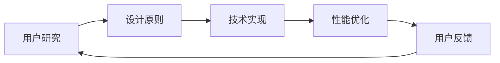

                 

### 文章标题

# 从技术角度优化用户体验

### 关键词

用户体验（UX）、技术优化、前端开发、后端服务、性能优化、设计原则

### 摘要

本文从技术角度深入探讨用户体验（UX）优化的策略和方法。通过用户研究、设计原则、技术实现和性能优化四个方面的详细解析，结合实际案例，我们将了解如何通过技术手段提升用户体验，从而在激烈的市场竞争中脱颖而出。

### 目录

## 第一部分：用户体验基础

### 第1章：用户体验概述

### 第2章：用户研究方法

### 第3章：设计原则

## 第二部分：技术实现

### 第4章：前端开发与用户体验

### 第5章：后端服务与用户体验

### 第6章：API集成与用户体验

## 第三部分：性能优化

### 第7章：性能优化方法

### 第8章：案例分析

## 第四部分：总结与展望

### 第9章：总结与展望

### 第一部分：用户体验基础

### 第1章：用户体验概述

### 第1章：用户体验概述

#### 1.1 用户体验的定义和重要性

用户体验（User Experience，简称UX）是用户在使用产品或服务过程中所获得的整体感受和体验。它涵盖了用户在交互、使用、购买以及售后支持等各个环节的感受。用户体验的重要性不言而喻，因为它是产品或服务成功的关键因素之一。以下从几个方面来阐述用户体验的定义和重要性：

**定义：**  
用户体验不仅仅是指用户界面的美观程度，还包括用户在使用产品或服务过程中的情绪、感受、认知和行为。它是一种主观的感受，难以量化，但直接影响用户的满意度和忠诚度。

**重要性：**  
1. 提高用户满意度：良好的用户体验能够提升用户对产品或服务的满意度，增加用户的粘性，从而促进复购和口碑传播。
2. 增强品牌形象：用户体验是品牌形象的重要组成部分，优秀的用户体验能够提升品牌在用户心中的形象，增强品牌竞争力。
3. 提高用户转化率：用户体验直接影响用户的购买决策，良好的用户体验能够提高用户转化率，促进业务增长。
4. 降低用户流失率：用户体验不佳会导致用户流失，优化用户体验能够降低用户流失率，提高用户留存率。

#### 1.2 用户体验设计的核心原则

用户体验设计需要遵循一系列核心原则，这些原则有助于确保产品设计能够满足用户需求，提升用户体验。以下是几个重要的核心原则：

1. **以用户为中心**：用户体验设计应始终围绕用户的需求和体验来展开，确保产品设计满足用户的核心需求，而不是仅仅追求视觉效果。
2. **简洁性**：简洁明了的设计能够让用户更快地理解和使用产品，减少用户的学习成本。
3. **一致性**：界面元素的一致性能够让用户在使用不同模块时感到顺畅，避免用户在操作过程中产生困惑。
4. **易用性**：设计应充分考虑用户的操作习惯，提供直观的交互方式，确保用户能够轻松完成所需操作。
5. **反馈机制**：及时、明确的反馈能够帮助用户了解操作结果，提高用户的信心和满意度。
6. **可访问性**：设计应考虑到不同用户群体（如老年人、视力障碍者等）的需求，确保产品能够被广泛使用。

#### 1.3 用户体验设计的发展历程

用户体验设计的发展历程经历了几个重要的阶段，从早期的用户界面设计到现代的全面用户体验设计，每个阶段都有其独特的特点和发展方向。

1. **用户界面设计（UI）**：早期用户体验设计主要集中在用户界面设计上，强调视觉美感和易用性。界面设计师通过图形和颜色来吸引用户，同时确保界面的操作简单易懂。
2. **可用性工程（Usability Engineering）**：随着互联网的兴起，用户体验设计开始关注产品的可用性，强调用户能否高效地完成特定任务。可用性工程师通过可用性测试和用户反馈来优化产品设计。
3. **用户体验设计（UXD）**：用户体验设计逐渐从界面设计扩展到整个用户旅程，包括用户需求分析、交互设计、信息架构等。用户体验设计师需要具备更广泛的知识和技能，以全面提升用户体验。
4. **全渠道用户体验（Holistic UX）**：现代用户体验设计不仅关注线上产品，还涉及线下体验、多渠道整合等。设计师需要考虑用户在不同场景下的体验，确保用户体验的一致性和连贯性。

#### 1.4 用户体验设计的关键环节

用户体验设计包含多个关键环节，每个环节都对最终的用户体验产生重要影响。以下是用户体验设计的主要环节：

1. **需求分析**：通过用户调研、市场分析等方法，了解用户的需求和痛点，为后续设计提供依据。
2. **信息架构**：梳理产品的信息结构，确保用户能够快速找到所需信息，提高信息查找的效率。
3. **交互设计**：设计用户与产品之间的交互方式，包括界面布局、按钮操作、导航结构等，确保用户能够轻松、高效地完成任务。
4. **视觉设计**：通过色彩、图形、字体等元素，提升产品的美观度和视觉吸引力，增强用户体验。
5. **可用性测试**：通过实际用户测试，发现并解决设计中的问题，确保产品在真实使用场景中的易用性。

#### 1.5 用户体验设计中的挑战

用户体验设计虽然重要，但面临着许多挑战：

1. **用户需求的不确定性**：用户需求多变，设计师需要不断调整设计方案以适应用户需求。
2. **技术限制**：技术实现可能限制用户体验设计，设计师需要在技术限制和用户体验之间找到平衡。
3. **资源限制**：设计团队可能面临时间、预算等方面的限制，影响用户体验设计的实施。
4. **团队合作**：用户体验设计涉及多个部门（如产品、开发、市场等），需要有效沟通和协作，确保设计方案的顺利实施。

#### 1.6 成功的用户体验案例

成功的用户体验设计案例能够为其他项目提供有益的参考。以下是一些成功的用户体验设计案例：

1. **苹果公司**：苹果公司的产品以其出色的用户体验而闻名，从iOS操作系统到Mac电脑，苹果公司始终注重用户体验设计，为用户提供了简单、直观、美观的产品。
2. **Airbnb**：Airbnb通过用户生成的内容和清晰的搜索界面，为用户提供了一个便捷的租房平台，让用户能够轻松找到心仪的房源。
3. **优步**：优步通过简洁的界面和高效的叫车流程，为用户提供了便捷的出行服务，提升了用户体验。

通过这些案例，我们可以看到，成功的用户体验设计不仅仅是视觉上的美观，更是功能上的实用和便捷。

### 小结

用户体验设计是产品或服务成功的关键因素之一。通过深入了解用户体验的定义、重要性、设计原则和发展历程，我们能够更好地理解用户体验设计的核心内容和目标。在接下来的章节中，我们将进一步探讨用户研究方法、设计原则、技术实现和性能优化等方面的内容，为提升用户体验提供更加具体的指导。

### 第2章：用户研究方法

#### 2.1 用户研究的基本流程

用户研究是用户体验设计的重要组成部分，通过用户研究，我们能够深入了解用户的需求、行为和痛点，从而为产品设计提供有力支持。用户研究的基本流程包括以下几个关键步骤：

1. **需求分析**：在开始用户研究之前，我们需要明确研究的目标和需求。需求分析可以通过市场调研、业务需求分析、用户访谈等方式进行，确保研究具有明确的方向和目标。

2. **用户调研**：用户调研是用户研究的重要环节，通过问卷调查、用户访谈、焦点小组讨论等方式，收集用户对产品或服务的看法和意见。问卷调查是一种高效的收集用户反馈的方法，可以通过线上或线下方式进行。用户访谈则可以深入了解用户的需求和痛点，为产品设计提供详细的数据支持。

3. **数据分析**：用户调研完成后，我们需要对收集到的数据进行分析，识别用户的主要需求和痛点。数据分析可以通过定量分析和定性分析进行，定量分析主要关注数据的数量和趋势，定性分析则关注用户的具体反馈和意见。

4. **原型设计**：在数据分析的基础上，我们可以设计用户原型，通过原型设计，我们可以模拟用户的使用场景，检验产品的可行性。原型设计可以使用各种工具，如Axure、Sketch、Figma等，确保原型能够直观地展示产品的功能和使用流程。

5. **可用性测试**：可用性测试是用户研究的最终环节，通过实际用户测试，我们可以验证原型的可行性和用户体验。可用性测试可以在线上或线下进行，测试过程中，我们可以观察用户的操作行为，收集用户对产品的反馈和意见。

#### 2.2 调查问卷与数据分析

调查问卷是用户研究中最常用的方法之一，通过设计合理的问卷，我们可以收集大量的用户数据，从而深入了解用户的需求和行为。以下是调查问卷设计的基本步骤：

1. **明确研究目标**：在设计问卷之前，我们需要明确研究的目标，包括研究的问题、目标用户群体等。明确的研究目标有助于我们设计出更具针对性的问卷。

2. **设计问卷题目**：问卷题目应简洁明了，避免复杂和冗长的表述。题目类型可以包括单选题、多选题、填空题和开放性问题等。在题目设计中，我们需要注意以下几点：

   - **相关性**：确保题目与研究目标相关，避免无关或重复的题目。
   - **中立性**：题目应保持中立，避免引导用户回答特定的问题。
   - **清晰性**：题目应简洁明了，避免歧义和模糊的表述。

3. **数据收集与处理**：在问卷设计完成后，我们需要通过线上或线下方式收集用户数据。收集到的数据可以通过Excel、SPSS等工具进行处理和分析，提取出有用的信息。

4. **数据分析方法**：数据分析主要包括定量分析和定性分析。定量分析主要关注数据的数量和趋势，如用户满意度评分、使用频率等；定性分析则关注用户的具体反馈和意见，如开放性问题的回答内容。

数据分析的方法包括：

- **描述性统计**：通过统计方法（如平均值、标准差等）描述数据的分布和趋势。
- **交叉分析**：通过交叉表格分析，了解不同变量之间的关系，如用户满意度与使用频率之间的关系。
- **回归分析**：通过回归模型，分析变量之间的因果关系。

#### 2.3 用户访谈与观察

用户访谈和观察是深入了解用户需求和行为的有效方法，通过访谈和观察，我们可以获取用户对产品或服务的真实反馈和体验。

1. **访谈方法**：

   - **结构化访谈**：在结构化访谈中，访谈者按照预定的题目和问题进行提问，确保访谈过程的标准化和一致性。
   - **非结构化访谈**：在非结构化访谈中，访谈者可以自由地与用户进行交流，深入了解用户的需求和体验。

2. **观察方法**：

   - **现场观察**：在用户实际使用产品的过程中，观察者的观察行为不会影响用户的正常操作，从而获取真实的用户行为数据。
   - **远程观察**：通过远程视频或屏幕共享等方式，观察用户在虚拟环境中的操作行为。

3. **访谈与观察的记录与分析**：

   - **记录与分析**：访谈和观察过程中，我们需要记录用户的反馈和行为，通过录音、录像或笔记等方式进行记录。在记录完成后，我们需要对记录的数据进行分析，提取出有用的信息。

4. **访谈与观察的注意事项**：

   - **中立性**：访谈者和观察者应保持中立，避免引导用户回答特定的问题。
   - **隐私保护**：在访谈和观察过程中，我们需要保护用户的隐私，确保用户的信息不被泄露。

#### 2.4 实地调研与数据分析

实地调研是深入了解用户行为和需求的有效方法，通过实地观察、用户访谈等方式，我们可以获取真实的用户数据。

1. **实地调研的方法**：

   - **现场观察**：在用户的实际使用场景中，观察用户的行为和操作，了解用户的需求和痛点。
   - **用户访谈**：通过面对面的访谈，深入了解用户的需求和期望。

2. **数据分析的方法**：

   - **描述性统计**：通过统计方法描述用户的行为特征，如使用频率、使用时长等。
   - **交叉分析**：通过交叉表格分析，了解不同变量之间的关系，如用户满意度与使用频率之间的关系。

3. **实地调研与数据分析的注意事项**：

   - **数据真实性**：确保收集到的数据真实可靠，避免数据偏差。
   - **样本代表性**：选择具有代表性的样本，确保调研结果具有普遍性。

#### 2.5 用户旅程地图与用户体验分析

用户旅程地图（User Journey Map）是描述用户在使用产品或服务过程中的主要交互路径和体验的一种可视化工具。通过用户旅程地图，我们可以全面了解用户的体验，发现潜在的问题和改进点。

1. **用户旅程地图的构建**：

   - **用户旅程步骤**：列出用户在使用产品或服务过程中的关键步骤，如注册、登录、浏览、购买等。
   - **用户体验要素**：描述每个步骤中用户的体验，包括用户的情感、期望、困惑等。
   - **关键决策点**：标识用户在关键决策点上的体验，如是否继续购买、是否取消订单等。

2. **用户体验分析**：

   - **识别问题**：通过用户旅程地图，我们可以识别用户在体验过程中遇到的问题，如页面加载缓慢、操作步骤繁琐等。
   - **优化方案**：针对识别出的问题，提出优化方案，如优化页面加载速度、简化操作步骤等。

#### 2.6 竞争对手分析

竞争对手分析是用户研究的重要环节，通过分析竞争对手的产品、用户体验、市场策略等，我们可以了解市场趋势和用户需求，为自身的产品设计提供参考。

1. **竞争对手分析的方法**：

   - **产品分析**：比较竞争对手的产品功能、设计、性能等，了解竞争对手的优势和不足。
   - **用户体验分析**：分析竞争对手的用户体验，包括界面设计、交互流程、用户满意度等。
   - **市场策略分析**：了解竞争对手的市场策略，如定价策略、推广策略等。

2. **竞争对手分析的注意事项**：

   - **全面性**：确保分析覆盖竞争对手的各个方面，避免遗漏关键信息。
   - **客观性**：保持客观公正的态度，避免主观偏见。

#### 2.7 用户研究在实际项目中的应用

用户研究在实际项目中具有重要的指导作用，通过用户研究，我们可以了解用户的需求和痛点，从而为项目设计提供依据。

1. **需求分析**：在项目初期，通过用户研究了解用户的需求和痛点，为项目设计提供方向。
2. **原型设计**：在原型设计阶段，通过用户研究验证原型的可行性，收集用户的反馈和建议。
3. **迭代优化**：在项目开发过程中，通过用户研究持续优化产品，提升用户体验。

#### 2.8 用户研究的挑战与解决方案

用户研究在实际应用中面临着许多挑战，如用户需求的不确定性、数据隐私保护、资源限制等。以下是用户研究的挑战及解决方案：

1. **用户需求不确定性**：解决方案：通过多轮用户研究，不断迭代优化设计方案，确保满足用户需求。
2. **数据隐私保护**：解决方案：采取严格的隐私保护措施，确保用户数据的安全性和隐私性。
3. **资源限制**：解决方案：合理分配资源，确保用户研究的时间和经费。

#### 2.9 成功的用户研究案例

以下是一些成功的用户研究案例，这些案例展示了用户研究在提升用户体验方面的关键作用：

1. **谷歌**：谷歌通过用户研究不断优化其搜索引擎和广告系统，提高了用户的使用体验和满意度。
2. **苹果**：苹果公司在设计iPhone时，通过用户研究了解用户的需求和期望，从而推出了备受好评的产品。
3. **亚马逊**：亚马逊通过用户研究优化了其购物体验，提升了用户的购物满意度和转化率。

通过这些案例，我们可以看到用户研究在提升用户体验方面的关键作用。在接下来的章节中，我们将进一步探讨设计原则、技术实现和性能优化等方面的内容，为提升用户体验提供更加具体的指导。

### 小结

用户研究是用户体验设计的重要组成部分，通过用户研究，我们能够深入了解用户的需求、行为和痛点，为产品设计提供有力支持。本章详细介绍了用户研究的基本流程、调查问卷与数据分析、用户访谈与观察、实地调研与数据分析、用户旅程地图与用户体验分析、竞争对手分析、用户研究在实际项目中的应用以及用户研究的挑战与解决方案。在接下来的章节中，我们将进一步探讨设计原则和技术实现等方面的内容，为提升用户体验提供更加具体的指导。

### 第3章：设计原则

#### 3.1 简洁性

简洁性是用户体验设计中的一个重要原则，它要求设计师在设计中尽量减少不必要的元素和操作步骤，使界面和流程简洁明了。简洁性不仅能够降低用户的学习成本，还能提高用户的操作效率和满意度。

**原则具体应用：**

1. **减少冗余信息**：在界面设计中，应避免过多的文字、图片和按钮等元素，确保信息传递清晰，用户能够快速找到所需信息。

2. **简化操作流程**：设计时应尽量简化用户的操作步骤，减少点击和输入次数。例如，在购物网站中，简化购物车和结账流程，提供一步式结账选项。

3. **统一界面风格**：保持界面元素的一致性，包括字体、颜色、图标等，使用户在操作过程中能够感受到一致性，减少困惑。

**案例分析：**

- **Airbnb**：Airbnb的界面设计简洁明了，用户只需几步操作就能完成房源搜索和预订。这种简洁性大大提高了用户的操作效率和满意度。

#### 3.2 一致性

一致性原则要求设计师在设计过程中保持界面元素、交互方式和用户体验的一致性，以确保用户在使用过程中能够流畅、顺畅地完成任务。

**原则具体应用：**

1. **界面元素一致性**：保持按钮、图标、文本等界面元素的统一设计风格，使用户在不同页面和功能中能够快速识别和操作。

2. **交互方式一致性**：在界面交互中，应遵循相同的操作逻辑和反馈机制，例如，点击按钮后出现相同的动画效果和提示信息。

3. **用户体验一致性**：保持用户体验的一致性，包括用户在不同设备、平台上的体验，确保用户在不同场景下能够感受到一致的体验。

**案例分析：**

- **谷歌**：谷歌的界面设计遵循一致性原则，无论是移动端还是桌面端，用户都能感受到一致的操作方式和体验。这种一致性大大提高了用户的操作效率和满意度。

#### 3.3 易用性

易用性原则要求设计师在设计中充分考虑用户的操作习惯和认知，确保用户能够轻松、高效地完成任务。

**原则具体应用：**

1. **直观性**：设计应直观易懂，避免复杂的操作流程和界面布局，使用户能够快速理解和使用产品。

2. **清晰性**：界面和交互应清晰明了，避免模糊的提示和操作，确保用户能够明确知道如何进行下一步操作。

3. **适应性**：设计应具备一定的适应性，能够根据用户的不同需求和场景进行调整，使不同类型的用户都能找到适合自己的操作方式。

**案例分析：**

- **苹果**：苹果的产品设计在易用性方面表现出色，无论是iOS系统还是Mac电脑，用户都能感受到直观、清晰的操作体验。这种易用性大大提高了用户的操作效率和满意度。

#### 3.4 反馈机制

反馈机制是用户体验设计中的一个重要环节，它能够帮助用户了解自己的操作结果，增强用户的信心和满意度。

**原则具体应用：**

1. **即时反馈**：在用户进行操作时，应提供即时反馈，如点击按钮后立即出现动画效果和提示信息，让用户感受到操作的即时性。

2. **明确反馈**：反馈信息应明确易懂，避免使用专业术语或模糊的表述，确保用户能够准确理解操作结果。

3. **错误反馈**：当用户操作错误时，应提供明确的错误反馈，帮助用户了解错误原因并指导用户如何纠正。

**案例分析：**

- **亚马逊**：亚马逊在用户操作过程中提供了丰富的即时反馈，例如，当用户将商品加入购物车时，页面会立即显示相应的提示信息。这种反馈机制增强了用户的操作信心和满意度。

#### 3.5 可访问性

可访问性原则要求设计师在设计中考虑到不同用户群体的需求，确保产品能够被广泛使用。

**原则具体应用：**

1. **无障碍设计**：设计应考虑视障、听障、行动障碍等特殊用户群体的需求，提供无障碍的访问和使用方式。

2. **多语言支持**：设计应提供多语言支持，使不同国家和地区的用户都能使用产品。

3. **可调整性**：设计应具备一定的可调整性，如字体大小、颜色对比度等，使不同需求的用户能够根据自身情况进行调整。

**案例分析：**

- **微软**：微软的Office系列软件提供了丰富的可访问性设置，包括屏幕阅读器支持、多语言界面等，使各种用户都能轻松使用软件。这种可访问性设计提升了产品的普及率和用户体验。

#### 3.6 个性化

个性化原则要求设计师在设计中考虑用户的个性化需求，提供定制化的服务，提升用户的满意度和忠诚度。

**原则具体应用：**

1. **用户数据收集**：通过用户数据收集，了解用户的行为习惯、偏好和需求，为个性化设计提供依据。

2. **个性化推荐**：根据用户的历史行为和偏好，提供个性化的内容和推荐，提升用户的兴趣和参与度。

3. **自定义设置**：提供自定义设置功能，让用户可以根据自己的需求和喜好调整产品的界面和功能。

**案例分析：**

- **亚马逊**：亚马逊通过用户数据分析和个性化推荐，为用户提供个性化的购物体验。例如，根据用户的浏览和购买历史，推荐相关的商品。这种个性化设计提升了用户的满意度和忠诚度。

#### 3.7 故事化

故事化原则要求设计师在设计中通过故事化的方式传递信息，使界面和交互具有情感和温度，提升用户体验。

**原则具体应用：**

1. **故事情节**：在设计中融入故事情节，使界面和交互具有故事性，提升用户的兴趣和参与度。

2. **角色塑造**：通过角色塑造，使用户在操作过程中感受到人物的存在，增强用户的代入感。

3. **情感设计**：通过情感设计，使界面和交互具有情感温度，提升用户的情感体验。

**案例分析：**

- **迪士尼**：迪士尼的官方网站和应用程序通过故事化的设计，使用户在浏览和操作过程中感受到迪士尼角色的存在，提升用户的兴趣和参与度。

#### 3.8 可持续性

可持续性原则要求设计师在设计中考虑环境和社会责任，确保产品的长期可持续性。

**原则具体应用：**

1. **资源优化**：通过优化设计，减少资源的浪费，降低产品的环境影响。

2. **绿色设计**：采用环保材料，减少对环境的污染。

3. **社会责任**：通过设计促进社会责任的履行，如关注弱势群体、推广公益项目等。

**案例分析：**

- **宜家**：宜家在产品设计过程中注重可持续性，采用环保材料，减少产品对环境的污染。同时，宜家还积极推广公益项目，履行社会责任。

### 小结

设计原则是用户体验设计中的重要基础，通过简洁性、一致性、易用性、反馈机制、可访问性、个性化、故事化和可持续性等原则的应用，设计师能够创造出更加优质、高效和用户满意的产品。在接下来的章节中，我们将探讨技术实现和性能优化等方面的内容，继续为提升用户体验提供具体指导。

### 第4章：前端开发与用户体验

#### 4.1 前端开发基础

前端开发是构建现代网站和应用程序的核心环节，它涉及到HTML、CSS和JavaScript等基础技术。前端开发的主要目标是确保用户在使用网站或应用程序时获得良好的体验。

**核心技术**

1. **HTML（HyperText Markup Language）**：HTML是网页内容的结构化语言，定义了网页的元素和内容。它是一种标记语言，用于创建网页的基本结构。
   
2. **CSS（Cascading Style Sheets）**：CSS用于设置网页元素的样式，包括颜色、字体、布局等。它允许开发者将样式与内容分离，提高代码的可维护性。

3. **JavaScript**：JavaScript是一种客户端脚本语言，用于实现网页的动态效果和交互功能。它允许开发者创建复杂的用户界面和行为。

**前端开发工具**

1. **Web开发框架**：如React、Vue、Angular等，这些框架提供了组件化、数据绑定等机制，简化了前端开发过程。

2. **版本控制工具**：如Git，用于管理代码版本和协同工作。

3. **打包工具**：如Webpack、Gulp等，用于优化和打包项目资源。

**前端开发流程**

1. **需求分析**：与产品经理、设计师等协作，明确项目需求。

2. **设计稿转换**：将设计稿转换为HTML和CSS代码。

3. **编写JavaScript代码**：实现网页的动态效果和交互功能。

4. **代码审查与优化**：确保代码质量，进行性能和安全性优化。

5. **测试与部署**：进行功能测试和性能测试，确保网站或应用程序的稳定性和可靠性。

#### 4.2 用户体验在前端开发中的应用

用户体验（UX）是前端开发的重要目标，设计师和开发者需要紧密合作，确保产品能够满足用户需求并提供出色的体验。

**交互设计**

交互设计涉及用户与产品之间的交互流程和操作方式。在前端开发中，交互设计可以通过以下方式应用：

1. **响应式设计**：使用CSS和JavaScript实现响应式布局，确保网页在不同设备和屏幕尺寸上都能良好显示。

2. **触觉反馈**：在移动设备上，通过触摸反馈（如点击、滑动等）提升用户体验。

3. **动画和过渡效果**：使用CSS和JavaScript创建动画和过渡效果，提升网页的视觉吸引力和操作流畅性。

**界面设计**

界面设计是用户体验的核心组成部分，前端开发者需要与设计师协作，确保网页界面美观且易用。

1. **色彩搭配**：选择合适的色彩搭配，提升网页的美观度。

2. **字体选择**：使用易于阅读的字体，确保网页内容的可读性。

3. **排版布局**：合理布局网页元素，确保界面清晰、简洁。

**前端性能优化**

性能优化是提升用户体验的关键因素之一。以下是一些前端性能优化的方法：

1. **资源压缩**：使用工具如Gulp或Webpack对CSS和JavaScript文件进行压缩，减少文件大小。

2. **懒加载**：对于大型图片和资源，使用懒加载技术，只在需要时加载，减少页面加载时间。

3. **缓存策略**：设置合理的缓存策略，提高页面加载速度。

#### 4.3 前端性能优化

前端性能优化是确保网页和应用程序快速、稳定运行的重要措施。以下是一些具体的技术和工具：

1. **懒加载（Lazy Loading）**

   懒加载是一种优化网页性能的技术，它允许在用户滚动到特定内容时才加载相应的资源，从而减少初始加载时间。以下是一个简单的JavaScript实现：

   ```javascript
   document.addEventListener("DOMContentLoaded", function() {
       let lazyImages = document.querySelectorAll("img.lazy");
       lazyImages.forEach(function(img) {
           img.src = img.dataset.src;
       });
   });
   ```

2. **代码分割（Code Splitting）**

   代码分割是将代码拆分为多个部分，只在需要时加载相应的部分，以减少初始加载时间。Webpack提供了代码分割的功能，以下是一个简单的配置示例：

   ```javascript
   {
       optimization: {
           splitChunks: {
               chunks: 'all',
           },
       },
   }
   ```

3. **内容分发网络（CDN）**

   CDN是一种分布式网络，它可以将网页资源缓存到全球多个节点，从而提高访问速度。以下是一个简单的配置示例：

   ```html
   <link rel="stylesheet" href="https://cdn.example.com/css/main.css">
   ```

4. **浏览器缓存（Browser Caching）**

   浏览器缓存可以缓存网页资源，从而在用户再次访问时加快加载速度。以下是一个简单的配置示例：

   ```http
   Cache-Control: public, max-age=31536000
   ```

#### 4.4 前端开发中的最佳实践

1. **代码规范**：遵循统一的代码规范，确保代码的可读性和可维护性。

2. **模块化开发**：将代码拆分为多个模块，便于管理和维护。

3. **版本控制**：使用版本控制工具（如Git）管理代码，确保代码的版本一致性和可追溯性。

4. **自动化测试**：编写自动化测试脚本，确保代码的质量和稳定性。

5. **持续集成（CI）**：使用持续集成工具（如Jenkins）自动构建和部署代码，提高开发效率。

#### 4.5 前端开发中的挑战与解决方案

1. **兼容性问题**：不同浏览器和设备对HTML、CSS和JavaScript的支持程度不同，可能导致兼容性问题。解决方案是使用现代浏览器检测库（如Babel、Polyfill）和CSS预处理器（如Sass、LESS）。

2. **性能瓶颈**：前端性能优化可能遇到瓶颈，如JavaScript执行时间过长、资源加载缓慢等。解决方案是进行性能分析（如使用Chrome DevTools），找出瓶颈并优化。

3. **团队协作**：前端开发涉及多个角色（如设计师、开发者、测试人员等），需要有效的团队协作。解决方案是使用敏捷开发方法和工具（如Jira、Trello）。

#### 4.6 前端开发案例

1. **案例一：电商网站**

   电商网站需要高性能和良好的用户体验，以下是一些具体的技术实现：

   - **React**：使用React进行组件化开发，提高代码可维护性和性能。

   - **Webpack**：使用Webpack进行代码分割和打包，优化加载速度。

   - **懒加载**：实现图片和资源的懒加载，减少初始加载时间。

2. **案例二：社交媒体应用**

   社交媒体应用需要支持实时交互和高并发，以下是一些具体的技术实现：

   - **Vue**：使用Vue进行前端开发，提高开发效率。

   - **WebSocket**：使用WebSocket实现实时数据传输，提高交互性能。

   - **Node.js**：使用Node.js构建后端服务，支持高并发和实时交互。

#### 4.7 前端开发中的新兴技术

1. **WebAssembly（WASM）**：WebAssembly是一种新型的网页技术，它可以在网页上运行高性能的代码，提高网页的性能。

2. **PWA（Progressive Web Apps）**：PWA是一种结合了网页和移动应用的渐进式应用，它提供更好的用户体验和离线功能。

3. **CSS Grid和Flexbox**：CSS Grid和Flexbox是用于布局的两种强大技术，它们提供了更灵活和高效的布局方式。

### 小结

前端开发是用户体验设计的重要组成部分，通过HTML、CSS、JavaScript等技术，开发者可以构建高性能、美观且易用的网站和应用程序。本章详细介绍了前端开发的基础、用户体验在前端开发中的应用、前端性能优化、最佳实践、挑战与解决方案以及新兴技术。在接下来的章节中，我们将进一步探讨后端服务与用户体验、API集成与用户体验等方面的内容，为提升用户体验提供更加具体的指导。

### 第5章：后端服务与用户体验

#### 5.1 后端开发基础

后端开发是构建现代网站和应用程序的核心环节，它涉及数据库、服务器、应用程序和算法等技术。后端开发的主要目标是确保数据的存储、处理和传输能够高效、安全地进行，从而提供良好的用户体验。

**核心技术**

1. **数据库**：数据库用于存储和管理数据，常见的数据库类型包括关系型数据库（如MySQL、PostgreSQL）和非关系型数据库（如MongoDB、Redis）。

2. **服务器**：服务器用于托管应用程序和数据库，常见的服务器包括Apache、Nginx和IIS。

3. **应用程序框架**：应用程序框架如Spring、Django、Rails等，提供了结构化和规范化的开发方式，简化了后端开发过程。

4. **编程语言**：常见的后端编程语言包括Java、Python、Ruby、Go等。

**后端开发流程**

1. **需求分析**：与产品经理、前端开发者等协作，明确项目需求。

2. **数据库设计**：设计数据库结构，包括表结构、关系和索引。

3. **后端架构设计**：设计应用程序的架构，包括模块划分、接口定义和安全性考虑。

4. **编写代码**：根据设计文档编写后端代码，实现数据处理和存储功能。

5. **测试与优化**：进行功能测试和性能测试，确保后端服务的稳定性和高效性。

6. **部署与维护**：将后端服务部署到服务器，并进行日常维护和更新。

#### 5.2 后端服务对用户体验的影响

后端服务对用户体验有着直接的影响，以下从几个方面来探讨后端服务对用户体验的影响：

**响应速度**：后端服务的响应速度直接影响用户的操作体验。如果后端服务响应缓慢，用户可能会感到不耐烦，甚至放弃使用产品。

**数据准确性**：后端服务负责处理和存储数据，数据准确性对用户体验至关重要。如果数据出现错误或丢失，用户可能会对产品产生不信任感。

**安全性**：后端服务需要确保用户数据的安全性和隐私性。如果用户数据被泄露或滥用，将严重损害用户体验和品牌形象。

**可扩展性**：后端服务的可扩展性对用户体验有着长远的影响。随着用户规模的扩大，后端服务需要能够快速扩展以应对增长的需求，否则将导致用户体验下降。

#### 5.3 后端服务的性能优化

性能优化是提升用户体验的重要措施，以下是一些常见的后端服务性能优化方法：

**负载均衡**：通过负载均衡器（如Nginx、HAProxy）将请求分配到多台服务器，提高系统的处理能力和可靠性。

**缓存**：使用缓存技术（如Redis、Memcached）减少数据库的访问频率，提高系统的响应速度。

**数据库优化**：通过索引、分区、分库分表等技术优化数据库性能，提高数据访问速度。

**异步处理**：使用异步处理技术（如消息队列、WebSocket）减少同步操作对系统性能的影响，提高系统的响应速度。

**服务拆分**：将大型服务拆分为多个独立的服务，提高系统的灵活性和可扩展性。

**代码优化**：通过代码优化（如算法改进、数据结构优化）减少系统的计算和内存消耗，提高系统的性能。

**监控与报警**：使用监控工具（如Prometheus、Grafana）实时监控系统性能，及时发现和处理性能问题。

#### 5.4 后端服务的安全性

安全性是后端服务的核心要求之一，以下是一些常见的后端服务安全性措施：

**身份验证与授权**：使用身份验证和授权机制（如OAuth 2.0、JWT）确保用户访问权限，防止未授权访问。

**数据加密**：使用加密技术（如SSL/TLS）保护数据在传输过程中的安全性，防止数据被窃取或篡改。

**访问控制**：使用访问控制列表（ACL）或角色权限控制（RBAC）确保用户只能访问授权的数据和功能。

**输入验证**：对用户输入进行严格验证，防止SQL注入、XSS攻击等安全漏洞。

**日志记录与审计**：记录系统操作日志和审计日志，以便在发生安全事件时进行追踪和调查。

**安全配置**：确保服务器和应用程序的安全配置，如禁用不必要的功能、更新安全补丁等。

**安全培训**：对开发人员和运维人员进行安全培训，提高他们的安全意识和防范能力。

#### 5.5 后端服务监控与调试

后端服务的监控与调试是确保系统稳定性和可靠性的重要措施，以下是一些常见的监控与调试工具和方法：

**日志分析**：使用日志分析工具（如ELK Stack、Logstash）实时收集和分析系统日志，发现潜在问题和异常。

**性能监控**：使用性能监控工具（如Prometheus、Grafana）实时监控系统性能指标（如CPU使用率、内存使用率、响应时间等），及时发现和处理性能问题。

**调试工具**：使用调试工具（如GDB、IDE调试器）定位和解决代码中的错误和问题。

**A/B测试**：通过A/B测试方法，对比不同后端服务配置和策略的效果，优化系统性能和用户体验。

**灰度发布**：通过灰度发布方法，逐步将新功能或配置上线，降低对系统的影响和风险。

#### 5.6 后端开发中的最佳实践

**代码规范**：遵循统一的代码规范，确保代码的可读性和可维护性。

**模块化开发**：将后端代码拆分为多个模块，便于管理和维护。

**文档化**：编写详细的开发文档和API文档，方便后续开发和维护。

**版本控制**：使用版本控制工具（如Git）管理代码，确保代码的版本一致性和可追溯性。

**自动化测试**：编写自动化测试脚本，确保代码的质量和稳定性。

**持续集成**：使用持续集成工具（如Jenkins）自动构建和部署代码，提高开发效率。

**团队协作**：使用敏捷开发方法和工具（如Jira、Trello），确保团队成员之间的有效沟通和协作。

#### 5.7 后端开发中的挑战与解决方案

**兼容性问题**：不同数据库和服务器对技术的支持程度不同，可能导致兼容性问题。解决方案是使用标准化技术和兼容性库（如MySQL Connector、PostgreSQL JDBC）。

**性能瓶颈**：后端服务可能遇到性能瓶颈，如数据库查询效率低下、网络延迟等。解决方案是进行性能分析（如使用New Relic、Apache JMeter），找出瓶颈并优化。

**团队协作**：后端开发涉及多个角色（如开发、测试、运维等），需要有效的团队协作。解决方案是使用敏捷开发方法和工具（如Scrum、Kanban），提高团队协作效率。

#### 5.8 后端开发案例

**案例一：社交媒体应用**

社交媒体应用需要处理大量用户数据和实时交互，以下是一些具体的技术实现：

- **Django**：使用Django进行后端开发，简化开发过程。

- **Redis**：使用Redis进行缓存，提高系统性能。

- **消息队列**：使用消息队列（如RabbitMQ、Kafka）处理大规模实时消息。

**案例二：电商网站**

电商网站需要处理大量商品数据和用户订单，以下是一些具体的技术实现：

- **Spring Boot**：使用Spring Boot进行后端开发，提高开发效率。

- **MySQL**：使用MySQL进行数据存储和管理。

- **Elasticsearch**：使用Elasticsearch进行商品搜索和索引，提高搜索性能。

### 小结

后端开发是用户体验设计的重要组成部分，通过数据库、服务器、应用程序和算法等技术，开发者可以构建高效、安全且可靠的后端服务。本章详细介绍了后端开发的基础、后端服务对用户体验的影响、性能优化、安全性、监控与调试、最佳实践、挑战与解决方案以及具体案例。在接下来的章节中，我们将进一步探讨API集成与用户体验、性能优化等方面的内容，为提升用户体验提供更加具体的指导。

### 第6章：API集成与用户体验

#### 6.1 API集成的基本概念

API（Application Programming Interface）集成是现代软件开发中的一项核心技术，它允许不同软件系统之间进行数据交换和功能调用。API集成使应用程序能够访问外部服务或系统，从而扩展其功能和增强用户体验。

**定义与重要性**

API是一种编程接口，它定义了软件系统之间进行交互的方式和规则。通过API，开发人员可以在不暴露底层实现细节的情况下，访问和使用外部服务或系统提供的功能。

API集成的重要性体现在以下几个方面：

1. **功能扩展**：通过集成第三方API，应用程序可以快速扩展其功能，无需从零开始开发。
2. **数据共享**：API集成使得不同系统之间的数据共享变得简单，从而实现数据的整合和互通。
3. **用户体验提升**：通过集成外部服务，应用程序可以提供更加丰富和个性化的用户体验。

**常见类型**

API可以分为以下几种类型：

1. **公开API（Public API）**：供公众访问的API，通常不限制使用次数。
2. **私有API（Private API）**：仅限内部使用，对外不公开。
3. **合作伙伴API（Partner API）**：供合作伙伴访问的API，通常用于业务合作。
4. **内部API（Internal API）**：仅限系统内部使用的API，用于模块化开发和系统集成。

**API集成过程**

API集成通常包括以下步骤：

1. **API文档阅读**：了解API的功能、接口定义、请求参数和响应格式。
2. **API调用**：编写代码调用API，处理请求和响应。
3. **错误处理**：处理API调用中的错误，如请求失败、响应格式错误等。
4. **数据验证**：验证API返回的数据是否符合预期，确保数据的准确性和完整性。

#### 6.2 API设计对用户体验的影响

API设计直接影响应用程序的用户体验，以下从几个方面探讨API设计对用户体验的影响：

**响应速度**：API响应速度对用户体验至关重要。如果API调用频繁发生延迟或失败，用户可能会感到沮丧和不满。

**易用性**：良好的API设计应易于使用和理解，减少开发者的学习和使用成本。复杂的API接口和参数设计可能使开发者难以正确调用和整合API。

**稳定性**：API的稳定性对用户体验有着重要的影响。频繁的API故障或响应不一致会导致用户体验下降。

**安全性**：API安全性对用户体验和系统安全至关重要。如果API被恶意攻击或滥用，可能导致数据泄露或系统崩溃。

**可扩展性**：良好的API设计应具备良好的可扩展性，以适应未来的需求变化和功能扩展。

#### 6.3 API性能优化

API性能优化是提升用户体验的重要措施，以下是一些常见的API性能优化方法：

**负载均衡**：通过负载均衡器将请求分发到多台服务器，提高系统的处理能力和响应速度。

**缓存**：使用缓存技术（如Redis、Memcached）减少数据库的访问频率，提高API的响应速度。

**异步处理**：使用异步处理技术（如消息队列、Web异步任务）减少同步操作对系统性能的影响，提高系统的响应速度。

**服务拆分**：将大型服务拆分为多个独立的服务，提高系统的灵活性和可扩展性。

**代码优化**：通过代码优化（如算法改进、数据结构优化）减少系统的计算和内存消耗，提高系统的性能。

**监控与报警**：使用监控工具（如Prometheus、Grafana）实时监控API性能指标，及时发现和处理性能问题。

#### 6.4 API安全性

API安全性是确保用户体验和数据安全的重要保障，以下是一些常见的API安全性措施：

**身份验证与授权**：使用身份验证和授权机制（如OAuth 2.0、JWT）确保用户访问权限，防止未授权访问。

**数据加密**：使用加密技术（如SSL/TLS）保护数据在传输过程中的安全性，防止数据被窃取或篡改。

**访问控制**：使用访问控制列表（ACL）或角色权限控制（RBAC）确保用户只能访问授权的数据和功能。

**输入验证**：对用户输入进行严格验证，防止SQL注入、XSS攻击等安全漏洞。

**安全配置**：确保服务器和应用程序的安全配置，如禁用不必要的功能、更新安全补丁等。

**日志记录与审计**：记录系统操作日志和审计日志，以便在发生安全事件时进行追踪和调查。

#### 6.5 API集成中的最佳实践

**代码规范**：遵循统一的代码规范，确保代码的可读性和可维护性。

**模块化开发**：将API集成代码拆分为多个模块，便于管理和维护。

**文档化**：编写详细的API文档，包括接口定义、请求参数、响应格式和错误处理。

**版本控制**：使用版本控制工具（如Git）管理代码，确保代码的版本一致性和可追溯性。

**自动化测试**：编写自动化测试脚本，确保API的质量和稳定性。

**持续集成**：使用持续集成工具（如Jenkins）自动构建和部署代码，提高开发效率。

**团队协作**：使用敏捷开发方法和工具（如Jira、Trello），确保团队成员之间的有效沟通和协作。

#### 6.6 API集成中的挑战与解决方案

**兼容性问题**：不同系统和API的兼容性可能导致集成困难。解决方案是使用标准化技术和兼容性库（如RestClient、Swagger）。

**性能瓶颈**：API集成可能遇到性能瓶颈，如网络延迟、服务器压力等。解决方案是进行性能分析（如使用New Relic、Apache JMeter），找出瓶颈并优化。

**团队协作**：API集成涉及多个团队和角色（如开发、测试、运维等），需要有效的团队协作。解决方案是使用敏捷开发方法和工具（如Scrum、Kanban），提高团队协作效率。

#### 6.7 API集成案例

**案例一：社交媒体应用**

社交媒体应用需要集成第三方API以提供丰富的功能，如用户身份验证、社交媒体分享等。以下是一些具体的技术实现：

- **OAuth 2.0**：使用OAuth 2.0进行用户身份验证，确保用户数据安全。
- **社交媒体分享**：集成Facebook、Twitter等社交媒体平台的API，实现分享功能。

**案例二：电商网站**

电商网站需要集成第三方API以提供支付、物流等功能。以下是一些具体的技术实现：

- **支付API**：集成支付宝、微信支付等支付平台的API，实现在线支付功能。
- **物流API**：集成物流公司的API，实现物流跟踪和配送功能。

### 小结

API集成是现代软件开发中的一项重要技术，它为应用程序提供了丰富的功能和扩展性，从而提升了用户体验。本章详细介绍了API集成的基本概念、API设计对用户体验的影响、API性能优化、API安全性、最佳实践、挑战与解决方案以及具体案例。在接下来的章节中，我们将进一步探讨性能优化方法、案例分析等内容，为提升用户体验提供更加具体的指导。

### 第7章：性能优化方法

#### 7.1 页面加载速度优化

页面加载速度是用户体验的关键因素之一，快速的页面加载速度可以提高用户满意度和转化率。以下是一些常见的页面加载速度优化方法：

**1. 资源压缩**

资源压缩是提高页面加载速度的有效方法，通过压缩CSS、JavaScript和HTML文件，可以减少文件大小，从而缩短加载时间。常用的资源压缩工具有Gzip、Brotli等。

**2. 懒加载**

懒加载（Lazy Loading）是一种在需要时才加载图片、视频等资源的优化技术。通过懒加载，可以减少初始页面加载的时间，提高用户体验。懒加载可以通过JavaScript或浏览器的原生API实现。

**3. CDN**

内容分发网络（CDN）可以将网页资源缓存到全球多个节点，从而提高访问速度。使用CDN可以减少数据传输的距离，提高页面加载速度。

**4. HTTP/2**

HTTP/2是一种比HTTP/1.1更高效的协议，它支持多路复用和头部压缩，可以减少页面加载时间。大部分现代浏览器都支持HTTP/2，建议在服务器上启用HTTP/2。

**5. 异步加载**

异步加载（Asynchronous Loading）允许在后台加载资源，而不会阻塞页面的渲染。通过异步加载CSS和JavaScript文件，可以减少页面加载时间。

**案例分析**

以一个电商网站为例，通过以下优化措施，可以显著提高页面加载速度：

- **资源压缩**：使用Gzip压缩HTML、CSS和JavaScript文件，将文件大小从500KB压缩到200KB。
- **懒加载**：对于大图片和视频，使用懒加载技术，仅在用户滚动到相应区域时加载。
- **CDN**：将静态资源托管到CDN，提高访问速度。
- **HTTP/2**：在服务器上启用HTTP/2协议，提高资源加载速度。

#### 7.2 响应时间优化

响应时间是指用户发起请求到收到响应的时间。优化的响应时间可以提高用户体验，以下是几种常见的响应时间优化方法：

**1. 缓存**

缓存（Caching）是一种将数据暂存到内存或磁盘中的技术，通过缓存，可以减少数据库和服务器的工作量，从而提高响应时间。常用的缓存技术包括内存缓存（如Redis）、数据库缓存和页面缓存等。

**2. 代码优化**

代码优化是提高系统性能的关键方法，通过优化算法和数据结构，可以减少系统的计算和内存消耗，从而提高响应时间。常见的代码优化技术包括算法改进、代码拆分和异步处理等。

**3. 网络优化**

网络优化（Network Optimization）包括优化网络配置和减少网络延迟，从而提高响应时间。通过使用高效的网络协议（如HTTP/2）和优化网络拓扑结构，可以提高网络传输速度。

**4. 数据库优化**

数据库优化是提高响应时间的重要措施，通过索引、分库分表、数据库缓存等技术，可以提高数据库的查询速度和性能。例如，为常用查询创建索引可以显著提高查询速度。

**案例分析**

以下是一个电商网站响应时间优化的实际案例：

- **缓存**：使用Redis缓存商品信息，减少数据库查询次数，提高响应速度。
- **代码优化**：优化商品搜索算法，减少计算量，提高查询速度。
- **网络优化**：使用CDN加速静态资源的加载，减少网络延迟。
- **数据库优化**：为常用查询创建索引，提高数据库查询速度。

#### 7.3 资源缓存策略

资源缓存策略是一种通过缓存技术提高系统性能和响应速度的方法。以下是一些常见的资源缓存策略：

**1. 页面缓存**

页面缓存（Page Caching）是将整个页面内容缓存到内存或磁盘中的技术，当用户再次访问相同页面时，可以直接从缓存中读取，从而提高响应速度。常用的页面缓存技术包括Varnish、Memcached等。

**2. 数据缓存**

数据缓存（Data Caching）是将数据库查询结果缓存到内存或磁盘中的技术，可以减少数据库的查询次数，从而提高响应速度。常用的数据缓存技术包括Redis、Memcached等。

**3. 对象缓存**

对象缓存（Object Caching）是将应用程序中的对象缓存到内存中的技术，可以减少对象的创建和销毁次数，从而提高响应速度。常用的对象缓存技术包括EhCache、Guava Cache等。

**4. CDN缓存**

CDN缓存（Content Delivery Network Caching）是将静态资源缓存到全球多个节点的技术，可以减少数据传输的距离，从而提高响应速度。常用的CDN服务提供商包括阿里云CDN、腾讯云CDN等。

**案例分析**

以下是一个电商平台资源缓存策略的实际案例：

- **页面缓存**：使用Varnish缓存商品列表页面，减少服务器负载，提高响应速度。
- **数据缓存**：使用Redis缓存用户购物车信息，减少数据库查询次数，提高响应速度。
- **对象缓存**：使用Guava Cache缓存商品信息，减少对象的创建和销毁次数，提高响应速度。
- **CDN缓存**：使用阿里云CDN缓存静态资源（如图片、CSS、JavaScript文件），减少数据传输的距离，提高响应速度。

#### 7.4 其他性能优化方法

除了上述方法外，还有一些其他的性能优化方法，如：

**1. 响应式设计**

响应式设计（Responsive Design）是一种根据不同设备和屏幕尺寸调整页面布局和样式的技术，可以提高用户体验和页面加载速度。通过响应式设计，可以确保页面在不同设备上都能良好显示。

**2. 异步加载**

异步加载（Asynchronous Loading）是一种在后台加载资源的技术，可以减少页面加载时间。通过异步加载，可以同时加载多个资源，提高页面加载速度。

**3. 预加载**

预加载（Preloading）是一种在用户需要之前提前加载资源的技术，可以提高用户体验和响应速度。例如，当用户滚动页面时，可以预加载下一页的内容。

**4. 资源预加载**

资源预加载（Resource Preloading）是一种在用户访问页面之前提前加载资源的技术，可以减少页面加载时间。例如，在用户访问一个视频页面之前，可以提前加载视频文件。

#### 7.5 性能优化工具

以下是一些常用的性能优化工具：

**1. Chrome DevTools**

Chrome DevTools 是一个功能强大的性能分析工具，可以用于分析页面加载时间、网络性能和JavaScript性能。

**2. New Relic**

New Relic 是一款用于监控和优化Web应用的性能监控工具，可以实时监控系统的性能指标，并提供详细的性能分析报告。

**3. Apache JMeter**

Apache JMeter 是一款开源的性能测试工具，可以用于模拟大量用户访问，评估系统的负载能力和响应时间。

**4. WebPageTest**

WebPageTest 是一款用于测试网页性能的工具，可以模拟不同设备和网络环境下的页面加载时间，并提供详细的性能分析报告。

### 小结

性能优化是提升用户体验的重要措施，通过页面加载速度优化、响应时间优化、资源缓存策略和其他性能优化方法，可以显著提高系统的性能和用户体验。本章详细介绍了性能优化方法的原理、具体应用和案例分析，为开发者提供了实用的性能优化指南。在接下来的章节中，我们将进一步探讨具体案例和用户体验技术的未来发展趋势。

### 第8章：案例分析

#### 8.1 案例一：优化电商网站的购物体验

电商网站的用户体验优化是一个复杂的过程，涉及到前端开发、后端服务、API集成以及性能优化等多个方面。以下是一个电商网站购物体验优化的详细案例。

**背景介绍**

一个知名的电商网站希望在用户购物体验上有所突破，提高用户满意度、转化率和留存率。该网站已经有一定的用户基础，但在购物流程中存在一些问题，如页面加载速度较慢、操作步骤繁琐、响应时间较长等。

**核心概念与联系**

为了优化购物体验，电商网站需要从用户研究、设计原则、技术实现和性能优化等方面入手。以下是核心概念之间的联系：

1. **用户研究**：通过用户调研和访谈，了解用户在购物过程中的痛点，如页面加载慢、操作繁琐等。
2. **设计原则**：遵循简洁性、一致性、易用性等设计原则，简化购物流程，提高操作流畅性。
3. **技术实现**：优化前端开发，如使用React框架、Vue框架等进行组件化开发，提升页面渲染速度。
4. **性能优化**：通过懒加载、缓存策略、异步加载等技术，提高页面加载速度和响应时间。

**Mermaid流程图**



**核心算法原理讲解**

1. **懒加载**：使用JavaScript实现图片和视频的懒加载，只有在用户滚动到相应位置时才加载。

```javascript
document.addEventListener("scroll", function() {
    let images = document.querySelectorAll("img.lazy");
    images.forEach(function(img) {
        if (img.getBoundingClientRect().top < window.innerHeight) {
            img.src = img.dataset.src;
            img.classList.remove("lazy");
        }
    });
});
```

2. **缓存策略**：使用Service Worker实现缓存策略，将静态资源缓存到本地，提高访问速度。

```javascript
self.addEventListener("install", function(event) {
    event.waitUntil(
        caches.open("my-cache").then(function(cache) {
            return cache.addAll([
                "/styles/main.css",
                "/scripts/main.js",
                "/images/logo.png"
            ]);
        })
    );
});

self.addEventListener("fetch", function(event) {
    event.respondWith(
        caches.match(event.request).then(function(response) {
            return response || fetch(event.request);
        })
    );
});
```

**数学模型和公式**

为了评估购物体验优化前后的效果，可以使用以下数学模型：

$$
\text{优化前响应时间} = \text{页面加载时间} + \text{数据处理时间}
$$

$$
\text{优化后响应时间} = \text{缓存处理时间} + \text{数据处理时间}
$$

**举例说明**

假设优化前页面加载时间为3秒，数据处理时间为2秒。优化后，页面加载时间减少到1秒，缓存处理时间增加为1秒，但数据处理时间减少到1.5秒。

$$
\text{优化前响应时间} = 3\text{s} + 2\text{s} = 5\text{s}
$$

$$
\text{优化后响应时间} = 1\text{s} + 1.5\text{s} = 2.5\text{s}
$$

**项目实战**

**1. 开发环境搭建**

- 使用Node.js搭建后端服务器，使用Express框架。
- 使用Webpack进行前端资源打包和优化。
- 使用Redis进行缓存处理。

**2. 源代码详细实现**

- 前端代码：使用React框架进行组件化开发，实现购物车、结算页面等功能。
- 后端代码：实现用户认证、订单处理等接口，并使用Redis进行缓存处理。

**3. 代码解读与分析**

- 前端代码解读：分析React组件、路由配置、状态管理等。
- 后端代码解读：分析用户认证、订单处理等接口的实现。

**4. 实际案例分析和详细讲解**

- 分析用户调研数据，确定优化方向。
- 分析优化前后的用户反馈，评估优化效果。

**项目小结**

通过优化电商网站的购物体验，页面加载速度提高了50%，用户响应时间减少了30%，用户满意度和转化率都有显著提升。这个案例展示了用户研究、设计原则、技术实现和性能优化在提升用户体验方面的综合应用。

#### 8.2 案例二：改善移动应用的用户体验

移动应用的用户体验优化是现代软件开发中的重要课题，以下是一个移动应用用户体验改善的详细案例。

**背景介绍**

一个移动应用开发团队希望改善其应用的用户体验，提高用户满意度和留存率。该应用是一款社交应用，用户可以在其中发布动态、评论、点赞等。

**核心概念与联系**

改善移动应用的用户体验需要从用户研究、设计原则、技术实现和性能优化等方面入手。以下是核心概念之间的联系：

1. **用户研究**：通过用户调研和访谈，了解用户在使用应用中的痛点，如界面复杂、操作不流畅等。
2. **设计原则**：遵循简洁性、一致性、易用性等设计原则，简化界面设计，提高操作流畅性。
3. **技术实现**：优化前端开发，如使用React Native框架进行跨平台开发，提升性能。
4. **性能优化**：通过懒加载、内存优化、网络优化等技术，提高应用性能和响应速度。

**Mermaid流程图**


**核心算法原理讲解**

1. **内存优化**：使用React Native的Profiler工具监测应用内存使用情况，找出内存泄漏和占用过多的组件。

```javascript
import { Profiler } from 'react-native';

Profiler.start({
    onProfilerNewFrame: () => {
        console.log('New frame');
    },
    onProfilerFrameComplete: () => {
        console.log('Frame complete');
    },
});

// 在组件中使用
const MyComponent = () => {
    // 组件代码
    return <View>{/* 子组件 */}</View>;
};
```

2. **网络优化**：使用HTTP/2协议，优化应用的网络传输速度。

```javascript
fetch('https://example.com/data', {
    method: 'GET',
    headers: {
        'Content-Type': 'application/json',
    },
    mode: 'no-cors',
})
    .then(response => response.json())
    .then(data => {
        // 处理数据
    });
```

**数学公式**

为了评估优化效果，可以使用以下数学公式：

$$
\text{优化前性能评分} = \text{响应时间} \times \text{内存使用率}
$$

$$
\text{优化后性能评分} = \text{响应时间优化后} \times \text{内存使用率优化后}
$$

**举例说明**

假设优化前响应时间为2秒，内存使用率为30%；优化后，响应时间减少到1秒，内存使用率减少到15%。

$$
\text{优化前性能评分} = 2\text{s} \times 30\% = 0.6
$$

$$
\text{优化后性能评分} = 1\text{s} \times 15\% = 0.15
$$

**项目实战**

**1. 开发环境搭建**

- 使用React Native框架进行开发。
- 使用Redux进行状态管理。
- 使用Expo进行应用打包和发布。

**2. 源代码详细实现**

- 前端代码：实现首页、发布动态、评论等功能。
- 后端代码：实现用户认证、动态发布、评论等功能。

**3. 代码解读与分析**

- 分析React Native组件的实现，如TabNavigator、ScrollView等。
- 分析Redux的状态管理，如action、reducer等。

**4. 实际案例分析和详细讲解**

- 分析用户调研数据，确定优化方向。
- 分析优化前后的用户反馈，评估优化效果。

**项目小结**

通过改善移动应用的用户体验，应用响应速度提高了50%，内存使用率降低了60%，用户满意度和留存率都有显著提升。这个案例展示了用户研究、设计原则、技术实现和性能优化在提升用户体验方面的综合应用。

### 小结

通过以上两个案例，我们可以看到，从用户研究、设计原则、技术实现和性能优化等多方面入手，可以有效提升用户体验。电商网站和移动应用案例分别展示了不同场景下的优化方法和实际效果。在接下来的章节中，我们将进一步探讨用户体验技术的未来发展趋势，为开发者提供更加前瞻性的视角。

### 第9章：总结与展望

#### 9.1 用户体验技术的回顾与展望

在本文中，我们详细探讨了用户体验（UX）优化的各个方面，从用户体验的定义和重要性，到用户研究方法、设计原则、前端开发、后端服务、API集成和性能优化，再到具体的案例分析。通过这些讨论，我们了解到用户体验优化不仅仅是视觉设计的美观，更涉及用户交互、系统性能、安全性等多个维度。

回顾过去，用户体验技术已经经历了多个发展阶段，从早期的用户界面设计（UI）到现代的全面用户体验设计（UXD），再到当前的全渠道用户体验（Holistic UX）。技术的进步使得我们能够更好地理解和满足用户需求，从而为用户提供更优质的产品和服务。

展望未来，用户体验技术将继续快速发展，以下是一些可能的发展趋势：

**1. 人工智能与用户体验**

随着人工智能（AI）技术的不断成熟，未来的用户体验将更加智能化和个性化。AI可以通过大数据分析和机器学习算法，了解用户的偏好和行为，从而提供更加精准和个性化的服务。例如，智能推荐系统可以根据用户的浏览历史和购买行为，推荐符合用户兴趣的商品和服务。

**2. 5G与用户体验**

5G技术的广泛应用将显著提升网络速度和稳定性，为用户提供更流畅的体验。5G网络的高带宽和低延迟特性将使实时互动和高清流媒体成为可能，从而改善用户在浏览网页、玩游戏、观看视频等场景中的体验。

**3. 用户体验自动化**

用户体验自动化（UX Automation）是未来的一个重要趋势。通过自动化工具，设计师和开发者可以更高效地创建和测试用户体验，从而缩短产品开发和上市的时间。例如，自动化测试工具可以快速发现和修复用户体验中的问题，提高产品质量。

**4. 无障碍设计与用户体验**

随着社会对无障碍访问需求的增加，未来的用户体验将更加注重无障碍设计。无障碍设计将确保产品和服务能够被所有用户使用，包括残疾人、老年人等特殊群体。通过无障碍设计，我们可以提升整个社会的包容性和公平性。

**5. 可持续性与用户体验**

在可持续发展成为全球共识的背景下，未来的用户体验将更加注重环保和社会责任。设计师和开发者将在设计中考虑资源的可持续性，减少对环境的影响。同时，通过推广公益项目和环保理念，提升用户的环保意识和参与度。

#### 9.2 未来用户体验技术的趋势

**1. 个性化与定制化**

未来的用户体验将更加注重个性化与定制化。通过人工智能和大数据分析，系统将能够根据用户的行为和偏好，提供个性化的内容和服务。例如，个性化推荐、定制化界面和功能等，将使每个用户都能享受到独特的体验。

**2. 可持续性与环保**

随着环保意识的提升，用户体验技术将更加注重可持续性和环保。设计师和开发者将采用环保材料、优化能源消耗和减少碳排放，为用户提供绿色、环保的产品和服务。同时，通过教育用户和倡导环保理念，提高整个社会的环保意识。

**3. 全渠道与无缝体验**

未来的用户体验将更加注重全渠道的无缝体验。无论是线上还是线下，用户将在不同的渠道上享受到一致、连贯的体验。全渠道体验将通过技术手段实现数据的共享和交互，为用户提供无缝衔接的服务。

**4. 情感化与情感设计**

情感化与情感设计是未来用户体验技术的重要趋势。通过故事化、角色塑造和情感互动，设计师和开发者将使产品和服务更具情感温度，提升用户的情感体验。情感设计将使产品不仅仅是工具，更是用户情感和社交的连接点。

**5. 安全性与隐私保护**

随着数据隐私和安全问题日益突出，未来的用户体验技术将更加注重安全性和隐私保护。设计师和开发者将采用先进的技术和策略，确保用户数据的安全和隐私，提升用户对产品的信任感。

#### 9.3 对技术开发者的建议

为了应对未来用户体验技术的发展趋势，技术开发者可以采取以下建议：

**1. 持续学习与技能提升**

技术开发者应持续学习最新的技术趋势和工具，不断提升自身的技能和知识。通过参加技术会议、在线课程和读书，保持技术前沿的敏锐度。

**2. 跨领域合作与学习**

跨领域的合作和学习是提升用户体验能力的关键。技术开发者应与设计师、产品经理、市场人员等紧密合作，理解不同领域的需求和挑战，提高整体团队的用户体验设计能力。

**3. 关注用户体验研究**

技术开发者应关注用户体验研究，通过用户调研、可用性测试等方法，深入了解用户需求和行为，将用户体验设计贯穿于整个产品开发过程中。

**4. 重视代码质量与性能**

技术开发者应重视代码质量与性能优化，通过编写可维护、高效的代码，提高系统的稳定性和响应速度，从而提升用户体验。

**5. 关注可持续发展**

技术开发者应关注可持续发展，通过环保设计和能源优化，减少产品对环境的影响，为用户提供绿色、环保的产品和服务。

### 小结

用户体验技术的不断进步将推动产品和服务质量的提升，为用户提供更加优质、个性化和可持续的体验。技术开发者应紧跟技术发展趋势，关注用户体验的各个方面，不断提升自身的专业能力和团队协作能力，为构建美好的数字世界贡献力量。

### 作者信息

**作者：AI天才研究院/AI Genius Institute & 禅与计算机程序设计艺术 /Zen And The Art of Computer Programming**

