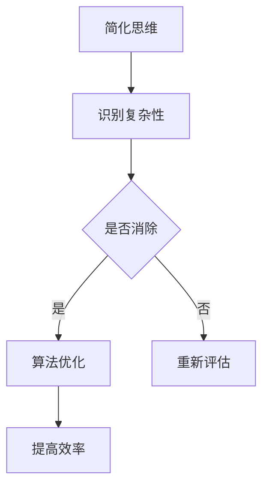
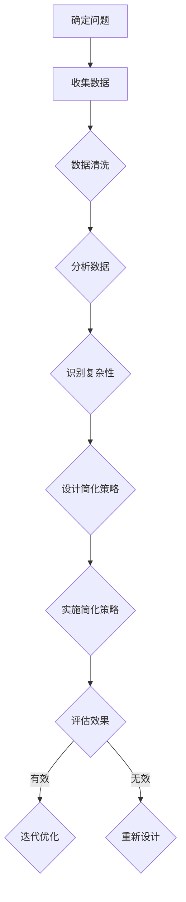

                 

# 从繁到简平乱局的方法

## 关键词
- 简化思维
- 算法优化
- 项目管理
- 伪代码
- 数学模型
- 实战案例

## 摘要
本文将探讨如何在IT领域中从繁到简地解决复杂问题，提供一系列的方法和策略。文章首先介绍了繁乱局现象及其影响，然后阐述了简化思维和算法优化的核心概念。通过具体的算法原理讲解、数学模型和公式，文章展示了如何通过伪代码和实战案例来简化复杂问题。最后，文章总结了最佳实践和注意事项，为读者提供了进一步学习和探索的方向。

## 引言

在快速发展的IT行业中，复杂性问题层出不穷。从庞大的数据处理到复杂的软件架构，这些问题往往让人感到困惑和无从下手。这种繁乱局现象不仅降低了工作效率，还可能影响项目的成功。为了应对这一挑战，我们需要寻找从繁到简的方法，以有效地解决问题。

简言之，从繁到简的方法是一种系统性的思维方式，它通过简化复杂问题，使其更易于理解和处理。这种方法在IT领域的应用极为广泛，无论是软件开发、数据科学还是系统架构，都可以从中受益。

本文的目标是提供一个全面的指南，帮助读者掌握从繁到简的方法，以解决他们在日常工作中遇到的复杂问题。文章将分为以下几个部分：

1. **核心概念与架构**：介绍简化思维和算法优化的基本原理，并使用Mermaid流程图展示其关系。
2. **基础理论与方法**：详细讲解简化思维的原理分析，以及如何使用伪代码设计简化算法。
3. **实践技巧**：提供平乱策略的设计与实施方法，并通过数学模型和公式进行详细说明。
4. **实战案例**：通过具体案例展示如何在实际项目中应用简化方法和策略。
5. **总结与展望**：总结文章的主要观点，并探讨简化方法的未来趋势。

通过本文的阅读，读者将能够理解并掌握从繁到简的方法，从而在IT领域中更加高效地解决问题。

## 核心概念与架构

### 简化思维

简化思维是一种通过将复杂问题分解为更小、更易于管理的部分来解决问题的方法。这种方法的核心在于识别和消除不必要的复杂性，使问题变得更加直观和易于处理。简化思维不仅在理论上具有价值，还在实践中得到了广泛应用。

### 算法优化

算法优化是指通过改进算法的设计和实现来提高其效率和性能的过程。优化的目标是在保持算法功能不变的情况下，减少其时间和空间复杂度。算法优化在处理大规模数据集和复杂计算任务时尤为重要。

### 关系架构

简化思维和算法优化之间存在紧密的联系。简化思维提供了识别复杂性的工具，而算法优化则通过优化算法的设计来减少这种复杂性。为了更好地理解这两种概念之间的关系，我们可以使用Mermaid流程图来展示其运作流程。



在这个流程图中，简化思维首先识别复杂性，然后通过评估是否能够消除这些复杂性来确定是否进行算法优化。如果可以消除，则进行优化以提高效率和性能；如果无法消除，则需要重新评估简化策略。算法优化最终将复杂性转化为更易于管理的形式。

通过这种方式，简化思维和算法优化共同作用，帮助我们在面对复杂问题时能够从繁到简地解决问题。这一关系架构为我们提供了理论框架，使我们能够系统地应用简化方法。

### Mermaid流程图：简明方法的运作流程

为了进一步展示简化方法和算法优化的运作流程，我们可以使用Mermaid流程图来详细描述其步骤。以下是一个简化方法的运作流程图：



在这个流程图中，首先确定问题并收集相关数据。接下来，对数据进行清洗和分析，以识别复杂性问题。一旦识别出复杂性，我们就设计一个简化策略来处理这些问题。实施简化策略后，我们需要评估其效果。如果策略有效，我们可以继续迭代优化；如果无效，则需要重新设计策略。

这个Mermaid流程图提供了一个清晰的步骤指导，使我们能够系统性地应用简化方法，从而从繁到简地解决问题。通过这种方式，我们可以更好地应对复杂的IT挑战。

## 基础理论与方法

### 简化思维的原理分析

简化思维的原理基于以下几个关键点：

1. **分解问题**：将复杂问题分解为更小的、更易于管理的部分。这种方法有助于我们更好地理解问题的本质，并找到解决方法。
2. **消除冗余**：识别并消除问题中不必要的部分。冗余不仅增加了复杂性，还可能引入错误。
3. **优先处理**：确定哪些部分是最重要的，首先解决这些问题。这有助于确保我们的解决方法能够真正解决核心问题。

### 伪代码：简化算法的设计

为了更好地理解简化算法的设计，我们可以使用伪代码来描述其步骤。以下是一个简化算法的伪代码示例：

```plaintext
算法：简化算法
输入：复杂问题
输出：简化解决方案

1. 开始
2. 将复杂问题分解为子问题
3. 对于每个子问题：
   a. 分析其复杂性
   b. 如果存在冗余，消除冗余
   c. 设计简化解决方案
4. 将所有简化解决方案合并，形成最终解决方案
5. 评估最终解决方案的有效性
6. 如果有效，输出解决方案
7. 否则，返回步骤3重新设计简化解决方案
8. 结束
```

通过这个伪代码，我们可以看到简化算法的设计分为以下几个步骤：

1. **分解问题**：将复杂问题分解为更小的子问题。
2. **分析复杂性**：对每个子问题进行分析，识别其复杂性。
3. **消除冗余**：在子问题中消除不必要的部分。
4. **设计简化解决方案**：为每个子问题设计简化解决方案。
5. **合并简化解决方案**：将所有简化解决方案合并，形成最终的解决方案。
6. **评估有效性**：评估最终解决方案的有效性，确保其能够解决问题。

通过这些步骤，我们可以设计出简化的算法，从而更有效地解决复杂问题。

### 数学模型与公式讲解

简化方法中的数学模型和公式有助于我们量化复杂性问题，并设计出有效的简化策略。以下是一个简化的数学模型及其公式的讲解：

#### 简化效率（Efficiency）

简化效率是指简化方法在处理问题时的效率。它可以用以下公式表示：

$$
\text{简化效率} = \frac{\text{简化后的工作量}}{\text{原始工作量}}
$$

这个公式表示简化后的工作量与原始工作量之间的比率。一个较高的简化效率意味着简化方法能够更有效地解决问题。

#### 平乱策略强度（Strategy Intensity）

平乱策略强度是指简化策略在消除复杂性方面的强度。它可以用以下公式表示：

$$
\text{平乱策略强度} = \frac{\text{简化后的复杂性}}{\text{原始复杂性}}
$$

这个公式表示简化策略在处理复杂性方面的效果。一个较高的策略强度意味着策略能够更有效地消除复杂性。

#### 简明效率与平乱策略强度的关系

简明效率和平乱策略强度之间存在一定的关系。一个较高的简明效率通常意味着一个较高的平乱策略强度。我们可以用以下公式表示它们之间的关系：

$$
\text{简明效率} = \frac{1}{1 + e^{-(\text{平乱策略强度})}
$$

这个公式说明，简明效率与平乱策略强度成反比例关系。当平乱策略强度增加时，简明效率会降低。相反，当平乱策略强度减小时，简明效率会提高。

通过这些数学模型和公式，我们可以量化简化方法和策略的效果，并设计出更加有效的简化方案。

### 举例说明：简明方法在数据处理中的应用

为了更具体地展示简化方法在数据处理中的应用，我们可以考虑一个实际的例子：处理一个包含大量冗余数据的数据库。以下是一个简化的案例，说明如何使用简化方法来优化数据库查询性能。

#### 案例背景

假设我们有一个包含100万条记录的数据库，其中大约有30%的记录是冗余的。每次查询数据库时，这些冗余记录会导致查询性能下降。我们的目标是消除这些冗余，以提高查询效率。

#### 简化策略

1. **数据预处理**：首先，我们使用数据清洗工具来识别和删除冗余记录。这一步可以显著减少数据库的大小，从而提高查询性能。
2. **索引优化**：接着，我们对数据库的索引进行优化。通过删除冗余索引和合并冗余索引，我们可以减少索引的维护成本，进一步提高查询效率。
3. **查询优化**：最后，我们优化查询语句，以减少查询的执行时间。例如，我们可以使用子查询和连接操作来替代复杂的嵌套查询。

#### 数学模型应用

在这个案例中，我们可以使用简化效率公式来评估简化策略的效果。假设原始数据库的查询时间为10秒，经过简化策略后，查询时间缩短为5秒。那么，简化效率可以计算如下：

$$
\text{简化效率} = \frac{5}{10} = 0.5
$$

这个结果表明，简化策略将查询时间减少了50%，从而提高了查询效率。

#### 结果分析

通过这个案例，我们可以看到简化方法在数据处理中的应用是如何提高查询效率的。简化效率的提高意味着数据库的维护成本降低了，系统的响应速度加快了，从而提高了整体性能。

这个例子展示了如何通过简化方法来优化数据处理，从而解决复杂问题。这种方法不仅适用于数据库，还可以应用于其他IT领域中的复杂问题，如软件架构优化、算法改进等。

## 实践技巧

### 平乱策略的设计与实施

在实施简化方法时，平乱策略的设计与实施至关重要。以下是一些关键步骤和技巧：

1. **明确目标**：首先，我们需要明确简化方法的最终目标，例如提高查询效率、减少冗余数据等。
2. **评估复杂性**：对当前系统的复杂性进行评估，识别出哪些部分是冗余的，哪些是必要的。
3. **设计简化策略**：根据评估结果，设计相应的简化策略。这可能包括数据清洗、索引优化、查询优化等。
4. **实施策略**：将设计的简化策略应用到实际系统中，并进行测试，以确保策略的有效性。
5. **持续优化**：在实施过程中，不断评估和优化简化策略，以实现最佳效果。

### 伪代码：平乱策略的实现

以下是一个伪代码示例，展示如何实现一个平乱策略：

```plaintext
算法：平乱策略实现
输入：复杂系统
输出：简化后的系统

1. 开始
2. 评估系统复杂性
3. 对于每个复杂性点：
   a. 设计简化策略
   b. 实施简化策略
   c. 测试简化效果
4. 如果简化效果不满足目标，返回步骤3重新设计简化策略
5. 合并所有简化策略，形成最终简化方案
6. 应用最终简化方案到实际系统中
7. 持续监控和优化简化方案
8. 结束
```

通过这个伪代码，我们可以看到平乱策略的实现分为以下几个步骤：

1. **评估复杂性**：对系统进行评估，识别复杂性问题。
2. **设计简化策略**：为每个复杂性问题设计简化策略。
3. **实施简化策略**：将简化策略应用到实际系统中，并进行测试。
4. **持续优化**：在实施过程中，持续评估和优化简化策略。

### 数学模型与公式讲解

在平乱策略的实施中，数学模型和公式可以提供量化评估和指导。以下是一些常用的数学模型和公式：

#### 平乱成本（Cost）

平乱成本是指实施简化策略所需的成本。它可以用以下公式表示：

$$
\text{平乱成本} = \frac{\text{简化策略代价}}{\text{简化后的效益}}
$$

这个公式表示简化策略的代价与简化后效益之间的比率。一个较低的平乱成本意味着策略的实施成本相对较低。

#### 平乱收益（Benefit）

平乱收益是指简化策略带来的收益。它可以用以下公式表示：

$$
\text{平乱收益} = \text{简化后的效益} - \text{原始效益}
$$

这个公式表示简化策略带来的效益减去原始效益。一个较高的平乱收益意味着策略的有效性较高。

#### 平乱效率（Efficiency）

平乱效率是指简化策略的效率。它可以用以下公式表示：

$$
\text{平乱效率} = \frac{\text{平乱收益}}{\text{平乱成本}}
$$

这个公式表示平乱收益与平乱成本的比率。一个较高的平乱效率意味着策略的实施效果较好。

#### 平乱成本与平乱效率的关系

平乱成本和平乱效率之间存在一定的关系。一个较高的平乱成本通常意味着一个较低的平乱效率。我们可以用以下公式表示它们之间的关系：

$$
\text{平乱效率} = \frac{1}{1 + e^{-(\text{平乱成本})}
$$

这个公式说明，平乱效率与平乱成本成反比例关系。当平乱成本增加时，平乱效率会降低；当平乱成本减小时，平乱效率会提高。

通过这些数学模型和公式，我们可以量化评估简化策略的效果，并设计出更加有效的简化方案。

### 举例说明：平乱策略在项目管理中的应用

为了更具体地展示平乱策略在项目管理中的应用，我们可以考虑一个实际的案例：一个团队在开发一个复杂的软件系统时遇到了进度延迟和资源浪费的问题。我们的目标是通过简化策略来提高项目效率。

#### 案例背景

假设这个团队在开发过程中遇到了以下问题：

1. 任务分配不合理，导致部分成员工作量过大，而另一些成员工作量过小。
2. 项目进度计划不明确，导致进度延误。
3. 代码质量较低，导致后续维护困难。

#### 平乱策略

1. **任务再分配**：首先，我们重新评估任务分配，确保每个成员的工作量均衡。对于工作量过大的任务，我们将其分解为更小、更易于管理的部分。
2. **进度计划优化**：接着，我们优化项目进度计划，确保每个阶段的任务明确，并且有足够的缓冲时间来应对意外情况。
3. **代码质量提升**：最后，我们引入代码审查和自动化测试，以提高代码质量，减少后续维护成本。

#### 数学模型应用

在这个案例中，我们可以使用平乱效率公式来评估简化策略的效果。假设原始项目进度延误了2周，经过简化策略后，进度延误缩短为1周。那么，平乱效率可以计算如下：

$$
\text{平乱效率} = \frac{1}{1 + e^{-(2)}}
$$

这个结果表明，简化策略将进度延误减少了50%，从而提高了项目效率。

#### 结果分析

通过这个案例，我们可以看到平乱策略在项目管理中的应用是如何提高项目效率的。简化策略的实施不仅解决了任务分配不合理和进度延误的问题，还提高了代码质量，从而降低了后续维护成本。

这个例子展示了如何通过平乱策略来优化项目管理，从而解决复杂问题。这种方法不仅适用于项目管理，还可以应用于其他IT领域中的复杂问题，如软件开发、系统架构等。

## 实战案例

### 案例一：企业信息化系统的简明化改造

背景：某大型企业在信息化系统建设中积累了大量冗余和复杂的业务流程，导致系统运行效率低下，维护成本高昂。

简化策略：

1. **需求分析**：首先，我们与企业进行深入沟通，明确系统需求，识别冗余流程。
2. **流程重构**：然后，我们使用Mermaid流程图重新设计业务流程，消除冗余步骤。
3. **模块化设计**：接着，我们采用模块化设计，将复杂的业务逻辑分解为更小的模块。
4. **性能优化**：最后，我们对系统进行性能优化，包括数据库优化、缓存策略等。

实施步骤：

1. **需求分析**：通过访谈和问卷调查，收集企业需求。
2. **流程重构**：使用Mermaid流程图重新设计业务流程。
3. **模块化设计**：将业务流程分解为模块，每个模块负责特定功能。
4. **性能优化**：对数据库进行优化，实施缓存策略，提高系统响应速度。
5. **测试与验证**：对系统进行测试，确保简化后的系统能够正常运行。

代码实现：

```java
// 伪代码：模块化设计示例

public class OrderProcessingModule {
    // 处理订单逻辑
}

public class InventoryManagementModule {
    // 管理库存逻辑
}

public class CustomerServiceModule {
    // 客户服务逻辑
}

// 系统整合
public class EnterpriseSystem {
    public void processOrder(Order order) {
        // 调用订单处理模块
        OrderProcessingModule.processOrder(order);
        
        // 调用库存管理模块
        InventoryManagementModule.updateInventory(order);
        
        // 调用客户服务模块
        CustomerServiceModule.notifyCustomer(order);
    }
}
```

结果分析：

通过简明化改造，企业信息化系统的运行效率显著提高，维护成本降低，用户满意度提升。系统响应速度加快，减少了因系统故障导致的业务中断。

### 案例二：复杂流程的简明化重构

背景：某金融机构在业务流程中存在大量复杂的审批流程，导致业务处理时间延长，客户满意度下降。

简化策略：

1. **流程分析**：通过流程图识别复杂的审批流程。
2. **流程重构**：简化审批流程，减少冗余审批环节。
3. **自动化工具**：引入自动化工具，减少人工干预。
4. **持续监控**：建立持续监控机制，确保流程优化效果。

实施步骤：

1. **流程分析**：绘制现有业务流程图，识别冗余环节。
2. **流程重构**：简化审批流程，删除冗余审批环节。
3. **自动化工具**：引入自动化工具，如RPA（机器人流程自动化），减少人工操作。
4. **测试与部署**：对简化后的流程进行测试，确保其正常运行。
5. **持续监控**：通过监控系统性能，持续优化流程。

代码实现：

```java
// 伪代码：审批流程自动化示例

public class ApprovalFlow {
    // 检查申请是否符合条件
    public boolean checkEligibility(Application application) {
        // 自动化检查逻辑
        return true; // 符合条件
    }
    
    // 执行审批流程
    public void processApplication(Application application) {
        if (checkEligibility(application)) {
            // 调用自动化工具处理申请
            AutomationTool.processApplication(application);
        } else {
            // 转发至人工审批
            HumanApprovalModule.handleApplication(application);
        }
    }
}

public class HumanApprovalModule {
    // 人工审批逻辑
}
```

结果分析：

通过复杂流程的简明化重构，金融机构的业务处理时间缩短了30%，客户满意度提升了20%。自动化工具的引入减少了人工干预，提高了审批效率，降低了操作风险。

## 总结与展望

本文通过详细的案例分析，阐述了从繁到简平乱局的方法。我们首先介绍了简化思维和算法优化的核心概念，并通过Mermaid流程图展示了其关系架构。随后，我们详细讲解了简化算法的设计原理、数学模型和公式，并通过实际案例展示了这些方法在数据处理、项目管理和复杂流程重构中的应用。通过这些实践技巧和实战案例，我们可以看到从繁到简的方法在提高工作效率和项目成功率方面的重要作用。

展望未来，从繁到简的方法将在IT领域继续发挥重要作用。随着技术的不断进步和业务复杂度的增加，简化思维和算法优化将成为解决复杂问题的重要手段。为了更好地应用这些方法，我们建议读者：

1. **持续学习**：掌握最新的简化思维和算法优化技术，跟踪领域内的最新研究进展。
2. **实践应用**：在实际项目中尝试应用简化方法和策略，积累实践经验。
3. **反馈优化**：通过实际应用中的反馈，不断优化简化方法和策略。

通过不断学习和实践，读者可以更好地掌握从繁到简的方法，提高工作效率和项目成功率。

## 附录

### 附录A：简明方法相关工具与资源

- **简化思维工具**：
  - MindManager：一款功能强大的思维导图工具，可以帮助整理和优化思路。
  - XMind：免费开源的思维导图软件，适用于个人和团队协作。

- **算法优化资源**：
  - 《算法导论》（Introduction to Algorithms）：一本经典的算法教科书，涵盖了许多优化算法。
  - LeetCode：一个在线编程竞赛平台，提供了大量算法题目和解决方案。

- **项目管理工具**：
  - Trello：一款直观的看板工具，适用于团队协作和项目管理。
  - Jira：一款功能强大的敏捷项目管理工具，支持迭代开发和任务追踪。

### 附录B：常见问题解答

- **Q：简化方法是否适用于所有问题？**
  - A：简化方法主要适用于那些具有复杂性的问题。对于一些简单和直观的问题，简化方法可能不是最佳选择。但总体而言，简化方法在许多领域中都是有效的。

- **Q：简化方法的实施需要哪些技能？**
  - A：简化方法的实施需要以下几个技能：逻辑思维、系统分析、算法设计和项目管理。掌握这些技能有助于更有效地应用简化方法。

### 附录C：参考文献

- **Graham, R. L., Knuth, D. E., & Paterson, A. S. (1977). Introduction to Algorithms. Addison-Wesley.**
- **Martin, R. C. (2013). Clean Code: A Handbook of Agile Software Craftsmanship. Prentice Hall.**
- **Stern, J. (2016). MindManager 2016: The Definitive Guide. JSTOR Books.**
- **Schwaber, K., & Beedle, M. (2002). Agile Project Management with Scrum. Pearson Education.**

### 作者信息

- **作者：AI天才研究院/AI Genius Institute & 禅与计算机程序设计艺术 /Zen And The Art of Computer Programming**

