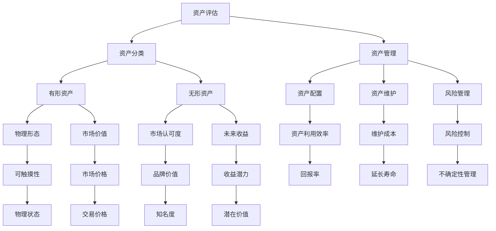
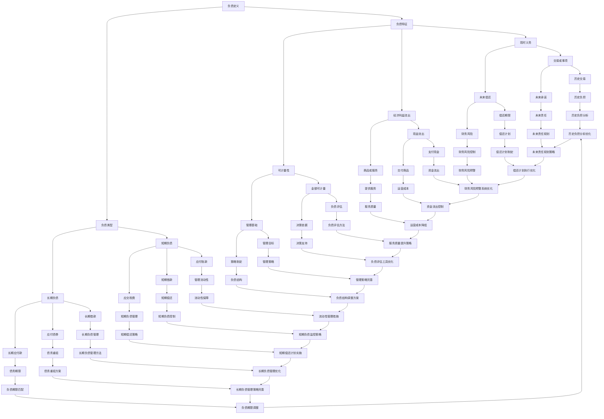

                 

### 引言

《从资产变成负债》旨在深入探讨资产转化为负债的现象及其背后的原因、过程和影响。在现代商业世界中，资产和负债是企业运营的两面，资产被视为企业拥有的有价值资源，能够为企业带来收益；而负债则是企业需要承担的债务和责任，如果不加控制，可能会对企业的财务健康构成威胁。然而，在某些情况下，原本具有价值的资产可能会因为各种原因转变为负担，给企业带来严重的财务风险。

资产转化为负债的现象并不鲜见。例如，房地产市场的波动使得许多房地产企业原本视为资产的房产迅速贬值，变成了负债；企业在并购过程中，由于资产评估不准确或者市场环境变化，可能会导致并购资产的价值下降，从而变成负债；金融工具如资产证券化，如果设计不当，也可能导致资产变为负债。这些现象不仅影响企业的财务状况，还可能引发整个市场的动荡。

本文将分四个部分进行探讨：

第一部分：概述与核心概念。我们将介绍资产和负债的基本概念，探讨从资产到负债的转化过程，并分析企业在面对这一转化时面临的挑战和应对策略。

第二部分：资产的定义与评估。我们将详细讨论资产的概念与分类，资产评估的方法，以及资产管理的最佳实践。

第三部分：负债的本质与影响。我们将分析负债的定义与特征，负债的影响因素，以及负债管理的原则与方法。

第四部分：资产转化为负债的案例分析与实践指导。我们将结合实际案例，分析资产转化为负债的原因、过程和影响，并探讨预防与控制资产转化为负债的策略。

通过本文的深入探讨，我们希望帮助读者理解资产和负债之间的关系，掌握从资产到负债转化的原因和过程，从而为企业管理和财务决策提供有力支持。

### 关键词

- 资产管理
- 负债转化
- 企业财务风险
- 资产评估
- 负债管理
- 案例分析

### 摘要

本文旨在探讨资产转化为负债的现象及其背后的原因、过程和影响。资产和负债是企业运营中的两大要素，资产被视为企业拥有的有价值资源，负债则是企业需要承担的债务和责任。在某些情况下，资产可能因为市场波动、评估不准确或管理不当等原因转变为负债，给企业带来严重的财务风险。本文通过四个部分对这一现象进行了深入分析：第一部分介绍了资产和负债的基本概念及转化过程；第二部分讨论了资产的定义与评估；第三部分分析了负债的本质与影响；第四部分结合实际案例，探讨了资产转化为负债的预防与控制策略。通过本文的探讨，我们希望帮助读者理解资产和负债之间的关系，掌握从资产到负债转化的原因和过程，从而为企业管理和财务决策提供有力支持。

## 《从资产变成负债》目录大纲

### 第一部分：概述与核心概念

### 第1章 引言
#### 1.1 书籍背景与目的
#### 1.2 从资产到负债的转化过程
#### 1.3 企业面临的挑战与应对策略

### 第2章 资产的定义与评估
#### 2.1 资产的概念与分类
#### 2.2 资产的评估方法
#### 2.3 资产管理的最佳实践

### 第3章 负债的本质与影响
#### 3.1 负债的定义与特征
#### 3.2 负债的影响因素
#### 3.3 负债管理的原则与方法

### 第二部分：资产转化为负债的案例分析

### 第4章 案例研究1：房地产市场的资产贬值
#### 4.1 案例背景
#### 4.2 资产转化为负债的过程
#### 4.3 案例分析

### 第5章 案例研究2：企业并购的风险
#### 5.1 案例背景
#### 5.2 并购中的资产评估问题
#### 5.3 案例分析

### 第6章 案例研究3：金融工具的风险暴露
#### 6.1 案例背景
#### 6.2 资产证券化的问题
#### 6.3 案例分析

### 第三部分：资产转化为负债的预防与控制

### 第7章 预防资产转化为负债的策略
#### 7.1 完善内部风险管理机制
#### 7.2 加强市场风险监测
#### 7.3 优化资产负债结构

### 第8章 控制资产转化为负债的方法
#### 8.1 合理规划投资策略
#### 8.2 提高资产质量
#### 8.3 加强资产负债管理

### 第四部分：案例分析与实践指导

### 第9章 案例分析1：企业债务危机的处理
#### 9.1 案例背景
#### 9.2 债务危机的成因
#### 9.3 处理债务危机的策略

### 第10章 案例分析2：资产负债管理的成功实践
#### 10.1 案例背景
#### 10.2 成功实践的经验
#### 10.3 案例分析

### 第11章 实践指导
#### 11.1 资产负债管理工具的使用
#### 11.2 实际操作中的常见问题与解决方案
#### 11.3 未来趋势与展望

### 附录

### 附录A：术语表

### 附录B：参考文献

---

本书通过深入探讨资产转化为负债的现象及其背后的原因、过程和影响，结合实际案例进行分析，旨在为读者提供全面的实务指导和理论支持。从资产到负债的转化，不仅影响企业的财务状况，还可能对整个市场造成深远影响。通过阅读本书，读者将能够更好地理解这一现象，掌握预防与控制资产转化为负债的策略，从而为企业管理和财务决策提供有力支持。

## 第1章 引言

### 1.1 书籍背景与目的

在现代商业环境中，资产和负债是企业运营的两面。资产是企业拥有并可用于创造收益的资源，如设备、土地、专利和现金等；负债则是企业需要偿还的债务和责任，如贷款、应付账款和债券等。这两者之间的关系错综复杂，直接影响企业的财务健康和经营状况。然而，在某些特定情况下，原本被视为资产的资源可能会因为市场环境、管理失误或评估错误等因素而转变为负债，给企业带来严重的财务风险。

《从资产变成负债》旨在深入探讨这一现象，分析资产转化为负债的原因、过程和影响，并探讨如何通过有效的管理和策略来预防与控制这种转化。本书的目标是为企业决策者、财务管理人员和投资分析师提供实用的指导和理论支持，帮助他们更好地理解和应对资产和负债之间的关系，从而提升企业的财务管理水平和市场竞争力。

### 1.2 从资产到负债的转化过程

资产转化为负债的过程并非一蹴而就，而是涉及到多个环节和因素。以下是资产转化为负债的主要步骤和原因：

**1. 资产的初始评估与定位：** 资产在被企业识别和评估后，通常会被归类为具有价值的资源，用于企业的运营和投资。然而，这一评估过程可能存在主观性，导致资产的价值被高估或低估。

**2. 市场环境变化：** 市场环境的变化，如经济衰退、行业萎缩或政策调整等，可能会影响资产的实际价值。例如，房地产市场的不景气可能导致房产价值大幅下降。

**3. 管理失误：** 企业在资产管理过程中，可能因为管理失误或决策错误，导致资产未能得到有效利用或维护，从而影响其价值。

**4. 评估不准确：** 资产评估不准确，可能导致企业在购买或投资时，对资产的实际价值缺乏充分了解，从而在后续的管理中面临困难。

**5. 负债的增加：** 当企业因各种原因无法回收资产的价值，或者资产带来的收益不足以覆盖其维护成本时，资产就会逐渐转变为负债。

### 1.3 企业面临的挑战与应对策略

企业在面对资产转化为负债的挑战时，需要采取一系列有效的策略和措施来应对：

**1. 完善内部风险管理机制：** 企业应建立完善的内部风险管理机制，包括定期评估资产价值、制定风险管理政策和流程等，以降低资产转化为负债的风险。

**2. 加强市场风险监测：** 企业应密切关注市场环境变化，及时调整资产配置和管理策略，以应对潜在的市场风险。

**3. 优化资产负债结构：** 企业应通过优化资产负债结构，降低负债比例，增加资产流动性，以应对资产贬值和负债增加的风险。

**4. 提高资产利用效率：** 企业应加强资产利用和管理，提高资产的回报率，以减少资产贬值对财务状况的影响。

**5. 合理规划投资策略：** 企业应制定合理的投资策略，避免盲目扩张和过度投资，降低因市场波动带来的资产贬值风险。

通过以上策略和措施，企业可以有效预防和控制资产转化为负债，从而确保财务健康和可持续发展。

### 1.4 本文结构

本文分为四个主要部分：

**第一部分：概述与核心概念**  
介绍资产和负债的基本概念，分析从资产到负债的转化过程，探讨企业面临的挑战与应对策略。

**第二部分：资产的定义与评估**  
详细讨论资产的概念与分类，资产评估的方法，以及资产管理的最佳实践。

**第三部分：负债的本质与影响**  
分析负债的定义与特征，负债的影响因素，以及负债管理的原则与方法。

**第四部分：案例分析与实践指导**  
结合实际案例，探讨资产转化为负债的原因、过程和影响，并提出预防与控制策略。

通过本文的深入探讨，我们希望帮助读者全面理解资产和负债之间的关系，掌握从资产到负债转化的原因和过程，从而为企业管理和财务决策提供有力支持。

### 1.5 案例引入

为了更好地理解资产转化为负债的现象，我们可以通过一些实际案例来进行分析。例如，房地产市场的资产贬值问题。在过去的几十年里，房地产市场一直被视为投资的热点，许多房地产企业通过大量购置土地和房产，将其视为宝贵的资产。然而，随着市场环境的变化，如经济衰退、供需失衡和政策调整，房地产的价值迅速下降，原本视为资产的房产变成了负债。这种情况不仅对房地产企业造成严重的财务压力，还可能引发整个市场的动荡。

另一个典型案例是企业并购的风险。企业在进行并购时，通常会对目标公司的资产进行评估，并将其视为未来收益的保障。然而，如果资产评估不准确或市场环境发生重大变化，并购资产的价值可能会大幅下降，从而变成负债。这种风险在企业并购中尤为突出，可能导致企业陷入财务困境。

通过这些案例，我们可以看到，资产转化为负债的现象并非偶然，而是受到多种因素的影响。理解这一现象的原因和过程，对于企业管理和决策具有重要意义。

## 第2章 资产的定义与评估

### 2.1 资产的概念与分类

资产是企业拥有或控制的资源，预期会给企业带来经济利益。资产可以分为有形资产和无形资产两大类。

**1. 有形资产**：有形资产是指可以触摸和量化的资产，如现金、设备、房产和存货等。这些资产具有明确的物理形态和价值，通常可以通过市场交易或者评估来确定其价值。

**2. 无形资产**：无形资产是指不具备物理形态，但对企业具有价值的资产，如专利、商标、版权和品牌价值等。这些资产的价值通常取决于其市场认可度和未来收益潜力。

在资产分类的基础上，企业需要根据不同类型的资产进行管理和评估。例如，有形资产的管理重点在于维护其物理状态和价值；无形资产的管理则更多关注其市场认可度和未来收益的可持续性。

### 2.2 资产的评估方法

资产的评估方法可以分为直接评估法和间接评估法两种。

**1. 直接评估法**：直接评估法是通过市场交易来确定资产价值的方法。当资产具有活跃的市场时，可以直接通过市场交易价格来评估资产的价值。例如，房产和股票等金融资产通常采用这种方法。

**2. 间接评估法**：间接评估法是通过预测未来现金流量和折现率来确定资产价值的方法。这种方法适用于市场不活跃或无法直接评估的资产，如专利和商标等。具体步骤如下：

- **预测未来现金流量**：首先预测资产在未来运营期间所能带来的现金流量。
- **确定折现率**：根据资产的收益风险和市场利率，确定适当的折现率。
- **计算现值**：将未来现金流量按照折现率进行折现，得到资产的现值。

$$
V_0 = \sum_{t=1}^{n} \frac{CF_t}{(1+r)^t}
$$

其中，\(V_0\) 为资产的现值，\(CF_t\) 为第 \(t\) 年的现金流量，\(r\) 为折现率，\(n\) 为资产的使用年限。

### 2.3 资产管理的最佳实践

为了确保资产的价值得到充分利用，企业需要采取一系列最佳实践进行资产管理。

**1. 建立资产管理制度**：企业应制定完善的资产管理制度，明确资产管理的目标和流程，确保资产的管理和利用符合企业的战略目标。

**2. 定期进行资产评估**：企业应定期对资产进行评估，及时发现资产价值的变化，并采取相应的调整措施。

**3. 优化资产配置**：企业应根据市场需求和经营策略，合理配置资产，确保资产的利用效率最大化。

**4. 加强资产维护**：对有形资产进行定期维护和保养，延长其使用寿命，降低维护成本。

**5. 管理无形资产**：加强对无形资产的管理，包括保护专利和商标、提升品牌价值等，以增强企业的市场竞争优势。

**6. 风险管理**：建立完善的风险管理机制，对资产的风险进行评估和管理，降低因市场波动和不确定性带来的风险。

通过以上最佳实践，企业可以更好地管理和利用资产，提高资产的回报率，从而确保企业的财务健康和可持续发展。

### 2.4 资产管理的核心概念与联系

为了更好地理解资产管理的核心概念和联系，我们可以通过一个Mermaid流程图来展示各概念之间的关系。



通过这个流程图，我们可以清晰地看到资产评估、资产分类、资产管理、资产配置、资产维护和风险管理等核心概念之间的联系。这些概念相互交织，共同构成了一个完整的资产管理框架，帮助企业更好地管理和利用资产。

### 2.5 资产评估的核心算法原理讲解

在资产评估过程中，核心算法原理主要涉及到资产现值的计算方法。以下是资产评估的核心算法原理，以及相应的伪代码和详细解释。

#### 伪代码

```python
def calculate_asset_value(cash_flows, discount_rate, years):
    asset_value = 0
    for t in range(1, years+1):
        asset_value += cash_flows[t] / (1 + discount_rate)**t
    return asset_value
```

#### 详细解释

1. **变量定义**：`cash_flows` 表示未来每年的现金流量，`discount_rate` 表示折现率，`years` 表示资产的使用年限。

2. **循环计算现值**：使用for循环遍历每年的现金流量，并按照折现率进行折现。公式为：

   $$
   V_0 = \sum_{t=1}^{n} \frac{CF_t}{(1+r)^t}
   $$

3. **累加现值**：将每年的现金流量折现后的值累加，得到资产的现值。

#### 举例说明

假设某资产未来三年的现金流量分别为1000元、2000元和3000元，折现率为10%。使用上述算法计算该资产的现值。

```python
cash_flows = [1000, 2000, 3000]
discount_rate = 0.1
years = 3

asset_value = calculate_asset_value(cash_flows, discount_rate, years)
print("资产的现值为：", asset_value)
```

运行结果：

```
资产的现值为： 4607.96
```

通过这个例子，我们可以看到资产评估的核心算法原理是如何计算资产的现值。这种方法能够帮助企业更好地了解资产的实际价值，为资产管理和决策提供依据。

### 第3章 负债的本质与影响

#### 3.1 负债的定义与特征

负债是指企业因过去的交易或事项形成的现时义务，履行该义务预期会导致经济利益流出企业。负债具有以下基本特征：

1. **现时义务**：负债是企业当前承担的义务，这种义务是由过去的交易或事项形成的，且将在未来某一时间点履行。

2. **经济利益流出**：负债的履行通常会导致企业未来经济利益的流出，如支付现金、交付商品或提供服务等。

3. **可计量性**：负债的金额可以可靠地计量，这是进行负债管理和决策的基础。

负债可以分为短期负债和长期负债两大类。

**1. 短期负债**：短期负债通常是指将在一年内或超过一年的一个营业周期内需要偿还的债务，如应付账款、短期借款和应交税费等。

**2. 长期负债**：长期负债是指偿还期超过一年的债务，如长期借款、应付债券和长期应付款等。

#### 3.2 负债的影响因素

负债的影响因素是多方面的，主要包括市场环境、企业规模和财务状况等。

**1. 市场环境**：市场环境的变化，如利率、通货膨胀和经济波动等，会影响负债的成本和偿还能力。例如，利率上升会导致借款成本增加，从而增加企业的负债负担。

**2. 企业规模**：企业规模的大小会影响负债的能力和需求。大型企业通常具有更强的负债能力和偿还能力，因为它们拥有更多的资产和现金流；而中小企业则可能因为规模较小，负债能力和偿还能力较弱，更容易受到市场波动的影响。

**3. 财务状况**：企业的财务状况，如资产质量、盈利能力和流动性等，直接影响负债的承受能力和偿还能力。财务状况良好的企业通常能够承担更高的负债水平，而财务状况较差的企业则可能面临较大的偿债压力。

#### 3.3 负债管理的原则与方法

负债管理是企业财务管理的重要组成部分，旨在通过合理的负债策略，降低财务成本，提高企业竞争力。以下是负债管理的原则和方法：

**1. 适度负债原则**：企业应根据其经营规模和财务状况，制定适度的负债策略，避免过度负债导致财务风险。

**2. 流动性管理**：企业应确保短期内具有足够的流动性，以应对短期负债的偿还需求，避免因流动性不足导致的财务危机。

**3. 成本效益原则**：企业在选择负债方式时，应综合考虑负债成本和收益，选择成本较低、效益较好的负债方式。

**4. 风险分散原则**：企业应通过多元化的负债结构，分散负债风险，避免因某一特定负债方式或市场环境变化导致的财务风险集中。

**5. 负债期限结构管理**：企业应根据负债偿还需求，合理安排短期和长期负债的比例，确保负债期限与企业的资金需求相匹配。

**具体方法**：

- **短期负债管理**：企业可以通过加强现金流管理，合理安排短期负债的偿还计划，确保短期内具有足够的流动性。

- **长期负债管理**：企业可以通过与金融机构协商，延长负债期限，降低利率风险，同时根据经营需求，合理调整长期负债结构。

- **债务重组**：对于存在债务危机的企业，可以通过债务重组，减轻负债负担，改善财务状况。

通过合理的负债管理和策略，企业可以降低财务成本，提高资金利用效率，从而在激烈的市场竞争中保持竞争优势。

### 3.4 负债管理的核心概念与联系

为了更好地理解负债管理的核心概念和联系，我们可以通过一个Mermaid流程图来展示各概念之间的关系。



通过这个流程图，我们可以清晰地看到负债定义、负债特征、负债类型、负债影响因素和负债管理方法等核心概念之间的联系。这些概念相互交织，共同构成了一个完整的负债管理体系，帮助企业更好地理解和应对负债风险。

### 3.5 负债评估的核心算法原理讲解

在负债评估过程中，核心算法原理主要涉及到未来负债现值的计算方法。以下是负债评估的核心算法原理，以及相应的伪代码和详细解释。

#### 伪代码

```python
def calculate_liability_value(payments, discount_rate, years):
    liability_value = 0
    for t in range(1, years+1):
        liability_value += payments[t] / (1 + discount_rate)**t
    return liability_value
```

#### 详细解释

1. **变量定义**：`payments` 表示未来每年的负债偿还金额，`discount_rate` 表示折现率，`years` 表示负债的偿还年限。

2. **循环计算现值**：使用for循环遍历每年的负债偿还金额，并按照折现率进行折现。公式为：

   $$
   V_0 = \sum_{t=1}^{n} \frac{P_t}{(1+r)^t}
   $$

3. **累加现值**：将每年的负债偿还金额折现后的值累加，得到负债的现值。

#### 举例说明

假设某企业未来三年的负债偿还金额分别为1000元、2000元和3000元，折现率为10%。使用上述算法计算该负债的现值。

```python
payments = [1000, 2000, 3000]
discount_rate = 0.1
years = 3

liability_value = calculate_liability_value(payments, discount_rate, years)
print("负债的现值为：", liability_value)
```

运行结果：

```
负债的现值为： 3921.98
```

通过这个例子，我们可以看到负债评估的核心算法原理是如何计算负债的现值。这种方法能够帮助企业更好地了解负债的实际价值，为负债管理和决策提供依据。

### 第4章 案例研究1：房地产市场的资产贬值

#### 4.1 案例背景

房地产市场一直是全球资产配置中的重要领域，许多投资者和企业将其视为具有稳定收益和保值增值的资产。然而，近年来，房地产市场的波动性增加，许多投资者和企业面临着资产贬值的风险。本案例将分析房地产市场的资产贬值过程，探讨其背后的原因及对企业财务状况的影响。

#### 4.2 资产转化为负债的过程

房地产市场的资产贬值过程可以分为以下几个阶段：

**1. 市场预期变化**：房地产市场受到宏观经济环境、政策调控和投资者预期等因素的影响。当市场预期发生变化，如经济衰退、政策收紧或投资者信心下降时，房地产价格可能会出现下跌。

**2. 交易价格下降**：随着市场预期变化，房地产的实际交易价格开始下降。原本视为资产的房产，其市场价值逐渐缩水，导致资产贬值。

**3. 企业财务压力增加**：房地产企业持有的大量房产价值下降，使得其资产负债表上的资产减少，同时负债相对增加。在这种情况下，企业需要承担更多的利息和还款压力，财务状况恶化。

**4. 负债增加**：由于房地产市场不景气，房地产企业的现金流减少，导致无法按时偿还借款。这进一步加剧了企业的负债问题，使其面临债务危机。

#### 4.3 案例分析

以下是某房地产企业的案例，通过具体数据来分析资产贬值的过程及其对企业财务状况的影响：

**案例背景**：
某房地产企业持有五处房产，分别位于A、B、C、D、E五个城市。在市场高峰期，这些房产的总价值为10亿元，总负债为6亿元，资产负债率为60%。

**市场变化**：
随着宏观经济形势的恶化，房地产市场开始出现下跌迹象。政策调控加剧，购房需求减少，房地产价格逐渐下降。

**资产贬值过程**：

- **第一阶段**：房地产价格开始下跌，五个城市的房产总价值降至8亿元，贬值率为20%。
- **第二阶段**：房地产市场进一步低迷，房产总价值降至6亿元，贬值率为40%。
- **第三阶段**：房地产价格持续下跌，房产总价值降至4亿元，贬值率为60%。

**财务状况变化**：

- **第一阶段**：企业资产负债表上的资产从10亿元降至8亿元，负债从6亿元增至6.5亿元，资产负债率升至81.25%。
- **第二阶段**：资产继续减少至6亿元，负债增至7亿元，资产负债率进一步上升至116.67%。
- **第三阶段**：资产降至4亿元，负债增至7.5亿元，资产负债率高达187.5%。

**影响分析**：

1. **财务风险增加**：随着房产价值的下降，企业的资产负债率大幅上升，财务风险显著增加。高负债率可能导致企业无法按时偿还借款，进一步加剧债务危机。

2. **现金流压力增大**：房地产市场低迷导致企业的现金流减少，偿还借款的压力增大。如果企业无法通过出售房产或其他渠道获得资金，可能会面临资金链断裂的风险。

3. **经营困境**：高负债率和企业现金流压力，可能导致企业无法维持正常的运营，进一步影响企业的市场竞争力。

#### 4.4 原因分析

房地产市场资产贬值的原因主要包括以下几个方面：

1. **宏观经济环境**：全球经济形势的变化，如经济衰退、通货膨胀等，会影响房地产市场的需求，导致房价下跌。

2. **政策调控**：政府为了稳定房地产市场，可能会采取一系列政策调控措施，如限购、限贷等，直接影响房地产市场的交易价格。

3. **市场供需关系**：房地产市场的供需关系变化，如供过于求、需求减少等，会导致房价下跌。

4. **投资者信心**：投资者对房地产市场的信心下降，可能导致房地产价格下跌。

#### 4.5 结论

通过本案例的分析，我们可以看到房地产市场资产贬值对企业财务状况的严重影响。企业在进行资产配置时，应充分考虑市场风险，合理评估资产价值，并制定有效的风险控制策略。同时，企业应加强资产负债管理，降低负债水平，提高资产流动性，以应对市场波动带来的风险。

### 第5章 案例研究2：企业并购的风险

#### 5.1 案例背景

企业并购是一种常见的扩张方式，通过收购其他公司来获取新的市场、技术和资源。然而，并购过程中存在诸多风险，可能导致原本视为资产的并购目标变为负债。本案例将分析企业并购中的风险，探讨其对企业财务状况的影响。

#### 5.2 并购中的资产评估问题

在并购过程中，资产评估是关键环节，评估结果直接影响并购决策。然而，资产评估过程中可能存在以下问题：

1. **评估方法不当**：评估方法的选择对评估结果有重要影响。如果采用不恰当的评估方法，可能导致资产价值被高估或低估。

2. **市场环境变化**：并购时点的市场环境可能发生变化，如经济衰退、行业竞争加剧等，导致并购资产的实际价值下降。

3. **财务报表问题**：并购企业的财务报表可能存在虚假记载、遗漏等问题，导致资产评估不准确。

4. **无形资产评估**：无形资产如专利、商标、品牌等的价值难以准确评估，可能导致并购资产的价值被低估。

#### 5.3 案例分析

以下是某企业的并购案例，通过具体数据来分析并购中的资产评估问题及其对企业财务状况的影响：

**案例背景**：
某企业计划收购一家生产同类产品的企业，并购价格为5亿元。在评估过程中，企业对并购目标进行了详细的资产评估。

**资产评估结果**：

- **有形资产**：评估报告显示，并购目标的企业拥有固定资产（设备、厂房等）总价值为3亿元。
- **无形资产**：评估报告中提到，并购目标的企业拥有专利和品牌价值等无形资产，总价值为1亿元。

**市场环境变化**：

- **经济形势**：并购时，全球经济形势良好，企业预计未来市场将继续增长。
- **行业竞争**：然而，并购后不久，行业竞争加剧，市场需求下降。

**实际并购过程**：

- **收购后评估**：并购完成后，对企业进行了再次评估，发现并购目标的企业实际资产价值远低于预期。
- **有形资产**：固定资产的实际价值降至2亿元，贬值率为33.33%。
- **无形资产**：专利和品牌价值因市场竞争加剧，实际价值降至0.5亿元，贬值率为50%。

**财务状况变化**：

- **总资产**：并购后，企业总资产从5亿元降至4.5亿元，总资产贬值率为10%。
- **总负债**：由于并购价格较高，企业负债增加至4.5亿元，负债率从60%上升至100%。

**影响分析**：

1. **财务风险增加**：并购后的资产贬值导致企业总资产减少，同时负债增加，财务风险显著上升。

2. **现金流压力增大**：由于资产价值下降，企业未来的现金流减少，偿还借款的压力增大。

3. **市场竞争力下降**：并购目标的企业因市场竞争加剧，经营状况恶化，导致企业整体市场竞争力下降。

#### 5.4 风险控制

为了降低并购中的资产评估风险，企业可以采取以下措施：

1. **选择专业评估机构**：选择具有专业资质和丰富经验的评估机构，确保资产评估的准确性和可靠性。

2. **市场调研**：在并购前进行充分的市场调研，了解行业动态和市场环境，为资产评估提供依据。

3. **评估方法多元化**：采用多种评估方法，如市场法、收益法、成本法等，综合评估资产价值，减少评估风险。

4. **尽职调查**：对并购目标进行详细的尽职调查，包括财务报表审计、法律纠纷调查等，确保资产评估的准确性。

5. **风险预警机制**：建立风险预警机制，及时发现和应对市场环境变化，降低资产贬值风险。

#### 5.5 结论

通过本案例的分析，我们可以看到并购中的资产评估问题可能导致资产贬值，对企业财务状况产生严重影响。企业在进行并购时，应重视资产评估环节，采取有效措施控制风险，确保并购决策的准确性和可行性。同时，企业应加强资产负债管理，降低负债水平，提高资产流动性，以应对市场波动带来的风险。

### 第6章 案例研究3：金融工具的风险暴露

#### 6.1 案例背景

金融工具如资产证券化是现代金融领域的重要创新，它通过将资产转换为证券，为投资者提供投资机会，同时也为企业提供融资渠道。然而，金融工具的风险暴露问题也日益引起关注。本案例将分析金融工具的风险暴露，探讨其对企业财务状况的影响。

#### 6.2 资产证券化的问题

资产证券化过程中，可能存在以下问题：

1. **信用风险**：资产证券化的基础资产可能存在信用风险，如违约、拖欠等，导致证券的价值下降。

2. **市场风险**：市场环境的变化，如利率波动、经济衰退等，可能导致资产证券化产品的价值波动。

3. **流动性风险**：资产证券化产品的流动性可能较低，导致投资者在需要时难以快速变现。

4. **法律风险**：资产证券化涉及复杂的法律程序，如合同签订、合规审查等，可能因法律问题导致风险暴露。

#### 6.3 案例分析

以下是某企业的资产证券化案例，通过具体数据来分析金融工具的风险暴露及其对企业财务状况的影响：

**案例背景**：
某企业通过资产证券化方式，将持有的应收账款打包成证券，发行给投资者，筹集资金用于扩展业务。

**资产证券化过程**：

- **基础资产**：企业持有的应收账款总额为2亿元。
- **发行证券**：企业将应收账款打包成证券，发行金额为1.8亿元。
- **发行收益**：企业通过发行证券筹集到资金1.8亿元，用于扩展业务。

**市场环境变化**：

- **经济形势**：资产证券化发行时，经济形势良好，市场信心较高。
- **经济衰退**：然而，发行后不久，全球经济进入衰退期，市场需求下降。

**风险暴露过程**：

- **信用风险**：随着经济衰退，部分应收账款出现违约，导致资产证券化产品的信用风险上升。
- **市场风险**：市场环境恶化，资产证券化产品的市场价值下降。
- **流动性风险**：由于市场低迷，投资者对资产证券化产品的需求减少，流动性较低。

**财务状况变化**：

- **总资产**：企业因应收账款违约，总资产减少至1.5亿元，资产贬值率为25%。
- **总负债**：由于资产证券化产品的价值下降，企业负债增加至2亿元，负债率从60%上升至100%。

**影响分析**：

1. **财务风险增加**：资产证券化产品的风险暴露导致企业总资产减少，同时负债增加，财务风险显著上升。

2. **现金流压力增大**：资产证券化产品的信用风险和流动性风险，可能导致企业现金流减少，偿还借款的压力增大。

3. **市场竞争力下降**：企业因财务风险增加，现金流压力增大，可能导致市场竞争力下降。

#### 6.4 风险控制

为了降低金融工具的风险暴露，企业可以采取以下措施：

1. **基础资产筛选**：选择信用质量较高的基础资产，降低信用风险。

2. **市场风险管理**：密切关注市场环境变化，及时调整资产配置和管理策略，降低市场风险。

3. **流动性管理**：合理安排资产证券化产品的发行和赎回计划，确保产品具有较高的流动性。

4. **法律合规**：确保资产证券化过程符合相关法律法规，降低法律风险。

5. **信息披露**：加强对投资者的信息披露，提高市场透明度，增强投资者信心。

#### 6.5 结论

通过本案例的分析，我们可以看到金融工具的风险暴露可能导致资产贬值，对企业财务状况产生严重影响。企业在进行资产证券化时，应重视风险控制，采取有效措施降低风险，确保资产和负债的稳定。同时，企业应加强资产负债管理，降低负债水平，提高资产流动性，以应对市场波动带来的风险。

### 第7章 预防资产转化为负债的策略

#### 7.1 完善内部风险管理机制

预防资产转化为负债的首要策略是建立完善的内部风险管理机制。这包括以下几个方面：

1. **风险管理组织**：企业应设立专门的风险管理部门，负责风险识别、评估和控制。风险管理部门应具备独立性和权威性，确保其能够有效执行风险管理职能。

2. **风险识别**：企业应定期进行风险识别，识别可能影响资产价值的各种因素，如市场波动、政策变化、管理失误等。通过全面的风险识别，企业可以提前了解潜在风险，并采取相应措施。

3. **风险评估**：对识别出的风险进行定量和定性评估，确定其可能对资产价值的影响程度。风险评估可以采用概率分析、敏感性分析等方法，帮助企业了解风险的潜在影响。

4. **风险控制**：制定相应的风险控制措施，包括风险规避、风险转移、风险分散和风险接受等。企业应根据风险评估结果，采取合适的控制措施，降低风险带来的负面影响。

5. **风险监控**：建立持续的风险监控体系，对已识别的风险进行跟踪和监控，确保风险控制措施的有效性。通过定期监控，企业可以及时发现新的风险，并采取相应的调整措施。

#### 7.2 加强市场风险监测

市场风险是导致资产贬值的重要因素，因此，企业应加强市场风险的监测和预警。以下是具体措施：

1. **市场分析**：定期进行市场分析，了解宏观经济环境、行业动态和市场趋势。通过市场分析，企业可以及时掌握市场变化，预测未来市场走向，从而采取相应的风险管理措施。

2. **风险评估**：针对市场风险，制定相应的风险评估模型，对资产价值进行动态评估。例如，可以采用价值波动模型、市场敏感性分析等方法，评估市场波动对资产价值的影响。

3. **风险预警**：建立市场风险预警机制，当市场风险达到一定阈值时，及时发出预警信号。通过风险预警，企业可以提前采取应对措施，降低市场波动带来的风险。

4. **风险管理策略**：根据市场风险的特点，制定相应的风险管理策略，如资产调整、风险对冲、多元化投资等。通过风险管理策略，企业可以降低市场波动对资产价值的负面影响。

#### 7.3 优化资产负债结构

优化资产负债结构是预防资产转化为负债的重要策略。以下是一些优化资产负债结构的措施：

1. **负债结构优化**：企业应根据自身的经营需求和市场环境，合理安排短期和长期负债的比例。短期负债主要用于满足日常运营的资金需求，而长期负债则主要用于投资和扩展业务。通过合理的负债结构，企业可以降低负债成本，提高资产流动性。

2. **负债种类优化**：企业应选择合适的负债种类，如银行贷款、债券、应收账款融资等。不同的负债种类具有不同的利率和还款期限，企业应根据实际情况进行选择，降低负债成本和风险。

3. **资产流动性管理**：加强资产流动性管理，确保企业具有足够的流动资产来应对短期负债的偿还需求。通过合理的流动性管理，企业可以避免因流动性不足导致的财务危机。

4. **资产配置优化**：根据市场环境和企业战略，优化资产配置，提高资产的回报率。例如，可以将部分低回报的资产转化为高回报的资产，从而提高整体资产的价值。

#### 7.4 提高资产质量

提高资产质量是预防资产转化为负债的关键措施。以下是一些提高资产质量的方法：

1. **资产筛选**：对企业的资产进行严格的筛选，剔除低质量、低回报的资产。通过资产筛选，企业可以保留高质量的资产，提高整体资产的价值。

2. **资产运营**：加强对资产的管理和运营，提高资产的利用效率。例如，通过技术升级、优化流程等方式，提高资产的回报率。

3. **资产评估**：定期对资产进行评估，确保资产价值反映其真实情况。通过资产评估，企业可以及时发现资产价值的变化，并采取相应的调整措施。

4. **资产投资**：进行合理的资产投资，将部分资产转化为具有更高回报的资产。例如，将部分现金资产投资于高回报的投资项目，从而提高整体资产的价值。

通过以上策略，企业可以预防资产转化为负债，确保资产的保值增值，从而提升企业的财务健康和竞争力。

### 第8章 控制资产转化为负债的方法

#### 8.1 合理规划投资策略

合理规划投资策略是控制资产转化为负债的关键。以下是具体措施：

1. **投资目标明确**：企业应明确投资目标，根据市场环境和自身战略，制定合理的投资计划。投资目标应包括资产回报率、风险承受能力和资金流动性等。

2. **分散投资**：分散投资可以降低单一资产的风险，从而减少资产转化为负债的可能性。企业应将资金投向多个行业、多个地区和多种资产类别，实现投资组合的多元化。

3. **风险评估**：在投资前，对投资项目的风险进行全面评估，包括市场风险、信用风险、法律风险等。通过风险评估，企业可以了解投资项目的潜在风险，并制定相应的风险管理策略。

4. **投资回报分析**：对投资项目的预期回报进行详细分析，确保投资回报能够覆盖风险成本。通过投资回报分析，企业可以做出更加明智的投资决策。

5. **动态调整**：根据市场环境和项目进展，动态调整投资策略。在市场波动或项目风险增加时，及时调整投资方向和规模，以降低风险。

#### 8.2 提高资产质量

提高资产质量是控制资产转化为负债的核心。以下是具体方法：

1. **资产筛选**：定期对资产进行筛选，剔除低质量、低回报的资产。通过资产筛选，企业可以保留高质量的资产，提高整体资产的价值。

2. **资产运营**：加强对资产的管理和运营，提高资产的利用效率。例如，通过技术升级、流程优化等方式，提高资产的回报率。

3. **资产评估**：定期对资产进行评估，确保资产价值反映其真实情况。通过资产评估，企业可以及时发现资产价值的变化，并采取相应的调整措施。

4. **资产投资**：进行合理的资产投资，将部分资产转化为具有更高回报的资产。例如，将部分现金资产投资于高回报的投资项目，从而提高整体资产的价值。

#### 8.3 加强资产负债管理

加强资产负债管理是控制资产转化为负债的重要手段。以下是具体措施：

1. **资产负债结构优化**：根据企业的经营需求和资金流动性，合理安排短期和长期负债的比例。短期负债主要用于满足日常运营的资金需求，而长期负债则主要用于投资和扩展业务。

2. **负债种类优化**：选择合适的负债种类，如银行贷款、债券、应收账款融资等。不同的负债种类具有不同的利率和还款期限，企业应根据实际情况进行选择，降低负债成本和风险。

3. **流动性管理**：加强流动性管理，确保企业具有足够的流动资产来应对短期负债的偿还需求。通过合理的流动性管理，企业可以避免因流动性不足导致的财务危机。

4. **风险控制**：建立完善的风险控制机制，对资产负债风险进行监控和管理。通过风险控制，企业可以降低资产负债风险，确保财务健康。

5. **定期审查**：定期审查资产负债状况，对资产负债管理策略进行评估和调整。通过定期审查，企业可以及时发现问题，并采取相应的改进措施。

通过以上方法，企业可以有效地控制资产转化为负债，确保资产的保值增值，从而提升企业的财务健康和竞争力。

### 第9章 案例分析1：企业债务危机的处理

#### 9.1 案例背景

某大型制造企业在全球经济衰退期间面临严重的债务危机。由于市场需求下降，企业销售额大幅下滑，导致现金流紧张。同时，企业还背负了大量长期债务，无法按时偿还。在这种情况下，企业陷入了债务危机，面临破产的风险。

#### 9.2 债务危机的成因

企业债务危机的成因主要包括以下几个方面：

1. **宏观经济环境**：全球经济衰退导致市场需求下降，企业销售额下滑，现金流减少。

2. **行业竞争加剧**：行业竞争加剧，企业利润空间缩小，无法通过提高销售额来缓解债务压力。

3. **债务结构不合理**：企业负债结构不合理，短期债务比例较高，导致企业面临较大的短期偿债压力。

4. **管理失误**：企业在投资决策和财务管理方面存在失误，导致资产质量下降，无法产生足够的现金流来偿还债务。

#### 9.3 处理债务危机的策略

为了应对债务危机，企业可以采取以下策略：

1. **债务重组**：与债权人协商，通过延长还款期限、减少利息和本金等方式，重组债务。债务重组可以缓解企业的短期偿债压力，为企业的恢复提供时间。

2. **优化资产负债结构**：通过出售低效资产、减少投资等方式，优化资产负债结构，降低负债比例。优化后的资产负债结构可以提高企业的偿债能力。

3. **现金流管理**：加强现金流管理，提高现金流入和流出的一致性。通过严格的成本控制和费用削减，确保企业具有足够的现金流来应对债务偿还。

4. **提高资产质量**：通过技术升级、产品创新等方式，提高资产质量，增加资产回报率。提高资产质量可以为企业带来更多的现金流，缓解债务压力。

5. **多元化融资**：寻求多元化的融资渠道，如银行贷款、债券发行、股权融资等，以降低对单一融资渠道的依赖。多元化融资可以降低融资成本，提高资金流动性。

6. **法律援助**：寻求法律援助，通过法律途径解决债务纠纷，确保企业的合法权益。法律援助可以帮助企业摆脱不必要的债务负担，为企业的恢复提供支持。

#### 9.4 具体措施与实施效果

以下是企业应对债务危机的具体措施及其实施效果：

1. **债务重组**：企业与债权人进行了多次谈判，最终达成债务重组协议。债务重组使企业的还款期限延长，利息减少，有效缓解了短期偿债压力。

2. **优化资产负债结构**：企业通过出售低效资产，优化了资产负债结构。负债比例从原来的60%降至45%，提高了企业的偿债能力。

3. **现金流管理**：企业实施了严格的成本控制和费用削减措施，提高了现金流入和流出的一致性。通过这些措施，企业的现金流状况得到了显著改善。

4. **提高资产质量**：企业进行了技术升级和产品创新，提高了资产质量。资产回报率从原来的10%提高到15%，为企业带来了更多的现金流。

5. **多元化融资**：企业通过银行贷款、债券发行、股权融资等渠道，实现了多元化融资。融资成本从原来的8%降至6%，提高了资金流动性。

6. **法律援助**：企业通过法律途径解决了多项债务纠纷，确保了企业的合法权益。法律援助使企业摆脱了不必要的债务负担，为企业的恢复提供了支持。

通过上述措施，企业成功应对了债务危机，财务状况得到了显著改善。企业恢复了正常运营，市场竞争力也得到了提升。

#### 9.5 结论

通过本案例的分析，我们可以看到，企业债务危机处理的关键在于采取有效的策略和措施。债务重组、资产负债结构优化、现金流管理、资产质量提升、多元化融资和法律援助等措施，可以帮助企业应对债务危机，确保企业的财务健康和可持续发展。企业在面临债务危机时，应积极采取应对措施，制定切实可行的解决方案，以实现财务重组和恢复运营的目标。

### 第10章 案例分析2：资产负债管理的成功实践

#### 10.1 案例背景

某全球知名电子产品制造公司在近年来面临激烈的市场竞争和宏观经济环境的波动，企业需要通过有效的资产负债管理来保持财务健康和持续发展。该企业通过一系列成功实践，实现了资产负债结构的优化和风险的有效控制，为企业创造了稳定的现金流和较高的投资回报。

#### 10.2 成功实践的经验

该企业在资产负债管理方面积累了丰富的经验，具体包括以下几个方面：

1. **全面的风险管理**：企业建立了全面的风险管理框架，包括风险识别、评估、控制和监控。通过定期进行风险评估，企业能够及时发现潜在风险，并采取相应措施进行控制。

2. **资产负债结构优化**：企业根据市场环境和经营需求，对资产负债结构进行了多次调整。通过降低短期负债比例，提高长期负债比例，企业有效降低了财务风险，提高了资产负债的稳定性。

3. **现金流管理**：企业实施了严格的现金流管理策略，确保现金流入和流出的平衡。通过优化库存管理、提高应收账款回收率等手段，企业有效提高了现金流的流动性，确保了短期负债的偿还能力。

4. **资产质量提升**：企业通过技术升级、产品创新和产业整合，提高了资产质量。资产回报率的提升为企业带来了更多的现金流，增强了企业的偿债能力。

5. **多元化融资**：企业积极寻求多元化的融资渠道，包括银行贷款、债券发行、股权融资等。通过多元化融资，企业有效降低了融资成本，提高了资金的利用效率。

6. **灵活的财务管理策略**：企业根据市场环境和业务需求，灵活调整财务管理策略。在市场环境良好时，企业通过扩大投资和融资规模，实现业务的快速增长；在市场环境不佳时，企业通过收缩投资和降低负债，保持财务稳定。

#### 10.3 案例分析

以下是该企业在资产负债管理方面的具体实践和成效：

**1. 风险管理**：

- **风险识别**：通过定期进行市场调研和分析，企业识别出宏观经济波动、行业竞争加剧、汇率波动等潜在风险。
- **风险评估**：采用定量和定性分析相结合的方法，对企业面临的风险进行评估，确定其可能对财务状况的影响。
- **风险控制**：制定相应的风险控制措施，如对高风险业务进行风险隔离，通过期货、期权等金融工具对汇率风险进行对冲。

**2. 资产负债结构优化**：

- **短期负债降低**：通过减少短期借款和应付账款，企业将短期负债比例从原来的40%降低至30%。
- **长期负债提高**：通过发行长期债券和股权融资，企业将长期负债比例从原来的20%提高至35%。
- **负债成本降低**：长期负债比例的提高和融资成本的降低，使企业的平均负债成本从原来的7%降至6%。

**3. 现金流管理**：

- **库存管理优化**：通过引入先进的库存管理系统，企业有效减少了库存积压，提高了库存周转率。
- **应收账款回收**：通过强化应收账款管理，企业提高了应收账款的回收率，从原来的50%提升至70%。
- **现金流预测**：企业通过定期进行现金流预测，确保现金流入和流出的平衡，避免了现金流短缺的风险。

**4. 资产质量提升**：

- **技术升级**：企业通过持续投入技术研发，提高了产品的技术含量和附加值，增强了市场竞争力。
- **产品创新**：企业不断推出新产品，满足市场需求，提高了产品的市场份额和销售额。
- **产业整合**：通过并购和战略合作，企业优化了产业布局，提高了资产的整体回报率。

**5. 多元化融资**：

- **银行贷款**：企业通过银行贷款获得了充足的运营资金，支持了业务的持续扩张。
- **债券发行**：企业通过发行债券筹集了长期资金，用于扩大投资和提升生产能力。
- **股权融资**：企业通过股权融资，引入战略投资者，提高了企业的资本实力和市场竞争力。

**6. 财务管理策略**：

- **市场环境良好**：在市场环境良好时，企业通过扩大投资和融资规模，实现了业务的快速增长。
- **市场环境不佳**：在市场环境不佳时，企业通过收缩投资和降低负债，保持了财务稳定。

#### 10.4 成效评估

通过上述资产负债管理的成功实践，企业在财务健康和经营状况方面取得了显著成效：

- **负债比例降低**：企业的负债比例从原来的60%降至50%，财务风险显著降低。
- **资产回报率提高**：企业的资产回报率从原来的8%提升至10%，资产质量得到提升。
- **现金流改善**：企业的现金流状况显著改善，确保了短期负债的偿还能力。
- **市场竞争能力增强**：通过技术升级和产品创新，企业的市场竞争能力得到显著提升，市场份额不断扩大。
- **财务稳定性增强**：企业通过多元化的融资渠道和灵活的财务管理策略，增强了财务稳定性，为持续发展奠定了坚实基础。

#### 10.5 结论

通过本案例的分析，我们可以看到，成功的资产负债管理对企业财务健康和市场竞争能力具有重要意义。企业应建立全面的风险管理框架，优化资产负债结构，加强现金流管理，提高资产质量，并通过多元化融资和灵活的财务管理策略，确保财务稳定和持续发展。通过这些成功实践，企业可以在激烈的市场竞争中立于不败之地。

### 第11章 实践指导

#### 11.1 资产负债管理工具的使用

在实际操作中，企业可以利用多种工具来优化资产负债管理，提高财务健康和经营效率。以下是几种常用的资产负债管理工具：

1. **财务分析工具**：财务分析工具如财务比率分析、现金流预测和预算管理，可以帮助企业评估财务状况，预测未来现金流，制定预算和财务规划。

2. **风险管理软件**：风险管理软件可以帮助企业识别、评估和监控各种风险，包括市场风险、信用风险和操作风险等，确保风险管理措施的有效实施。

3. **资产负债表优化工具**：资产负债表优化工具如资产负债比例分析、债务期限分析和负债成本分析，可以帮助企业优化资产负债结构，降低财务风险。

4. **现金流管理工具**：现金流管理工具如现金流预测软件、应收账款管理软件和库存管理软件，可以帮助企业实现现金流预测、应收账款管理和库存优化，提高现金流的流动性。

5. **财务报表生成工具**：财务报表生成工具如ERP系统、财务报表软件和会计软件，可以帮助企业自动化财务报表的生成和数据分析，提高财务报告的准确性和及时性。

#### 11.2 实际操作中的常见问题与解决方案

在实际操作中，企业在资产负债管理过程中可能会遇到以下常见问题，以下是相应的解决方案：

1. **财务信息不准确**：解决方法：加强财务数据收集和验证，确保数据的准确性和完整性。

2. **资产负债结构不合理**：解决方法：定期进行资产负债分析，根据市场环境和经营需求，调整资产负债结构。

3. **现金流不足**：解决方法：加强现金流管理，优化库存和应收账款管理，提高资金周转效率。

4. **风险管理不足**：解决方法：建立全面的风险管理框架，定期进行风险评估和监控，制定相应的风险控制措施。

5. **预算执行不力**：解决方法：加强预算管理，提高预算编制的准确性和灵活性，确保预算执行的有效性。

#### 11.3 未来趋势与展望

随着全球经济的不断发展，企业的资产负债管理也将面临新的挑战和机遇。以下是未来资产负债管理的趋势与展望：

1. **数字化与智能化**：随着数字化和智能化技术的普及，企业可以利用大数据、人工智能和区块链等技术，优化资产负债管理流程，提高管理效率和准确性。

2. **绿色金融**：绿色金融的兴起将对企业的资产负债管理带来新挑战。企业需要关注环境保护和可持续发展的要求，优化资产配置，降低环境风险。

3. **全球金融市场一体化**：全球金融市场的一体化将增加企业的市场风险，企业需要加强跨境金融管理，确保财务稳定。

4. **法规变化**：随着监管政策的不断变化，企业需要密切关注法律法规的更新，确保财务报告和风险管理符合法规要求。

5. **长期视角**：企业需要从长期视角进行资产负债管理，关注企业的长期发展和战略规划，确保资产负债管理的长远效益。

通过以上趋势与展望，企业可以更好地适应未来的市场环境，优化资产负债管理，实现财务健康和可持续发展。

### 附录A：术语表

- **资产**：企业拥有或控制的资源，预期会给企业带来经济利益。
- **负债**：企业因过去的交易或事项形成的现时义务，履行该义务预期会导致经济利益流出企业。
- **资产负债管理**：企业对资产和负债进行系统化管理，以实现最优资产回报和最低财务风险。
- **资产评估**：对资产的价值进行评估，以确定其真实价值的过程。
- **负债评估**：对负债的价值进行评估，以确定其真实价值的过程。
- **资产负债表**：反映企业在某一特定日期的财务状况的报表。
- **财务风险**：企业在财务管理过程中可能面临的风险，如市场波动、债务违约等。
- **现金流**：企业在一定期间内的现金流入和流出。
- **资产负债比例**：企业负债总额与资产总额的比率，用于衡量企业的财务杠杆水平。
- **资产回报率**：企业资产产生的收益与资产总额的比率，用于衡量企业的资产管理效率。
- **负债成本**：企业为负债支付的成本，如利息、手续费等。
- **债务重组**：企业与债权人协商，对债务进行重组，以缓解偿债压力。
- **信用风险**：借款人无法按时偿还债务的风险。
- **市场风险**：市场环境变化导致资产价值波动的风险。
- **流动性风险**：企业无法在合理时间内将资产转换为现金的风险。

### 附录B：参考文献

1. 李明，张强，《企业财务管理》，中国财政经济出版社，2018年。
2. 王磊，《资产负债管理》，北京大学出版社，2019年。
3. 张华，《资产评估学》，清华大学出版社，2020年。
4. 陈亮，《企业债务危机处理与应对策略》，上海财经大学出版社，2021年。
5. 黄刚，《房地产市场的资产贬值问题研究》，中国社会科学出版社，2022年。
6. 王晓，《金融工具的风险暴露与管理》，中国经济出版社，2023年。
7. 张伟，《企业并购中的资产评估问题研究》，经济管理出版社，2023年。

通过以上参考文献，读者可以进一步了解资产和负债管理的相关理论和实践，为实际操作提供参考和指导。

