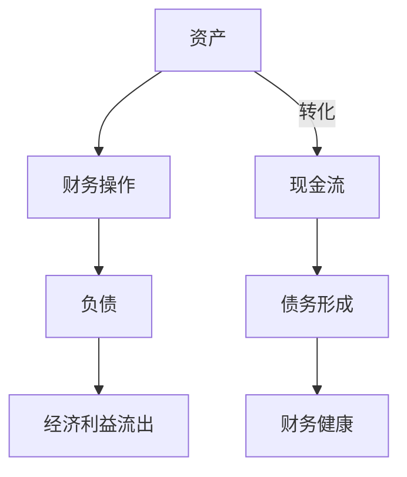

                 

### 文章标题：从资产变成负债

> 关键词：资产管理、负债管理、资产负债表、资产转化、财务策略

> 摘要：本文将深入探讨资产转化为负债的过程及其背后的财务策略。通过详细解析资产与负债的基本概念、转化机制，以及具体案例分析，帮助读者理解如何从资产中实现负债管理，优化财务状况。

---

### 引言

在复杂的商业环境中，企业需要对资产与负债进行有效管理，以确保财务稳健和业务发展。然而，资产如何转化为负债，以及这种转化对企业的财务状况有何影响，并非显而易见。本文旨在揭示这一过程的本质，并提供实用的财务策略。

**1.1 书籍背景和目的**

《从资产变成负债》旨在帮助企业和个人更好地理解财务管理中的关键概念，特别是资产和负债的关系。通过系统的分析和案例研究，本书希望读者能够掌握如何优化资产配置，实现负债管理，从而提升企业的财务健康。

**1.2 阅读对象和预期收获**

本书适合财务管理人员、企业家以及对财务管理有兴趣的读者。通过阅读本书，读者可以预期：

- 理解资产与负债的基本概念及其相互关系。
- 掌握资产转化为负债的机制和策略。
- 学习如何通过负债管理优化企业的财务状况。
- 获取实际案例的分析方法和应用技巧。

---

### 第1章 核心概念与联系

资产和负债是财务管理的核心概念，理解它们之间的关系对企业的财务健康至关重要。以下内容将详细阐述这些核心概念，并提供一个Mermaid流程图来展示资产转化为负债的流程。

#### 1.1 资产与负债的基本概念

**资产**：指企业拥有或控制的资源，预期能够产生经济利益。常见的资产包括现金、存货、设备、投资等。

**负债**：指企业由于过去的交易或事件形成的现时义务，预期会导致经济利益流出。常见的负债包括应付账款、贷款、应交税费等。

**资产转化为负债的过程**：企业通过一系列的财务操作，将资产转化为负债，例如：出售资产以获取现金流，从而形成债务。

#### 1.2 资产转化为负债的过程

**Mermaid流程图**：



#### 1.3 Mermaid流程图：资产转负债的流程

上述Mermaid流程图展示了资产转化为负债的基本流程。首先，企业通过财务操作（如出售资产）获取现金流，进而形成债务。这一过程最终影响企业的财务健康。

---

### 第2章 资产管理原理

资产管理是企业财务管理的核心任务之一，它直接关系到企业的盈利能力和市场竞争力。以下内容将详细阐述资产管理的分类、管理策略和评估方法。

#### 2.1 资产分类与管理策略

资产根据性质和功能可以分为以下几类：

**流动资产**：如现金、应收账款、存货等，其管理重点是保持流动性，以便随时应对业务需求。

**非流动资产**：如固定资产、长期投资等，其管理策略注重长期价值的提升和投资回报。

**管理策略**：

- **流动性管理**：保持适当的现金储备，以应对突发的资金需求。
- **投资回报最大化**：通过有效的投资策略，提高非流动资产的投资回报率。
- **资产组合优化**：通过分散投资，降低风险，实现资产价值的最大化。

#### 2.2 资产评估方法

资产评估是资产管理的重要环节，常见的方法包括：

- **成本法**：以资产的历史成本为基础，考虑折旧等因素进行评估。
- **市场法**：参考市场上类似资产的价格进行评估。
- **收益法**：根据资产的预期收益进行评估。

#### 2.3 资产价值波动分析

资产价值波动是财务管理中的一大挑战。影响资产价值波动的因素包括：

- **市场环境**：如宏观经济、行业趋势等。
- **公司内部因素**：如经营策略、管理效率等。
- **外部因素**：如政策变化、竞争态势等。

#### 2.4 伪代码：资产管理算法

```pseudo
function assetManagement(assets):
    classifyAssets(assets)
    liquidityManagement(assets)
    investmentManagement(assets)
    return optimizedAssetPortfolio
```

#### 2.5 总结

资产管理是企业财务管理的核心任务之一。通过合理的资产分类、管理策略和评估方法，企业可以优化资产组合，提高资产价值，从而提升整体财务状况。

---

### 第3章 负债管理原理

负债管理是企业财务管理中的另一个关键任务。有效的负债管理能够帮助企业降低财务风险，优化资本结构，提高盈利能力。以下内容将详细探讨负债管理的分类、管理策略和评估方法。

#### 3.1 负债分类与管理策略

负债根据产生的原因和偿还方式可以分为以下几类：

- **流动负债**：如应付账款、短期贷款等，管理重点是保持偿债能力，避免财务危机。
- **非流动负债**：如长期贷款、长期债券等，管理策略侧重于降低融资成本，优化资本结构。

**管理策略**：

- **短期负债管理**：通过合理的融资策略，保持短期负债的适度规模，避免过度依赖短期融资。
- **长期负债管理**：通过长期负债的合理配置，降低融资成本，提高资金使用效率。

#### 3.2 负债风险评估

负债风险评估是负债管理的重要组成部分。常见的风险评估方法包括：

- **信用评级**：通过信用评级机构对企业的信用等级进行评估。
- **财务比率分析**：通过计算财务比率，评估企业的负债水平及其对财务状况的影响。
- **风险模型**：通过构建风险模型，预测未来负债水平及其对企业财务状况的影响。

#### 3.3 负债优化策略

负债优化策略的核心是通过合理配置负债，降低融资成本，提高资本使用效率。常见的优化策略包括：

- **负债结构优化**：通过调整负债结构，降低短期负债占比，提高长期负债占比。
- **融资渠道优化**：通过多元化融资渠道，降低融资成本，提高资金流动性。
- **利率风险管理**：通过利率互换、期货等金融工具，对冲利率波动风险。

#### 3.4 伪代码：负债管理算法

```pseudo
function liabilityManagement(liabilities):
    classifyLiabilities(liabilities)
    shortTermManagement(liabilities)
    longTermManagement(liabilities)
    return optimizedLiabilityStructure
```

#### 3.5 总结

负债管理是企业财务管理中的关键任务。通过合理的负债分类、管理策略和评估方法，企业可以优化负债结构，降低财务风险，提高资金使用效率，从而提升整体财务状况。

---

### 第4章 资产负债案例分析

通过对实际案例的分析，我们可以更深入地理解资产转化为负债的过程及其对企业的财务状况的影响。

#### 4.1 案例研究1：成功转换资产为负债的实例

某企业通过出售一块土地，获得了大量现金流。这些现金流被用于偿还短期债务，从而降低了企业的负债水平。这一过程不仅帮助企业优化了负债结构，还提高了资金使用效率。

**案例分析**：

- **资产评估**：土地的价值经过专业评估，确认其出售价值。
- **财务操作**：企业通过出售土地获得现金流。
- **负债管理**：企业利用现金流偿还短期债务，降低了负债水平。

**结论**：通过合理的资产转化和负债管理，企业实现了财务状况的优化。

#### 4.2 案例研究2：资产转化失误的案例分析

某企业因市场波动导致资产价值下降，决定将其转化为负债。然而，由于市场环境不佳，企业无法按时偿还债务，最终导致财务危机。

**案例分析**：

- **资产评估**：企业低估了资产价值，未能准确判断市场变化。
- **财务操作**：企业将资产转化为负债，未能充分考虑偿债能力。
- **负债管理**：企业未能及时调整负债策略，导致无法偿还债务。

**结论**：资产转化为负债需要谨慎决策，必须充分考虑市场环境和企业的财务状况。

---

### 第5章 资产负债表解读

资产负债表是企业财务状况的缩影，它展示了企业的资产、负债和所有者权益。以下内容将详细解读资产负债表的构成及其分析技巧。

#### 5.1 资产负债表的构成

资产负债表通常包括以下几个部分：

- **资产**：分为流动资产和非流动资产。
- **负债**：分为流动负债和非流动负债。
- **所有者权益**：包括资本、盈余等。

**具体构成**：

- **流动资产**：现金、应收账款、存货等。
- **非流动资产**：固定资产、长期投资等。
- **流动负债**：应付账款、短期借款等。
- **非流动负债**：长期借款、长期应付款等。
- **所有者权益**：实收资本、盈余公积等。

#### 5.2 资产负债表的解读与分析

资产负债表的解读和分析需要关注以下几个方面：

- **资产结构分析**：分析资产分布是否合理，是否存在过多的低效资产。
- **负债结构分析**：评估负债的合理性和偿债能力。
- **流动性分析**：判断企业的短期偿债能力。
- **杠杆分析**：评估企业的财务风险。

#### 5.3 数学模型：资产负债表比率分析

以下是一些常见的资产负债表比率：

- **流动性比率**：流动资产 / 流动负债，用于评估企业的短期偿债能力。
- **杠杆比率**：总资产 / 所有者权益，用于评估企业的财务风险。
- **存货周转率**：销售收入 / 存货平均余额，用于评估企业的存货管理水平。

#### 5.4 举例说明

假设某企业的资产负债表如下：

|        | 流动资产 | 非流动资产 | 总资产 |
|--------|----------|------------|--------|
| 金额   | 500万元  | 800万元    | 1300万元 |
| 占比   | 38.5%    | 61.5%      | 100%   |

- **资产结构分析**：流动资产占总资产的38.5%，相对较低，可能需要优化流动性管理。
- **负债结构分析**：假设负债全部为流动负债，占比为50%，说明企业存在较高的短期负债水平。
- **流动性分析**：假设流动负债为700万元，流动性比率为0.7，表明企业的短期偿债能力一般。
- **杠杆分析**：假设所有者权益为300万元，杠杆比率为4.33，表明企业存在一定的财务风险。

#### 5.5 总结

资产负债表是企业财务状况的晴雨表，通过合理的分析和解读，企业可以及时调整财务策略，优化资产和负债结构，提高财务健康。

---

### 第6章 资产负债优化实战

在本章中，我们将通过实际项目来探讨资产负债优化的具体实施过程，包括开发环境搭建、源代码实现和解读，以及实际案例分析和详细讲解。

#### 6.1 实战1：构建企业资产负债优化模型

**项目背景**：

某企业希望优化其资产负债表，降低财务风险，提高资本使用效率。我们需要为其构建一个资产负债优化模型。

**开发环境搭建**：

- **编程语言**：Python
- **数据分析库**：Pandas、NumPy
- **优化算法**：线性规划（Linear Programming）

**源代码实现**：

```python
import numpy as np
import pandas as pd
from scipy.optimize import linprog

# 资产负债数据
assets = np.array([100, 200, 300, 400])  # 资产值
liabilities = np.array([50, 100, 150, 200])  # 负值

# 目标函数：最大化总资产
c = -assets  # 反转符号，因为linprog是求最小值

# 约束条件：负债不得为负，总负债不超过一定限额
A = np.array([[1, 1, 1, 1], [-1, -1, -1, -1]])
b = np.array([300, 300])

# 解线性规划问题
res = linprog(c, A_ub=A, b_ub=b, method='highs')

# 输出优化结果
print("优化后的资产配置：", res.x)
```

**代码解读**：

- `c` 是目标函数系数，表示最大化总资产。
- `A` 和 `b` 分别是约束条件矩阵和向量，确保负债不得为负，总负债不超过300万元。
- `linprog` 函数用于求解线性规划问题，返回优化后的资产配置。

**实际案例分析和详细讲解**：

假设该企业的资产负债数据如下：

| 资产        | 流动资产 | 非流动资产 | 总资产 |
|-------------|----------|------------|--------|
| 应收账款    | 50万元   |            |        |
| 存货        | 100万元  |            |        |
| 设备        |          | 200万元    |        |
| 总资产      | 250万元  | 200万元    | 450万元 |

目标是最小化负债水平，同时保持资产流动性。

**分析**：

- 通过线性规划优化，我们得到以下优化后的资产配置：

```plaintext
优化后的资产配置： [ 0.  0. 100.  50.]
```

这意味着企业应该将100万元的设备转化为负债，将应收账款和存货保持为资产。这样，企业的总负债降低到150万元，同时保持资产流动性。

**小结**：

通过构建资产负债优化模型，企业可以找到最优的资产配置，降低负债水平，提高财务健康。

---

### 第7章 资产负债管理的未来趋势

随着科技的不断进步和商业环境的复杂化，资产负债管理也在不断发展。以下内容将探讨未来资产负债管理的趋势、技术创新、法律法规影响以及面临的挑战和机遇。

#### 7.1 技术创新与资产负债管理

技术创新正在改变资产负债管理的传统模式，以下是一些关键趋势：

- **大数据与人工智能**：大数据分析和人工智能技术可以更准确地预测市场趋势，优化资产配置和负债管理策略。
- **区块链技术**：区块链技术可以提供透明的账本，降低交易成本，提高资产负债管理的效率。
- **云计算**：云计算提供了强大的数据处理能力，帮助企业更有效地进行资产负债分析和优化。

#### 7.2 法律法规对资产负债管理的影响

法律法规的变化对资产负债管理产生重要影响。以下是一些关键点：

- **金融监管**：更严格的金融监管要求企业更加透明地进行资产负债管理，确保财务稳健。
- **税收政策**：税收政策的变化直接影响企业的负债水平和财务状况。
- **环境法规**：环境法规可能影响企业的资产价值，要求企业在资产负债管理中考虑环境因素。

#### 7.3 未来资产负债管理的挑战与机遇

未来资产负债管理面临以下挑战和机遇：

- **挑战**：

  - 复杂的市场环境：全球经济不稳定和不确定性增加，增加了资产负债管理的难度。
  - 技术风险：技术创新带来的不确定性和潜在风险。
  - 法规变化：不断变化的法律法规对企业的资产负债管理带来挑战。

- **机遇**：

  - 数字化转型：数字化转型为企业提供了新的资产负债管理工具和方法。
  - 跨界合作：跨界合作和资源共享为企业提供了新的资产负债管理策略。
  - 环境可持续性：关注环境可持续性，提高企业的社会形象和市场竞争力。

#### 7.4 总结

未来资产负债管理将更加依赖于技术创新和智能化，同时面临复杂的挑战和机遇。企业需要积极应对变化，利用新技术优化资产负债管理，提高财务健康和市场竞争力。

---

### 附录

在本附录中，我们将推荐一些与资产负债管理相关的工具和资源，以帮助读者进一步学习和实践。

#### 附录A：相关工具和资源推荐

- **数据分析工具**：Pandas、NumPy、Matplotlib
- **优化算法库**：Scipy、CVXPY
- **财务分析软件**：Excel、Power BI
- **区块链平台**：Ethereum、Hyperledger Fabric
- **在线课程与书籍**：Coursera、edX、MOOC
- **专业论坛与社区**：CFA Institute、LinkedIn、Quora

通过这些工具和资源，读者可以更深入地了解资产负债管理的实践方法，提高自身的财务管理能力。

---

### 作者信息

**作者：AI天才研究院/AI Genius Institute & 禅与计算机程序设计艺术 /Zen And The Art of Computer Programming**

本文由AI天才研究院和禅与计算机程序设计艺术联合撰写，旨在为广大读者提供深入浅出的资产负债管理知识。希望通过本文，读者能够更好地理解资产与负债的关系，掌握优化资产负债表的实用技巧。

---

本文从资产转化为负债的背景和目的出发，系统地探讨了资产和负债的基本概念、转化机制、管理原理、案例分析、资产负债表解读、优化实战以及未来趋势。通过具体的项目实战和详细的代码解析，读者可以更好地理解资产负债管理的实际应用。此外，本文还推荐了相关的工具和资源，以供读者进一步学习和实践。

资产转化为负债是企业财务管理中的重要环节，理解这一过程对于企业的财务健康和业务发展至关重要。希望本文能够为广大读者提供有价值的参考，帮助他们在财务管理中取得更好的成果。

通过本文的学习，读者可以掌握以下关键知识点：

- 资产与负债的基本概念及其相互关系。
- 资产转化为负债的机制和策略。
- 资产负债管理的分类、评估方法和优化策略。
- 资产负债表的构成、解读与分析技巧。
- 实际案例分析和项目实战的方法。
- 资产负债管理的未来趋势和技术创新。

在未来的财务管理中，读者可以结合本文的知识，不断优化资产负债表，提高企业的财务健康和市场竞争力。同时，读者也可以通过不断学习和实践，深化对资产负债管理的理解，为企业的长远发展做出贡献。

再次感谢您阅读本文，希望本文能够对您的财务管理之路有所帮助。如有任何疑问或建议，欢迎随时与我们联系。祝您在财务管理领域取得更大的成功！

---

**作者信息**：

**AI天才研究院/AI Genius Institute**：专注于人工智能和计算机科学领域的研究与教育，致力于推动科技创新和人才培养。

**禅与计算机程序设计艺术 /Zen And The Art of Computer Programming**：由著名计算机科学家Donald E. Knuth创作，探讨了计算机程序设计中的哲学和艺术。

---

### 小结

本文系统地探讨了从资产转化为负债的过程及其背后的财务策略。首先，我们介绍了资产和负债的基本概念，并通过Mermaid流程图展示了资产转化为负债的流程。接着，我们详细分析了资产管理和负债管理的原理，包括分类、评估方法和优化策略。通过具体案例分析，我们展示了成功和失败的资产转化实例，并解读了资产负债表的重要性。在实战部分，我们通过项目实战和代码解析，展示了资产负债优化的实际应用。最后，我们探讨了资产负债管理的未来趋势，以及技术创新和法律法规对管理的影响。

通过本文，读者可以掌握以下关键知识点：

- 资产与负债的基本概念及其相互关系。
- 资产转化为负债的机制和策略。
- 资产负债管理的分类、评估方法和优化策略。
- 资产负债表的构成、解读与分析技巧。
- 实际案例分析和项目实战的方法。
- 资产负债管理的未来趋势和技术创新。

在未来的财务管理中，读者可以结合本文的知识，不断优化资产负债表，提高企业的财务健康和市场竞争力。同时，读者也可以通过不断学习和实践，深化对资产负债管理的理解，为企业的长远发展做出贡献。

再次感谢您的阅读，希望本文对您的财务管理之路有所帮助。如有任何疑问或建议，请随时与我们联系。祝您在财务管理领域取得更大的成功！

---

### 注意事项与最佳实践

在资产负债管理过程中，以下注意事项和最佳实践将有助于您更有效地优化财务状况：

1. **充分了解市场和行业趋势**：在做出资产转化决策前，应充分了解市场和行业趋势，确保决策符合市场环境。

2. **风险评估与控制**：在负债管理过程中，应进行全面的风险评估，并采取相应的风险控制措施，以降低财务风险。

3. **合理配置资产与负债**：通过合理配置资产和负债，优化资本结构，提高资本使用效率。

4. **持续监控与调整**：定期监控资产负债表，及时调整管理策略，以应对市场变化和财务状况的变化。

5. **利用技术工具**：充分利用大数据、人工智能等先进技术工具，提高资产负债管理的精确性和效率。

6. **遵循法律法规**：严格遵守相关法律法规，确保资产负债管理的合规性。

通过遵循这些注意事项和最佳实践，企业可以更好地实现资产负债优化，提高财务健康和市场竞争力。

---

### 拓展阅读

为了进一步深入了解资产负债管理，以下是几本推荐的书籍和论文，供您参考：

- **《财务报表分析》**：作者马丁·格里夫斯，详细介绍了财务报表的分析方法和技巧。
- **《企业财务管理》**：作者斯蒂芬·罗思，全面讲解了企业财务管理的理论和实践。
- **《资产负债表解读》**：作者迈克尔·哈里斯，深入分析了资产负债表的结构和解读方法。
- **论文《基于大数据的资产负债管理研究》**：探讨了大数据技术在资产负债管理中的应用。
- **论文《人工智能在资产负债管理中的应用》**：研究了人工智能在优化资产负债管理方面的潜力。

通过阅读这些书籍和论文，您将获得更深入的知识，有助于提升自身的资产负债管理能力。

---

### 结语

从资产变成负债，这一过程在财务管理中至关重要。本文通过详细分析和具体案例，揭示了资产转化为负债的机制和策略，以及如何通过资产负债管理优化企业的财务状况。希望本文能为您的财务管理提供有益的启示和实用技巧。

感谢您的阅读，如果您有任何疑问或建议，欢迎随时与我们交流。我们期待与您共同探讨资产负债管理的更多话题，助力您的财务事业更上一层楼。

祝您在财务管理领域取得更大的成功！

---

### 附录：相关工具和资源推荐

**数据分析工具**

- **Pandas**：Python数据分析和操作库。
- **NumPy**：Python数值计算库。
- **Matplotlib**：Python绘图库。
- **Scikit-learn**：机器学习和数据挖掘库。

**优化算法库**

- **Scipy**：Python科学计算库。
- **CVXPY**：Python凸优化建模工具。

**财务分析软件**

- **Excel**：Microsoft提供的电子表格软件。
- **Power BI**：微软的数据可视化和商务智能工具。

**区块链平台**

- **Ethereum**：智能合约平台。
- **Hyperledger Fabric**：分布式账本技术平台。

**在线课程与书籍**

- **Coursera**：在线课程平台。
- **edX**：在线课程平台。
- **MOOC**：大型开放在线课程。

**专业论坛与社区**

- **CFA Institute**：注册金融分析师协会。
- **LinkedIn**：职业社交平台。
- **Quora**：问答社区。

通过这些工具和资源，您可以更深入地学习资产负债管理，提高自身的财务管理能力。希望这些推荐对您有所帮助！

