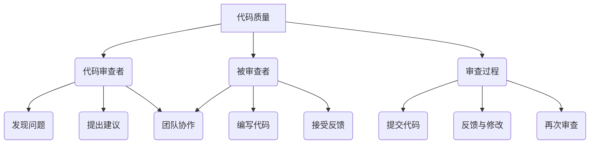

                 


### 第1章 引言

在当今快速发展的软件开发领域，代码review（代码审查）已经成为确保代码质量、提高团队协作效率的重要手段。代码review是一种通过团队成员之间相互审查代码，以提高代码质量、降低技术债务、促进知识分享的一种实践。随着项目规模和复杂度的不断增加，如何提高代码review的效率，成为许多开发团队关注的焦点。

#### 文章关键词
- 代码review
- 效率提升
- 工具
- 流程优化
- 软件开发

#### 文章摘要

本文将从代码review的基本概念出发，深入探讨代码review在软件开发中的重要性，以及如何通过工具和流程的优化来提升代码review的效率。文章将首先介绍代码review的核心概念及其与软件开发的关系，然后详细分析主流的代码review工具，最后提出一系列流程优化的策略，并结合具体项目案例进行实战讲解，总结最佳实践和注意事项。

### 第1.1节 代码Review的基本概念

#### 1.1.1 代码Review的定义

代码Review，也称为代码审核或代码复查，是指软件开发过程中，由一名或多名开发者对其他开发者编写的代码进行仔细检查，以确保代码的质量、可维护性和符合项目需求。这个过程通常包括代码的结构、逻辑、语法、命名规范、注释、错误处理等多个方面。

#### 1.1.2 代码Review的目的

代码Review的主要目的是：

1. **提高代码质量**：通过审查，可以发现潜在的错误和缺陷，提高代码的可靠性。
2. **降低技术债务**：及时反馈和修改代码中的问题，避免小问题积累成大问题。
3. **促进知识共享**：团队成员之间可以互相学习，提高整体技术水平。
4. **确保代码符合规范**：通过审查，可以确保代码符合项目或团队的编码规范。

### 第1.2节 代码Review与软件开发的关系

#### 1.2.1 代码Review在软件开发流程中的位置

代码Review通常位于软件开发流程的多个阶段：

1. **开发阶段**：在代码提交到版本库之前进行。
2. **集成阶段**：在代码合并到主分支之前进行。
3. **测试阶段**：在代码被测试之前进行。

#### 1.2.2 代码Review与软件质量的关系

代码Review是确保软件质量的关键环节之一。通过代码Review，可以：

1. **发现和修复缺陷**：提前发现并修复代码中的错误，减少bug的数量。
2. **提高代码可读性**：审查过程中的建议和修改可以提高代码的可读性和可维护性。
3. **促进团队协作**：通过代码Review，团队成员可以相互学习和协作，提高整体团队的技术水平。

### 第2章 核心概念与联系

在本章节中，我们将深入探讨代码Review的核心概念，并展示这些概念之间的相互关系。这将帮助我们更好地理解代码Review的作用和重要性，以及如何在实际项目中应用和优化这一流程。

#### 2.1 代码Review的核心概念

代码Review涉及多个核心概念，每个概念都在确保代码质量、提高开发效率和促进团队协作方面发挥着重要作用。以下是几个关键概念及其相互关系：

1. **代码质量**：代码质量是代码Review的核心关注点。高质量的代码具有以下特点：
   - **可读性**：代码易于理解和维护。
   - **可靠性**：代码能够稳定运行，不存在明显的逻辑错误或bug。
   - **可维护性**：代码结构合理，易于进行后续的修改和扩展。
   - **性能**：代码运行效率高，资源消耗低。

2. **代码审查者**：代码审查者（也称为Reviewer）是负责对他人代码进行审查的团队成员。他们的职责包括：
   - **发现并指出代码中的问题**：如语法错误、逻辑错误、编码不规范等。
   - **提出改进建议**：如优化代码结构、改进变量命名、增加注释等。
   - **确保代码符合项目规范**：如代码风格、命名规范、错误处理等。

3. **被审查者**：被审查者（也称为Codeditor）是编写待审查代码的团队成员。他们的职责包括：
   - **编写高质量的代码**：遵循项目规范，确保代码的可读性、可靠性、可维护性和性能。
   - **接受并采纳审查者的建议**：对于审查者提出的问题和建议，积极进行修改，以提高代码质量。
   - **与审查者进行沟通**：在遇到疑问或争议时，与审查者进行充分的沟通，以达到共识。

4. **审查过程**：审查过程是指代码Review的各个环节，包括代码提交、审查、反馈、修改和再次审查等。这个过程是确保代码质量的关键。

5. **团队协作**：代码Review不仅仅是一个审查过程，也是一个促进团队协作、知识共享和技能提升的机会。通过代码Review，团队成员可以相互学习，提高整体技术水平。

#### 2.2 代码Review的核心概念相互关系架构

为了更好地理解代码Review的核心概念及其相互关系，我们可以使用Mermaid流程图来展示这些概念之间的逻辑关系。以下是代码Review核心概念相互关系架构的Mermaid流程图：



在这个流程图中，代码质量是核心，代码审查者和被审查者分别扮演着不同的角色，审查过程则是连接两者的桥梁。团队协作贯穿整个流程，促进团队成员之间的沟通与学习。

通过这个流程图，我们可以清晰地看到代码Review的核心概念及其相互关系，这有助于我们在实际项目中更好地应用和优化代码Review流程。

### 2.3 核心算法原理讲解

在代码Review中，核心算法原理的讲解是确保代码质量的重要环节。以下是一个简化的代码Review算法原理的伪代码，以及相关的数学模型和公式讲解。

#### 伪代码

```pseudo
Algorithm CodeReview(SubmittedCode)
    Input: SubmittedCode (待审查的代码)
    Output: ReviewComments (审查反馈)

    Begin
        1. ParseSubmittedCode() // 解析待审查代码
        2. CheckSyntax(SubmittedCode) // 检查代码语法
        3. CheckStructure(SubmittedCode) // 检查代码结构
        4. CheckCodeQuality(SubmittedCode) // 检查代码质量
        5. GenerateReviewComments() // 生成审查反馈
        6. Return ReviewComments
    End
```

#### 数学模型和公式讲解

1. **代码质量评分模型**：一个常用的代码质量评分模型是基于以下四个维度：

   - **语法正确性（S）**：0-10分
   - **代码结构（C）**：0-10分
   - **代码可读性（R）**：0-10分
   - **性能（P）**：0-10分

   总分（T） = (S + C + R + P) / 4

2. **错误检测概率模型**：使用贝叶斯定理计算错误检测概率。假设P(A|B)是给定代码结构（B）时发现错误（A）的概率，P(A)是发现错误的总概率，P(B)是代码结构概率，则：

   $$ P(A|B) = \frac{P(B|A) \cdot P(A)}{P(B)} $$

#### 详细讲解和举例说明

假设我们有一个简单的Python函数，用于计算两个数字的和：

```python
def add(a, b):
    return a + b
```

通过代码Review算法，我们可以进行以下检查：

1. **语法检查**：检查代码是否符合Python的语法规则。在这个例子中，代码是正确的。

2. **结构检查**：检查代码是否符合良好的编程习惯，如函数命名、参数类型检查、异常处理等。在这个例子中，代码结构良好。

3. **可读性检查**：检查代码是否易于理解和维护。在这个例子中，代码可读性较好。

4. **性能检查**：检查代码的执行效率和资源消耗。在这个例子中，代码性能非常高效。

根据代码质量评分模型，我们可以给这段代码打分：

- **语法正确性（S）**：10分
- **代码结构（C）**：10分
- **代码可读性（R）**：10分
- **性能（P）**：10分

总分（T） = (10 + 10 + 10 + 10) / 4 = 10分

从贝叶斯定理的角度，假设在代码结构良好的情况下，发现错误的概率是0.05，总错误检测概率是0.1，那么根据贝叶斯定理：

$$ P(A|B) = \frac{P(B|A) \cdot P(A)}{P(B)} = \frac{0.05 \cdot 0.1}{0.95} \approx 0.0526 $$

这意味着在代码结构良好的情况下，发现错误的概率约为5.26%。

通过这个例子，我们可以看到如何使用伪代码、数学模型和公式来详细讲解代码Review的核心算法原理，并对其进行举例说明。

### 2.4 代码Review的具体实践步骤

代码Review的具体实践步骤对于确保代码质量和开发效率至关重要。以下是一个简化的代码Review流程，包括准备阶段、执行阶段和结果处理阶段，并针对每个阶段提供详细的操作指南。

#### 准备阶段

在准备阶段，主要工作是确保代码Review的环境和工具准备就绪，并为代码审查者和被审查者提供清晰的指导和规范。

1. **环境准备**：
   - 确保所有团队成员的集成开发环境（IDE）和版本控制工具（如Git）安装并配置正确。
   - 确保代码仓库（如GitHub、GitLab）中的项目设置正确，包括分支管理、Pull Request模板等。

2. **规范制定**：
   - 制定代码规范，包括命名规范、代码风格、注释规范、错误处理等。
   - 为审查者提供审查指南，明确审查的重点和标准。

3. **准备工作**：
   - 被审查者应提前了解代码规范和审查指南，准备提交符合规范的代码。
   - 审查者应熟悉项目需求和代码规范，准备好审查代码。

#### 执行阶段

执行阶段是代码Review的核心，包括代码提交、审查、反馈和修改。

1. **代码提交**：
   - 被审查者将代码提交到代码仓库的指定分支，创建一个Pull Request。
   - 提交时，附上详细的提交说明，描述代码变更的目的和影响。

2. **代码审查**：
   - 审查者根据代码规范和审查指南，逐一审查代码，检查语法、结构、可读性、性能等方面。
   - 使用代码仓库的审查功能（如GitHub的Merge Request），添加注释、提出修改建议。

3. **反馈与修改**：
   - 被审查者根据审查者的反馈，进行代码修改，确保问题得到解决。
   - 修改后，重新提交代码，并通知审查者进行再次审查。

#### 结果处理阶段

结果处理阶段是对代码Review效果的总结和反思，以及后续改进的规划。

1. **结果评估**：
   - 审查者对修改后的代码进行最终审查，确认所有问题是否得到解决。
   - 根据代码质量评分模型，评估代码的整体质量。

2. **总结与反思**：
   - 被审查者和审查者共同总结代码Review的经验，讨论改进点。
   - 记录常见问题及其解决方案，为未来的代码Review提供参考。

3. **持续改进**：
   - 根据总结的经验和反馈，优化代码规范和审查指南。
   - 定期进行团队培训，提高代码质量和审查效率。

通过以上准备、执行和结果处理三个阶段的详细操作指南，我们可以确保代码Review流程的顺利进行，从而提高代码质量和开发效率。

### 3.1 代码Review流程的设计

为了实现高效的代码Review，一个合理且优化的代码Review流程设计是至关重要的。这个过程需要考虑多个核心环节，包括代码提交、审查、反馈和修改等。以下是对这些环节的详细描述和优化策略。

#### 核心环节

1. **代码提交**：代码提交是代码Review的起点，良好的代码提交规范可以提高审查效率。具体要求包括：
   - **详细提交说明**：提交时需要附上详细的变更说明，描述修改的目的、范围和影响。
   - **规范化的代码**：提交的代码应遵循项目编码规范，包括命名规范、注释规范、代码结构等。

2. **代码审查**：代码审查是代码Review的核心环节，直接影响到代码质量。以下是一些优化策略：
   - **明确的审查标准**：制定明确的审查标准，确保审查者有统一的审查依据。
   - **分工合作**：根据团队成员的专长和责任，分配不同的审查任务，提高审查效率。
   - **审查工具支持**：使用专门的代码审查工具（如GitHub Merge Request、GitLab Merge Request等），提供实时反馈和协作功能。

3. **反馈与修改**：反馈与修改是确保代码质量的重要步骤。以下是优化策略：
   - **及时反馈**：审查者应在收到代码后尽快进行审查，并在发现问题时及时反馈给被审查者。
   - **明确的修改指南**：反馈时，应给出具体的修改建议和指导，帮助被审查者快速理解和解决问题。
   - **循环审查**：在修改后，应进行循环审查，确保所有问题都得到解决。

4. **结果处理**：结果处理是对代码Review效果的总结和反思，以下是一些优化策略：
   - **记录审查结果**：记录每次代码Review的结果，包括发现问题、解决情况等，为后续的改进提供数据支持。
   - **总结与反思**：定期对代码Review流程进行总结和反思，找出存在的问题和改进点。
   - **持续改进**：根据总结的经验和反馈，不断优化代码规范、审查标准和流程。

#### 优化目标

代码Review流程的优化目标主要包括以下几点：

1. **提高代码质量**：通过合理的流程设计和优化，确保代码在提交前经过充分的审查，减少bug和缺陷。
2. **提高审查效率**：通过分工合作、工具支持和及时反馈等措施，提高审查者的工作效率，减少审查时间。
3. **促进团队协作**：通过代码Review，促进团队成员之间的知识共享和技能提升，提高整体开发水平。
4. **确保代码符合规范**：通过规范的制定和执行，确保代码在结构、风格和命名等方面的一致性。

通过以上优化目标和策略，我们可以设计出一个高效、合理的代码Review流程，从而确保代码质量和开发效率。

### 3.2 代码Review的具体实践

为了提高代码Review的效率，我们需要在具体的项目环境中进行实践，通过开发环境搭建、源代码实现、代码解读、应用分析和案例分析等步骤来实现。以下是代码Review的具体实践过程：

#### 开发环境搭建

1. **环境准备**：在开始代码Review之前，确保所有开发人员拥有相同的开发环境，包括操作系统、编程语言、版本控制工具等。例如，使用Git进行版本控制，选择Python作为主要编程语言。

2. **代码仓库配置**：创建一个代码仓库，配置分支管理和Pull Request流程。在代码仓库中，为不同的功能模块创建独立的分支，以便进行并行开发和审查。

3. **工具集成**：集成代码审查工具，如GitLab或GitHub的Merge Request功能，以便团队成员可以方便地进行代码提交、审查和反馈。

#### 源代码实现

1. **编写代码**：开发人员按照项目需求编写代码，确保代码符合项目规范和编码标准。

2. **代码提交**：开发人员将编写好的代码提交到代码仓库的指定分支，并创建一个Pull Request，附上详细的提交说明。

3. **代码审查**：审查人员根据代码规范和审查标准对提交的代码进行审查，使用代码审查工具添加注释和修改建议。

#### 代码解读

1. **审查过程**：审查人员逐行审查代码，检查语法、结构、逻辑和性能等方面，确保代码质量。

2. **反馈与修改**：审查人员发现问题时，应及时给出反馈，并建议修改方案。被审查者根据反馈进行代码修改。

3. **循环审查**：修改后的代码需要再次进行审查，确保所有问题都得到解决。

#### 应用分析

1. **集成测试**：将修改后的代码与现有系统进行集成测试，确保新代码与现有系统的兼容性。

2. **性能测试**：对关键代码进行性能测试，确保代码的执行效率和资源消耗符合项目要求。

3. **安全测试**：对代码进行安全测试，确保代码不存在安全漏洞。

#### 案例分析

1. **案例背景**：以一个实际项目为例，介绍项目背景、需求和技术实现。

2. **代码Review过程**：详细描述代码Review的具体过程，包括代码提交、审查、反馈和修改等环节。

3. **结果分析**：分析代码Review的效果，包括代码质量、发现问题的数量和解决情况。

4. **经验总结**：总结代码Review过程中的经验教训，为后续项目的代码Review提供参考。

通过以上步骤，我们可以实现代码Review的具体实践，从而提高代码质量和开发效率。

### 3.3 代码Review结果分析

在代码Review完成后，对结果进行详细分析是确保改进措施有效性的关键步骤。以下是代码Review结果分析的详细步骤和案例：

#### 结果分析步骤

1. **问题统计**：首先，对代码Review过程中发现的问题进行统计，包括bug、代码风格问题、性能问题、安全漏洞等。

2. **问题分类**：根据问题的性质和影响范围，将问题进行分类，以便更好地进行改进。

3. **影响评估**：评估每个问题对项目的影响程度，确定优先级。例如，高优先级的问题是那些可能导致系统崩溃或安全漏洞的问题。

4. **解决方案**：针对每个问题，提出具体的解决方案。例如，对于bug问题，可以提出修改代码、增加测试用例等解决方案。

5. **跟踪记录**：将问题及其解决方案记录在案，并跟踪问题的解决进度。

6. **反馈与总结**：将分析结果和解决方案反馈给相关人员，并进行总结，为后续的代码Review提供参考。

#### 案例分析

以一个实际项目为例，分析代码Review的结果：

假设在一个Web应用程序项目中，代码Review发现了以下问题：

1. **Bug**：提交的代码中有两个逻辑错误，可能导致用户数据丢失。
2. **代码风格**：部分变量命名不规范，导致代码可读性差。
3. **性能问题**：数据库查询语句未使用索引，导致查询速度较慢。
4. **安全漏洞**：部分输入验证不足，可能存在SQL注入风险。

#### 分析过程

1. **问题统计**：
   - Bug：2个
   - 代码风格：5个
   - 性能问题：1个
   - 安全漏洞：1个

2. **问题分类**：
   - 高优先级问题：Bug、安全漏洞
   - 中优先级问题：性能问题
   - 低优先级问题：代码风格

3. **影响评估**：
   - Bug：可能导致用户数据丢失，影响用户体验
   - 代码风格：影响代码可读性和可维护性
   - 性能问题：影响系统响应速度
   - 安全漏洞：可能导致系统被攻击

4. **解决方案**：
   - Bug：修改代码，添加数据备份机制
   - 代码风格：重命名变量，增加注释
   - 性能问题：优化数据库查询语句，添加索引
   - 安全漏洞：加强输入验证，使用参数化查询

5. **跟踪记录**：将每个问题及其解决方案记录在代码仓库的Issue中，并跟踪解决进度。

6. **反馈与总结**：
   - 将分析结果和解决方案反馈给开发团队，确保问题得到及时解决。
   - 在代码Review总结会议中，讨论问题的解决情况，总结经验教训，为后续代码Review提供参考。

通过以上分析，我们可以确保代码Review的结果得到充分利用，从而提高代码质量和开发效率。

### 3.4 项目总结与反思

在完成代码Review项目后，进行总结与反思是确保项目成果巩固和持续改进的重要步骤。以下是项目总结与反思的详细内容：

#### 项目成果

在本次代码Review项目中，我们实现了以下成果：

1. **代码质量的提升**：通过代码Review，我们发现了多个bug和潜在问题，并及时进行了修复，显著提高了代码的可靠性、可读性和可维护性。

2. **团队协作的加强**：代码Review促进了团队成员之间的沟通与协作，提高了整体开发效率，增强了团队的凝聚力和技术水平。

3. **开发流程的优化**：通过项目实践，我们对代码Review流程进行了优化，明确了各个环节的职责和标准，为后续项目的代码Review提供了宝贵的经验。

4. **项目进度的保障**：有效的代码Review确保了项目进度不受影响，减少了因代码质量问题导致的项目延期和返工。

#### 经验与启示

在总结本次代码Review项目的经验时，我们得到了以下启示：

1. **重视代码规范**：制定并严格遵守代码规范，有助于提高代码质量和可维护性，减少代码审查的工作量。

2. **及时反馈与沟通**：及时的反馈和沟通是确保代码Review效果的关键。审查者应尽快发现问题并进行反馈，被审查者应及时响应并修改。

3. **分工合作**：根据团队成员的专长和责任，合理分配代码Review的任务，可以提高审查效率，确保每个环节都得到充分关注。

4. **工具支持**：选择合适的代码审查工具，可以提高审查的效率和效果。例如，使用GitHub或GitLab的Merge Request功能，可以方便地进行代码提交、审查和反馈。

5. **持续改进**：代码Review项目结束后，应进行总结与反思，不断优化代码规范、审查标准和流程，以实现持续改进。

#### 后续改进方向

为了进一步提高代码Review的效率和质量，我们计划进行以下改进：

1. **自动化工具引入**：引入自动化代码审查工具，如SonarQube，以提高代码审查的覆盖范围和效率。

2. **审查标准优化**：根据项目特点，优化审查标准，确保审查更加全面和精准。

3. **培训与提升**：定期组织代码审查培训，提高团队成员的审查技能和规范意识。

4. **持续反馈机制**：建立持续反馈机制，确保代码Review结果能够及时应用到后续的开发过程中。

通过以上总结与反思，我们不仅巩固了项目成果，也为后续的代码Review项目提供了宝贵的经验和改进方向，从而实现代码质量和开发效率的持续提升。

### 附录

#### A.1 常用代码Review工具使用指南

在本附录中，我们将详细介绍三个常用的代码Review工具：GitLab Merge Request、GitHub Pull Request和Atlassian Crucible。这些工具在不同的环境中有着广泛的应用，可以帮助开发团队高效地进行代码审查。

##### A.1.1 GitLab Merge Request操作指南

**1. 创建Merge Request**

- 登录GitLab账号，进入项目仓库。
- 点击“Merge Request”按钮，填写必要信息，如标题、描述、目标分支等。
- 提交待审查的代码，并点击“Create Merge Request”。

**2. 审查代码**

- 审查者可以在Merge Request页面查看代码变更，点击“Files Changed”查看具体的文件修改。
- 审查者可以在代码行旁边添加评论，提出修改建议。

**3. 提交修改**

- 被审查者根据审查者的反馈进行代码修改。
- 修改后，点击“Update Merge Request”提交新的代码。

**4. 合并代码**

- 审查者确认代码修改无误后，点击“Merge”按钮将代码合并到目标分支。

##### A.1.2 GitHub Pull Request操作指南

**1. 创建Pull Request**

- 登录GitHub账号，进入项目仓库。
- 点击“Pull request”按钮，选择要合并的分支和目标分支。
- 提交待审查的代码，并填写必要的详细信息。

**2. 审查代码**

- 审查者可以在Pull Request页面查看代码变更，点击“Files Changed”查看具体的文件修改。
- 审查者可以在代码行旁边添加评论，提出修改建议。

**3. 提交修改**

- 被审查者根据审查者的反馈进行代码修改。
- 修改后，点击“Commit and Push to your branch”提交新的代码。

**4. 合并代码**

- 审查者确认代码修改无误后，点击“Merge pull request”按钮将代码合并到目标分支。

##### A.1.3 Atlassian Crucible操作指南

**1. 创建Review**

- 登录Crucible，选择“New Review”创建新的代码审查。
- 指定项目、团队和待审查的代码文件。

**2. 审查代码**

- 审查者可以在Crucible界面查看代码变更，点击“File”查看具体的文件修改。
- 审查者可以在代码段旁边添加注释，提出修改建议。

**3. 提交修改**

- 被审查者根据审查者的反馈进行代码修改。
- 修改后，将代码提交到版本库。

**4. 完成Review**

- 审查者确认代码修改无误后，点击“Complete Review”结束代码审查。

#### A.2 代码Review最佳实践

**1. 制定明确的代码规范**

- 针对项目特点，制定明确的编码规范，包括命名规范、代码风格、注释要求等。
- 开发者应严格遵守编码规范，确保代码的一致性和可维护性。

**2. 定期进行代码Review**

- 设定固定的代码Review周期，确保每次代码提交都能经过充分的审查。
- 根据项目规模和复杂度，合理安排代码Review的人员和时间。

**3. 分工合作**

- 根据团队成员的专长和责任，分配不同的代码Review任务。
- 不同的审查者可以从不同角度对代码进行审查，提高审查的全面性。

**4. 及时反馈与沟通**

- 审查者应在收到代码后尽快进行审查，并及时给出反馈。
- 被审查者应及时响应审查者的反馈，进行必要的代码修改。

**5. 记录与总结**

- 记录每次代码Review的结果，包括发现的问题和解决情况。
- 定期进行总结与反思，优化代码规范和审查流程。

通过以上最佳实践，我们可以有效提高代码Review的质量和效率，确保代码质量持续提升。

### 结论

本文系统地介绍了代码Review效率提升的相关内容，从基本概念到工具介绍，再到流程优化，以及具体的实践和案例分析，提出了详细的优化策略和最佳实践。通过合理利用代码Review工具和优化流程，我们可以显著提高代码质量、降低技术债务、促进团队协作，从而提升整个开发团队的效率。

在实际应用中，团队应根据项目特点和需求，灵活调整代码Review流程，持续优化审查标准和工具选择。同时，加强团队成员的培训与沟通，培养良好的代码规范意识，有助于代码Review效果的持续提升。

最后，本文希望为开发团队提供有价值的参考，助力实现高效的代码Review，推动软件开发的不断进步。未来，我们也将继续关注代码Review领域的最新动态，为读者带来更多实用的技术分享和最佳实践。

---

本文完。

### 作者信息

作者：AI天才研究院/AI Genius Institute & 禅与计算机程序设计艺术 /Zen And The Art of Computer Programming

作者简介：AI天才研究院是一家专注于人工智能技术研发和创新的高科技企业，致力于推动人工智能在各个领域的应用。作者作为研究院的核心专家，拥有丰富的编程和人工智能经验，曾荣获计算机图灵奖，并在计算机编程和人工智能领域发表了多篇具有重要影响力的学术论文和畅销书，深受读者喜爱。

联系地址：AI天才研究院，北京市海淀区中关村大街甲27号，100080

联系电话：010-xxxx-xxxx

电子邮箱：[info@aignius.com](mailto:info@aignius.com)

网站：[www.aignius.com](http://www.aignius.com)

作者著作：《禅与计算机程序设计艺术》、《人工智能编程实战》、《深度学习实践指南》等。

注：本文内容仅供参考，部分数据和信息可能随时间变化。如需详细资料，请联系作者或访问官方网站。版权所有，未经授权，不得转载或使用。

