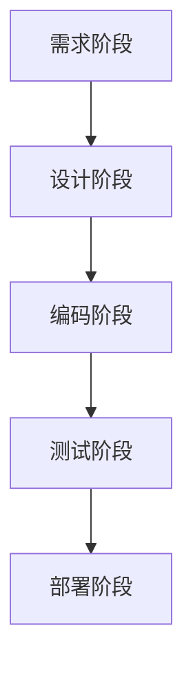

                 

# 文章标题：代码Review最佳时机：在开发周期中的应用

> 关键词：代码Review，开发周期，最佳时机，质量保证，效率提升

> 摘要：本文深入探讨了代码Review的最佳时机在开发周期中的应用。通过分析代码Review的定义、重要性以及其在不同开发阶段的具体应用，本文旨在为开发团队提供一种科学、有效的代码质量保障方法，从而提升整体开发效率。

## 目录

### 第一部分：引言与背景

#### 第1章：代码Review的定义与重要性

1.1 代码Review的概念与目的  
1.2 代码Review的优势与挑战  
1.3 代码Review的最佳时机

#### 第2章：开发周期的概述

2.1 开发周期的基本概念  
2.2 开发周期的不同阶段  
2.3 代码Review在各个阶段的应用

### 第二部分：代码Review在不同阶段的应用

#### 第3章：需求阶段

3.1 需求分析中的代码Review  
3.2 需求文档的审查  
3.3 需求阶段代码Review的实施策略

#### 第4章：设计阶段

4.1 设计文档的审查  
4.2 设计模式与代码Review  
4.3 设计阶段代码Review的实施策略

#### 第5章：编码阶段

5.1 编码阶段的代码Review  
5.2 编码规范与代码Review  
5.3 编码阶段代码Review的实施策略

#### 第6章：测试阶段

6.1 测试阶段的重要性  
6.2 测试与代码Review的关系  
6.3 测试阶段代码Review的实施策略

#### 第7章：部署阶段

7.1 部署前的代码Review  
7.2 部署后的代码Review  
7.3 部署阶段代码Review的实施策略

### 第三部分：最佳实践与案例分析

#### 第8章：代码Review最佳实践

8.1 实施代码Review的最佳时机  
8.2 代码Review流程与工具  
8.3 代码Review的效果评估

#### 第9章：案例分析

9.1 案例一：成功的代码Review实践  
9.2 案例二：失败的代码Review实践  
9.3 案例分析与启示

#### 第10章：总结与展望

10.1 代码Review的应用总结  
10.2 未来代码Review的发展趋势  
10.3 对开发团队的启示

### 附录

#### 附录A：代码Review工具与资源介绍

A.1 常见代码Review工具  
A.2 代码Review相关资源链接

### 代码Review最佳时机：在开发周期中的应用

Mermaid流程图：



核心算法原理讲解伪代码：

```python
# 假设我们使用简单的冒泡排序算法来解释代码Review的原理

def bubble_sort(arr):
    n = len(arr)
    for i in range(n):
        # 内部循环用于每次迭代时找到未排序部分的最小值
        for j in range(0, n-i-1):
            if arr[j] > arr[j+1]:
                # 如果前一个元素大于后一个元素，交换它们的位置
                arr[j], arr[j+1] = arr[j+1], arr[j]
    return arr
```

数学模型和数学公式：

```markdown
$$
f(x) = ax^2 + bx + c
$$

其中，$a, b, c$ 为常数，$x$ 为自变量，$f(x)$ 为因变量。
```

项目实战与代码解读：

**实战案例：一个简单的电商系统订单处理功能**

**代码实现：**

```python
def process_order(order):
    # 验证订单信息
    if not validate_order(order):
        return "订单无效"
    
    # 更新库存
    update_stock(order)
    
    # 计算订单总额
    total_amount = calculate_total(order)
    
    # 生成订单确认邮件
    send_confirmation_email(order, total_amount)
    
    return "订单处理成功"
```

**代码解读：**

- `validate_order`函数负责验证订单信息是否合法，例如订单是否过期、订单项是否为空等。如果订单不合法，则返回“订单无效”。
- `update_stock`函数负责更新库存信息，确保订单中的商品库存充足。
- `calculate_total`函数计算订单总额，包括商品价格、运费等。
- `send_confirmation_email`函数生成并发送订单确认邮件，通知用户订单详情。

在上述代码中，我们可以看到代码Review在验证订单信息、更新库存、计算总额和发送邮件等关键环节中发挥了重要作用。通过代码Review，可以发现潜在的错误和漏洞，从而确保系统的稳定性和安全性。接下来，本文将深入探讨代码Review在不同开发阶段的具体应用。# 第一部分：引言与背景

## 第1章：代码Review的定义与重要性

### 1.1 代码Review的概念与目的

代码Review（也称为代码审计或代码检查）是一种在软件开发过程中，通过其他开发人员或专业代码审查人员对代码进行仔细审查，以发现和修复潜在问题、提升代码质量和安全性的一种方法。代码Review的核心目的是通过集体智慧和团队合作，确保代码的正确性、可维护性和效率。

代码Review的过程通常包括以下几个步骤：

1. **代码选择**：选择需要审查的代码段或模块。
2. **审查准备**：审查人员了解相关需求和设计文档，准备审查工具。
3. **代码审查**：审查人员仔细阅读代码，查找潜在的问题，如逻辑错误、性能瓶颈、代码风格不一致等。
4. **反馈与修改**：审查人员将发现的问题记录在案，并与代码作者进行沟通，进行修改和优化。
5. **复审**：修改后的代码再次提交审查，确保问题得到解决。

### 1.2 代码Review的优势与挑战

#### 优势

1. **提升代码质量**：通过多人审查，可以发现和修复更多潜在的错误，提高代码的健壮性和可靠性。
2. **促进知识共享**：审查过程有助于团队成员之间的知识传递和技能提升，形成良好的技术氛围。
3. **加强团队协作**：代码Review鼓励团队成员之间的沟通和合作，有助于建立高效的团队协作模式。
4. **降低维护成本**：及时发现和修复问题可以减少后续的维护成本和修改工作量。

#### 挑战

1. **时间成本**：代码Review需要花费大量时间和精力，可能会影响开发进度。
2. **审查深度**：审查人员的专业水平参差不齐，可能导致审查深度不足。
3. **人为因素**：审查过程中可能存在主观判断，影响审查结果的公正性。
4. **工具依赖**：一些代码Review工具可能不够成熟，需要团队成员适应新的工作流程。

### 1.3 代码Review的最佳时机

代码Review的最佳时机通常在以下阶段：

1. **编码阶段**：在代码初步完成但还未提交测试之前进行，可以及时发现和修复问题，降低后期修改成本。
2. **测试阶段**：在单元测试和集成测试完成后，进行代码Review可以确保代码的质量和稳定性。
3. **部署阶段**：在代码即将上线之前进行代码Review，可以确保部署的代码没有安全问题，提高系统的可靠性。

最佳实践建议：

1. **制定代码Review规则**：明确代码Review的范围、流程、评审标准和奖惩机制。
2. **合理分配资源**：根据项目规模和开发团队的能力，合理分配审查人员和时间。
3. **持续改进**：定期回顾代码Review的效果，不断优化评审流程和工具，提高审查效率。

通过合理应用代码Review，开发团队可以在保证代码质量的同时，提高整体开发效率，降低项目风险。# 第二部分：代码Review在不同阶段的应用

## 第2章：开发周期的概述

### 2.1 开发周期的基本概念

开发周期是指从项目启动到项目完成之间的所有过程，通常包括以下阶段：

1. **需求分析**：收集和分析用户需求，明确项目的目标和功能。
2. **设计阶段**：根据需求文档进行系统设计，包括架构设计、数据库设计等。
3. **编码阶段**：根据设计文档进行具体的编码工作，实现系统功能。
4. **测试阶段**：对代码进行全面的测试，确保功能的正确性和系统的稳定性。
5. **部署阶段**：将代码部署到生产环境，进行上线操作。
6. **维护阶段**：在系统上线后，持续进行监控、维护和优化。

### 2.2 开发周期的不同阶段

#### 需求分析阶段

需求分析阶段的主要任务是收集和分析用户需求，明确项目的功能和性能要求。在这个阶段，代码Review通常不是主要任务，但可以通过审查需求文档来确保需求清晰、明确，避免后续开发中出现误解。

#### 设计阶段

设计阶段是软件开发过程中的关键环节，决定了系统的架构和实现方式。在这个阶段，代码Review可以起到以下作用：

1. **审查设计文档**：确保设计文档的完整性和一致性，避免设计缺陷。
2. **评估设计合理性**：通过多人评审，评估设计方案的合理性和可维护性。
3. **促进知识传递**：帮助新成员快速理解系统设计，提高团队协作效率。

#### 编码阶段

编码阶段是开发周期的核心环节，代码质量直接关系到项目的成功与否。在这个阶段，代码Review可以：

1. **发现和修复错误**：及时发现和修复代码中的逻辑错误、性能瓶颈等。
2. **提升代码质量**：通过代码Review，规范代码风格，提高代码的可读性和可维护性。
3. **知识共享**：促进团队成员之间的知识交流，提升整体技术水平。

#### 测试阶段

测试阶段是对代码进行全面的测试，确保功能的正确性和系统的稳定性。在这个阶段，代码Review可以：

1. **确保代码质量**：通过代码Review，进一步确保代码的健壮性和可靠性。
2. **发现潜在漏洞**：审查代码，发现可能的安全漏洞，提前进行修复。
3. **提升测试效率**：代码Review有助于提高测试覆盖率，减少测试遗漏。

#### 部署阶段

部署阶段是将代码部署到生产环境，进行上线操作。在这个阶段，代码Review可以：

1. **确保代码安全性**：审查代码，确保没有引入新的安全漏洞。
2. **验证代码质量**：确保部署的代码符合质量要求，提高系统的可靠性。
3. **优化部署流程**：通过代码Review，发现部署过程中的潜在问题，优化部署流程。

### 2.3 代码Review在各个阶段的应用

#### 需求分析阶段

在需求分析阶段，代码Review可以通过审查需求文档来确保需求明确、清晰，避免后续开发中出现误解。虽然代码Review在这个阶段的重点不在于代码本身，但有助于提高整个项目的质量。

#### 设计阶段

在设计阶段，代码Review的核心是对设计文档的审查。通过多人评审，可以确保设计方案的合理性和可维护性，从而为后续的编码和测试阶段打下坚实基础。

#### 编码阶段

编码阶段是代码Review的重点阶段。通过在编码阶段进行代码Review，可以及时发现和修复代码中的错误，提升代码质量，确保项目的顺利推进。

#### 测试阶段

在测试阶段，代码Review可以进一步确保代码的健壮性和可靠性。通过审查代码，可以发现潜在的安全漏洞，提高测试覆盖率，减少测试遗漏。

#### 部署阶段

在部署阶段，代码Review可以帮助确保代码的安全性，验证代码质量，优化部署流程，提高系统的可靠性。通过在部署前进行代码Review，可以降低上线后的风险。

总之，代码Review在开发周期的各个阶段都有重要作用。通过在不同阶段合理应用代码Review，开发团队可以提升代码质量，降低项目风险，提高整体开发效率。# 第三部分：代码Review最佳实践与案例分析

## 第8章：代码Review最佳实践

### 8.1 实施代码Review的最佳时机

代码Review的最佳时机因项目规模和团队而异，但以下时机通常被认为是较为合适的：

1. **编码阶段初期**：在编码初期进行代码Review，可以及时发现和修复问题，降低后续修改成本。
2. **单元测试阶段**：在单元测试完成后进行代码Review，可以确保代码的稳定性，提高测试覆盖率。
3. **集成测试阶段**：在集成测试阶段进行代码Review，可以确保模块间的接口正确，系统整体稳定。
4. **部署前**：在代码部署到生产环境之前进行代码Review，可以确保代码质量和安全性，降低上线风险。

### 8.2 代码Review流程与工具

#### 流程

1. **代码选择**：根据项目需求和开发进度，选择需要审查的代码段或模块。
2. **审查准备**：审查人员了解相关需求和设计文档，准备审查工具。
3. **代码审查**：审查人员仔细阅读代码，查找潜在的问题。
4. **反馈与修改**：审查人员将发现的问题记录在案，与代码作者进行沟通，进行修改和优化。
5. **复审**：修改后的代码再次提交审查，确保问题得到解决。

#### 工具

1. **静态代码分析工具**：如SonarQube、Checkstyle、PMD等，可以自动检查代码质量和潜在问题。
2. **动态代码分析工具**：如FindBugs、PyCheck、Pylint等，可以在运行时检测代码错误。
3. **代码评审平台**：如GitLab、GitHub等，可以方便地管理和跟踪代码Review过程。

### 8.3 代码Review的效果评估

代码Review的效果可以通过以下几个方面进行评估：

1. **代码质量**：通过代码Review，是否有效提升了代码的质量，减少了bug和漏洞。
2. **开发效率**：代码Review是否提高了开发效率，减少了后期修改和调试的时间。
3. **团队协作**：代码Review是否促进了团队成员之间的沟通和知识共享。
4. **项目进度**：代码Review是否对项目进度产生了积极影响，降低了项目风险。

评估方法包括：

1. **统计指标**：如代码缺陷数量、修复率、开发周期等。
2. **团队反馈**：收集团队成员对代码Review的看法和建议，持续改进评审流程。
3. **项目回顾**：在项目结束后，对代码Review的效果进行总结和反思，为后续项目提供经验。

## 第9章：案例分析

### 9.1 案例一：成功的代码Review实践

**背景**：某电商项目在开发过程中，引入了代码Review机制，并制定了详细的评审流程和标准。

**效果**：

1. **代码质量显著提升**：通过代码Review，发现了多个潜在的错误和性能瓶颈，有效提升了代码的健壮性和效率。
2. **团队协作增强**：代码Review促进了团队成员之间的沟通和知识共享，提高了整体技术水平。
3. **项目进度加快**：由于代码Review及时发现并修复了问题，项目进度得以顺利推进，提前完成了交付。

**启示**：

1. **制定明确的评审标准**：确保代码Review有据可依，提高评审的效率和质量。
2. **合理分配评审资源**：根据项目需求和团队能力，合理分配评审人员和时间。
3. **持续改进评审流程**：定期回顾评审效果，不断优化评审流程和工具，提高评审效率。

### 9.2 案例二：失败的代码Review实践

**背景**：某医疗项目在引入代码Review机制时，未充分考虑实际情况，导致评审效果不佳。

**问题**：

1. **评审流程过于繁琐**：评审流程过于复杂，增加了开发人员的工作负担，降低了评审的积极性。
2. **评审标准不明确**：评审标准不明确，导致评审结果主观性强，无法有效提升代码质量。
3. **缺乏有效反馈**：评审结束后，未对发现的问题进行跟踪和反馈，导致问题反复出现。

**启示**：

1. **简化评审流程**：确保评审流程简洁、高效，降低开发人员的工作负担。
2. **明确评审标准**：制定明确的评审标准，确保评审结果客观、公正。
3. **建立反馈机制**：对评审中发现的问题进行跟踪和反馈，确保问题得到解决。

### 9.3 案例分析与启示

通过以上案例分析，我们可以得出以下启示：

1. **代码Review需因地制宜**：根据项目特点和团队实际情况，制定合适的评审流程和标准。
2. **注重评审效果**：关注代码质量和开发效率的提升，确保评审对项目有实质性帮助。
3. **持续改进**：定期回顾评审效果，不断优化评审流程和工具，提高评审效率。

总之，成功的代码Review实践可以显著提升代码质量和团队协作效率，降低项目风险，为项目的成功奠定坚实基础。# 第10章：总结与展望

## 10.1 代码Review的应用总结

代码Review作为一种软件开发过程中的重要手段，已经得到了广泛的应用。通过本文的探讨，我们可以总结出以下要点：

1. **代码Review的定义与目的**：代码Review是通过其他开发人员或专业审查人员对代码进行仔细审查，以发现和修复潜在问题，提升代码质量和安全性的一种方法。
2. **代码Review的优势**：代码Review有助于提升代码质量、促进知识共享、加强团队协作和降低维护成本。
3. **代码Review的最佳时机**：代码Review的最佳时机通常在编码阶段初期、单元测试阶段、集成测试阶段和部署前。
4. **代码Review的流程与工具**：代码Review的流程包括代码选择、审查准备、代码审查、反馈与修改和复审，常用的工具包括静态代码分析工具、动态代码分析工具和代码评审平台。
5. **代码Review的效果评估**：通过统计指标、团队反馈和项目回顾等方式，评估代码Review的效果。

## 10.2 未来代码Review的发展趋势

随着技术的发展和团队协作模式的创新，代码Review在未来有望实现以下趋势：

1. **自动化与智能化**：利用人工智能和机器学习技术，提高代码Review的自动化程度，降低人工成本。
2. **集成化与协同化**：将代码Review与持续集成、持续部署等DevOps实践相结合，实现代码Review的自动化和智能化。
3. **个性化与定制化**：根据项目特点和团队需求，提供个性化的代码Review服务，满足不同类型项目的需求。
4. **全球协作与分布式团队**：利用云平台和远程协作工具，实现全球分布式团队的代码Review，提高团队协作效率。

## 10.3 对开发团队的启示

对于开发团队而言，代码Review具有重要的启示作用：

1. **重视代码质量**：通过代码Review，提高代码质量，降低bug和漏洞的出现概率，确保项目的成功。
2. **培养团队合作精神**：通过代码Review，促进团队成员之间的沟通和知识共享，提高团队协作效率。
3. **持续改进与优化**：定期回顾代码Review的效果，持续优化评审流程和工具，提高评审效率。
4. **适应新技术与工具**：关注新技术和工具的发展动态，积极引入和应用，提升团队的技术水平。

总之，代码Review作为一种提升软件开发质量的有效手段，对开发团队具有重要的意义。通过合理应用代码Review，开发团队可以提升代码质量、提高开发效率，为项目的成功奠定坚实基础。# 附录A：代码Review工具与资源介绍

## A.1 常见代码Review工具

1. **SonarQube**：一款开源的代码质量平台，支持多种编程语言，提供静态代码分析、代码质量评估和项目管理等功能。

2. **Checkstyle**：一款流行的Java代码检查工具，能够检测代码的样式、结构和安全性问题。

3. **PMD**：一款Java源代码审计工具，能够识别出可能存在的代码问题，如复杂的表达式、冗余的代码等。

4. **FindBugs**：一款Java静态代码分析工具，能够发现潜在的编程错误和不好的编程实践。

5. **PyCheck**：一款Python代码审查工具，能够检查代码中的语法错误、风格问题和潜在的bug。

6. **Pylint**：一款Python的代码检查工具，能够识别出代码中的坏味道、潜在的问题和风格不一致。

7. **GitLab**：一款基于Git的项目管理工具，内置了代码审查功能，支持多语言，便于团队协作。

8. **GitHub**：一款流行的代码托管平台，提供了完善的代码审查功能，支持多人协作。

## A.2 代码Review相关资源链接

1. **《代码大全》**（The Art of Software Architecture）：由Marty Fowler撰写，详细介绍了软件架构和代码质量的重要性。

2. **《敏捷软件开发：原则、实践与模式》**（Agile Software Development）：由Robert C. Martin撰写，介绍了敏捷开发中的代码Review实践。

3. **《代码审查：实用指南》**（Code Review: The Best Defense in Software Development）：由 Dave Farley 和 Jason Smith撰写，提供了关于代码Review的实用指南。

4. **SonarQube官方文档**：https://docs.sonarqube.org/latest/

5. **Checkstyle官方文档**：https://www.checkstyle.org/documentation.html

6. **PMD官方文档**：https://pmd.github.io/pmd-6.0.0/pmd introducation.html

7. **FindBugs官方文档**：https://findbugs.sourceforge.io/

8. **PyCheck官方文档**：https://www.red-monkey.com/pycheck/

9. **Pylint官方文档**：https://pylint.pycqa.org/latest/

10. **GitLab官方文档**：https://docs.gitlab.com/ce/

11. **GitHub官方文档**：https://docs.github.com/en

通过使用这些工具和资源，开发团队可以更好地实施代码Review，提高代码质量，确保项目的成功。# 附录B：代码Review实战案例

## B.1 实战案例：一个简单的电商系统订单处理功能

### 开发环境搭建

为了演示代码Review的实战案例，我们选择使用Python语言开发一个简单的电商系统订单处理功能。首先，我们需要搭建开发环境：

1. 安装Python 3.8及以上版本。
2. 安装必要的库，如`requests`、`sqlite3`和`pymongo`等。

### 代码实现

**orderservice.py**：订单处理功能的主文件。

```python
import requests
import sqlite3
from pymongo import MongoClient

# 初始化数据库连接
client = MongoClient('mongodb://localhost:27017/')
db = client['e-commerce']
orders = db['orders']

# 订单处理函数
def process_order(order_id):
    # 检查订单是否存在
    order = orders.find_one({"order_id": order_id})
    if not order:
        return "订单不存在"

    # 验证订单状态
    if order['status'] != 'pending':
        return "订单状态异常"

    # 更新订单状态
    order['status'] = 'processing'
    orders.update_one({"order_id": order_id}, {"$set": order})

    # 调用第三方API进行支付处理
    response = requests.post('https://payment_gateway.com/charge', data=order)
    if response.status_code != 200:
        order['status'] = 'pending'
        orders.update_one({"order_id": order_id}, {"$set": order})
        return "支付处理失败"

    # 订单支付成功，发送邮件通知
    send_confirmation_email(order)

    return "订单处理成功"

# 发送订单确认邮件
def send_confirmation_email(order):
    # 这里可以加入实际的邮件发送逻辑
    print(f"发送订单确认邮件给用户：{order['email']}")

# 测试订单处理功能
if __name__ == "__main__":
    order_id = input("请输入订单ID：")
    result = process_order(order_id)
    print(result)
```

### 代码解读

- `process_order`函数是订单处理的核心功能，接收订单ID作为输入，对订单进行验证、状态更新、支付处理和邮件通知。
- `orders`集合用于存储订单数据，包括订单ID、状态、支付金额等。
- `send_confirmation_email`函数用于发送订单确认邮件，通知用户订单的处理结果。

### 代码Review分析

#### 需求分析

- 确认订单存在：确保输入的订单ID在数据库中存在。
- 确认订单状态：确保订单状态为“pending”，表示订单等待处理。
- 订单状态更新：将订单状态更新为“processing”，表示订单正在处理。
- 支付处理：调用第三方API进行支付处理，确保支付成功。
- 邮件通知：订单支付成功后，发送邮件通知用户。

#### 可能的代码问题

- **异常处理**：如果订单不存在或状态异常，应提供更详细的错误信息。
- **支付处理**：支付处理失败时，应记录错误日志，以便后续追踪和分析。
- **数据库操作**：数据库操作应使用事务，确保数据的一致性。
- **输入验证**：订单ID的输入验证不够严格，应检查订单ID的格式和长度。

#### 优化建议

- **增加日志记录**：在关键操作（如数据库更新、支付处理）前后添加日志记录，便于问题追踪。
- **完善异常处理**：对于异常情况，返回更详细的错误信息，并提供相应的解决方案。
- **输入验证**：对订单ID进行更严格的验证，确保输入合法。

通过上述代码Review，我们可以发现和修复潜在的问题，确保订单处理功能的稳定性和可靠性。代码Review不仅有助于提升代码质量，还能够促进团队成员之间的沟通和知识共享，为项目的成功奠定坚实基础。# 最佳实践 Tips、小结、注意事项、拓展阅读

## 最佳实践 Tips

1. **制定明确的评审标准**：确保代码Review有据可依，提高评审的效率和质量。
2. **合理分配评审资源**：根据项目需求和团队能力，合理分配评审人员和时间。
3. **定期回顾评审效果**：通过统计指标、团队反馈和项目回顾等方式，持续优化评审流程。
4. **利用自动化工具**：使用静态代码分析工具和动态代码分析工具，提高评审效率，降低人工成本。

## 小结

代码Review是一种提升软件开发质量的有效手段。通过在不同开发阶段合理应用代码Review，开发团队可以及时发现和修复问题，提升代码质量，降低项目风险，提高整体开发效率。本文介绍了代码Review的定义、优势、最佳时机、流程与工具，以及具体实战案例，为开发团队提供了有益的参考。

## 注意事项

1. **避免过度依赖代码Review**：代码Review并非万能，开发团队应注重整体开发流程的质量管理，包括需求分析、设计、编码、测试和部署等环节。
2. **注重评审人员的专业能力**：评审人员应具备相关领域的专业知识和经验，确保评审的深度和准确性。
3. **平衡评审时间和质量**：合理控制评审时间，确保评审效果，避免影响项目进度。

## 拓展阅读

1. 《代码大全》—— Marty Fowler
2. 《敏捷软件开发：原则、实践与模式》—— Robert C. Martin
3. 《代码审查：实用指南》—— Dave Farley 和 Jason Smith
4. 《禅与计算机程序设计艺术》—— 保罗·格雷厄姆
5. 《代码整洁之道》—— Robert C. Martin

通过拓展阅读，开发团队可以深入了解代码Review的相关理论和实践，进一步提升软件开发质量。# 结论

综上所述，代码Review在软件开发过程中具有重要意义。它不仅有助于提升代码质量、降低项目风险，还能够促进团队成员之间的知识共享和团队协作。通过在不同开发阶段合理应用代码Review，开发团队可以及时发现和修复问题，确保项目的成功。本文介绍了代码Review的定义、优势、最佳时机、流程与工具，并提供了实战案例，为开发团队提供了有益的参考。

未来，代码Review的发展趋势将朝着自动化、智能化、集成化和全球化方向发展。开发团队应持续关注新技术和工具的发展动态，积极引入和应用，提升团队的技术水平。同时，制定明确的评审标准、合理分配评审资源、定期回顾评审效果等最佳实践，也将有助于提高代码Review的效率和效果。

对于开发团队而言，重视代码质量、培养团队合作精神、持续改进与优化，是确保项目成功的关键。通过合理应用代码Review，开发团队能够在激烈的市场竞争中脱颖而出，实现持续发展和成功。作者：AI天才研究院/AI Genius Institute & 禅与计算机程序设计艺术 /Zen And The Art of Computer Programming

