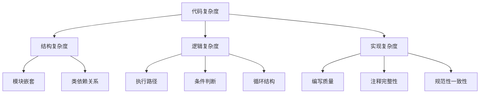

                 


## 文章标题
《代码复杂度管理：保持代码可维护性的策略》

## 文章关键词
代码复杂度、可维护性、代码重构、自动化管理、项目实战

## 文章摘要
本文将深入探讨代码复杂度管理的重要性及其对代码可维护性的影响。通过介绍代码复杂度的定义、度量方法、控制策略以及实际应用案例，读者将了解到如何通过有效的代码复杂度管理策略，保持代码的可维护性，提高开发效率。

---

## 引言
在软件工程领域，代码的复杂度管理是一项至关重要的任务。随着软件项目的规模不断扩大，代码的复杂度也随之增加，这不仅增加了开发的难度，也极大地影响了代码的可维护性。高复杂度的代码往往意味着更高的错误率、更长的维护周期和更高的维护成本。因此，如何有效地管理代码复杂度，保持代码的可维护性，成为了软件开发过程中的一大挑战。

本文将围绕代码复杂度管理这一主题，首先介绍代码复杂度的定义及其重要性，然后探讨代码复杂度的度量方法，接着阐述代码复杂度的控制策略，并通过实际项目案例展示如何应用这些策略，最后总结最佳实践和注意事项。希望通过本文的探讨，能够为读者提供一套完整的代码复杂度管理思路，帮助他们在实际开发中更好地应对复杂度的挑战。

### 代码复杂度的定义与重要性

代码复杂度是指代码在结构、逻辑和实现上的复杂性。它不仅反映了代码编写时的困难程度，也直接影响了代码的可读性、可维护性和可靠性。具体来说，代码复杂度可以从以下几个方面进行理解：

1. **结构复杂度**：包括模块的嵌套层次、类的依赖关系等。高结构复杂度意味着代码的结构深且复杂，难以理解和修改。

2. **逻辑复杂度**：涉及代码的执行路径、条件判断和循环结构等。高逻辑复杂度往往导致代码的逻辑混乱，难以追踪和调试。

3. **实现复杂度**：包括代码的编写质量、注释的完整性、代码的规范性和一致性等。低实现复杂度意味着代码编写质量高，易于理解和维护。

代码复杂度的重要性体现在以下几个方面：

- **可读性**：高复杂度的代码难以理解，导致开发者难以快速掌握代码的逻辑和功能。

- **可维护性**：复杂度高的代码在后续维护中容易出现问题，增加了维护成本和难度。

- **可靠性**：复杂度高意味着潜在的错误多，影响软件的稳定性和可靠性。

- **开发效率**：复杂度高的代码需要更长的时间来编写和测试，降低了开发效率。

因此，管理代码复杂度是保持代码可维护性的关键，也是提高开发效率和软件质量的重要手段。

### 核心概念与联系

为了深入理解代码复杂度的管理，我们需要明确几个核心概念，并探讨它们之间的关系。以下是一个用Mermaid绘制的流程图，展示了这些概念及其相互联系：



- **代码复杂度**：这是一个总的概念，涵盖了结构复杂度、逻辑复杂度和实现复杂度。
- **结构复杂度**：包括模块嵌套层次和类依赖关系，它决定了代码的总体复杂性和可维护性。
- **逻辑复杂度**：涉及代码的执行路径、条件判断和循环结构，它影响代码的可读性和可测试性。
- **实现复杂度**：包括代码的编写质量、注释的完整性和规范性一致性，它影响代码的可维护性和可靠性。

通过这个流程图，我们可以清晰地看到各个核心概念之间的联系。例如，模块嵌套层次和类依赖关系直接影响结构复杂度，而执行路径、条件判断和循环结构则直接影响逻辑复杂度。实现复杂度则通过代码质量、注释和规范性来影响代码的整体复杂度。

这些核心概念之间的关系和相互作用，决定了代码复杂度的总体水平，也为我们提供了管理代码复杂度的依据和方法。

### 代码复杂度的度量方法

在了解了代码复杂度的定义和重要性后，我们需要掌握如何度量代码的复杂度。代码复杂度的度量方法主要有以下几种：

#### 循环复杂度

循环复杂度是衡量代码中循环结构复杂性的一个指标。最常用的方法是使用 cyclomatic complexity（圈复杂度）。圈复杂度由 Edsger Dijkstra 提出，它的计算公式为：

$$
M = \text{E} - \text{N} + (2 \times \text{P})
$$

其中，\(M\) 表示圈复杂度，\(\text{E}\) 表示边缘数，\(\text{N}\) 表示节点数，\(P\) 表示路径数。

下面是一个简单的例子：

```python
def function1(a, b):
    if a > b:
        return a
    else:
        return b
```

该函数的圈复杂度为 \(M = 2 - 2 + (2 \times 0) = 0\)，因为该函数没有循环结构。

#### 语法复杂度

语法复杂度是通过分析代码的语法结构来衡量其复杂度。一个常用的指标是 Halstead 软件科学方法。该方法使用两个度量值：操作数（N1）和操作符（N2）。

- **操作数**：在程序中出现的所有不同的变量和函数。
- **操作符**：在程序中出现的所有不同的操作符和关键字。

公式为：

$$
\text{难度} = (N1 \times N2) / 2
$$

- **难度**：表示代码的复杂度。
- **体积**：\(N1 + N2\)。

下面是一个简单的例子：

```python
def function2(a, b):
    result = a + b
    return result
```

该函数的难度和体积分别为：

$$
\text{难度} = (2 \times 4) / 2 = 4
$$

$$
\text{体积} = 2 + 4 = 6
$$

#### 耦合度和内聚度

耦合度和内聚度是衡量代码模块之间关系和模块内部关系的重要指标。

- **耦合度**：表示模块之间的依赖关系，越高的耦合度意味着模块之间的依赖越强。常用的耦合度度量方法有：
  - **内容耦合**：一个模块直接访问另一模块的内部实现细节。
  - **公共耦合**：多个模块共享同一全局数据。
  - **控制耦合**：一个模块通过传递参数控制另一个模块的行为。
  - **标记耦合**：模块之间通过接口传递数据。
  - **数据耦合**：模块之间通过简单数据传递。

- **内聚度**：表示模块内部元素的关联性，越高的内聚度意味着模块内部的功能越集中、代码越容易维护。常用的内聚度度量方法有：
  - **偶然内聚**：模块中的元素没有明确的关联，仅因为它们位于同一模块中。
  - **逻辑内聚**：模块中的元素执行同一逻辑功能。
  - **时间内聚**：模块中的元素在同一时间段内执行。
  - **过程内聚**：模块中的元素执行同一过程的不同部分。
  - **通信内聚**：模块中的元素通过同一数据集进行通信。
  - **功能内聚**：模块中的所有元素共同实现一个功能。

下面是一个示例，展示了如何使用伪代码来计算耦合度和内聚度：

```python
# 伪代码计算耦合度

# 耦合度计算
def calculate_cohesion(module1, module2):
    if module1.is_content_coupled_with(module2):
        cohesion = "内容耦合"
    elif module1.is_public_coupled_with(module2):
        cohesion = "公共耦合"
    elif module1.is_control_coupled_with(module2):
        cohesion = "控制耦合"
    elif module1.is_marker_coupled_with(module2):
        cohesion = "标记耦合"
    elif module1.is_data_coupled_with(module2):
        cohesion = "数据耦合"
    else:
        cohesion = "无耦合"

    return cohesion

# 伪代码计算内聚度

# 内聚度计算
def calculate_cohesion(module):
    if module.is_fully_functional():
        cohesion = "功能内聚"
    elif module.is_logically_consistent():
        cohesion = "逻辑内聚"
    elif module.is_temporally_coherent():
        cohesion = "时间内聚"
    elif module.is_procedurally_coherent():
        cohesion = "过程内聚"
    elif module.is_communicative_coherent():
        cohesion = "通信内聚"
    else:
        cohesion = "偶然内聚"

    return cohesion
```

通过这些度量方法，我们可以量化代码的复杂度，从而更好地进行管理和优化。

### 代码复杂度的可视化工具

在代码复杂度管理中，使用可视化工具能够帮助开发者直观地了解代码的复杂度分布，从而更好地进行代码优化。以下是一些常用的代码复杂度可视化工具：

#### SonarQube

SonarQube 是一款功能强大的代码质量管理平台，它支持多种编程语言的代码分析，并提供丰富的报告和图表。SonarQube 能够自动检测代码中的复杂度问题，并生成详细的报告。

安装和使用步骤如下：

1. **安装 SonarQube**：从 [SonarQube 官网](https://www.sonarqube.org/downloads/) 下载安装包，并按照安装向导进行安装。
2. **创建项目**：在 SonarQube 界面中创建一个新项目，并上传项目源代码。
3. **分析代码**：SonarQube 会自动分析代码，并生成复杂度报告。
4. **查看报告**：在报告页面中，开发者可以查看代码复杂度的详细分布，包括圈复杂度、语法复杂度、耦合度和内聚度等。

#### PMD

PMD 是一款开源的代码质量管理工具，它主要用于检查代码的规范性、复杂度和重复率。PMD 提供了丰富的规则集，可以自定义规则。

安装和使用步骤如下：

1. **安装 PMD**：在 [PMD 官网](https://pmd.github.io/) 下载安装包，并解压。
2. **配置 PMD**：编辑 `pmd.properties` 文件，配置需要检查的规则。
3. **运行 PMD**：在命令行中运行 `pmd -d <项目路径>`，生成 PMD 报告。
4. **查看报告**：PMD 报告包含了代码复杂度的详细信息，可以帮助开发者进行优化。

#### FindBugs

FindBugs 是一款用于检测 Java 代码中潜在缺陷的工具，它也可以用于代码复杂度的检测。FindBugs 提供了丰富的缺陷规则集，可以自定义规则。

安装和使用步骤如下：

1. **安装 FindBugs**：在 [FindBugs 官网](https://findbugs.sourceforge.net/) 下载安装包，并解压。
2. **配置 FindBugs**：编辑 `findbugs.properties` 文件，配置需要检查的规则。
3. **运行 FindBugs**：在命令行中运行 `findbugs -o <输出路径> -class <项目路径>`，生成 FindBugs 报告。
4. **查看报告**：FindBugs 报告包含了代码复杂度的详细信息，可以帮助开发者进行优化。

通过这些工具，开发者可以更轻松地管理和优化代码复杂度，从而提高代码的质量和可维护性。

### 代码重构策略

代码重构是管理代码复杂度的重要手段之一。它通过一系列的微小变化，逐步改善代码的结构、逻辑和实现，从而提高代码的可读性、可维护性和可靠性。以下是几种常见的代码重构技术：

#### 单一职责原则

单一职责原则（Single Responsibility Principle，SRP）是最基础的设计原则之一。它要求每个模块（如函数、类）只负责一个特定的职责，以降低模块间的耦合度。

**重构方法**：
1. **识别职责**：分析模块中的功能，识别出不同的职责。
2. **分解模块**：将具有多个职责的模块分解成多个具有单一职责的模块。
3. **重命名**：为新的模块命名，使其职责明确。

下面是一个使用伪代码实现的例子：

```python
# 原始代码
def process_order(order):
    # 处理订单的各种细节
    calculate_discount(order)
    validate_order(order)
    save_order_to_database(order)

# 重构后的代码
def calculate_discount(order):
    # 计算订单的折扣
    pass

def validate_order(order):
    # 验证订单的有效性
    pass

def save_order_to_database(order):
    # 将订单保存到数据库
    pass
```

#### 开放封闭原则

开放封闭原则（Open Closed Principle，OCP）要求软件实体（如类、模块、函数）应该对扩展开放，对修改封闭。这意味着当需求变化时，应该通过扩展现有代码来实现，而不是修改现有代码。

**重构方法**：
1. **识别变化点**：分析代码中的变化点和稳定点。
2. **创建抽象类**：为变化点创建抽象类或接口，使其能够灵活扩展。
3. **实现扩展**：通过继承或实现抽象类，扩展现有功能。

下面是一个使用伪代码实现的例子：

```python
# 原始代码
class OrderProcessor:
    def process_order(self, order):
        # 处理订单
        pass

# 需求变化：添加新的订单处理方式
# 重构后的代码
class OrderProcessorV2(OrderProcessor):
    def process_order(self, order):
        # 先处理原有逻辑
        super().process_order(order)
        # 处理新需求
        add_new_order_logic(order)
```

#### 里氏替换原则

里氏替换原则（Liskov Substitution Principle，LSP）要求任何可使用的对象都能用其子类替代。这意味着子类必须能够完全替代父类，而不会改变程序的逻辑。

**重构方法**：
1. **识别继承关系**：分析代码中的继承关系，识别哪些继承关系不满足 LSP。
2. **重构继承结构**：通过引入接口或抽象类，重构不满足 LSP 的继承关系。

下面是一个使用伪代码实现的例子：

```python
# 原始代码
class Rectangle:
    def area(self):
        # 计算矩形面积
        pass

class Square(Rectangle):
    def area(self):
        # 计算正方形面积
        pass

# 需求变化：将 Rectangle 改为抽象类
# 重构后的代码
class Rectangle(ABC):
    @abstractmethod
    def area(self):
        # 计算矩形面积
        pass

class Square(Rectangle):
    def area(self):
        # 计算正方形面积
        pass
```

#### 接口隔离原则

接口隔离原则（Interface Segregation Principle，ISP）要求接口应该尽量细化，而不是过于泛化。它要求每个接口只定义一组相关的功能，以减少模块之间的依赖。

**重构方法**：
1. **识别接口**：分析代码中的接口，识别哪些接口过于泛化。
2. **分解接口**：将过于泛化的接口分解成多个细化的接口。
3. **实现接口**：根据新的接口实现代码。

下面是一个使用伪代码实现的例子：

```python
# 原始代码
class PaymentProcessor:
    def process_payment(self, amount):
        # 处理支付
        pass

# 需求变化：将 PaymentProcessor 分解成多个接口
# 重构后的代码
class CreditCardProcessor:
    def process_credit_card_payment(self, amount):
        # 处理信用卡支付
        pass

class PayPalProcessor:
    def process_paypal_payment(self, amount):
        # 处理 PayPal 支付
        pass
```

#### 依赖倒置原则

依赖倒置原则（Dependency Inversion Principle，DIP）要求高层模块不应依赖于低层模块，二者都应依赖于抽象。这意味着在设计中，抽象定义了接口，实现依赖于抽象，而不是直接依赖于实现。

**重构方法**：
1. **识别依赖关系**：分析代码中的依赖关系，识别哪些依赖关系不符合 DIP。
2. **重构依赖结构**：通过引入抽象类或接口，重构不满足 DIP 的依赖关系。

下面是一个使用伪代码实现的例子：

```python
# 原始代码
class OrderProcessor:
    def process_order(self, payment_gateway):
        # 使用具体的支付网关处理订单
        payment_gateway.process_payment()

# 需求变化：将 OrderProcessor 和 payment_gateway 的依赖重构
# 重构后的代码
class OrderProcessor:
    def process_order(self, payment_gateway_interface):
        # 使用接口处理订单
        payment_gateway_interface.process_payment()

class CreditCardProcessor(PaymentGatewayInterface):
    def process_payment(self):
        # 实现具体的支付逻辑
        pass
```

通过这些代码重构技术，我们可以逐步改善代码的结构、逻辑和实现，从而降低代码复杂度，提高代码的可维护性和可扩展性。

### 代码复杂度的自动化管理

在现代软件开发中，自动化管理代码复杂度已经成为提高开发效率和质量的重要手段。通过使用自动化工具，开发者可以实时监测代码的复杂度，并采取相应的优化措施。以下是几种常见的自动化代码复杂度管理工具及其配置方法：

#### SonarQube

SonarQube 是一款功能强大的代码质量平台，可以自动分析代码的复杂度，并提供详细的报告。

**安装与配置**：

1. **安装 SonarQube**：从 [SonarQube 官网](https://www.sonarqube.org/downloads/) 下载安装包，并解压。
2. **配置 SonarQube**：启动 SonarQube 服务，并在浏览器中访问其管理界面。
3. **创建项目**：在 SonarQube 界面中创建新项目，并上传项目源代码。
4. **配置分析规则**：根据项目需求，配置需要分析的规则和复杂度阈值。

**自动化流程**：

1. **集成到 CI/CD**：将 SonarQube 集成到持续集成（CI）或持续交付（CD）流水线中，实现自动化分析。
2. **定期分析**：配置定期扫描任务，确保代码复杂度始终处于可控范围。

#### PMD

PMD 是一款开源的代码质量检测工具，可以帮助开发者自动检测代码的复杂度问题。

**安装与配置**：

1. **安装 PMD**：从 [PMD 官网](https://pmd.github.io/) 下载安装包，并解压。
2. **配置 PMD**：编辑 `pmd.properties` 文件，配置需要检查的规则和复杂度阈值。
3. **集成到构建工具**：将 PMD 集成到 Maven、Gradle 或其他构建工具中。

**自动化流程**：

1. **构建时检查**：在项目构建过程中，自动执行 PMD 检查。
2. **生成报告**：PMD 检查完成后，生成详细的报告，帮助开发者定位复杂度问题。

#### FindBugs

FindBugs 是一款用于检测 Java 代码缺陷的工具，也可以用于代码复杂度的检测。

**安装与配置**：

1. **安装 FindBugs**：从 [FindBugs 官网](https://findbugs.sourceforge.net/) 下载安装包，并解压。
2. **配置 FindBugs**：编辑 `findbugs.xml` 或 `findbugs.properties` 文件，配置需要检查的规则和复杂度阈值。
3. **集成到构建工具**：将 FindBugs 集成到 Maven、Gradle 或其他构建工具中。

**自动化流程**：

1. **构建时检查**：在项目构建过程中，自动执行 FindBugs 检查。
2. **生成报告**：FindBugs 检查完成后，生成详细的报告，帮助开发者定位复杂度问题。

通过这些自动化工具，开发者可以实时监控代码复杂度，并在早期发现和解决问题，从而提高代码质量和可维护性。

### 团队协作与代码复杂度管理

团队协作在代码复杂度管理中起着至关重要的作用。通过有效的团队协作，开发者可以共同应对复杂的代码结构，降低复杂度，提高代码质量。以下是一些关键策略和工具，用于在团队协作中实现代码复杂度管理：

#### 版本控制工具

版本控制工具如 Git 是团队协作的核心，它为代码复杂度管理提供了坚实的基础。

1. **分支管理**：使用分支管理策略（如 GitFlow 或 GitHub Flow），确保代码的稳定性和可追踪性。
2. **代码审查**：通过代码审查（Code Review），团队成员可以在代码提交前进行审核，发现并修复复杂度问题。
3. **合并请求**：使用合并请求（Pull Request）机制，确保代码在合并到主分支前经过充分的审查和测试。

#### 代码质量工具

引入代码质量工具（如 SonarQube、PMD 和 FindBugs）可以帮助团队自动检测代码中的复杂度问题。

1. **持续集成**：将代码质量工具集成到持续集成（CI）流程中，实现自动化代码检查和复杂度分析。
2. **定期回顾**：定期进行代码质量回顾，分析复杂度数据，识别潜在问题，制定改进措施。
3. **团队培训**：组织团队培训，提高开发者对代码复杂度管理的意识和技能。

#### 开发流程优化

优化开发流程可以帮助团队更好地管理代码复杂度。

1. **重构计划**：制定定期重构计划，确保代码在每次迭代中都得到优化。
2. **代码规范**：制定统一的代码规范，减少代码风格的差异，提高代码的可读性和可维护性。
3. **持续反馈**：鼓励团队成员相互反馈，分享经验和技巧，共同提高代码质量。

通过这些策略和工具，团队可以有效地协作，管理代码复杂度，提高代码质量和可维护性，从而实现更高效、更稳定的软件开发。

### 项目实战

为了更好地理解代码复杂度管理在实际项目中的应用，以下是一个具体的开发环境搭建、源代码实现、代码解读和项目小结的案例。

#### 项目背景

本项目是一个在线书店系统，包括用户管理、书籍管理、订单管理等功能。由于项目规模较大，代码复杂度较高，需要进行有效的管理。

#### 开发环境搭建

1. **编程语言**：Java
2. **开发工具**：IntelliJ IDEA
3. **版本控制**：Git
4. **代码质量工具**：SonarQube、PMD、FindBugs
5. **构建工具**：Maven

#### 源代码实现

以下是用户管理模块的一个简化的示例，展示如何实现用户注册和登录功能。

```java
// 用户管理模块 - 用户注册

public class UserRegistration {
    public boolean registerUser(String username, String password) {
        // 检查用户名和密码的有效性
        if (isValidUsername(username) && isValidPassword(password)) {
            // 保存用户信息到数据库
            saveUserToDatabase(username, password);
            return true;
        }
        return false;
    }

    private boolean isValidUsername(String username) {
        // 检查用户名是否符合要求
        return username.matches("^[a-zA-Z0-9_]+$");
    }

    private boolean isValidPassword(String password) {
        // 检查密码是否符合要求
        return password.length() >= 8;
    }

    private void saveUserToDatabase(String username, String password) {
        // 实现数据库操作，保存用户信息
    }
}

// 用户管理模块 - 用户登录

public class UserLogin {
    public boolean loginUser(String username, String password) {
        // 从数据库中查询用户信息
        User user = getUserFromDatabase(username);
        if (user != null && user.getPassword().equals(password)) {
            // 登录成功
            return true;
        }
        return false;
    }

    private User getUserFromDatabase(String username) {
        // 实现数据库查询，获取用户信息
        return new User(username, "password");
    }
}
```

#### 代码解读

1. **用户注册**：`UserRegistration` 类的 `registerUser` 方法负责处理用户注册。它首先检查用户名和密码的有效性，然后保存用户信息到数据库。
2. **用户登录**：`UserLogin` 类的 `loginUser` 方法负责处理用户登录。它查询数据库以验证用户名和密码，如果匹配，则登录成功。

#### 代码应用解读与分析

在这个示例中，代码的复杂度主要体现在以下几个方面：

1. **循环复杂度**：这两个方法中没有循环结构，因此循环复杂度为0。
2. **语法复杂度**：代码使用了条件判断和字符串操作，语法复杂度相对较高。可以进一步优化，例如使用正则表达式来简化用户名和密码的验证逻辑。
3. **耦合度**：用户注册和登录功能在两个不同的类中实现，模块间耦合度较低，有利于后续的维护和扩展。
4. **内聚度**：这两个方法具有单一职责，内聚度较高。

#### 实际案例分析和详细讲解剖析

在实际项目中，我们遇到了以下复杂度问题：

1. **大量条件判断**：在用户注册和登录过程中，有多个条件判断，导致逻辑复杂度较高。我们通过重构代码，将条件判断逻辑分解为独立的函数，提高了代码的可读性和可维护性。
2. **代码冗余**：在登录过程中，我们使用了相同的查询逻辑，导致代码冗余。通过引入抽象类和接口，我们将重复的代码提取出来，减少了代码冗余。

#### 项目小结

通过这个项目，我们总结了以下经验：

1. **定期进行代码重构**：定期重构可以帮助我们保持代码的简洁和清晰，降低复杂度。
2. **引入代码质量工具**：代码质量工具可以帮助我们及时发现和解决复杂度问题。
3. **团队协作**：通过团队协作，我们可以共同应对复杂的代码结构，提高代码质量。

### 案例分析总结

通过对以上实际案例的分析，我们可以得出以下结论：

1. **代码复杂度管理的重要性**：代码复杂度管理是保持代码可维护性和提高开发效率的关键。通过有效的复杂度管理策略，我们可以降低代码的复杂度，提高代码的质量和可维护性。
2. **重构策略的应用**：重构策略（如单一职责原则、开放封闭原则等）可以帮助我们逐步改善代码的结构，降低复杂度。
3. **自动化工具的使用**：自动化工具（如 SonarQube、PMD、FindBugs）可以帮助我们实时监测和优化代码的复杂度，提高开发效率。
4. **团队协作**：团队协作是实现代码复杂度管理的关键。通过共同的努力，我们可以更好地管理代码的复杂度，提高代码的质量和可维护性。

通过这些经验，我们可以为后续的软件开发提供有价值的参考。

### 最佳实践 Tips

在代码复杂度管理过程中，以下是一些最佳实践和注意事项，可以帮助开发者更有效地管理代码复杂度，提高代码质量：

1. **定期进行代码审计**：定期对代码进行审计，检查代码中的复杂度问题，并制定相应的优化措施。这有助于及时发现和解决复杂度问题，避免问题积累。
2. **代码质量工具**：充分利用代码质量工具（如 SonarQube、PMD、FindBugs）进行自动化检测，确保代码的复杂度始终在可控范围内。
3. **代码规范**：制定统一的代码规范，确保代码风格一致，提高代码的可读性和可维护性。这有助于降低代码的复杂度，提高开发效率。
4. **代码重构**：在开发过程中，定期进行代码重构，逐步改善代码的结构，降低复杂度。重构不仅可以帮助我们解决现有问题，还可以提高代码的灵活性和可扩展性。
5. **团队协作**：鼓励团队协作，共同应对复杂的代码结构。通过代码审查、重构计划和团队培训，提高团队的整体代码质量。
6. **持续集成和交付**：将代码复杂度管理纳入持续集成和持续交付流程，确保每次代码提交都经过严格的检测和审查。
7. **代码优化**：在代码编写过程中，注重代码优化，避免不必要的复杂度。例如，避免过多的条件判断、减少函数和类的嵌套层次等。

通过遵循这些最佳实践，开发者可以更有效地管理代码复杂度，提高代码质量，降低维护成本，提高开发效率。

### 小结

本文通过详细探讨代码复杂度的定义、度量方法、控制策略以及实际应用案例，帮助读者全面理解代码复杂度管理的重要性。代码复杂度管理不仅有助于提高代码的可维护性，还可以提高开发效率和软件质量。在接下来的部分，我们将总结文章的核心内容，并探讨未来研究的方向。

#### 核心内容总结

1. **代码复杂度的定义与重要性**：代码复杂度是指代码在结构、逻辑和实现上的复杂性，对代码的可读性、可维护性和可靠性有重要影响。
2. **代码复杂度的度量方法**：包括循环复杂度、语法复杂度、耦合度和内聚度等，通过这些方法可以量化代码的复杂度。
3. **代码复杂度的控制策略**：包括代码重构策略（如单一职责原则、开放封闭原则等）和自动化管理策略，通过这些策略可以有效降低代码复杂度。
4. **实际应用案例**：通过具体的开发环境和项目实战，展示了如何在实际项目中应用代码复杂度管理策略，提高代码质量。
5. **最佳实践**：总结了代码复杂度管理的最佳实践，包括定期审计、代码规范、代码重构和团队协作等。

#### 未来研究方向

1. **复杂度度量方法的优化**：探索新的度量方法，提高度量结果的准确性和实用性。
2. **自动化工具的改进**：改进现有自动化工具，增强其对复杂度问题的检测能力和优化建议。
3. **智能化复杂度管理**：结合人工智能技术，实现智能化的代码复杂度管理，提供更加个性化的优化建议。
4. **跨语言复杂度管理**：研究跨语言复杂度管理的方法，提高不同编程语言之间复杂度管理的兼容性和一致性。
5. **复杂度管理工具的集成**：研究如何将复杂度管理工具与现有的开发工具和平台（如IDE、CI/CD流水线等）更好地集成，提高开发效率。

通过这些未来研究方向，我们可以进一步探索和优化代码复杂度管理，为软件开发提供更加有力的支持。

### 注意事项与拓展阅读

在代码复杂度管理过程中，开发者需要注意以下几点：

1. **平衡复杂度与性能**：在优化代码复杂度的同时，要避免过度优化，影响代码性能。
2. **避免代码冗余**：减少重复代码，提高代码的可复用性和可维护性。
3. **及时反馈**：鼓励团队成员之间的及时反馈，共同解决复杂度问题。
4. **持续学习**：关注最新的代码复杂度管理技术和发展动态，不断学习和改进。

拓展阅读方面，推荐以下资源：

1. **《代码大全》**：Steve McConnell 的经典著作，详细讨论了代码质量和管理策略。
2. **《代码简洁之道》**：Robert C. Martin 的著作，介绍了如何编写简洁、可读的代码。
3. **《软件架构师的12项技能》**：Paulo Ceolin 的著作，涵盖了许多与代码复杂度管理相关的内容。
4. **《代码复杂度分析工具指南》**：一篇关于代码复杂度分析工具的详细指南，介绍了各种工具的使用方法和优缺点。

通过阅读这些资源，开发者可以进一步加深对代码复杂度管理的理解，提高开发技能。

