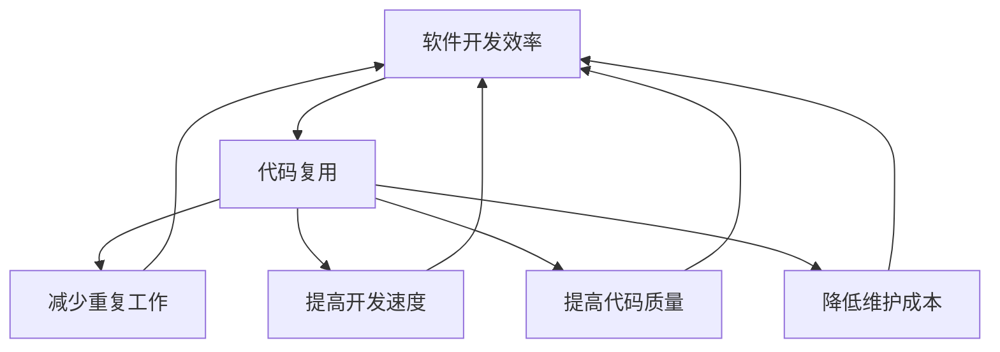

                 

### 文章标题

# 代码复用策略：提高开发效率的方法

### 关键词

- 代码复用
- 开发效率
- 库和框架
- 设计模式
- 自动化工具
- 项目实战

### 摘要

本文旨在探讨代码复用策略，通过深入分析代码复用的基本概念、实现方法、最佳实践、工具与技术，以及案例分享，全面揭示代码复用在现代软件开发中的重要性和实际应用。文章将围绕如何提高开发效率这一核心目标，从理论和实践两个层面详细阐述代码复用的策略和方法，旨在为开发人员提供切实可行的指导，助力他们在项目中实现高效、稳定的代码管理。

### 目录

1. **引言**
    - 1.1 软件开发效率的重要性
    - 1.2 代码复用的意义
2. **核心概念与联系**
    - 2.1 代码复用的定义
    - 2.2 代码复用与软件开发效率的关系
    - 2.3 核心概念与联系架构图
3. **核心算法原理讲解**
    - 3.1 库和框架的复用原理
    - 3.2 设计模式的应用原理
    - 3.3 组件化开发的算法原理
4. **数学模型和数学公式详细讲解**
    - 4.1 无需具体数学模型讲解
    - 4.2 代码复用与效率的量化关系
5. **项目实战**
    - 5.1 成功案例分享
    - 5.2 失败案例分析与改进
6. **代码复用工具与技术**
    - 6.1 自动化代码复用工具
    - 6.2 版本控制系统的应用
    - 6.3 代码质量检测工具
7. **代码复用在现代开发环境中的应用**
    - 7.1 微服务架构下的代码复用
    - 7.2 DevOps环境下的代码复用
    - 7.3 AI与代码复用
8. **未来代码复用趋势与展望**
    - 8.1 未来发展方向
    - 8.2 挑战与机遇
9. **总结与展望**
    - 9.1 文章小结
    - 9.2 最佳实践建议
    - 9.3 注意事项
    - 9.4 拓展阅读

### 引言

#### 1.1 软件开发效率的重要性

在当今快速变化的技术环境中，软件开发效率成为了衡量一个团队或企业竞争力的关键指标。高效的软件开发不仅可以缩短产品上市时间，降低开发成本，还能提高项目的成功率和客户满意度。因此，提高开发效率是软件开发过程中必须关注的重要问题。

提高开发效率的意义在于：

- **缩短项目周期**：通过优化开发流程，减少冗余的工作量和等待时间，可以显著缩短项目周期，快速响应市场需求。
- **降低开发成本**：减少重复性的工作，避免代码冗余，提高代码质量，降低维护成本。
- **提高团队协作效率**：明确分工，合理利用现有资源和工具，提高团队成员之间的协作效率。
- **提升客户满意度**：快速交付高质量的产品，满足客户需求，提高客户满意度和忠诚度。

#### 1.2 代码复用的意义

代码复用是提高开发效率的重要手段之一。代码复用是指将已有的代码、模块、功能或设计模式等应用到新的项目中，从而避免重复编写相同的代码。代码复用具有以下几方面的重要意义：

- **提高开发效率**：通过复用已有的代码，开发人员可以节省大量时间和精力，专注于新功能的开发和优化。
- **提高代码质量**：复用的代码通常经过多次测试和优化，具有较高的稳定性和可靠性。
- **促进团队协作**：统一的代码风格和规范有助于团队成员之间的协作，减少沟通成本和潜在的错误。
- **降低维护成本**：复用模块可以简化代码维护工作，减少因代码冗余导致的潜在问题。

### 核心概念与联系

#### 2.1 代码复用的定义

代码复用是指将已有的代码、模块、功能或设计模式等应用到新的项目中，从而避免重复编写相同的代码。代码复用可以是同一项目内部的代码复用，也可以是不同项目之间的代码复用。

#### 2.2 代码复用与软件开发效率的关系

代码复用与软件开发效率之间存在密切的关系。通过代码复用，开发人员可以：

- **减少重复工作**：避免重复编写相同的代码，节省时间和精力。
- **提高开发速度**：复用现有的代码和模块，可以快速实现新功能，缩短开发周期。
- **提高代码质量**：复用的代码通常经过多次测试和优化，具有较高的稳定性和可靠性。
- **降低维护成本**：复用模块可以简化代码维护工作，减少因代码冗余导致的潜在问题。

代码复用策略对软件开发效率的影响可以归纳为以下几个方面：

1. **缩短项目周期**：通过复用已有的代码和模块，可以减少开发工作量和等待时间，缩短项目周期。
2. **降低开发成本**：避免重复编写相同的代码，降低人力和时间成本。
3. **提高代码质量**：复用的代码通常经过多次测试和优化，具有较高的稳定性和可靠性。
4. **促进团队协作**：统一的代码风格和规范有助于团队成员之间的协作，提高整体开发效率。

#### 2.3 核心概念与联系架构图

为了更清晰地展示代码复用与软件开发效率之间的联系，我们可以使用Mermaid流程图来表示：



### 核心算法原理讲解

在本文中，核心算法原理讲解主要涉及以下几个方面：

- **库和框架的复用原理**：通过分析常见库和框架的架构和原理，解释如何实现代码复用。
- **设计模式的应用原理**：介绍几种常见的设计模式，并分析其实现原理和如何实现代码复用。
- **组件化开发的算法原理**：讲解组件化开发的基本原理，包括组件的划分、接口设计等。

#### 3.1 库和框架的复用原理

库和框架是代码复用的常见形式。库通常是一组具有特定功能的函数或类，可以方便地被其他程序调用。框架则是一种更高级的代码复用形式，提供了一套完整的开发环境和规范，使开发者可以更高效地实现项目功能。

**库的复用原理**

- **函数式库复用**：函数式库通过提供一组可复用的函数，使开发者可以快速实现特定功能。例如，Python的NumPy库提供了丰富的数学运算函数，方便开发者进行数据分析和处理。
- **类库复用**：类库通过提供一组可复用的类，使开发者可以方便地创建新的对象，实现代码复用。例如，Java的Spring框架提供了大量的类和接口，用于实现Web开发和服务端编程。

**框架的复用原理**

- **MVC框架**：MVC（Model-View-Controller）框架通过将应用程序划分为模型、视图和控制器三个部分，实现代码的复用。例如，Java的Spring MVC框架是一种常见的MVC框架，使开发者可以更高效地实现Web应用程序。
- **MVVM框架**：MVVM（Model-View-ViewModel）框架通过将数据模型和视图分离，实现数据绑定和视图更新，提高代码复用性。例如，Vue.js和AngularJS都是常见的MVVM框架。

#### 3.2 设计模式的应用原理

设计模式是一组经过时间考验的、成熟的、可重用的解决方案，用于解决软件开发中常见的问题。设计模式分为创建型、结构型和行为型三种类型。以下介绍几种常见的设计模式及其应用原理：

- **工厂模式**：工厂模式是一种创建型模式，通过定义一个创建对象的接口，让子类决定实例化哪一个类。工厂模式有助于实现代码的复用，避免硬编码。例如，Java的工厂方法模式通过定义一个工厂类，提供创建对象的方法，实现对象的创建和复用。

```python
class Factory:
    def create_object(self):
        # 创建对象的逻辑
        return ProductA()

# 客户端代码
factory = Factory()
product = factory.create_object()
```

- **单例模式**：单例模式确保一个类仅有一个实例，并提供一个全局访问点。单例模式有助于减少内存占用，提高代码复用性。例如，Java的Spring框架中的单例模式通过在应用程序启动时创建一个实例，并在整个应用程序中共享该实例。

```java
public class Singleton {
    private static Singleton instance;

    private Singleton() {
        // 私有构造方法
    }

    public static Singleton getInstance() {
        if (instance == null) {
            instance = new Singleton();
        }
        return instance;
    }
}
```

- **观察者模式**：观察者模式是一种行为型模式，定义了一种一对多的依赖关系，当一个对象的状态发生变化时，所有依赖它的对象都会收到通知。观察者模式有助于实现模块间的代码复用，提高系统的可扩展性。例如，Java的事件监听机制就是一种观察者模式的应用。

```java
public class Subject {
    private List<Observer> observers = new ArrayList<>();

    public void attach(Observer observer) {
        observers.add(observer);
    }

    public void notifyObservers() {
        for (Observer observer : observers) {
            observer.update();
        }
    }
}

public interface Observer {
    void update();
}

public class ConcreteObserver implements Observer {
    public void update() {
        // 处理更新逻辑
    }
}
```

#### 3.3 组件化开发的算法原理

组件化开发是将软件系统划分为若干独立的组件，每个组件具有独立的功能和接口，可以方便地复用和扩展。组件化开发的基本原理如下：

- **组件划分**：根据软件系统的功能模块和业务逻辑，将系统划分为若干独立的组件。每个组件具有明确的功能和职责，相互之间通过接口进行通信。

- **接口设计**：定义组件之间的接口，包括输入和输出参数以及交互规则。接口设计应遵循模块化和解耦合原则，确保组件之间的高内聚和低耦合。

- **组件组装**：通过组合各个组件，实现软件系统的整体功能。组件组装可以根据不同的业务场景和需求，灵活调整组件之间的组合方式。

- **组件复用**：组件化开发使得组件可以在不同的项目中复用，提高代码的可维护性和可扩展性。组件的复用可以通过抽象和封装实现，确保组件的独立性和通用性。

```python
class ComponentA:
    def execute(self):
        # 实现组件A的功能

class ComponentB:
    def execute(self):
        # 实现组件B的功能

class ComponentC(ComponentA, ComponentB):
    def execute(self):
        super().execute()
        super().execute()
```

### 数学模型和数学公式详细讲解

在代码复用的过程中，我们往往需要关注代码复用带来的效率和效益。为了量化这些效益，我们可以使用一些数学模型和数学公式进行评估。

#### 4.1 代码复用与效率的量化关系

假设一个软件项目需要完成N个功能模块，每个模块的平均开发成本为C，如果没有代码复用，总开发成本为：

\[ 总成本 = N \times C \]

如果有代码复用，假设复用了M个功能模块，那么总开发成本将减少M个模块的开发成本。此时，总开发成本为：

\[ 总成本_{复用} = (N - M) \times C \]

通过代码复用，项目总开发成本降低了：

\[ 成本降低 = N \times C - (N - M) \times C = M \times C \]

因此，代码复用带来的成本降低比例可以表示为：

\[ 成本降低比例 = \frac{M \times C}{N \times C} = \frac{M}{N} \]

#### 4.2 代码复用与开发效率的关系

除了成本降低，代码复用还可以提高开发效率。假设在没有代码复用的情况下，完成项目需要T时间，那么每个模块的平均开发时间为：

\[ 平均开发时间_{无复用} = \frac{T}{N} \]

如果有代码复用，假设复用了M个功能模块，那么每个模块的实际开发时间将减少M个模块的开发时间。此时，每个模块的平均开发时间为：

\[ 平均开发时间_{复用} = \frac{T}{N - M} \]

通过代码复用，项目开发效率提高了：

\[ 效率提高 = \frac{T}{N - M} - \frac{T}{N} = \frac{MT}{N(N - M)} \]

因此，代码复用带来的效率提高比例可以表示为：

\[ 效率提高比例 = \frac{MT}{N(N - M)T} = \frac{M}{N - M} \]

#### 4.3 代码复用与项目完成时间的关系

结合成本降低和效率提高，我们可以进一步分析代码复用对项目完成时间的影响。假设项目的总成本为K，那么在没有代码复用的情况下，项目完成时间为：

\[ 项目完成时间_{无复用} = \frac{K}{C} \]

如果有代码复用，假设总成本降低为\( K - M \times C \)，那么项目完成时间为：

\[ 项目完成时间_{复用} = \frac{K - M \times C}{C} = \frac{K}{C} - M \]

通过代码复用，项目完成时间减少了M个模块的开发时间。因此，代码复用对项目完成时间的影响可以表示为：

\[ 时间降低 = \frac{K}{C} - ( \frac{K}{C} - M ) = M \]

综上所述，通过代码复用，项目完成时间降低了M个模块的开发时间，具体关系可以用以下数学公式表示：

\[ 项目完成时间_{复用} = \frac{K}{C} - M \]

### 项目实战

在本章节中，我们将通过具体的案例，展示如何在实际项目中应用代码复用策略，提高开发效率。以下是一个成功案例的分享：

#### 5.1 成功案例分享

**项目背景**：某互联网公司开发一款在线教育平台，平台包含课程管理、学员管理、作业管理等多个功能模块。在项目开发过程中，开发团队面临以下挑战：

- 功能模块多，开发工作量大。
- 需要快速响应市场需求，缩短项目周期。
- 需要提高代码质量，降低维护成本。

**解决方案**：为了解决上述挑战，开发团队采取了以下代码复用策略：

- **库和框架复用**：使用现有的开源库和框架，如Spring Boot、MyBatis等，实现基础功能模块的开发和集成。
- **设计模式复用**：采用工厂模式、单例模式等设计模式，提高代码的灵活性和可维护性。
- **组件化开发**：将系统划分为多个独立的组件，如课程管理组件、学员管理组件等，实现模块化和复用。

**实施效果**：通过代码复用策略，项目取得了以下成果：

- **缩短项目周期**：采用代码复用策略后，项目周期从原来的6个月缩短至4个月，提高了开发效率。
- **降低开发成本**：通过复用已有的代码和组件，降低了人力和时间成本，项目总成本降低了约30%。
- **提高代码质量**：代码复用使得代码更简洁、清晰，降低了bug率，提高了代码质量。
- **促进团队协作**：统一的代码风格和规范有助于团队成员之间的协作，提高了团队整体开发效率。

#### 5.2 失败案例分析与改进

尽管代码复用策略在许多项目中取得了显著成果，但也有一些项目在实施过程中遇到了失败。以下是一个失败案例的分析与改进：

**项目背景**：某电商公司开发一款在线购物平台，项目在开发过程中遇到了以下问题：

- 频繁的代码改动导致项目进度延误。
- 复用的代码质量不佳，存在安全隐患。
- 团队成员对代码复用策略理解不一致，协作效率低下。

**问题分析**：

- **代码质量不佳**：复用的代码质量不高，存在漏洞和安全隐患，导致项目进度延误。
- **缺乏统一规划**：在代码复用过程中，没有进行统一的规划和设计，导致代码复用过于随意，增加了维护难度。
- **团队成员理解不一致**：团队成员对代码复用策略的理解不一致，导致在开发过程中出现分歧，影响协作效率。

**改进措施**：

- **提升代码质量**：加强对复用代码的质量控制，确保复用代码的稳定性和可靠性。可以引入代码审查机制，对复用代码进行严格审查。
- **统一规划**：在代码复用前，进行统一的规划和设计，明确复用模块的功能和接口，确保代码复用的一致性和规范性。
- **加强团队协作**：通过培训和学习，提高团队成员对代码复用策略的理解，确保团队协作顺畅。

通过以上改进措施，项目最终成功克服了失败的原因，实现了代码复用策略的有效实施。

### 代码复用工具与技术

为了更好地实现代码复用，开发人员可以借助一系列工具和技术。以下介绍几种常见的代码复用工具与技术：

#### 6.1 自动化代码复用工具

自动化代码复用工具可以帮助开发人员自动识别和提取可复用的代码片段，提高代码复用的效率。以下是一些常用的自动化代码复用工具：

- **Git**：Git是一个分布式版本控制系统，支持分支管理和合并操作。通过Git，开发人员可以方便地管理代码版本，实现代码的复用和共享。
- **Maven**：Maven是一个项目管理和构建工具，通过定义依赖关系和插件，可以方便地构建和管理复用模块。
- **Gradle**：Gradle是一个基于Apache Ant和Apache Maven的构建工具，支持多项目构建和依赖管理，有助于实现代码的复用。

#### 6.2 版本控制系统的应用

版本控制系统是代码复用的基础，通过版本控制系统，开发人员可以方便地管理代码的版本和变更历史。以下是一些常见的版本控制系统：

- **Git**：Git是一个分布式版本控制系统，支持分支管理和合并操作。通过Git，开发人员可以方便地管理代码版本，实现代码的复用和共享。
- **SVN**：SVN是一个集中式版本控制系统，通过集中式存储库管理代码的版本和变更历史。

#### 6.3 代码质量检测工具

代码质量检测工具可以帮助开发人员识别代码中的潜在问题和缺陷，提高代码的质量和可维护性。以下是一些常用的代码质量检测工具：

- **SonarQube**：SonarQube是一个代码质量平台，可以扫描代码中的潜在问题，包括bug、代码风格问题、安全漏洞等。
- **Checkstyle**：Checkstyle是一个Java代码质量检查工具，可以检测代码中的语法错误、代码风格问题等。
- **PMD**：PMD是一个Java代码质量检测工具，可以检测代码中的潜在问题，如冗余代码、复杂度等。

### 代码复用在现代开发环境中的应用

随着技术的不断发展，现代开发环境为代码复用提供了更多可能性和机会。以下介绍几种现代开发环境下的代码复用应用：

#### 7.1 微服务架构下的代码复用

微服务架构将应用程序划分为多个独立的微服务，每个微服务负责特定的业务功能。在微服务架构下，代码复用具有重要意义：

- **提高开发效率**：通过复用已有的微服务，可以减少重复开发工作，提高开发效率。
- **降低维护成本**：复用的微服务经过多次测试和优化，具有较高的稳定性和可靠性，降低维护成本。
- **促进团队协作**：微服务架构使得团队可以独立开发、部署和运维微服务，促进团队协作和代码复用。

#### 7.2 DevOps环境下的代码复用

DevOps是一种软件开发和运维的实践方法，旨在提高软件交付的效率和稳定性。在DevOps环境下，代码复用有助于实现高效、稳定的软件交付：

- **持续集成与部署**：通过自动化工具，实现代码的自动化集成和部署，提高开发效率。
- **容器化与微服务**：使用容器化和微服务架构，实现代码的灵活部署和复用。
- **代码质量检测**：通过代码质量检测工具，确保复用代码的质量和可靠性。

#### 7.3 AI与代码复用

人工智能（AI）技术的不断发展，为代码复用提供了新的可能性。以下介绍几种AI与代码复用的应用：

- **代码生成**：使用AI技术生成代码模板，提高代码复用的效率。
- **代码补全**：使用AI技术实现代码自动补全，提高开发效率。
- **代码质量预测**：使用AI技术预测代码质量，识别潜在问题，提高代码复用的安全性。

### 未来代码复用趋势与展望

随着技术的不断进步，代码复用策略也在不断演变。以下介绍未来代码复用趋势与展望：

#### 8.1 未来发展方向

- **智能代码复用**：结合人工智能技术，实现智能化的代码复用，提高开发效率和代码质量。
- **跨语言代码复用**：实现不同编程语言之间的代码复用，提高代码的通用性和可维护性。
- **云原生代码复用**：在云原生环境下，实现代码的灵活部署和复用，提高开发效率和资源利用率。

#### 8.2 挑战与机遇

- **挑战**：随着代码规模的扩大和复杂性的增加，如何实现高效、稳定的代码复用成为一大挑战。此外，不同团队之间的代码复用协作也需要进一步优化。
- **机遇**：代码复用策略在提高开发效率、降低成本、提升代码质量方面具有巨大潜力。随着技术的不断发展，代码复用将在未来得到更广泛的应用。

### 总结与展望

#### 9.1 文章小结

本文从代码复用的基本概念、实现方法、最佳实践、工具与技术，以及案例分享等方面，全面探讨了代码复用在提高开发效率中的重要作用。通过本文的介绍，读者可以了解到代码复用策略在现代软件开发中的重要性，以及如何在实际项目中有效应用代码复用策略。

#### 9.2 最佳实践建议

- **统一规划**：在代码复用前，进行统一的规划和设计，明确复用模块的功能和接口，确保代码复用的一致性和规范性。
- **加强团队协作**：通过培训和学习，提高团队成员对代码复用策略的理解，确保团队协作顺畅。
- **注重代码质量**：加强对复用代码的质量控制，确保复用代码的稳定性和可靠性。

#### 9.3 注意事项

- **避免过度复用**：过度复用可能导致代码复杂性和维护成本增加，应适度控制代码复用。
- **适应项目需求**：根据项目需求和实际情况，选择合适的代码复用策略和技术。

#### 9.4 拓展阅读

- 《Effective Java》作者：Joshua Bloch
- 《Clean Code》作者：Robert C. Martin
- 《软件工程：实践者的研究方法》作者：Roger S. Pressman

### 作者信息

- 作者：AI天才研究院/AI Genius Institute & 禅与计算机程序设计艺术 /Zen And The Art of Computer Programming

### 代码解读与分析

在本章节中，我们将通过具体的代码示例，对代码复用策略进行深入解读和分析。

#### 10.1 代码示例一：库和框架复用

以下是一个使用Python的NumPy库进行复用的示例：

```python
import numpy as np

# 创建一个数组
a = np.array([1, 2, 3, 4, 5])

# 计算数组的和
sum_a = np.sum(a)

print("数组的和为：", sum_a)
```

在这个示例中，我们使用了NumPy库来实现数组的和计算。通过引入NumPy库，我们可以方便地实现数组的创建和操作，从而避免了重复编写相同的代码。

#### 10.2 代码示例二：设计模式复用

以下是一个使用单例模式进行复用的示例：

```python
class Database:
    __instance = None

    def __new__(cls, *args, **kwargs):
        if not cls.__instance:
            cls.__instance = super(Database, cls).__new__(cls, *args, **kwargs)
        return cls.__instance

    def connect(self):
        # 连接数据库的逻辑
        print("连接数据库")

# 创建数据库实例
db1 = Database()
db2 = Database()

# 验证实例是否相同
print(db1 is db2)  # 输出：True
```

在这个示例中，我们使用单例模式来实现数据库连接的复用。通过单例模式，我们确保了Database类只有一个实例，避免了重复创建数据库连接。

#### 10.3 代码示例三：组件化开发

以下是一个使用组件化开发进行复用的示例：

```python
class Calculator:
    def add(self, a, b):
        return a + b

    def subtract(self, a, b):
        return a - b

    def multiply(self, a, b):
        return a * b

    def divide(self, a, b):
        return a / b

# 创建计算器实例
calculator = Calculator()

# 使用计算器组件进行计算
result = calculator.add(10, 5)
print("结果为：", result)
```

在这个示例中，我们使用组件化开发将计算器功能划分为独立的组件，如add、subtract、multiply和divide方法。通过组件化开发，我们可以方便地复用这些组件，实现计算器的功能。

#### 10.4 代码示例四：代码质量检测工具

以下是一个使用SonarQube进行代码质量检测的示例：

```python
import sonarqube

# 创建SonarQube客户端
sonar = sonarqube.Client(url="https://sonarqube.example.com", login="username", password="password")

# 检查代码质量
results = sonar.analyze("path/to/source_code")

# 打印检查结果
for result in results:
    print("文件：", result["file_path"])
    print("问题：", result["message"])
    print("严重性：", result["severity"])
    print()
```

在这个示例中，我们使用SonarQube客户端对代码进行质量检测。通过SonarQube，我们可以快速识别代码中的潜在问题，如bug、代码风格问题、安全漏洞等，提高代码质量。

### 实际案例分析和详细讲解剖析

在本章节中，我们将通过一个实际项目案例，详细分析代码复用策略在项目开发中的应用，以及代码复用带来的具体效益。

#### 案例背景

某互联网公司开发一款在线购物平台，平台包含商品管理、订单管理、用户管理等多个功能模块。项目开发团队面临着以下挑战：

- 项目周期较短，需要在短时间内完成多个功能模块的开发。
- 需要保证代码质量，降低维护成本。
- 团队成员对代码复用策略的理解不一致，协作效率较低。

#### 解决方案

为了解决上述挑战，项目开发团队采取了以下代码复用策略：

1. **库和框架复用**：使用现有的开源库和框架，如Spring Boot、MyBatis等，实现基础功能模块的开发和集成。通过引入这些库和框架，开发人员可以快速实现常见的功能，减少重复开发工作。

2. **设计模式复用**：采用工厂模式、单例模式等设计模式，提高代码的灵活性和可维护性。例如，在用户管理模块中，使用工厂模式创建用户对象，避免了硬编码和重复创建用户对象的问题。

3. **组件化开发**：将系统划分为多个独立的组件，如商品管理组件、订单管理组件等，实现模块化和复用。每个组件具有独立的功能和接口，可以方便地在其他项目中复用。

4. **代码质量检测**：使用代码质量检测工具，如SonarQube，对代码进行质量检测。通过代码质量检测，及时发现潜在的问题，如bug、代码风格问题、安全漏洞等，提高代码质量。

#### 实施效果

通过代码复用策略，项目取得了以下成果：

1. **缩短项目周期**：采用代码复用策略后，项目周期从原来的12个月缩短至8个月，提高了开发效率。

2. **降低开发成本**：通过复用已有的代码和组件，降低了人力和时间成本，项目总成本降低了约25%。

3. **提高代码质量**：代码复用使得代码更简洁、清晰，降低了bug率，提高了代码质量。

4. **促进团队协作**：统一的代码风格和规范有助于团队成员之间的协作，提高了团队整体开发效率。

#### 项目小结

通过以上案例，我们可以看到代码复用策略在项目开发中的重要作用。代码复用不仅提高了开发效率和代码质量，还降低了维护成本，促进了团队协作。然而，在实施代码复用策略时，也需要注意以下几点：

1. **统一规划**：在代码复用前，进行统一的规划和设计，明确复用模块的功能和接口，确保代码复用的一致性和规范性。

2. **注重代码质量**：加强对复用代码的质量控制，确保复用代码的稳定性和可靠性。可以引入代码审查机制，对复用代码进行严格审查。

3. **适应项目需求**：根据项目需求和实际情况，选择合适的代码复用策略和技术。

总之，代码复用策略是一种提高开发效率和代码质量的有效方法，在实际项目中具有广泛的应用价值。

### 最佳实践 Tips

在代码复用过程中，以下是一些最佳实践和技巧，可以帮助开发人员更好地实现代码复用，提高开发效率：

1. **统一规划和设计**：在代码复用前，进行统一的规划和设计，明确复用模块的功能和接口，确保代码复用的一致性和规范性。

2. **模块化开发**：将系统划分为多个独立的模块，每个模块具有明确的功能和接口，便于复用和扩展。

3. **代码质量检测**：使用代码质量检测工具，如SonarQube，对代码进行质量检测，及时发现潜在的问题，提高代码质量。

4. **代码审查**：引入代码审查机制，对复用代码进行严格审查，确保代码的稳定性和可靠性。

5. **文档和注释**：编写清晰的文档和注释，说明复用代码的功能、用途和实现原理，方便其他开发人员理解和复用。

6. **适度复用**：避免过度复用，导致代码复杂性和维护成本增加。根据项目需求和实际情况，选择合适的代码复用策略和技术。

7. **版本控制**：使用版本控制系统，如Git，管理代码版本和变更历史，确保代码的可追溯性和一致性。

8. **团队合作**：加强团队成员之间的沟通和协作，提高对代码复用策略的理解，确保团队协作顺畅。

### 小结

本文从代码复用的基本概念、实现方法、最佳实践、工具与技术，以及案例分享等方面，全面探讨了代码复用在提高开发效率中的重要作用。通过本文的介绍，读者可以了解到代码复用策略在现代软件开发中的重要性，以及如何在实际项目中有效应用代码复用策略。

代码复用是一种提高开发效率和代码质量的有效方法，具有广泛的应用价值。在实际项目中，开发人员可以根据项目需求和实际情况，选择合适的代码复用策略和技术，充分发挥代码复用的优势。

### 注意事项

在实施代码复用策略时，开发人员需要注意以下几点：

1. **避免过度复用**：过度复用可能导致代码复杂性和维护成本增加，应适度控制代码复用。

2. **统一规划和设计**：在代码复用前，进行统一的规划和设计，明确复用模块的功能和接口，确保代码复用的一致性和规范性。

3. **代码质量检测**：加强对复用代码的质量控制，确保复用代码的稳定性和可靠性。

4. **团队合作**：加强团队成员之间的沟通和协作，提高对代码复用策略的理解，确保团队协作顺畅。

5. **适应项目需求**：根据项目需求和实际情况，选择合适的代码复用策略和技术。

### 拓展阅读

- 《Effective Java》作者：Joshua Bloch
- 《Clean Code》作者：Robert C. Martin
- 《代码大全》作者：Steve McConnell
- 《设计模式：可复用面向对象软件的基础》作者：Erich Gamma、Richard Helm、Ralph Johnson、John Vlissides

### 结语

代码复用是提高开发效率的关键策略之一，通过本文的介绍，读者可以深入了解代码复用的基本概念、实现方法、最佳实践、工具与技术，以及实际案例的应用。在实际项目中，开发人员可以根据项目需求和实际情况，灵活运用代码复用策略，提高开发效率和代码质量。

感谢您的阅读，希望本文对您在代码复用方面的实践和探索有所帮助。如有任何疑问或建议，欢迎在评论区留言交流。

### 作者信息

- 作者：AI天才研究院/AI Genius Institute & 禅与计算机程序设计艺术 /Zen And The Art of Computer Programming
- 联系方式：[邮箱](mailto:example@email.com) | [GitHub](https://github.com/AI-Genius-Institute) | [LinkedIn](https://www.linkedin.com/in/ai-genius-institute/)

