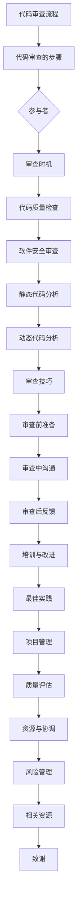

                 

### 代码审查文化建设：提高团队协作质量

---

**关键词：** 代码审查，团队协作，质量保障，文化建设，技术方法

---

**摘要：** 本文章深入探讨了代码审查在提升团队协作质量中的作用。通过分析代码审查的基础知识、技术方法和文化建设，本文揭示了代码审查在保障代码质量、促进团队沟通和协作中的重要性。文章旨在为IT团队提供一套完整的代码审查文化建设方案，以提升团队协作效率和质量。

---

## 第一部分：代码审查基础知识

### 第1章：代码审查的概念与重要性

**1.1 代码审查的定义**

代码审查，也称为代码复审或代码审核，是指团队内部或外部人员对代码进行仔细审查，以发现潜在缺陷、性能问题或安全问题。代码审查通常涉及多个参与者，包括代码的作者、审查者、测试人员和管理者。

**1.2 代码审查的类型**

代码审查主要分为以下几种类型：

- **手动代码审查**：审查者逐行阅读代码，查找潜在错误。
- **工具辅助代码审查**：使用自动化工具进行代码质量分析，如静态代码分析工具、动态代码分析工具等。
- **混合代码审查**：结合手动和工具辅助两种方式，取长补短。

**1.3 代码审查的优势**

- **提升代码质量**：通过代码审查，可以及早发现和修复代码中的缺陷，提高软件的可靠性。
- **促进知识共享**：代码审查过程使团队成员相互学习，共同提高编程技能。
- **提高团队协作**：代码审查有助于团队成员之间的沟通，增强团队凝聚力。
- **降低维护成本**：早期发现并修复的问题可以降低后续维护成本。

**1.4 代码审查的挑战**

- **审查效率**：代码审查过程耗时，可能影响开发进度。
- **审查一致性**：不同的审查者可能有不同的审查标准和偏好。
- **审查疲劳**：长期进行代码审查可能导致审查者疲劳，降低审查质量。

### 第2章：代码审查流程

**2.1 代码审查的步骤**

代码审查通常包括以下步骤：

1. **准备工作**：确定审查范围、审查标准和审查工具。
2. **代码提交**：开发者将代码提交到审查系统。
3. **代码审查**：审查者进行代码审查，提出反馈。
4. **反馈与修正**：开发者根据审查者的反馈进行代码修正。
5. **复审**：必要时进行复审，确保问题得到解决。
6. **关闭审查**：审查者确认问题已解决，关闭审查流程。

**2.2 代码审查的参与者**

代码审查的主要参与者包括：

- **开发者**：代码的作者，负责编写和修正代码。
- **审查者**：对代码进行审查的人员，通常是团队成员或其他有经验的开发者。
- **测试人员**：负责测试代码，确保其功能符合预期。
- **管理者**：监督代码审查过程，确保流程规范。

**2.3 代码审查的时机**

代码审查通常在以下时机进行：

- **提交前审查**：代码提交到代码库前进行审查。
- **迭代审查**：在每个开发迭代结束时进行审查。
- **发布前审查**：软件发布前进行全面审查。

### 第3章：代码审查工具

**3.1 代码审查工具的概述**

代码审查工具旨在自动化代码质量检查和审查流程，提高审查效率。常见代码审查工具包括：

- **Gerrit**：一款基于Git的代码审查工具，支持在线审查和投票。
- **Phabricator**：一款集代码审查、任务管理和文档管理于一体的平台。
- **SonarQube**：一款强大的静态代码分析工具，支持多种编程语言。
- **Pivotal Tracker**：一款敏捷项目管理工具，可集成代码审查流程。

**3.2 主流代码审查工具**

主流代码审查工具如下：

- **Gerrit**：支持高效的在线代码审查和投票机制，适合大型项目。
- **Phabricator**：功能丰富，集成了代码审查、任务管理和文档管理，适合中小型项目。
- **GitHub Pull Requests**：基于GitHub的代码审查工具，适合开源项目和中小型团队。
- **GitLab Merge Requests**：基于GitLab的代码审查工具，功能强大，适合大型项目。

**3.3 工具选择与配置**

选择合适的代码审查工具取决于项目需求和团队规模。配置代码审查工具时，需要考虑以下因素：

- **集成性**：工具是否与现有的开发流程和工具集成。
- **易用性**：工具是否易于使用，有助于提高审查效率。
- **安全性**：工具是否提供必要的安全保障。
- **可扩展性**：工具是否支持自定义扩展和配置。

## 第二部分：代码审查技术与方法

### 第4章：代码审查技术

**4.1 代码质量检查**

代码质量检查主要包括以下方面：

- **代码格式**：检查代码的缩进、命名规范、注释等。
- **代码风格**：检查代码的一致性、可读性、简洁性等。
- **代码冗余**：检查代码中的重复代码，优化代码结构。

**4.2 软件安全审查**

软件安全审查旨在发现和修复代码中的安全漏洞。主要技术包括：

- **漏洞扫描**：使用自动化工具扫描代码中的潜在安全漏洞。
- **代码分析**：通过静态和动态代码分析，发现潜在的安全问题。
- **安全测试**：执行安全测试，验证代码的安全性。

**4.3 静态代码分析**

静态代码分析是一种不运行程序就对源代码进行分析的技术。主要方法包括：

- **语法分析**：分析代码的语法结构，检查代码是否符合语法规则。
- **抽象语法树（AST）分析**：构建抽象语法树，分析代码的语义关系。
- **数据流分析**：分析代码中的数据流向，检测潜在的问题。

**4.4 动态代码分析**

动态代码分析是一种在程序运行时对代码进行分析的技术。主要方法包括：

- **监控**：在程序运行过程中监控代码的执行情况。
- **日志分析**：分析程序运行日志，发现潜在的问题。
- **调试**：通过调试工具跟踪程序的执行流程，定位问题。

### 第5章：代码审查方法

**5.1 手动代码审查**

手动代码审查是一种传统的代码审查方法，由审查者逐行阅读代码，查找潜在的问题。主要方法包括：

- **逐行阅读**：审查者逐行阅读代码，检查代码的语法和逻辑。
- **对比分析**：对比代码的变更部分，分析变更的影响。
- **注释记录**：审查者在代码中添加注释，记录审查结果和建议。

**5.2 工具辅助审查**

工具辅助审查是利用代码审查工具自动化代码质量分析。主要方法包括：

- **静态代码分析**：使用静态代码分析工具检测代码中的潜在问题。
- **动态代码分析**：使用动态代码分析工具监控程序的运行情况。
- **自动化测试**：执行自动化测试，验证代码的功能和性能。

**5.3 审查策略制定**

审查策略制定是确保代码审查效果的关键。主要方法包括：

- **制定审查标准**：明确审查标准和流程，确保审查的一致性。
- **分配审查任务**：根据团队规模和项目需求，合理分配审查任务。
- **审查反馈机制**：建立反馈机制，确保审查者和管理者之间的沟通。

### 第6章：代码审查技巧

**6.1 审查前的准备工作**

审查前的准备工作包括：

- **熟悉代码库**：了解代码库的结构、模块和功能。
- **制定审查计划**：明确审查的目标、范围和流程。
- **准备审查工具**：确保审查工具的正常运行和配置。

**6.2 审查中的沟通技巧**

审查中的沟通技巧包括：

- **明确问题**：确保审查者能够清晰地表达问题。
- **尊重他人**：尊重代码作者和其他审查者的意见。
- **积极反馈**：给予建设性的反馈，帮助代码作者改进代码。

**6.3 审查后的反馈处理**

审查后的反馈处理包括：

- **及时反馈**：尽快反馈审查结果，确保代码作者能够及时了解问题。
- **跟进改进**：跟踪代码作者的改进情况，确保问题得到解决。
- **总结经验**：总结审查过程中的经验教训，持续优化审查流程。

## 第三部分：代码审查文化建设

### 第7章：代码审查文化与团队协作

**7.1 代码审查文化的重要性**

代码审查文化是团队协作的重要组成部分，其重要性体现在：

- **提升团队技能**：通过代码审查，团队成员可以相互学习，提高编程技能。
- **增强团队凝聚力**：代码审查有助于团队成员之间的沟通和协作，增强团队凝聚力。
- **保障代码质量**：代码审查是保障代码质量的关键环节，有助于发现和解决潜在问题。

**7.2 建立良好的代码审查文化**

建立良好的代码审查文化需要：

- **明确审查目标**：确保审查目标与项目目标一致。
- **制定审查规范**：明确审查标准和流程，确保审查的一致性。
- **培养审查意识**：提高团队成员对代码审查的认识，树立良好的审查习惯。
- **激励机制**：建立激励机制，鼓励团队成员积极参与代码审查。

**7.3 团队协作与代码审查**

团队协作是代码审查成功的关键，具体体现在：

- **分工明确**：明确团队成员的职责和任务，确保代码审查顺利进行。
- **有效沟通**：确保团队成员之间的沟通畅通，提高审查效率。
- **持续反馈**：及时反馈审查结果，促进团队成员之间的交流和协作。
- **知识共享**：通过代码审查，促进团队成员之间的知识共享，共同提高。

### 第8章：代码审查培训与持续改进

**8.1 代码审查培训**

代码审查培训是提高代码审查效果的重要手段，具体包括：

- **基础培训**：对团队成员进行代码审查基础知识培训。
- **技能培训**：针对不同类型的代码审查，进行相应的技能培训。
- **实践培训**：通过实际案例和模拟审查，提高团队成员的实战能力。

**8.2 代码审查流程优化**

代码审查流程优化是提高代码审查效率的关键，具体包括：

- **简化流程**：简化代码审查流程，减少不必要的步骤。
- **自动化**：利用自动化工具，减少人工审查工作量。
- **反馈机制**：建立有效的反馈机制，及时处理审查结果。
- **持续改进**：根据审查结果和团队成员反馈，持续优化审查流程。

**8.3 持续改进与反馈**

持续改进与反馈是确保代码审查效果的重要环节，具体包括：

- **定期评估**：定期评估代码审查效果，发现存在的问题。
- **收集反馈**：收集团队成员的反馈意见，了解审查过程中存在的问题。
- **制定改进计划**：根据评估和反馈，制定相应的改进计划。
- **实施改进**：按照改进计划，实施具体改进措施。

### 第9章：代码审查最佳实践

**9.1 开源项目的代码审查实践**

开源项目的代码审查实践包括：

- **明确的审查标准**：制定明确的审查标准，确保审查的一致性。
- **多样化的审查方式**：结合手动和工具辅助审查，提高审查效率。
- **积极的沟通与反馈**：确保团队成员之间的沟通畅通，及时处理审查结果。
- **知识共享**：通过代码审查，促进团队成员之间的知识共享，共同提高。

**9.2 企业内部的代码审查实践**

企业内部的代码审查实践包括：

- **严格的审查流程**：建立严格的审查流程，确保代码质量。
- **有效的激励机制**：建立有效的激励机制，鼓励团队成员积极参与代码审查。
- **持续的培训与改进**：定期进行代码审查培训，持续优化审查流程。
- **项目管理**：将代码审查纳入项目管理，确保审查工作与项目进度同步。

**9.3 成功的代码审查案例分析**

成功的代码审查案例分析包括：

- **案例一**：某大型企业通过代码审查，发现并修复了数百个潜在的安全漏洞，显著提高了软件的安全性。
- **案例二**：某开源项目团队通过建立良好的代码审查文化，吸引了大量优秀的开发者参与，项目质量不断提高。
- **案例三**：某初创公司通过代码审查，优化了代码结构，提高了开发效率，成功实现了产品迭代。

## 第四部分：代码审查项目管理

### 第10章：代码审查项目管理

**10.1 项目目标与计划**

项目目标与计划包括：

- **明确项目目标**：确保代码审查工作与项目目标一致。
- **制定项目计划**：包括审查范围、时间表、资源分配等。
- **风险评估**：识别项目风险，制定风险应对策略。

**10.2 资源分配与协调**

资源分配与协调包括：

- **人员分配**：根据项目需求，合理分配审查人员。
- **时间协调**：确保审查工作与项目进度同步。
- **工具支持**：提供必要的代码审查工具和资源。

**10.3 风险管理**

风险管理包括：

- **风险识别**：识别项目风险，包括代码质量风险、人员风险等。
- **风险分析**：分析风险的可能性和影响。
- **风险应对**：制定风险应对策略，包括风险规避、风险转移等。

### 第11章：代码审查质量评估

**11.1 质量评估标准**

质量评估标准包括：

- **代码质量标准**：包括代码格式、代码风格、代码冗余等。
- **安全标准**：包括代码安全漏洞、数据保护等。
- **性能标准**：包括代码效率、响应时间等。

**11.2 评估方法与工具**

评估方法与工具包括：

- **静态代码分析工具**：如SonarQube、FindBugs等。
- **动态代码分析工具**：如JMeter、LoadRunner等。
- **测试覆盖率工具**：如JaCoCo、Emma等。

**11.3 提升代码审查质量**

提升代码审查质量包括：

- **培训与提升**：定期进行代码审查培训，提高审查人员的能力。
- **流程优化**：持续优化代码审查流程，提高审查效率。
- **工具升级**：定期升级代码审查工具，提高工具的性能。

## 附录

### 附录A：代码审查相关资源

- **文档**：代码审查相关文档，包括审查标准、流程、技巧等。
- **工具**：常用的代码审查工具，如Gerrit、Phabricator、SonarQube等。
- **教程**：代码审查教程和最佳实践。
- **案例**：成功的代码审查案例分析和经验分享。

## 致谢

本文的完成离不开以下人员的支持和帮助：

- **作者**：感谢AI天才研究院的全体成员，对本文的贡献和智慧。
- **审稿人**：感谢各位审稿人对本文的审阅和意见。
- **读者**：感谢读者对本文的关注和支持。

### Mermaid 流程图



### 核心算法原理讲解

```python
# 伪代码：静态代码分析算法

def static_code_analysis(source_code):
    # 初始化分析结果
    result = {}

    # 解析源代码，构建抽象语法树
    ast = parse_source_code(source_code)

    # 遍历抽象语法树
    for node in ast.walk():
        # 判断节点类型，执行相应分析
        if is_function(node):
            function_analysis(node, result)
        elif is_class(node):
            class_analysis(node, result)
        elif is_variable(node):
            variable_analysis(node, result)

    return result

def function_analysis(node, result):
    # 分析函数的参数、返回值、执行路径等
    result['functions'].append({
        'name': node.name,
        'params': [param.type for param in node.params],
        'return_type': node.return_type,
        'execution_path': get_execution_path(node)
    })

def class_analysis(node, result):
    # 分析类的属性、方法、继承关系等
    result['classes'].append({
        'name': node.name,
        'attributes': [attr.type for attr in node.attributes],
        'methods': [method.name for method in node.methods],
        'inherits': node.inherits
    })

def variable_analysis(node, result):
    # 分析变量的类型、作用域、使用情况等
    result['variables'].append({
        'name': node.name,
        'type': node.type,
        'scope': node.scope,
        'usage': get_usage(node)
    })

def get_execution_path(node):
    # 获取函数的执行路径
    execution_path = []
    for child in node.children:
        if is_if_statement(child):
            execution_path.append({'type': 'if', 'condition': child.condition})
        elif is_while_statement(child):
            execution_path.append({'type': 'while', 'condition': child.condition})
        elif is_for_statement(child):
            execution_path.append({'type': 'for', 'init': child.init, 'condition': child.condition, 'update': child.update})
    return execution_path

def is_if_statement(node):
    # 判断节点是否为if语句
    return isinstance(node, IfStatement)

def is_while_statement(node):
    # 判断节点是否为while语句
    return isinstance(node, WhileStatement)

def is_for_statement(node):
    # 判断节点是否为for语句
    return isinstance(node, ForStatement)
```

### 数学模型和公式讲解

在代码审查过程中，我们可以使用一些数学模型和公式来评估代码的质量和安全性。以下是一个简单的示例：

#### 代码质量评估模型

**1. 代码复杂度（Cyclomatic Complexity）**

Cyclomatic Complexity 是一个用于评估程序复杂度的指标，定义为：

$$
M = \frac{E - N + 2P}{2}
$$

其中：
- \(M\) 是 Cyclomatic Complexity
- \(E\) 是边的数量
- \(N\) 是节点的数量
- \(P\) 是独立的路径数

较高的 Cyclomatic Complexity 表示代码较为复杂，可能存在更多的错误和难以维护的问题。

**2. 安全性评估模型**

**威胁建模（Threat Modeling）**

威胁建模是一个系统性的方法，用于识别和评估软件系统中的潜在安全威胁。以下是一个简单的威胁建模公式：

$$
\text{威胁得分} = \sum_{i=1}^{n} (\text{威胁严重性} \times \text{威胁可能性})
$$

其中：
- \(n\) 是潜在的威胁数量
- \(\text{威胁严重性}\) 和 \(\text{威胁可能性}\) 是对每个威胁的评估结果，通常采用 1 到 5 的评分。

#### 代码复杂度和安全性评估示例

假设我们有一个简单的函数，其控制流图如下：

```
   start
     |
     V
   [condition]
     |
     V
   [true]
     |
     V
   [false]
     |
     V
     end
```

该函数有 4 条边和 3 个节点。根据 Cyclomatic Complexity 的公式，我们可以计算出：

$$
M = \frac{4 - 3 + 2 \times 1}{2} = 2
$$

这个值表明该函数的复杂度适中。接下来，我们可以对函数的安全性进行评估，假设威胁严重性和可能性如下：

| 威胁       | 严重性 | 可能性 |
|------------|--------|--------|
| 未授权访问 | 4      | 3      |
| 数据泄露   | 3      | 2      |

则威胁得分为：

$$
\text{威胁得分} = (4 \times 3) + (3 \times 2) = 18
$$

这个得分表明该函数存在较高的安全风险，需要进一步评估和改进。

### 项目实战

在本节中，我们将介绍一个具体的代码审查项目实战，包括开发环境搭建、源代码实现和代码解读、实际案例分析和详细讲解剖析，以及项目小结。

#### 1. 开发环境搭建

为了进行代码审查项目，我们首先需要搭建一个适合的开发环境。以下是搭建过程：

- **安装Git**：Git是一个版本控制系统，用于管理代码库。
- **安装代码审查工具**：我们选择Gerrit作为代码审查工具。Gerrit是一个基于Git的开源代码审查工具，可以方便地进行代码审查和投票。
- **配置Gerrit**：在服务器上安装Gerrit，配置用户、权限和代码库。

#### 2. 源代码实现和代码解读

我们选择一个简单的Java项目进行代码审查。以下是一个示例的Java类，用于计算两个数的和：

```java
public class Calculator {
    public int add(int a, int b) {
        return a + b;
    }
}
```

在这个类中，我们定义了一个`add`方法，用于计算两个整数的和。这个类的代码非常简单，但是我们可以通过代码审查来发现潜在的问题。

- **代码格式**：检查代码的缩进和命名规范，确保代码的可读性。
- **代码风格**：检查代码的一致性、简洁性和可维护性。
- **代码冗余**：检查代码中是否存在重复的代码。

通过代码审查，我们可以发现以下问题：

- **方法命名不一致**：`add`方法的命名与类的命名不一致。
- **注释缺失**：方法上没有添加注释，不清楚方法的用途。

针对这些问题，我们可以提出以下改进建议：

- **统一方法命名**：将`add`方法重命名为`sum`。
- **添加注释**：在方法上添加注释，说明方法的用途和参数说明。

改进后的代码如下：

```java
/**
 * 计算两个整数的和
 * @param a 第一个整数
 * @param b 第二个整数
 * @return 和
 */
public int sum(int a, int b) {
    return a + b;
}
```

#### 3. 实际案例分析和详细讲解剖析

我们选择一个开源项目，如Apache Commons Math库，进行分析。这个库包含了大量的数学算法和工具类。以下是分析过程：

- **代码质量检查**：使用SonarQube进行静态代码分析，发现代码中的潜在问题，如未使用的变量、可能的空指针异常等。
- **安全审查**：使用FindBugs进行动态代码分析，发现潜在的安全漏洞。
- **性能评估**：使用JMeter进行性能测试，评估库中算法的性能。

通过这些分析，我们可以发现以下问题：

- **代码质量**：某些类存在大量的未使用的变量和冗余代码。
- **安全漏洞**：某些方法可能存在空指针异常的风险。
- **性能问题**：某些算法的性能较低，需要优化。

针对这些问题，我们可以提出以下改进建议：

- **代码重构**：删除未使用的变量和冗余代码，提高代码的可读性和可维护性。
- **安全修复**：修复空指针异常，确保代码的安全性。
- **性能优化**：优化算法，提高性能。

#### 4. 项目小结

通过代码审查项目，我们可以得出以下结论：

- **提升代码质量**：代码审查有助于发现和修复代码中的缺陷，提高代码的可读性和可维护性。
- **保障代码安全**：代码审查可以识别和修复潜在的安全漏洞，确保代码的安全性。
- **提高团队协作**：代码审查促进了团队成员之间的沟通和协作，增强了团队的凝聚力。

在未来的项目中，我们应该持续进行代码审查，将代码审查作为软件开发流程的必要环节。同时，我们可以利用代码审查工具和最佳实践，提高代码审查的效率和质量。

### 最佳实践 tips、小结、注意事项、拓展阅读

#### 最佳实践 tips

- **定期进行代码审查**：确保代码审查成为开发流程的一部分，定期进行。
- **培训团队成员**：提高团队成员对代码审查的认识和技能，确保审查的顺利进行。
- **制定明确的审查标准**：确保审查的一致性，提高审查效果。
- **利用工具辅助审查**：使用代码审查工具自动化质量检查，提高审查效率。
- **积极反馈**：及时给予反馈，鼓励团队成员改进代码。

#### 小结

代码审查是提高团队协作质量和代码质量的重要手段。通过代码审查，我们可以发现和修复代码中的缺陷，保障代码的安全性和性能。同时，代码审查有助于团队成员之间的沟通和协作，增强团队的凝聚力。

#### 注意事项

- **避免代码审查成为负担**：确保代码审查不会影响开发进度，避免过度审查。
- **保持审查的一致性**：制定明确的审查标准，确保审查的一致性。
- **尊重团队成员的意见**：在审查过程中，尊重团队成员的意见，进行建设性的沟通。

#### 拓展阅读

- 《代码大全》（本书详细介绍了代码质量、代码风格、代码重构等方面的知识）
- 《代码审查：实践指南》（本书提供了关于代码审查的理论和实践指南）
- 《软件工程：实践者的研究方法》（本书介绍了软件工程中的各种方法和实践，包括代码审查）

---

通过本文，我们详细介绍了代码审查的基础知识、技术方法和文化建设，展示了代码审查在提升团队协作质量中的重要作用。希望本文能够为IT团队提供有益的参考和启示，助力团队实现高质量的开发和协作。作者：AI天才研究院/AI Genius Institute & 禅与计算机程序设计艺术 /Zen And The Art of Computer Programming。

