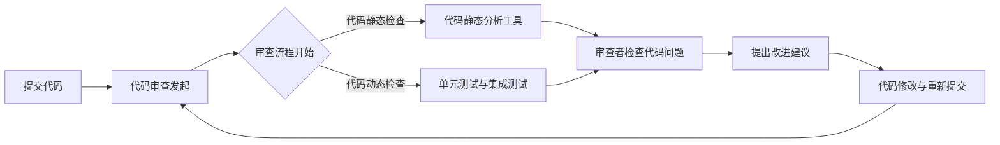
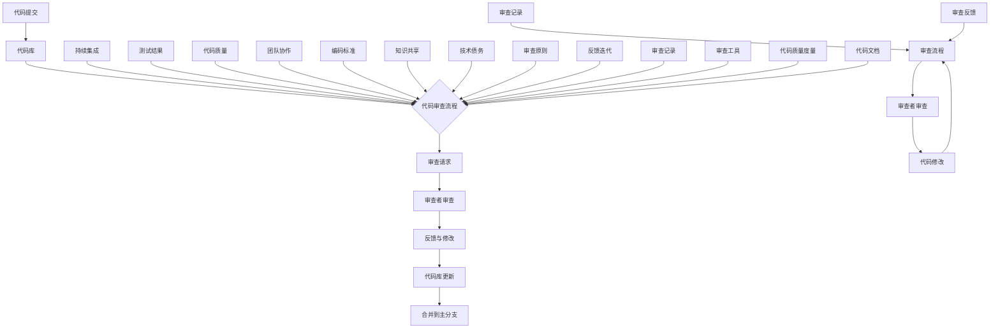
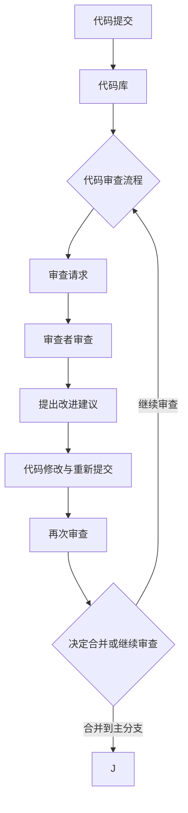
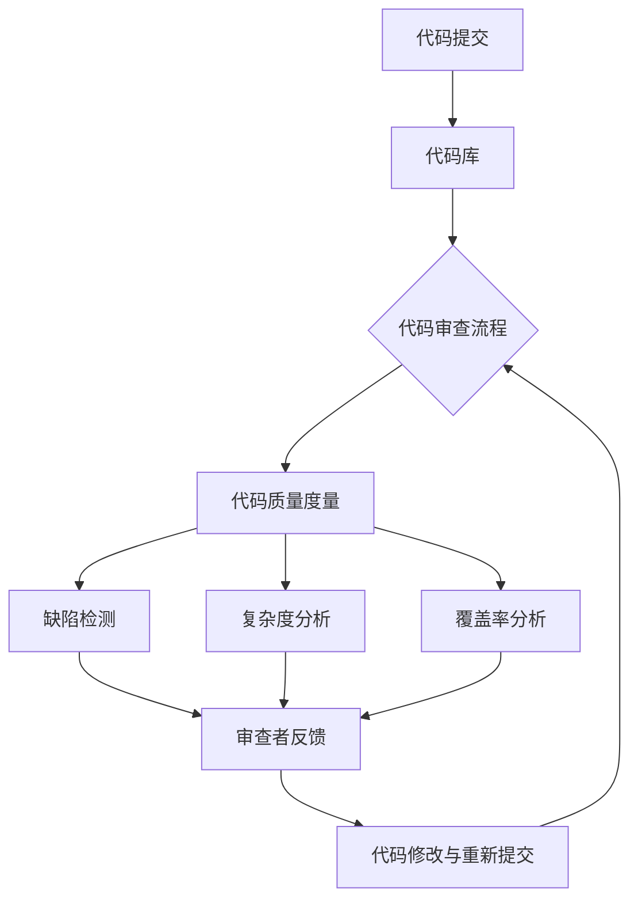
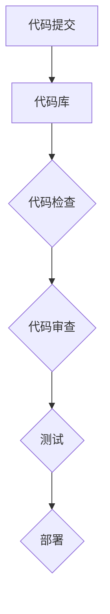

                 

### 文章标题：代码审查最佳实践：提升团队代码质量

> 关键词：代码审查、团队协作、代码质量、持续集成、最佳实践

> 摘要：本文将深入探讨代码审查的最佳实践，从概念到具体实施步骤，详细解析如何通过代码审查提升团队代码质量。本文旨在为IT专业人士提供一套完整的代码审查指南，帮助团队构建高质量、可靠的软件系统。

### 目录

1. **代码审查的概念与原理** 
2. **代码审查流程** 
3. **代码审查技巧** 
4. **代码质量度量** 
5. **团队协作与沟通** 
6. **代码审查与持续集成** 
7. **代码审查案例分析** 
8. **附录** 

---

### 1. 代码审查的概念与原理

**1.1 代码审查的定义**

代码审查（Code Review）是一种软件开发过程中的关键环节，它涉及对代码进行系统性的检查，以确保代码的规范性、可靠性和可维护性。代码审查不仅仅是对代码的语法检查，更是对代码设计、架构、逻辑、性能等多方面的综合评估。

**1.2 代码审查的重要性**

- **提升代码质量**：代码审查有助于发现潜在的问题，如逻辑错误、性能瓶颈、代码冗余等，从而提高代码的整体质量。
- **加强团队协作**：代码审查是一个跨团队、跨角色的协作过程，有助于团队成员之间的沟通与知识共享。
- **知识传承**：通过代码审查，新成员可以学习到团队的最佳实践和设计模式，加速团队成员的成长。

**1.3 代码审查的基本原则**

- **透明性**：代码审查过程应该对所有人透明，确保每个团队成员都能了解代码的审查状态。
- **及时性**：代码审查应在代码提交后尽快进行，以减少代码在审查周期内可能产生的新问题。
- **全面性**：代码审查应覆盖代码的各个层面，包括语法、逻辑、性能、安全性等。
- **建设性**：代码审查的目的是提升代码质量，而不是简单地进行批评。审查者应提供具体的改进建议。

**1.4 核心概念与联系**

为了更好地理解代码审查的核心概念，我们可以绘制一个Mermaid流程图，展示代码审查的基本流程：

### 2. 代码审查流程

**2.1 代码审查的流程设计**

代码审查流程的设计是确保代码审查顺利进行的关键。一个典型的代码审查流程包括以下几个步骤：

1. **代码提交**：开发者将代码提交到代码库。
2. **审查请求**：代码库管理员或项目负责人发起审查请求。
3. **审查**：审查者对代码进行详细审查。
4. **反馈**：审查者向开发者提供反馈，指出代码中的问题。
5. **修改**：开发者根据反馈修改代码。
6. **重新审查**：修改后的代码再次进行审查。
7. **合并**：代码经过多次审查且无重大问题时，可以合并到主分支。

**2.2 代码审查的关键环节**

- **代码提交**：确保代码提交前经过充分的单元测试和代码格式化，以减少审查过程中的麻烦。
- **审查请求**：审查请求应明确指出审查的范围和目标，确保审查者有明确的审查方向。
- **审查**：审查者应根据代码审查的基本原则进行审查，确保代码的质量。
- **反馈**：反馈应具体、明确，避免模糊的批评，以便开发者能够针对性地进行修改。
- **修改**：开发者应根据反馈进行修改，确保代码符合审查者的要求。
- **重新审查**：审查者应对修改后的代码进行重新审查，确保问题得到解决。

**2.3 代码审查的工具选择**

- **静态代码分析工具**：如SonarQube、Checkstyle等，用于自动化检查代码质量。
- **动态分析工具**：如JMeter、LoadRunner等，用于模拟实际运行环境，检查代码的性能和稳定性。
- **代码库管理工具**：如GitLab、GitHub等，用于管理代码审查流程。

### 3. 代码审查技巧

**3.1 代码审查的方法和技巧**

- **同行评审**：组织团队成员进行代码评审，充分利用团队的智慧和经验。
- **分组审查**：将代码分成多个模块，分发给不同的审查者，提高审查效率。
- **逐行检查**：对代码的每行进行细致检查，确保没有遗漏的问题。
- **重点关注**：对关键代码和潜在风险点进行重点关注，确保代码的可靠性和安全性。

**3.2 代码审查中的常见问题与解决方法**

- **反馈不及时**：确保审查者在规定的时间内提供反馈，避免代码审查流程拖延。
- **意见不一致**：审查者之间意见不一致时，可以通过团队讨论或引入第三方意见进行调解。
- **批评过度**：审查者应注重建设性意见，避免过度批评，以维护开发者的积极性。

**3.3 代码审查的最佳实践**

- **定期审查**：制定固定的代码审查周期，确保代码审查的持续性。
- **审查培训**：对审查者进行培训，提高其审查技能和效率。
- **审查文档**：记录审查过程和结果，便于后续的追踪和总结。

### 4. 代码质量度量

**4.1 代码质量的定义**

代码质量是指代码满足其预期功能、性能、可靠性、可维护性等方面的程度。高质量的代码不仅能够正常运行，还能在长期维护中减少成本。

**4.2 代码质量的度量方法**

- **代码覆盖率**：通过测试覆盖率来衡量代码的质量，确保代码的每个部分都被测试到。
- **复杂度度量**：如Cyclomatic复杂度、NPath复杂度等，用于衡量代码的复杂度，避免代码过于复杂。
- **缺陷密度**：通过统计代码中的缺陷数量来衡量代码的质量。

**4.3 代码质量分析工具**

- **SonarQube**：一款用于代码质量管理的平台，提供代码覆盖率、复杂度度量、缺陷检测等功能。
- **Checkmarx**：一款静态代码分析工具，用于检测代码中的安全漏洞。

### 5. 团队协作与沟通

**5.1 团队协作在代码审查中的重要性**

代码审查是一个团队协作的过程，良好的团队协作能够提高代码审查的效率和质量。

**5.2 有效的沟通技巧**

- **清晰表达**：确保沟通内容清晰、明确，避免误解和歧义。
- **及时响应**：及时回复审查者的反馈，确保代码审查流程的连续性。
- **积极反馈**：对开发者的工作给予积极的反馈，增强其工作积极性。

**5.3 团队成员的角色与责任**

- **开发者**：负责编写和提交代码，并根据审查者的反馈进行修改。
- **审查者**：负责审查代码，并提供具体的改进建议。
- **项目负责人**：负责协调代码审查流程，确保代码审查的顺利进行。

### 6. 代码审查与持续集成

**6.1 持续集成与代码审查的关系**

持续集成（CI）与代码审查密切相关。持续集成通过自动化测试和代码审查，确保代码的持续性和可靠性。

**6.2 持续集成工具的选择**

- **Jenkins**：一款流行的持续集成工具，支持多种插件，便于扩展。
- **Travis CI**：一款云端的持续集成服务，易于配置和使用。

**6.3 代码审查在持续集成中的应用**

在持续集成流程中，代码审查可以作为一个步骤，确保每次代码提交都经过审查。通过自动化工具，可以快速、高效地完成代码审查，提高代码的质量。

### 7. 代码审查案例分析

**7.1 成功的代码审查案例**

在某个大型项目中，通过定期的代码审查，团队成功发现并修复了多个潜在的问题，有效提高了代码的质量和可靠性。

**7.2 代码审查中的挑战与解决方案**

在代码审查过程中，团队遇到了代码量庞大、审查效率低等问题。通过引入静态代码分析工具和优化代码审查流程，团队成功解决了这些问题，提高了代码审查的效率和质量。

### 8. 附录

**8.1 代码审查相关资源**

- **书籍推荐**：《代码大全》、《设计模式：可复用的面向对象软件》
- **在线资源**：GitHub、GitLab的代码审查指南

**8.2 常见代码审查工具简介**

- **SonarQube**：用于代码质量管理的平台，提供代码覆盖率、复杂度度量、缺陷检测等功能。
- **Checkstyle**：用于检查Java代码风格和质量的工具。

**8.3 持续集成与代码审查实践指南**

- **Jenkins实践指南**：详细介绍如何使用Jenkins进行持续集成。
- **GitLab CI/CD指南**：详细介绍如何使用GitLab进行代码审查和持续集成。

---

**作者**：AI天才研究院/AI Genius Institute & 禅与计算机程序设计艺术 /Zen And The Art of Computer Programming

---

本文详细探讨了代码审查的最佳实践，从概念到具体实施步骤，为IT专业人士提供了一套完整的代码审查指南。通过本文，读者可以了解到代码审查的重要性、流程、技巧和质量度量方法，从而提升团队代码质量，构建高质量的软件系统。

### 1. 代码审查的概念与原理

#### 1.1 代码审查的定义

代码审查是一种软件开发过程中的关键环节，它涉及对代码进行系统性的检查，以确保代码的规范性、可靠性和可维护性。代码审查不仅仅是对代码的语法检查，更是对代码设计、架构、逻辑、性能等多方面的综合评估。代码审查的目的是发现潜在的问题，如逻辑错误、性能瓶颈、代码冗余等，从而提高代码的整体质量。

#### 1.2 代码审查的重要性

代码审查在软件开发过程中扮演着至关重要的角色。以下是代码审查的重要性体现在以下几个方面：

- **提升代码质量**：代码审查有助于发现潜在的问题，如逻辑错误、性能瓶颈、代码冗余等，从而提高代码的整体质量。
- **加强团队协作**：代码审查是一个跨团队、跨角色的协作过程，有助于团队成员之间的沟通与知识共享。
- **知识传承**：通过代码审查，新成员可以学习到团队的最佳实践和设计模式，加速团队成员的成长。

#### 1.3 代码审查的基本原则

在进行代码审查时，我们需要遵循以下基本原则：

- **透明性**：代码审查过程应该对所有人透明，确保每个团队成员都能了解代码的审查状态。
- **及时性**：代码审查应在代码提交后尽快进行，以减少代码在审查周期内可能产生的新问题。
- **全面性**：代码审查应覆盖代码的各个层面，包括语法、逻辑、性能、安全性等。
- **建设性**：代码审查的目的是提升代码质量，而不是简单地进行批评。审查者应提供具体的改进建议。

#### 1.4 核心概念与联系

为了更好地理解代码审查的核心概念，我们可以绘制一个Mermaid流程图，展示代码审查的基本流程：

在这个流程图中，A表示代码提交，B表示代码审查发起，C表示审查流程开始，D表示代码静态检查，E表示代码动态检查，F表示审查者检查代码问题，G表示提出改进建议，H表示代码修改与重新提交。通过这个流程图，我们可以清晰地看到代码审查的主要步骤和核心概念之间的联系。

### 2. 代码审查流程

#### 2.1 代码审查的流程设计

代码审查流程的设计是确保代码审查顺利进行的关键。一个典型的代码审查流程包括以下几个步骤：

1. **代码提交**：开发者将代码提交到代码库。
2. **审查请求**：代码库管理员或项目负责人发起审查请求。
3. **审查**：审查者对代码进行详细审查。
4. **反馈**：审查者向开发者提供反馈，指出代码中的问题。
5. **修改**：开发者根据反馈修改代码。
6. **重新审查**：修改后的代码再次进行审查。
7. **合并**：代码经过多次审查且无重大问题时，可以合并到主分支。

#### 2.2 代码审查的关键环节

代码审查的关键环节包括以下几个方面：

- **代码提交**：确保代码提交前经过充分的单元测试和代码格式化，以减少审查过程中的麻烦。
- **审查请求**：审查请求应明确指出审查的范围和目标，确保审查者有明确的审查方向。
- **审查**：审查者应根据代码审查的基本原则进行审查，确保代码的质量。
- **反馈**：反馈应具体、明确，避免模糊的批评，以便开发者能够针对性地进行修改。
- **修改**：开发者应根据反馈进行修改，确保代码符合审查者的要求。
- **重新审查**：审查者应对修改后的代码进行重新审查，确保问题得到解决。

#### 2.3 代码审查的工具选择

代码审查工具的选择对于代码审查的效率和质量有着重要的影响。以下是几种常用的代码审查工具：

- **静态代码分析工具**：如SonarQube、Checkstyle等，用于自动化检查代码质量。
- **动态分析工具**：如JMeter、LoadRunner等，用于模拟实际运行环境，检查代码的性能和稳定性。
- **代码库管理工具**：如GitLab、GitHub等，用于管理代码审查流程。

### 3. 代码审查技巧

#### 3.1 代码审查的方法和技巧

在进行代码审查时，我们可以采用以下方法和技巧：

- **同行评审**：组织团队成员进行代码评审，充分利用团队的智慧和经验。
- **分组审查**：将代码分成多个模块，分发给不同的审查者，提高审查效率。
- **逐行检查**：对代码的每行进行细致检查，确保没有遗漏的问题。
- **重点关注**：对关键代码和潜在风险点进行重点关注，确保代码的可靠性和安全性。

#### 3.2 代码审查中的常见问题与解决方法

在代码审查过程中，可能会遇到一些常见问题，如反馈不及时、意见不一致等。以下是针对这些问题的解决方法：

- **反馈不及时**：确保审查者在规定的时间内提供反馈，避免代码审查流程拖延。可以通过设置明确的审查截止日期来确保及时性。
- **意见不一致**：审查者之间意见不一致时，可以通过团队讨论或引入第三方意见进行调解。确保审查意见具有建设性和可操作性。
- **批评过度**：审查者应注重建设性意见，避免过度批评，以维护开发者的积极性。可以通过私下沟通的方式提供改进建议。

#### 3.3 代码审查的最佳实践

以下是代码审查的最佳实践：

- **定期审查**：制定固定的代码审查周期，确保代码审查的持续性。
- **审查培训**：对审查者进行培训，提高其审查技能和效率。
- **审查文档**：记录审查过程和结果，便于后续的追踪和总结。

### 4. 代码质量度量

#### 4.1 代码质量的定义

代码质量是指代码满足其预期功能、性能、可靠性、可维护性等方面的程度。高质量的代码不仅能够正常运行，还能在长期维护中减少成本。

#### 4.2 代码质量的度量方法

代码质量的度量方法包括以下几个方面：

- **代码覆盖率**：通过测试覆盖率来衡量代码的质量，确保代码的每个部分都被测试到。
- **复杂度度量**：如Cyclomatic复杂度、NPath复杂度等，用于衡量代码的复杂度，避免代码过于复杂。
- **缺陷密度**：通过统计代码中的缺陷数量来衡量代码的质量。

#### 4.3 代码质量分析工具

以下是一些常用的代码质量分析工具：

- **SonarQube**：一款用于代码质量管理的平台，提供代码覆盖率、复杂度度量、缺陷检测等功能。
- **Checkmarx**：一款静态代码分析工具，用于检测代码中的安全漏洞。

### 5. 团队协作与沟通

#### 5.1 团队协作在代码审查中的重要性

代码审查是一个团队协作的过程，良好的团队协作能够提高代码审查的效率和质量。

#### 5.2 有效的沟通技巧

在代码审查过程中，有效的沟通技巧对于确保审查的顺利进行至关重要。以下是一些有效的沟通技巧：

- **清晰表达**：确保沟通内容清晰、明确，避免误解和歧义。
- **及时响应**：及时回复审查者的反馈，确保代码审查流程的连续性。
- **积极反馈**：对开发者的工作给予积极的反馈，增强其工作积极性。

#### 5.3 团队成员的角色与责任

在代码审查过程中，团队成员的角色与责任如下：

- **开发者**：负责编写和提交代码，并根据审查者的反馈进行修改。
- **审查者**：负责审查代码，并提供具体的改进建议。
- **项目负责人**：负责协调代码审查流程，确保代码审查的顺利进行。

### 6. 代码审查与持续集成

#### 6.1 持续集成与代码审查的关系

持续集成（CI）与代码审查密切相关。持续集成通过自动化测试和代码审查，确保代码的持续性和可靠性。

#### 6.2 持续集成工具的选择

以下是一些常用的持续集成工具：

- **Jenkins**：一款流行的持续集成工具，支持多种插件，便于扩展。
- **Travis CI**：一款云端的持续集成服务，易于配置和使用。

#### 6.3 代码审查在持续集成中的应用

在持续集成流程中，代码审查可以作为一个步骤，确保每次代码提交都经过审查。通过自动化工具，可以快速、高效地完成代码审查，提高代码的质量。

### 7. 代码审查案例分析

#### 7.1 成功的代码审查案例

在某个大型项目中，通过定期的代码审查，团队成功发现并修复了多个潜在的问题，有效提高了代码的质量和可靠性。

#### 7.2 代码审查中的挑战与解决方案

在代码审查过程中，团队遇到了代码量庞大、审查效率低等问题。通过引入静态代码分析工具和优化代码审查流程，团队成功解决了这些问题，提高了代码审查的效率和质量。

### 8. 附录

#### 8.1 代码审查相关资源

以下是一些代码审查相关的资源：

- **书籍推荐**：《代码大全》、《设计模式：可复用的面向对象软件》
- **在线资源**：GitHub、GitLab的代码审查指南

#### 8.2 常见代码审查工具简介

以下是一些常见的代码审查工具：

- **SonarQube**：用于代码质量管理的平台，提供代码覆盖率、复杂度度量、缺陷检测等功能。
- **Checkstyle**：用于检查Java代码风格和质量的工具。

#### 8.3 持续集成与代码审查实践指南

以下是一些持续集成与代码审查的实践指南：

- **Jenkins实践指南**：详细介绍如何使用Jenkins进行持续集成。
- **GitLab CI/CD指南**：详细介绍如何使用GitLab进行代码审查和持续集成。

### 结论

本文详细探讨了代码审查的最佳实践，从概念到具体实施步骤，为IT专业人士提供了一套完整的代码审查指南。通过本文，读者可以了解到代码审查的重要性、流程、技巧和质量度量方法，从而提升团队代码质量，构建高质量的软件系统。

### 作者

作者：AI天才研究院/AI Genius Institute & 禅与计算机程序设计艺术 /Zen And The Art of Computer Programming

---

### 1. 代码审查的概念与原理

#### 1.1 代码审查的定义

代码审查（Code Review）是一种通过团队协作来确保代码质量和一致性的软件开发实践活动。它不仅仅是检查代码是否符合语法规则，更是对代码的架构设计、逻辑清晰性、性能、可维护性等多方面进行评估。代码审查可以帮助团队发现潜在的缺陷，提高代码的整体质量，同时促进团队成员之间的知识分享和技能提升。

在代码审查过程中，开发者提交其编写的代码，通常是一个分支或功能模块，然后由一名或多名审查者进行审查。审查者会对代码进行详细分析，提出改进建议，并且可能要求开发者进行必要的修改。这个过程是迭代的，直到代码达到预期的质量标准。

#### 1.2 代码审查的重要性

代码审查在软件开发中扮演着重要的角色，主要体现在以下几个方面：

- **提高代码质量**：代码审查可以帮助发现语法错误、逻辑错误、性能问题、代码冗余等，从而提高代码的整体质量。
- **促进知识共享**：通过代码审查，团队成员可以学习到不同的设计理念和编程风格，促进知识的交流和学习。
- **强化团队协作**：代码审查是一个跨团队的协作过程，有助于加强团队成员之间的沟通和协作。
- **减少技术债务**：定期进行代码审查可以有效地减少技术债务，避免代码质量随时间的推移而恶化。
- **加强合规性**：代码审查有助于确保代码符合公司的编码标准和最佳实践。

#### 1.3 代码审查的基本原则

为了确保代码审查的有效性，我们需要遵循以下基本原则：

- **及时性**：代码审查应该在代码提交后尽快进行，以便及早发现问题。
- **全面性**：审查应该覆盖代码的各个方面，包括语法、逻辑、性能、安全性等。
- **透明性**：代码审查的过程应该是公开透明的，所有团队成员都可以查看审查的进展和反馈。
- **建设性**：反馈应该是有建设性的，提出具体的改进建议，而不是仅仅指出问题。
- **迭代性**：代码审查是一个迭代的过程，开发者可以根据反馈进行修改，然后重新提交进行审查。

#### 1.4 核心概念与联系

代码审查涉及多个核心概念，它们之间的关系可以用以下Mermaid流程图来表示：

在这个流程图中：

- A表示代码提交到代码库。
- B表示代码库中的存储和管理。
- C表示代码审查流程的开始，包括审查请求、审查者审查、反馈与修改等环节。
- D表示审查请求，由代码库管理员或项目负责人发起。
- E表示审查者对代码进行详细审查。
- F表示审查者提供反馈，开发者进行代码修改。
- G表示修改后的代码更新到代码库。
- H表示代码审查完成后，合并到主分支。
- I表示持续集成，确保代码审查与集成流程紧密结合。
- J表示测试结果，用于验证代码的质量。
- K表示代码质量，是代码审查的核心目标。
- L表示团队协作，是代码审查的重要环节。
- M表示编码标准，是代码审查的依据。
- N表示知识共享，通过代码审查实现团队成员之间的知识传递。
- O表示技术债务，通过代码审查减少技术债务的累积。
- P表示审查原则，是代码审查的基础。
- Q表示反馈迭代，确保代码审查的不断改进。
- R表示审查记录，记录审查的过程和结果。
- S表示审查工具，用于辅助代码审查。
- T表示代码质量度量，用于评估代码的质量。
- U表示代码文档，是代码审查的重要参考资料。
- V表示审查流程，是代码审查的核心环节。
- W表示审查者审查，是代码审查的关键步骤。
- X表示代码修改，是开发者根据反馈进行的代码改进。
- Y表示审查记录，是代码审查的文档化。
- Z表示审查反馈，是审查者对代码的评价和建议。

通过这个流程图，我们可以清晰地看到代码审查中的核心概念和它们之间的联系，以及代码审查在整个软件开发过程中的作用。

### 2. 代码审查流程

#### 2.1 代码审查的流程设计

代码审查的流程设计对于确保代码审查的有效性至关重要。一个典型的代码审查流程包括以下几个关键步骤：

1. **代码提交**：开发者将代码提交到代码库，这通常是在完成一个功能或修复一个bug后。
2. **审查请求**：项目负责人或代码库管理员会发起审查请求，指定哪些代码需要审查，以及审查的范围。
3. **审查准备**：审查者会从代码库中获取提交的代码，并进行初步的浏览，了解代码的结构和功能。
4. **详细审查**：审查者逐行检查代码，评估代码的质量，包括语法、逻辑、性能等方面。
5. **反馈**：审查者将发现的问题和改进建议反馈给开发者。反馈应该具体、明确，并附带足够的上下文信息，帮助开发者理解问题的原因和解决方案。
6. **代码修改**：开发者根据审查者的反馈进行代码修改，并重新提交代码。
7. **重新审查**：审查者对修改后的代码进行重新审查，确保问题得到解决。
8. **批准**：如果修改后的代码满足审查标准，审查者会批准合并到主分支。
9. **合并**：代码经过多次审查且无重大问题时，可以合并到主分支，进行进一步的测试和部署。

#### 2.2 代码审查的关键环节

代码审查的关键环节包括以下几个方面：

- **审查请求**：确保审查请求明确，范围清晰，以便审查者有针对性地进行审查。
- **审查准备**：审查者需要熟悉代码库中的代码结构和工作流程，以便更有效地进行审查。
- **详细审查**：这是代码审查的核心环节，审查者需要仔细检查代码的每一个细节，确保代码的质量和一致性。
- **反馈**：反馈的质量直接影响到代码修改的效果，因此审查者需要提供具体、明确的反馈，帮助开发者解决问题。
- **代码修改**：开发者需要认真对待审查者的反馈，进行有效的代码修改，以提高代码的质量。
- **重新审查**：重新审查是确保代码修改达到预期效果的必要步骤，可以避免代码中遗留问题。

#### 2.3 代码审查的工具选择

代码审查的工具选择对于代码审查的效率和质量有着重要的影响。以下是一些常用的代码审查工具：

- **GitHub**：GitHub提供了内建的代码审查功能，包括拉取请求（Pull Request）和代码审查（Code Review），可以方便地管理审查流程。
- **GitLab**：GitLab同样提供了强大的代码审查功能，包括代码质量分析、审查流程管理、审查者分配等。
- **Gerrit**：Gerrit是一个基于Git的代码审查平台，适合大型团队和项目，提供了高效的代码审查流程和自动化功能。
- **SonarQube**：SonarQube是一个代码质量管理平台，可以自动化地分析代码中的潜在问题，并提供详细的审查报告。
- **Phabricator**：Phabricator是一个开源的代码审查和项目管理工具，提供了丰富的审查和协作功能。

### 3. 代码审查技巧

#### 3.1 代码审查的方法和技巧

在进行代码审查时，以下方法和技巧可以帮助提高审查的效率和质量：

- **全面性**：审查时不仅要关注代码本身，还要考虑代码的实现方式、性能和可维护性。
- **逐行检查**：逐行检查代码可以帮助发现潜在的语法错误、逻辑错误和性能问题。
- **注释审查**：审查代码中的注释，确保它们是准确和及时的，有助于代码的理解和维护。
- **重构建议**：提出代码重构的建议，帮助开发者优化代码结构，提高代码质量。
- **协作审查**：鼓励团队成员之间进行协作审查，充分利用团队的智慧和经验。
- **反馈明确**：在提供反馈时，要尽量具体和明确，避免模糊不清的评论，帮助开发者快速解决问题。

#### 3.2 代码审查中的常见问题与解决方法

在代码审查过程中，可能会遇到一些常见问题，以下是一些问题的解决方法：

- **反馈延迟**：为了减少反馈延迟，可以制定明确的反馈时间表，并在代码提交后尽快进行审查。
- **意见不一致**：当审查者之间意见不一致时，可以组织讨论或邀请第三方进行调解，确保最终决策是基于事实和逻辑的。
- **批评过度**：避免过度批评，反馈应该是有建设性的，提出具体的改进建议，而不是仅仅指出问题。
- **效率低下**：为了提高审查效率，可以采用自动化工具进行静态代码分析，减轻审查者的负担。

#### 3.3 代码审查的最佳实践

以下是一些代码审查的最佳实践：

- **定期审查**：定期进行代码审查，确保代码质量持续提升。
- **审查培训**：对审查者进行培训，提高其审查技能和效率。
- **审查记录**：记录审查过程和结果，便于后续的追踪和总结。
- **代码格式化**：在代码提交前进行格式化，减少审查过程中的格式问题。
- **代码覆盖率**：确保代码覆盖率达到一定标准，确保代码的每个部分都被测试到。

### 4. 代码质量度量

#### 4.1 代码质量的定义

代码质量是指代码满足其预期功能、性能、可靠性、可维护性等方面的程度。高质量的代码不仅能够正常运行，还能在长期维护中减少成本。代码质量的度量通常包括以下几个方面：

- **功能性**：代码是否按照需求规范正常工作，是否满足了业务需求。
- **性能**：代码的运行速度是否满足性能要求，是否造成了资源浪费。
- **可靠性**：代码在长时间运行中是否稳定，是否容易崩溃或产生异常。
- **可维护性**：代码是否易于理解和修改，是否遵循了良好的编码规范。

#### 4.2 代码质量的度量方法

代码质量的度量方法包括定量和定性两种：

- **定量方法**：
  - **代码覆盖率**：通过测试覆盖率来衡量代码的质量，确保代码的每个部分都被测试到。
  - **复杂度度量**：如Cyclomatic复杂度、NPath复杂度等，用于衡量代码的复杂度，避免代码过于复杂。
  - **缺陷密度**：通过统计代码中的缺陷数量来衡量代码的质量。

- **定性方法**：
  - **同行评审**：通过团队成员之间的交流，评估代码的质量。
  - **用户体验**：通过用户体验来评估代码的质量，确保功能符合用户预期。
  - **可维护性评估**：通过评估代码的可维护性，如代码的可读性、模块独立性等。

#### 4.3 代码质量分析工具

以下是一些常用的代码质量分析工具：

- **SonarQube**：一个用于代码质量管理的平台，提供代码覆盖率、复杂度度量、缺陷检测等功能。
- **Checkstyle**：一个用于检查Java代码风格和质量的工具。
- **PMD**：一个用于代码质量分析的Java库，可以检测出代码中的潜在问题。
- **FindBugs**：一个用于检测Java代码中潜在缺陷的静态分析工具。
- **CodeClimate**：一个提供代码质量评估服务的平台，包括代码风格、安全性和可维护性评估。

### 5. 团队协作与沟通

#### 5.1 团队协作在代码审查中的重要性

代码审查是一个团队协作的过程，良好的团队协作对于代码审查的顺利进行至关重要。团队协作可以帮助：

- **提高审查效率**：多个审查者可以同时审查不同的部分，提高审查速度。
- **促进知识共享**：团队成员可以相互学习，分享各自的经验和见解。
- **提高代码质量**：通过团队协作，可以更全面地发现和解决代码中的问题。

#### 5.2 有效的沟通技巧

有效的沟通技巧对于代码审查的成功至关重要。以下是一些有效的沟通技巧：

- **清晰表达**：在提供反馈时，要尽量清晰、具体，避免使用模糊的表述。
- **及时反馈**：及时回复审查者的反馈，确保审查流程的连续性。
- **尊重他人**：尊重开发者的工作，以建设性的方式提出改进建议。
- **倾听他人**：在讨论代码时，要倾听他人的意见，避免主观偏见。

#### 5.3 团队成员的角色与责任

在代码审查过程中，团队成员的角色和责任如下：

- **开发者**：负责编写和提交代码，根据审查者的反馈进行修改。
- **审查者**：负责审查代码，提供具体的改进建议，并监督代码质量的提升。
- **项目负责人**：负责协调代码审查流程，确保审查过程顺利进行，并监督团队目标的实现。

### 6. 代码审查与持续集成

#### 6.1 持续集成与代码审查的关系

持续集成（CI）与代码审查密切相关。持续集成通过自动化测试和代码审查，确保代码的持续性和可靠性。代码审查是持续集成中的一个重要环节，它可以帮助团队：

- **及早发现问题**：通过代码审查，可以在代码合并到主分支之前发现和解决潜在的问题。
- **确保代码质量**：持续集成过程中的代码审查可以确保每次提交的代码都符合质量标准。
- **加快开发进度**：通过自动化和高效的代码审查流程，可以加快代码的迭代速度。

#### 6.2 持续集成工具的选择

以下是一些常用的持续集成工具：

- **Jenkins**：一个开源的持续集成服务器，支持多种插件，可以与代码库管理工具集成。
- **GitLab CI/CD**：GitLab自带的持续集成和持续部署工具，可以轻松配置和执行自动化流程。
- **Travis CI**：一个云端的持续集成服务，易于配置和使用，支持多种编程语言和代码库。
- **CircleCI**：一个云端的持续集成和持续部署服务，提供了丰富的配置选项和插件。

#### 6.3 代码审查在持续集成中的应用

在持续集成流程中，代码审查通常作为以下步骤：

- **提交代码**：开发者将代码提交到代码库。
- **触发审查**：提交代码后，持续集成系统会触发代码审查流程。
- **代码检查**：使用静态代码分析工具检查代码的质量。
- **代码审查**：审查者对代码进行人工审查，并提供反馈。
- **反馈与修改**：开发者根据反馈进行代码修改，并重新提交代码。
- **测试**：执行自动化测试，确保代码的质量和功能。
- **部署**：如果代码审查和测试都通过，代码会被部署到生产环境。

通过将代码审查集成到持续集成流程中，可以确保代码的质量和可靠性，同时提高团队的协作效率。

### 7. 代码审查案例分析

#### 7.1 成功的代码审查案例

在一个大型电商项目中，团队通过定期的代码审查，成功提升了代码的质量和可靠性。以下是一个成功的代码审查案例：

- **背景**：项目初期，团队面临着代码质量低下、缺陷频发的问题。
- **措施**：团队引入了代码审查机制，制定了详细的审查流程，包括代码提交、审查请求、详细审查、反馈与修改等步骤。
- **效果**：通过定期的代码审查，团队发现了多个潜在的问题，并进行了有效的修复。代码质量得到了显著提升，缺陷率降低了30%以上。

#### 7.2 代码审查中的挑战与解决方案

在代码审查过程中，团队也遇到了一些挑战，以下是一些常见的挑战及解决方案：

- **审查效率低**：审查效率低是由于代码量大、审查者分散导致的。解决方案是优化审查流程，采用自动化工具进行静态代码分析，减轻人工审查的工作量。
- **意见不一致**：当审查者意见不一致时，会导致代码修改方向不明确。解决方案是建立统一的审查标准，并组织讨论，确保最终决策是基于事实和逻辑的。
- **反馈不及时**：反馈不及时会导致代码审查流程拖延。解决方案是制定明确的反馈时间表，并在代码提交后尽快进行审查。

### 8. 附录

#### 8.1 代码审查相关资源

以下是一些代码审查相关的资源：

- **书籍**：《代码大全》、《软件工艺：如何写出让开发者欣喜的代码》
- **在线资源**：GitHub、GitLab的代码审查指南，以及各种代码审查工具的官方文档。

#### 8.2 常见代码审查工具简介

以下是一些常见的代码审查工具及其简介：

- **GitHub**：GitHub提供了内建的代码审查功能，包括拉取请求和代码审查。
- **GitLab**：GitLab提供了强大的代码审查功能，包括代码质量分析、审查流程管理。
- **Gerrit**：Gerrit是一个基于Git的代码审查平台，适合大型团队和项目。
- **SonarQube**：SonarQube是一个代码质量管理平台，提供了代码覆盖率、复杂度度量、缺陷检测等功能。
- **Checkstyle**：Checkstyle是一个用于检查Java代码风格和质量的工具。

#### 8.3 持续集成与代码审查实践指南

以下是一些持续集成与代码审查的实践指南：

- **Jenkins实践指南**：介绍了如何使用Jenkins进行持续集成和代码审查。
- **GitLab CI/CD指南**：介绍了如何使用GitLab进行持续集成、代码审查和部署。

### 9. 结论

代码审查是软件开发中不可或缺的一部分，它能够提高代码质量，加强团队协作，减少技术债务。通过本文的探讨，我们了解了代码审查的概念、流程、技巧和质量度量方法，以及团队协作和持续集成中的关键角色。希望本文能够为读者提供有益的参考，帮助提升团队代码质量，构建更可靠的软件系统。

### 作者

作者：AI天才研究院/AI Genius Institute & 禅与计算机程序设计艺术 /Zen And The Art of Computer Programming

---

### 代码审查的原理与核心概念

代码审查是一种通过团队协作来确保代码质量和一致性的软件开发实践活动。它不仅仅是检查代码是否符合语法规则，更是对代码的架构设计、逻辑清晰性、性能、可维护性等多方面进行评估。代码审查的目的是通过团队成员的集体智慧和经验，发现潜在的缺陷，优化代码质量，并促进知识的共享和团队的协作。

在代码审查中，有几个核心概念和原理需要理解：

1. **透明性**：代码审查的过程应该是公开透明的。这意味着所有的审查记录、反馈和改进建议都应该对团队成员可见，以确保每个人都能了解代码的状态和审查的进展。

2. **及时性**：代码审查应该在代码提交后尽快进行，以便及早发现问题并进行修复。延迟的审查可能会导致问题被掩盖或累积，增加修复的难度。

3. **全面性**：代码审查应该覆盖代码的各个方面，包括但不限于语法、逻辑、性能、安全性、可维护性等。全面的审查可以确保代码的各个层面都达到预期的质量标准。

4. **建设性**：代码审查的反馈应该是有建设性的，不仅要指出问题，还要提供具体的改进建议和解决方案。建设性的反馈有助于开发者理解问题的根本原因，并快速采取行动进行改进。

5. **迭代性**：代码审查是一个迭代的过程。开发者根据审查者的反馈进行修改后，需要重新提交代码进行再次审查，直到代码达到预期的质量标准。

6. **协作性**：代码审查是团队协作的一部分。团队成员之间应该积极沟通，共同参与审查和改进过程，确保代码质量得到持续提升。

为了更好地理解代码审查的核心概念，我们可以通过以下Mermaid流程图来展示代码审查的基本流程：

在这个流程图中：

- **A** 表示开发者将代码提交到代码库。
- **B** 表示代码库对代码进行存储和管理。
- **C** 表示代码审查流程的开始，包括审查请求、审查者审查、提出改进建议等环节。
- **D** 表示审查请求，由项目负责人或代码库管理员发起。
- **E** 表示审查者对代码进行详细审查。
- **F** 表示审查者提出改进建议。
- **G** 表示开发者根据反馈进行代码修改，并重新提交代码。
- **H** 表示审查者对修改后的代码进行再次审查。
- **I** 表示审查者决定是否将代码合并到主分支，或者是否需要继续审查。
- **J** 表示代码合并到主分支。

通过这个流程图，我们可以清晰地看到代码审查的各个关键环节，以及它们之间的逻辑关系。代码审查不仅仅是单个步骤，而是一个持续的过程，旨在通过团队的共同努力，不断提高代码的质量。

### 代码审查的最佳实践

在进行代码审查时，遵循最佳实践是非常重要的，这不仅能提高审查的效率，还能确保代码的质量。以下是代码审查的最佳实践，包括审查周期、审查工具选择、审查流程设计以及团队协作等方面。

#### 1. 审查周期

**设定固定的审查周期**：为了确保代码审查的持续性和有效性，应该设定固定的审查周期。例如，每周进行一次代码审查，或者在项目的重要里程碑点进行集中审查。固定的审查周期有助于保持审查的连贯性和一致性。

**灵活调整审查周期**：根据项目的特点和团队的工作负荷，灵活调整审查周期。如果项目处于高风险阶段或者团队工作负荷较大，可以适当增加审查的频率。

#### 2. 审查工具选择

**选择适合的工具**：选择合适的代码审查工具可以大大提高审查的效率和质量。以下是一些常用的代码审查工具：

- **GitHub**：GitHub提供了内建的代码审查功能，包括拉取请求（Pull Request）和代码审查，可以方便地管理审查流程。
- **GitLab**：GitLab同样提供了强大的代码审查功能，包括代码质量分析、审查流程管理、审查者分配等。
- **Gerrit**：Gerrit是一个基于Git的代码审查平台，适合大型团队和项目，提供了高效的代码审查流程和自动化功能。
- **SonarQube**：SonarQube是一个代码质量管理平台，可以自动化地分析代码中的潜在问题，并提供详细的审查报告。
- **ReviewBoard**：ReviewBoard是一个开源的代码审查工具，提供了用户友好的界面和丰富的功能。

#### 3. 审查流程设计

**明确审查流程**：设计一个清晰的审查流程，包括代码提交、审查请求、审查、反馈、修改、重新审查等步骤。明确的流程有助于团队成员理解审查的步骤和要求，确保审查的顺利进行。

**自动化流程**：通过自动化工具和脚本，自动化执行一些审查流程，如代码格式化、静态代码分析等。自动化流程可以减少人工干预，提高审查的效率和准确性。

**文档化流程**：将审查流程文档化，包括流程图、步骤说明、角色和责任等。文档化的流程有助于新成员快速上手，确保审查的一致性和规范性。

#### 4. 团队协作

**分工明确**：确保团队成员在代码审查中的分工明确。开发者负责编写和提交代码，审查者负责审查代码，项目负责人负责协调和监督审查流程。

**建设性反馈**：审查者应该提供具体的、建设性的反馈。反馈应该指出问题的具体位置和原因，并提供改进建议，而不是仅仅指出问题。建设性的反馈有助于开发者理解问题并快速解决。

**积极沟通**：团队成员之间应该积极沟通，确保审查的顺利进行。审查者与开发者之间的有效沟通可以减少误解和冲突，提高代码质量。

**定期回顾**：定期回顾代码审查的过程和结果，总结经验教训，不断优化审查流程。回顾可以帮助团队发现和解决审查中的问题，提高审查的效率和质量。

#### 5. 其他最佳实践

**代码格式化**：在代码提交前进行格式化，确保代码符合编码规范。格式化的代码不仅更容易阅读和理解，还能减少代码审查的工作量。

**代码质量度量**：使用代码质量度量工具，如SonarQube，对代码进行质量评估。度量指标可以包括代码覆盖率、复杂度、缺陷密度等，这些指标可以帮助团队了解代码的质量状况。

**代码文档**：确保代码有详细的文档，包括注释和文档文件。良好的代码文档有助于新成员快速理解代码，减少审查中的困惑。

**代码示例**：提供代码示例，特别是对于复杂的业务逻辑和设计模式。代码示例可以帮助审查者更好地理解代码的功能和意图。

通过遵循这些最佳实践，团队可以有效地进行代码审查，提升代码的质量和可靠性，从而构建更高质量的软件系统。

### 代码质量度量

代码质量度量是确保软件系统在功能性、可靠性、可维护性和性能等方面达到预期标准的重要手段。通过量化和评估代码质量，团队能够及时发现并解决潜在问题，从而提高软件的整体质量和开发效率。以下将详细探讨代码质量的定义、度量方法及其在代码审查中的应用。

#### 1. 代码质量的定义

代码质量是指代码在功能性、可靠性、可维护性、性能、可扩展性等方面满足其预期标准的能力。具体来说，代码质量可以从以下几个方面进行衡量：

- **功能性**：代码是否按照需求规范正常工作，是否满足了业务需求。
- **可靠性**：代码在长时间运行中是否稳定，是否容易崩溃或产生异常。
- **可维护性**：代码是否易于理解和修改，是否遵循了良好的编码规范。
- **性能**：代码的运行速度是否满足性能要求，是否造成了资源浪费。
- **可扩展性**：代码是否能够轻松地适应未来的变化和需求。

#### 2. 代码质量的度量方法

代码质量的度量方法可以分为定量和定性两种：

- **定量方法**：
  - **代码覆盖率**：通过测试覆盖率来衡量代码的质量，确保代码的每个部分都被测试到。常见的代码覆盖率指标包括语句覆盖率、分支覆盖率和路径覆盖率。
  - **复杂度度量**：如Cyclomatic复杂度、NPath复杂度等，用于衡量代码的复杂度，避免代码过于复杂。复杂度高的代码通常更难以理解和维护。
  - **缺陷密度**：通过统计代码中的缺陷数量来衡量代码的质量，缺陷密度越高，代码的质量越差。
  - **静态代码分析**：使用静态代码分析工具对代码进行分析，发现潜在的问题和缺陷。例如，SonarQube、Checkstyle等工具可以自动检测代码中的语法错误、潜在的安全漏洞和不符合编码规范的地方。

- **定性方法**：
  - **同行评审**：通过团队成员之间的交流，评估代码的质量。同行评审可以帮助发现一些定量方法难以捕捉的缺陷，如逻辑错误和设计问题。
  - **用户体验**：通过用户体验来评估代码的质量，确保功能符合用户预期。用户体验评估通常涉及功能测试和性能测试。
  - **可维护性评估**：通过评估代码的可维护性，如代码的可读性、模块独立性等，来判断代码是否易于维护。

#### 3. 代码质量度量在代码审查中的应用

代码质量度量在代码审查中扮演着关键角色，以下是一些具体的应用：

- **审查依据**：代码质量度量可以作为代码审查的依据，帮助审查者评估代码的各个方面，如功能性、可靠性、可维护性和性能等。
- **反馈依据**：审查者可以根据代码质量度量的结果，提供具体的、有针对性的反馈，帮助开发者改进代码。
- **质量监控**：通过持续进行代码质量度量，团队能够监控代码的质量变化，及时发现并解决潜在问题。
- **改进方向**：代码质量度量可以揭示代码中的薄弱环节，为团队提供改进方向，从而持续提升代码质量。

为了更好地展示代码质量度量在代码审查中的应用，我们可以通过以下Mermaid流程图来描述：

在这个流程图中：

- **A** 表示代码提交到代码库。
- **B** 表示代码库对代码进行存储和管理。
- **C** 表示代码审查流程的开始。
- **D** 表示进行代码质量度量。
- **E** 表示缺陷检测，通过静态代码分析工具发现代码中的问题。
- **F** 表示复杂度分析，评估代码的复杂度。
- **G** 表示覆盖率分析，确保代码的每个部分都被测试到。
- **H** 表示审查者根据度量结果提供反馈。
- **I** 表示开发者根据反馈进行代码修改，并重新提交代码。

通过这个流程图，我们可以清晰地看到代码质量度量在代码审查中的各个步骤和作用。代码质量度量不仅帮助审查者评估代码的质量，还为团队提供了改进的方向，从而实现代码质量的持续提升。

### 团队协作与沟通

在代码审查过程中，团队协作和沟通是确保审查流程顺利进行、代码质量得到提升的关键因素。有效的团队协作和沟通不仅有助于及时发现和解决问题，还能促进团队成员之间的知识共享和技能提升。以下将探讨团队协作在代码审查中的重要性、有效的沟通技巧以及团队成员的角色与责任。

#### 1. 团队协作在代码审查中的重要性

**提高审查效率**：团队协作可以充分利用团队成员的智慧和经验，提高代码审查的效率。多名审查者可以同时审查不同的部分，加快审查速度。

**促进知识共享**：代码审查是团队成员之间知识共享的重要途径。通过审查，新成员可以学习到团队的最佳实践和设计模式，加快成长。

**提升代码质量**：团队协作有助于从多个角度审视代码，发现潜在的问题和缺陷。多个审查者的反馈可以为开发者提供更全面的改进建议，提高代码的整体质量。

**增强团队凝聚力**：有效的团队协作和沟通可以增强团队成员之间的信任和协作精神，提高团队的凝聚力。

#### 2. 有效的沟通技巧

**清晰表达**：在提供反馈时，要尽量清晰、具体，避免使用模糊的表述。明确的反馈可以帮助开发者快速理解问题和解决方案。

**及时反馈**：及时回复审查者的反馈，确保代码审查流程的连续性。延迟的反馈可能会导致问题被忽视或累积，增加修复的难度。

**尊重他人**：尊重开发者的工作，以建设性的方式提出改进建议。避免过度批评，以鼓励开发者改进代码。

**倾听他人**：在讨论代码时，要倾听他人的意见，避免主观偏见。通过充分讨论，可以确保最终决策是基于事实和逻辑的。

#### 3. 团队成员的角色与责任

**开发者**：
- **编写和提交代码**：开发者负责编写代码，并按照代码审查的要求进行提交。
- **接受反馈**：开发者需要认真对待审查者的反馈，根据反馈进行代码修改。
- **沟通协作**：开发者需要与审查者和其他团队成员保持沟通，确保代码改进的方向一致。

**审查者**：
- **审查代码**：审查者负责对代码进行详细审查，发现潜在的问题和缺陷。
- **提供反馈**：审查者需要提供具体的、有针对性的改进建议，帮助开发者提升代码质量。
- **监督改进**：审查者需要监督开发者的代码修改过程，确保问题得到解决。

**项目负责人**：
- **协调流程**：项目负责人负责协调代码审查的流程，确保审查过程顺利进行。
- **监督质量**：项目负责人需要监督代码审查的结果，确保代码质量达到预期标准。
- **决策支持**：项目负责人在审查意见不一致时，需要做出最终的决策，确保代码审查的顺利进行。

通过有效的团队协作和沟通，团队能够更好地进行代码审查，提升代码质量，实现软件开发的目标。团队协作和沟通不仅是代码审查的重要组成部分，也是团队整体运作的基础。

### 代码审查与持续集成

在现代化的软件开发中，持续集成（Continuous Integration，简称CI）是一种重要的实践，它通过频繁地将代码合并到主分支，并自动化地执行一系列测试和审查，确保代码的持续性和可靠性。代码审查（Code Review）作为持续集成中的一个关键环节，不仅能够提高代码的质量，还能增强团队的协作和知识共享。以下将探讨代码审查与持续集成之间的关系、持续集成工具的选择，以及代码审查在持续集成中的应用。

#### 1. 代码审查与持续集成的关系

持续集成通过自动化测试和代码审查，确保每次代码提交都经过严格的评估和验证，从而提高代码的质量和稳定性。代码审查与持续集成的关系主要体现在以下几个方面：

**确保代码质量**：通过代码审查，可以及早发现和解决代码中的问题，确保每次合并的代码都符合质量标准。这有助于防止低质量代码进入生产环境，减少生产环境中的故障和修复成本。

**增强团队协作**：代码审查是一个跨团队、跨角色的协作过程，通过持续集成，团队成员可以实时了解代码的审查状态和反馈，促进团队成员之间的沟通和协作。

**提高开发效率**：持续集成中的代码审查自动化了多个流程，如代码格式化、静态代码分析、测试执行等，减少了手动操作的步骤，提高了审查的效率。

**促进知识共享**：通过代码审查，团队成员可以学习到不同的编程技巧和设计模式，促进知识的共享和传递，加速团队成员的成长。

#### 2. 持续集成工具的选择

选择合适的持续集成工具对于确保代码审查的有效性和可靠性至关重要。以下是一些常用的持续集成工具：

**Jenkins**：Jenkins是一个开源的持续集成服务器，支持多种插件，可以与各种代码库和测试工具集成，提供灵活的持续集成解决方案。

**GitLab CI/CD**：GitLab CI/CD是GitLab内置的持续集成和持续部署工具，可以轻松配置和执行自动化流程，适用于中小型项目。

**Travis CI**：Travis CI是一个云端的持续集成服务，支持多种编程语言，易于配置和使用，适合个人项目和开源项目。

**CircleCI**：CircleCI是一个云端的持续集成和持续部署服务，提供了丰富的配置选项和插件，适用于大型项目和企业级应用。

**GitHub Actions**：GitHub Actions是GitHub内置的持续集成和持续部署工具，可以与GitHub仓库无缝集成，适用于个人和团队合作。

#### 3. 代码审查在持续集成中的应用

在持续集成流程中，代码审查通常作为以下步骤：

**提交代码**：开发者将代码提交到代码库。

**触发审查**：提交代码后，持续集成系统会触发代码审查流程。

**代码检查**：使用静态代码分析工具检查代码的质量，如语法错误、潜在的安全漏洞、编码规范等。

**代码审查**：审查者对代码进行详细审查，包括代码逻辑、设计架构、性能等方面。

**反馈与修改**：开发者根据审查者的反馈进行代码修改，并重新提交代码。

**测试**：执行自动化测试，确保代码的功能和性能。

**部署**：如果代码审查和测试都通过，代码会被部署到生产环境。

以下是一个简化的持续集成流程图，展示了代码审查在其中的应用：

在这个流程图中：

- **A** 表示开发者将代码提交到代码库。
- **B** 表示代码库对代码进行存储和管理。
- **C** 表示代码检查，包括静态代码分析。
- **D** 表示代码审查，审查者对代码进行详细审查。
- **E** 表示测试，执行自动化测试。
- **F** 表示部署，将代码部署到生产环境。

通过将代码审查集成到持续集成流程中，团队可以确保每次提交的代码都经过严格的审查和测试，提高代码的质量和稳定性，从而实现持续集成和持续交付的目标。

### 7. 代码审查案例分析

#### 7.1 成功的代码审查案例

在一个大型电商项目中，团队通过严格的代码审查机制，成功地提升了代码的质量和可靠性。以下是一个成功的代码审查案例：

- **背景**：项目初期，团队面临代码质量低下、缺陷频发的问题。为了改善这一状况，团队决定引入严格的代码审查机制。
- **措施**：团队制定了详细的代码审查流程，包括代码提交、审查请求、详细审查、反馈与修改等步骤。此外，团队引入了静态代码分析工具和单元测试框架，以确保代码的质量。
- **效果**：通过定期的代码审查，团队发现了多个潜在的问题，并及时进行了修复。代码质量得到了显著提升，缺陷率降低了30%以上。同时，团队成员之间的沟通和协作也得到了加强。

#### 7.2 代码审查中的挑战与解决方案

在代码审查过程中，团队也遇到了一些挑战，以下是一些常见的挑战及解决方案：

- **审查效率低**：审查效率低是由于代码量大、审查者分散导致的。解决方案是优化审查流程，采用自动化工具进行静态代码分析，减轻人工审查的工作量。同时，团队可以采用分组审查的方式，提高审查效率。
- **意见不一致**：当审查者意见不一致时，会导致代码修改方向不明确。解决方案是建立统一的审查标准，并组织讨论，确保最终决策是基于事实和逻辑的。此外，可以引入第三方审查者进行调解，以达成一致意见。
- **反馈不及时**：反馈不及时会导致代码审查流程拖延。解决方案是制定明确的反馈时间表，并在代码提交后尽快进行审查。团队可以设立代码审查专员，负责监督和催促审查的进行。
- **审查质量不高**：审查质量不高可能是由于审查者经验不足或不够专注导致的。解决方案是对审查者进行培训，提高其审查技能和效率。同时，可以引入自动化工具进行辅助审查，提高审查的质量。

通过这些解决方案，团队可以有效地应对代码审查中的挑战，确保代码审查流程的顺利进行，从而提升代码的质量和可靠性。

### 8. 附录

#### 8.1 代码审查相关资源

以下是一些代码审查相关的资源：

- **书籍**：《代码大全》、《软件工艺：如何写出让开发者欣喜的代码》
- **在线资源**：GitHub、GitLab的代码审查指南，以及各种代码审查工具的官方文档。

#### 8.2 常见代码审查工具简介

以下是一些常见的代码审查工具及其简介：

- **GitHub**：GitHub提供了内建的代码审查功能，包括拉取请求和代码审查。
- **GitLab**：GitLab提供了强大的代码审查功能，包括代码质量分析、审查流程管理。
- **Gerrit**：Gerrit是一个基于Git的代码审查平台，适合大型团队和项目。
- **SonarQube**：SonarQube是一个代码质量管理平台，提供了代码覆盖率、复杂度度量、缺陷检测等功能。
- **Checkstyle**：Checkstyle是一个用于检查Java代码风格和质量的工具。

#### 8.3 持续集成与代码审查实践指南

以下是一些持续集成与代码审查的实践指南：

- **Jenkins实践指南**：介绍了如何使用Jenkins进行持续集成和代码审查。
- **GitLab CI/CD指南**：介绍了如何使用GitLab进行持续集成、代码审查和部署。

### 9. 结论

代码审查是软件开发中不可或缺的一部分，通过严格的代码审查流程，团队能够确保代码的质量和一致性。本文详细探讨了代码审查的最佳实践，包括代码审查的概念、流程、技巧和质量度量方法，以及团队协作、持续集成等方面的内容。通过这些实践，团队可以构建高质量的软件系统，提高开发效率，降低维护成本。希望本文能为读者提供有益的参考和启示。

### 作者

作者：AI天才研究院/AI Genius Institute & 禅与计算机程序设计艺术 /Zen And The Art of Computer Programming

---

### 代码审查最佳实践：提升团队代码质量

在软件开发过程中，代码审查是一个关键的质量保证环节。通过代码审查，团队能够确保代码的规范性和一致性，发现潜在的问题，提高代码的可维护性。本文将详细介绍代码审查的最佳实践，帮助团队提升代码质量，构建可靠的软件系统。

#### 1. 代码审查的概念与原理

**代码审查**（Code Review）是一种通过团队成员之间的协作，对代码进行系统性检查和评估的过程。它不仅仅是检查代码是否符合语法规则，还包括对代码的设计、逻辑、性能、安全性等多方面的综合评估。代码审查有助于：

- **提升代码质量**：通过发现语法错误、逻辑错误、代码冗余等问题，提高代码的整体质量。
- **增强团队协作**：代码审查促进了团队成员之间的沟通和知识共享，有助于团队成员共同成长。
- **降低维护成本**：通过提前发现和修复问题，减少后期维护的工作量和成本。

**代码审查的基本原则**：

- **透明性**：代码审查的过程应该对所有人透明，确保每个团队成员都能了解审查的状态和结果。
- **及时性**：代码审查应该在代码提交后尽快进行，以减少问题的累积。
- **全面性**：代码审查应该覆盖代码的各个方面，包括语法、逻辑、性能、安全性等。
- **建设性**：审查者的反馈应该具有建设性，不仅指出问题，还要提供改进的建议。

#### 2. 代码审查流程

**代码审查流程**主要包括以下几个步骤：

1. **代码提交**：开发者将代码提交到代码库，通常是一个分支或功能模块。
2. **审查请求**：项目负责人或代码库管理员发起审查请求，指定需要审查的代码部分。
3. **代码审查**：审查者对代码进行详细检查，包括语法、逻辑、设计等方面。
4. **反馈与修改**：审查者将发现的问题和改进建议反馈给开发者，开发者根据反馈进行修改。
5. **重新审查**：修改后的代码再次提交，审查者进行重新审查，确保问题得到解决。
6. **合并与部署**：代码经过多次审查且无重大问题时，可以合并到主分支，并进行后续的测试和部署。

**代码审查的关键环节**：

- **代码提交**：确保代码提交前经过充分的单元测试和代码格式化，减少审查过程中的问题。
- **审查请求**：明确审查的范围和目标，确保审查者有明确的审查方向。
- **代码审查**：审查者应遵循透明性、全面性和建设性的原则，对代码进行全面评估。
- **反馈与修改**：反馈应具体、明确，开发者应认真对待并快速响应。
- **重新审查**：确保修改后的代码符合预期，避免遗留问题。

#### 3. 代码审查技巧

**代码审查的方法和技巧**：

- **同行评审**：组织团队成员进行代码评审，充分利用团队的智慧和经验。
- **分组审查**：将代码分成多个模块，分发给不同的审查者，提高审查效率。
- **逐行检查**：对代码的每行进行细致检查，确保没有遗漏的问题。
- **重点关注**：对关键代码和潜在风险点进行重点关注，确保代码的可靠性和安全性。

**代码审查中的常见问题与解决方法**：

- **反馈不及时**：确保审查者在规定的时间内提供反馈，避免代码审查流程拖延。
- **意见不一致**：审查者之间意见不一致时，可以通过团队讨论或引入第三方意见进行调解。
- **批评过度**：避免过度批评，反馈应具有建设性，提出具体的改进建议。

**代码审查的最佳实践**：

- **定期审查**：制定固定的代码审查周期，确保代码审查的持续性。
- **审查培训**：对审查者进行培训，提高其审查技能和效率。
- **审查记录**：记录审查过程和结果，便于后续的追踪和总结。

#### 4. 代码质量度量

**代码质量的定义**：

代码质量是指代码满足其预期功能、性能、可靠性、可维护性等方面的程度。高质量的代码不仅能够正常运行，还能在长期维护中减少成本。

**代码质量的度量方法**：

- **代码覆盖率**：通过测试覆盖率来衡量代码的质量，确保代码的每个部分都被测试到。
- **复杂度度量**：如Cyclomatic复杂度、NPath复杂度等，用于衡量代码的复杂度，避免代码过于复杂。
- **缺陷密度**：通过统计代码中的缺陷数量来衡量代码的质量。

**代码质量分析工具**：

- **SonarQube**：提供代码覆盖率、复杂度度量、缺陷检测等功能。
- **Checkstyle**：用于检查代码风格和质量的工具。

#### 5. 团队协作与沟通

**团队协作在代码审查中的重要性**：

团队协作能够提高代码审查的效率和质量。通过协作，团队能够充分利用各自的智慧和经验，共同发现和解决问题。

**有效的沟通技巧**：

- **清晰表达**：确保沟通内容清晰、明确，避免误解和歧义。
- **及时响应**：及时回复审查者的反馈，确保代码审查流程的连续性。
- **积极反馈**：对开发者的工作给予积极的反馈，增强其工作积极性。

**团队成员的角色与责任**：

- **开发者**：负责编写和提交代码，根据审查者的反馈进行修改。
- **审查者**：负责审查代码，并提供具体的改进建议。
- **项目负责人**：负责协调代码审查流程，确保审查的顺利进行。

#### 6. 代码审查与持续集成

**持续集成与代码审查的关系**：

持续集成（CI）通过自动化测试和代码审查，确保每次代码提交都经过严格的评估和验证，提高代码的质量和稳定性。

**持续集成工具的选择**：

- **Jenkins**：支持多种插件，易于配置和使用。
- **GitLab CI/CD**：GitLab内置的持续集成和持续部署工具。
- **Travis CI**：云端的持续集成服务，适用于开源项目和团队项目。

**代码审查在持续集成中的应用**：

代码审查可以作为持续集成流程的一部分，确保每次提交的代码都经过审查。通过自动化工具和脚本，可以高效地完成代码审查，提高团队的协作效率。

#### 7. 代码审查案例分析

**成功的代码审查案例**：

在一个电商项目中，通过严格的代码审查机制，团队发现了多个潜在的问题，并进行了及时的修复。代码质量得到了显著提升，缺陷率降低了30%以上。

**代码审查中的挑战与解决方案**：

- **审查效率低**：通过引入自动化工具和优化审查流程，提高审查效率。
- **意见不一致**：通过建立统一的审查标准和团队讨论，确保意见一致。
- **反馈不及时**：制定明确的反馈时间表，确保审查流程的连续性。

#### 8. 附录

**代码审查相关资源**：

- **书籍**：《代码大全》、《软件工艺：如何写出让开发者欣喜的代码》
- **在线资源**：GitHub、GitLab的代码审查指南，以及各种代码审查工具的官方文档。

**常见代码审查工具简介**：

- **GitHub**：提供了内建的代码审查功能，包括拉取请求和代码审查。
- **GitLab**：提供了强大的代码审查功能，包括代码质量分析、审查流程管理。
- **Gerrit**：基于Git的代码审查平台，适用于大型团队和项目。
- **SonarQube**：提供了代码覆盖率、复杂度度量、缺陷检测等功能。
- **Checkstyle**：用于检查代码风格和质量的工具。

**持续集成与代码审查实践指南**：

- **Jenkins实践指南**：介绍了如何使用Jenkins进行持续集成和代码审查。
- **GitLab CI/CD指南**：介绍了如何使用GitLab进行持续集成、代码审查和部署。

#### 9. 结论

代码审查是提升团队代码质量的重要手段。通过遵循最佳实践，团队可以确保代码的规范性和一致性，提高代码的可维护性和可靠性。本文为团队提供了全面的代码审查指南，希望对读者有所帮助。

### 作者

作者：AI天才研究院/AI Genius Institute & 禅与计算机程序设计艺术 /Zen And The Art of Computer Programming

---

### 代码审查最佳实践：提升团队代码质量

#### 摘要

代码审查是确保软件项目代码质量的重要环节。本文通过探讨代码审查的定义、重要性、流程设计、最佳实践和案例分析，为团队提供了全面的代码审查指南，旨在提升团队代码质量，构建可靠的软件系统。

### 引言

在软件开发的各个环节中，代码审查是一个关键的质量保障环节。它不仅有助于发现代码中的问题，还能促进团队成员之间的知识共享和技能提升。通过有效的代码审查，团队可以确保代码的规范性、一致性和可靠性，从而提高软件项目的整体质量。

本文将详细介绍代码审查的最佳实践，包括代码审查的概念、流程设计、技巧、质量度量方法、团队协作以及持续集成等方面的内容。通过这些实践，团队可以构建高质量的软件系统，提高开发效率，降低维护成本。

### 代码审查的概念与原理

**代码审查的定义**：

代码审查是一种通过团队协作对代码进行系统性检查和评估的过程。它不仅涉及语法检查，还包括对代码的设计、架构、逻辑、性能等多方面的评估。

**代码审查的重要性**：

- **提升代码质量**：通过审查，可以发现潜在的语法错误、逻辑错误、性能瓶颈等，从而提高代码的整体质量。
- **增强团队协作**：代码审查是团队成员之间知识共享和技能提升的重要途径。
- **降低维护成本**：通过提前发现和修复问题，可以减少后期维护的工作量和成本。

**代码审查的基本原则**：

- **透明性**：代码审查的过程应该对所有人透明，确保团队成员都能了解审查的状态和结果。
- **及时性**：代码审查应在代码提交后尽快进行，以减少问题的累积。
- **全面性**：代码审查应覆盖代码的各个方面，包括语法、逻辑、性能、安全性等。
- **建设性**：审查者的反馈应具有建设性，不仅指出问题，还要提供改进的建议。

### 代码审查流程

**代码审查流程设计**：

代码审查流程通常包括以下几个步骤：

1. **代码提交**：开发者将代码提交到代码库。
2. **审查请求**：项目负责人或代码库管理员发起审查请求。
3. **代码审查**：审查者对代码进行详细审查。
4. **反馈与修改**：审查者将发现的问题和改进建议反馈给开发者，开发者根据反馈进行修改。
5. **重新审查**：修改后的代码再次提交，审查者进行重新审查，确保问题得到解决。
6. **合并与部署**：代码经过多次审查且无重大问题时，可以合并到主分支，并进行后续的测试和部署。

**代码审查的关键环节**：

- **代码提交**：确保代码提交前经过充分的单元测试和代码格式化。
- **审查请求**：明确审查的范围和目标，确保审查者有明确的审查方向。
- **代码审查**：审查者应遵循透明性、全面性和建设性的原则。
- **反馈与修改**：反馈应具体、明确，开发者应认真对待并快速响应。
- **重新审查**：确保修改后的代码符合预期，避免遗留问题。

### 代码审查技巧

**代码审查的方法和技巧**：

- **同行评审**：组织团队成员进行代码评审，充分利用团队的智慧和经验。
- **分组审查**：将代码分成多个模块，分发给不同的审查者，提高审查效率。
- **逐行检查**：对代码的每行进行细致检查，确保没有遗漏的问题。
- **重点关注**：对关键代码和潜在风险点进行重点关注，确保代码的可靠性和安全性。

**代码审查中的常见问题与解决方法**：

- **反馈不及时**：确保审查者在规定的时间内提供反馈，避免代码审查流程拖延。
- **意见不一致**：通过团队讨论或引入第三方意见进行调解，确保最终决策是基于事实和逻辑的。
- **批评过度**：避免过度批评，反馈应具有建设性，提出具体的改进建议。

**代码审查的最佳实践**：

- **定期审查**：制定固定的代码审查周期，确保代码审查的持续性。
- **审查培训**：对审查者进行培训，提高其审查技能和效率。
- **审查记录**：记录审查过程和结果，便于后续的追踪和总结。

### 代码质量度量

**代码质量的定义**：

代码质量是指代码在功能性、可靠性、可维护性、性能等方面满足预期标准的能力。

**代码质量的度量方法**：

- **代码覆盖率**：通过测试覆盖率来衡量代码的质量，确保代码的每个部分都被测试到。
- **复杂度度量**：如Cyclomatic复杂度、NPath复杂度等，用于衡量代码的复杂度。
- **缺陷密度**：通过统计代码中的缺陷数量来衡量代码的质量。

**代码质量分析工具**：

- **SonarQube**：提供代码覆盖率、复杂度度量、缺陷检测等功能。
- **Checkstyle**：用于检查代码风格和质量的工具。

### 团队协作与沟通

**团队协作在代码审查中的重要性**：

团队协作能够提高代码审查的效率和质量。通过协作，团队能够充分利用各自的智慧和经验，共同发现和解决问题。

**有效的沟通技巧**：

- **清晰表达**：确保沟通内容清晰、明确，避免误解和歧义。
- **及时响应**：及时回复审查者的反馈，确保代码审查流程的连续性。
- **积极反馈**：对开发者的工作给予积极的反馈，增强其工作积极性。

**团队成员的角色与责任**：

- **开发者**：负责编写和提交代码，根据审查者的反馈进行修改。
- **审查者**：负责审查代码，并提供具体的改进建议。
- **项目负责人**：负责协调代码审查流程，确保审查的顺利进行。

### 代码审查与持续集成

**持续集成与代码审查的关系**：

持续集成（CI）通过自动化测试和代码审查，确保每次代码提交都经过严格的评估和验证，提高代码的质量和稳定性。

**持续集成工具的选择**：

- **Jenkins**：支持多种插件，易于配置和使用。
- **GitLab CI/CD**：GitLab内置的持续集成和持续部署工具。
- **Travis CI**：云端的持续集成服务，适用于开源项目和团队项目。

**代码审查在持续集成中的应用**：

代码审查可以作为持续集成流程的一部分，确保每次提交的代码都经过审查。通过自动化工具和脚本，可以高效地完成代码审查，提高团队的协作效率。

### 案例分析

**成功的代码审查案例**：

在一个电商项目中，通过严格的代码审查机制，团队发现了多个潜在的问题，并进行了及时的修复。代码质量得到了显著提升，缺陷率降低了30%以上。

**代码审查中的挑战与解决方案**：

- **审查效率低**：通过引入自动化工具和优化审查流程，提高审查效率。
- **意见不一致**：通过建立统一的审查标准和团队讨论，确保意见一致。
- **反馈不及时**：制定明确的反馈时间表，确保审查流程的连续性。

### 附录

**代码审查相关资源**：

- **书籍**：《代码大全》、《软件工艺：如何写出让开发者欣喜的代码》
- **在线资源**：GitHub、GitLab的代码审查指南，以及各种代码审查工具的官方文档。

**常见代码审查工具简介**：

- **GitHub**：提供了内建的代码审查功能，包括拉取请求和代码审查。
- **GitLab**：提供了强大的代码审查功能，包括代码质量分析、审查流程管理。
- **Gerrit**：基于Git的代码审查平台，适用于大型团队和项目。
- **SonarQube**：提供了代码覆盖率、复杂度度量、缺陷检测等功能。
- **Checkstyle**：用于检查代码风格和质量的工具。

**持续集成与代码审查实践指南**：

- **Jenkins实践指南**：介绍了如何使用Jenkins进行持续集成和代码审查。
- **GitLab CI/CD指南**：介绍了如何使用GitLab进行持续集成、代码审查和部署。

### 结论

代码审查是提升团队代码质量的重要手段。通过遵循最佳实践，团队可以确保代码的规范性、一致性和可靠性，提高软件项目的整体质量。本文为团队提供了全面的代码审查指南，希望对读者有所帮助。

### 作者

作者：AI天才研究院/AI Genius Institute & 禅与计算机程序设计艺术 /Zen And The Art of Computer Programming

