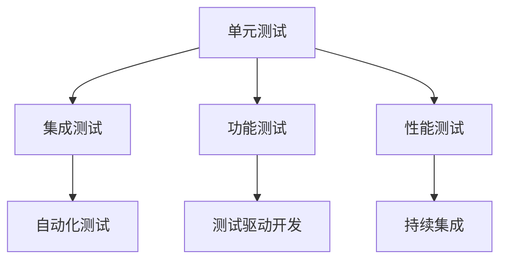

                 

### 文章标题

“代码测试：不懂质量的不是好研发”

### 文章关键词

- 代码测试
- 软件质量
- 单元测试
- 集成测试
- 功能测试
- 性能测试
- 自动化测试
- 测试驱动开发
- 持续集成与持续部署

### 摘要

本文深入探讨了代码测试在软件研发过程中的重要性。通过介绍代码测试的基本概念、分类、策略，以及单元测试、集成测试、功能测试、性能测试、自动化测试、测试驱动开发和持续集成与持续部署等具体实践方法，本文旨在帮助读者全面理解代码测试的原理和应用，提升软件质量，推动软件开发流程的优化。文章通过丰富的案例分析和实际应用，提供了宝贵的实践经验，为研发人员提供了实用的指导和参考。

----------------------------------------------------------------

### 引言

在现代软件工程中，代码测试已成为保证软件质量不可或缺的一环。代码测试不仅仅是检验代码是否按照需求工作，更是保障软件稳定性和可靠性的重要手段。随着软件复杂性的增加和用户需求的日益多样，代码测试的重要性愈发凸显。一个不懂代码测试的研发人员，很难被认为是一个优秀的研发者。

#### 软件质量的重要性

软件质量是软件项目成功的关键因素之一。它直接影响到软件的性能、可靠性、安全性、可维护性和用户满意度。高质量软件能够降低维护成本，提高用户满意度，增加企业的竞争力。而代码测试则是保证软件质量的基础性工作。

#### 代码测试的定义与目的

代码测试是一种通过执行程序代码来验证其正确性的活动。它包括各种类型的测试，如单元测试、集成测试、功能测试、性能测试等。代码测试的主要目的是发现代码中的错误，验证代码的功能是否符合预期，确保软件在交付前达到既定的质量标准。

#### 代码测试的发展历程

代码测试的历史可以追溯到软件开发初期。最初，测试往往由开发人员自行完成，主要是手动执行代码，查找错误。随着软件开发规模的扩大和复杂性的增加，测试逐渐变得系统化和专业化。自动化测试工具的出现，使得测试过程更加高效和可靠。近年来，测试驱动开发（TDD）和持续集成（CI）等实践方法，进一步推动了代码测试的发展。

### 核心概念与联系

为了更好地理解代码测试，我们需要了解以下几个核心概念：

1. **单元测试（Unit Testing）**：对软件中最小的可测试单元进行测试，通常是一个函数或方法。
2. **集成测试（Integration Testing）**：在单元测试之后，对多个模块进行集成测试，以确保它们能够正确地协同工作。
3. **功能测试（Functional Testing）**：验证软件的功能是否符合需求规格说明书。
4. **性能测试（Performance Testing）**：评估软件的性能，如响应时间、吞吐量等。
5. **自动化测试（Automated Testing）**：使用自动化工具执行的测试，可以大幅提高测试效率。
6. **测试驱动开发（Test-Driven Development, TDD）**：一种开发方法，要求在编写代码之前先编写测试用例。
7. **持续集成（Continuous Integration, CI）**：通过自动化测试和构建过程，确保代码库中的每个提交都能集成并运行。

下面是一个Mermaid流程图，展示了这些核心概念之间的关系：



### 代码测试的方法与工具

#### 单元测试

单元测试是对单个模块或函数进行测试，确保其按预期工作。常见的单元测试方法包括：

- **白盒测试**：测试人员具备程序内部逻辑的详细信息，使用代码覆盖率工具来检测代码的覆盖情况。
- **黑盒测试**：测试人员不关心程序内部逻辑，只关注功能是否满足需求。

伪代码示例：

```python
def test_addition():
    assert addition(1, 1) == 2
    assert addition(-1, 1) == 0
```

#### 集成测试

集成测试是在单元测试之后进行，将多个模块或组件组合在一起进行测试，以确保它们能够正确地协同工作。常见的集成测试方法包括：

- **二元组合测试**：对每一对模块进行集成测试。
- **三角组合测试**：对每一组三个模块进行集成测试。

伪代码示例：

```python
def test_module_integration():
    module1 = load_module('module1')
    module2 = load_module('module2')
    assert module1.call_function1() == expected_result1
    assert module2.call_function2() == expected_result2
```

#### 功能测试

功能测试是验证软件的功能是否符合需求规格说明书。常见的方法包括：

- **黑盒测试**：测试人员不关心内部逻辑，只关注功能是否符合预期。
- **白盒测试**：测试人员具备内部逻辑的详细信息。

伪代码示例：

```python
def test_login():
    assert login('username', 'password') == 'logged_in'
    assert login('username', 'wrong_password') == 'login_failed'
```

#### 性能测试

性能测试是评估软件的性能，如响应时间、吞吐量等。常见的方法包括：

- **负载测试**：模拟大量用户访问系统，评估系统的性能。
- **压力测试**：在系统达到极限负载时，评估系统的稳定性和响应能力。

伪代码示例：

```python
def test_performance():
    start_time = current_time()
    for _ in range(num_users):
        login('user', 'password')
    end_time = current_time()
    assert end_time - start_time < max_response_time
```

#### 自动化测试

自动化测试是通过自动化工具执行的测试，可以大幅提高测试效率。常见的自动化测试工具有：

- **Selenium**：用于Web应用的自动化测试。
- **JUnit**：用于Java的单元测试框架。
- **PyTest**：用于Python的测试框架。

伪代码示例：

```python
@ddt
class TestAddition(unittest.TestCase):
    @data(1, 2, 3)
    @unpack
    def test_add(self, a, b):
        result = addition(a, b)
        self.assertEqual(result, a + b)
```

#### 测试驱动开发（TDD）

测试驱动开发是一种开发方法，要求在编写代码之前先编写测试用例。这种方法的好处包括：

- **提高代码质量**：通过编写测试用例，开发人员可以更好地理解需求，确保代码的正确性。
- **提高开发效率**：通过自动化测试，可以快速发现和修复问题。

TDD的基本流程包括：

1. **编写测试用例**：确定要测试的功能，编写测试用例。
2. **编写代码**：编写实现功能的代码，确保测试用例通过。
3. **重构代码**：优化代码，确保测试用例仍然通过。

伪代码示例：

```python
def test_addition():
    # 测试用例
    assert addition(1, 1) == 2
    assert addition(-1, 1) == 0

# 编写代码
def addition(a, b):
    return a + b
```

#### 持续集成（CI）

持续集成是将代码库中的每个提交都通过自动化测试和构建过程，以确保其能够集成并运行。CI的好处包括：

- **快速发现和修复问题**：通过自动化测试，可以快速发现和修复问题。
- **提高代码质量**：持续集成可以确保代码库中的每个提交都是可集成的。

CI的基本流程包括：

1. **提交代码**：开发人员将代码提交到代码库。
2. **触发构建**：CI工具自动触发构建过程。
3. **执行测试**：执行自动化测试，验证代码的正确性。
4. **报告结果**：生成测试报告，显示构建结果和测试结果。

伪代码示例：

```bash
#!/bin/bash
# CI脚本
git pull
python setup.py install
pytest
```

### 项目实战

在本节中，我们将通过一个实际项目，详细讲解代码测试的实践过程。

#### 项目背景

我们假设正在开发一个在线购物平台，需要实现用户注册、登录、商品浏览和购物车功能。

#### 开发环境搭建

1. **代码仓库**：使用Git进行版本控制。
2. **开发工具**：使用Python和Django作为开发语言和框架。
3. **测试工具**：使用PyTest进行单元测试和功能测试。

#### 源代码实现

以下是用户注册功能的代码示例：

```python
from django.contrib.auth.models import User
from django.test import TestCase

class UserRegistrationTest(TestCase):
    def test_register_user(self):
        # 测试用例：注册成功
        user = User.objects.create_user(username='test_user', password='password')
        self.assertIsNotNone(user)
        self.assertTrue(user.is_active)

    def test_register_existing_user(self):
        # 测试用例：注册失败，用户已存在
        User.objects.create_user(username='test_user', password='password')
        user = User.objects.create_user(username='test_user', password='password')
        self.assertIsNone(user)
        self.assertFalse(user.is_active)
```

#### 代码解读与分析

在上面的示例中，我们使用了PyTest框架编写了两个测试用例。第一个测试用例`test_register_user`测试了用户注册成功的场景，第二个测试用例`test_register_existing_user`测试了用户注册失败的场景。

通过这两个测试用例，我们可以确保用户注册功能按照预期工作。

#### 实际案例分析和详细讲解剖析

在实际项目中，我们还需要考虑更多的测试场景，如登录、商品浏览、购物车等。以下是购物车功能的代码示例：

```python
class ShoppingCartTest(TestCase):
    def setUp(self):
        self.user = User.objects.create_user(username='test_user', password='password')
        self.client.login(username='test_user', password='password')

    def test_add_to_cart(self):
        # 测试用例：添加商品到购物车
        response = self.client.post('/cart/add/', {'product_id': 1})
        self.assertEqual(response.status_code, 200)
        self.assertIn('Product added to cart', response.content.decode())

    def test_remove_from_cart(self):
        # 测试用例：从购物车中移除商品
        response = self.client.post('/cart/remove/', {'product_id': 1})
        self.assertEqual(response.status_code, 200)
        self.assertIn('Product removed from cart', response.content.decode())
```

在这个示例中，我们使用了setUp方法来设置测试环境，确保用户已经登录。然后，我们分别测试了添加商品到购物车和从购物车中移除商品的场景。

通过这些测试用例，我们可以确保购物车功能按照预期工作。

#### 项目小结

通过以上实践，我们可以看到代码测试在软件研发过程中的重要性。通过编写和执行测试用例，我们可以发现和修复代码中的错误，确保软件的质量。代码测试不仅是一种技术手段，更是一种质量保障的思维方式。

### 最佳实践 Tips

1. **尽早开始测试**：在开发初期就开始编写测试用例，有助于及早发现和修复问题。
2. **编写可维护的测试用例**：测试用例应该易于理解和修改，以确保长期的可维护性。
3. **覆盖不同场景**：确保测试用例覆盖了各种可能的场景，包括正常场景和异常场景。
4. **自动化测试**：使用自动化测试工具可以大幅提高测试效率，减少手动测试的工作量。
5. **持续集成**：通过持续集成，可以确保每个提交都是可集成的，从而提高代码质量。

### 小结

代码测试是软件质量保障的关键环节。通过本文的介绍，我们了解了代码测试的基本概念、方法、工具和实践。代码测试不仅能够发现和修复代码中的错误，还能提高软件的可靠性和用户体验。作为一名优秀的研发人员，掌握代码测试的原理和应用是必不可少的。希望本文能够为读者提供有价值的指导和启示。

### 拓展阅读

1. 《测试驱动开发：使用Java实践》 -Kent Beck
2. 《软件工程：实践者的研究方法》 - Steve McConnell
3. 《自动化测试实战》 - Jonathan Rasmusson

### 作者信息

作者：AI天才研究院/AI Genius Institute & 禅与计算机程序设计艺术 /Zen And The Art of Computer Programming

