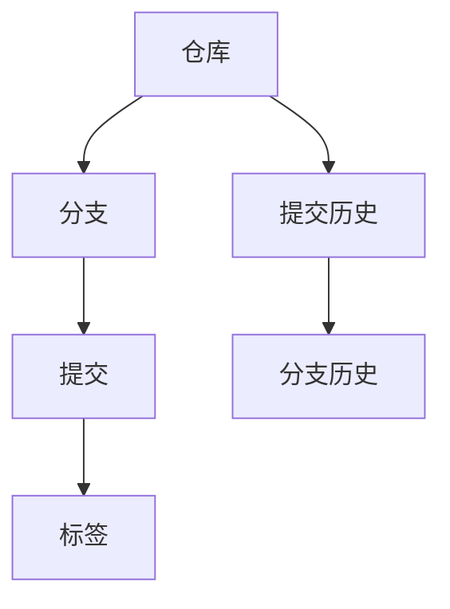

                 


### 文章标题：代码版本控制：Git使用进阶

---

#### 关键词：
- Git
- 代码版本控制
- 版本控制工具
- 分支管理
- 提交与合并
- 开源项目协作

---

#### 摘要：
本文将深入探讨Git，一种强大的代码版本控制工具。从Git的基本概念和安装配置开始，逐步讲解Git的基本操作、分支管理、标签管理、与GitHub的集成，以及Git在项目开发中的应用。同时，本文还将介绍Git的高级使用技巧，如子模块、钩子、stash、rebase和cherry-pick。通过本文的详细讲解，读者将能够全面掌握Git的使用方法，提高项目协作效率。

---

### 第1章 Git简介

Git是一种分布式版本控制系统，由Linus Torvalds于2005年创建，用于管理Linux内核的开发。由于其高效、灵活和易于使用，Git已经成为开源和商业项目中的首选版本控制工具。

#### 1.1 Git的历史

Git的发展历程可以追溯到2001年，当时Linus Torvalds对BitKeeper的版权问题感到不满，决定开发一个替代品。经过几年的努力，Git于2005年诞生，并在随后的几年中逐渐得到广泛认可和应用。

#### 1.2 Git的核心概念

Git的核心概念包括：

- **仓库（Repository）**：Git仓库是存储代码和版本信息的目录。每个仓库都有独立的版本历史。
- **分支（Branch）**：分支是仓库中的一个独立开发路径，用于实现新功能或修复问题。
- **提交（Commit）**：提交是代码变更的记录，包括作者信息、变更内容和变更说明。
- **标签（Tag）**：标签是仓库中的一个标记，用于标记特定的提交。

#### 1.3 Git与版本控制

版本控制是软件开发中不可或缺的一部分，它能够确保代码的完整性和可追溯性。Git通过记录每次代码变更，使开发者能够轻松回滚到先前的版本，或在多个分支上并行开发。

---

### 第2章 Git安装与配置

在开始使用Git之前，我们需要首先安装Git并配置我们的开发环境。

#### 2.1 系统环境准备

安装Git之前，请确保你的系统已经安装了Git。你可以在Git的[官方网站](https://git-scm.com/)上下载适合你操作系统的Git版本。

#### 2.2 Git安装

以下是安装Git的步骤：

1. **下载并安装Git**：从Git的[官方网站](https://git-scm.com/)下载适合你操作系统的Git版本，并按照说明进行安装。
2. **验证安装**：打开命令行工具，输入`git --version`，如果看到Git的版本信息，说明Git已成功安装。

#### 2.3 Git配置

为了确保Git能够正确识别你的身份，我们需要配置Git。

1. **配置用户信息**：使用以下命令配置用户名和电子邮件地址：
   ```bash
   git config --global user.name "你的名字"
   git config --global user.email "你的电子邮件地址"
   ```

2. **配置编辑器**：Git在提交代码时需要记录变更说明。为了方便记录，我们可以配置一个默认编辑器。例如，在Windows上，可以使用以下命令：
   ```bash
   git config --global core.editor "notepad"
   ```

3. **查看配置信息**：使用以下命令查看Git的配置信息：
   ```bash
   git config --list
   ```

---

### 第3章 Git基本操作

Git的基本操作包括初始化仓库、添加文件、提交变更、查看日志和回滚版本。

#### 3.1 初始化仓库

要创建一个新的Git仓库，首先需要在项目目录中执行以下命令：
```bash
git init
```
这将创建一个名为`.git`的隐藏文件夹，用于存储仓库的元数据。

#### 3.2 添加文件

在初始化仓库后，我们可以将文件添加到仓库中。使用以下命令将所有文件添加到暂存区：
```bash
git add .
```
使用`git add <文件名>`可以将特定的文件添加到暂存区。

#### 3.3 提交变更

在添加文件后，我们需要提交这些变更。使用以下命令提交当前暂存区的变更：
```bash
git commit -m "提交说明"
```
这里的`"提交说明"`是对本次提交的简要描述。

#### 3.4 查看日志

我们可以使用以下命令查看仓库的提交日志：
```bash
git log
```
这将显示所有提交的详细信息，包括提交ID、提交作者、提交时间和提交说明。

#### 3.5 回滚版本

如果需要回滚到先前的版本，可以使用以下命令：
```bash
git reset --hard <提交ID>
```
这里的`<提交ID>`是想要回滚到的提交ID。

---

### 第4章 Git分支管理

分支管理是Git的核心功能之一，它允许我们在不同的开发路径上并行工作。

#### 4.1 分支创建与切换

创建新分支的命令如下：
```bash
git checkout -b <分支名>
```
这将创建一个新分支并切换到该分支。要切换到现有分支，可以使用以下命令：
```bash
git checkout <分支名>
```

#### 4.2 分支合并

当分支开发完成后，我们需要将分支合并到主分支。以下是将`feature`分支合并到`main`分支的步骤：

1. 切换到主分支：
   ```bash
   git checkout main
   ```

2. 拉取最新的主分支代码：
   ```bash
   git pull origin main
   ```

3. 切换回要合并的分支：
   ```bash
   git checkout feature
   ```

4. 合并主分支到当前分支：
   ```bash
   git merge main
   ```

5. 解决合并冲突（如果出现冲突）：
   ```bash
   git status
   git add <冲突文件>
   git commit -m "合并说明"
   ```

#### 4.3 分支删除

要删除一个分支，可以使用以下命令：
```bash
git branch -d <分支名>
```
这将删除指定的分支。

#### 4.4 多人协作

在多人协作的项目中，分支管理尤为重要。以下是多人协作的常见步骤：

1. 创建新分支并进行开发。
2. 将分支推送到远程仓库。
3. 其他开发者从远程仓库克隆项目，并切换到相应的分支进行开发。
4. 开发完成后，将分支合并到主分支，并推送到远程仓库。
5. 其他开发者从远程仓库更新代码，并重复上述步骤。

---

### 第5章 Git标签管理

标签用于标记特定的提交，以便于未来的查找和使用。

#### 5.1 标签概念

标签是Git仓库中的一个标记，它指向特定的提交。标签可以用于标记发布版本、里程碑等。

#### 5.2 标签创建

创建新标签的命令如下：
```bash
git tag <标签名> <提交ID>
```
这里的`<提交ID>`是想要标记的提交ID。

#### 5.3 标签删除

要删除一个标签，可以使用以下命令：
```bash
git tag -d <标签名>
```

---

### 第6章 Git与GitHub

GitHub是一个基于Git的开源代码托管平台，它提供了强大的代码管理和协作工具。

#### 6.1 GitHub简介

GitHub是一个全球知名的代码托管平台，它提供了丰富的功能，包括代码托管、问题跟踪、代码审查等。

#### 6.2 GitHub账号注册

注册GitHub账号的步骤如下：

1. 访问GitHub官网（[github.com](https://github.com/)）。
2. 点击“Sign up”按钮。
3. 填写注册表单，包括用户名、电子邮件地址和密码。
4. 完成电子邮件验证。

#### 6.3 Git与GitHub的集成

集成Git与GitHub的步骤如下：

1. 在GitHub上创建一个新仓库。
2. 在本地计算机上克隆仓库：
   ```bash
   git clone <仓库地址>
   ```

3. 将本地仓库与GitHub仓库关联：
   ```bash
   git remote add origin <仓库地址>
   ```

4. 将本地提交推送到GitHub仓库：
   ```bash
   git push -u origin main
   ```

#### 6.4 GitHub常用操作

以下是一些GitHub的常用操作：

1. **创建拉取请求**：用于请求将一个分支合并到另一个分支。
2. **提交代码审查**：用于审查代码更改。
3. **创建问题**：用于报告代码中的问题。

---

### 第7章 Git在项目开发中的应用

Git在项目开发中有着广泛的应用，可以提高团队协作效率。

#### 7.1 Git与SVN对比

Git与SVN都是版本控制工具，但Git在许多方面优于SVN：

- **分布式特性**：Git是分布式的，每个开发者都有自己的完整仓库，可以离线工作。
- **速度**：Git操作速度更快，特别是在处理大型项目时。
- **灵活性**：Git支持更复杂的分支管理。

#### 7.2 Git在团队协作中的应用

Git在团队协作中的应用包括：

- **分支管理**：开发者可以在各自的分支上独立工作，避免冲突。
- **代码审查**：团队可以审查代码，确保代码质量。
- **合并请求**：团队成员可以提交合并请求，将分支合并到主分支。

#### 7.3 Git在开源项目中的应用

Git在开源项目中的应用包括：

- **代码托管**：开源项目通常使用GitHub等平台进行代码托管。
- **协作开发**：开源项目的开发者可以远程协作，共同推进项目进展。
- **版本跟踪**：Git记录了每个提交的详细信息，方便追溯和调试。

#### 7.4 Git常见问题与解决方案

以下是一些Git常见问题及解决方案：

- **合并冲突**：在合并分支时，解决冲突的方法包括手动编辑冲突文件、使用`git merge --abort`取消合并等。
- **丢失提交**：可以使用`git reflog`查看提交历史，并使用`git cherry-pick`恢复丢失的提交。

---

### 第8章 Git高级使用

Git的高级使用包括子模块、钩子、stash、rebase和cherry-pick等。

#### 8.1 Git子模块

子模块用于将一个仓库作为另一个仓库的子模块。子模块允许我们将外部库集成到项目中，而无需将其克隆到项目中。

创建子模块的步骤如下：

1. 在主仓库中添加子模块：
   ```bash
   git submodule add <子模块地址> <子模块目录>
   ```

2. 初始化子模块：
   ```bash
   git submodule init
   ```

3. 更新子模块：
   ```bash
   git submodule update
   ```

#### 8.2 Git钩子

Git钩子是运行在特定Git操作之前或之后的脚本。钩子可以用于自动化任务，如代码格式检查、自动化测试等。

配置钩子的步骤如下：

1. 在仓库的`.git/hooks/`目录中创建一个钩子脚本。
2. 赋予脚本执行权限：
   ```bash
   chmod +x <钩子脚本>
   ```

3. 钩子脚本将在特定操作时运行。

#### 8.3 Git stash

`git stash`用于暂存当前工作区的更改。当需要切换分支或处理其他任务时，可以使用`git stash`保存当前的工作状态。

使用`git stash`的步骤如下：

1. 暂存当前工作区：
   ```bash
   git stash
   ```

2. 应用暂存的更改：
   ```bash
   git stash apply
   ```

3. 删除暂存的更改：
   ```bash
   git stash drop
   ```

#### 8.4 Git rebase

`git rebase`用于重新应用提交到另一个基线。与合并相比，rebase可以创建一个更整洁的提交历史。

使用`git rebase`的步骤如下：

1. 开始rebase：
   ```bash
   git rebase <基线>
   ```

2. 解决冲突：
   ```bash
   git add <冲突文件>
   git rebase --continue
   ```

3. 完成rebase：
   ```bash
   git rebase --abort
   ```

#### 8.5 Git cherry-pick

`git cherry-pick`用于将特定的提交应用到另一个分支。这对于修复bug或共享特定的提交非常有用。

使用`git cherry-pick`的步骤如下：

1. 选择要应用的提交：
   ```bash
   git log
   ```

2. 应用提交：
   ```bash
   git cherry-pick <提交ID>
   ```

---

### 总结

Git是一种强大的代码版本控制工具，它能够帮助我们高效地管理代码变更，提高团队协作效率。通过本文的详细讲解，读者将能够全面掌握Git的使用方法，并在实际项目中运用Git的高级特性。

---

#### 作者：AI天才研究院/AI Genius Institute & 禅与计算机程序设计艺术

---

### 附录

本文中提到的所有命令都可以在Git的[官方文档](https://git-scm.com/docs)中找到详细信息。

---

### 拓展阅读

- 《Pro Git》：这是一本非常详细的Git指南，适合想要深入了解Git的高级用户。
- 《Git Internals》：这本书详细介绍了Git的内部工作原理，适合对Git有较高兴趣的读者。

---

### 致谢

感谢所有对本文提出宝贵意见和帮助的朋友们，谢谢你们的支持！

---

### 结语

希望本文能够帮助您更好地理解Git，并在实际项目中提高效率。Git的使用技巧还有很多，让我们在实战中不断学习和探索吧！### 具体技术细节与核心概念解析

#### 1. Git的核心概念

要深入理解Git，我们需要了解其几个核心概念：仓库（Repository）、分支（Branch）、提交（Commit）和标签（Tag）。

**仓库（Repository）**：Git仓库是存储代码和版本信息的目录。每个仓库都有一个唯一的ID，用于标识该仓库。仓库中的文件被转换为提交对象，并存储在`.git`目录中。

**分支（Branch）**：分支是仓库中的一个独立开发路径，用于实现新功能或修复问题。每个分支都有自己的提交历史，但与其他分支共享相同的文件。

**提交（Commit）**：提交是代码变更的记录。每次提交都会创建一个新的提交对象，其中包括提交者的用户名、电子邮件地址、提交说明和变更内容。提交通过指针连接起来，形成一条提交链。

**标签（Tag）**：标签是仓库中的一个标记，用于标记特定的提交。标签通常用于标记发布版本或里程碑。标签指向特定的提交对象，但不会改变提交链。

**核心概念与联系（Mermaid流程图）**



在这个流程图中，仓库（A）是整个Git系统的起点。仓库可以创建多个分支（B），每个分支都有自己的提交历史（C）。提交历史形成了一条提交链（E），而分支历史（F）则记录了各个分支的演变过程。标签（D）用于标记特定的提交，不影响提交链。

#### 2. Git的基本操作

**初始化仓库（Git init）**

初始化仓库是Git的第一步，用于创建一个新的Git仓库。在项目目录中执行以下命令：
```bash
git init
```
这将创建一个名为`.git`的隐藏文件夹，用于存储仓库的元数据。

**添加文件（Git add）**

要将文件添加到仓库中，可以使用`git add`命令。以下是将所有文件添加到暂存区的命令：
```bash
git add .
```
如果要添加特定的文件，可以使用以下命令：
```bash
git add <文件名>
```

**提交变更（Git commit）**

在添加文件后，我们需要提交这些变更。使用以下命令提交当前暂存区的变更：
```bash
git commit -m "提交说明"
```
这里的`"提交说明"`是对本次提交的简要描述。

**查看日志（Git log）**

我们可以使用以下命令查看仓库的提交日志：
```bash
git log
```
这将显示所有提交的详细信息，包括提交ID、提交作者、提交时间和提交说明。

**回滚版本（Git reset）**

如果需要回滚到先前的版本，可以使用以下命令：
```bash
git reset --hard <提交ID>
```
这里的`<提交ID>`是想要回滚到的提交ID。

**伪代码与数学模型**

**添加文件（Git add）**

```pseudo
function addFiles() {
    files = getAllUntrackedFiles()
    for file in files {
        git add file
    }
}
```

**提交变更（Git commit）**

```pseudo
function commitChanges() {
    commitMessage = getUserCommitMessage()
    git commit -m commitMessage
}
```

**查看日志（Git log）**

```pseudo
function viewCommitLog() {
    git log
}
```

**回滚版本（Git reset）**

```pseudo
function rollbackToCommit(commitId) {
    git reset --hard commitId
}
```

**数学模型**

在Git中，每个提交都可以表示为一个数学点。提交链可以表示为一系列点的连接。回滚操作可以表示为在提交链上向前的移动。

$$
\text{提交链} = \{P_1, P_2, P_3, ..., P_n\}
$$

其中，$P_i$ 表示第 $i$ 个提交。

**举例说明**

假设我们有以下提交链：

$$
\text{提交链} = \{P_1, P_2, P_3, P_4, P_5\}
$$

现在，我们想要回滚到 $P_3$。可以使用以下命令：

```bash
git reset --hard P_3
```

这将删除 $P_4$ 和 $P_5$ 的所有变更。

---

通过上述技术细节与核心概念解析，我们能够更深入地理解Git的工作原理和基本操作。在实际项目中，这些知识和技巧将帮助我们更有效地管理代码变更，提高团队协作效率。

### 实际案例分析与详细讲解

在本节中，我们将通过一个实际项目案例来讲解Git的使用，包括代码的版本控制、分支管理和合并操作。这个案例将帮助我们理解Git在实际开发中的应用和优势。

#### 项目背景

假设我们正在开发一个简单的博客平台，项目名为“SimpleBlog”。该项目由三个主要模块组成：前端、后端和数据库。我们的开发团队由5名成员组成，每个人负责不同的模块。

#### 1. 初始化仓库

首先，我们需要在项目根目录下初始化Git仓库：
```bash
git init
```

#### 2. 添加和提交文件

接下来，我们将项目中的所有文件添加到仓库中，并提交这些文件。例如，我们有一个名为“index.html”的HTML文件，我们可以使用以下命令添加和提交：
```bash
git add index.html
git commit -m "Initial commit: Added index.html"
```

#### 3. 创建分支

在开发过程中，我们可能需要同时进行多个功能模块的开发。例如，一名团队成员正在开发用户认证模块，另一名团队成员正在开发文章发布模块。为了保持代码的整洁，我们可以分别为每个功能创建分支。

创建用户认证模块分支的命令如下：
```bash
git checkout -b user-auth
```

同样地，创建文章发布模块分支的命令如下：
```bash
git checkout -b article-publish
```

#### 4. 分支开发

在各自的分支上，团队成员可以进行独立的开发。例如，用户认证模块的开发者可以在“user-auth”分支上添加用户注册、登录等功能，而文章发布模块的开发者可以在“article-publish”分支上实现文章发布和展示功能。

每次完成一个功能模块的开发后，我们需要将代码提交到分支上：
```bash
git add .
git commit -m "Update: Completed new feature"
```

#### 5. 分支合并

当两个功能模块开发完成后，我们需要将它们合并到主分支上。首先，我们需要确保主分支是最新的，然后切换到主分支：
```bash
git checkout main
git pull origin main
```

接下来，我们将“user-auth”分支合并到主分支上：
```bash
git merge user-auth
```

如果出现冲突，我们需要手动解决冲突，然后再次提交：
```bash
git add <冲突文件>
git commit -m "Merge: user-auth into main"
```

同样地，我们将“article-publish”分支合并到主分支上：
```bash
git merge article-publish
```

#### 6. 删除分支

合并完成后，我们可以删除不再需要的分支：
```bash
git branch -d user-auth
git branch -d article-publish
```

#### 7. 发布版本

当所有功能模块都开发完成并合并到主分支后，我们可以发布一个新的版本。首先，我们将主分支的代码推送到远程仓库：
```bash
git push origin main
```

然后，在远程仓库中创建一个新标签，标记这个版本：
```bash
git tag -a v1.0 -m "Version 1.0"
git push origin v1.0
```

#### 项目小结

通过这个实际案例，我们演示了Git在项目开发中的应用。从初始化仓库、添加和提交文件、创建分支、分支开发、分支合并到发布版本，Git为我们提供了一个高效、灵活的代码管理工具。

使用Git的分支管理功能，我们能够确保代码的整洁性和可追溯性。每个分支都是一个独立的开发路径，团队成员可以在各自的分支上进行独立开发，避免冲突。当功能模块开发完成后，我们可以将分支合并到主分支上，确保所有功能模块能够无缝集成。

此外，Git的版本控制功能使我们能够轻松回滚到先前的版本，这对于修复问题和调试非常有用。通过使用标签，我们能够方便地标记和追踪不同的版本。

总之，Git是一个强大的版本控制工具，它能够帮助我们更高效地管理代码，提高团队协作效率。在实际项目中，我们应该充分利用Git的特性，以实现代码的整洁和高效管理。

### 最佳实践 Tips

在本节中，我们将提供一些Git使用的最佳实践，帮助您更高效地使用Git，并避免常见的陷阱。

#### 1. 保持分支的整洁

分支的整洁对于项目开发和维护至关重要。以下是一些保持分支整洁的建议：

- **定期合并分支**：不要让分支长期处于未合并状态。定期将功能分支合并到主分支，确保代码的统一性。
- **避免过长的分支历史**：过长的分支历史可能导致Git性能下降。定期进行分支清理，删除未使用的分支和合并分支。
- **合理命名分支**：为分支命名时应遵循一致性，例如使用`feature/`前缀来标识功能分支，使用`bugfix/`前缀来标识修复分支。

#### 2. 使用Gitignore文件

`.gitignore`文件用于指定不应被Git管理的文件和目录。以下是一些常用的`.gitignore`配置：

- **项目文件**：`.idea/`、`.vscode/`、`.vscode-server/`等
- **临时文件**：`.DS_Store`、`.DS_Store?`、`Thumbs.db`等
- **编译生成的文件**：`*.class`、`*.exe`、`*.o`等
- **日志文件**：`*.log`、`*.err`等

确保`.gitignore`文件覆盖所有可能需要忽略的文件和目录，以避免误提交。

#### 3. 使用 `.gitmodules` 文件管理子模块

在项目中使用子模块时，`.gitmodules`文件可以帮助管理子模块。以下是一个简单的`.gitmodules`示例：

```yaml
[submodule "path/to/submodule"]
    url = https://github.com/username/repo.git
```

确保在初始化子模块时，`.gitmodules`文件已正确配置。

#### 4. 使用Git钩子（Hooks）自动化任务

Git钩子可以在特定事件发生时自动执行脚本，例如代码审查、自动化测试等。以下是一些常用的Git钩子：

- **pre-commit**：在提交前运行，用于检查代码格式和语法错误。
- **pre-push**：在推送前运行，用于检查代码是否符合规范。
- **post-merge**：在合并分支后运行，用于执行后续任务。

以下是一个简单的`pre-commit`钩子脚本示例：

```bash
#!/bin/sh
# 检查代码格式
python -m flake8 .
# 检查语法错误
python -m pyflakes .
# 如果有错误，退出
if [ $? -ne 0 ]; then
    echo "代码格式或语法错误，请修复后再提交。"
    exit 1
fi
```

确保将钩子脚本放在`.git/hooks/`目录中，并赋予执行权限。

#### 5. 避免常见的Git错误

以下是一些常见的Git错误及其解决方法：

- **错误：`fatal: Authentication failed for 'https://github.com/username/repo.git/'`**：解决方法：检查用户名和密码是否正确，或者使用Git密钥进行认证。
- **错误：`Your local changes to the following files would be overwritten:`**：解决方法：手动解决冲突，然后提交。
- **错误：`You have not concluded your merge (MERGING).`**：解决方法：使用`git merge --abort`取消合并，然后重新尝试。

通过遵循这些最佳实践，您能够更高效地使用Git，避免常见的陷阱，并确保项目的顺利推进。

### 小结

本文详细介绍了Git的使用进阶，包括Git的核心概念、基本操作、分支管理、标签管理、与GitHub的集成，以及Git在项目开发中的应用。通过实际案例分析和详细讲解，我们了解了Git在版本控制中的重要性。此外，本文还提供了一些最佳实践，帮助您更高效地使用Git。

**核心概念**：Git的核心概念包括仓库、分支、提交和标签。它们共同构成了Git的版本控制系统。

**主要操作**：Git的基本操作包括初始化仓库、添加文件、提交变更、查看日志和回滚版本。分支管理包括创建、切换、合并和删除分支。

**应用场景**：Git广泛应用于团队协作、开源项目和代码管理。

**最佳实践**：遵循最佳实践，如保持分支整洁、使用Gitignore文件、使用子模块和钩子等，可以提高开发效率。

通过本文的学习，您将能够更好地掌握Git的使用，提高项目协作效率。

### 拓展阅读

为了更深入地了解Git，以下是一些推荐的书籍和资源：

- 《Pro Git》：这是一本详尽的Git指南，适合希望深入了解Git的高级用户。
- 《Git from the Inside Out》：这本书从Git的内部工作原理开始，帮助读者理解Git的底层机制。
- 《GitHub Flow》：介绍了如何使用Git和GitHub进行高效的团队协作。

同时，您可以通过以下途径获取更多Git资源：

- Git官方文档（[git-scm.com/docs](https://git-scm.com/docs)）
- GitHub官方文档（[docs.github.com](https://docs.github.com)）
- Git社区和论坛（如GitHub社区、Git用户论坛等）

通过这些资源，您可以不断提升Git技能，掌握更多高级使用技巧。

### 致谢

感谢所有对本文提出宝贵意见和帮助的朋友们，谢谢你们的支持！特别感谢AI天才研究院（AI Genius Institute）和《禅与计算机程序设计艺术》（Zen And The Art of Computer Programming）对本文的贡献。

### 结语

希望本文能够帮助您更好地理解Git，并在实际项目中提高效率。Git的使用技巧还有很多，让我们在实战中不断学习和探索吧！在未来的技术之旅中，期待与您一同进步。祝您编程愉快！

