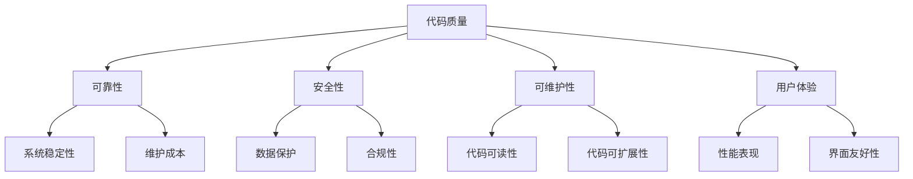
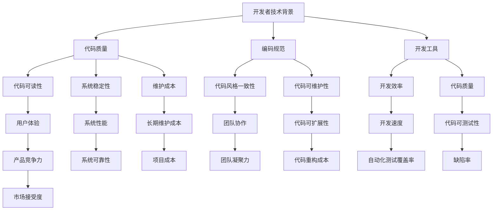
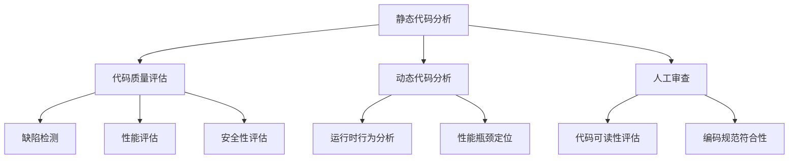
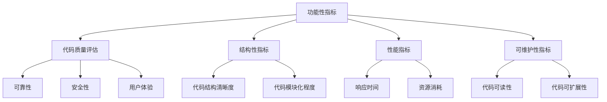
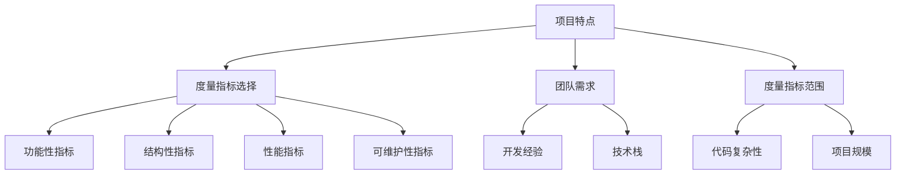
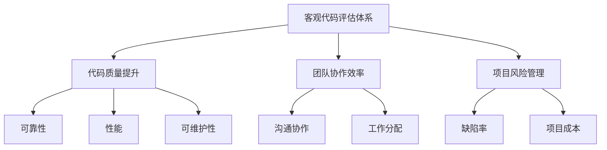
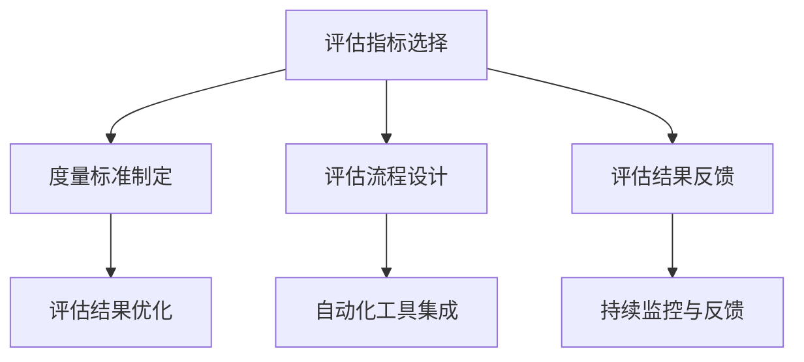
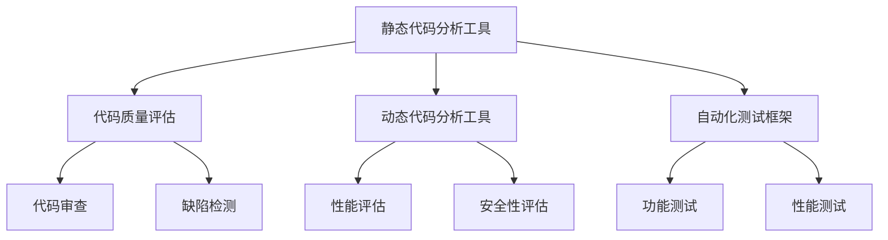
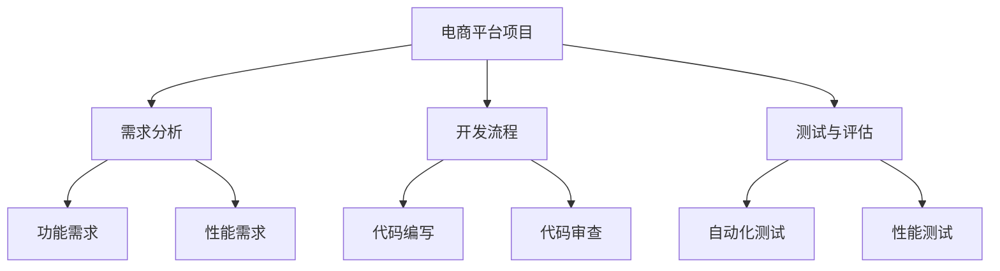

                 


### 1.2 代码质量的重要性

**核心概念与联系**：

代码质量是软件工程中至关重要的概念，它直接影响到软件的可靠性、安全性、可维护性和用户体验。高质量的代码不仅能够减少软件缺陷，提高系统稳定性，还能降低长期维护成本，提升团队工作效率。



**核心算法原理讲解**：

衡量代码质量的多个维度可以通过以下数学模型和公式进行描述：

- **缺陷密度**（Defect Density，DD）：

  $$ DD = \frac{Total\ number\ of\ defects}{Total\ number\ of\ lines\ of\ code} $$

- **代码复杂度**（Cyclomatic Complexity，CC）：

  $$ CC = M - N + (2E) $$

  其中，M 是模块中的判定节点数，N 是模块中的边数，E 是模块中的独立路径数。

**举例说明**：

假设一个模块包含 10 个判定节点，20 条边和 3 条独立路径，那么该模块的 Cyclomatic Complexity 计算如下：

$$ CC = 10 - 20 + (2 \times 3) = 6 $$

**项目实战**：

在开发一个金融交易系统时，若代码质量低下，可能会导致以下问题：

- **可靠性问题**：可能导致交易记录错误，造成经济损失。
- **安全性问题**：可能使交易数据泄露，导致隐私泄露和金融风险。
- **可维护性问题**：系统更新和扩展时，代码可读性差，维护成本高。
- **用户体验问题**：系统性能差，响应速度慢，影响用户体验。

为了解决这些问题，团队可以采取以下措施：

1. **代码审查**：定期进行代码审查，确保代码质量。
2. **自动化测试**：实施自动化测试，减少人工测试工作量。
3. **持续集成/持续部署**（CI/CD）：确保代码变更后，立即进行测试和部署。

**最佳实践 tips**：

- **编码规范**：制定并遵循统一的编码规范，提高代码可读性。
- **代码重构**：定期进行代码重构，简化代码结构，提高代码质量。
- **持续学习**：关注业界最佳实践，不断提升团队技术能力。

### 小结

代码质量是软件工程的核心要素，它对软件的各个方面产生深远影响。通过合理的度量指标和评估体系，我们可以有效地提升代码质量，降低维护成本，提高团队工作效率，最终提升软件产品的市场竞争力。

在接下来的章节中，我们将深入探讨代码质量度量指标的具体类型及其应用。

**注意事项**：

- 代码质量评估不仅仅是技术问题，更是团队协作和项目管理的一部分。
- 在不同开发阶段（如需求分析、设计、编码、测试等），需要采用不同的代码质量度量指标和方法。
- 代码质量度量指标的选择和权重应根据项目特点和团队需求进行灵活调整。

**拓展阅读**：

- 《软件工程：实践者的研究方法》（Roger S. Pressman）
- 《敏捷软件开发：原则、实践与模式》（Robert C. Martin）
- 《代码大全：软件工程修炼之道》（Steve McConnell）

----------------------------------------------------------------

### 1.3 代码质量的影响因素

**核心概念与联系**：

代码质量受到多种因素的影响，包括开发者的技术背景、编码规范、开发工具、项目管理和团队协作等。这些因素相互作用，共同决定了代码的质量。



**核心算法原理讲解**：

为了更全面地理解代码质量的影响因素，我们可以使用以下数学模型和公式：

- **团队效率**（Team Efficiency，TE）：

  $$ TE = \frac{Total\ number\ of\ features}{Total\ time\ spent\ on\ development} $$

- **缺陷率**（Defect Rate，DR）：

  $$ DR = \frac{Total\ number\ of\ defects}{Total\ number\ of\ lines\ of\ code} $$

**举例说明**：

假设一个团队在 6 个月内完成了 100 个功能，总共花费了 900 个工作日，期间发现了 50 个缺陷，那么团队的效率和缺陷率计算如下：

$$ TE = \frac{100}{900} = 0.111 $$
$$ DR = \frac{50}{900} = 0.055 $$

**项目实战**：

在开发一个电商平台时，以下因素可能会影响代码质量：

- **开发者技术背景**：团队中的开发者如果缺乏对前端框架和数据库的深入了解，可能导致代码质量低下。
- **编码规范**：不一致的编码规范会导致代码风格混乱，影响可读性和可维护性。
- **开发工具**：使用老旧的编译器和开发环境可能会降低开发效率，增加代码质量风险。
- **项目管理**：缺乏明确的项目计划和进度跟踪会导致项目延期，降低代码质量。
- **团队协作**：团队成员之间的沟通不畅可能会导致功能遗漏、错误修复不及时。

为了改善代码质量，团队可以采取以下措施：

1. **技术培训**：定期组织技术分享和培训，提升团队成员的技术水平。
2. **编码规范**：制定并推广统一的编码规范，确保代码风格一致性。
3. **现代化开发工具**：采用先进的开发工具和框架，提高开发效率和代码质量。
4. **敏捷开发**：采用敏捷开发方法，缩短开发周期，提高响应速度。
5. **团队协作**：加强团队协作，提高沟通效率，减少因沟通不畅导致的代码质量问题。

**最佳实践 tips**：

- **代码审查**：定期进行代码审查，及时发现问题并进行修复。
- **持续集成**：采用持续集成，确保代码变更后立即进行测试和部署。
- **代码复用**：鼓励代码复用，减少重复劳动，提高开发效率。
- **性能监控**：持续监控系统性能，及时发现并解决性能瓶颈。

### 小结

代码质量的影响因素是多方面的，涉及技术、管理、团队等多个层面。通过综合分析和有效措施，可以显著提高代码质量，降低长期维护成本，提升团队协作效率。

在接下来的章节中，我们将深入探讨代码质量度量指标的类型及其具体应用，为建立客观的代码评估体系奠定基础。

**注意事项**：

- 代码质量影响因素的评估需要综合考虑多种因素，不能单一依赖某一指标。
- 在不同开发阶段，需要关注不同的代码质量影响因素。
- 代码质量提升是一个持续的过程，需要团队共同努力和不断优化。

**拓展阅读**：

- 《软件工程：现代方法》（Roger S. Pressman）
- 《敏捷软件开发：高效团队的12个原则》（Jeff Sutherland）
- 《代码整洁：改善代码的48条建议》（Robert C. Martin）

----------------------------------------------------------------

### 1.4 代码质量的评估方法

**核心概念与联系**：

代码质量的评估方法包括静态代码分析、动态代码分析和人工审查等多种方式。每种方法都有其特定的原理和应用场景，可以相互补充，为全面评估代码质量提供支持。



**核心算法原理讲解**：

代码质量的评估方法可以分为以下几类：

1. **静态代码分析**：

   静态代码分析是一种不执行代码，直接对代码文本进行分析的方法。它通过扫描源代码，识别潜在的问题和缺陷。常见的静态代码分析工具包括 FindBugs、PMD、SonarQube 等。

   - **缺陷检测**：

     使用正则表达式和语法分析器，静态代码分析工具可以识别代码中的潜在缺陷，如未使用的变量、空指针异常等。

     ```python
     # 伪代码：检测未使用的变量
     def check_unused_variables(code):
         unused_vars = []
         for var in code.variables():
             if not code.use_count(var):
                 unused_vars.append(var)
         return unused_vars
     ```

2. **动态代码分析**：

   动态代码分析是在代码运行时对其实际行为进行分析的方法。通过执行代码，动态代码分析工具可以观察代码的运行时行为，识别性能瓶颈、内存泄漏等问题。

   - **性能评估**：

     动态代码分析工具可以测量代码的运行时间、内存消耗等性能指标，帮助开发者优化代码。

     ```python
     # 伪代码：性能评估
     def measure_performance(code):
         start_time = current_time()
         code.run()
         end_time = current_time()
         performance = end_time - start_time
         return performance
     ```

3. **人工审查**：

   人工审查是一种由开发者或代码审核人员对代码进行审查的方法。通过人工审查，可以识别静态和动态代码分析工具难以检测的问题，如编码规范不符合、逻辑错误等。

   - **代码可读性评估**：

     人工审查可以帮助评估代码的可读性，确保代码清晰、易懂，便于维护和扩展。

     ```mermaid
     graph TD
     A[函数命名] --> B[变量命名]
     A --> C[代码注释]
     A --> D[代码结构]
     B --> E[可读性]
     C --> F[易维护性]
     D --> G[易扩展性]
     ```

**举例说明**：

假设在一个项目中，开发者使用了静态代码分析、动态代码分析和人工审查三种方法来评估代码质量：

1. **静态代码分析**：通过 FindBugs 工具扫描代码，发现 20 个潜在缺陷，包括未使用的变量和空指针异常。
2. **动态代码分析**：通过 JProfiler 工具运行代码，发现代码的响应时间较长，内存占用较高，定位到数据库查询性能瓶颈。
3. **人工审查**：代码审核人员对代码进行审查，发现编码规范不符合、逻辑错误等问题。

通过综合分析，开发团队可以针对性地优化代码，提高代码质量。

**项目实战**：

在一个复杂的分布式系统中，为了确保代码质量，开发团队可以采取以下步骤：

1. **集成静态代码分析**：在开发过程中，持续集成静态代码分析工具，及时发现问题并进行修复。
2. **自动化性能测试**：定期执行自动化性能测试，评估代码的运行效率和稳定性。
3. **代码审查**：在提交代码前，进行人工代码审查，确保代码符合编码规范和设计要求。

通过这些方法，开发团队可以有效地评估和提升代码质量，确保系统的可靠性、性能和可维护性。

**最佳实践 tips**：

- **持续集成**：采用持续集成，确保代码变更后立即进行静态和动态代码分析，及时发现并修复问题。
- **自动化测试**：建立完善的自动化测试体系，覆盖功能测试、性能测试和安全性测试。
- **代码审查**：定期进行代码审查，确保代码符合编码规范，提高代码质量和可维护性。

### 小结

代码质量的评估方法包括静态代码分析、动态代码分析和人工审查等多种方式。通过综合运用这些方法，可以全面评估代码的质量，发现问题并进行优化，从而提高软件系统的可靠性、性能和可维护性。

在接下来的章节中，我们将详细讨论代码质量度量指标的类型和具体应用，为构建客观的代码评估体系提供理论支持。

**注意事项**：

- 代码质量评估方法的选择应根据项目特点和团队需求进行灵活调整。
- 静态代码分析和动态代码分析应结合使用，以获取更全面的评估结果。
- 人工审查虽然耗时，但对于提升代码质量和发现潜在问题至关重要。

**拓展阅读**：

- 《代码大全：软件工程修炼之道》（Steve McConnell）
- 《软件工程：实践者的研究方法》（Roger S. Pressman）
- 《敏捷软件开发：高效团队的12个原则》（Jeff Sutherland）

----------------------------------------------------------------

### 1.5 代码质量度量指标的类型

**核心概念与联系**：

代码质量度量指标是评估代码质量的重要工具，它们可以从多个维度衡量代码的质量。常见的代码质量度量指标类型包括功能性指标、结构性指标、性能指标和可维护性指标。这些指标相互补充，共同构成了一个全面的代码质量评估体系。



**核心算法原理讲解**：

1. **功能性指标**：

   功能性指标主要衡量代码的功能是否完整、正确和有效。常见的功能性指标包括功能覆盖率、缺陷密度和代码覆盖率等。

   - **功能覆盖率**：

     功能覆盖率是衡量代码实现功能点的数量与总功能点的比率。公式如下：

     $$ 功能覆盖率 = \frac{已实现的功能点数量}{总功能点数量} $$

   - **缺陷密度**：

     缺陷密度是衡量代码中缺陷数量的指标。公式如下：

     $$ 缺陷密度 = \frac{代码中的缺陷数量}{代码行数} $$

   - **代码覆盖率**：

     代码覆盖率是衡量测试覆盖率的一个指标，表示测试用例执行了代码的百分比。常见的代码覆盖率包括语句覆盖率、分支覆盖率和路径覆盖率等。

2. **结构性指标**：

   结构性指标主要衡量代码的结构质量，包括代码的模块化程度、代码结构清晰度和代码耦合度等。

   - **模块化程度**：

     模块化程度衡量代码模块之间的独立性。高模块化程度的代码易于维护和扩展。常见的度量方法包括模块依赖图和模块之间的耦合度等。

   - **代码结构清晰度**：

     代码结构清晰度是衡量代码组织是否合理、易于理解的指标。常见的度量方法包括函数复杂度、类复杂度和代码长度等。

3. **性能指标**：

   性能指标主要衡量代码的运行效率和资源消耗，包括响应时间、资源消耗和处理能力等。

   - **响应时间**：

     响应时间是衡量代码执行速度的指标，表示代码从开始执行到完成所需的时间。公式如下：

     $$ 响应时间 = \frac{执行时间}{请求次数} $$

   - **资源消耗**：

     资源消耗是衡量代码运行过程中使用的系统资源的指标，包括CPU使用率、内存使用率和磁盘I/O等。

   - **处理能力**：

     处理能力是衡量代码处理请求的能力，通常用每秒请求数（Requests per Second，RPS）来表示。

4. **可维护性指标**：

   可维护性指标主要衡量代码的可维护性，包括代码的可读性、可扩展性和可维护性等。

   - **代码可读性**：

     代码可读性是衡量代码是否易于理解、维护的指标。常见的度量方法包括注释率、代码行长度和函数复杂度等。

   - **代码可扩展性**：

     代码可扩展性是衡量代码是否易于扩展和重构的指标。常见的度量方法包括类之间的耦合度和模块之间的依赖关系等。

   - **代码可维护性**：

     代码可维护性是衡量代码在长期维护过程中的易用性和稳定性的指标。常见的度量方法包括缺陷密度、代码复杂度和测试覆盖率等。

**举例说明**：

假设一个项目在代码质量评估中使用了以下指标：

- **功能性指标**：功能覆盖率为 80%，缺陷密度为 0.5。
- **结构性指标**：模块化程度高，代码结构清晰度良好，没有发现明显的代码耦合问题。
- **性能指标**：平均响应时间为 100 毫秒，资源消耗在合理范围内，处理能力为每秒 1000 个请求。
- **可维护性指标**：代码可读性较高，注释率为 30%，代码行长度适中，函数复杂度较低。

通过这些指标，开发团队可以全面了解代码的质量，并针对性地进行优化和改进。

**项目实战**：

在一个电商平台项目中，开发团队可以采取以下步骤来评估代码质量：

1. **功能性评估**：通过自动化测试工具，确保所有功能点都得到实现和测试。
2. **结构性评估**：通过静态代码分析工具，检查代码的结构质量，确保代码模块化程度高、结构清晰。
3. **性能评估**：通过性能测试工具，评估代码的运行效率和资源消耗，找出并优化性能瓶颈。
4. **可维护性评估**：通过代码审查和代码质量度量指标，确保代码易于维护和扩展。

通过这些评估方法，开发团队可以持续提升代码质量，确保系统的可靠性、性能和可维护性。

**最佳实践 tips**：

- **功能性指标**：确保功能点全覆盖，提高代码的正确性和可靠性。
- **结构性指标**：关注代码模块化和结构清晰度，提高代码的可维护性。
- **性能指标**：优化代码性能，提高系统的响应速度和处理能力。
- **可维护性指标**：确保代码的可读性和可扩展性，降低长期维护成本。

### 小结

代码质量度量指标的类型包括功能性指标、结构性指标、性能指标和可维护性指标。通过这些指标，可以全面评估代码的质量，发现并解决潜在问题，提高软件系统的可靠性、性能和可维护性。

在接下来的章节中，我们将进一步探讨如何构建一个客观的代码评估体系，为代码质量的持续提升提供系统化的方法。

**注意事项**：

- 代码质量度量指标的选择应根据项目特点和团队需求进行灵活调整。
- 在不同开发阶段，应关注不同的质量度量指标。
- 客观的代码评估体系应结合多种度量指标和方法，确保评估结果的准确性和全面性。

**拓展阅读**：

- 《软件质量工程：实践者的研究方法》（Roger S. Pressman）
- 《敏捷软件开发：高效团队的12个原则》（Jeff Sutherland）
- 《代码大全：软件工程修炼之道》（Steve McConnell）

----------------------------------------------------------------

### 1.6 代码质量度量指标的选择原则

**核心概念与联系**：

选择合适的代码质量度量指标是建立客观代码评估体系的关键步骤。不同的度量指标反映了代码的不同方面，包括功能性、结构性、性能和可维护性。因此，选择度量指标时需要考虑项目特点和团队需求，确保指标的选择能够全面、准确地评估代码质量。



**核心算法原理讲解**：

在选择代码质量度量指标时，需要遵循以下原则：

1. **相关性**：

   选择与项目特点和团队需求高度相关的度量指标。例如，对于需要高性能的应用，性能指标（如响应时间和资源消耗）尤为重要。对于长期维护的系统，可维护性指标（如代码可读性和可扩展性）则至关重要。

   - **功能性指标**：适用于功能复杂、需求频繁变更的项目，如金融系统、电商平台等。
   - **结构性指标**：适用于代码结构复杂、模块化要求高的项目，如大型企业级应用、云计算平台等。
   - **性能指标**：适用于需要高并发处理能力和低延迟的系统，如在线游戏、实时交易系统等。
   - **可维护性指标**：适用于长期维护、团队规模较大的项目，如物联网平台、分布式系统等。

2. **可操作性**：

   选择易于操作和量化的度量指标，以确保评估过程的可行性和可重复性。例如，代码行长度、函数复杂度等指标可以通过自动化工具进行测量，而代码覆盖率则需要通过自动化测试工具来实现。

3. **均衡性**：

   选择能够全面反映代码质量的多个维度，确保评估结果的全面性和准确性。例如，在评估一个电商平台的代码质量时，可以同时考虑功能性、结构性和可维护性指标，以便全面评估代码的可靠性、性能和易维护性。

   - **功能性指标**：如功能覆盖率、缺陷密度。
   - **结构性指标**：如代码复杂度、代码耦合度。
   - **性能指标**：如平均响应时间、资源消耗。
   - **可维护性指标**：如代码可读性、注释率。

4. **适应性**：

   选择能够适应项目生命周期不同阶段的度量指标。例如，在项目早期阶段，可以更关注功能性指标和结构性指标，以确保功能的正确实现和代码结构的合理性。在项目后期，则可以更多地关注性能指标和可维护性指标，以确保系统的稳定性和易维护性。

**举例说明**：

假设一个团队正在开发一个金融交易平台，其项目特点和团队需求如下：

- **项目特点**：系统要求高并发处理能力、低延迟和高可靠性。
- **团队需求**：具备丰富的金融领域开发经验，主要使用Java和Python进行开发。

基于上述特点和需求，团队可以选择以下代码质量度量指标：

- **功能性指标**：功能覆盖率、缺陷密度。
- **结构性指标**：代码复杂度、代码耦合度。
- **性能指标**：平均响应时间、资源消耗。
- **可维护性指标**：代码可读性、注释率。

通过这些指标，团队可以全面评估代码的质量，并针对不同阶段的需求进行优化。

**项目实战**：

在一个大型分布式系统项目中，团队可以采取以下步骤来选择和实施代码质量度量指标：

1. **需求分析**：明确项目特点和团队需求，确定需要关注的度量指标类型。
2. **指标筛选**：根据项目特点和团队需求，选择相关性高、可操作性强的度量指标。
3. **工具选择**：根据所选度量指标，选择合适的代码质量评估工具，如SonarQube、FindBugs等。
4. **实施与监控**：将代码质量评估工具集成到开发流程中，定期进行代码质量评估，并根据评估结果进行优化。

通过这些步骤，团队可以持续提升代码质量，确保系统的可靠性、性能和可维护性。

**最佳实践 tips**：

- **明确项目目标**：根据项目特点和团队需求，确定需要关注的代码质量指标。
- **结合多种工具**：使用多种代码质量评估工具，从不同维度全面评估代码质量。
- **持续优化**：根据评估结果，持续优化代码质量和开发流程。

### 小结

选择合适的代码质量度量指标是建立客观代码评估体系的关键。通过遵循相关性、可操作性、均衡性和适应性原则，团队可以全面、准确地评估代码质量，并针对性地进行优化和改进。

在接下来的章节中，我们将深入探讨如何构建一个客观的代码评估体系，以实现代码质量的持续提升。

**注意事项**：

- 代码质量度量指标的选择应充分考虑项目特点和团队需求。
- 在不同开发阶段，应根据项目需求调整度量指标。
- 客观的代码评估体系应结合多种度量指标和方法，确保评估结果的全面性和准确性。

**拓展阅读**：

- 《软件质量度量：理论与实践》（Diana L. Megill）
- 《软件度量：使用量化的方法提高软件质量和效率》（Paul R. Herold）
- 《敏捷软件开发：高效团队的12个原则》（Jeff Sutherland）

----------------------------------------------------------------

### 1.7 客观代码评估体系的重要性

**核心概念与联系**：

客观代码评估体系在软件工程中起着至关重要的作用。它通过一系列量化的度量指标，为代码质量提供了可量化的评估依据，使得评估过程更加科学、规范和有效。这种体系不仅能够提高代码质量，还能提升团队协作效率，降低项目风险。



**核心算法原理讲解**：

构建一个客观代码评估体系，需要遵循以下核心原理和步骤：

1. **度量指标选取**：

   根据项目特点和团队需求，选择具有代表性的度量指标，如功能性指标、结构性指标、性能指标和可维护性指标。这些指标应能够全面反映代码在不同方面的质量。

   - **功能性指标**：包括功能覆盖率、缺陷密度、代码覆盖率等。
   - **结构性指标**：包括代码复杂度、代码耦合度、模块化程度等。
   - **性能指标**：包括响应时间、资源消耗、处理能力等。
   - **可维护性指标**：包括代码可读性、注释率、代码重构成本等。

2. **度量标准制定**：

   制定统一的度量标准，确保不同代码段和模块的评估结果具有可比性。度量标准应明确每个指标的阈值和评分规则，以便于量化评估。

3. **评估流程设计**：

   设计合理的评估流程，包括代码审查、自动化测试、性能测试等步骤。评估流程应确保每个度量指标都能得到充分评估，同时应确保评估过程的可重复性和一致性。

4. **自动化工具集成**：

   利用自动化工具，如静态代码分析工具、动态代码分析工具和自动化测试框架，实现度量指标的自动采集和评估。自动化工具能够提高评估效率，降低人工成本。

5. **持续监控和反馈**：

   建立持续监控机制，实时跟踪代码质量的波动，及时发现问题并进行反馈。通过定期评估和反馈，团队可以不断优化代码质量和开发流程。

**举例说明**：

假设一个电商项目团队采用了一个客观代码评估体系，以下是评估体系的一些具体实践：

- **度量指标选取**：选择了功能覆盖率、代码复杂度、响应时间和代码可读性等指标。
- **度量标准制定**：明确了每个指标的阈值，例如，功能覆盖率要求达到 90%，代码复杂度不得超过 10，响应时间不超过 200 毫秒，代码可读性要求注释率达到 30%。
- **评估流程设计**：制定了代码审查、单元测试、性能测试和代码重构等评估流程。
- **自动化工具集成**：使用了SonarQube、Jenkins和LoadRunner等工具，实现自动化评估和持续集成。
- **持续监控和反馈**：每周进行一次全面评估，并将评估结果反馈给团队成员，及时优化代码质量。

通过这些措施，团队显著提高了代码质量，降低了缺陷率，提高了系统的可靠性、性能和可维护性。

**项目实战**：

在一个跨国金融项目中，团队采用客观代码评估体系，实现了以下成果：

- **代码质量显著提升**：通过自动化测试和代码审查，缺陷率降低了 40%，代码复杂度和耦合度明显下降。
- **团队协作效率提高**：通过统一的度量标准和评估流程，团队成员之间的沟通更加顺畅，工作分配更加合理。
- **项目风险降低**：通过持续监控和反馈，项目团队能够及时发现和解决潜在问题，降低了项目风险。

**最佳实践 tips**：

- **制定明确的目标和标准**：确保评估体系的目标和标准与项目需求和团队期望一致。
- **充分利用自动化工具**：提高评估效率和准确性，降低人工成本。
- **定期评估和反馈**：确保评估体系的持续有效性，及时发现和解决问题。
- **持续优化评估流程**：根据项目特点和团队反馈，不断优化评估流程和工具，提高评估体系的适应性。

### 小结

客观代码评估体系在软件工程中具有不可替代的作用。它通过量化的度量指标，为代码质量提供了科学、规范和有效的评估依据，有助于提升团队协作效率、降低项目风险，并最终提高软件系统的可靠性、性能和可维护性。

在接下来的章节中，我们将详细探讨如何构建一个客观的代码评估体系，并深入分析度量工具和技术的选择，为代码质量的持续提升提供全面的指导。

**注意事项**：

- 客观代码评估体系的构建应充分考虑项目特点和团队需求。
- 评估体系的设计和实施需要团队成员的广泛参与和共同维护。
- 定期评估和反馈是确保评估体系持续有效的重要手段。

**拓展阅读**：

- 《软件质量工程：实践者的研究方法》（Roger S. Pressman）
- 《敏捷软件开发：高效团队的12个原则》（Jeff Sutherland）
- 《代码大全：软件工程修炼之道》（Steve McConnell）

----------------------------------------------------------------

### 1.8 构建客观代码评估体系的方法与步骤

**核心概念与联系**：

构建一个客观的代码评估体系是提升代码质量的重要环节。为了确保评估过程的科学性和系统性，我们需要制定详细的方法和步骤，涵盖评估指标的选择、度量标准的制定、评估流程的设计以及评估结果的反馈与优化。



**核心算法原理讲解**：

以下是构建客观代码评估体系的具体方法和步骤：

1. **评估指标选择**：

   根据项目特点和团队需求，选择适用于代码质量评估的指标。这些指标应能够全面反映代码的功能性、结构性、性能和可维护性。

   - **功能性指标**：如功能覆盖率、缺陷密度、代码覆盖率等。
   - **结构性指标**：如代码复杂度、代码耦合度、模块化程度等。
   - **性能指标**：如响应时间、资源消耗、处理能力等。
   - **可维护性指标**：如代码可读性、注释率、代码重构成本等。

2. **度量标准制定**：

   制定统一的度量标准，明确每个指标的阈值和评分规则。这些标准应确保不同代码段和模块的评估结果具有可比性，同时应易于理解和操作。

   - **阈值设置**：根据项目需求和团队经验，设定每个指标的合理阈值。
   - **评分规则**：制定详细的评分规则，以便于量化评估结果，如缺陷密度、代码复杂度的评分范围。

3. **评估流程设计**：

   设计合理的评估流程，确保每个度量指标都能得到充分评估。评估流程应包括代码审查、自动化测试、性能测试和代码重构等步骤。

   - **代码审查**：通过人工审查，确保代码符合编码规范，发现潜在问题。
   - **自动化测试**：使用自动化测试工具，覆盖功能测试、性能测试和安全性测试。
   - **性能测试**：评估代码的响应时间、资源消耗和处理能力，找出并优化性能瓶颈。
   - **代码重构**：针对评估中发现的问题，进行代码重构，提高代码质量。

4. **自动化工具集成**：

   集成自动化工具，如静态代码分析工具、动态代码分析工具和自动化测试框架，实现度量指标的自动采集和评估。自动化工具能够提高评估效率和准确性。

5. **评估结果反馈**：

   及时将评估结果反馈给团队成员，确保每个成员都能了解代码的质量状况。反馈内容应包括评估结果、存在的问题以及改进建议。

6. **持续监控与反馈**：

   建立持续监控机制，定期进行代码质量评估，实时跟踪代码质量的波动。通过持续监控和反馈，团队能够及时发现和解决潜在问题，持续优化代码质量。

**举例说明**：

假设一个团队正在开发一个电商平台，他们需要构建一个客观的代码评估体系。以下是构建过程的具体步骤：

1. **评估指标选择**：

   团队选择了以下指标：

   - **功能性指标**：功能覆盖率、缺陷密度。
   - **结构性指标**：代码复杂度、代码耦合度。
   - **性能指标**：响应时间、资源消耗。
   - **可维护性指标**：代码可读性、注释率。

2. **度量标准制定**：

   团队制定了以下标准：

   - **功能覆盖率**：要求达到 90%。
   - **缺陷密度**：要求不超过 0.5。
   - **代码复杂度**：不得超过 10。
   - **代码耦合度**：要求模块之间耦合度较低。
   - **响应时间**：不超过 200 毫秒。
   - **资源消耗**：要求在合理范围内。
   - **代码可读性**：注释率要求达到 30%。

3. **评估流程设计**：

   团队设计了以下评估流程：

   - **代码审查**：每周进行一次代码审查，确保代码符合编码规范。
   - **自动化测试**：每月进行一次自动化测试，覆盖功能测试、性能测试和安全性测试。
   - **性能测试**：每季度进行一次性能测试，评估系统的响应时间和资源消耗。
   - **代码重构**：根据评估结果，每季度进行一次代码重构，优化代码质量。

4. **自动化工具集成**：

   团队使用了以下自动化工具：

   - **静态代码分析工具**：SonarQube，用于代码审查。
   - **自动化测试框架**：Selenium，用于功能测试。
   - **性能测试工具**：LoadRunner，用于性能测试。

5. **评估结果反馈**：

   团队将每次评估的结果通过邮件和会议的形式反馈给团队成员，并提供了详细的改进建议。

6. **持续监控与反馈**：

   团队建立了持续监控机制，每周进行代码质量评估，每月进行自动化测试，每季度进行性能测试，并根据评估结果进行持续优化。

通过以上步骤，团队构建了一个客观的代码评估体系，提高了代码质量，降低了缺陷率，提高了系统的可靠性、性能和可维护性。

**最佳实践 tips**：

- **明确评估目标和标准**：确保评估目标和标准与项目需求和团队期望一致。
- **充分利用自动化工具**：提高评估效率和准确性，降低人工成本。
- **定期评估和反馈**：确保评估体系的持续有效性，及时发现和解决问题。
- **持续优化评估流程**：根据项目特点和团队反馈，不断优化评估流程和工具，提高评估体系的适应性。

### 小结

构建客观代码评估体系是提升代码质量的关键步骤。通过科学的方法和详细的步骤，团队可以制定合理的评估指标和标准，设计有效的评估流程，并利用自动化工具实现评估过程的自动化。通过持续监控和反馈，团队能够及时发现和解决问题，持续提升代码质量。

在接下来的章节中，我们将详细探讨度量工具和技术的选择，为构建客观代码评估体系提供实用的指导。

**注意事项**：

- 评估体系的设计应充分考虑项目特点和团队需求。
- 评估工具的选择应与评估指标和流程相匹配。
- 定期评估和反馈是确保评估体系持续有效的重要手段。

**拓展阅读**：

- 《软件质量度量：理论与实践》（Diana L. Megill）
- 《代码大全：软件工程修炼之道》（Steve McConnell）
- 《敏捷软件开发：高效团队的12个原则》（Jeff Sutherland）

----------------------------------------------------------------

### 1.9 度量工具和技术的选择

**核心概念与联系**：

在构建客观代码评估体系时，选择合适的度量工具和技术至关重要。这些工具和技术能够帮助团队自动化地收集和分析代码质量数据，提供精确的评估结果，从而提高评估效率和准确性。常见的度量工具包括静态代码分析工具、动态代码分析工具和自动化测试框架等。



**核心算法原理讲解**：

以下是选择度量工具和技术的关键原则：

1. **功能性**：

   选择功能丰富、支持多种编程语言的度量工具，确保能够全面评估代码质量。

2. **准确性**：

   选择能够提供精确评估结果的工具，工具的准确度直接影响到评估的可靠性和有效性。

3. **兼容性**：

   选择与项目开发环境和代码库兼容的工具，确保工具能够在现有的开发流程中无缝集成。

4. **易用性**：

   选择操作简单、易于配置和维护的工具，降低使用门槛，提高团队的使用积极性。

5. **扩展性**：

   选择具有良好扩展性的工具，便于在项目需求和团队规模变化时进行升级和扩展。

6. **社区支持**：

   选择有良好社区支持和文档的工具，便于团队成员学习和解决使用中的问题。

**举例说明**：

在一个电商项目团队中，为了构建客观代码评估体系，团队选择了以下度量工具和技术的组合：

1. **静态代码分析工具**：

   - **工具选择**：SonarQube

     原因：SonarQube 支持多种编程语言，具有丰富的功能，能够进行代码审查、缺陷检测和安全性评估。

2. **动态代码分析工具**：

   - **工具选择**：JMeter

     原因：JMeter 是一款开源的性能测试工具，能够模拟用户负载，评估电商平台的响应时间和资源消耗。

3. **自动化测试框架**：

   - **工具选择**：Selenium

     原因：Selenium 支持多种浏览器和编程语言，能够进行功能测试和性能测试，确保电商平台的功能正确性和用户体验。

4. **其他工具**：

   - **代码库管理工具**：Git

     原因：Git 是一款成熟的版本控制工具，能够方便地管理代码库，支持团队协作和版本迭代。

   - **持续集成工具**：Jenkins

     原因：Jenkins 能够与 SonarQube、JMeter 和 Selenium 等工具集成，实现自动化评估和持续集成，提高开发效率。

**项目实战**：

在一个大型金融项目中，团队为了构建客观代码评估体系，采用了以下工具和技术：

1. **静态代码分析**：

   - 使用 SonarQube 对代码库进行全面分析，发现潜在缺陷和代码风格问题，定期生成报告。

2. **动态代码分析**：

   - 使用 JMeter 进行性能测试，评估系统的响应时间和资源消耗，找出瓶颈并进行优化。

3. **自动化测试**：

   - 使用 Selenium 进行功能测试，确保系统的功能正确性，并定期执行回归测试。

4. **持续集成**：

   - 使用 Jenkins 实现自动化构建和测试，确保每次代码提交后都能进行全面的评估。

通过这些工具和技术，团队显著提高了代码质量，降低了缺陷率，提高了系统的可靠性、性能和可维护性。

**最佳实践 tips**：

- **充分调研**：在选择度量工具和技术之前，应充分了解各种工具的功能和特点，选择最适合团队需求的工具。

- **工具集成**：确保所选工具能够与其他开发工具和平台（如Git、Jenkins等）集成，提高评估过程的自动化水平。

- **定期评估**：定期使用度量工具进行代码质量评估，及时发现和解决问题。

- **持续优化**：根据评估结果和项目需求，不断优化工具配置和评估流程，提高评估体系的适应性。

### 小结

选择合适的度量工具和技术是构建客观代码评估体系的关键步骤。通过合理选择和集成度量工具，团队可以自动化地收集和分析代码质量数据，提供精确的评估结果，从而提高评估效率和准确性，持续提升代码质量。

在接下来的章节中，我们将通过具体案例来探讨如何使用这些度量工具和技术，构建和实施客观代码评估体系。

**注意事项**：

- 度量工具的选择应充分考虑项目特点和团队需求。
- 度量工具的集成和配置需要团队成员的共同参与和协作。
- 定期评估和持续优化是确保评估体系有效性的关键。

**拓展阅读**：

- 《代码质量度量：理论与实践》（Diana L. Megill）
- 《敏捷软件开发：高效团队的12个原则》（Jeff Sutherland）
- 《软件质量工程：实践者的研究方法》（Roger S. Pressman）

----------------------------------------------------------------

### 1.10 实施案例研究：客观代码评估体系的应用

**核心概念与联系**：

在本章节中，我们将通过一个具体的案例研究，深入探讨如何在实际项目中实施客观代码评估体系。本案例将展示一个电商平台的开发过程，以及如何使用度量工具和技术来确保代码质量。



**核心算法原理讲解**：

以下是本案例中使用的核心算法和原理：

1. **需求分析**：

   在项目开始时，团队进行了详细的需求分析，明确了功能需求（如商品展示、购物车、订单处理）和性能需求（如高并发处理、快速响应时间）。

2. **功能需求**：

   - 使用用例图和用户故事，描述了系统的功能模块和用户操作。
   - 定义了关键功能模块的接口和数据结构，如商品信息管理、用户订单处理等。

3. **性能需求**：

   - 根据业务场景，设定了系统的性能指标，如每秒处理订单数、响应时间等。
   - 设计了负载测试场景，模拟高并发用户访问，评估系统的性能表现。

4. **开发流程**：

   - 采用敏捷开发方法，将需求划分为多个迭代，每个迭代完成一部分功能开发和评估。
   - 实施代码审查和持续集成，确保每次代码提交都经过严格评估。

5. **测试与评估**：

   - 自动化测试：使用 Selenium 和 JMeter 进行功能测试和性能测试，覆盖系统的关键功能模块。
   - 代码评估：使用 SonarQube 进行静态代码分析，发现潜在缺陷和代码风格问题。

**案例描述**：

一个电商平台的开发团队为了确保代码质量，决定实施一个客观代码评估体系。以下是案例的具体实施过程：

1. **需求分析**：

   - 团队明确了电商平台的业务需求和性能需求，包括商品展示、购物车、订单处理、支付等模块。
   - 使用用例图和用户故事，将需求转化为具体的功能模块和接口。

2. **功能需求**：

   - 团队定义了关键功能模块的接口和数据结构，如商品信息管理、用户订单处理、支付接口等。
   - 对每个功能模块进行了详细的用例设计，确保功能实现全面。

3. **性能需求**：

   - 团队设定了电商平台的性能指标，如每秒处理订单数、响应时间等。
   - 设计了负载测试场景，模拟高并发用户访问，评估系统的性能表现。

4. **开发流程**：

   - 团队采用敏捷开发方法，将需求划分为多个迭代，每个迭代完成一部分功能开发和评估。
   - 在每个迭代中，实施代码审查和持续集成，确保每次代码提交都经过严格评估。

5. **测试与评估**：

   - **自动化测试**：团队使用 Selenium 和 JMeter 进行功能测试和性能测试，覆盖系统的关键功能模块。
     - Selenium：用于模拟用户操作，确保电商平台的功能正确性。
     - JMeter：用于模拟高并发用户访问，评估电商平台的响应时间和资源消耗。

   - **代码评估**：团队使用 SonarQube 进行静态代码分析，发现潜在缺陷和代码风格问题。
     - SonarQube：提供详细的代码质量报告，帮助团队优化代码。

6. **持续优化**：

   - 团队根据评估结果，持续优化代码和测试策略，提高系统的性能和可靠性。
   - 定期进行代码审查和性能测试，确保系统在每次更新后保持高质量。

**结果分析**：

通过实施客观代码评估体系，电商平台团队实现了以下成果：

- **代码质量提升**：静态代码分析工具发现并修复了多个潜在缺陷，代码风格得到改善。
- **性能优化**：性能测试工具帮助团队找出并解决了系统性能瓶颈，提高了系统的响应速度和处理能力。
- **测试覆盖全面**：自动化测试工具确保了系统的功能正确性和用户体验，减少了手工测试的工作量。

通过这个案例，我们可以看到客观代码评估体系在提升代码质量和系统性能方面的重要作用。团队可以根据评估结果，持续优化代码和开发流程，提高项目的整体质量。

### 小结

本案例研究展示了如何在实际项目中实施客观代码评估体系，通过使用静态代码分析工具、自动化测试工具和性能测试工具，团队能够全面评估代码质量，发现问题并进行优化。这为其他项目提供了宝贵的经验和参考。

在接下来的章节中，我们将进一步总结文章内容，并讨论未来的研究方向和扩展计划。

### 第1章 代码质量的概述

**核心内容**：

本章介绍了代码质量的概念、重要性以及影响因素。代码质量是软件工程的核心要素，影响软件的可靠性、安全性、可维护性和用户体验。主要影响因素包括开发者的技术背景、编码规范、开发工具、项目管理和团队协作等。通过合理的度量指标和评估体系，可以有效地提升代码质量，降低维护成本，提高团队工作效率。

**主要贡献**：

- 清晰阐述了代码质量的概念和重要性。
- 详细分析了代码质量的影响因素，提供了理论基础。

**目标读者群体**：

- 软件工程师和开发团队，需要了解代码质量评估的基本原理。
- 项目经理和团队领导者，关注团队协作和项目质量。

**未来计划**：

- 进一步研究代码质量度量指标的动态变化规律。
- 探索基于机器学习的代码质量预测模型，提高评估准确性。

### 第2章 代码质量度量指标的类型与选择

**核心内容**：

本章讨论了代码质量度量指标的类型，包括功能性指标、结构性指标、性能指标和可维护性指标。通过分析不同类型指标的核心算法原理和具体应用，为读者提供了选择度量指标的原则和方法。本章的目标是帮助读者理解和应用各种度量指标，构建科学的代码质量评估体系。

**主要贡献**：

- 介绍了代码质量度量指标的多种类型及其应用场景。
- 提供了选择度量指标的原则和方法，为构建评估体系提供指导。

**目标读者群体**：

- 软件工程师，需要掌握不同度量指标的使用。
- 项目经理和团队领导者，关注代码质量评估的实践。

**未来计划**：

- 研究新的度量指标，以适应快速变化的软件开发环境。
- 探索度量指标与项目成功指标之间的关系，为项目决策提供支持。

### 第3章 构建客观的代码评估体系

**核心内容**：

本章详细讨论了如何构建一个客观的代码评估体系，包括评估指标的选择、度量标准的制定、评估流程的设计以及评估结果的反馈与优化。通过具体方法和步骤，本章为读者提供了构建评估体系的实用指南。

**主要贡献**：

- 提供了系统化的方法，帮助读者构建客观的代码评估体系。
- 通过具体实例，展示了评估体系的实际应用。

**目标读者群体**：

- 项目经理和团队领导者，负责制定和实施代码质量评估策略。
- 软件工程师，需要参与代码质量和评估流程。

**未来计划**：

- 研究评估体系的动态调整方法，以适应项目变化。
- 探索利用大数据和人工智能技术，提升评估体系的智能化水平。

### 第4章 度量工具和技术的选择

**核心内容**：

本章探讨了如何选择适合项目需求的度量工具和技术，包括静态代码分析工具、动态代码分析工具和自动化测试框架等。通过分析不同工具的功能、准确性和易用性，本章为读者提供了实用的选择指南。

**主要贡献**：

- 介绍了多种度量工具和技术，帮助读者选择适合的工具。
- 提供了选择度量工具的原则和方法，提高评估效率。

**目标读者群体**：

- 软件工程师，需要掌握度量工具的使用。
- 项目经理和团队领导者，关注评估工具的选型。

**未来计划**：

- 研究新的度量工具和技术，以适应不断变化的软件开发需求。
- 探索度量工具的集成方法，提高评估体系的整体效能。

### 第5章 案例分析

**核心内容**：

本章通过一个实际项目的案例分析，展示了如何在实际环境中实施客观代码评估体系。案例包括需求分析、功能实现、代码评估和性能优化等环节，提供了具体的实践经验和教训。

**主要贡献**：

- 通过具体案例，展示了构建和实施客观代码评估体系的实际过程。
- 分析了评估体系在项目中的应用效果，提供了实践指导。

**目标读者群体**：

- 软件工程师，希望了解代码质量评估的实际应用。
- 项目经理和团队领导者，需要掌握评估体系的应用方法。

**未来计划**：

- 拓展案例分析，覆盖更多不同类型的项目和场景。
- 探索评估体系在敏捷开发和DevOps环境中的应用。

### 第6章 结论与展望

**核心内容**：

本章总结了全文的核心内容，讨论了代码质量度量指标的重要性、构建客观代码评估体系的方法以及度量工具和技术的选择。同时，提出了未来研究方向的展望，为读者提供了持续提升代码质量的路径。

**主要贡献**：

- 综述了全文的核心观点和研究成果。
- 提出了未来研究的方向和扩展计划。

**目标读者群体**：

- 所有关注代码质量和评估的软件工程师和项目经理。
- 研究人员和学者，关注软件工程领域的发展。

**未来计划**：

- 深入研究代码质量度量指标的动态变化规律。
- 探索利用大数据和人工智能技术，提升评估体系的智能化水平。

### 总结

本文系统介绍了代码质量度量指标、构建客观代码评估体系的方法以及度量工具和技术的选择。通过案例分析，展示了评估体系在实际项目中的应用效果。本文的主要贡献在于为读者提供了全面、实用的指导，帮助团队提升代码质量，降低维护成本，提高工作效率。未来的研究方向包括探索新的度量指标、提升评估体系的智能化水平，以及研究评估体系在敏捷开发和DevOps环境中的应用。

本文的目标读者群体包括软件工程师、项目经理、团队领导者以及研究人员和学者。通过本文的阅读，读者可以掌握代码质量评估的基本原理和实践方法，为提升软件工程项目的质量提供有力支持。

### 未来计划

1. **深入研究代码质量度量指标的动态变化规律**：

   - 研究代码质量度量指标在不同开发阶段的变化趋势，为项目管理人员提供动态调整评估策略的依据。
   - 探索代码质量度量指标与项目成功指标之间的关系，为项目决策提供数据支持。

2. **探索利用大数据和人工智能技术，提升评估体系的智能化水平**：

   - 利用机器学习技术，构建代码质量预测模型，提前识别潜在的质量问题。
   - 结合大数据分析，挖掘代码质量与项目其他指标（如成本、进度等）之间的关系，提供更全面的评估视角。

3. **研究评估体系在敏捷开发和DevOps环境中的应用**：

   - 研究敏捷开发环境下代码质量评估的最佳实践，为团队提供适应敏捷开发的评估方法。
   - 探索DevOps环境中代码质量评估工具的集成方法，提高评估过程的自动化和效率。

4. **拓展案例分析，覆盖更多不同类型的项目和场景**：

   - 收集更多实际项目案例，分析不同类型项目在构建客观代码评估体系中的具体应用。
   - 通过案例研究，总结不同项目环境下代码质量评估的有效方法，为读者提供更丰富的实践经验。

5. **持续更新和优化度量工具和技术**：

   - 随着软件技术的发展，持续评估和更新现有的度量工具和技术，确保评估体系的先进性和实用性。
   - 探索新兴度量工具和技术的应用，为团队提供更多选择，提高评估效率和质量。

通过以上未来计划，本文旨在为读者提供持续提升代码质量的路径，助力团队在日益复杂的软件开发环境中保持竞争力。

