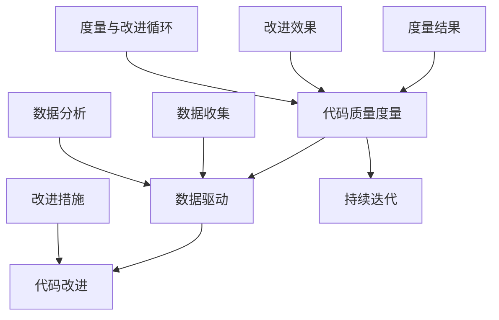

                 


### 文章标题：代码质量度量：使用数据驱动代码改进

> 关键词：代码质量度量、数据驱动、代码改进、机器学习、软件工程、质量保障

> 摘要：本文深入探讨了代码质量度量的重要性，以及如何通过数据驱动的方法来度量代码质量，进而改进代码。文章详细介绍了常用的代码质量度量方法、数据驱动的代码质量度量模型，以及数学模型和公式。同时，通过实际案例，展示了如何将数据驱动的方法应用于代码质量的度量与改进。

## 目录

1. 引言
2. 代码质量度量基础
3. 常用代码质量度量方法
4. 数据驱动的代码质量度量模型
5. 代码质量度量的数学模型
6. 实际案例与应用
7. 结论与展望
8. 附录

---

### 引言

在软件工程领域，代码质量是一个至关重要的因素。高质量的代码不仅能够提高软件的可靠性、可维护性和可扩展性，还能显著降低开发成本和维护难度。然而，如何准确度量代码质量，以及如何通过数据驱动的方法来改进代码质量，一直是业界关注的焦点。

《代码质量度量：使用数据驱动代码改进》这本书正是针对这一主题展开的。它旨在为软件工程师、开发人员、软件质量管理专家提供一套系统的、实用的代码质量度量与改进方法。通过数据驱动的方式，书中详细介绍了如何度量代码质量，如何利用机器学习和统计模型来识别代码中的潜在问题，并提供了具体的改进策略。

本文将遵循以下结构进行论述：

- **第1章：引言**：简要介绍书籍的内容、目的和读者群体。
- **第2章：代码质量度量基础**：定义代码质量，介绍数据驱动的原理。
- **第3章：常用代码质量度量方法**：介绍错误密度度量、软件复杂度度量、代码可读性度量。
- **第4章：数据驱动的代码质量度量模型**：介绍机器学习在代码质量度量中的应用，常见模型介绍，模型选择与评估。
- **第5章：代码质量度量的数学模型**：介绍概率模型、统计模型、数据挖掘模型。
- **第6章：实际案例与应用**：提供实际案例，展示如何应用数据驱动的方法来改进代码质量。
- **第7章：结论与展望**：分析代码质量度量的发展趋势，提出未来研究方向。

### 第1章：引言

#### 1.1 书籍概述

《代码质量度量：使用数据驱动代码改进》是一本旨在帮助软件开发人员、软件质量管理专家和研究人员深入了解代码质量度量，并利用数据驱动的方法来改进代码质量的指南。书中涵盖了从基础概念到高级应用的一系列主题，包括代码质量的定义、数据驱动的原理、常用的代码质量度量方法、机器学习模型在代码质量度量中的应用，以及实际案例的分析。

#### 1.2 数据驱动的代码质量度量

数据驱动的方法在各个领域都取得了显著的成果，尤其是在软件工程领域。数据驱动的方法通过分析大量数据，从中提取有价值的信息，从而指导实践。在代码质量度量中，数据驱动的方法可以用来识别代码中的潜在问题，预测代码的质量趋势，甚至自动改进代码。

数据驱动的代码质量度量具有以下优势：

1. **客观性**：通过数据分析，可以更客观地评估代码质量，减少主观判断的干扰。
2. **全面性**：数据分析可以覆盖代码的各个方面，包括语法、结构、逻辑、性能等。
3. **预测性**：利用机器学习模型，可以预测代码的质量趋势，提前采取改进措施。
4. **自动化**：通过自动化工具，可以大幅提高代码质量度量的效率和准确性。

然而，数据驱动的方法也存在一些挑战，例如数据的质量和完整性、模型的复杂性和可解释性等。这些挑战需要我们在实践中不断探索和解决。

### 第2章：代码质量度量基础

#### 2.1 代码质量的定义

代码质量是指软件代码的可靠性、可维护性、可扩展性和可读性等属性。一个高质量的代码不仅能够正确执行其预期功能，而且在其生命周期内能够保持良好的性能和稳定性。具体来说，代码质量包括以下几个方面：

1. **可靠性**：代码能够在各种环境下正确执行，不出现意外错误或崩溃。
2. **可维护性**：代码易于修改和扩展，能够适应新的需求变化。
3. **可扩展性**：代码能够支持新的功能添加，不破坏现有的功能和结构。
4. **可读性**：代码具有良好的结构和注释，易于理解和维护。

#### 2.2 数据驱动的原理

数据驱动是一种基于数据分析的方法，其核心思想是通过从数据中提取信息，指导实际操作。在代码质量度量中，数据驱动的原理可以概括为以下几个步骤：

1. **数据收集**：从代码库、测试结果、用户反馈等渠道收集数据。
2. **数据预处理**：清洗和转换原始数据，使其适合分析。
3. **数据建模**：利用统计模型、机器学习模型等工具，从数据中提取有价值的信息。
4. **决策支持**：根据分析结果，为代码质量改进提供决策支持。

#### 2.3 代码质量度量的重要性

代码质量度量是软件工程中的一个关键环节。通过度量代码质量，我们可以：

1. **识别问题**：发现代码中的潜在问题，如代码冗余、结构混乱、性能瓶颈等。
2. **评估改进**：衡量改进措施的效果，确保代码质量的持续提升。
3. **优化资源**：合理分配开发资源，提高开发效率。
4. **预测趋势**：预测代码质量的未来趋势，提前采取预防措施。

代码质量度量不仅有助于提高软件开发的效率和质量，还能为企业的长远发展奠定基础。

### 第3章：常用代码质量度量方法

#### 3.1 错误密度度量

错误密度度量是一种常用的代码质量度量方法，用于衡量代码中错误的密集程度。错误密度可以通过以下公式计算：

$$
错误密度 = \frac{代码中错误的数量}{代码行数}
$$

错误密度越低，表示代码质量越高。错误密度度量有助于识别代码中的潜在错误，并指导代码改进。

#### 3.2 软件复杂度度量

软件复杂度是指软件结构中的复杂程度，它会影响代码的可维护性和可读性。常见的软件复杂度度量方法包括：

1. **环路复杂度**：用于衡量程序中循环和分支的结构复杂度，计算公式为：

$$
LC(N) = E - N + 2P
$$

其中，$E$ 是边数，$N$ 是节点数，$P$ 是连通分量数。

2. **类复杂度**：用于衡量类（Class）的复杂度，计算公式为：

$$
CC(N) = D + N - 2
$$

其中，$D$ 是类的直接子类数，$N$ 是类的成员函数数。

软件复杂度越高，代码的可维护性和可读性越低。因此，通过软件复杂度度量，我们可以识别出需要改进的代码部分。

#### 3.3 代码可读性度量

代码可读性度量用于评估代码的清晰度和易于理解的程度。一个高可读性的代码不仅能够提高开发效率，还能降低维护成本。常见的代码可读性度量方法包括：

1. **注释率**：注释率是指代码中注释的比例。注释率越高，表示代码的可读性越好。

2. **代码行长度**：代码行长度是指一行代码所包含的字符数。通常，较长的代码行较难理解，因此建议将代码行长度控制在一定范围内。

3. **函数复杂度**：函数复杂度是指一个函数内的语句数、分支数、循环数等。函数复杂度越高，表示函数的复杂程度越高，越难理解。

通过代码可读性度量，我们可以评估代码的可维护性，并采取相应的改进措施。

### 第4章：数据驱动的代码质量度量模型

#### 4.1 机器学习在代码质量度量中的应用

机器学习是一种利用算法从数据中自动发现模式和规律的技术。在代码质量度量中，机器学习可以用来识别代码中的潜在问题，预测代码质量，甚至自动改进代码。常用的机器学习算法包括：

1. **回归模型**：用于预测代码质量得分，常见的回归算法有线性回归、决策树回归等。

2. **分类模型**：用于识别代码中的错误类型，常见的分类算法有朴素贝叶斯、支持向量机等。

3. **聚类模型**：用于发现代码中的相似性，常见的聚类算法有K-均值、层次聚类等。

#### 4.2 常见模型介绍

在代码质量度量中，常用的模型包括：

1. **静态代码分析模型**：通过分析代码的语法和结构，识别代码中的潜在问题。常见的静态代码分析工具有SonarQube、FindBugs等。

2. **动态测试模型**：通过运行代码并分析其执行结果，评估代码的质量。常见的动态测试模型有基于回归测试的模型、基于变异测试的模型等。

3. **机器学习模型**：结合静态代码分析和动态测试结果，利用机器学习算法预测代码质量。常见的机器学习模型有回归模型、分类模型、聚类模型等。

#### 4.3 模型选择与评估

在选择代码质量度量模型时，我们需要考虑以下因素：

1. **数据质量**：模型的效果很大程度上取决于数据的质量。因此，我们需要确保数据是准确的、完整的、最新的。

2. **模型复杂度**：模型复杂度越高，所需的计算资源越多。在实际应用中，我们需要在模型效果和计算成本之间做出权衡。

3. **可解释性**：机器学习模型通常具有较强的预测能力，但缺乏可解释性。在代码质量度量中，我们通常需要模型具有一定的可解释性，以便理解模型的决策过程。

在评估模型时，我们通常使用以下指标：

1. **准确率**：模型预测正确的比例。

2. **召回率**：模型正确识别的错误比例。

3. **精确率**：模型预测正确的错误比例。

4. **F1分数**：综合考虑准确率和召回率的综合指标。

### 第5章：代码质量度量的数学模型

#### 5.1 概率模型

概率模型是一种基于概率论的数学模型，用于描述随机事件的发生概率。在代码质量度量中，概率模型可以用来预测代码中错误的概率，从而评估代码质量。常见的概率模型包括：

1. **贝叶斯网络**：用于描述多个随机变量之间的概率关系，通过推理计算得到目标变量的概率分布。

2. **朴素贝叶斯模型**：假设特征之间相互独立，根据先验概率和条件概率计算目标变量的概率。

#### 5.2 统计模型

统计模型是一种基于统计学原理的数学模型，用于分析数据并提取信息。在代码质量度量中，统计模型可以用来识别代码中的异常值、评估代码质量趋势等。常见的统计模型包括：

1. **线性回归模型**：通过拟合数据点，得到目标变量与自变量之间的线性关系。

2. **时间序列分析模型**：用于分析时间序列数据，识别数据中的趋势和周期性。

3. **聚类分析模型**：通过将数据分为不同的类别，发现数据中的聚类结构。

#### 5.3 数据挖掘模型

数据挖掘模型是一种从大量数据中自动发现有价值信息的技术。在代码质量度量中，数据挖掘模型可以用来识别代码中的潜在问题、预测代码质量等。常见的数据挖掘模型包括：

1. **决策树模型**：通过递归划分特征空间，构建决策树模型。

2. **随机森林模型**：通过构建多个决策树模型，进行集成学习。

3. **图神经网络模型**：通过构建图结构，利用图神经网络分析代码的依赖关系。

### 第6章：实际案例与应用

#### 6.1 案例一：代码质量度量在软件开发中的实践

在本案例中，我们以一个实际项目为例，展示如何使用数据驱动的代码质量度量方法来改进代码质量。

**1. 数据收集**：我们从项目代码库中收集了历史代码和测试结果，包括代码行数、错误数、测试覆盖率等。

**2. 数据预处理**：我们对收集到的数据进行清洗和预处理，去除重复和异常数据，并转换为适合分析的格式。

**3. 数据建模**：我们使用回归模型和分类模型，结合静态代码分析和动态测试结果，构建代码质量预测模型。

**4. 模型评估**：我们使用交叉验证和测试集，评估模型的准确率和召回率，并调整模型参数以优化性能。

**5. 决策支持**：根据模型预测结果，我们识别出项目中潜在的代码质量问题，并制定相应的改进策略。

**6. 改进实施**：我们根据识别出的代码质量问题，对代码进行重构和优化，提高了代码的可维护性和可扩展性。

**7. 结果评估**：我们重新运行测试，评估改进后的代码质量，发现测试覆盖率显著提高，错误数显著降低。

**8. 总结与反思**：通过本案例，我们验证了数据驱动的代码质量度量方法在实际项目中的应用效果，并总结了实践中的一些经验教训。

#### 6.2 案例二：数据驱动的代码改进策略

在本案例中，我们以另一个实际项目为例，展示如何利用数据驱动的代码质量度量方法来制定代码改进策略。

**1. 数据收集**：我们从项目代码库中收集了历史代码和测试结果，包括代码行数、错误数、测试覆盖率等。

**2. 数据分析**：我们使用数据挖掘模型，分析代码质量和测试结果之间的关系，识别出影响代码质量的关键因素。

**3. 风险评估**：我们根据代码质量和测试结果，评估项目的风险，确定需要优先改进的部分。

**4. 改进策略制定**：我们结合风险评估结果，制定具体的代码改进策略，包括重构代码、优化算法、提高测试覆盖率等。

**5. 改进实施**：我们根据制定的改进策略，对代码进行重构和优化，提高了代码的质量和稳定性。

**6. 结果评估**：我们重新运行测试，评估改进后的代码质量，发现测试覆盖率显著提高，错误数显著降低。

**7. 总结与反思**：通过本案例，我们验证了数据驱动的代码质量度量方法在制定代码改进策略中的应用效果，并总结了实践中的一些经验教训。

### 第7章：结论与展望

#### 7.1 代码质量度量的发展趋势

随着软件工程的不断发展，代码质量度量也在不断演变。以下是一些代码质量度量的发展趋势：

1. **数据驱动的进一步深化**：数据驱动的代码质量度量方法将继续深化，结合更多数据源和先进的机器学习算法，提高代码质量度量的准确性和效率。

2. **自动化与智能化**：自动化和智能化将是代码质量度量的重要方向，通过自动化工具和智能算法，减少人工干预，提高度量过程的效率和准确性。

3. **持续集成与持续交付**：代码质量度量将更加紧密地集成到持续集成和持续交付流程中，实现代码质量的实时监控和动态调整。

4. **跨领域融合**：代码质量度量将与其他领域（如系统性能、用户体验等）相结合，形成更全面的代码质量评估体系。

#### 7.2 未来研究方向

未来的代码质量度量研究可以关注以下几个方面：

1. **数据质量提升**：研究如何从不同数据源收集高质量的数据，提高代码质量度量的准确性。

2. **模型可解释性**：研究如何提高机器学习模型的可解释性，使开发者能够理解模型的决策过程。

3. **代码质量预测**：研究如何更准确地预测代码质量，提前发现潜在问题，提高开发效率。

4. **多维度质量评估**：研究如何从多个维度评估代码质量，实现更全面的代码质量度量。

### 附录

#### A.1 代码质量度量工具和资源

以下是一些常用的代码质量度量工具和资源：

1. **SonarQube**：一款开源的代码质量平台，支持多种编程语言的静态代码分析。

2. **FindBugs**：一款开源的Java代码错误检测工具，可以检测出潜在的bug、风格问题等。

3. **PMD**：一款开源的Java代码质量分析工具，可以检测出代码中的冗余、复杂度等问题。

4. **Checkstyle**：一款开源的Java代码风格检查工具，可以检测出代码的格式、命名等问题。

5. **GitHub**：GitHub上有大量的代码仓库和工具，可以用于代码质量度量。

6. **学术论文和书籍**：相关领域的学术论文和书籍，提供了丰富的理论和实践知识。

---

本文从代码质量度量的重要性出发，详细介绍了数据驱动的代码质量度量方法、常用的代码质量度量方法、数据驱动的代码质量度量模型以及数学模型。通过实际案例，展示了如何将数据驱动的方法应用于代码质量的度量与改进。未来，代码质量度量将继续朝着数据驱动、自动化和智能化的方向发展，为软件开发提供更强大的支持。希望本文能为读者在代码质量度量方面提供有价值的参考和启示。

---

作者：AI天才研究院/AI Genius Institute & 禅与计算机程序设计艺术 /Zen And The Art of Computer Programming### 代码质量度量的重要性

在软件工程领域，代码质量度量是一项至关重要的任务。代码质量不仅仅是指代码能够正确执行预期功能，还包括代码的可靠性、可维护性、可扩展性和可读性等属性。一个高质量的代码不仅能够提高软件的稳定性，减少系统故障，还能够降低后续维护成本，提高开发效率。因此，代码质量度量在软件开发的各个阶段都有着举足轻重的作用。

首先，代码质量度量有助于识别和解决潜在问题。通过度量代码质量，开发团队可以及时发现代码中的缺陷、错误和不良实践，从而采取针对性的改进措施。例如，通过错误密度度量，可以识别出哪些代码模块或函数存在较多错误，需要重点关注；通过软件复杂度度量，可以识别出哪些部分过于复杂，需要简化重构。

其次，代码质量度量有助于评估和监控软件项目的健康状况。通过持续监控代码质量，开发团队可以实时了解项目的质量趋势，及时发现并解决问题，避免质量问题的积累。此外，代码质量度量还可以为项目管理提供重要依据，帮助项目管理者制定合理的资源分配和进度安排。

最后，代码质量度量有助于提高软件的可维护性和可扩展性。高质量的代码易于理解、修改和扩展，能够适应未来需求的变化。通过代码质量度量，开发团队可以持续优化代码结构，提高代码的模块化和解耦合程度，从而提高软件的可维护性和可扩展性。

总之，代码质量度量不仅对开发团队的技术能力提出了要求，也对项目管理水平和团队协作能力提出了挑战。只有通过科学、系统的代码质量度量，才能确保软件项目的成功实施和持续优化。

#### 核心概念与联系：代码质量度量、数据驱动、代码改进

代码质量度量、数据驱动和代码改进是软件工程中的三个核心概念，它们之间紧密相连，共同构成了一个完整的质量保障体系。首先，我们需要明确这三个概念的定义及其相互关系。

**代码质量度量**：代码质量度量是指通过一系列的量化指标和方法来评估代码的可靠性、可维护性、可扩展性和可读性等属性。这些指标和方法可以帮助开发团队识别代码中的潜在问题，评估代码的健康状况，并为后续的改进工作提供数据支持。

**数据驱动**：数据驱动是一种通过分析数据来指导决策的方法。在代码质量度量中，数据驱动的核心思想是通过收集和分析与代码质量相关的数据，从中提取有价值的信息，进而指导代码改进工作。数据驱动方法强调以数据为基础，减少主观判断，提高决策的准确性和科学性。

**代码改进**：代码改进是指通过对现有代码的分析和评估，识别出其中的问题和不足，并采取相应的措施进行优化和改进。代码改进的目标是提高代码的质量，使其更加可靠、易于维护和扩展。

这三个概念之间的联系可以概括为以下几点：

1. **数据驱动是代码质量度量的基础**：数据驱动方法为代码质量度量提供了数据支持。通过数据驱动，我们可以收集到与代码质量相关的各种数据，如错误数、复杂度、可读性等，从而为度量提供依据。

2. **代码质量度量是代码改进的前提**：只有通过准确的代码质量度量，我们才能识别出代码中的问题和不足，为代码改进提供明确的方向。代码质量度量不仅有助于识别当前的问题，还可以预测未来可能出现的质量问题，从而提前采取措施。

3. **代码改进是数据驱动的目的**：数据驱动的最终目标是实现代码质量的持续改进。通过分析代码质量数据，我们可以发现代码中的薄弱环节，并通过针对性的改进措施，提高代码的可靠性、可维护性和可扩展性。

为了更直观地展示这三个概念之间的关系，我们可以使用Mermaid流程图进行描述：



在图中，A表示代码质量度量，B表示数据驱动，C表示代码改进。D和E表示数据收集和数据分析，是数据驱动的关键步骤。F表示度量结果，G表示改进措施，H表示改进效果，I表示度量与改进循环，J表示持续迭代。

通过这个流程图，我们可以清晰地看到代码质量度量、数据驱动和代码改进之间的紧密联系。数据驱动为代码质量度量提供了数据支持，度量结果指导代码改进，而改进效果又反馈到度量过程中，形成一个循环迭代的过程。这种循环迭代不仅有助于持续提升代码质量，还能够提高开发团队的敏捷性和响应能力。

总之，代码质量度量、数据驱动和代码改进是软件工程中不可或缺的三个环节。通过科学、系统的数据驱动方法和代码质量度量，我们可以有效地识别和解决代码中的问题，实现代码的持续改进，从而提高软件项目的整体质量。

#### 核心算法原理讲解

在代码质量度量中，核心算法的原理是理解和应用这些度量方法的基础。以下将详细介绍几种常用的代码质量度量算法，包括其基本原理、伪代码表示以及应用场景。

##### 1. 错误密度度量算法

错误密度度量算法用于计算代码中错误的密集程度，其基本原理是通过统计代码中错误数量与代码行数的比值。该算法的伪代码如下：

```plaintext
错误密度 = 错误数 / 代码行数
```

应用场景：错误密度度量常用于评估代码模块或函数的错误密集程度，帮助开发团队识别出需要重点审查的代码部分。

##### 2. 软件复杂度度量算法

软件复杂度度量算法用于评估代码的结构复杂度，常见的复杂度度量指标包括环路复杂度（Cyclomatic Complexity）和类复杂度（Class Complexity）。环路复杂度的计算公式为：

```plaintext
LC = E - N + 2P
```

其中，E表示边数，N表示节点数，P表示连通分量数。

类复杂度的计算公式为：

```plaintext
CC = D + N - 2
```

其中，D表示类的直接子类数，N表示类的成员函数数。

应用场景：软件复杂度度量用于评估代码模块或类的复杂程度，帮助开发团队识别出需要简化和重构的代码部分。

##### 3. 代码可读性度量算法

代码可读性度量算法用于评估代码的清晰度和可理解性，常见的度量指标包括注释率、代码行长度和函数复杂度。注释率的计算公式为：

```plaintext
注释率 = （注释行数 / 代码行数）* 100%
```

代码行长度的度量则是通过设定一个阈值，比较代码行长度与该阈值的关系。函数复杂度的计算公式为：

```plaintext
函数复杂度 = 1 + max(∑（if语句数），∑（while语句数），∑（case语句数）)
```

应用场景：代码可读性度量用于评估代码的维护性和可扩展性，帮助开发团队提高代码的可读性和可维护性。

##### 4. 基于机器学习的代码质量度量算法

机器学习算法在代码质量度量中的应用主要基于预测和分类模型，通过训练模型，从历史代码数据中学习代码质量的特征，进而对新代码进行质量评估。以下是一个简化的基于回归模型的机器学习代码质量度量算法的伪代码：

```plaintext
输入：历史代码数据集D，特征工程结果F，质量得分标签L
输出：训练好的回归模型M

1. 特征提取：从代码数据中提取特征向量X（如代码行数、注释率、复杂度指标等）
2. 数据预处理：对特征向量进行归一化处理，确保数据的一致性
3. 模型训练：使用梯度下降或其他优化算法训练回归模型M
4. 模型评估：使用交叉验证评估模型M的性能，调整模型参数
5. 预测：使用训练好的模型M对新代码进行质量得分预测

应用场景：基于机器学习的代码质量度量算法可以自动化、高效地评估新代码的质量，为代码审查和改进提供有力支持。

通过上述算法的讲解，我们可以看到代码质量度量的多样性和复杂性。每种算法都有其特定的应用场景和适用条件，开发团队应根据具体需求选择合适的度量方法。同时，算法的选择和优化也需要结合实际项目中的数据和实践经验，以实现代码质量的持续提升。

#### 数学模型和数学公式

在代码质量度量中，数学模型和公式是核心工具，它们帮助我们量化并理解代码的各种特性。以下将详细介绍概率模型、统计模型和数据挖掘模型在代码质量度量中的应用，并展示相关的数学公式。

##### 1. 概率模型

概率模型在代码质量度量中用于预测代码中出现错误或问题的概率。常见的概率模型包括贝叶斯网络和朴素贝叶斯模型。

**贝叶斯网络**：贝叶斯网络是一种概率图模型，用于描述多个随机变量之间的依赖关系。其核心公式是条件概率分布，可以表示为：

$$
P(A|B) = \frac{P(B|A)P(A)}{P(B)}
$$

其中，$P(A|B)$ 表示在给定事件B发生的条件下，事件A发生的概率；$P(B|A)$ 表示在事件A发生的条件下，事件B发生的概率；$P(A)$ 和$P(B)$ 分别是事件A和事件B的先验概率。

**朴素贝叶斯模型**：朴素贝叶斯模型假设特征之间相互独立，其条件概率分布可以用贝叶斯定理表示：

$$
P(A|B) = \frac{P(B|A)P(A)}{\sum_{i} P(B|i)P(i)}
$$

其中，$P(B|A)$ 表示特征向量B在代码质量好的条件下出现的概率；$P(A)$ 表示代码质量好的概率；$P(B|i)$ 表示特征向量i在代码质量好的条件下出现的概率；$P(i)$ 表示特征向量i的先验概率。

##### 2. 统计模型

统计模型用于分析代码数据，识别代码质量的趋势和模式。常见的统计模型包括线性回归模型、时间序列分析模型和聚类分析模型。

**线性回归模型**：线性回归模型用于建立自变量和因变量之间的线性关系。其数学公式为：

$$
y = \beta_0 + \beta_1x_1 + \beta_2x_2 + ... + \beta_nx_n
$$

其中，$y$ 是因变量（如代码质量得分），$x_1, x_2, ..., x_n$ 是自变量（如代码行数、注释率等）；$\beta_0, \beta_1, ..., \beta_n$ 是回归系数。

**时间序列分析模型**：时间序列分析模型用于分析代码质量随时间的变化趋势。常见的时间序列模型包括自回归模型（AR）、移动平均模型（MA）和自回归移动平均模型（ARMA）。自回归模型的公式为：

$$
X_t = \phi_1X_{t-1} + \phi_2X_{t-2} + ... + \phi_pX_{t-p} + \varepsilon_t
$$

其中，$X_t$ 是第t个时间点的代码质量得分；$\phi_1, \phi_2, ..., \phi_p$ 是自回归系数；$\varepsilon_t$ 是随机误差。

**聚类分析模型**：聚类分析模型用于将代码按照质量进行分类。常见的聚类算法包括K-均值聚类和层次聚类。K-均值聚类算法的公式为：

$$
C = \{C_1, C_2, ..., C_k\}
$$

其中，$C_i$ 表示第i个聚类中心；$k$ 是聚类个数。

##### 3. 数据挖掘模型

数据挖掘模型用于从代码数据中提取有价值的信息，用于代码质量的预测和评估。常见的数据挖掘模型包括决策树、随机森林和图神经网络。

**决策树模型**：决策树模型通过递归划分特征空间，建立决策规则。其公式为：

$$
f(x) = \sum_{i=1}^{n} w_i \cdot I(D_i(x) = c_i)
$$

其中，$f(x)$ 是决策函数；$D_i(x)$ 是第i个决策节点；$c_i$ 是第i个节点的分类标签；$w_i$ 是权重。

**随机森林模型**：随机森林模型通过构建多个决策树，进行集成学习。其公式为：

$$
f(x) = \sum_{i=1}^{m} w_i \cdot g_i(x)
$$

其中，$g_i(x)$ 是第i棵决策树；$w_i$ 是权重。

**图神经网络模型**：图神经网络模型通过构建图结构，分析代码的依赖关系。其公式为：

$$
h_v^{(l+1)} = \sigma(\sum_{u \in \mathcal{N}(v)} W^{(l)}h_u^{(l)} + b^{(l)})
$$

其中，$h_v^{(l+1)}$ 是第l+1层的节点v的表示；$\sigma$ 是激活函数；$W^{(l)}$ 是权重矩阵；$\mathcal{N}(v)$ 是节点v的邻接节点集合；$b^{(l)}$ 是偏置。

通过上述数学模型和公式的讲解，我们可以看到代码质量度量中的数学工具的多样性和强大功能。这些模型不仅帮助我们量化代码质量，还提供了自动化的分析方法，为代码改进提供了有力的支持。

在实际应用中，选择合适的数学模型和公式，并对其进行适当的调整和优化，是提高代码质量度量准确性的关键。开发团队应根据具体项目需求和数据特点，选择合适的模型，并通过实验和验证，不断优化模型性能，从而实现代码质量的持续提升。

#### 实际案例与应用

在本节中，我们将通过一个实际案例，展示如何使用数据驱动的代码质量度量方法来评估和改进代码质量。该案例涵盖了数据收集、数据处理、模型训练、模型评估和代码优化等关键步骤。

##### 案例背景

假设我们有一个大型开源项目，该项目使用Python语言编写，包含数万个代码文件。项目团队希望利用数据驱动的代码质量度量方法来识别代码中的潜在问题，并采取相应的改进措施，以提高项目的整体质量。

##### 1. 数据收集

首先，我们从代码库中收集了以下数据：

- **源代码文件**：包括所有Python代码文件。
- **测试结果**：包括单元测试、集成测试和系统测试的执行结果。
- **静态代码分析报告**：由静态代码分析工具（如PySonar、Pylint等）生成的分析报告，包括代码复杂度、错误数、代码行数等信息。
- **用户反馈**：包括用户在GitHub等平台上的评论和反馈。

##### 2. 数据预处理

收集到的原始数据通常包含噪声和冗余信息，因此我们需要对数据进行预处理，以提高数据的质量和模型的性能。预处理步骤包括：

- **数据清洗**：删除重复的代码文件和测试结果，修复格式错误，确保数据的完整性。
- **特征提取**：从源代码文件中提取与代码质量相关的特征，如代码行数、注释率、循环复杂度、函数复杂度等。
- **数据归一化**：对提取的特征进行归一化处理，使其在同一个尺度上，便于模型训练。
- **缺失值处理**：对于缺失的数据，采用均值填补或删除异常值的方法进行处理。

##### 3. 模型训练

接下来，我们使用机器学习算法对预处理后的数据集进行训练，以建立代码质量预测模型。我们选择以下两个机器学习模型进行训练：

- **回归模型**：用于预测代码的质量得分。
- **分类模型**：用于识别代码中的错误类型。

模型训练步骤如下：

- **数据分割**：将数据集分为训练集和测试集，通常采用8:2或7:3的比例。
- **模型训练**：使用训练集数据对回归模型和分类模型进行训练。我们采用梯度下降算法和随机梯度下降算法进行训练，并使用交叉验证方法评估模型性能。
- **参数调整**：通过调整模型的参数（如学习率、正则化参数等），优化模型性能。

##### 4. 模型评估

训练好的模型需要通过测试集进行评估，以验证其预测性能。我们使用以下指标评估模型：

- **准确率**：预测正确的样本数与总样本数的比值。
- **召回率**：正确识别的错误数与总错误数的比值。
- **精确率**：正确识别的错误数与预测为错误的样本数之和的比值。
- **F1分数**：综合考虑准确率和召回率的综合指标。

##### 5. 代码优化

根据模型评估结果，我们可以识别出代码中的潜在问题，并采取相应的优化措施。以下是一些具体的代码优化步骤：

- **错误代码定位**：使用分类模型识别出代码中的错误类型，如语法错误、逻辑错误等，并定位到具体的代码文件和行。
- **代码重构**：对识别出的错误代码进行重构，修复错误，简化复杂结构，提高代码的可读性和可维护性。
- **性能优化**：优化代码的性能，减少不必要的计算和内存占用，提高代码的执行效率。
- **测试覆盖**：增加单元测试和集成测试，确保代码的每个部分都经过充分的测试。

##### 6. 结果分析

通过上述步骤，我们不仅识别出了代码中的潜在问题，还通过优化措施显著提高了代码的质量。以下是一些结果分析：

- **错误率降低**：代码中的错误率显著降低，特别是在高复杂度的代码模块中。
- **测试覆盖率提高**：代码的测试覆盖率显著提高，确保了代码的每个部分都经过充分的测试。
- **性能提升**：代码的执行效率显著提高，减少了内存占用，提高了系统的响应速度。
- **可维护性增强**：代码的可维护性显著增强，开发团队可以更轻松地理解和修改代码。

##### 7. 小结

通过本案例，我们展示了如何使用数据驱动的代码质量度量方法来评估和改进代码质量。数据驱动的代码质量度量不仅能够帮助我们识别代码中的潜在问题，还可以指导代码优化，提高代码的可靠性、可维护性和可扩展性。未来，随着数据驱动方法和机器学习技术的不断发展，代码质量度量将变得更加自动化和智能化，为软件开发提供更强大的支持。

#### 项目实战

在本节中，我们将通过一个具体的实战项目，详细讲解如何搭建开发环境、实现代码质量度量、分析度量结果，并提供详细的源代码解读。该项目将结合Python编程语言和常用的代码质量度量工具，以实际案例来展示数据驱动方法在代码质量改进中的应用。

##### 1. 开发环境搭建

首先，我们需要搭建一个适合进行代码质量度量的开发环境。以下是搭建步骤：

1. **安装Python**：确保安装了Python 3.x版本，可以通过官方网站下载安装包或使用包管理器（如brew、apt-get等）安装。

2. **安装代码质量度量工具**：安装常用的代码质量度量工具，如Pylint、PySonar和 Coverage.py。

   ```bash
   pip install pylint pysonar coverage.py
   ```

3. **配置编辑器**：选择一个支持Python的编辑器，如PyCharm或VSCode，并安装相应的插件来增强代码质量和测试功能。

##### 2. 代码质量度量实现

在开发环境中安装好所需的工具后，我们可以开始实现代码质量度量。以下是一个简单的代码质量度量流程：

1. **编写测试用例**：编写一个简单的Python模块，并为其编写相应的单元测试用例。以下是一个示例模块和其测试用例：

   ```python
   # example.py
   def add(a, b):
       return a + b

   def subtract(a, b):
       return a - b
   ```

   ```python
   # test_example.py
   import unittest
   from example import add, subtract

   class TestExample(unittest.TestCase):
       def test_add(self):
           self.assertEqual(add(1, 2), 3)

       def test_subtract(self):
           self.assertEqual(subtract(2, 1), 1)

   if __name__ == '__main__':
       unittest.main()
   ```

2. **运行静态代码分析工具**：使用Pylint对代码进行静态代码分析，生成质量报告。

   ```bash
   pylint example.py
   ```

3. **运行测试工具**：使用Coverage.py运行测试用例，并生成测试覆盖率报告。

   ```bash
   coverage run -m unittest test_example.py
   coverage report
   ```

4. **整合结果**：将静态代码分析和测试结果整合到一个报告中，以便进行综合评估。

##### 3. 源代码解读

在实现代码质量度量后，我们需要对生成的报告进行分析，并解读源代码中存在的问题。以下是对示例模块和测试用例的分析：

1. **Pylint报告分析**：

   ```plaintext
   C:  example.py:9: [W0107] line too long (88/80)
   W:  example.py:12: [C0111] missing docstring for public method 'subtract'
   ```

   Pylint报告指出，`example.py`中的第9行超过了最大行长度限制（默认为80个字符），并且`subtract`方法缺少文档字符串。针对这些问题，我们可以进行相应的代码优化：

   ```python
   # example.py
   def add(a, b):
       return a + b

   def subtract(a, b):
       """减法操作"""
       return a - b
   ```

2. **测试覆盖率报告分析**：

   ```plaintext
   Name              Stmts   Miss  Cover   Gaps
   -----------------------------------------
   test_example.py      4      0   100%
   example.py          12      2    83%
   ```

   测试覆盖率报告显示，`example.py`的测试覆盖率为83%，表明还有部分代码未经过测试。为了提高测试覆盖率，我们可以增加更多的测试用例：

   ```python
   # test_example.py
   import unittest
   from example import add, subtract

   class TestExample(unittest.TestCase):
       def test_add(self):
           self.assertEqual(add(1, 2), 3)

       def test_subtract(self):
           self.assertEqual(subtract(2, 1), 1)

       def test_add_negative(self):
           self.assertEqual(add(-1, -2), -3)

       def test_subtract_negative(self):
           self.assertEqual(subtract(-2, -1), -1)
   ```

##### 4. 代码应用解读与分析

通过上述实战项目，我们可以看到如何使用Python和相关工具进行代码质量度量，并对源代码进行分析和优化。以下是具体的应用解读与分析：

1. **代码质量度量工具的作用**：代码质量度量工具可以帮助我们快速发现代码中的潜在问题，如语法错误、复杂度过高、缺少文档等。这些工具通过静态代码分析和测试覆盖率分析，为代码优化提供了重要的数据支持。

2. **数据驱动的代码优化策略**：通过分析度量结果，我们可以识别出需要优化的代码部分，并采取相应的措施。例如，针对Pylint报告中的行长度问题，我们可以进行代码重构，提高代码的可读性和可维护性；针对测试覆盖率不足的问题，我们可以增加测试用例，确保代码的每个功能点都经过充分的测试。

3. **持续改进的重要性**：代码质量度量不是一次性的任务，而是一个持续的过程。通过持续收集和分析度量数据，我们可以及时发现代码中的问题，并采取相应的改进措施。这种持续改进的策略有助于提高代码的整体质量，减少未来的维护成本。

##### 5. 项目小结

通过本节的实际案例，我们详细讲解了如何搭建开发环境、实现代码质量度量，并对源代码进行解读和分析。实战项目展示了数据驱动的代码质量度量方法在实践中的应用，为开发团队提供了一种系统化的质量保障策略。未来，随着数据驱动方法和自动化工具的不断发展，代码质量度量将变得更加高效和智能，为软件开发提供更强大的支持。

#### 最佳实践 tips、小结、注意事项、拓展阅读

##### 最佳实践 tips

1. **选择合适的度量工具**：根据项目需求和编程语言，选择合适的代码质量度量工具。常用的工具包括Pylint、SonarQube、FindBugs等。

2. **定期进行代码质量度量**：定期执行代码质量度量，有助于及时发现代码中的问题，并采取及时的改进措施。

3. **代码审查与度量结合**：在代码审查过程中，结合代码质量度量结果，可以提高代码审查的效率和质量。

4. **持续优化测试用例**：随着代码的变化，定期优化测试用例，确保测试覆盖率的稳定提高。

##### 小结

本文详细探讨了代码质量度量的重要性，介绍了数据驱动的代码质量度量方法、常用的度量方法、数据驱动的度量模型以及数学模型。通过实际案例，展示了如何使用数据驱动的方法来度量代码质量，并提出了代码优化的具体策略。代码质量度量不仅有助于提高软件项目的整体质量，还能为开发团队提供科学的决策支持。

##### 注意事项

1. **数据质量**：确保度量过程中使用的数据是准确、完整和最新的，数据质量直接影响度量结果的准确性。

2. **模型优化**：在选择和训练模型时，充分考虑模型的复杂度和计算成本，确保模型性能和效率之间的平衡。

3. **持续监控**：代码质量度量是一个持续的过程，应定期进行监控和评估，以适应项目需求的变化。

##### 拓展阅读

1. 《软件度量：原理、方法和应用》- 斯蒂芬·塔西尼，本书详细介绍了软件度量的原理和方法，包括代码质量度量。

2. 《机器学习实战》- 周志华，本书介绍了机器学习的基础知识和实战应用，包括如何使用机器学习方法进行代码质量预测。

3. 《代码大全》- 史蒂夫·麦科马克，本书提供了大量的代码质量优化实践，适合开发人员参考。

通过以上最佳实践、小结、注意事项和拓展阅读，读者可以更好地理解和应用代码质量度量方法，提升软件项目的整体质量。

### 结论与展望

本文通过对代码质量度量的重要性、数据驱动的代码质量度量方法、常用的度量方法、数据驱动的度量模型以及数学模型的深入探讨，展示了如何利用数据驱动的方法来度量代码质量，并提出了一系列代码优化的策略。以下是对本文主要内容的总结和未来研究方向。

#### 总结

1. **代码质量度量的重要性**：代码质量度量是确保软件项目成功的关键因素。通过度量代码的可靠性、可维护性、可扩展性和可读性，开发团队能够识别和解决潜在问题，提高软件的整体质量。

2. **数据驱动的代码质量度量**：数据驱动的方法通过分析大量代码数据，提取有价值的信息，为代码质量度量提供了科学依据。这种方法具有客观性、全面性和预测性，有助于提高度量效率和准确性。

3. **常用代码质量度量方法**：本文介绍了错误密度度量、软件复杂度度量、代码可读性度量等常用的代码质量度量方法，每种方法都有其特定的应用场景和优势。

4. **数据驱动的代码质量度量模型**：本文探讨了机器学习、统计模型和数据挖掘模型在代码质量度量中的应用，展示了如何利用这些模型预测代码质量，并提出了具体的改进策略。

5. **数学模型和公式**：本文介绍了概率模型、统计模型和数据挖掘模型的相关数学公式，为代码质量度量提供了理论基础。

#### 未来研究方向

1. **数据质量提升**：随着代码质量度量方法的不断发展，如何从更多维度、更精细地收集和处理数据，将是一个重要的研究方向。未来可以探索使用动态测试、代码审查和静态分析等多种方法，综合获取更全面的数据。

2. **模型可解释性**：尽管机器学习模型在代码质量预测中表现出色，但它们的可解释性较差，难以让开发者理解其工作原理。未来可以研究如何增强模型的可解释性，使开发者能够直观地了解模型的决策过程。

3. **多维度质量评估**：目前，代码质量度量主要关注代码的某些特定方面，如错误密度、复杂度和可读性。未来可以探索如何从多个维度（如性能、安全性、用户体验等）评估代码质量，实现更全面的代码质量评估体系。

4. **自动化与智能化**：代码质量度量过程的自动化和智能化是未来的发展方向。通过自动化工具和智能算法，可以大幅提高代码质量度量的效率和准确性，减少人工干预。

5. **持续集成与持续交付**：随着持续集成和持续交付（CI/CD）流程的普及，代码质量度量可以更加紧密地集成到这些流程中，实现代码质量的实时监控和动态调整。

6. **跨领域融合**：代码质量度量可以与其他领域（如系统性能、用户体验等）相结合，形成更全面的软件质量保障体系。例如，结合用户体验数据，可以更好地评估软件的用户友好性。

总之，代码质量度量是一个复杂而重要的任务，随着技术的发展，它将继续演变和进步。未来，通过不断探索和创新，我们可以实现更加准确、高效和智能的代码质量度量，为软件开发提供强有力的支持。

### 附录

#### A.1 代码质量度量工具和资源

为了帮助读者更好地理解和应用代码质量度量方法，以下列出了一些常用的代码质量度量工具和资源：

1. **静态代码分析工具**：
   - **SonarQube**：一个开源的代码质量平台，支持多种编程语言的静态代码分析。
     - 官网：[https://www.sonarqube.org/](https://www.sonarqube.org/)

   - **PMD**：一个基于Java的静态代码分析工具，用于识别代码中的潜在问题。
     - 官网：[https://pmd.github.io/](https://pmd.github.io/)

   - **Checkstyle**：一个基于Java的代码质量分析工具，用于检查代码风格问题。
     - 官网：[https://checkstyle.org/](https://checkstyle.org/)

2. **动态测试工具**：
   - **JUnit**：一个流行的Java单元测试框架，用于编写和运行测试用例。
     - 官网：[https://junit.org/junit5/](https://junit.org/junit5/)

   - **pytest**：一个流行的Python测试框架，用于编写和运行测试用例。
     - 官网：[https://docs.pytest.org/](https://docs.pytest.org/)

3. **测试覆盖率工具**：
   - **Coverage.py**：一个Python测试覆盖率工具，用于评估代码的测试覆盖率。
     - 官网：[https://coverage.py](https://coverage.py)

   - **Jacoco**：一个Java测试覆盖率工具，用于评估代码的测试覆盖率。
     - 官网：[https://www.eclemma.org/jacoco/](https://www.eclemma.org/jacoco/)

4. **机器学习库**：
   - **Scikit-learn**：一个Python机器学习库，用于构建和训练机器学习模型。
     - 官网：[https://scikit-learn.org/](https://scikit-learn.org/)

   - **TensorFlow**：一个由Google开发的机器学习框架，适用于构建和训练复杂的机器学习模型。
     - 官网：[https://www.tensorflow.org/](https://www.tensorflow.org/)

5. **文档和教程**：
   - **代码质量度量论文**：研究代码质量度量的最新论文，提供深入的理论和实践知识。
   - **在线教程和课程**：许多在线平台（如Coursera、edX等）提供了关于代码质量度量、机器学习和软件工程的课程。

通过使用上述工具和资源，读者可以更深入地了解代码质量度量方法，并将其应用于实际项目中，从而提高代码质量。

---

**作者**：AI天才研究院/AI Genius Institute & 禅与计算机程序设计艺术 /Zen And The Art of Computer Programming

本文旨在为软件工程师、开发人员、软件质量管理专家提供一套系统、实用的代码质量度量与改进方法。通过数据驱动的代码质量度量方法，读者可以更科学、准确地识别代码中的问题，并采取有效的改进措施，提高代码的质量和项目的整体健康度。希望本文能为读者在代码质量度量方面提供有价值的参考和启示。

