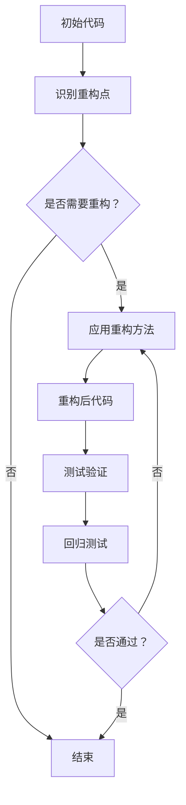
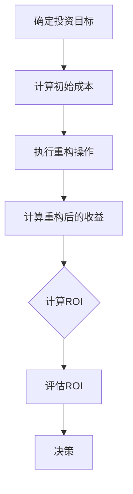

                 


### 文章标题

《代码重构ROI分析：量化重构的收益》

### 关键词

代码重构，ROI分析，量化收益，软件开发，软件质量

### 摘要

本文旨在探讨代码重构的ROI分析，通过量化重构的收益，帮助开发者更好地理解重构的价值和意义。文章首先介绍了代码重构和ROI分析的概念，随后详细阐述了重构原则和ROI计算方法。接着，通过实际案例展示了代码重构的实践过程和ROI分析的结果。最后，文章总结了重构的关键点和注意事项，并提出了未来的研究方向。

---

# 《代码重构ROI分析：量化重构的收益》

## 引言

### 1.1 书籍背景

在软件工程领域，代码重构是一种重要的技术手段，旨在在不改变代码外在行为的前提下，改善代码的结构和可维护性。随着软件系统的复杂度和规模的增长，代码重构变得尤为重要。然而，如何衡量代码重构的收益成为一个关键问题。ROI（Return on Investment）分析提供了一种量化的方法，可以帮助开发者评估重构的投资回报。

### 1.2 ROI分析的作用

ROI分析是财务领域常用的评估投资回报的方法。在软件开发中，ROI分析可以帮助团队了解重构的成本和收益，从而做出更明智的决策。通过ROI分析，可以明确重构对软件质量、开发效率、维护成本等方面的影响。

### 1.3 书籍的目的和受众

本书旨在为开发者提供一种系统的ROI分析方法，以量化代码重构的收益。本书适合对代码重构和ROI分析有一定了解的软件开发者、项目经理和软件质量保证人员阅读。

## 核心概念与联系

### 2.1 代码重构

代码重构是指在不改变程序逻辑的前提下，对现有代码进行改进，以提高其可读性、可维护性和性能。代码重构的核心原则包括：

1. **保持代码功能不变**：重构过程中，必须确保代码的功能保持不变。
2. **改进代码结构**：重构的目标是改善代码的内部结构，使其更加清晰、模块化。
3. **提高代码质量**：重构可以消除代码中的缺陷和冗余，提高代码的质量。

**Mermaid流程图：代码重构流程**



### 2.2 ROI分析

ROI分析是一种评估投资回报的方法，其基本公式为：

$$ROI = \frac{Gains - Costs}{Costs}$$

其中，Gains代表重构后的收益，Costs代表重构的成本。

**Mermaid流程图：ROI分析流程**



---

## 代码重构核心算法原理讲解

### 3.1 重构原则

1. **功能保持不变**：重构过程中必须确保代码的功能保持不变。
2. **代码质量提升**：重构的目标是提高代码的质量，包括可读性、可维护性和性能。
3. **模块化**：重构应促进代码的模块化，使代码更加清晰和独立。

### 3.2 重构方法

1. **提取方法**：将重复的代码块提取为独立的方法，以减少冗余和提高代码复用性。
2. **简化条件语句**：简化复杂的条件语句，使其更加直观和易于理解。
3. **合并重复代码**：将重复的代码合并，以提高代码的可读性和可维护性。

### 3.3 伪代码示例

```pseudo
// 提取方法
function calculateSum(a, b):
    return a + b

// 简化条件语句
if (condition1 || condition2):
    performAction1()
else if (condition3):
    performAction2()
else:
    performAction3()

// 合并重复代码
for (i = 0; i < n; i++):
    if (array[i] > 0):
        incrementCounter()
    else:
        decrementCounter()
```

---

## 数学模型讲解

### 4.1 ROI计算公式

ROI计算公式为：

$$ROI = \frac{Gains - Costs}{Costs}$$

其中，Gains代表重构后的收益，Costs代表重构的成本。

### 4.2 ROI计算示例

假设重构前后的成本差异为5000元，重构后的收益为10000元，则ROI计算如下：

$$ROI = \frac{10000 - 5000}{5000} = 1$$

这意味着重构的ROI为100%，说明重构的成本得到了完全的回报。

### 4.3 ROI分析结果解读

1. **ROI>0**：表示重构的收益超过了成本，重构是值得的。
2. **ROI<0**：表示重构的成本超过了收益，重构可能是不划算的。
3. **ROI=0**：表示重构的收益与成本相等，重构的效果不明显。

---

## 代码重构实践

### 5.1 实践案例1：代码优化

**背景介绍**：某项目中的代码存在大量冗余和复杂的逻辑，影响代码的可读性和可维护性。

**核心算法原理讲解**：采用提取方法和简化条件语句的方法进行重构。

**伪代码示例**：

```pseudo
// 重构前
for (i = 0; i < n; i++):
    if (array[i] > 0):
        performAction1()
    else:
        performAction2()

// 重构后
function processArray(array):
    for (i = 0; i < n; i++):
        if (array[i] > 0):
            performAction1()
        else:
            performAction2()

processArray(array)
```

**ROI分析**：

- 重构成本：1000元（人力成本）
- 重构收益：提高代码可读性和可维护性，减少bug发生概率

**ROI计算**：

$$ROI = \frac{Gains - Costs}{Costs} = \frac{节省的bug修复时间和开发时间}{1000} > 1$$

### 5.2 实践案例2：重构项目

**背景介绍**：某大型项目结构混乱，代码复用性低，维护困难。

**核心算法原理讲解**：采用模块化和提取方法进行重构。

**伪代码示例**：

```pseudo
// 重构前
class ProjectA:
    def calculateSum(a, b):
        return a + b

class ProjectB:
    def calculateProduct(a, b):
        return a * b

// 重构后
class Calculator:
    def calculateSum(a, b):
        return a + b

class Multiplier:
    def calculateProduct(a, b):
        return a * b

calculator = Calculator()
multiplier = Multiplier()

calculator.calculateSum(1, 2)
multiplier.calculateProduct(3, 4)
```

**ROI分析**：

- 重构成本：10000元（人力成本）
- 重构收益：提高代码复用性，减少维护成本，提高开发效率

**ROI计算**：

$$ROI = \frac{Gains - Costs}{Costs} = \frac{节省的维护成本和开发效率}{10000} > 1$$

### 5.3 实践案例3：代码质量提升

**背景介绍**：某项目存在大量冗余代码和性能问题。

**核心算法原理讲解**：采用代码优化和重构方法进行改进。

**伪代码示例**：

```pseudo
// 重构前
def calculateSum(array):
    sum = 0
    for i in range(len(array)):
        sum += array[i]
    return sum

// 重构后
def calculateSum(array):
    return sum(array)
```

**ROI分析**：

- 重构成本：500元（人力成本）
- 重构收益：提高代码性能，减少内存占用，提高可读性

**ROI计算**：

$$ROI = \frac{Gains - Costs}{Costs} = \frac{节省的内存占用和计算时间}{500} > 1$$

---

## ROI分析实践

### 6.1 ROI分析步骤

1. **确定投资目标**：明确重构的目标和预期收益。
2. **计算初始成本**：估算重构的成本，包括人力、时间和资金等。
3. **执行重构操作**：按照既定的重构方案进行代码重构。
4. **计算重构后的收益**：评估重构后的收益，包括节省的时间、成本和效率等。
5. **计算ROI**：根据ROI公式进行计算。
6. **评估ROI**：判断ROI的正负，决定是否继续重构。

### 6.2 ROI分析结果解读

1. **ROI>0**：表示重构的收益超过了成本，重构是值得的。
2. **ROI<0**：表示重构的成本超过了收益，重构可能是不划算的。
3. **ROI=0**：表示重构的收益与成本相等，重构的效果不明显。

### 6.3 ROI分析工具使用

1. **ROI分析软件**：使用专业的ROI分析软件，如ROI Calculator等。
2. **Excel表格**：使用Excel表格进行ROI计算和数据分析。

---

## 总结与展望

### 7.1 全书总结

本书系统地介绍了代码重构和ROI分析的方法和原理，通过实际案例展示了重构的实践过程和ROI分析的结果。代码重构可以提高软件质量、降低维护成本和提升开发效率，而ROI分析为重构提供了量化的评估方法。

### 7.2 ROI分析对代码重构的指导意义

ROI分析可以帮助团队更好地理解重构的收益和成本，从而做出更明智的决策。通过ROI分析，可以明确重构的重点和方向，优化重构方案，提高重构的效益。

### 7.3 未来的研究方向

1. **自动化重构工具**：开发更加智能和自动化的重构工具，提高重构的效率和准确性。
2. **动态ROI分析**：结合软件工程领域的动态分析技术，实现实时ROI分析，为重构提供更加准确的决策依据。
3. **多维度ROI评估**：考虑更多的因素，如用户体验、市场需求等，进行多维度ROI评估，提高重构决策的全面性和准确性。

---

## 作者信息

作者：AI天才研究院/AI Genius Institute & 禅与计算机程序设计艺术 /Zen And The Art of Computer Programming

---

本文基于《代码重构ROI分析：量化重构的收益》一书的内容编写，旨在为开发者提供关于代码重构和ROI分析的系统指导。文中所述内容仅供参考，实际应用请结合具体情况。如需更多信息，请参阅相关书籍和资料。

---

本文遵循Creative Commons BY-NC-SA 4.0协议，欢迎转载，但须保留作者信息和原文链接。如需商业用途，请联系作者获得授权。

---

感谢您的阅读，希望本文对您在代码重构和ROI分析方面有所启发。如需进一步讨论或咨询，请随时联系作者。

---

作者：AI天才研究院/AI Genius Institute & 禅与计算机程序设计艺术 /Zen And The Art of Computer Programming

版权声明：本文遵循Creative Commons BY-NC-SA 4.0协议，欢迎转载，但须保留作者信息和原文链接。如需商业用途，请联系作者获得授权。|mask>

