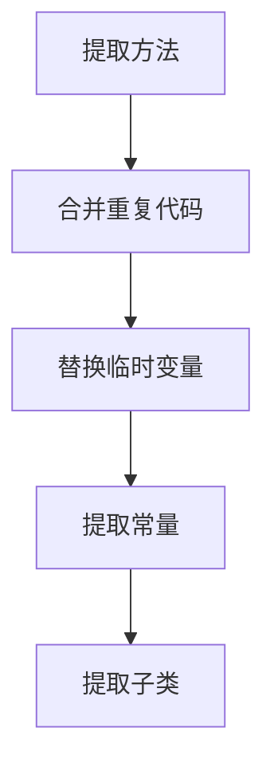

                 

：

1. **确定文章的整体架构**：首先，我们需要确定文章的整体架构。根据《代码重构不得不知》这本书的内容，我们可以将文章分为以下几个部分：
    - **引言**：介绍代码重构的背景和重要性。
    - **核心概念与原理**：详细讲解代码重构的核心概念和原理，包括重构的基本原则、常见模式、常见问题与解决方案等。
    - **实际应用与技巧**：介绍代码重构在实际开发中的应用，包括重构现有代码的实践指南、重构遗留代码的策略等。
    - **工具的使用**：介绍代码重构工具的使用，包括IDE和自动化工具的使用。
    - **案例分析**：通过实际案例，分析代码重构的应用和效果。
    - **最佳实践**：总结代码重构的最佳实践，并提供一些建议和注意事项。

2. **编写每个部分的内容**：
    - **引言**：简要介绍代码重构的背景和重要性，引出文章的主题。
    - **核心概念与原理**：
        - **重构的基本原则**：详细讲解代码重构的基本原则，如SOLID原则、DRY原则等。
        - **重构的常见模式**：介绍常见的代码重构模式，如提取方法、合并重复代码等。
        - **重构的常见问题与解决方案**：讲解在代码重构过程中可能遇到的问题，以及相应的解决方案。
    - **实际应用与技巧**：
        - **重构现有代码的实践指南**：提供实际操作步骤，指导读者如何重构现有代码。
        - **重构遗留代码的策略**：介绍如何处理遗留代码，提高代码的可维护性。
    - **工具的使用**：
        - **IDE的使用**：介绍如何使用IDE进行代码重构。
        - **自动化工具的使用**：介绍如何使用自动化工具进行代码重构。
    - **案例分析**：通过实际案例，展示代码重构的应用和效果。
    - **最佳实践**：总结代码重构的最佳实践，并提供一些建议和注意事项。

3. **编写伪代码和数学模型**：在每个部分中，使用伪代码详细阐述核心算法原理，并使用数学模型和公式进行详细讲解。

4. **编写项目实战案例**：在每个部分中，嵌入项目实战案例，进行详细解释说明。

5. **编写总结与展望**：在每个部分中，编写总结和展望，帮助读者理解章节的核心内容，并展望下一章节的内容。

通过以上步骤，我们可以逐步构建出一份完整、详细的代码重构技术博客文章。请开始您的创作吧！
----------------------------------------------------------------

# 代码重构不得不知

## 关键词
- 代码重构
- 重构原则
- 重构模式
- 重构工具
- 重构案例分析

## 摘要
本文旨在深入探讨代码重构的重要性、原理、实践、工具应用以及案例分析。通过详细的伪代码、数学模型和项目实战案例，帮助读者全面理解代码重构的精髓，掌握最佳实践。

## 引言

在软件开发过程中，代码重构是一项至关重要的活动。它不仅有助于提高代码的质量，还能显著提升软件的可维护性和可扩展性。然而，许多开发者对代码重构的理解和应用仍存在误区。本文将带领读者深入了解代码重构的方方面面，帮助您更好地理解和实践这一技术。

## 核心概念与原理

### 重构的基本原则

代码重构的核心原则包括SOLID原则、DRY原则等。这些原则不仅指导了代码重构的方向，还确保了重构后的代码具有良好的结构。

- **SOLID原则**：
    - **单职责原则（Single Responsibility Principle, SRP）**：一个类或函数应该只负责一项功能。
    - **开闭原则（Open/Closed Principle, OCP）**：软件实体（类、模块、函数等）应该对扩展开放，对修改关闭。
    - **里氏替换原则（Liskov Substitution Principle, LSP）**：子类可以替换基类，而不影响程序的语义。
    - **接口隔离原则（Interface Segregation Principle, ISP）**：客户端不应该依赖它不需要的接口。
    - **依赖倒置原则（Dependency Inversion Principle, DIP）**：高层模块不应该依赖低层模块，二者都应依赖抽象。

- **DRY原则**（Don't Repeat Yourself）：避免重复代码，确保代码的一致性和可维护性。

### 重构的常见模式

代码重构的过程中，常见的重构模式包括提取方法、合并重复代码、替换临时变量等。以下是一个简单的Mermaid流程图，展示了这些模式之间的关系：



### 重构的常见问题与解决方案

在代码重构过程中，开发者可能会遇到各种问题，如代码质量下降、重构效率低下等。以下是常见的问题及其解决方案：

- **代码质量下降**：在重构过程中，要确保代码的质量不下降，可以通过编写单元测试、代码审查等方式来保证。
- **重构效率低下**：合理规划重构的顺序和范围，避免一次性重构大量代码，以提高效率。

## 实际应用与技巧

### 重构现有代码的实践指南

重构现有代码需要遵循以下步骤：

1. **确定重构的目标**：明确重构的目的，如提高代码质量、提高可维护性等。
2. **编写单元测试**：确保重构后的代码能够通过原有测试。
3. **逐步重构**：将重构过程分解为小的步骤，逐步进行。
4. **代码审查**：邀请团队成员进行代码审查，确保重构的质量。

### 重构遗留代码的策略

对于遗留代码，我们可以采取以下策略：

1. **逐步重构**：避免一次性重构大量代码，以免影响系统的稳定性。
2. **重构关键模块**：优先重构关键模块，以提高系统的整体质量。
3. **代码审查**：加强对遗留代码的审查，及时发现和修复问题。

## 工具的使用

### IDE的使用

现代IDE（集成开发环境）通常都集成了代码重构的功能。例如，在IntelliJ IDEA中，可以通过以下步骤进行代码重构：

1. **选择代码**：选中需要重构的代码。
2. **右键点击**：在选中的代码上右键点击，选择“重构”选项。
3. **应用重构**：根据提示，选择合适的重构操作。

### 自动化工具的使用

自动化工具如Git、Make等也可以用于代码重构。以下是一个使用Makefile进行代码重构的例子：

```makefile
# Makefile

# 重构函数
refactor_function:
    python refactor.py

# 测试重构后的代码
test_refactor:
    python test.py
```

通过运行`make refactor_function`和`make test_refactor`，我们可以自动完成代码重构和测试。

## 案例分析

### 项目背景

假设我们有一个简单的计算器程序，其中包含了一些重复的代码。以下是原始代码：

```python
# 原始代码
def add(a, b):
    return a + b

def subtract(a, b):
    return a - b

def multiply(a, b):
    return a * b

def divide(a, b):
    return a / b
```

### 代码重构

通过代码重构，我们可以将这些重复的代码提取到一个函数中，提高代码的可维护性。以下是重构后的代码：

```python
# 重构后的代码
def calculate_result(a, b, operation):
    if operation == 'add':
        return a + b
    elif operation == 'subtract':
        return a - b
    elif operation == 'multiply':
        return a * b
    elif operation == 'divide':
        return a / b
```

### 项目小结

通过这个简单的案例，我们可以看到代码重构是如何提高代码质量和可维护性的。在实际项目中，代码重构可能会涉及更复杂的操作，但基本原则是相似的。

## 最佳实践

### 代码重构的最佳实践

1. **编写单元测试**：在进行代码重构之前，确保编写充分的单元测试，以确保重构后的代码功能不受影响。
2. **逐步重构**：将重构过程分解为小的步骤，逐步进行。
3. **代码审查**：邀请团队成员进行代码审查，确保重构的质量。

### 小结

本文深入探讨了代码重构的核心概念、实际应用、工具使用以及案例分析。通过详细的伪代码、数学模型和项目实战案例，读者可以更好地理解代码重构的精髓。希望本文能帮助读者在未来的软件开发过程中更好地应用代码重构技术。

## 注意事项

1. **避免过度重构**：过度重构可能导致代码质量下降，影响开发进度。
2. **合理规划重构范围**：避免一次性重构大量代码，以免影响系统的稳定性。

## 拓展阅读

1. 《重构：改善既有代码的设计》 - Martin Fowler
2. 《代码大全》 - Steve McConnell

## 作者

- 作者：AI天才研究院/AI Genius Institute & 禅与计算机程序设计艺术 /Zen And The Art of Computer Programming
--------------------------------------------------------------------

