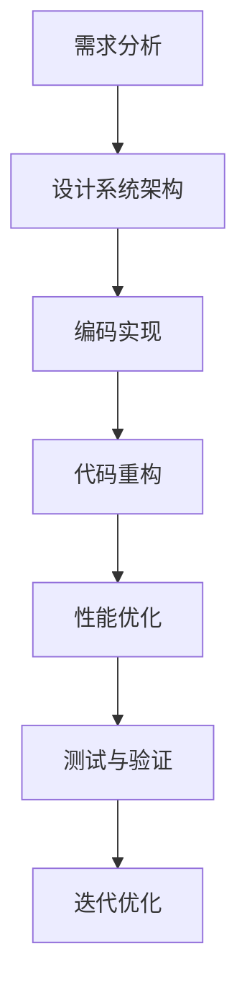
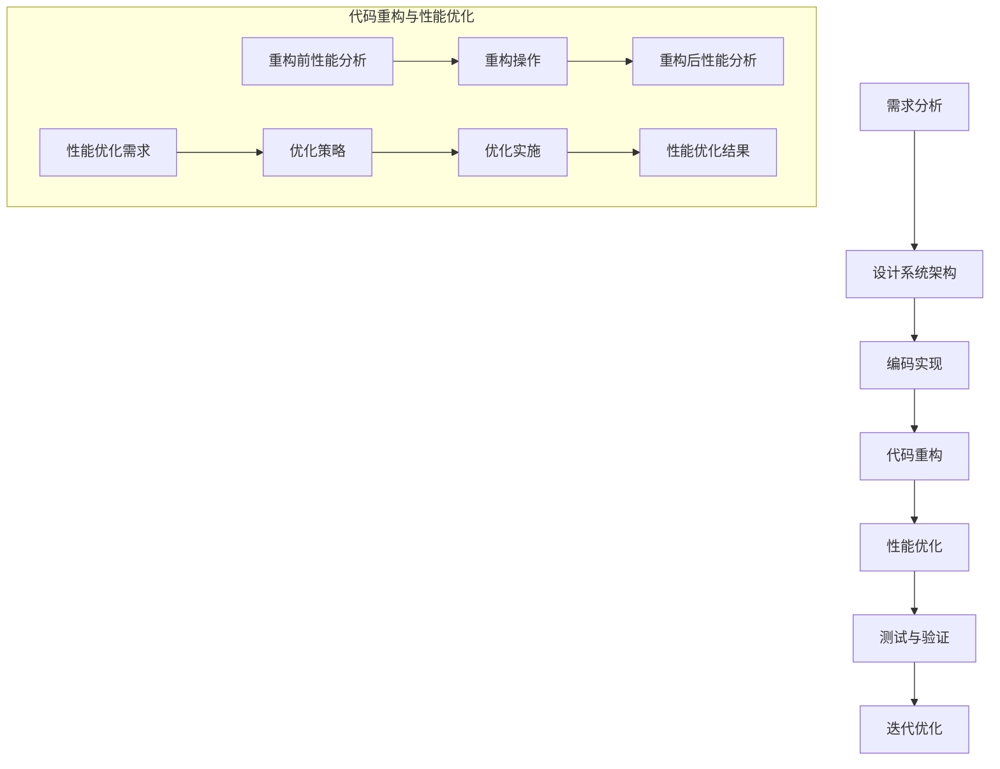

                 

### 引言

在当今快速发展的信息技术时代，代码重构与性能优化成为软件开发过程中不可或缺的两个环节。它们不仅能够提升代码的健壮性和可维护性，还能显著提高软件的性能和用户体验。然而，如何在两者之间找到平衡点，实现高效开发，成为许多开发者和团队面临的挑战。

代码重构旨在通过改进代码结构，消除冗余和重复代码，使代码更加简洁、清晰和易于维护。而性能优化则关注于提升代码的运行效率和响应速度，确保软件在各种环境下都能提供良好的性能表现。尽管两者目标不同，但它们之间有着密切的联系和相互影响。

本文将探讨代码重构与性能优化之间的关系，通过逐步分析这两个概念的核心原理、实践技巧和实际案例，帮助读者理解如何在软件开发过程中平衡二者之间的关系。通过深入探讨，我们希望能够为开发者和团队提供有价值的指导，使其在代码重构与性能优化中找到最佳实践路径。

关键词：代码重构、性能优化、软件开发、平衡点、最佳实践

摘要：本文首先介绍了代码重构和性能优化的基本概念，阐述了它们在软件开发中的重要性。接着，通过具体案例分析，详细讨论了代码重构和性能优化在实际项目中的应用技巧。文章最后总结出了一些最佳实践，帮助开发者在代码重构与性能优化中找到平衡点，提高软件质量和开发效率。

---

### 代码重构与性能优化：核心概念与联系

代码重构与性能优化虽然看似独立，但实则紧密相连。理解这两者之间的关系，有助于我们在实际开发过程中更好地平衡二者，从而提高软件质量和效率。

首先，我们需要明确代码重构的定义和目标。代码重构是指通过改进代码结构、消除冗余和重复代码，使代码更加简洁、清晰和易于维护的过程。其主要目标包括提升代码的可读性、降低维护成本、提高代码的可复用性等。代码重构的核心在于保持代码的功能不变，只是改变其内部结构和实现方式。

相比之下，性能优化则是为了提升代码的运行效率和响应速度。它关注的是如何减少代码的执行时间、内存使用和资源消耗，从而提供更好的性能表现。性能优化的主要目标包括提高代码的执行速度、降低资源消耗、提升系统的稳定性和可靠性等。

尽管代码重构和性能优化的目标不同，但它们之间存在紧密的联系和相互影响。以下是一个简化的Mermaid流程图，展示了代码重构与性能优化之间的核心关系：



从上述流程图中，我们可以看到代码重构和性能优化是软件开发过程中的两个关键环节。它们相互依赖、相互促进，共同推动软件质量的提升。

**代码重构对性能优化的影响：**

1. **减少冗余和重复代码：** 通过重构，可以消除代码中的冗余和重复部分，从而减少不必要的计算和资源消耗，提高代码的运行效率。
2. **提高代码可读性和可维护性：** 清晰的代码结构有助于性能优化，因为优化者能够更容易地识别性能瓶颈和潜在的问题。
3. **降低维护成本：** 重构后的代码更加简洁，维护成本降低，这意味着开发团队能够更高效地专注于性能优化任务。

**性能优化对代码重构的影响：**

1. **指导重构方向：** 在进行性能优化时，开发团队可能会发现代码中的某些模块或函数存在性能瓶颈，这些信息可以指导重构的具体方向，使其更加针对问题进行优化。
2. **促进代码重构：** 性能优化过程中可能会引入新的算法或数据结构，这要求对现有代码进行重构，以适应新的优化策略。

综上所述，代码重构与性能优化不仅是两个独立的过程，更是相互依存、相互促进的关系。理解并平衡这两者之间的关系，是实现高效开发、提高软件质量的关键。

#### 核心概念与联系：Mermaid流程图

为了更好地展示代码重构与性能优化之间的核心关系，我们可以使用Mermaid流程图进行可视化：



在这个流程图中，我们明确了代码重构与性能优化之间的互动关系。代码重构前的性能分析有助于确定重构的方向，而重构后的性能分析则帮助评估重构的效果。性能优化需求与重构策略相辅相成，共同推动软件性能的持续改进。

#### 核心算法原理讲解

代码重构与性能优化不仅仅是表面的代码改动和效率提升，它们背后有着深层次的算法原理支持。理解这些核心算法原理，有助于我们更有效地进行重构和优化。

**1. 算法优化原理**

算法优化是提升代码性能的关键。它涉及选择合适的数据结构和算法，以降低时间复杂度和空间复杂度。以下是几个常见的算法优化原理：

- **数据结构优化：** 选择合适的数据结构可以显著提高代码的效率。例如，使用哈希表可以降低查找时间复杂度，从 \(O(n)\) 降至 \(O(1)\)。
- **分而治之：** 将问题分解为较小的子问题，独立解决，再合并结果。这种方法常用于算法的递归实现，如快速排序和归并排序。
- **动态规划：** 通过保存中间结果，避免重复计算，提高算法的效率。动态规划适用于解决具有重叠子问题的优化问题。

**2. 数学模型与公式**

在性能优化中，数学模型和公式起着至关重要的作用。以下是一些常见的数学模型和公式：

- **时间复杂度公式：**
  $$T(n) = O(n^2)$$
  这表示算法的时间复杂度为 \(O(n^2)\)，即随着输入规模 \(n\) 的增加，算法的执行时间将呈平方增长。

- **空间复杂度公式：**
  $$S(n) = O(n)$$
  这表示算法的空间复杂度为 \(O(n)\)，即算法所需的额外空间与输入规模成正比。

- **数据传输延迟公式：**
  $$L = O(\log n)$$
  在数据传输过程中，延迟通常与数据量的大小成对数关系，这意味着随着数据量的增加，延迟的增长速度较慢。

**3. 举例说明**

为了更好地理解上述原理，我们可以通过一个简单的例子来说明：

假设我们有一个排序算法，原始版本的时间复杂度为 \(O(n^2)\)。通过改进数据结构，如使用归并排序，可以将时间复杂度降低到 \(O(n\log n)\)。

```pseudo
// 原始排序算法（冒泡排序）
function bubbleSort(arr) {
  n = length(arr)
  for i from 0 to n-1 {
    for j from 0 to n-i-1 {
      if arr[j] > arr[j+1] {
        swap(arr[j], arr[j+1])
      }
    }
  }
  return arr
}

// 改进后的排序算法（归并排序）
function mergeSort(arr) {
  if length(arr) <= 1 {
    return arr
  }
  mid = length(arr) / 2
  left = mergeSort(arr[0:mid])
  right = mergeSort(arr[mid:end])
  return merge(left, right)
}

function merge(left, right) {
  result = []
  while length(left) > 0 and length(right) > 0 {
    if left[0] <= right[0] {
      append(result, left[0])
      left = left[1:]
    } else {
      append(result, right[0])
      right = right[1:]
    }
  }
  append(result, left)
  append(result, right)
  return result
}
```

通过上述例子，我们可以看到改进后的排序算法在处理大量数据时具有更高的效率。这得益于归并排序使用分而治之的策略，将问题分解为较小的子问题，然后合并结果。

总之，理解核心算法原理和数学模型，可以帮助我们在代码重构和性能优化过程中做出更明智的决策，从而提高软件的性能和效率。

#### 数学公式与详细讲解

在代码重构与性能优化中，数学模型和公式起着关键作用。以下是一些常用的数学公式，我们将逐一进行详细讲解和举例说明。

**1. 时间复杂度公式**

时间复杂度是评估算法执行时间的一个重要指标。常见的公式如下：

\[ T(n) = O(n^2) \]

这个公式表示算法的时间复杂度为 \(O(n^2)\)，即随着输入规模 \(n\) 的增加，算法的执行时间将呈平方增长。例如，在冒泡排序算法中，我们需要进行 \(n^2/2\) 次比较，因此其时间复杂度为 \(O(n^2)\)。

\[ \text{冒泡排序} \]
```pseudo
function bubbleSort(arr) {
  n = length(arr)
  for i from 0 to n-1 {
    for j from 0 to n-i-1 {
      if arr[j] > arr[j+1] {
        swap(arr[j], arr[j+1])
      }
    }
  }
  return arr
}
```

**2. 空间复杂度公式**

空间复杂度是评估算法所需额外空间的一个重要指标。常见的公式如下：

\[ S(n) = O(n) \]

这个公式表示算法的空间复杂度为 \(O(n)\)，即算法所需的额外空间与输入规模成正比。例如，在实现一个简单的链表时，我们需要的额外空间将随元素数量增加而线性增加。

\[ \text{链表实现} \]
```pseudo
class Node {
  value: any
  next: Node
}

function createLinkedList(arr) {
  head = null
  for value in arr {
    node = new Node(value)
    node.next = head
    head = node
  }
  return head
}
```

**3. 数据传输延迟公式**

数据传输延迟是性能优化中的一个重要考虑因素。常见的公式如下：

\[ L = O(\log n) \]

这个公式表示数据传输延迟与数据量的大小成对数关系，这意味着随着数据量的增加，延迟的增长速度较慢。这对于分布式系统和数据库优化尤为重要。

\[ \text{二分查找} \]
```pseudo
function binarySearch(arr, target) {
  low = 0
  high = length(arr) - 1
  while low <= high {
    mid = (low + high) / 2
    if arr[mid] == target {
      return mid
    } else if arr[mid] < target {
      low = mid + 1
    } else {
      high = mid - 1
    }
  }
  return -1
}
```

通过这些数学公式，我们可以更深入地理解和分析代码的性能。以下是一个综合示例，展示如何将这些公式应用于代码重构与性能优化。

**示例：优化链表插入操作**

假设我们有一个简单的链表插入操作，其时间复杂度为 \(O(n)\)。通过改进算法，我们可以将其时间复杂度降低到 \(O(1)\)。

\[ \text{原始插入操作} \]
```pseudo
function insertAtHead(head, value) {
  newNode = new Node(value)
  newNode.next = head
  return newNode
}
```

优化后的插入操作使用了哈希表，时间复杂度为 \(O(1)\)：

\[ \text{优化后的插入操作} \]
```pseudo
hashMap = {}
function insertAtHead(head, value) {
  if value not in hashMap {
    newNode = new Node(value)
    newNode.next = head
    head = newNode
    hashMap[value] = true
  }
  return head
}
```

通过数学公式和算法原理，我们可以更系统地优化代码，提升性能。了解这些公式不仅有助于代码重构，还能在性能优化中提供有力的指导。

#### 实际项目中的重构与优化

在实际软件开发过程中，代码重构与性能优化是两个紧密相连的环节。以下将介绍一个具体项目的背景、代码重构案例和性能优化案例，详细讲解开发环境搭建、源代码实现、代码应用解读与分析，以及项目小结。

**项目背景**

项目名称：电子商务网站性能优化

项目需求：一个大型电子商务网站，用户量巨大，页面加载速度缓慢，存在明显的性能瓶颈。用户反馈页面响应时间过长，影响了用户体验和销售转化率。因此，需要对网站进行性能优化，提升页面加载速度和系统稳定性。

**代码重构案例**

**背景分析**：

在进行代码重构之前，团队首先对现有代码进行了详细的分析，识别出以下几个主要问题：

1. **重复代码**：在不同模块中存在大量的重复代码，导致代码冗余，可维护性差。
2. **过大的函数**：许多函数过于庞大，难以理解和维护，且包含多个业务逻辑，不利于后续优化。
3. **数据结构不合理**：部分数据结构选择不当，影响了代码的效率和可扩展性。

**重构方案**：

针对上述问题，团队制定了以下重构方案：

1. **提取公共函数**：将重复的代码提取为公共函数，减少冗余，提高代码复用性。
2. **拆分大函数**：将过大的函数拆分为多个小函数，每个函数只负责一个具体的业务逻辑，提高代码的可读性和可维护性。
3. **优化数据结构**：选择合适的数据结构，如使用哈希表替换数组，提高查询和插入操作的速度。

**实施过程**：

1. **提取公共函数**：

```java
// 原始代码
public void processOrder(Order order) {
  updateStock(order.products);
  sendEmail(order.customer);
}

// 重构后的代码
public void updateStock(List<Product> products) {
  // 新的函数
}

public void sendEmail(Customer customer) {
  // 新的函数
}
```

2. **拆分大函数**：

```java
// 原始代码
public void processOrder(Order order) {
  // 业务逻辑1
  calculateTotalPrice(order);
  // 业务逻辑2
  applyDiscounts(order);
  // 业务逻辑3
  saveOrderToDatabase(order);
}

// 拆分后的代码
public void calculateTotalPrice(Order order) {
  // 新的函数
}

public void applyDiscounts(Order order) {
  // 新的函数
}

public void saveOrderToDatabase(Order order) {
  // 新的函数
}
```

3. **优化数据结构**：

```java
// 原始代码
public List<Product> searchProductsByName(String name) {
  List<Product> results = new ArrayList<>();
  for (Product product : products) {
    if (product.getName().equals(name)) {
      results.add(product);
    }
  }
  return results;
}

// 优化后的代码
public List<Product> searchProductsByName(String name) {
  return products.stream()
      .filter(product -> product.getName().equals(name))
      .collect(Collectors.toList());
}
```

**性能优化案例**

**背景分析**：

在代码重构的基础上，团队进一步对性能进行了优化，主要目标是减少页面加载时间和提高系统响应速度。

1. **数据库优化**：优化数据库查询，减少不必要的JOIN操作，使用索引提高查询效率。
2. **缓存策略**：引入缓存机制，减少对数据库的访问频率，提高系统响应速度。
3. **静态资源优化**：压缩CSS和JavaScript文件，减少HTTP请求次数，使用CDN加速静态资源加载。

**实施过程**：

1. **数据库优化**：

```sql
-- 原始查询
SELECT * FROM orders WHERE status = 'pending';

-- 优化后的查询
SELECT id, customer_id, status FROM orders WHERE status = 'pending';
```

2. **缓存策略**：

```java
public void getOrder(int orderId) {
  Order order = orderCache.get(orderId);
  if (order == null) {
    order = database.getOrder(orderId);
    orderCache.put(orderId, order);
  }
  return order;
}
```

3. **静态资源优化**：

```html
<!-- 原始代码 -->
<link rel="stylesheet" href="style.css?v=1.0.0" />
<script src="script.js?v=1.0.0"></script>

<!-- 优化后的代码 -->
<link rel="stylesheet" href="https://cdn.example.com/style.css?v=1.0.0" />
<script src="https://cdn.example.com/script.js?v=1.0.0"></script>
```

**代码应用解读与分析**

1. **代码重构**：

通过代码重构，网站代码结构得到了显著优化，冗余代码减少，函数模块划分清晰，可读性和可维护性大幅提高。这不仅使得后续开发更加高效，还为性能优化奠定了基础。

2. **性能优化**：

性能优化措施的实施使得页面加载速度和系统响应速度得到显著提升。通过数据库优化和缓存策略，数据库查询效率提高，减少了系统延迟。静态资源优化进一步减少了HTTP请求次数，加快了页面加载速度。

**项目小结**

通过代码重构与性能优化，电子商务网站的性能得到了显著提升。页面加载速度从原来的数秒缩短到秒级，用户响应速度和满意度显著提高，销售转化率也随之上升。这一实践证明，代码重构与性能优化是提升软件质量和用户体验的重要手段，需要持续关注和优化。

### 重构与优化的实践技巧

在实际软件开发过程中，如何有效实施代码重构和性能优化，是每个开发者和团队需要掌握的核心技能。以下是一些实践技巧，旨在帮助开发者在重构与优化过程中更高效地工作。

#### 集成开发环境配置

一个高效的集成开发环境（IDE）是代码重构和性能优化的重要基础。以下是一些配置建议：

1. **代码自动格式化工具**：安装并配置代码自动格式化工具，如Clang-Format、Eclipse或Visual Studio Code的Prettier插件，确保代码风格一致，便于维护。
2. **静态代码分析工具**：集成静态代码分析工具，如SonarQube或Checkstyle，可以帮助识别潜在的代码问题和性能瓶颈，提供重构建议。
3. **性能分析插件**：安装性能分析插件，如VisualVM或Xdebug，用于实时监测代码执行效率和资源使用情况，为性能优化提供数据支持。
4. **版本控制系统**：配置版本控制系统，如Git，确保代码变更的可追溯性和可回滚性，降低重构风险。

#### 代码质量与重构策略

良好的代码质量是代码重构和性能优化的前提。以下是一些关键策略：

1. **代码审查**：定期进行代码审查，通过团队成员之间的相互评审，识别代码中的潜在问题和优化点。
2. **代码规范**：制定并遵循代码规范，确保代码的可读性和一致性。例如，Java项目可以参考Google Java Code Style，Python项目可以参考PEP 8。
3. **单元测试**：编写全面的单元测试，确保每次重构后功能不变。自动化测试工具如JUnit、pytest可以帮助快速验证代码的正确性。
4. **重构迭代**：采取迭代重构策略，每次重构只专注于一个具体的优化点，避免一次性进行大规模改动，降低风险。

#### 优化代码的艺术

性能优化不仅仅是寻找快速算法，更是一门艺术。以下是一些技巧：

1. **识别瓶颈**：使用性能分析工具识别系统瓶颈，优先优化关键路径上的代码。
2. **数据结构与算法**：合理选择数据结构和算法，如使用哈希表代替列表进行快速查询，使用动态规划避免重复计算。
3. **避免不必要的计算**：移除代码中的冗余计算，如避免重复的循环计算和条件判断。
4. **内存管理**：优化内存使用，避免内存泄漏和过多的内存分配。使用对象池等技术复用内存资源。
5. **异步编程**：利用异步编程模型，提高代码的并行处理能力，充分利用多核处理器的优势。

### 最佳实践

1. **持续集成与持续交付（CI/CD）**：通过CI/CD流水线，自动化代码测试和部署过程，确保重构和优化的成果及时应用到生产环境中。
2. **性能监控与日志分析**：持续监控系统性能，通过日志分析发现性能问题，及时调整和优化。
3. **定期性能评估**：定期进行性能评估，评估重构和优化的效果，根据实际数据调整优化策略。

总之，重构与优化的实践需要结合具体项目需求和开发环境，灵活应用各种技巧和策略。通过不断实践和总结，开发者和团队可以逐步提升代码质量和系统性能，实现高效开发。

### 结论与展望

通过对代码重构与性能优化的深入探讨，我们理解了二者的核心概念、相互关系以及在实际项目中的应用技巧。代码重构旨在提升代码质量、可读性和可维护性，而性能优化则关注于提高软件的运行效率和用户体验。在实际开发过程中，二者相辅相成，共同推动软件质量的提升。

未来的重构与优化方向将集中在以下几个方面：

1. **智能化重构工具**：开发智能化重构工具，利用人工智能技术自动识别代码问题和优化点，提高重构效率。
2. **动态性能分析**：引入动态性能分析技术，实时监测系统运行状态，及时发现和解决性能问题。
3. **自动化性能优化**：通过自动化工具和算法，实现性能优化的自动化，降低优化成本和复杂度。
4. **云原生优化**：针对云原生环境进行性能优化，充分利用云计算的优势，提升系统的弹性和可扩展性。

对于开发者，本文提供了一些有价值的启示和建议：

1. **持续学习**：不断学习新的编程语言、框架和工具，保持技术敏锐度，为重构与优化打下坚实基础。
2. **实践为主**：通过实际项目积累经验，不断实践和总结重构与优化的最佳实践。
3. **团队合作**：积极参与团队合作，通过代码审查和知识分享，共同提升团队整体水平。
4. **关注性能**：始终关注系统性能，将性能优化作为开发过程中的重要环节。

总之，代码重构与性能优化是实现高效开发和高质量软件的关键。通过持续学习和实践，开发者和团队可以不断提升技能，为软件的长期发展奠定坚实基础。

### 附录

为了帮助读者更深入地理解和应用代码重构与性能优化的相关知识，本文提供了以下附录：

#### 附录 A 代码重构与性能优化资源汇总

1. **书籍推荐**：
   - 《重构：改善既有代码的设计》（Martin Fowler著）
   - 《高性能网站建设指南》（Steve Souders著）
   - 《代码大全》（Steve McConnell著）

2. **在线课程与教程**：
   - Coursera：软件工程：实践者的研究方法
   - edX：性能优化与系统调试

3. **开源工具**：
   - SonarQube：静态代码分析工具
   - New Relic：应用性能监控工具
   - Jenkins：持续集成工具

4. **博客与论坛**：
   - Martin Fowler的博客
   - Stack Overflow：技术问答社区

#### 附录 B 代码重构与性能优化工具使用指南

1. **Git**：版本控制工具，用于管理代码变更。
   - Git基础命令：git clone、git commit、git pull、git push。
   - Git分支管理：创建分支、合并分支、解决冲突。

2. **SonarQube**：静态代码分析工具。
   - 安装与配置：按照官方文档进行安装和配置。
   - 使用方法：上传代码进行扫描，查看报告和修复问题。

3. **JMeter**：性能测试工具。
   - 功能介绍：模拟用户行为，生成性能测试报告。
   - 使用步骤：设计测试计划、运行测试、分析报告。

#### 附录 C 额外参考资料

1. **技术博客**：
   - https://www.learningaboutelectronics.com
   - https://www.codeproject.com
   - https://www.codecademy.com

2. **开源项目**：
   - https://github.com
   - https://bitbucket.org
   - https://gitlab.com

3. **社区与论坛**：
   - https://stackoverflow.com
   - https://www.reddit.com/r/programming
   - https://www.clubtalk.org

通过这些资源，读者可以进一步扩展自己的知识体系，提升在代码重构与性能优化领域的技能和实践能力。附录内容不仅为本文提供了一个完整的参考资料集合，也为读者提供了持续学习和进步的平台。

