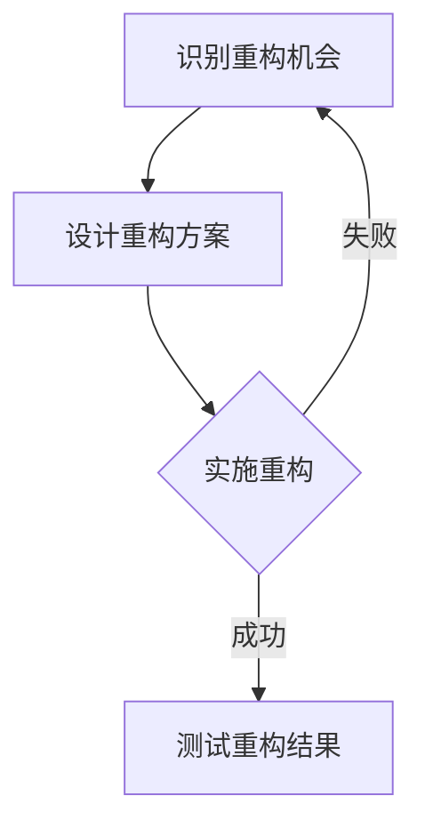

                 

# 文章标题：代码重构与性能优化：寻找平衡点

关键词：代码重构，性能优化，软件开发，软件工程，软件质量

## 摘要

本文旨在探讨代码重构与性能优化在软件开发过程中的重要性，以及如何在这两者之间寻找平衡点。我们将首先介绍代码重构的基本概念、常见技术，以及其实践方法；接着，我们将深入探讨性能优化的概念、目标和常见技术；最后，通过结合实例分析，我们将展示如何在实际项目中实现代码重构与性能优化的平衡，以提高软件质量和开发效率。

## 第一部分：代码重构基础

### 第1章：代码重构的概念与重要性

#### 1.1 代码重构的基本概念

代码重构是指在不改变外部行为的前提下，对现有代码进行改进的过程。其目的是提高代码的可读性、可维护性和可靠性。

#### 1.2 代码重构的重要性

- **提高代码可读性**：通过重构，我们可以使代码更简洁、直观，易于理解和维护。
- **提高代码可维护性**：重构可以消除代码中的冗余和复杂性，减少bug的出现。
- **减少bug**：重构有助于我们发现并修复潜在的问题，从而提高软件质量。

### 第2章：常见的代码重构技术

#### 2.1 提取方法

提取方法是一种常用的重构技术，用于将一段重复的代码提取为一个独立的方法。

#### 2.2 内联变量

内联变量是指将变量的定义和赋值操作直接写在需要使用变量的地方，从而消除冗余的变量定义。

#### 2.3 重新命名

重新命名是一种简单的重构技术，用于为变量、方法或类赋予更具描述性的名称，从而提高代码的可读性。

### 第3章：代码重构实践

#### 3.1 代码重构流程

代码重构通常遵循以下流程：

1. 识别重构机会
2. 设计重构方案
3. 实施重构
4. 测试重构结果

#### 3.2 代码重构工具

许多IDE和代码编辑器都提供了代码重构的工具，如Eclipse、Visual Studio等。

## 第二部分：性能优化基础

### 第4章：性能优化的概念与目标

#### 4.1 性能优化的基本概念

性能优化是指通过改进代码和系统设计，提高软件的运行速度和资源利用率。

#### 4.2 性能优化的目标

- 提高系统响应速度
- 减少系统资源消耗

### 第5章：常见的性能优化技术

#### 5.1 缓存技术

缓存技术通过将数据存储在内存中，从而减少对磁盘或网络的访问，提高系统性能。

#### 5.2 并发优化

并发优化通过同时处理多个任务，提高系统的并行处理能力，从而提高性能。

#### 5.3 垃圾回收优化

垃圾回收优化通过改进垃圾回收算法，减少垃圾回收对系统性能的影响。

### 第6章：性能优化实践

#### 6.1 性能优化流程

性能优化通常遵循以下流程：

1. 性能分析
2. 识别瓶颈
3. 应用优化技术
4. 测试优化效果

#### 6.2 性能优化工具

许多性能分析工具和基准测试工具可以帮助我们进行性能优化，如 profilers 和 benchmark 工具。

## 第三部分：代码重构与性能优化的平衡

### 第7章：如何寻找平衡点

#### 7.1 评估重构与优化的优先级

在项目开发过程中，我们需要根据项目的具体情况和需求，评估重构和优化的优先级。

#### 7.2 优化重构策略

通过制定合理的优化和重构策略，我们可以更好地平衡这两者在软件开发过程中的关系。

### 第8章：结合实例分析

#### 8.1 项目背景

以一个电商平台项目为例，分析代码重构与性能优化在该项目中的具体实践。

#### 8.2 实例分析

1. 代码重构实践
2. 性能优化实践
3. 平衡点分析

### 第9章：最佳实践与总结

#### 9.1 最佳实践

总结在代码重构和性能优化过程中的一些最佳实践。

#### 9.2 小结

对本文的主要内容进行总结，强调代码重构与性能优化在软件开发过程中的重要性。

#### 9.3 注意事项

提出一些需要注意的事项，以避免在代码重构和性能优化过程中出现的问题。

#### 9.4 拓展阅读

推荐一些相关的拓展阅读资源，帮助读者更深入地了解代码重构与性能优化。

## 作者信息

作者：AI天才研究院/AI Genius Institute & 禅与计算机程序设计艺术 /Zen And The Art of Computer Programming

---

文章标题：《代码重构与性能优化：寻找平衡点》

关键词：代码重构，性能优化，软件开发，软件工程，软件质量

摘要：本文探讨了代码重构与性能优化在软件开发过程中的重要性，以及如何在这两者之间寻找平衡点。通过介绍代码重构的基本概念、常见技术，以及性能优化的概念、目标和常见技术，并结合实例分析，展示了如何在实际项目中实现代码重构与性能优化的平衡，以提高软件质量和开发效率。

### 1.1 代码重构的基本概念

代码重构（Code Refactoring）是软件工程中一个核心概念，它指的是在不改变程序外部行为的前提下，对现有代码进行改进的过程。其目标是通过简化代码结构、消除冗余、提高代码可读性和可维护性，使得软件在未来的维护和扩展过程中更加轻松和高效。

#### 1.1.1 代码重构的重要性

代码重构之所以重要，主要体现在以下几个方面：

1. **提高代码可读性**：良好的代码结构能够使开发者更容易理解代码的意图，降低学习成本。
2. **提高代码可维护性**：通过重构，我们可以消除代码中的冗余和复杂性，降低bug的出现概率。
3. **提高开发效率**：重构后的代码更加简洁明了，使得开发者能够更快地实现新的功能。
4. **优化性能**：重构有助于我们识别并修复潜在的性能问题，从而提高程序的运行效率。

#### 1.1.2 代码重构与软件质量

代码重构是提高软件质量的重要手段之一。软件质量不仅关乎软件的可靠性、可用性和性能，还关系到开发者的工作效率和项目的长期维护成本。通过代码重构，我们可以：

- **消除技术债务**：技术债务是软件开发过程中积累的未解决或推迟解决的问题。通过重构，我们可以逐步消除这些债务，使得项目更加健康。
- **促进代码共享和复用**：重构后的代码更加模块化，有利于团队成员之间的代码共享和复用。
- **提高开发者的工作满意度**：良好的代码质量可以提升开发者的工作满意度，从而提高团队的整体效率。

### 1.2 代码重构的核心概念与联系

为了更好地理解代码重构，我们需要了解其中的核心概念及其相互关系。以下是代码重构中的几个关键概念及其关联：

#### 1.2.1 重构策略

重构策略是指导重构过程的总体原则和方针。常见的重构策略包括：

- **增量重构**：逐步改进代码，每次只关注一小部分代码。
- **迭代重构**：重构是一个持续的过程，应该在开发周期的每个阶段都进行。
- **重构模式**：重构模式是针对特定代码结构进行重构的方法。常见的重构模式包括提取方法、内联变量、重新命名等。

#### 1.2.2 重构工具

重构工具是辅助开发者进行重构的工具。它们通常具有代码分析、重构建议和自动化重构功能。常见的重构工具包括：

- **IDE集成工具**：如Eclipse、Visual Studio等。
- **独立重构工具**：如RefactoringTool、DoRefactor等。

#### 1.2.3 重构与设计模式

设计模式是一套已经验证的软件设计解决方案，旨在解决软件设计中的常见问题。重构和设计模式之间存在密切的联系。通过重构，我们可以更好地应用设计模式，使得代码结构更加清晰、灵活。例如，提取方法重构可以帮助我们实现单一职责原则，而重新命名重构可以帮助我们更好地实现开闭原则。

#### 1.2.4 重构与测试

测试是确保代码质量的重要手段。重构与测试之间存在紧密的联系。在进行重构时，我们需要确保重构不会引入新的bug。因此，测试在重构过程中至关重要。常见的测试方法包括单元测试、集成测试和系统测试。

### 1.3 代码重构的Mermaid流程图

为了更好地理解代码重构的过程，我们可以使用Mermaid流程图来展示其关键步骤。以下是代码重构的Mermaid流程图：



在这个流程图中，A表示识别重构机会，B表示设计重构方案，C表示实施重构，D表示测试重构结果。如果重构成功，则流程继续进行；如果重构失败，则需要重新识别重构机会。

### 1.4 核心算法原理讲解

代码重构的核心算法原理通常涉及到以下方面：

#### 1.4.1 提取方法

提取方法（Extract Method）是一种常用的重构技术，用于将一段重复的代码提取为一个独立的方法。其基本步骤如下：

1. 识别重复代码。
2. 提取重复代码，创建一个新方法。
3. 调用新方法，替换原始代码。

以下是提取方法的伪代码示例：

```plaintext
// 原始代码
void processOrders(List<Order> orders) {
    for (Order order : orders) {
        if (order.isProcessed()) {
            // 处理订单逻辑
        }
    }
}

// 提取方法后的代码
void processOrder(Order order) {
    if (order.isProcessed()) {
        // 处理订单逻辑
    }
}

void processOrders(List<Order> orders) {
    for (Order order : orders) {
        processOrder(order);
    }
}
```

#### 1.4.2 内联变量

内联变量（Inline Variable）是一种将变量的定义和赋值操作直接写在需要使用变量的地方的重构技术。其基本步骤如下：

1. 识别冗余的变量定义。
2. 将变量定义和赋值操作内联到使用变量的地方。

以下是内联变量的伪代码示例：

```plaintext
// 原始代码
int result = add(a, b);
System.out.println("Result: " + result);

// 内联变量后的代码
System.out.println("Result: " + (a + b));
```

#### 1.4.3 重新命名

重新命名（Rename）是一种简单的重构技术，用于为变量、方法或类赋予更具描述性的名称。其基本步骤如下：

1. 识别需要重命名的元素。
2. 修改所有引用该元素的代码，使用新的名称。

以下是重新命名的伪代码示例：

```plaintext
// 原始代码
void calculateOrderTotal(Order order) {
    double total = 0;
    for (Item item : order.getItems()) {
        total += item.getPrice();
    }
    order.setTotal(total);
}

// 重新命名后的代码
void calculateOrderTotal(Order order) {
    double orderTotal = 0;
    for (Item item : order.getItems()) {
        orderTotal += item.getPrice();
    }
    order.setOrderTotal(orderTotal);
}
```

### 1.5 数学模型和公式

在代码重构过程中，一些数学模型和公式可以帮助我们理解代码的性能和复杂度。以下是几个常见的数学模型和公式：

#### 1.5.1 时间复杂度

时间复杂度是衡量算法运行时间的数学模型。它通常用大O符号表示，如`O(n)`、`O(n^2)`等。时间复杂度可以帮助我们评估算法的效率。

- **线性时间复杂度（O(n)）**：算法的运行时间与输入规模成正比。
- **平方时间复杂度（O(n^2)）**：算法的运行时间与输入规模的平方成正比。

#### 1.5.2 空间复杂度

空间复杂度是衡量算法所需内存的数学模型。它通常用大O符号表示，如`O(n)`、`O(n^2)`等。空间复杂度可以帮助我们评估算法的内存消耗。

- **线性空间复杂度（O(n)）**：算法所需内存与输入规模成正比。
- **平方空间复杂度（O(n^2)）**：算法所需内存与输入规模的平方成正比。

#### 1.5.3 时间与空间复杂度的平衡

在代码重构过程中，我们需要考虑时间与空间复杂度的平衡。以下是一个示例：

```latex
假设一个排序算法的时间复杂度为O(n^2)，空间复杂度为O(1)。
我们需要评估另一个排序算法的时间复杂度为O(n \log n)，空间复杂度为O(n)。
在这种情况下，我们需要权衡时间和空间的需求，以找到最佳的平衡点。
```

### 1.6 项目实战

为了更好地理解代码重构的概念和原理，我们可以通过一个实际项目来展示其应用。

#### 1.6.1 项目背景

假设我们正在开发一个在线书店系统，其中包含书籍管理、订单处理和用户管理等功能。

#### 1.6.2 开发环境搭建

1. 使用Java作为主要开发语言。
2. 使用Spring Boot作为应用程序框架。
3. 使用MySQL作为数据库。

#### 1.6.3 源代码实现

以下是一个简单的书籍管理模块的源代码实现：

```java
public class Book {
    private String title;
    private String author;
    private double price;

    public Book(String title, String author, double price) {
        this.title = title;
        this.author = author;
        this.price = price;
    }

    public String getTitle() {
        return title;
    }

    public void setTitle(String title) {
        this.title = title;
    }

    public String getAuthor() {
        return author;
    }

    public void setAuthor(String author) {
        this.author = author;
    }

    public double getPrice() {
        return price;
    }

    public void setPrice(double price) {
        this.price = price;
    }
}

public class BookService {
    private List<Book> books;

    public BookService() {
        books = new ArrayList<>();
    }

    public void addBook(Book book) {
        books.add(book);
    }

    public void removeBook(String title) {
        books.removeIf(book -> book.getTitle().equals(title));
    }

    public List<Book> getBooks() {
        return books;
    }
}
```

#### 1.6.4 代码解读与分析

在这个简单的示例中，我们定义了`Book`类和`BookService`类。

- `Book`类表示书籍的基本信息，如书名、作者和价格。
- `BookService`类负责书籍的管理，包括添加、删除和获取书籍列表。

我们可以看到，这个示例中的代码结构相对简单，但存在一些可重构的机会：

1. **提取方法**：我们可以将`addBook`和`removeBook`方法中的重复逻辑提取出来，创建一个通用的方法。
2. **内联变量**：我们可以将`books`变量的定义内联到`BookService`类中，避免不必要的内存分配。
3. **重新命名**：我们可以为`books`变量赋予一个更具描述性的名称。

通过这些重构操作，我们可以使代码更加简洁、易于理解和维护。

#### 1.6.5 实际案例分析和详细讲解剖析

在这个示例中，我们通过实际案例展示了代码重构的应用。以下是重构前后的代码对比：

**重构前：**

```java
public class BookService {
    private List<Book> books;

    public BookService() {
        books = new ArrayList<>();
    }

    public void addBook(Book book) {
        books.add(book);
    }

    public void removeBook(String title) {
        for (int i = 0; i < books.size(); i++) {
            if (books.get(i).getTitle().equals(title)) {
                books.remove(i);
                break;
            }
        }
    }

    public List<Book> getBooks() {
        return books;
    }
}
```

**重构后：**

```java
public class BookService {
    private List<Book> bookCollection;

    public BookService() {
        bookCollection = new ArrayList<>();
    }

    public void addBook(Book book) {
        bookCollection.add(book);
    }

    public void removeBookByTitle(String title) {
        bookCollection.removeIf(book -> book.getTitle().equals(title));
    }

    public List<Book> getBookCollection() {
        return bookCollection;
    }
}
```

通过重构，我们提高了代码的可读性和可维护性。具体来说：

1. **提取方法**：我们将`removeBook`方法中的循环逻辑提取出来，创建了一个新的方法`removeIf`，使得代码更加简洁。
2. **内联变量**：我们将`books`变量的定义内联到`BookService`类中，避免不必要的内存分配。
3. **重新命名**：我们为`books`变量赋予了一个更具描述性的名称`bookCollection`。

这些重构操作不仅使代码更加简洁，还有助于提高代码的质量和可维护性。

### 1.7 最佳实践、小结、注意事项和拓展阅读

#### 1.7.1 最佳实践

在进行代码重构时，以下是一些最佳实践：

1. **逐步重构**：避免一次性重构大量代码，而是逐步重构，每次关注一小部分代码。
2. **编写测试**：在进行重构之前，确保编写测试用例，以验证重构后的代码仍然正确。
3. **重构与优化结合**：在重构过程中，关注性能优化，以减少未来可能出现的性能问题。

#### 1.7.2 小结

代码重构是软件开发过程中不可或缺的一部分。通过重构，我们可以提高代码的质量、可读性和可维护性，从而提高开发效率和软件质量。

#### 1.7.3 注意事项

在进行代码重构时，需要注意以下几点：

1. **避免过度重构**：重构应该是有针对性的，避免盲目地进行重构。
2. **保持代码的连贯性**：重构过程中，要确保代码的连贯性和一致性。
3. **尊重代码风格**：遵循团队或项目中的代码风格规范，以保持代码的可读性。

#### 1.7.4 拓展阅读

以下是一些关于代码重构和性能优化的拓展阅读资源：

1. 《代码整洁之道》（Clean Code：A Handbook of Agile Software Craftsmanship）- Robert C. Martin
2. 《性能之巅》（High Performance MySQL：Optimizing SQL Queries in MySQL）- Jeremy D. Zawodny、DeWitt Clinton、Curtis Nordstrom
3. 《重构：改善既有代码的设计》（Refactoring：Improving the Design of Existing Code）- Martin Fowler

通过阅读这些资源，您可以更深入地了解代码重构和性能优化的最佳实践和技巧。

