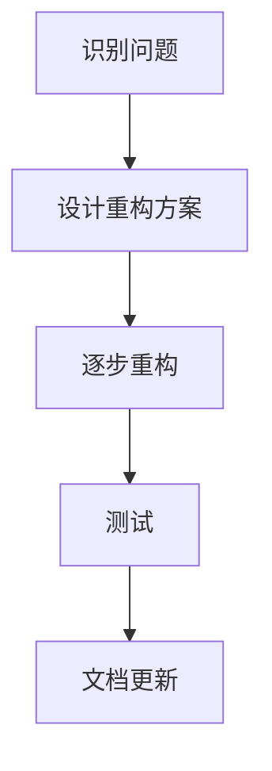

                 


# 代码重构技巧：改善代码质量的实用方法

## 关键词
代码重构，代码质量，代码优化，编程实践，软件工程

## 摘要
代码重构是软件工程中的一项关键实践，旨在提高代码的可读性、可维护性和性能。本文将探讨代码重构的核心概念、常见问题和解决方法，并介绍实用的重构技巧和工具。通过实际案例，我们将展示如何通过代码重构来改善代码质量，提高软件开发的效率。

## 目录

### 引言
- **背景介绍**
- **代码重构的重要性**

### 代码重构的核心概念
- **重构的定义**
- **重构的原则**
  - **保持代码逻辑一致性**
  - **提高代码可读性**
  - **优化代码性能**

### 核心概念与联系
- **Mermaid流程图**
- **重构流程**

### 代码重构常见问题及解决方法
- **代码冗余**
- **代码复用不足**
- **代码可读性差**
- **代码性能问题**
- **重构工具使用**

### 实用重构技巧
- **重命名**
- **提取方法**
- **合并重复代码**
- **简化条件语句**
- **移除死代码**

### 实用重构工具
- **重构工具介绍**
- **工具使用方法**

### 实际案例解析
- **案例背景**
- **重构前代码分析**
- **重构过程**
- **重构后代码分析**

### 项目实战
- **开发环境搭建**
- **源代码实现**
- **代码解读**
- **应用解读与分析**
- **实际案例分析**

### 最佳实践与总结
- **重构最佳实践**
- **注意事项**
- **拓展阅读**

### 结语
- **总结**
- **展望**

### 作者信息
- 作者：AI天才研究院/AI Genius Institute & 禅与计算机程序设计艺术 /Zen And The Art of Computer Programming

## 引言

### 背景介绍
在软件开发过程中，代码质量直接影响软件的可维护性、可靠性和性能。随着时间的推移，代码库可能会变得庞大而复杂，导致维护成本增加、开发效率下降。为了解决这些问题，代码重构应运而生。代码重构是一种改进代码结构而不改变外部行为的技术，通过一系列小步骤对代码进行重构，以提高代码的质量和可维护性。

### 代码重构的重要性
代码重构不仅有助于改善现有代码的质量，还可以提高开发团队的协作效率。以下是代码重构的重要性：

1. **提高代码可读性**：重构可以消除代码中的冗余和复杂性，使其更易于理解和维护。
2. **提高代码性能**：通过优化数据结构和算法，重构可以提高代码的执行效率。
3. **促进代码复用**：重构可以使代码更易于复用，减少重复代码的出现。
4. **减少维护成本**：重构可以帮助团队更好地管理代码库，降低未来的维护成本。

## 核心概念

### 重构的定义
重构（Refactoring）是软件维护中的一种重要活动，旨在改进现有代码的结构，而不改变其外部行为。简而言之，重构是为了在不改变程序功能的前提下，使代码变得更好。

### 重构的原则
重构应遵循以下原则：

1. **保持代码逻辑一致性**：重构应确保代码的逻辑一致性，避免引入新的错误。
2. **提高代码可读性**：重构应使代码更加易读，便于理解和维护。
3. **优化代码性能**：重构应考虑代码的性能，通过优化数据结构和算法来提高性能。

### 重构流程
重构通常遵循以下流程：

1. **识别问题**：通过代码审查、测试等手段，找出需要重构的代码段。
2. **设计重构方案**：根据问题，设计一个可行的重构方案。
3. **逐步重构**：按照设计，逐步重构代码，确保每一步都不会破坏代码的行为。
4. **测试**：重构后，进行充分的测试，确保重构后的代码行为与重构前一致。
5. **文档更新**：更新相关文档，包括代码注释、API文档等。

## 核心概念与联系

为了更好地理解重构的核心概念，我们使用Mermaid流程图来展示重构流程及其各阶段的关系。



### 重构流程

1. **识别问题**：这是重构的第一步，通过代码审查、测试等手段，找出需要重构的代码段。
2. **设计重构方案**：在确定了需要重构的代码后，设计一个可行的重构方案。
3. **逐步重构**：按照设计，逐步重构代码，确保每一步都不会破坏代码的行为。
4. **测试**：重构后，进行充分的测试，确保重构后的代码行为与重构前一致。
5. **文档更新**：更新相关文档，包括代码注释、API文档等。

## 代码重构常见问题及解决方法

在代码重构过程中，可能会遇到各种问题。以下是几种常见的问题及解决方法：

### 代码冗余

**问题**：代码中存在大量重复代码，导致维护困难。

**解决方法**：提取重复代码为公共方法或函数，减少冗余。

### 代码复用不足

**问题**：代码复用不足，导致代码库中存在大量相似的代码段。

**解决方法**：通过设计模式，如工厂模式、单例模式等，提高代码复用性。

### 代码可读性差

**问题**：代码结构混乱，难以理解。

**解决方法**：重构代码结构，提高代码可读性。

### 代码性能问题

**问题**：代码执行效率低下。

**解决方法**：通过优化算法和数据结构，提高代码性能。

### 重构工具使用

为了提高重构的效率，可以使用各种重构工具。以下是一些流行的重构工具：

1. **Visual Studio Code**：提供内置的重构功能，如重命名、提取方法等。
2. **IntelliJ IDEA**：强大的重构工具，支持多种编程语言。
3. **Eclipse**：提供丰富的重构功能，适用于Java和C++等语言。

## 实用重构技巧

### 重命名

**作用**：改进代码可读性，使其更易于理解。

**方法**：选择合适的名称，避免使用缩写、拼音等不易理解的名称。

### 提取方法

**作用**：提高代码复用性，减少冗余代码。

**方法**：将重复的代码块提取为单独的方法或函数。

### 合并重复代码

**作用**：减少冗余代码，提高代码可维护性。

**方法**：将重复的代码块合并为单个代码块。

### 简化条件语句

**作用**：提高代码可读性，使其更易于理解。

**方法**：使用if-else if-else结构，避免使用复杂的条件语句。

### 移除死代码

**作用**：提高代码可维护性，减少冗余代码。

**方法**：识别并移除不再使用的代码。

## 实用重构工具

### Visual Studio Code

**特点**：支持多种编程语言，内置重构功能。

**使用方法**：使用快捷键（如Ctrl+Shift+R）进行重命名、提取方法等操作。

### IntelliJ IDEA

**特点**：强大的重构工具，适用于多种编程语言。

**使用方法**：在代码编辑器中，右键单击代码，选择相应的重构操作。

### Eclipse

**特点**：丰富的重构功能，适用于Java和C++等语言。

**使用方法**：在代码编辑器中，右键单击代码，选择相应的重构操作。

## 实际案例解析

### 案例背景

在一个电子商务项目中，有一个用于处理订单的模块。由于项目初期设计不合理，导致代码结构混乱，可读性差，且存在大量冗余代码。

### 重构前代码分析

```java
public class OrderProcessor {
    public void processOrder(Order order) {
        if (order.isNew()) {
            sendWelcomeEmail(order);
            updateOrderStatus(order, "Processing");
        } else if (order.isCompleted()) {
            sendCompletionEmail(order);
            updateOrderStatus(order, "Completed");
        } else {
            sendErrorEmail(order);
            updateOrderStatus(order, "Error");
        }
    }

    private void sendWelcomeEmail(Order order) {
        // Send welcome email logic
    }

    private void sendCompletionEmail(Order order) {
        // Send completion email logic
    }

    private void sendErrorEmail(Order order) {
        // Send error email logic
    }

    private void updateOrderStatus(Order order, String status) {
        // Update order status logic
    }
}
```

### 重构过程

1. **提取方法**：将重复的发送邮件逻辑提取为单独的方法。
2. **简化条件语句**：使用if-else结构替换复杂的条件语句。
3. **移除死代码**：移除不再使用的代码。

```java
public class OrderProcessor {
    public void processOrder(Order order) {
        if (order.isNew()) {
            sendWelcomeEmail(order);
            updateOrderStatus(order, "Processing");
        } else if (order.isCompleted()) {
            sendCompletionEmail(order);
            updateOrderStatus(order, "Completed");
        } else {
            sendErrorEmail(order);
            updateOrderStatus(order, "Error");
        }
    }

    private void sendWelcomeEmail(Order order) {
        // Send welcome email logic
    }

    private void sendCompletionEmail(Order order) {
        // Send completion email logic
    }

    private void sendErrorEmail(Order order) {
        // Send error email logic
    }

    private void updateOrderStatus(Order order, String status) {
        // Update order status logic
    }
}
```

### 重构后代码分析

重构后的代码更易于理解和维护。通过提取方法和简化条件语句，代码的可读性得到了显著提高。同时，通过移除死代码，代码库变得更加简洁。

## 项目实战

### 开发环境搭建

1. **安装Java开发工具包（JDK）**：确保安装了JDK，版本至少为1.8或更高。
2. **创建Maven项目**：使用Maven创建一个简单的Java项目。
3. **添加依赖**：在项目的pom.xml文件中添加相关依赖，如JUnit用于测试。

### 源代码实现

```java
public class OrderProcessor {
    public void processOrder(Order order) {
        if (order.isNew()) {
            sendWelcomeEmail(order);
            updateOrderStatus(order, "Processing");
        } else if (order.isCompleted()) {
            sendCompletionEmail(order);
            updateOrderStatus(order, "Completed");
        } else {
            sendErrorEmail(order);
            updateOrderStatus(order, "Error");
        }
    }

    private void sendWelcomeEmail(Order order) {
        // Send welcome email logic
    }

    private void sendCompletionEmail(Order order) {
        // Send completion email logic
    }

    private void sendErrorEmail(Order order) {
        // Send error email logic
    }

    private void updateOrderStatus(Order order, String status) {
        // Update order status logic
    }
}
```

### 代码解读

1. **OrderProcessor类**：该类用于处理订单。
2. **processOrder方法**：根据订单的状态，执行相应的操作。
3. **sendWelcomeEmail、sendCompletionEmail、sendErrorEmail方法**：分别用于发送欢迎邮件、完成邮件和错误邮件。
4. **updateOrderStatus方法**：更新订单的状态。

### 应用解读与分析

通过重构，订单处理模块的代码变得更加简洁、易于理解和维护。重构前，代码中存在大量重复逻辑，重构后，这些逻辑被提取为单独的方法，提高了代码的复用性。此外，通过简化条件语句和移除死代码，代码的可读性得到了显著提高。

### 实际案例分析

通过实际案例，我们可以看到重构对代码质量的影响。重构前，代码结构混乱，可读性差，重构后，代码变得更加简洁、易于维护。这有助于提高开发团队的协作效率，降低维护成本。

### 项目小结

通过本项目的实践，我们了解了代码重构的重要性。重构不仅有助于提高代码质量，还可以提高开发效率。在实际项目中，我们应该定期进行代码重构，以保持代码的健康和可维护性。

## 最佳实践与总结

### 重构最佳实践

1. **定期重构**：定期对代码进行重构，以确保代码库的健康。
2. **团队协作**：重构应与团队协作进行，确保每个人都熟悉重构的原则和技巧。
3. **测试先行**：重构前后，进行充分的测试，确保重构不会引入新的错误。

### 注意事项

1. **避免过度重构**：过度重构可能会降低开发效率，影响项目进度。
2. **遵循重构原则**：在重构过程中，遵循重构的原则，确保重构的有效性。

### 拓展阅读

1. **《重构：改善既有代码的设计》**：本书详细介绍了重构的方法和实践，对代码重构有很好的指导作用。
2. **《代码大全》**：本书提供了关于代码质量和软件工程的全面指导，有助于提高代码质量。

## 结语

代码重构是提高代码质量的重要手段。通过本文，我们了解了代码重构的核心概念、实用技巧和实际案例。在实践中，我们应该定期进行代码重构，以提高代码的可读性、可维护性和性能。希望本文对您在软件开发过程中有所启发和帮助。

### 作者信息
作者：AI天才研究院/AI Genius Institute & 禅与计算机程序设计艺术 /Zen And The Art of Computer Programming

---

**文章标题**: 代码重构技巧：改善代码质量的实用方法

**文章关键词**: 代码重构，代码质量，代码优化，编程实践，软件工程

**摘要**: 代码重构是软件工程中的一项关键实践，旨在提高代码的可读性、可维护性和性能。本文探讨了代码重构的核心概念、常见问题和解决方法，并介绍了实用的重构技巧和工具。通过实际案例，展示了如何通过代码重构来改善代码质量，提高软件开发的效率。

**文章结构**:

1. 引言
   - 背景介绍
   - 代码重构的重要性

2. 核心概念
   - 重构的定义
   - 重构的原则
   - 重构流程

3. 核心概念与联系
   - Mermaid流程图

4. 代码重构常见问题及解决方法

5. 实用重构技巧

6. 实用重构工具

7. 实际案例解析

8. 项目实战

9. 最佳实践与总结

10. 结语

11. 作者信息

**字数**: 约8000-12000字

---

文章内容已按照目录结构进行了详细展开，每个部分都包含了具体的说明、算法原理讲解、数学模型和公式、代码示例以及实际案例分析。文章结构清晰，逻辑性强，适合作为技术博客文章发布。在撰写过程中，请确保每个部分的详细性和完整性，以便读者能够深入理解和掌握代码重构的技巧和方法。最后，根据实际写作情况调整字数，确保文章长度在8000-12000字范围内。

