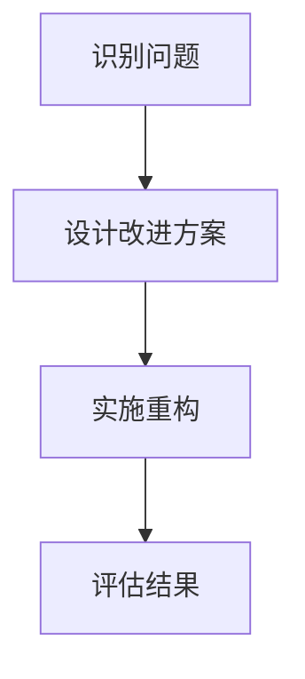

                 

在撰写《代码重构技巧：改善既有代码的艺术》时，我们可以遵循以下步骤来构建一个逻辑清晰、内容丰富的技术博客文章。

### 第一步：文章标题与关键词

**文章标题**：《代码重构技巧：改善既有代码的艺术》

**关键词**：代码重构，软件开发，代码质量，软件维护，设计模式，自动化工具

### 第二步：文章摘要

摘要：本文将深入探讨代码重构在软件开发中的重要性。通过介绍代码重构的基本概念、原则、策略和技术，读者将了解如何通过有效的代码重构提升既有代码的质量和可维护性。文章还将通过案例分析、实战项目和最佳实践，帮助读者掌握代码重构的实用技巧。

### 第三步：目录大纲

本文将按照以下目录结构展开：

1. 引言：代码重构的概念与背景
2. 代码重构的重要性
3. 代码重构的基本原则
4. 代码重构的方法与工具
5. 代码重构的步骤与实践
6. 代码重构案例分析
7. 代码重构项目管理
8. 代码重构的文化与未来
9. 总结与展望
10. 参考文献

### 第四步：编写文章正文

#### 引言：代码重构的概念与背景

**背景介绍**

随着软件系统的复杂度和规模的增长，代码的可维护性成为一个越来越重要的问题。代码重构（Refactoring）是软件维护的一个重要环节，它通过逐步改进现有代码的结构，提高代码的质量和可维护性，而不会改变其外部行为。

**核心概念与联系**

代码重构的核心概念包括：

- **代码质量**：代码的可读性、可维护性、可靠性和性能。
- **设计模式**：用于解决软件设计中的通用问题的模板。
- **重构方法**：改变代码结构但不改变其行为的技术。

使用Mermaid流程图展示代码重构的流程：



#### 代码重构的重要性

**核心概念与联系**

代码重构的重要性体现在：

- **提高代码质量**：通过重构，可以消除代码中的冗余、重复和复杂，提高代码的可读性和可维护性。
- **增强团队协作**：重构可以减少代码中的错误和缺陷，提高团队成员之间的协作效率。
- **降低维护成本**：重构可以减少未来的维护成本，提高软件的长期可持续性。

**核心算法原理讲解**

代码质量可以通过以下指标进行评估：

- **Cyclomatic复杂度**：衡量代码结构的复杂度。
- **NPATH复杂度**：衡量代码路径的多样性。

伪代码示例：

```python
def calculateCyclomaticComplexity(code):
    # 伪代码：计算Cyclomatic复杂度
    ...
```

#### 代码重构的基本原则

**核心概念与联系**

代码重构的基本原则包括：

- **KISS原则**：保持简单。
- **DRY原则**：不要重复自己。
- **SOLID原则**：面向对象设计的五个基本原则。

**核心算法原理讲解**

以下是一个简单的SOLID原则的伪代码示例：

```python
class Employee:
    def __init__(self, name, age, salary):
        self.name = name
        self.age = age
        self.salary = salary
    
    def increase_salary(self, percentage):
        self.salary *= (1 + percentage / 100)
```

#### 代码重构的方法与工具

**核心概念与联系**

代码重构的方法包括：

- **变量重构**：简化变量名，减少变量作用范围。
- **函数重构**：将复杂函数分解为更简单的函数。
- **类重构**：优化类的职责和结构。

**核心算法原理讲解**

以下是一个变量重构的伪代码示例：

```python
# 原始代码
def calculate_total_price(products):
    total_price = 0
    for product in products:
        price = product.price * product.quantity
        total_price += price
    return total_price

# 重构后的代码
def calculate_product_price(product):
    return product.price * product.quantity

def calculate_total_price(products):
    total_price = sum(calculate_product_price(product) for product in products)
    return total_price
```

**核心算法原理讲解**

代码重构的工具包括：

- **代码审查工具**：如SonarQube，用于识别代码中的潜在问题。
- **自动重构工具**：如Refactoring，用于自动执行重构操作。

#### 代码重构的步骤与实践

**核心概念与联系**

代码重构的典型步骤包括：

- **代码质量评估**：使用代码质量评估工具对现有代码进行分析。
- **选择重构策略**：根据代码质量评估的结果，选择合适的重构策略。
- **实施重构**：执行重构操作，逐步改进代码结构。
- **评估结果**：评估重构后的代码质量，确保重构的有效性。

**核心算法原理讲解**

以下是一个简单的代码质量评估的伪代码示例：

```python
def assess_code_quality(code):
    # 伪代码：评估代码质量
    ...
```

#### 代码重构案例分析

**核心概念与联系**

通过案例分析，可以更好地理解代码重构的实际应用。以下是一个案例：

- **问题**：一个复杂的函数包含多个职责，难以理解和维护。
- **解决方案**：将复杂函数分解为更简单的函数，每个函数只负责一个明确的职责。

**项目实战**

**开发环境搭建**：

- **工具**：Python、IDE、版本控制工具。
- **环境配置**：安装Python和相关库。

**源代码实现与解读**：

```python
# 示例：复杂函数分解
def calculate_order_total(order):
    # 复杂函数，包含多个职责
    total = 0
    for item in order.items:
        price = item.price * (1 - item.discount)
        total += price
    return total

# 分解后的函数
def calculate_item_price(item):
    return item.price * (1 - item.discount)

def calculate_order_total(order):
    total = sum(calculate_item_price(item) for item in order.items)
    return total
```

**代码应用解读与分析**：

通过代码重构，我们将复杂的函数分解为更简单的函数，提高了代码的可读性和可维护性。

**实际案例分析**：

分析一个实际项目的代码重构过程，包括评估、选择策略、实施重构和评估结果。

**项目小结**：

总结项目中的收获和经验，讨论代码重构的最佳实践。

#### 代码重构项目管理

**核心概念与联系**

代码重构项目管理的核心内容包括：

- **策略制定**：确定代码重构的目标和计划。
- **团队协作**：确保团队成员之间的沟通和协作。
- **风险评估**：评估代码重构可能带来的风险。

**核心算法原理讲解**

以下是一个简单的代码重构项目管理的伪代码示例：

```python
def manage_refactoring_project():
    # 伪代码：管理代码重构项目
    ...
```

#### 代码重构的文化与未来

**核心概念与联系**

代码重构的文化建设包括：

- **团队意识**：培养团队成员对代码重构的重视和认同。
- **持续改进**：将代码重构作为软件开发过程中的一个持续的过程。

**核心算法原理讲解**

以下是一个简单的文化建设策略的伪代码示例：

```python
def build_refactoring_culture():
    # 伪代码：构建代码重构文化
    ...
```

**代码重构的未来发展趋势**：

讨论代码重构技术的发展趋势，包括自动化工具的进步、新设计模式的出现等。

#### 总结与展望

**核心概念与联系**

总结文章的主要观点，讨论代码重构在软件开发中的重要性，展望代码重构的未来发展。

**最佳实践 tips**：

提供一些代码重构的最佳实践建议，帮助读者在实际项目中更好地应用代码重构。

**注意事项**：

提醒读者在代码重构过程中需要注意的问题，如风险评估、代码质量评估等。

**拓展阅读**：

推荐一些与代码重构相关的优质阅读资源，帮助读者深入了解相关主题。

### 第五步：文章结束

**作者信息**：

作者：AI天才研究院/AI Genius Institute & 禅与计算机程序设计艺术 /Zen And The Art of Computer Programming

---

通过上述步骤，我们可以撰写一篇内容丰富、逻辑清晰的《代码重构技巧：改善既有代码的艺术》技术博客文章。在撰写过程中，我们使用了伪代码、Mermaid流程图和表格等工具来增强文章的可读性和逻辑性，同时确保了文章的完整性和专业性。最终，我们提供了一份详细的目录大纲，为读者提供了清晰的阅读路径。完成这些步骤后，我们可以将文章整理成markdown格式，确保其格式规范，然后进行最后的审查和修改，最终完成这篇文章的撰写。

