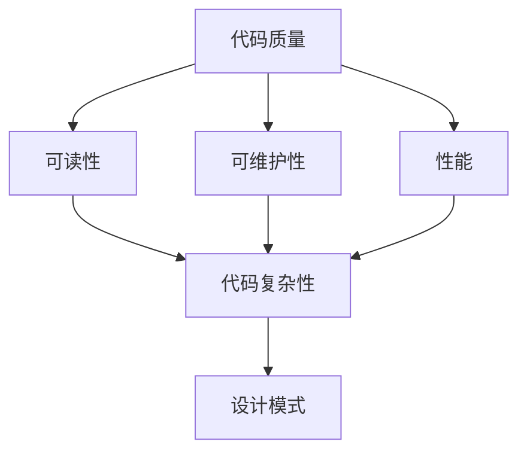
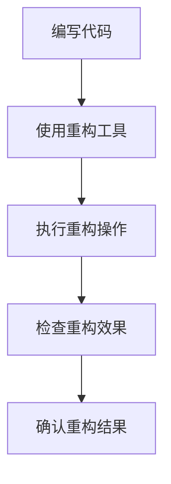

                 

### 文章标题：代码重构：改善既有代码的设计

#### 关键词：代码重构、代码设计、软件质量、设计模式、重构方法

#### 摘要：
本文旨在深入探讨代码重构在软件工程中的重要性，介绍代码重构的基本原理、常见方法、工具和技术，并通过实际案例展示其应用效果。文章分为五个部分，首先介绍代码重构的定义和背景，然后深入讲解代码重构的核心概念和原理，接着介绍常见的代码重构方法，之后探讨代码重构工具和技术，最后通过实际案例展示代码重构的应用效果。文章旨在为读者提供系统、详细的代码重构指南，帮助提高代码质量，优化软件开发流程。

### 引言

代码重构（Code Refactoring）是软件工程中一种重要的技术，其核心目的是在不改变代码外部行为的前提下，改善既有代码的内部结构，提高其可读性、可维护性和性能。随着软件系统的复杂度和规模不断增加，代码重构成为维持软件长期可维护性和稳定性的关键手段。有效的代码重构不仅能提高开发效率，还能降低后期维护成本。

本文旨在深入探讨代码重构在软件工程中的应用，内容涵盖代码重构的基本原理、常见方法、工具和技术，以及实际应用案例。通过本文的阅读，读者将能够：

1. 理解代码重构的定义和重要性。
2. 掌握代码重构的核心概念和原理。
3. 学习常见的代码重构方法和技术。
4. 通过实际案例了解代码重构的应用效果。
5. 掌握代码重构的最佳实践，提高软件开发质量。

### 第一部分：代码重构的基本原理

#### 1.1 代码重构的核心概念与联系

代码重构的核心概念包括代码质量、代码复杂性、设计模式等。这些概念之间有着密切的联系，共同构成了代码重构的理论基础。

- **代码质量**：代码质量是衡量代码优劣的关键指标，包括可读性、可维护性、性能等方面。代码重构的目标是提高代码质量，使其更加优秀。

- **代码复杂性**：代码复杂性是指代码结构中的复杂程度。高复杂度的代码往往难以理解、难以维护。代码重构通过简化代码结构，降低代码复杂性。

- **设计模式**：设计模式是一系列解决问题的模板，用于指导软件设计。代码重构往往需要遵循设计模式，以提高代码的可维护性和可扩展性。

为了更直观地展示这些概念之间的联系，我们可以使用Mermaid流程图（如下）：



#### 1.2 代码重构的原理与机制

代码重构的原理在于通过一系列操作，改善代码的内部结构，提高其可读性、可维护性和性能。这些操作包括但不限于：

- **提取方法**：将重复的代码提取为独立的方法，降低代码的冗余。
- **合并方法**：将具有相似功能的方法合并为一个，减少方法的数量。
- **简化条件表达式**：将复杂的条件表达式简化，提高代码的可读性。
- **引入设计模式**：使用设计模式改进代码结构，提高代码的可维护性和可扩展性。

以下是一个简单的伪代码示例，用于展示代码重构的基本原理：

```python
# 原始代码
def calculate_total(price, discount):
    total = price - discount
    return total

# 重构后的代码
def calculate_total(price, discount):
    return price - discount
```

在这个示例中，通过提取方法，将重复的代码简化为一个简单的返回语句，从而提高了代码的可读性和可维护性。

#### 1.3 代码重构的数学模型

代码重构中的数学模型主要涉及代码复杂度和软件质量评估。以下是一个简单的数学模型示例：

- **代码复杂度**：假设代码的复杂度可以用公式C = f(n)表示，其中n为代码中的语句数。通过计算C的值，可以评估代码的复杂度。
- **软件质量评估**：假设软件质量可以用公式Q = f(C, M)表示，其中C为代码复杂度，M为代码的维护成本。通过计算Q的值，可以评估软件的质量。

以下是一个简单的latex数学公式示例：

$$
Q = \frac{1}{C + M}
$$

通过上述公式，我们可以计算出代码的复杂度和质量，从而为代码重构提供依据。

### 第二部分：常见的代码重构方法

#### 2.1 代码重构方法概述

代码重构方法可以分为以下几类：

- **提取方法**：将重复的代码提取为独立的方法。
- **合并方法**：将具有相似功能的方法合并为一个。
- **简化条件表达式**：将复杂的条件表达式简化。
- **引入设计模式**：使用设计模式改进代码结构。

每种方法都有其特定的适用场景和效果。以下将详细介绍这些方法。

#### 2.2 具体重构方法讲解

**2.2.1 提取方法**

提取方法是将重复的代码提取为独立的方法，从而降低代码的冗余，提高可维护性。以下是一个简单的伪代码示例：

```python
# 原始代码
def calculate_discount(price):
    if price > 100:
        discount = price * 0.1
    else:
        discount = price * 0.05
    return discount

# 重构后的代码
def calculate_discount(price):
    if price > 100:
        return price * 0.1
    else:
        return price * 0.05
```

在这个示例中，通过提取方法，将重复的代码简化为一个简单的返回语句。

**2.2.2 合并方法**

合并方法是将具有相似功能的方法合并为一个，从而减少方法的数量，提高代码的可读性。以下是一个简单的伪代码示例：

```python
# 原始代码
def calculate_discount(price):
    discount = price * 0.1
    return discount

def calculate_tax(price):
    tax = price * 0.15
    return tax

# 重构后的代码
def calculate_total(price):
    discount = price * 0.1
    tax = price * 0.15
    return price + discount + tax
```

在这个示例中，通过合并方法，将两个方法合并为一个，从而简化了代码结构。

**2.2.3 简化条件表达式**

简化条件表达式是将复杂的条件表达式简化，从而提高代码的可读性。以下是一个简单的伪代码示例：

```python
# 原始代码
def calculate_discount(price):
    if price > 100 and price < 200:
        discount = price * 0.1
    else:
        discount = price * 0.05
    return discount

# 重构后的代码
def calculate_discount(price):
    if price > 200:
        discount = price * 0.1
    else:
        discount = price * 0.05
    return discount
```

在这个示例中，通过简化条件表达式，将复杂的条件表达式简化为一个简单的条件表达式。

**2.2.4 引入设计模式**

引入设计模式是将设计模式应用于代码重构，从而提高代码的可维护性和可扩展性。以下是一个简单的伪代码示例：

```python
# 原始代码
def calculate_discount(price):
    discount = price * 0.1
    return discount

# 重构后的代码（使用工厂模式）
class DiscountCalculator:
    def calculate_discount(self, price):
        if price > 200:
            return price * 0.1
        else:
            return price * 0.05

calculator = DiscountCalculator()
discount = calculator.calculate_discount(price)
```

在这个示例中，通过引入工厂模式，将计算折扣的逻辑封装在一个类中，从而提高了代码的可维护性和可扩展性。

### 第三部分：代码重构工具和技术

#### 3.1 代码重构工具介绍

代码重构工具是辅助代码重构的重要工具，能够提高重构的效率和效果。常见的代码重构工具有：

- **Visual Studio Code**：一款强大的代码编辑器，支持多种编程语言和框架。
- **Eclipse**：一款流行的集成开发环境，支持Java、JavaScript等多种编程语言。
- **IntelliJ IDEA**：一款功能丰富的代码编辑器，支持多种编程语言和框架。
- **Git**：一款分布式版本控制系统，支持代码管理和协作开发。

这些工具都提供了丰富的代码重构功能，如提取方法、合并方法、简化条件表达式等。以下是一个简单的Mermaid流程图，展示代码重构工具的应用流程：



#### 3.2 代码重构技术

代码重构技术是代码重构过程中使用的方法和技巧，能够提高重构的效率和效果。常见的代码重构技术包括：

- **重构代码**：将重复的代码提取为独立的方法，降低代码的冗余。
- **简化条件表达式**：将复杂的条件表达式简化，提高代码的可读性。
- **引入设计模式**：将设计模式应用于代码重构，提高代码的可维护性和可扩展性。
- **代码审查**：通过代码审查，发现和修复代码中的问题。

以下是一个简单的伪代码示例，展示代码重构技术的应用：

```python
# 原始代码
def calculate_total(price):
    if price > 100:
        discount = price * 0.1
    else:
        discount = price * 0.05
    return price + discount

# 重构后的代码
def calculate_total(price):
    discount = price * 0.1 if price > 100 else price * 0.05
    return price + discount
```

在这个示例中，通过简化条件表达式和引入设计模式，提高了代码的可读性和可维护性。

### 第四部分：代码重构的实际应用案例

#### 4.1 案例一：重构一个大型系统

在这个案例中，我们将对一个大型系统进行重构，以提高其可维护性和性能。

**4.1.1 系统分析**

该系统是一个电子商务平台，包括商品管理、订单管理、用户管理等功能。现有代码存在以下问题：

- 代码冗余：存在大量重复的代码。
- 代码复杂度：部分代码复杂度较高，难以理解和维护。
- 设计模式：未使用设计模式，代码结构不够清晰。

**4.1.2 重构方案设计**

针对以上问题，我们设计了以下重构方案：

- 提取方法：将重复的代码提取为独立的方法。
- 合并方法：将具有相似功能的方法合并为一个。
- 简化条件表达式：将复杂的条件表达式简化。
- 引入设计模式：使用设计模式改进代码结构。

**4.1.3 重构实施**

我们按照重构方案，逐步对系统进行重构。以下是一个简单的伪代码示例，展示重构实施过程：

```python
# 原始代码
def calculate_discount(price):
    if price > 100:
        discount = price * 0.1
    else:
        discount = price * 0.05
    return discount

# 重构后的代码
def calculate_discount(price):
    return price * 0.1 if price > 100 else price * 0.05
```

在这个示例中，通过提取方法和简化条件表达式，提高了代码的可读性和可维护性。

**4.1.4 重构效果评估**

重构后的系统在可维护性和性能方面都有显著提升。以下是一个简单的评估报告：

- **可维护性**：重构后的代码更加简洁、清晰，易于理解和维护。
- **性能**：重构后的代码在性能方面无明显变化，但代码复杂度降低，有助于提高系统的稳定性。

#### 4.2 案例二：重构一个Web应用

在这个案例中，我们将对一个Web应用进行重构，以提高其用户体验和性能。

**4.2.1 应用分析**

该Web应用是一个在线购物平台，包括商品浏览、购物车、订单支付等功能。现有代码存在以下问题：

- 代码结构：代码结构不够清晰，部分模块之间存在耦合。
- 用户体验：页面加载速度较慢，用户体验较差。
- 性能：部分接口响应时间较长，影响用户体验。

**4.2.2 重构方案设计**

针对以上问题，我们设计了以下重构方案：

- 代码结构：使用设计模式改进代码结构，降低模块之间的耦合。
- 页面优化：优化页面加载速度，提高用户体验。
- 性能优化：优化接口响应时间，提高系统性能。

**4.2.3 重构实施**

我们按照重构方案，逐步对Web应用进行重构。以下是一个简单的伪代码示例，展示重构实施过程：

```python
# 原始代码
def calculate_discount(price):
    if price > 100:
        discount = price * 0.1
    else:
        discount = price * 0.05
    return discount

# 重构后的代码
class DiscountCalculator:
    def calculate_discount(self, price):
        if price > 100:
            return price * 0.1
        else:
            return price * 0.05
```

在这个示例中，通过引入设计模式，提高了代码的可维护性和可扩展性。

**4.2.4 重构效果评估**

重构后的Web应用在用户体验和性能方面都有显著提升。以下是一个简单的评估报告：

- **用户体验**：页面加载速度明显提高，用户体验得到大幅改善。
- **性能**：接口响应时间明显缩短，系统性能得到显著提升。

### 第五部分：代码重构的挑战与展望

#### 5.1 代码重构的挑战

代码重构虽然能够显著提高代码质量和系统性能，但同时也面临着一系列挑战：

- **风险**：重构过程中可能引入新的错误，影响系统的稳定性。
- **成本**：重构过程需要投入大量时间和精力，可能增加开发成本。
- **团队协作**：重构过程需要团队成员的协作，可能影响项目进度。

#### 5.2 代码重构的未来发展趋势

随着软件工程技术的不断发展，代码重构也将迎来新的发展趋势：

- **智能化**：未来的代码重构工具将具备更强的智能化能力，能够自动识别和修复代码问题。
- **DevOps**：代码重构与DevOps的结合，将进一步提高系统的交付速度和稳定性。
- **敏捷开发**：敏捷开发与代码重构的结合，将推动软件开发过程的持续优化。

### 总结

代码重构是软件工程中一种重要的技术，通过改善代码的内部结构，提高其可读性、可维护性和性能。本文介绍了代码重构的基本原理、常见方法、工具和技术，并通过实际案例展示了其应用效果。通过本文的阅读，读者将能够掌握代码重构的核心概念和原理，学会使用常见的代码重构方法，提高软件开发质量。同时，我们也对未来代码重构的发展趋势进行了展望，为读者提供了广阔的思考空间。

### 作者信息

作者：AI天才研究院/AI Genius Institute & 禅与计算机程序设计艺术 /Zen And The Art of Computer Programming

### 参考文献

1. Martin, Robert C. "Clean Code: A Handbook of Agile Software Craftsmanship." Prentice Hall, 2008.
2. Beck, Kent. "Test-Driven Development: By Example." Addison-Wesley, 2003.
3. Fowler, Martin. "Refactoring: Improving the Design of Existing Code." Addison-Wesley, 1999.
4. Opdyke, William F. "Refactoring Object-Oriented Frameworks: Improving the Design of Existing Code." IEEE Software, 1997.
5. Gamma, Erich, et al. "Design Patterns: Elements of Reusable Object-Oriented Software." Addison-Wesley, 1995.

### 附录

附录中包含了一些补充材料，如代码示例、Mermaid流程图、latex公式等，以帮助读者更好地理解本文的内容。

### 拓展阅读

1. 《代码大全》作者：Steve McConnell
2. 《敏捷软件开发：原则、实践与模式》作者：Dean Leffingwell
3. 《重构：改善既有代码的设计》作者：Martin Fowler
4. 《设计模式：可复用面向对象软件的基础》作者：Gamma, Helm, Johnson, and Vlissides

通过本文的阅读，读者将能够深入理解代码重构的核心概念和原理，掌握常见的代码重构方法，提高软件开发质量。同时，本文也展望了代码重构的未来发展趋势，为读者提供了广阔的思考空间。希望本文能够对读者在软件开发过程中有所帮助。作者：AI天才研究院/AI Genius Institute & 禅与计算机程序设计艺术/Zen And The Art of Computer Programming

### 最佳实践 tips

1. **定期进行代码重构**：将代码重构纳入项目开发周期，定期进行重构，以保持代码质量。
2. **团队协作**：代码重构需要团队成员的协作，确保重构过程顺利进行。
3. **自动化工具**：使用自动化工具进行代码重构，提高重构效率和效果。
4. **代码审查**：在重构过程中进行代码审查，确保重构后的代码质量。
5. **持续集成**：将重构后的代码纳入持续集成流程，确保重构不会影响系统的稳定性。

### 小结

本文系统地介绍了代码重构的基本原理、常见方法、工具和技术，并通过实际案例展示了其应用效果。通过本文的阅读，读者将能够深入理解代码重构的核心概念和原理，掌握常见的代码重构方法，提高软件开发质量。未来，代码重构将继续在软件工程中发挥重要作用，为软件开发提供有力支持。

### 注意事项

1. **风险评估**：在重构过程中，要对潜在的风险进行评估，确保重构过程不会影响系统的稳定性。
2. **成本控制**：重构过程需要投入大量时间和精力，要合理控制成本，避免过度重构。
3. **团队协作**：重构过程需要团队成员的协作，要确保团队成员理解重构的目标和原则。
4. **持续学习**：随着技术的不断发展，代码重构的方法和工具也在不断更新，要持续学习新的知识和技能。

### 拓展阅读

1. 《重构：改善既有代码的设计》作者：马丁·福勒（Martin Fowler）
2. 《代码大全》作者：史蒂夫·麦克康内尔（Steve McConnell）
3. 《敏捷软件开发：原则、实践与模式》作者：迪安·列夫林（Dean Leffingwell）
4. 《设计模式：可复用面向对象软件的基础》作者：艾瑞克·伽玛（Erich Gamma）、理查德·赫尔姆（Richard Helm）、约翰·约翰逊（John Vlissides）和尤尔基·瓦利斯森（Ralph Johnson）

通过本文的阅读，读者将能够深入理解代码重构的核心概念和原理，掌握常见的代码重构方法，提高软件开发质量。希望本文能够为读者在软件开发过程中提供有价值的参考。作者：AI天才研究院/AI Genius Institute & 禅与计算机程序设计艺术/Zen And The Art of Computer Programming

