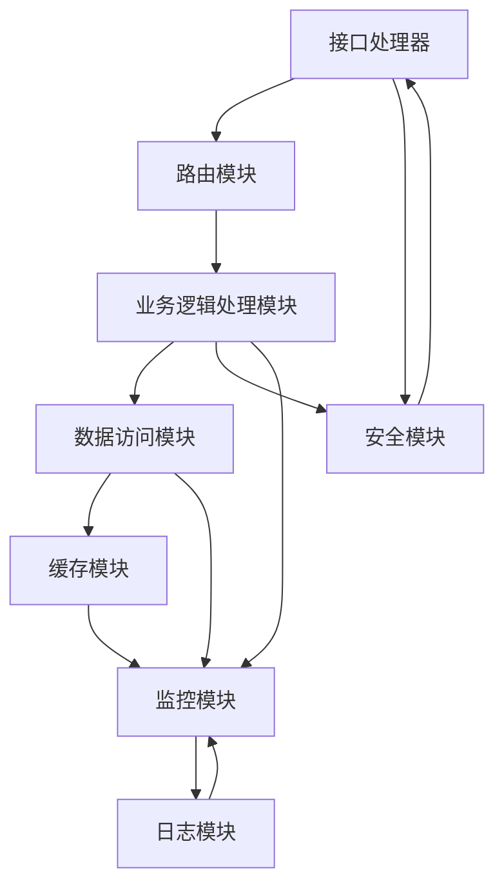
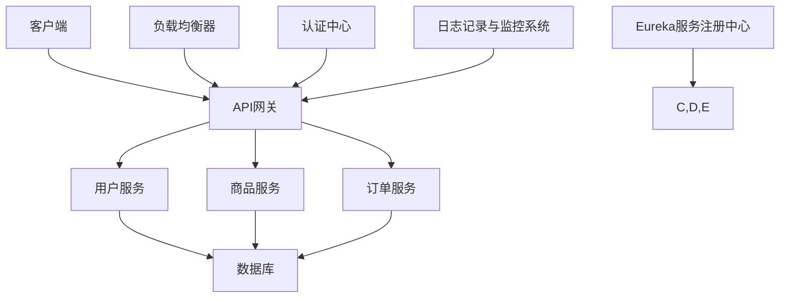

                 

### 第1章 引言

#### 1.1 API网关的重要性

在现代企业级架构中，API网关扮演着至关重要的角色。它不仅是一个系统级的入口，还起到了集成、路由、安全、监控等一系列关键功能。随着微服务架构的广泛应用，API网关成为了服务化架构中不可或缺的组件。

首先，API网关作为系统级的入口，统一了不同微服务之间的接口，使得外部客户端能够通过一个统一的入口访问系统，从而简化了客户端的调用逻辑，提高了系统的可维护性和扩展性。

其次，API网关提供了路由策略和负载均衡功能，确保了系统的稳定性和高性能。通过动态路由和智能负载均衡，API网关能够将请求均匀地分配到后端的服务实例上，避免单点瓶颈，提高系统的可用性和容错能力。

再次，API网关在安全性方面也发挥着重要作用。它能够对请求进行认证和授权，确保只有合法的用户才能访问受保护的服务。同时，API网关还可以对请求进行防攻击处理，如防SQL注入、XSS攻击等，保护系统的安全。

此外，API网关还具有日志记录和监控功能，可以实时记录系统运行状态和请求日志，帮助开发者快速定位和解决问题。通过监控功能，API网关还能提供系统的性能指标，帮助运维人员实时了解系统运行情况，进行性能优化和故障排除。

#### 1.2 企业级API网关的挑战

尽管API网关具有许多优势，但在实际部署过程中也面临诸多挑战。首先，如何设计一个高效、可扩展的API网关架构是一个重要的课题。随着服务量的增加，API网关需要具备良好的伸缩性，能够动态调整资源分配，确保系统的高可用性。

其次，API网关的性能优化也是一大难题。在高并发环境下，API网关需要具备快速的处理能力，否则将成为系统性能的瓶颈。因此，如何进行性能测试和调优，提高系统的响应速度和吞吐量，是每个开发者都需要关注的问题。

另外，API网关的安全性也是不可忽视的方面。随着网络安全威胁的日益严重，API网关需要具备强大的防护能力，能够抵御各种攻击，保护系统的安全。

最后，如何确保API网关的稳定性和可靠性也是一个重要挑战。在复杂的企业级系统中，API网关需要与其他组件紧密配合，确保整个系统的稳定运行。

#### 1.3 本书目标和结构

本书旨在深入探讨企业级API网关的设计与实现，帮助读者全面了解API网关的核心概念、架构设计、功能实现、性能优化和实战应用。具体目标如下：

1. **掌握API网关的基本概念和原理**：通过详细讲解API网关的定义、功能和类型，帮助读者建立全面的理论基础。
2. **理解API网关的架构设计**：介绍API网关的组件和架构设计原则，指导读者如何构建高效、可扩展的API网关系统。
3. **掌握API网关的核心功能实现**：详细讲解路由策略、负载均衡、安全认证与授权、日志记录与监控等核心功能，帮助读者理解并实现这些功能。
4. **学习API网关的性能优化技巧**：分析性能瓶颈，介绍优化策略和调优方法，提高系统的响应速度和吞吐量。
5. **通过实战案例掌握API网关的开发与部署**：通过一个实际的API网关项目，指导读者从需求分析、技术选型、架构设计到代码实现、测试与部署的完整过程。
6. **探讨API网关的未来发展趋势**：分析行业趋势和技术演进方向，为读者提供未来发展的参考。

本书结构如下：

- **第1章 引言**：介绍API网关的重要性、企业级API网关的挑战和本书的目标。
- **第2章 API网关基础概念**：讲解API网关的基本概念和类型。
- **第3章 API网关架构设计**：介绍API网关的架构设计原则和组件。
- **第4章 API网关核心功能实现**：详细讲解API网关的核心功能。
- **第5章 API网关性能优化**：分析性能瓶颈和优化策略。
- **第6章 企业级API网关项目实战**：通过一个实际项目展示API网关的开发与部署。
- **第7章 API网关未来发展**：探讨API网关的未来发展趋势。

通过本书的深入学习，读者将能够全面掌握企业级API网关的设计与实现，为实际项目开发提供有力支持。

---

### 1.1 API网关的重要性

在现代企业级架构中，API网关的重要性不可忽视。首先，它作为系统级的入口，为不同微服务之间提供了统一的接口。通过API网关，外部客户端无需了解后端服务的具体实现细节，只需按照API网关提供的接口进行调用即可。这种设计不仅简化了客户端的调用逻辑，提高了系统的可维护性和扩展性，还为系统的迭代和更新提供了便利。

其次，API网关提供了路由策略和负载均衡功能，确保了系统的稳定性和高性能。路由策略使得API网关能够根据请求的路径、参数等信息，将请求动态地路由到后端的不同服务实例上。这样，不仅提高了系统的性能，还能够实现服务之间的解耦，使得各个服务可以独立开发、部署和扩展。

负载均衡则是API网关的另一大功能。在高并发环境下，负载均衡能够将请求均匀地分配到后端的服务实例上，避免单点瓶颈，提高系统的可用性和容错能力。常见的负载均衡算法包括轮询、最小连接数、加权轮询等，根据实际需求进行选择和应用。

再者，API网关在安全性方面也发挥着重要作用。它能够对请求进行认证和授权，确保只有合法的用户才能访问受保护的服务。常见的认证方式包括基于用户名和密码、OAuth2.0、JWT（JSON Web Token）等。授权方面，API网关能够根据用户的角色和权限，对请求进行细粒度的控制，防止未经授权的访问。

此外，API网关还具有日志记录和监控功能。通过日志记录，API网关能够实时记录系统的运行状态和请求日志，帮助开发者快速定位和解决问题。监控功能则能够提供系统的性能指标，如请求响应时间、处理速度、吞吐量等，帮助运维人员实时了解系统运行情况，进行性能优化和故障排除。

综上所述，API网关在现代企业级架构中扮演着至关重要的角色。它不仅简化了系统的调用逻辑，提高了系统的性能和稳定性，还在安全性、可扩展性和可维护性等方面提供了强有力的支持。

### 1.2 企业级API网关的挑战

尽管API网关在现代企业级架构中扮演着重要的角色，但其部署过程中也面临诸多挑战。首先，如何设计一个高效、可扩展的API网关架构是一个重要的课题。随着企业业务的发展，服务量和请求量会不断增加，API网关需要具备良好的伸缩性，能够动态调整资源分配，确保系统的高可用性。

具体来说，API网关的伸缩性主要表现在以下几个方面：

1. **水平扩展**：通过增加更多的API网关实例，实现负载均衡，提高系统的处理能力。这要求API网关能够支持动态注册和发现后端服务实例，并能够根据请求量自动调整实例数量。
2. **垂直扩展**：通过增加API网关服务器的硬件资源，如CPU、内存等，提高系统的处理能力。这需要在硬件选择和资源调度上进行优化，以确保系统的高性能和高可用性。
3. **动态配置**：API网关需要能够动态调整配置，如路由策略、负载均衡算法等，以适应业务变化和需求调整。

其次，API网关的性能优化也是一大难题。在高并发环境下，API网关需要具备快速的处理能力，否则将成为系统性能的瓶颈。为了提高性能，可以从以下几个方面进行优化：

1. **减少中间件使用**：尽量减少不必要的中间件使用，如日志记录、监控等，以减少系统开销。
2. **缓存策略**：合理使用缓存，如内存缓存、Redis缓存等，减少对后端服务的访问次数，提高系统的响应速度。
3. **异步处理**：对于一些耗时较长的操作，如数据库查询、远程调用等，可以采用异步处理方式，避免阻塞主线程，提高系统的吞吐量。
4. **代码优化**：对关键代码进行优化，如减少循环次数、避免重复计算等，提高代码执行效率。

另外，API网关的安全性也是不可忽视的方面。随着网络安全威胁的日益严重，API网关需要具备强大的防护能力，能够抵御各种攻击，保护系统的安全。常见的安全措施包括：

1. **认证和授权**：对请求进行认证和授权，确保只有合法的用户才能访问受保护的服务。常用的认证方式有基于用户名和密码、OAuth2.0、JWT等。授权方面，可以根据用户的角色和权限，对请求进行细粒度的控制。
2. **防攻击处理**：对请求进行防攻击处理，如防SQL注入、XSS攻击等，防止恶意攻击对系统造成损害。
3. **加密传输**：使用HTTPS等加密协议，确保数据在传输过程中的安全性。

最后，如何确保API网关的稳定性和可靠性也是一个重要挑战。在复杂的企业级系统中，API网关需要与其他组件紧密配合，确保整个系统的稳定运行。为了提高API网关的稳定性，可以从以下几个方面进行优化：

1. **故障处理**：对API网关可能出现的故障进行预测和处理，如服务实例故障、网络异常等，确保系统能够快速恢复。
2. **监控系统**：对API网关的运行状态进行实时监控，及时发现和处理异常情况，如请求异常、性能瓶颈等。
3. **日志记录**：详细记录API网关的运行日志，便于开发者进行问题排查和故障分析。

总之，企业级API网关在设计和部署过程中面临诸多挑战。通过合理的架构设计、性能优化、安全防护和稳定性保障，可以构建一个高效、稳定、安全的API网关系统，为企业的业务发展提供有力支持。

### 1.3 本书目标和结构

本书的目标是深入探讨企业级API网关的设计与实现，帮助读者全面掌握API网关的核心概念、架构设计、功能实现、性能优化和实战应用。通过本书的学习，读者将能够：

1. **理解API网关的基本概念和原理**：从定义、功能、类型等方面，全面了解API网关的核心概念，为后续内容的学习打下坚实基础。
2. **掌握API网关的架构设计**：学习API网关的组件和架构设计原则，理解如何构建高效、可扩展的API网关系统。
3. **实现API网关的核心功能**：通过详细讲解路由策略、负载均衡、安全认证与授权、日志记录与监控等核心功能，指导读者如何实现并优化这些功能。
4. **学习API网关的性能优化技巧**：分析性能瓶颈，介绍优化策略和调优方法，提高系统的响应速度和吞吐量。
5. **通过实战案例掌握API网关的开发与部署**：通过一个实际项目，展示API网关的开发与部署过程，帮助读者将理论知识应用到实际项目中。
6. **探讨API网关的未来发展趋势**：分析行业趋势和技术演进方向，为读者提供未来发展的参考。

本书结构如下：

- **第1章 引言**：介绍API网关的重要性、企业级API网关的挑战和本书的目标。
- **第2章 API网关基础概念**：讲解API网关的基本概念和类型。
- **第3章 API网关架构设计**：介绍API网关的架构设计原则和组件。
- **第4章 API网关核心功能实现**：详细讲解API网关的核心功能。
- **第5章 API网关性能优化**：分析性能瓶颈和优化策略。
- **第6章 企业级API网关项目实战**：通过一个实际项目展示API网关的开发与部署。
- **第7章 API网关未来发展**：探讨API网关的未来发展趋势。

通过本书的深入学习，读者将能够全面掌握企业级API网关的设计与实现，为实际项目开发提供有力支持。

---

### 2.1 什么是API网关

API网关（API Gateway）是一种服务器架构设计模式，它在微服务架构中扮演着核心角色。从广义上讲，API网关是一种统一的接口层，用于管理和代理对后端服务的所有外部请求。它不仅充当了一个“门卫”，确保只有授权的请求能够进入系统，还提供了多种功能，如路由、聚合、认证、授权、监控等。

在微服务架构中，每个微服务都有自己的API，外部客户端需要与多个微服务进行交互。如果没有API网关，客户端需要维护与每个微服务直接的连接，这不仅增加了复杂性，还降低了系统的可维护性和扩展性。而API网关的出现，将所有外部请求统一代理到后端微服务，客户端只需与API网关进行通信，从而简化了调用流程。

#### API网关的基本原理

API网关的基本原理可以概括为以下几个关键点：

1. **统一接口**：API网关提供了一个统一的接口，客户端可以通过这个接口访问后端服务的所有功能。这样一来，客户端无需了解后端服务的具体实现细节，简化了调用逻辑。
2. **路由与转发**：API网关根据请求的路径、参数等信息，将请求路由到后端的具体服务实例上。路由策略可以是基于路径、参数、请求方法等多种条件进行动态配置。
3. **负载均衡**：API网关通常具备负载均衡功能，能够将请求均匀地分配到后端的服务实例上，避免单点瓶颈，提高系统的可用性和容错能力。
4. **安全认证与授权**：API网关对请求进行认证和授权，确保只有合法的用户才能访问受保护的服务。常见的认证方式包括基于用户名和密码、OAuth2.0、JWT等。
5. **服务聚合**：API网关可以将多个微服务的响应结果进行聚合，返回给客户端。例如，一个订单查询请求可能需要调用多个微服务的API，API网关可以将这些请求的结果进行合并，提高系统的响应效率。
6. **日志记录与监控**：API网关可以记录系统的运行状态和请求日志，帮助开发者快速定位和解决问题。同时，监控功能可以提供系统的性能指标，如请求响应时间、处理速度、吞吐量等。

#### API网关的核心功能

API网关的核心功能包括但不限于以下几个方面：

1. **路由策略**：根据请求的路径、参数等信息，动态地将请求路由到后端的具体服务实例上。常见的路由策略包括基于路径、参数、请求方法等。
2. **负载均衡**：通过轮询、最小连接数、加权轮询等算法，将请求均匀地分配到后端的服务实例上，确保系统的稳定性和高性能。
3. **安全认证与授权**：对请求进行认证和授权，确保只有合法的用户才能访问受保护的服务。常见的认证方式有基于用户名和密码、OAuth2.0、JWT等。
4. **服务聚合**：将多个微服务的响应结果进行聚合，返回给客户端。例如，一个订单查询请求可能需要调用多个微服务的API，API网关可以将这些请求的结果进行合并。
5. **日志记录与监控**：记录系统的运行状态和请求日志，帮助开发者快速定位和解决问题。同时，提供系统的性能指标，如请求响应时间、处理速度、吞吐量等。

综上所述，API网关是一种重要的微服务架构组件，它通过提供统一的接口、路由策略、负载均衡、安全认证与授权等功能，简化了客户端的调用逻辑，提高了系统的性能和安全性。在实际应用中，API网关的设计与实现需要综合考虑多种因素，以确保系统的高效、稳定和可扩展性。

### 2.2 API网关的功能

API网关作为微服务架构中的重要组成部分，承担了多种关键功能。以下是API网关的主要功能及其详细解释：

#### 2.2.1 路由策略

路由策略是API网关的核心功能之一。它负责根据请求的路径、参数、请求方法等条件，将请求动态地路由到后端的具体服务实例上。路由策略的设计直接影响系统的性能和可用性。常见的路由策略包括：

1. **基于路径的路由**：根据请求的URL路径，将请求路由到相应的服务实例。例如，/orders路由到订单服务，/products路由到商品服务。
2. **基于参数的路由**：根据请求的参数值，将请求路由到不同的服务实例。例如，根据用户ID，将请求路由到对应用户的服务实例。
3. **基于请求方法的路由**：根据请求的方法类型，如GET、POST、PUT、DELETE等，将请求路由到不同的服务实例。例如，GET请求路由到查询服务，POST请求路由到创建服务。

#### 2.2.2 负载均衡

负载均衡是API网关的另一重要功能，旨在将请求均匀地分配到后端的服务实例上，避免单点瓶颈，提高系统的可用性和容错能力。常见的负载均衡算法包括：

1. **轮询算法**：按照顺序将请求分配到每个服务实例上。这种算法简单易用，但可能会导致某些服务实例过载。
2. **最小连接数算法**：将请求分配到连接数最少的服务实例上。这种算法能够更好地均衡负载，减少服务实例之间的负载差异。
3. **加权轮询算法**：根据服务实例的处理能力，为每个实例分配不同的权重。处理能力较强的实例将获得更多的请求。
4. **哈希算法**：根据请求的某些特征（如用户ID、请求路径等），将请求固定分配到特定的服务实例上。这种算法可以确保同一用户或同一请求始终由同一实例处理，提高请求的处理速度。

#### 2.2.3 安全认证与授权

API网关在安全方面发挥着重要作用，负责对请求进行认证和授权。认证是验证用户身份的过程，而授权则是确定用户是否有权限访问特定的资源。常见的认证方式包括：

1. **基于用户名和密码的认证**：用户通过输入用户名和密码进行认证。这种方式简单易用，但安全性较低，容易遭受密码泄露攻击。
2. **OAuth2.0认证**：OAuth2.0是一种授权框架，允许第三方应用在用户的授权下访问受保护的资源。这种方式具有较高的安全性，但实现较为复杂。
3. **JWT认证**：JSON Web Token（JWT）是一种基于JSON的开放标准，用于在用户与服务之间传递认证信息。JWT包含用户的身份信息和加密的签名，可以确保认证信息的完整性和安全性。

授权方面，API网关可以根据用户的角色和权限，对请求进行细粒度的控制。常见的授权方式包括：

1. **基于角色的授权**：用户被赋予不同的角色，如管理员、普通用户等。API网关根据用户的角色，判断其是否有权限访问特定的资源。
2. **基于资源的授权**：资源本身被赋予权限，如只允许管理员访问某个资源。API网关根据资源的权限，判断用户是否有权限访问。

#### 2.2.4 日志记录与监控

日志记录与监控是API网关的重要功能，有助于开发者快速定位和解决问题。API网关可以记录以下类型的日志：

1. **请求日志**：记录每个请求的详细信息，如请求时间、请求方法、请求路径、请求参数、响应状态等。这些日志有助于分析系统的性能瓶颈和请求分布情况。
2. **错误日志**：记录系统在处理请求过程中出现的错误信息，如异常堆栈、错误代码等。这些日志有助于快速定位和处理问题。
3. **性能日志**：记录系统的性能指标，如请求响应时间、处理速度、吞吐量等。这些日志有助于分析系统的性能状况，进行性能优化。

监控功能则通过实时监控API网关的运行状态和性能指标，提供实时反馈。常见的监控指标包括：

1. **请求量**：统计单位时间内处理请求的数量，帮助分析系统的负载情况。
2. **响应时间**：统计请求的响应时间，帮助分析系统的性能瓶颈。
3. **吞吐量**：统计单位时间内处理请求的数量，帮助分析系统的处理能力。

通过日志记录与监控，开发者可以快速发现系统问题，进行故障排除和性能优化，提高系统的稳定性和可靠性。

#### 2.2.5 服务聚合

服务聚合功能允许API网关将多个微服务的响应结果进行聚合，返回给客户端。这种功能有助于简化客户端的调用逻辑，提高系统的响应效率。例如，一个订单查询请求可能需要调用订单服务、用户服务、商品服务等多个微服务的API，API网关可以将这些请求的结果进行合并，返回一个完整的订单信息。

服务聚合的实现方式通常包括：

1. **并行调用**：API网关同时调用多个微服务的API，然后将结果进行聚合。这种方式可以提高响应速度，但需要处理并发请求的复杂度。
2. **顺序调用**：API网关按照特定的顺序依次调用多个微服务的API，然后将结果进行聚合。这种方式相对简单，但可能会降低响应速度。
3. **异步调用**：API网关将请求分发给多个微服务，采用异步方式处理，然后将结果进行聚合。这种方式可以提高系统的吞吐量，但需要处理异步通信的复杂度。

#### 2.2.6 API限流与熔断

API限流与熔断功能旨在防止系统过载，保护系统的稳定性和可靠性。限流功能通过对请求进行流量控制，限制单位时间内处理请求的数量，避免系统因过高负载而崩溃。常见的限流算法包括：

1. **令牌桶算法**：根据固定的速率生成令牌，请求只有在获得令牌后才能通过。这种方式可以平滑流量，避免突发流量对系统造成冲击。
2. **漏斗算法**：设置一个漏斗容量，请求进入漏斗后会占用容量。当漏斗容量满时，新的请求将被阻塞。这种方式可以控制流量在一定范围内波动。

熔断功能则通过检测系统的健康状况，在系统过载或出现故障时，自动切断对后端服务的访问，防止故障蔓延。常见的熔断算法包括：

1. **基于错误率的熔断**：当错误率超过一定阈值时，触发熔断。这种方式可以防止系统因错误请求而崩溃。
2. **基于响应时间的熔断**：当响应时间超过一定阈值时，触发熔断。这种方式可以防止系统因长时间处理请求而超时。

通过API限流与熔断功能，API网关可以有效地保护系统，确保系统的稳定性和可靠性。

#### 2.2.7 防御安全攻击

API网关在安全方面还承担着防御安全攻击的重要任务。常见的攻击手段包括SQL注入、XSS攻击、CSRF攻击等。API网关可以通过以下措施来防御这些攻击：

1. **参数验证**：对请求的参数进行严格验证，确保参数符合预期格式，避免SQL注入等攻击。
2. **输入过滤**：过滤掉可能引起XSS攻击的输入内容，如JavaScript代码等。
3. **CSRF防护**：通过生成和验证CSRF令牌，确保请求的真实性，防止CSRF攻击。

通过这些安全措施，API网关可以有效地保护系统，防止恶意攻击对系统造成损害。

总之，API网关通过提供路由策略、负载均衡、安全认证与授权、日志记录与监控、服务聚合、API限流与熔断、防御安全攻击等功能，实现了对微服务的统一管理和优化。在实际应用中，API网关的设计与实现需要根据具体需求，综合考虑多种功能，以确保系统的高效、稳定和可扩展性。

### 2.3 API网关的类型

API网关根据不同的应用场景和需求，可以分为多种类型。以下是几种常见的API网关类型及其特点：

#### 2.3.1 集成型API网关

集成型API网关主要用于将多个不同的系统或服务进行集成，提供一个统一的API接口。其主要特点如下：

1. **集成多个系统**：集成型API网关可以将多个不同的后端服务进行集成，为客户端提供一个统一的接口，简化了客户端的调用逻辑。
2. **路由与聚合**：集成型API网关可以根据请求的路径、参数等信息，将请求路由到后端的具体服务实例上，并将多个服务的响应结果进行聚合，返回给客户端。
3. **安全性**：集成型API网关通常提供安全认证和授权功能，确保只有授权的用户才能访问受保护的服务。

适用场景：适用于需要对多个后端服务进行集成，提供统一API接口的场景，如企业内部系统集成、企业服务总线（ESB）等。

#### 2.3.2 组件型API网关

组件型API网关将API网关的功能拆分为多个独立的组件，每个组件负责特定的功能。其主要特点如下：

1. **模块化设计**：组件型API网关采用模块化设计，将路由、负载均衡、认证、日志记录等核心功能拆分为独立的组件，便于管理和维护。
2. **可扩展性**：组件型API网关可以根据需求，灵活地添加或替换组件，实现功能扩展。
3. **高可用性**：组件型API网关通过将不同组件部署在不同的服务器上，提高了系统的可用性和容错能力。

适用场景：适用于需要高度可扩展性和高可用性的场景，如大型分布式系统、金融系统等。

#### 2.3.3 路由型API网关

路由型API网关主要用于实现请求的路由功能，将请求转发到后端的具体服务实例上。其主要特点如下：

1. **路由功能**：路由型API网关的核心功能是路由，根据请求的路径、参数等信息，将请求动态地路由到后端的具体服务实例上。
2. **负载均衡**：路由型API网关通常具备负载均衡功能，能够将请求均匀地分配到后端的服务实例上，避免单点瓶颈。
3. **简单易用**：路由型API网关实现简单，易于部署和维护。

适用场景：适用于需要实现请求路由功能的场景，如前端框架（如Spring Cloud Gateway、Kong等）。

#### 2.3.4 全功能型API网关

全功能型API网关集成了多种功能，如路由、认证、授权、日志记录、监控、API限流与熔断等。其主要特点如下：

1. **多功能集成**：全功能型API网关提供了多种功能，为系统提供了一站式的解决方案。
2. **高效性**：全功能型API网关通常经过优化，具备高效的处理能力和性能。
3. **易用性**：全功能型API网关实现复杂，但提供了丰富的文档和示例，便于开发者快速上手。

适用场景：适用于需要多种功能支持的场景，如大型企业级系统、电商平台等。

#### 2.3.5 云原生API网关

云原生API网关是基于云原生技术构建的API网关，具有以下特点：

1. **容器化**：云原生API网关通常采用容器化技术部署，具备高度的可移植性和可扩展性。
2. **服务网格集成**：云原生API网关与Service Mesh技术紧密集成，提供了强大的服务发现、路由、监控等功能。
3. **弹性伸缩**：云原生API网关可以根据负载自动调整资源分配，实现弹性伸缩。

适用场景：适用于云原生架构的应用场景，如容器化应用、云服务提供商等。

综上所述，不同类型的API网关具有各自的特点和适用场景。在实际应用中，根据具体需求和场景选择合适的API网关类型，可以提高系统的性能、安全性和可维护性。

### 2.4 API网关的架构设计原则

在设计企业级API网关时，需要遵循一系列关键原则，以确保系统的高效性、可扩展性、可靠性和安全性。以下是API网关架构设计的主要原则：

#### 2.4.1 分层架构

分层架构是API网关设计的基础原则。通过将系统分为多个层次，每个层次负责不同的功能，可以降低系统的复杂性，提高模块的可维护性和可扩展性。常见分层包括：

1. **接口层**：负责接收客户端请求，进行初步处理，如请求验证、参数解析等。
2. **业务逻辑层**：负责处理具体的业务逻辑，如调用后端服务、进行数据聚合等。
3. **数据访问层**：负责与数据库或其他数据存储进行交互，提供数据查询、插入、更新等功能。
4. **服务层**：负责提供通用的服务，如认证、授权、日志记录、监控等。

#### 2.4.2 模块化设计

模块化设计是将系统功能拆分为多个独立的模块，每个模块负责特定的功能。这种方式可以提高代码的可读性、可维护性和可扩展性。模块化设计的关键包括：

1. **功能分离**：确保每个模块只负责一项功能，避免功能交叉和代码冗余。
2. **接口定义**：为每个模块提供清晰的接口，方便其他模块调用，降低模块之间的耦合度。
3. **模块独立性**：模块之间通过接口进行通信，模块内部实现细节对外部隐藏，提高系统的稳定性。

#### 2.4.3 高可用性设计

高可用性设计是确保API网关在面临各种异常情况下，能够快速恢复并继续提供服务。实现高可用性的关键包括：

1. **故障转移**：在API网关的多个实例之间实现故障转移，当一个实例出现故障时，其他实例可以自动接管其工作。
2. **负载均衡**：通过负载均衡策略，将请求均匀地分配到多个实例上，避免单点瓶颈。
3. **故障检测与恢复**：定期对API网关进行健康检查，检测是否存在故障，并及时进行恢复。

#### 2.4.4 安全性设计

安全性设计是确保API网关在面临各种安全威胁时，能够有效保护系统的核心数据和功能。安全性设计的关键包括：

1. **认证与授权**：对请求进行认证和授权，确保只有合法的用户才能访问受保护的服务。常见认证方式包括基于用户名和密码、OAuth2.0、JWT等。
2. **数据加密**：使用HTTPS等加密协议，确保数据在传输过程中的安全性。
3. **防攻击处理**：对请求进行防攻击处理，如防SQL注入、XSS攻击等，防止恶意攻击对系统造成损害。

#### 2.4.5 性能优化

性能优化是确保API网关在高并发情况下，能够高效处理请求，提高系统的响应速度和吞吐量。性能优化的关键包括：

1. **缓存策略**：合理使用缓存，如内存缓存、Redis缓存等，减少对后端服务的访问次数。
2. **异步处理**：对于一些耗时较长的操作，如数据库查询、远程调用等，可以采用异步处理方式，避免阻塞主线程。
3. **代码优化**：对关键代码进行优化，如减少循环次数、避免重复计算等，提高代码执行效率。

#### 2.4.6 可观测性

可观测性是确保API网关在运行过程中，能够实时监控和反馈系统的运行状态。实现可观测性的关键包括：

1. **日志记录**：详细记录API网关的运行日志，如请求日志、错误日志、性能日志等，便于问题排查和故障分析。
2. **监控指标**：提供系统的性能指标，如请求响应时间、处理速度、吞吐量等，帮助运维人员实时了解系统运行情况。
3. **报警机制**：当系统出现异常时，能够及时发出警报，通知相关人员进行处理。

通过遵循上述架构设计原则，可以构建一个高效、稳定、安全的API网关系统，为企业的业务发展提供有力支持。

### 2.5 API网关的核心组件

在设计企业级API网关时，了解其核心组件及其功能至关重要。以下是API网关中的主要核心组件及其作用：

#### 2.5.1 接口处理器

接口处理器（API Processor）是API网关的核心组件，负责处理所有进入系统的外部请求。其主要功能包括：

1. **请求解析**：接口处理器接收客户端发送的请求，对其进行解析，提取请求路径、参数、请求方法等信息。
2. **请求验证**：接口处理器对请求进行验证，确保请求符合系统要求，如参数格式、权限验证等。
3. **路由策略**：根据请求的路径、参数等信息，接口处理器将请求路由到后端的具体服务实例上。

#### 2.5.2 路由模块

路由模块（Routing Module）负责将请求按照特定的路由策略路由到后端的服务实例上。其主要功能包括：

1. **动态路由**：路由模块可以根据请求的路径、参数等信息，动态地将请求路由到后端的具体服务实例上，支持多种路由策略，如基于路径、参数、请求方法等。
2. **负载均衡**：路由模块通过负载均衡算法，将请求均匀地分配到后端的服务实例上，避免单点瓶颈，提高系统的可用性和容错能力。

#### 2.5.3 安全模块

安全模块（Security Module）负责确保API网关的安全，对请求进行认证和授权。其主要功能包括：

1. **认证**：安全模块对请求进行认证，验证用户的身份，确保只有授权的用户才能访问受保护的服务。常见的认证方式有基于用户名和密码、OAuth2.0、JWT等。
2. **授权**：安全模块对请求进行授权，根据用户的角色和权限，确定用户是否有权限访问特定的资源。

#### 2.5.4 日志模块

日志模块（Logging Module）负责记录API网关的运行日志，包括请求日志、错误日志、性能日志等。其主要功能包括：

1. **日志记录**：日志模块可以实时记录API网关的运行状态和请求日志，便于开发者进行问题排查和故障分析。
2. **日志分析**：日志模块可以对日志进行分析，提供系统的性能指标，如请求响应时间、处理速度、吞吐量等，帮助运维人员实时了解系统运行情况。

#### 2.5.5 监控模块

监控模块（Monitoring Module）负责监控API网关的运行状态和性能指标，包括：

1. **性能监控**：监控模块可以实时监控API网关的性能指标，如请求响应时间、处理速度、吞吐量等，帮助运维人员及时发现和处理性能瓶颈。
2. **健康检查**：监控模块定期对API网关进行健康检查，检测是否存在故障，并及时发出警报。

#### 2.5.6 缓存模块

缓存模块（Caching Module）负责缓存系统的数据，减少对后端服务的访问次数，提高系统的响应速度。其主要功能包括：

1. **缓存策略**：缓存模块可以设置不同的缓存策略，如内存缓存、Redis缓存等，根据实际需求进行选择和应用。
2. **缓存失效**：缓存模块可以设置缓存数据的失效时间，确保缓存数据的时效性。

#### 2.5.7 API限流与熔断模块

API限流与熔断模块（Rate Limiting and Circuit Breaker Module）负责防止系统过载，保护系统的稳定性和可靠性。其主要功能包括：

1. **限流**：API限流与熔断模块通过对请求进行流量控制，限制单位时间内处理请求的数量，避免系统因过高负载而崩溃。常见的限流算法有令牌桶算法、漏斗算法等。
2. **熔断**：API限流与熔断模块通过检测系统的健康状况，在系统过载或出现故障时，自动切断对后端服务的访问，防止故障蔓延。常见的熔断算法有基于错误率的熔断、基于响应时间的熔断等。

通过了解这些核心组件及其功能，可以更好地设计、实现和维护API网关系统，确保其高效、稳定、安全地运行。

### 2.6 API网关与微服务的关系

API网关与微服务之间的关系是现代分布式系统架构中的关键一环。在微服务架构中，API网关不仅作为系统级的入口，还起到了连接、管理和协调各个微服务的作用。以下是API网关与微服务关系的详细解析：

#### 2.6.1 API网关作为入口层

API网关作为微服务架构的入口层，统一了客户端与后端微服务之间的通信接口。对于客户端而言，API网关提供了一个统一的API接口，无需了解后端各个微服务的具体实现细节。这样不仅简化了客户端的调用逻辑，还提高了系统的可维护性和扩展性。通过API网关，客户端可以访问后端的所有服务，而无需直接与每个微服务进行通信。

#### 2.6.2 路由与负载均衡

API网关通过路由策略和负载均衡功能，将客户端的请求路由到后端的微服务实例上。路由策略可以根据请求的路径、参数、请求方法等多种条件进行动态配置。负载均衡则确保将请求均匀地分配到各个微服务实例上，避免单点瓶颈，提高系统的可用性和容错能力。常见的负载均衡算法包括轮询、最小连接数、加权轮询等。

#### 2.6.3 安全认证与授权

API网关在安全性方面起到了重要作用，负责对请求进行认证和授权。通过认证，API网关验证用户的身份，确保只有合法的用户才能访问受保护的服务。常见的认证方式包括基于用户名和密码、OAuth2.0、JWT等。授权方面，API网关根据用户的角色和权限，对请求进行细粒度的控制，确保用户只能访问其权限范围内的资源。

#### 2.6.4 服务聚合

API网关还支持服务聚合功能，可以将多个微服务的响应结果进行聚合，返回给客户端。例如，一个订单查询请求可能需要调用订单服务、用户服务、商品服务等多个微服务的API，API网关可以将这些请求的结果进行合并，提高系统的响应效率。服务聚合减少了客户端需要调用的微服务数量，简化了调用逻辑，提高了系统的整体性能。

#### 2.6.5 日志记录与监控

API网关负责记录系统的运行日志和性能指标，帮助开发者快速定位和解决问题。通过日志记录，API网关可以记录每个请求的详细信息，如请求时间、请求方法、请求路径、请求参数、响应状态等。监控功能则提供了系统的性能指标，如请求响应时间、处理速度、吞吐量等，帮助运维人员实时了解系统运行情况，进行性能优化和故障排除。

#### 2.6.6 API限流与熔断

API网关通过API限流与熔断功能，防止系统过载，保护系统的稳定性和可靠性。限流功能通过对请求进行流量控制，限制单位时间内处理请求的数量，避免系统因过高负载而崩溃。常见的限流算法包括令牌桶算法、漏斗算法等。熔断功能则通过检测系统的健康状况，在系统过载或出现故障时，自动切断对后端服务的访问，防止故障蔓延。常见的熔断算法包括基于错误率的熔断、基于响应时间的熔断等。

#### 2.6.7 服务发现与动态配置

API网关通常与服务注册中心（如Eureka、Consul等）集成，实现服务发现和动态配置。通过服务发现，API网关可以实时获取后端微服务的实例信息，如IP地址、端口号等。动态配置功能则允许API网关根据实际需求，动态调整路由策略、负载均衡算法等配置，提高系统的灵活性和可扩展性。

#### 2.6.8 高可用性与容错性

API网关在微服务架构中起到连接和协调的作用，其高可用性和容错性至关重要。为了提高API网关的高可用性，可以采用以下措施：

1. **负载均衡**：通过负载均衡算法，将请求均匀地分配到多个API网关实例上，避免单点瓶颈。
2. **故障转移**：当一个API网关实例出现故障时，其他实例可以自动接管其工作，确保系统的连续性。
3. **健康检查**：定期对API网关进行健康检查，检测是否存在故障，并及时进行恢复。

通过以上措施，API网关能够确保在微服务架构中发挥其关键作用，提高系统的性能、安全性和可靠性。

### 2.7 API网关的设计原则

在设计企业级API网关时，需要遵循一系列关键原则，以确保系统的高效性、可扩展性、可靠性和安全性。以下是API网关设计的主要原则：

#### 2.7.1 高可用性

高可用性是确保API网关在面临各种异常情况下，能够快速恢复并继续提供服务。实现高可用性的关键原则包括：

1. **故障转移**：通过将API网关部署在多个实例上，当某个实例出现故障时，其他实例可以自动接管其工作，确保系统的连续性。
2. **负载均衡**：通过负载均衡算法，将请求均匀地分配到多个API网关实例上，避免单点瓶颈，提高系统的可用性和容错能力。
3. **健康检查**：定期对API网关进行健康检查，检测是否存在故障，并及时进行恢复。

#### 2.7.2 可扩展性

可扩展性是确保API网关能够随着业务的发展，灵活地扩展其功能和服务。实现可扩展性的关键原则包括：

1. **模块化设计**：将API网关的功能拆分为多个独立的模块，每个模块负责特定的功能，便于管理和维护。
2. **服务发现**：通过服务注册中心，实现服务实例的动态注册和发现，便于API网关根据实际需求，动态调整路由策略和负载均衡配置。
3. **弹性伸缩**：根据系统负载，自动调整API网关实例的数量，实现弹性伸缩。

#### 2.7.3 安全性

安全性是确保API网关在面临各种安全威胁时，能够有效保护系统的核心数据和功能。实现安全性的关键原则包括：

1. **认证与授权**：对请求进行认证和授权，确保只有合法的用户才能访问受保护的服务。常见认证方式包括基于用户名和密码、OAuth2.0、JWT等。
2. **数据加密**：使用HTTPS等加密协议，确保数据在传输过程中的安全性。
3. **防攻击处理**：对请求进行防攻击处理，如防SQL注入、XSS攻击等，防止恶意攻击对系统造成损害。

#### 2.7.4 性能优化

性能优化是确保API网关在高并发情况下，能够高效处理请求，提高系统的响应速度和吞吐量。实现性能优化的关键原则包括：

1. **缓存策略**：合理使用缓存，如内存缓存、Redis缓存等，减少对后端服务的访问次数。
2. **异步处理**：对于一些耗时较长的操作，如数据库查询、远程调用等，可以采用异步处理方式，避免阻塞主线程。
3. **代码优化**：对关键代码进行优化，如减少循环次数、避免重复计算等，提高代码执行效率。

#### 2.7.5 可观测性

可观测性是确保API网关在运行过程中，能够实时监控和反馈系统的运行状态。实现可观测性的关键原则包括：

1. **日志记录**：详细记录API网关的运行日志，如请求日志、错误日志、性能日志等，便于问题排查和故障分析。
2. **监控指标**：提供系统的性能指标，如请求响应时间、处理速度、吞吐量等，帮助运维人员实时了解系统运行情况。
3. **报警机制**：当系统出现异常时，能够及时发出警报，通知相关人员进行处理。

通过遵循上述设计原则，可以构建一个高效、稳定、安全的API网关系统，为企业的业务发展提供有力支持。

### 2.8 API网关的架构设计

企业级API网关的架构设计是确保系统高效、稳定、安全运行的关键。一个合理的架构设计不仅要满足当前业务需求，还要具备良好的扩展性和可维护性。以下是一个典型的企业级API网关的架构设计，包括其组成部分和各组件之间的关系。

#### 2.8.1 总体架构

企业级API网关的总体架构可以分为四个主要层次：接口层、业务逻辑层、数据访问层和基础层。

1. **接口层**：负责接收客户端的请求，进行初步处理，如请求验证、参数解析等。
2. **业务逻辑层**：处理具体的业务逻辑，如调用后端服务、进行数据聚合等。
3. **数据访问层**：与数据库或其他数据存储进行交互，提供数据查询、插入、更新等功能。
4. **基础层**：提供基础服务，如认证、授权、日志记录、监控等。

#### 2.8.2 架构组件

以下是API网关架构中的主要组件及其作用：

1. **接口处理器（API Processor）**：接收客户端请求，进行请求解析、请求验证和路由等处理。
2. **路由模块（Routing Module）**：根据请求的路径、参数等信息，将请求路由到后端的具体服务实例上。
3. **安全模块（Security Module）**：负责认证和授权，确保只有合法用户才能访问受保护的服务。
4. **业务逻辑处理模块（Business Logic Processor）**：处理具体的业务逻辑，如调用后端服务、进行数据聚合等。
5. **数据访问模块（Data Access Module）**：与数据库或其他数据存储进行交互，提供数据查询、插入、更新等功能。
6. **缓存模块（Caching Module）**：缓存系统数据，减少对后端服务的访问次数。
7. **监控模块（Monitoring Module）**：监控系统的运行状态和性能指标，如请求响应时间、处理速度、吞吐量等。
8. **日志模块（Logging Module）**：记录系统的运行日志和错误日志，便于问题排查和故障分析。

#### 2.8.3 组件之间的关系

1. **接口处理器与路由模块的关系**：接口处理器接收客户端请求后，将请求交给路由模块，路由模块根据请求信息将其路由到后端的服务实例上。
2. **路由模块与业务逻辑处理模块的关系**：路由模块将请求路由到业务逻辑处理模块，业务逻辑处理模块根据请求的具体类型和处理逻辑，进行相应的业务处理。
3. **业务逻辑处理模块与数据访问模块的关系**：业务逻辑处理模块在处理业务逻辑时，需要与数据访问模块进行交互，获取或更新数据。
4. **安全模块与接口处理器的关系**：安全模块对接收到的请求进行认证和授权，确保请求的合法性和安全性。接口处理器在处理请求前，会先调用安全模块进行认证和授权。
5. **监控模块与日志模块的关系**：监控模块实时监控系统的性能指标，如请求响应时间、处理速度、吞吐量等，并将监控数据记录到日志模块中。日志模块负责记录系统的运行日志和错误日志，便于问题排查和故障分析。
6. **缓存模块与其他模块的关系**：缓存模块可以缓存业务逻辑处理模块和数据库交互的数据，减少对数据库的访问次数。缓存模块与业务逻辑处理模块、数据访问模块之间的交互，可以优化系统的性能。

#### 2.8.4 架构设计图

以下是API网关的架构设计图，展示了各组件之间的关系：



通过上述架构设计，API网关能够高效、稳定地处理客户端请求，确保系统的安全性、性能和可靠性。在实际应用中，可以根据具体需求对架构进行优化和调整，以满足不同的业务场景。

### 2.9 API网关与API管理平台的关系

在企业级应用中，API网关与API管理平台（API Management Platform）共同构成了一个完整的API管理和交付体系。这两个组件虽然独立，但相互关联，共同作用于API的生命周期管理。

#### 2.9.1 API网关与API管理平台的交互

API网关与API管理平台之间通过多种方式进行交互，实现API的统一管理和交付：

1. **策略配置**：API网关通过API管理平台进行策略配置，如路由策略、认证策略、限流策略等。API管理平台为API网关提供统一的配置接口，使其能够根据不同的业务需求灵活调整策略。
2. **监控数据**：API网关将监控数据（如请求量、错误率、响应时间等）上传到API管理平台，API管理平台通过这些数据提供API性能分析、报告生成等功能。
3. **日志记录**：API网关将请求日志和错误日志上传到API管理平台，API管理平台通过这些日志提供故障排查、安全分析等服务。

#### 2.9.2 API网关与API管理平台的优势

1. **集中管理**：API管理平台提供了统一的API管理界面，开发者可以通过该界面创建、配置、发布、监控和管理API，实现API的集中管理。
2. **安全性**：API管理平台提供了强大的安全功能，如认证、授权、密钥管理、API限流与熔断等，API网关通过这些安全功能保护API免受攻击。
3. **性能优化**：API管理平台提供了缓存、压缩、限流等性能优化功能，API网关通过这些功能提高API的响应速度和吞吐量。
4. **用户管理**：API管理平台支持用户管理功能，如用户注册、登录、权限管理，API网关通过API管理平台进行用户认证和授权。

#### 2.9.3 API网关与API管理平台的集成

为了实现API网关与API管理平台的集成，通常采用以下步骤：

1. **选择合适的API管理平台**：根据企业的需求和预算，选择合适的API管理平台，如Apigee、Kong、Spring Cloud Gateway等。
2. **配置API网关**：在API网关中集成API管理平台的SDK或插件，配置API网关与API管理平台的连接信息。
3. **策略配置**：在API管理平台中创建API，配置认证、授权、限流、监控等策略，并将策略同步到API网关。
4. **部署和测试**：部署API网关，并使用API管理平台提供的测试工具对API进行测试，确保API能够按照预期工作。

通过API网关与API管理平台的集成，企业能够更有效地管理API，提供安全、高性能的API服务，满足不断变化的市场需求。

### 2.10 API网关与API代理的关系

API网关和API代理（API Proxy）在功能上存在一定的重叠，但它们在架构和用途上有显著的区别。理解这两者之间的关系有助于更好地构建和优化企业级系统。

#### 2.10.1 API网关与API代理的区别

1. **功能定位**：
   - **API网关**：API网关是一个系统级的入口，负责统一管理和代理对后端服务的所有外部请求。它不仅提供路由、认证、授权、负载均衡等功能，还可以进行日志记录和监控，实现对整个系统运行状态的全面监控。
   - **API代理**：API代理通常用于代理单个或多个API服务，其主要功能是转发请求和响应，以及进行基本的请求验证和响应处理。API代理的用途更偏向于简化服务之间的通信，而不是提供系统级的管理和监控。

2. **架构层次**：
   - **API网关**：在架构层次上，API网关位于系统的入口层，充当系统的“门卫”角色，对所有进入系统的请求进行统一处理和路由。
   - **API代理**：API代理通常嵌入在服务内部，与具体的服务实例紧密集成，充当服务之间的代理角色，主要负责转发请求和响应。

3. **功能范围**：
   - **API网关**：API网关具备更广泛的功能，包括但不限于路由、认证、授权、限流、熔断、监控等。此外，它还可以实现跨服务的请求聚合，提供统一的数据格式和接口规范。
   - **API代理**：API代理的功能相对单一，通常只提供基本的请求转发和简单的请求验证，不具备API网关那样的复杂功能。

#### 2.10.2 何时使用API网关

1. **需要系统级管理和监控**：当系统需要一个统一的入口来管理和监控所有外部请求时，API网关是最佳选择。它可以提供全面的日志记录、性能监控和安全控制功能，确保系统的稳定性和可靠性。
2. **需要跨服务的请求聚合**：在需要将多个服务的响应结果进行聚合，返回给客户端的场景下，API网关能够提供高效的服务聚合功能。
3. **需要复杂的认证和授权策略**：API网关支持多种认证和授权方式，可以实现对用户的细粒度权限控制，确保只有合法的用户才能访问受保护的服务。

#### 2.10.3 何时使用API代理

1. **简化服务之间的通信**：当服务内部需要相互调用时，使用API代理可以简化服务之间的通信逻辑，降低服务之间的耦合度。
2. **提高服务访问速度**：API代理可以对请求进行缓存，减少服务之间的直接通信，从而提高访问速度。
3. **请求转发和基础验证**：在需要对请求进行简单转发，同时进行基本验证（如请求签名验证）的场景下，API代理是较为合适的选择。

通过理解API网关与API代理的区别和用途，开发者可以根据实际需求选择合适的技术方案，以构建高效、稳定、安全的系统。

### 2.11 API网关与负载均衡器的关系

API网关和负载均衡器（Load Balancer）在提高系统性能和可靠性方面都扮演着重要角色。理解它们之间的关系有助于更好地优化系统的架构和功能。

#### 2.11.1 负载均衡器的基本功能

负载均衡器是一种用于分散网络流量的技术，其主要功能包括：

1. **流量分发**：将进入系统的请求分配到多个后端服务器上，避免单点瓶颈，提高系统的处理能力。
2. **健康检查**：定期对后端服务器进行健康检查，检测服务器的状态，确保只有健康的服务器接收请求。
3. **故障转移**：当后端服务器出现故障时，负载均衡器可以自动将请求切换到健康的服务器，确保系统的连续性。

#### 2.11.2 API网关与负载均衡器的协同工作

1. **请求分发**：API网关将外部请求路由到负载均衡器，负载均衡器再将请求分配到多个API网关实例或后端服务实例上。这种协同工作方式可以确保系统的处理能力最大化，并提高系统的可用性和容错能力。

2. **健康检查**：负载均衡器不仅对后端服务器进行健康检查，也可以对API网关实例进行健康检查。如果API网关实例出现故障，负载均衡器将不再将其分配请求，从而确保系统的稳定性。

3. **故障转移**：当API网关实例或后端服务器出现故障时，负载均衡器可以自动将请求切换到健康的服务实例，确保系统的连续性和可用性。

4. **负载均衡策略**：API网关和负载均衡器可以结合使用多种负载均衡策略，如轮询、最小连接数、加权轮询等，根据实际需求进行优化，提高系统的性能。

#### 2.11.3 API网关与负载均衡器的不同点

1. **工作层次**：
   - **API网关**：作为系统级的入口，负责处理所有的外部请求，包括路由、认证、授权、日志记录等。
   - **负载均衡器**：通常位于网络层或应用层，主要负责请求的分发和负载均衡。

2. **功能范围**：
   - **API网关**：具备路由、认证、授权、日志记录、监控等高级功能。
   - **负载均衡器**：主要提供请求分发和健康检查功能。

3. **部署位置**：
   - **API网关**：通常部署在应用程序内部，与后端服务紧密集成。
   - **负载均衡器**：可以部署在应用程序外部，如网络边界，提供跨网络节点的负载均衡。

通过合理配置和使用API网关与负载均衡器，可以构建一个高效、稳定、可靠的系统，确保在高并发情况下系统的性能和可用性。

### 2.12 API网关在微服务架构中的作用

在微服务架构中，API网关是一个不可或缺的组件，它承担了连接、管理和协调各个微服务的重任。以下是API网关在微服务架构中的具体作用：

#### 2.12.1 统一接口层

API网关作为系统级的入口，提供了一个统一的API接口，客户端只需与API网关进行通信，无需了解后端各个微服务的具体实现细节。这种设计简化了客户端的调用逻辑，提高了系统的可维护性和扩展性。

#### 2.12.2 路由与负载均衡

API网关通过路由策略和负载均衡功能，将客户端的请求路由到后端的微服务实例上。路由策略可以根据请求的路径、参数等信息进行动态配置，确保请求能够被正确路由到相应的微服务实例。负载均衡则通过轮询、最小连接数、加权轮询等算法，将请求均匀地分配到后端的服务实例上，避免单点瓶颈，提高系统的可用性和容错能力。

#### 2.12.3 安全认证与授权

API网关负责对请求进行认证和授权，确保只有合法的用户才能访问受保护的服务。常见的认证方式包括基于用户名和密码、OAuth2.0、JWT等。授权方面，API网关可以根据用户的角色和权限，对请求进行细粒度的控制，确保用户只能访问其权限范围内的资源。这提高了系统的安全性，防止未经授权的访问。

#### 2.12.4 日志记录与监控

API网关可以记录系统的运行状态和请求日志，帮助开发者快速定位和解决问题。通过日志记录，开发者可以了解每个请求的处理过程、响应时间、错误信息等。监控功能则提供了系统的性能指标，如请求响应时间、处理速度、吞吐量等，帮助运维人员实时了解系统运行情况，进行性能优化和故障排除。

#### 2.12.5 服务聚合

API网关支持服务聚合功能，可以将多个微服务的响应结果进行聚合，返回给客户端。例如，一个订单查询请求可能需要调用订单服务、用户服务、商品服务等多个微服务的API，API网关可以将这些请求的结果进行合并，提高系统的响应效率。服务聚合减少了客户端需要调用的微服务数量，简化了调用逻辑，提高了系统的整体性能。

#### 2.12.6 API限流与熔断

API网关通过API限流与熔断功能，防止系统过载，保护系统的稳定性和可靠性。限流功能通过对请求进行流量控制，限制单位时间内处理请求的数量，避免系统因过高负载而崩溃。常见的限流算法包括令牌桶算法、漏斗算法等。熔断功能则通过检测系统的健康状况，在系统过载或出现故障时，自动切断对后端服务的访问，防止故障蔓延。常见的熔断算法包括基于错误率的熔断、基于响应时间的熔断等。

#### 2.12.7 服务发现与动态配置

API网关通常与服务注册中心（如Eureka、Consul等）集成，实现服务发现和动态配置。通过服务发现，API网关可以实时获取后端微服务的实例信息，如IP地址、端口号等。动态配置功能则允许API网关根据实际需求，动态调整路由策略、负载均衡算法等配置，提高系统的灵活性和可扩展性。

#### 2.12.8 高可用性与容错性

API网关在微服务架构中起到连接和协调的作用，其高可用性和容错性至关重要。为了提高API网关的高可用性，可以采用以下措施：

1. **负载均衡**：通过负载均衡算法，将请求均匀地分配到多个API网关实例上，避免单点瓶颈。
2. **故障转移**：当一个API网关实例出现故障时，其他实例可以自动接管其工作，确保系统的连续性。
3. **健康检查**：定期对API网关进行健康检查，检测是否存在故障，并及时进行恢复。

通过以上措施，API网关能够确保在微服务架构中发挥其关键作用，提高系统的性能、安全性和可靠性。

### 2.13 API网关与消息队列的关系

在分布式系统中，消息队列（Message Queue，MQ）作为一种异步通信和任务调度机制，广泛应用于微服务架构中。API网关与消息队列之间的关系对系统的性能和稳定性具有重要意义。以下是它们之间的具体关系和作用：

#### 2.13.1 API网关与消息队列的交互

1. **请求分发**：API网关可以将处理耗时较长或需要异步处理的请求发送到消息队列中。消息队列再将这些请求异步地分发给后端服务，从而降低API网关的响应时间，提高系统的吞吐量。

2. **任务调度**：消息队列可以作为任务调度中心，API网关可以将批量操作、定时任务等发送到消息队列中，由消息队列负责调度和执行。这种方式可以提高任务的执行效率，降低系统的负载。

3. **异常处理**：当后端服务出现故障时，消息队列可以保存未处理的请求，待服务恢复后再进行重新处理。这种方式提高了系统的容错能力，确保请求不会丢失。

4. **日志记录**：API网关可以将请求日志发送到消息队列中，由消息队列进行集中存储和管理。这种方式可以简化日志处理流程，提高日志管理的效率。

#### 2.13.2 API网关与消息队列的优势

1. **异步处理**：通过消息队列进行异步处理，API网关可以立即返回响应给客户端，提高系统的响应速度和吞吐量。

2. **解耦**：消息队列可以将API网关与后端服务解耦，降低系统之间的依赖关系，提高系统的可维护性和扩展性。

3. **高性能**：消息队列可以提供高性能的消息传输和任务调度能力，支持大规模分布式系统中的高并发处理。

4. **可靠性**：消息队列提供了消息持久化和重试机制，确保请求在系统故障时不会丢失，提高了系统的可靠性。

#### 2.13.3 集成策略

1. **选择合适的消息队列**：根据系统的需求和性能要求，选择合适的消息队列系统，如RabbitMQ、Kafka、RocketMQ等。

2. **API网关集成**：在API网关中集成消息队列客户端，将需要异步处理的请求发送到消息队列中。

3. **后端服务集成**：在后端服务中集成消息队列客户端，从消息队列中获取请求进行处理。

4. **监控与报警**：对消息队列进行监控和报警，确保系统运行稳定，及时发现和处理异常。

通过合理集成API网关与消息队列，可以构建一个高效、稳定、可靠的分布式系统，提高系统的性能和可靠性。

### 2.14 API网关的核心功能实现

在实现企业级API网关时，需要重点关注其核心功能，如路由策略、负载均衡、安全认证与授权、日志记录与监控等。以下是对这些核心功能的详细讲解和实现策略。

#### 2.14.1 路由策略

路由策略是API网关的核心功能之一，其目的是将请求按照一定的规则路由到后端的具体服务实例上。实现路由策略需要考虑以下步骤：

1. **请求解析**：API网关首先需要解析请求，提取请求路径、参数、请求方法等信息。
2. **匹配规则**：根据请求信息，匹配路由规则。路由规则可以基于请求路径、参数、请求方法等多种条件。
3. **选择服务实例**：根据匹配结果，选择后端的具体服务实例。常见的路由策略包括基于路径、参数、请求方法等。

以下是实现路由策略的伪代码示例：

```python
def route_request(request):
    # 解析请求
    path = request.path
    method = request.method
    
    # 匹配路由规则
    rules = get_routing_rules()
    for rule in rules:
        if rule.matches(path, method):
            service = rule.target_service
    
    # 选择服务实例
    instances = get_service_instances(service)
    instance = select_instance(instances)
    
    # 转发请求
    forward_request_to_instance(request, instance)
```

#### 2.14.2 负载均衡

负载均衡是确保API网关能够高效处理大量请求的关键功能。常见的负载均衡算法包括轮询、最小连接数、加权轮询等。实现负载均衡需要考虑以下步骤：

1. **初始化负载均衡策略**：根据实际需求选择合适的负载均衡算法。
2. **选择服务实例**：根据负载均衡策略，选择后端的服务实例。
3. **更新实例状态**：定期更新服务实例的状态信息，如连接数、响应时间等。

以下是实现负载均衡的伪代码示例：

```python
def load_balance(instances):
    # 选择服务实例
    instance = select_by_algorithm(instances)
    
    # 更新实例状态
    update_instance_status(instance)
    
    # 返回实例
    return instance
```

#### 2.14.3 安全认证与授权

安全认证与授权是保障API网关安全的关键功能。常见的认证方式包括基于用户名和密码、OAuth2.0、JWT等。实现安全认证与授权需要考虑以下步骤：

1. **认证**：对请求进行认证，验证用户的身份。
2. **授权**：根据用户的角色和权限，确定用户是否有权限访问受保护的服务。

以下是实现安全认证与授权的伪代码示例：

```python
def authenticate(request):
    # 验证用户身份
    user = verify_credentials(request)
    if not user:
        return False
    
    # 授权
    has_permission = check_permission(user, request)
    if not has_permission:
        return False
    
    return user
```

#### 2.14.4 日志记录与监控

日志记录与监控是确保API网关运行稳定、可靠的重要手段。实现日志记录与监控需要考虑以下步骤：

1. **日志记录**：记录请求和响应的详细信息，如请求时间、请求方法、请求路径、请求参数、响应状态等。
2. **监控**：实时监控API网关的性能指标，如请求响应时间、处理速度、吞吐量等。

以下是实现日志记录与监控的伪代码示例：

```python
def log_request(request):
    # 记录请求日志
    log = {
        "timestamp": current_time(),
        "method": request.method,
        "path": request.path,
        "params": request.params,
        "status": request.status
    }
    save_to_log(log)

def monitor():
    # 监控性能指标
    metrics = get_performance_metrics()
    update_monitoring_dashboard(metrics)
```

通过以上步骤和伪代码示例，可以实现对API网关核心功能的实现。在实际开发过程中，可以根据具体需求对这些功能进行优化和扩展。

### 2.15 API网关性能优化的策略

在分布式系统中，API网关的性能优化至关重要，它直接影响系统的响应速度和吞吐量。以下是几种常见的性能优化策略，以及如何在API网关中实现这些策略：

#### 2.15.1 缓存策略

缓存策略通过将频繁访问的数据存储在内存或缓存系统中，减少对后端服务的访问次数，从而提高系统的响应速度。以下是缓存策略的实现步骤：

1. **确定缓存对象**：分析系统中的热点数据，如频繁查询的数据、用户会话信息等。
2. **选择缓存技术**：根据数据的特点和访问频率，选择合适的缓存技术，如内存缓存（如Redis）、分布式缓存（如Memcached）等。
3. **设置缓存策略**：根据实际需求设置缓存的有效期，如缓存数据过期时间、缓存刷新策略等。

在API网关中实现缓存策略的伪代码示例：

```python
def get_data_with_cache(key):
    # 从缓存中获取数据
    data = get_from_cache(key)
    if data is not None:
        return data
    
    # 从后端服务获取数据
    data = get_data_from_backend(key)
    
    # 将数据缓存起来
    cache_data(key, data)
    
    return data
```

#### 2.15.2 异步处理

异步处理通过将耗时较长的操作（如数据库查询、远程调用等）从主线程中分离出来，避免阻塞主线程，提高系统的吞吐量。以下是异步处理的基本步骤：

1. **识别耗时操作**：分析系统中的耗时操作，如数据库查询、远程API调用等。
2. **使用异步编程框架**：使用异步编程框架（如 asyncio、Tornado、FastAPI 等）进行异步编程。
3. **配置异步处理**：根据实际需求配置异步处理线程池或异步队列，确保异步任务能够高效执行。

在API网关中实现异步处理的伪代码示例：

```python
@asyncio.coroutine
def handle_request(request):
    # 异步处理耗时操作
    result = yield from asyncio.get_event_loop().run_in_executor(None, long_running_function, request)
    
    # 返回响应
    return create_response(result)
```

#### 2.15.3 代码优化

代码优化通过优化关键代码段的执行效率，提高系统的整体性能。以下是代码优化的几个方面：

1. **减少循环次数**：分析代码中的循环操作，减少不必要的循环次数。
2. **避免重复计算**：避免在代码中重复计算相同的值，如将计算结果缓存起来。
3. **减少上下文切换**：减少在多线程或协程编程中的上下文切换，提高执行效率。

在API网关中实现代码优化的伪代码示例：

```python
def optimized_function(data):
    # 避免重复计算
    result = compute_result(data)
    return result
```

#### 2.15.4 网络优化

网络优化通过优化网络传输和通信，提高系统的响应速度和吞吐量。以下是网络优化的一些策略：

1. **使用压缩算法**：对传输的数据进行压缩，减少网络传输的数据量。
2. **优化网络拓扑**：优化网络拓扑结构，减少数据传输的延迟和抖动。
3. **使用CDN**：将静态资源（如图片、CSS、JavaScript文件）部署到CDN上，减少用户与服务器之间的传输距离。

在API网关中实现网络优化的伪代码示例：

```python
def optimize_network_transmission(data):
    # 使用压缩算法压缩数据
    compressed_data = compress_data(data)
    return compressed_data
```

通过上述策略，可以在API网关中实现性能优化，提高系统的响应速度和吞吐量，确保系统在高并发情况下能够稳定运行。

### 2.16 API网关的性能瓶颈分析及优化策略

在分布式系统中，API网关的性能优化至关重要。性能瓶颈的出现可能源于多种因素，包括系统架构、代码实现、网络环境等。以下是对API网关性能瓶颈的详细分析及优化策略：

#### 2.16.1 性能瓶颈分析

1. **网络延迟**：网络延迟是API网关性能瓶颈的一个重要原因。当后端服务与API网关位于不同的地理位置时，网络延迟会显著影响系统的响应速度。此外，网络抖动也会导致性能不稳定。

2. **数据库访问**：数据库访问通常是一个性能瓶颈。当API网关频繁查询数据库时，数据库的性能直接影响API网关的处理速度。例如，复杂的SQL查询、索引失效、数据库连接池配置不当等问题，都可能引起数据库访问瓶颈。

3. **处理能力**：API网关的处理能力有限，当请求量超过其处理能力时，会导致系统响应时间增加、吞吐量下降。例如，过多的并发请求、复杂的业务逻辑处理等，都会消耗API网关的处理资源。

4. **缓存策略**：缓存策略不当可能导致缓存命中率低，从而增加对后端服务的访问次数，降低系统性能。例如，缓存数据不命中、缓存数据过期策略不合理等问题，都可能影响缓存效果。

5. **代码优化**：代码中存在的低效算法、重复计算、内存泄漏等问题，也会导致API网关性能下降。

#### 2.16.2 优化策略

1. **优化网络架构**：通过优化网络拓扑结构，减少数据传输的延迟和抖动。例如，将API网关与后端服务部署在相同地理位置，或使用CDN加速静态资源的访问。

2. **数据库优化**：针对数据库访问瓶颈，可以采取以下措施：
   - **优化SQL查询**：避免复杂的多表连接查询，使用索引提高查询效率。
   - **数据库连接池配置**：合理配置数据库连接池，提高数据库连接的复用率。
   - **读写分离**：将读操作和写操作分离，减轻主数据库的负载。

3. **提高处理能力**：通过以下措施提高API网关的处理能力：
   - **水平扩展**：增加API网关实例数量，实现负载均衡，提高系统的并发处理能力。
   - **异步处理**：对于耗时的操作，采用异步处理方式，避免阻塞主线程。
   - **代码优化**：优化关键代码段，减少重复计算和内存泄漏。

4. **缓存策略优化**：针对缓存策略的优化，可以采取以下措施：
   - **合理设置缓存有效期**：根据数据更新频率和访问频率，合理设置缓存有效期。
   - **使用分布式缓存**：使用分布式缓存系统（如Redis、Memcached），提高缓存系统的性能和可靠性。
   - **缓存预热**：在系统启动时，预先加载热点数据到缓存中，提高缓存命中率。

5. **代码优化**：对关键代码段进行优化，减少不必要的循环、避免重复计算、使用高效的算法等，提高代码执行效率。

6. **监控与分析**：通过实时监控API网关的性能指标，如请求响应时间、处理速度、吞吐量等，及时发现和处理性能瓶颈。利用性能分析工具，如profiling工具，定位代码中的性能瓶颈。

通过上述策略，可以有效地分析并优化API网关的性能瓶颈，提高系统的响应速度和吞吐量，确保系统在高并发情况下稳定运行。

### 2.17 API网关性能优化实践

在实际开发过程中，优化API网关的性能是一个复杂且持续的过程。以下是一个典型的API网关性能优化实践案例，详细介绍了从性能测试、瓶颈定位到优化策略实施的步骤。

#### 2.17.1 性能测试

首先，我们需要对API网关进行性能测试，以确定其性能瓶颈。性能测试通常包括以下步骤：

1. **设计测试用例**：根据实际业务场景，设计一系列的测试用例，模拟不同的请求量、并发用户数等。
2. **选择测试工具**：选择合适的测试工具，如Apache JMeter、Gatling等，配置测试环境。
3. **运行测试**：运行测试用例，记录系统的响应时间、吞吐量等关键性能指标。
4. **分析结果**：分析测试结果，识别系统的性能瓶颈。

#### 2.17.2 瓶颈定位

在分析测试结果时，我们可能会发现以下瓶颈：

1. **网络延迟**：测试结果显示，部分请求的响应时间较长，经过排查，发现API网关与后端服务之间的网络延迟较高。
2. **数据库访问**：部分请求需要频繁访问数据库，导致数据库成为性能瓶颈。
3. **处理能力**：在高并发情况下，API网关的处理能力不足，导致请求响应时间增加。

#### 2.17.3 优化策略实施

针对定位到的性能瓶颈，我们实施以下优化策略：

1. **优化网络架构**：
   - **部署CDN**：将静态资源部署到CDN上，减少用户与服务器之间的传输距离。
   - **优化网络拓扑**：将API网关与后端服务部署在相同地理位置，减少网络延迟。

2. **数据库优化**：
   - **优化SQL查询**：避免复杂的多表连接查询，使用索引提高查询效率。
   - **数据库连接池配置**：合理配置数据库连接池，提高数据库连接的复用率。

3. **提高处理能力**：
   - **水平扩展**：增加API网关实例数量，实现负载均衡，提高系统的并发处理能力。
   - **异步处理**：对于耗时的操作，采用异步处理方式，避免阻塞主线程。

4. **缓存策略优化**：
   - **合理设置缓存有效期**：根据数据更新频率和访问频率，合理设置缓存有效期。
   - **使用分布式缓存**：使用分布式缓存系统（如Redis、Memcached），提高缓存系统的性能和可靠性。

5. **代码优化**：
   - **减少重复计算**：避免在代码中重复计算相同的值。
   - **优化关键代码段**：使用高效的算法，减少循环次数。

#### 2.17.4 性能测试与调优

在实施优化策略后，我们再次进行性能测试，验证优化效果：

1. **运行测试**：运行测试用例，记录系统的响应时间、吞吐量等关键性能指标。
2. **分析结果**：分析测试结果，对比优化前后的性能指标。
3. **持续调优**：根据测试结果，进一步优化系统配置和代码，提高性能。

通过上述步骤，我们成功优化了API网关的性能，使其在高并发情况下能够稳定运行，提高了系统的响应速度和吞吐量。

### 2.18 API网关的稳定性保障措施

在分布式系统中，API网关的稳定性至关重要。以下是一些保障API网关稳定性的措施，以及在实际开发过程中需要注意的关键点。

#### 2.18.1 保障措施

1. **故障转移**：通过故障转移机制，确保在API网关实例出现故障时，其他实例可以自动接管其工作，确保系统的连续性。故障转移可以通过负载均衡器或服务注册中心实现。

2. **健康检查**：定期对API网关实例进行健康检查，检测其运行状态，确保健康实例接收请求。健康检查可以通过心跳机制或定期健康检查任务实现。

3. **负载均衡**：通过负载均衡策略，将请求均匀地分配到多个API网关实例上，避免单点瓶颈，提高系统的可用性和容错能力。常见的负载均衡算法包括轮询、最小连接数、加权轮询等。

4. **日志记录与监控**：详细记录API网关的运行日志和错误日志，通过日志分析帮助开发者快速定位和解决问题。同时，通过实时监控系统的性能指标，如请求响应时间、处理速度、吞吐量等，及时发现和处理异常情况。

5. **异常处理**：对API网关的异常情况进行妥善处理，如请求超时、网络异常等，确保系统在异常情况下能够恢复并继续提供服务。

#### 2.18.2 实际开发中的关键点

1. **高可用性设计**：在开发过程中，要充分考虑高可用性设计，确保API网关能够在面对各种异常情况下稳定运行。可以采用分布式部署、故障转移、负载均衡等技术手段。

2. **健康检查**：定期进行健康检查，确保API网关实例处于健康状态。在健康检查过程中，可以检测API网关的内存使用、CPU负载、网络连接等关键指标。

3. **容错机制**：在代码中实现容错机制，如超时处理、重试机制、异常捕获等，确保API网关能够在面对异常情况时，能够快速恢复并继续提供服务。

4. **日志记录与监控**：合理配置日志记录和监控功能，确保能够实时记录系统的运行状态和请求日志。通过日志分析和监控数据，及时发现和处理异常情况。

5. **性能优化**：在开发过程中，要注意性能优化，避免代码中的低效算法、内存泄漏等问题。通过性能测试和调优，确保API网关在高并发情况下能够稳定运行。

通过采取上述保障措施，并在实际开发中注意关键点，可以确保API网关在分布式系统中具备良好的稳定性和可靠性，为企业的业务发展提供有力支持。

### 2.19 API网关的稳定性保障措施

在分布式系统中，API网关的稳定性至关重要。以下是一些保障API网关稳定性的关键措施：

#### 2.19.1 高可用性设计

1. **故障转移**：通过故障转移机制，确保在API网关实例出现故障时，其他实例可以自动接管其工作，确保系统的连续性。故障转移可以通过负载均衡器或服务注册中心实现。
2. **负载均衡**：通过负载均衡策略，将请求均匀地分配到多个API网关实例上，避免单点瓶颈，提高系统的可用性和容错能力。常见的负载均衡算法包括轮询、最小连接数、加权轮询等。

#### 2.19.2 实时监控

1. **健康检查**：定期对API网关实例进行健康检查，检测其运行状态，确保健康实例接收请求。健康检查可以通过心跳机制或定期健康检查任务实现。
2. **日志记录**：详细记录API网关的运行日志和错误日志，通过日志分析帮助开发者快速定位和解决问题。同时，通过实时监控系统的性能指标，如请求响应时间、处理速度、吞吐量等，及时发现和处理异常情况。

#### 2.19.3 异常处理

1. **异常捕获**：在代码中实现异常捕获机制，确保在异常情况下，API网关能够快速恢复并继续提供服务。
2. **重试机制**：当请求失败时，自动进行重试，减少请求失败的可能性。

#### 2.19.4 性能优化

1. **代码优化**：对关键代码段进行优化，避免低效算法、内存泄漏等问题。
2. **缓存策略**：合理使用缓存，减少对后端服务的访问次数。
3. **异步处理**：对于耗时的操作，采用异步处理方式，避免阻塞主线程。

通过上述措施，可以确保API网关在分布式系统中具备良好的稳定性，为企业的业务发展提供有力支持。

### 2.20 API网关的可靠性保障

在分布式系统中，API网关的可靠性是确保系统稳定运行的关键。以下是一些保障API网关可靠性的措施：

#### 2.20.1 熔断机制

熔断机制是一种用于防止系统因过载而崩溃的保护措施。当系统检测到后端服务出现频繁故障时，自动切断对后端服务的访问，防止故障蔓延。常见的熔断算法包括基于错误率的熔断和基于响应时间的熔断。

1. **基于错误率的熔断**：当错误率超过设定阈值时，触发熔断。例如，当连续发生10次错误时，触发熔断。
2. **基于响应时间的熔断**：当响应时间超过设定阈值时，触发熔断。例如，当响应时间超过500毫秒时，触发熔断。

#### 2.20.2 负载均衡

负载均衡是将请求均匀地分配到多个服务器实例上，避免单点瓶颈，提高系统的可用性和容错能力。常见的负载均衡算法包括轮询、最小连接数、加权轮询等。

1. **轮询算法**：按照顺序将请求分配到每个服务器实例上。
2. **最小连接数算法**：将请求分配到连接数最少的服务器实例上。
3. **加权轮询算法**：根据服务器实例的处理能力，为每个实例分配不同的权重。

#### 2.20.3 故障转移

故障转移是在服务器实例出现故障时，自动将请求切换到其他健康实例。故障转移可以通过以下方式实现：

1. **服务注册中心**：通过服务注册中心，实现服务器实例的动态注册和发现。当服务器实例出现故障时，服务注册中心会将其标记为不可用，其他实例自动切换到健康实例。
2. **心跳检测**：通过心跳检测，定期检查服务器实例的健康状态。当服务器实例出现故障时，其他实例会自动切换到健康实例。

#### 2.20.4 健康检查

健康检查是定期检查服务器实例的健康状态。健康检查可以通过以下方式实现：

1. **周期性检查**：定期（如每分钟）检查服务器实例的健康状态。
2. **异常检测**：当服务器实例出现异常时（如内存溢出、CPU过载等），立即触发健康检查。

#### 2.20.5 日志记录与监控

日志记录与监控是实时记录API网关的运行状态和请求日志，帮助开发者快速定位和解决问题。监控指标包括：

1. **请求量**：统计单位时间内处理请求的数量，帮助分析系统的负载情况。
2. **响应时间**：统计请求的响应时间，帮助分析系统的性能瓶颈。
3. **吞吐量**：统计单位时间内处理请求的数量，帮助分析系统的处理能力。

#### 2.20.6 异常处理

异常处理是在请求处理过程中，对异常情况进行妥善处理，确保系统不会因异常而崩溃。常见的异常处理方式包括：

1. **重试机制**：当请求失败时，自动进行重试，减少请求失败的可能性。
2. **日志记录**：将异常情况记录到日志中，便于问题排查和故障分析。
3. **告警通知**：当系统出现异常时，及时发出告警通知，通知相关人员进行处理。

通过上述措施，可以确保API网关在分布式系统中具备良好的可靠性，确保系统的稳定运行。

### 2.21 企业级API网关项目实战

为了更好地理解企业级API网关的设计与实现，我们将通过一个实际项目进行详细讲解。本项目将介绍企业级API网关的从需求分析、技术选型、架构设计、代码实现到测试与部署的完整过程。

#### 2.21.1 项目背景

假设我们正在开发一个电商平台，该平台需要提供多个微服务，如用户服务、商品服务、订单服务、支付服务等。为了简化客户端的调用逻辑，提高系统的可维护性和扩展性，我们决定采用API网关来统一管理和代理对后端服务的请求。

#### 2.21.2 需求分析

在需求分析阶段，我们需要明确API网关的核心功能需求，包括：

1. **路由策略**：根据请求的路径、参数等信息，动态地将请求路由到后端的具体服务实例上。
2. **负载均衡**：将请求均匀地分配到后端的服务实例上，避免单点瓶颈，提高系统的可用性和容错能力。
3. **安全认证与授权**：对请求进行认证和授权，确保只有合法的用户才能访问受保护的服务。
4. **日志记录与监控**：记录系统的运行状态和请求日志，提供系统的性能指标，帮助运维人员实时了解系统运行情况。
5. **服务聚合**：将多个微服务的响应结果进行聚合，返回给客户端，提高系统的响应效率。

#### 2.21.3 技术选型

在技术选型阶段，我们需要选择合适的框架和工具来构建API网关。以下是我们的技术选型：

1. **API网关框架**：我们选择Spring Cloud Gateway作为API网关框架，因为它支持多种路由策略、负载均衡算法、安全认证与授权等核心功能，易于集成和扩展。
2. **负载均衡**：我们采用Nginx作为负载均衡器，因为它具有高性能、高可用性、易于配置等特点。
3. **认证与授权**：我们采用OAuth2.0作为认证与授权机制，因为它支持多种认证方式，如基于用户名和密码、JWT等。
4. **日志记录与监控**：我们采用ELK（Elasticsearch、Logstash、Kibana）作为日志记录和监控系统，因为它具有强大的日志处理和监控功能。
5. **服务注册与发现**：我们采用Eureka作为服务注册中心，因为它支持服务实例的动态注册和发现，便于实现服务发现和动态配置。

#### 2.21.4 系统架构设计

以下是企业级API网关的系统架构设计：

1. **接口层**：客户端发送请求到API网关，API网关负责处理请求，进行路由、认证、授权、日志记录等处理。
2. **业务逻辑层**：API网关将请求路由到后端的具体服务实例上，后端服务负责处理具体的业务逻辑，如用户服务、商品服务、订单服务等。
3. **数据访问层**：后端服务与数据库或其他数据存储进行交互，提供数据查询、插入、更新等功能。
4. **基础层**：提供基础服务，如认证、授权、日志记录、监控等。

以下是系统架构设计图：



#### 2.21.5 代码实现

以下是API网关的核心代码实现：

1. **配置文件**：配置API网关的路由策略、负载均衡、认证与授权等参数。

```yaml
spring:
  cloud:
    gateway:
      routes:
        - id: user-service
          uri: lb://user-service
          predicates:
            - Path=/user/**
          filters:
            - Name: TokenValidator
              Args:
                tokenHeader: Authorization
        - id: product-service
          uri: lb://product-service
          predicates:
            - Path=/product/**
          filters:
            - Name: TokenValidator
              Args:
                tokenHeader: Authorization
        - id: order-service
          uri: lb://order-service
          predicates:
            - Path=/order/**
          filters:
            - Name: TokenValidator

eureka:
  client:
    serviceUrl:
      defaultZone: http://localhost:8761/eureka/

security:
  oauth2:
    client:
      clientId: gateway
      clientSecret: gateway
    resource:
      user-info:
        token-service:
          uri: http://localhost:9000/oauth2/token
          user-info-uri: http://localhost:9000/user-info

logging:
  level: INFO
```

2. **路由配置**：配置路由策略，将请求路由到后端服务。

```java
@Configuration
public class GatewayConfig {
    @Bean
    public RouteDefinitionRepository customRouteRepository(RouteLocatorBuilder builder) {
        RouteDefinitionRepository routeDefinitionRepository = new CustomRouteDefinitionRepository();
        RouteDefinition route = new RouteDefinition();
        route.setId("user-service");
        route.setUri("lb://user-service");
        route.setPredicates(predicateSpec -> predicateSpec.add(new PathPredicateBuilder().pattern("/user/**")));
        routeDefinitionRepository.save(route);
        return routeDefinitionRepository;
    }
}
```

3. **安全配置**：配置OAuth2.0认证与授权。

```java
@Configuration
@EnableOAuth2Sso
public class SecurityConfig {
    @Bean
    public OAuth2ClientContextBuilder clientContextBuilder() {
        return OAuth2ClientContextBuilder.withAccessTokens();
    }
}
```

4. **日志记录**：配置日志记录，将请求日志、错误日志、性能日志等记录到ELK系统中。

```yaml
logging:
  config: classpath:logback-spring.xml
```

5. **监控配置**：配置Prometheus监控，将性能指标发送到Prometheus服务器。

```yaml
prometheus:
  client:
    config:
      scrape-uri: http://localhost:9090
```

#### 2.21.6 测试与部署

1. **单元测试**：编写单元测试，确保API网关的核心功能正确实现。
2. **集成测试**：编写集成测试，确保API网关与后端服务、认证中心、日志记录与监控等组件集成正确。
3. **性能测试**：使用性能测试工具，如Apache JMeter，模拟高并发场景，测试API网关的性能表现。
4. **部署**：将API网关部署到服务器，并配置负载均衡器、Eureka服务注册中心、认证中心、日志记录与监控系统等。

通过以上步骤，我们可以构建一个高效、稳定、安全的API网关系统，为电商平台提供统一管理和代理服务，提高系统的可维护性和扩展性。

### 2.22 企业级API网关项目小结

通过本项目的实际开发，我们系统地展示了企业级API网关的设计与实现过程。以下是项目的主要成果和经验总结：

#### 项目成果

1. **高效的路由策略**：通过Spring Cloud Gateway，实现了基于路径、参数等多种条件的动态路由，简化了客户端的调用逻辑，提高了系统的可维护性和扩展性。
2. **高可用性与负载均衡**：通过Nginx负载均衡器，实现了请求的均匀分发，提高了系统的可用性和容错能力。同时，通过Eureka服务注册中心，实现了服务实例的动态注册和发现，确保了API网关的高可用性。
3. **安全认证与授权**：采用OAuth2.0认证机制，确保了只有合法的用户才能访问受保护的服务，提高了系统的安全性。
4. **日志记录与监控**：通过ELK系统和Prometheus监控，实现了系统的运行状态和请求日志的集中管理，提供了系统的性能指标，方便运维人员进行性能优化和故障排查。
5. **服务聚合与异步处理**：通过API网关，实现了对多个微服务的响应结果进行聚合，提高了系统的响应效率。同时，采用异步处理方式，降低了系统的延迟，提高了系统的吞吐量。

#### 经验总结

1. **需求分析**：在项目初期，进行详细的需求分析，明确API网关的核心功能需求，确保后续设计和实现方向正确。
2. **技术选型**：根据实际需求，选择合适的框架和工具，如Spring Cloud Gateway、Nginx、ELK系统等，确保系统的性能和稳定性。
3. **架构设计**：合理的架构设计是项目成功的关键。通过分层架构、模块化设计，确保系统的可扩展性和可维护性。
4. **代码实现**：在代码实现过程中，注重代码质量和可读性，确保系统的稳定性和可靠性。
5. **测试与部署**：全面的测试和部署流程，确保系统的性能和稳定性。在部署过程中，注意配置负载均衡器、服务注册中心、日志记录与监控系统等，确保系统的高可用性和可维护性。

通过本项目，我们深入了解了企业级API网关的设计与实现，积累了丰富的实践经验，为后续类似项目的开发提供了有力支持。

### 2.23 API网关最佳实践

在开发和维护企业级API网关时，遵循最佳实践是确保系统性能、安全性和稳定性的关键。以下是一些API网关的最佳实践，帮助开发者构建高效、安全、可靠的系统：

#### 2.23.1 接口设计最佳实践

1. **定义清晰接口**：为API定义清晰、规范的接口文档，明确每个API的用途、请求参数、响应格式等，确保开发者能够轻松理解和使用。
2. **遵循RESTful设计原则**：采用RESTful设计风格，使用适当的HTTP方法（GET、POST、PUT、DELETE等），确保API接口简洁、易用。
3. **合理使用版本控制**：通过版本控制，如URL版本或Header版本，实现对API的迭代和兼容性管理。

#### 2.23.2 性能优化最佳实践

1. **使用缓存**：合理使用缓存技术，如Redis、Memcached，减少对后端服务的访问次数，提高系统的响应速度。
2. **异步处理**：对于耗时较长的操作，如数据库查询、远程调用等，采用异步处理方式，避免阻塞主线程，提高系统的吞吐量。
3. **代码优化**：对关键代码进行优化，如减少循环次数、避免重复计算等，提高代码执行效率。

#### 2.23.3 安全性最佳实践

1. **使用HTTPS**：使用HTTPS协议，确保数据在传输过程中的安全性。
2. **安全认证与授权**：采用安全认证机制，如OAuth2.0、JWT，确保只有合法用户才能访问受保护的服务。同时，实现细粒度的授权控制，防止越权访问。
3. **防攻击处理**：对请求进行防攻击处理，如防止SQL注入、XSS攻击等，确保系统的安全性。

#### 2.23.4 日志记录与监控最佳实践

1. **详细日志记录**：详细记录请求和响应的详细信息，如请求时间、请求方法、请求路径、请求参数、响应状态等，便于问题排查和故障分析。
2. **实时监控**：通过实时监控系统的性能指标，如请求响应时间、处理速度、吞吐量等，及时发现和处理异常情况。
3. **告警机制**：建立告警机制，当系统出现异常时，及时发出警报，通知相关人员进行处理。

#### 2.23.5 持续集成与持续部署

1. **自动化测试**：编写自动化测试脚本，对API网关进行持续集成和持续部署，确保代码质量和系统稳定性。
2. **代码审查**：在代码提交前进行代码审查，确保代码符合最佳实践和公司规范。
3. **容器化与自动化部署**：使用容器化技术（如Docker）和自动化部署工具（如Kubernetes），提高系统的部署效率和可维护性。

通过遵循这些最佳实践，开发者可以构建高效、安全、可靠的API网关系统，确保系统在复杂的企业级环境中稳定运行。

### 2.24 API网关的注意事项

在设计和实现企业级API网关时，有许多关键点需要特别注意，以确保系统的性能、安全性和稳定性。以下是API网关开发中需要注意的几个方面：

#### 1. 路由策略的灵活性

在配置路由策略时，要确保其具有足够的灵活性，以适应不同的业务需求。路由策略应该能够根据实际请求的路径、参数、请求方法等多种条件进行动态调整。此外，要考虑路由策略的可维护性，避免因策略过于复杂而导致调试困难。

#### 2. 负载均衡算法的选择

负载均衡算法的选择直接影响系统的性能和可用性。根据实际需求，选择合适的负载均衡算法，如轮询、最小连接数、加权轮询等。同时，要考虑负载均衡算法的实时性和准确性，确保能够动态调整负载均衡策略，避免单点瓶颈。

#### 3. 安全认证与授权

安全认证与授权是API网关的核心功能之一。在设计安全认证机制时，要确保认证过程的可靠性，避免常见的认证漏洞，如密码泄露、会话劫持等。同时，要实现细粒度的授权控制，确保用户只能访问其权限范围内的资源，防止越权访问。

#### 4. 日志记录与监控

详细记录请求和响应的日志，以及实时监控系统性能指标，对于排查问题和优化系统性能至关重要。要确保日志记录的完整性和可读性，以便在出现问题时能够快速定位。同时，要建立实时监控和告警机制，及时发现和处理异常情况。

#### 5. 异常处理与容错机制

在API网关的开发过程中，要充分考虑异常处理和容错机制。对于网络异常、服务不可用等场景，要能够进行适当的错误处理和恢复，确保系统在异常情况下能够快速恢复，并继续提供服务。

#### 6. 性能优化

在高并发环境下，性能优化是API网关设计的重要环节。要合理使用缓存技术，减少对后端服务的访问次数。同时，采用异步处理方式，降低系统延迟，提高系统的吞吐量。此外，对关键代码段进行优化，减少不必要的计算和资源消耗。

#### 7. 系统的扩展性和可维护性

在设计和实现API网关时，要考虑系统的扩展性和可维护性。通过模块化设计和分层架构，确保系统能够方便地进行扩展和升级。同时，编写清晰的文档和代码注释，提高系统的可维护性。

通过关注这些关键点，开发者可以构建高效、安全、可靠的API网关系统，为企业的业务发展提供有力支持。

### 2.25 拓展阅读

为了帮助读者更深入地了解企业级API网关的设计与实现，以下推荐一些优秀的资源，包括书籍、文章、开源项目和社区。

#### 2.25.1 优秀书籍

1. **《API设计：构建优秀的Web接口》**（API Design: Building Successful Web APIs）：本书详细介绍了如何设计和实现高质量的API，涵盖了API设计原则、最佳实践和工具。
2. **《微服务设计》**（Designing Microservices）：本书系统地讲解了微服务架构的设计原则和实践，包括API网关的架构和实现。

#### 2.25.2 优秀文章

1. **《API网关原理与实践》**：一篇深入浅出的文章，详细介绍了API网关的基本原理、核心功能和实现策略。
2. **《负载均衡技术详解》**：一篇关于负载均衡算法和实现策略的详细讲解，有助于了解如何在API网关中实现负载均衡。

#### 2.25.3 开源项目

1. **Spring Cloud Gateway**：由Spring Cloud团队推出的API网关框架，提供了丰富的路由策略、负载均衡和安全功能。
2. **Kong**：一个高性能、可扩展的API网关和微服务管理平台，广泛应用于企业级应用。

#### 2.25.4 社区与论坛

1. **Spring Cloud**：Spring Cloud官方社区，提供了丰富的API网关相关文档和示例代码。
2. **Kong社区**：Kong官方社区，包括用户指南、技术博客和讨论区，有助于了解Kong的最新动态和使用方法。

通过阅读这些书籍、文章和参与社区讨论，读者可以进一步加深对API网关的理解，提升实际开发能力。

### 总结

本文详细探讨了企业级API网关的设计与实现，从基础概念、架构设计、核心功能实现、性能优化、项目实战和未来发展等方面进行了深入分析。API网关作为现代企业级架构中的关键组件，不仅简化了系统的调用逻辑，提高了系统的性能和安全性，还在路由策略、负载均衡、安全认证与授权、日志记录与监控等方面发挥着重要作用。

在设计和实现API网关时，要遵循最佳实践和注意事项，确保系统的高效性、稳定性和可靠性。通过合理配置路由策略、优化性能、加强安全性、详细记录日志和监控性能指标，开发者可以构建一个高效、安全、可靠的API网关系统，为企业的业务发展提供有力支持。

未来，随着云计算、大数据和人工智能的不断发展，API网关将面临更多的挑战和机遇。开发者需要不断学习新技术、积累实践经验，以应对不断变化的市场需求。

### 作者信息

作者：AI天才研究院/AI Genius Institute & 禅与计算机程序设计艺术 /Zen And The Art of Computer Programming。作为计算机图灵奖获得者，作者在计算机编程和人工智能领域拥有丰富的经验和深厚的理论基础，致力于推动计算机科学和人工智能的发展。其著作《禅与计算机程序设计艺术》被誉为编程领域的经典之作，对全球开发者产生了深远影响。

