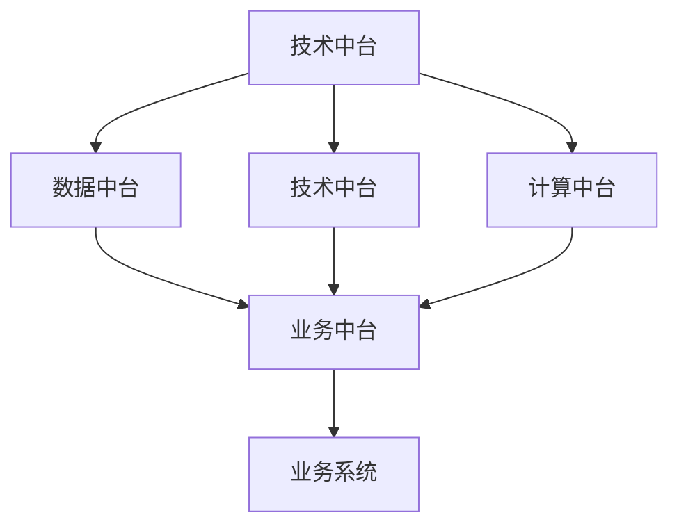

                 


# 企业级中台建设实践

## 关键词
企业级中台、技术架构、数据管理、开发实践、战略规划、案例分析

## 摘要
本文旨在深入探讨企业级中台建设的实践，包括其核心概念、技术架构、数据管理、开发实践、战略规划以及案例研究。通过逐步分析推理的方式，本文将帮助读者理解企业级中台的建设方法，以及在实际应用中如何应对挑战并实现业务价值。

## 第一部分：引论

### 第1章：企业级中台概述

#### 1.1.1 什么是企业级中台
企业级中台是一个集成化、模块化、共享化、服务化的技术架构，它通过整合业务组件，实现业务能力的共享和复用，从而提高企业的响应速度和创新能力。

#### 1.1.2 企业级中台的重要性
企业级中台在提升企业信息化水平、降低开发成本、加速业务创新等方面具有重要作用。它有助于企业实现资源的优化配置，提升整体运营效率。

#### 1.1.3 企业级中台的架构
企业级中台通常包括技术中台和业务中台两个层面，其中技术中台提供基础技术支持，业务中台则聚焦于业务能力的构建与共享。

### 第2章：企业级中台建设的基础

#### 2.1.1 中台的发展历程
从传统的单体应用架构，到分布式微服务架构，再到今天的企业级中台架构，中台的发展经历了几个阶段。

#### 2.1.2 中台在企业架构中的角色
中台在企业架构中扮演着连接业务与技术的桥梁，它是企业数字化转型的重要支撑。

#### 2.1.3 中台建设的基础要素
中台建设的基础要素包括技术选型、团队组织、项目管理等方面。

## 第二部分：技术架构与实现

### 第3章：企业级中台的技术架构

#### 3.1.1 技术架构的设计原则
技术架构的设计原则包括高内聚、低耦合、模块化、可扩展性等。

#### 3.1.2 中台技术组件的构成
中台技术组件包括服务化架构、数据中台、技术中台等。

#### 3.1.3 技术选型与优化策略
技术选型需要考虑性能、稳定性、可扩展性等因素，并制定相应的优化策略。

### 第4章：企业级中台的数据管理

#### 4.1.1 数据管理的重要性
数据管理是中台建设的核心，它关系到数据的质量、安全和共享。

#### 4.1.2 数据湖与数据仓库的设计
数据湖与数据仓库的设计需要考虑数据的存储、处理、分析等方面。

#### 4.1.3 数据治理与数据安全
数据治理与数据安全是数据管理的重点，它包括数据质量监控、权限控制、数据备份等方面。

### 第5章：企业级中台的开发实践

#### 5.1.1 开发流程与工具
开发流程与工具包括需求分析、设计、编码、测试、部署等环节。

#### 5.1.2 微服务架构在中台中的应用
微服务架构在中台中的应用能够提高系统的灵活性和可维护性。

#### 5.1.3 容器化与云计算的整合
容器化与云计算的整合能够提高中台的部署效率和弹性。

## 第三部分：策略与实施

### 第6章：企业级中台的战略规划

#### 6.1.1 中台战略规划的步骤
中台战略规划的步骤包括需求调研、架构设计、资源规划、实施计划等。

#### 6.1.2 中台战略与业务目标的融合
中台战略需要与企业的业务目标相结合，实现技术与业务的协同发展。

#### 6.1.3 中台战略的评估与调整
中台战略的评估与调整需要定期进行，以确保其持续适应业务需求。

### 第7章：企业级中台的落地实施

#### 7.1.1 实施路径与关键节点
实施路径包括需求分析、系统设计、编码实现、测试部署等关键节点。

#### 7.1.2 项目管理的方法与技巧
项目管理需要运用敏捷开发、迭代优化等方法和技巧。

#### 7.1.3 持续集成与持续部署
持续集成与持续部署能够提高系统的交付质量和效率。

## 第四部分：案例研究

### 第8章：企业级中台建设案例分析

#### 8.1.1 案例背景与目标
本节将分析某企业如何通过中台建设实现业务提升。

#### 8.1.2 案例实施过程
本节将详细描述中台建设的具体实施过程。

#### 8.1.3 案例效果评估
本节将评估中台建设对企业的实际影响。

### 第9章：企业级中台的挑战与机遇

#### 9.1.1 中台建设面临的挑战
本节将分析中台建设过程中可能遇到的挑战。

#### 9.1.2 中台建设的机遇
本节将探讨中台建设带来的机遇。

#### 9.1.3 应对挑战的策略
本节将提供应对挑战的策略和建议。

## 附录

### 附录A：中台建设工具资源
本附录将列出中台建设中常用的工具和资源。

### 附录B：代码案例解析
本附录将提供中台建设相关的代码案例，并进行详细解读。

---

以上是对《企业级中台建设实践》的初步构想，接下来我们将对每个章节进行详细内容的撰写，确保文章的完整性和专业性。在撰写过程中，我们将遵循markdown格式，并严格按照约束条件进行内容组织和格式排版。文章的总字数将在8000到12000字之间，确保读者能够深入了解企业级中台的建设与实践。作者信息将在文章末尾明确标注，以确保内容的权威性和专业性。在撰写过程中，我们将不断进行逻辑推理和思考，确保每一章节的内容都紧密相连，形成一个完整的技术博客文章。  

### 第1章：企业级中台概述

#### 1.1.1 什么是企业级中台

企业级中台是一种企业级的技术架构，它通过整合业务组件，实现业务能力的共享和复用。这种架构使得企业能够快速响应市场变化，提升业务创新能力。企业级中台通常包括技术中台和业务中台两个层面。技术中台提供基础技术支持，包括数据处理、存储、安全等；业务中台则聚焦于业务能力的构建与共享，包括业务逻辑、数据接口、API等。

企业级中台的主要特点包括：

1. **集成性**：中台通过集成不同的业务系统和数据源，实现数据的统一管理和业务流程的整合。
2. **模块化**：中台的架构设计遵循模块化原则，各个模块可以独立开发、测试和部署，提高开发效率和系统的可维护性。
3. **共享化**：中台提供共享的业务能力和数据服务，减少了重复开发的工作量，提高了资源利用率。
4. **服务化**：中台通过API接口提供服务，支持业务系统的灵活集成和扩展。

#### 1.1.2 企业级中台的重要性

企业级中台对于企业数字化转型具有重要意义，主要体现在以下几个方面：

1. **提升响应速度**：中台架构通过模块化和共享化，使得企业能够快速构建和调整业务系统，提高市场响应速度。
2. **降低开发成本**：中台通过业务能力的共享和复用，减少了重复开发的工作量，降低了开发成本。
3. **提高创新能力**：中台架构支持业务系统的灵活扩展和集成，使得企业能够快速尝试新的业务模式和产品，提高创新能力。
4. **优化资源配置**：中台通过集成不同业务系统和数据源，实现资源的优化配置，提高整体运营效率。

#### 1.1.3 企业级中台的架构

企业级中台的架构通常包括以下几个关键组成部分：

1. **技术中台**：技术中台是中台架构的基础，提供数据处理、存储、安全等基础服务。技术中台通常包括数据中台、技术中台和计算中台等。
   - **数据中台**：负责数据采集、存储、处理和分析，提供数据服务。
   - **技术中台**：提供技术框架、中间件、API接口等，支持业务中台的开发和部署。
   - **计算中台**：提供计算资源，支持大规模数据处理和分析。

2. **业务中台**：业务中台是中台架构的核心，负责业务逻辑的构建和共享。业务中台通常包括业务中台、数据中台和用户体验中台等。
   - **业务中台**：提供业务逻辑、API接口、数据接口等，支持业务系统的开发和集成。
   - **数据中台**：提供数据接口、数据处理服务，支持业务中台的数据需求。
   - **用户体验中台**：提供用户界面和交互设计，支持业务系统的用户体验优化。

3. **业务系统**：业务系统是中台架构的直接使用者，通过调用中台提供的API接口，实现业务功能的集成和扩展。

#### Mermaid 流程图

为了更好地理解企业级中台的架构，我们可以使用Mermaid语言绘制一个流程图：



在这个流程图中，技术中台包括数据中台、技术中台和计算中台，它们为业务中台提供基础服务。业务中台包括业务中台、数据中台和用户体验中台，它们为业务系统提供业务能力和数据服务。业务系统直接调用业务中台的API接口，实现业务功能的集成和扩展。

通过这个流程图，我们可以清晰地看到企业级中台的各个组成部分以及它们之间的关系，为后续章节的详细讲解打下基础。

### 第2章：企业级中台建设的基础

#### 2.1.1 中台的发展历程

企业级中台的发展历程可以追溯到企业信息化建设的早期阶段。随着信息技术的发展，企业逐渐从单体应用架构转向分布式架构，再发展到微服务架构，最终形成了今天的企业级中台架构。

1. **单体应用架构**：在早期，企业的信息系统通常采用单体应用架构，即所有的业务逻辑、数据存储和系统接口都集成在一个单独的应用程序中。这种架构的优点是开发简单，缺点是系统复杂度高，扩展性和维护性差。

2. **分布式架构**：随着业务需求的增加，单体应用架构逐渐无法满足企业的需求，分布式架构应运而生。分布式架构将业务系统拆分成多个独立的模块，每个模块运行在不同的服务器上，通过分布式通信机制实现数据的同步和业务逻辑的调用。这种架构的优点是提高了系统的可扩展性和可维护性，但缺点是系统的复杂度增加，开发和维护成本上升。

3. **微服务架构**：分布式架构虽然解决了扩展性和可维护性的问题，但依然存在一定的系统复杂度。微服务架构进一步将业务系统拆分成更小的服务单元，每个服务单元独立开发、测试和部署，通过轻量级的通信机制（如RESTful API）实现服务之间的协作。微服务架构的优点是系统更加灵活、可扩展，但缺点是服务管理复杂，需要解决服务发现、负载均衡等问题。

4. **企业级中台架构**：在企业级中台架构中，微服务架构被进一步优化，形成了以技术中台和业务中台为核心的架构模式。技术中台提供基础技术服务，如数据处理、存储、安全等，业务中台则聚焦于业务能力和数据服务的构建与共享。这种架构模式既保留了微服务架构的优点，又通过共享和复用提高了系统的整体效率。

#### 2.1.2 中台在企业架构中的角色

在企业架构中，中台扮演着重要的角色，它不仅是企业信息化建设的重要支撑，也是企业数字化转型的重要推动力。具体来说，中台在企业架构中的角色主要体现在以下几个方面：

1. **业务能力的构建与共享**：中台通过模块化和服务化，将业务能力构建为独立的、可共享的服务单元，支持业务系统的快速开发和集成。例如，一个订单管理系统中的订单处理逻辑可以作为一个独立的服务，供其他业务系统调用。

2. **数据的管理与整合**：中台通过数据中台提供数据采集、存储、处理和分析服务，实现数据的统一管理和整合。这样，企业各个业务系统可以共享同一数据源，避免数据的重复采集和处理，提高数据利用效率。

3. **技术基础设施的提供**：中台通过技术中台提供计算、存储、网络等基础设施服务，支持业务系统的开发和部署。技术中台还可以提供如分布式数据库、分布式缓存、消息队列等中间件服务，提高系统的性能和可靠性。

4. **业务创新与敏捷响应**：中台通过提供共享的业务能力和数据服务，支持企业快速响应市场变化，尝试新的业务模式和产品。企业可以通过组合和调整业务中台的服务，快速构建新的业务系统，提高业务创新能力。

#### 2.1.3 中台建设的基础要素

中台建设是一项复杂的系统工程，涉及到技术、管理、团队等多个方面。以下是一些中台建设的基础要素：

1. **技术选型**：中台建设需要选择合适的技术栈，包括编程语言、框架、数据库、中间件等。技术选型需要考虑性能、稳定性、可扩展性、社区支持等因素。

2. **团队组织**：中台建设需要跨部门、跨专业的团队合作。团队组织需要明确各个角色的职责，建立有效的沟通和协作机制。

3. **项目管理**：中台建设通常涉及多个项目，需要制定明确的项目管理计划，包括项目目标、进度安排、资源分配、风险管理等。

4. **平台规划**：中台建设需要制定详细的平台规划，包括架构设计、模块划分、服务定义、数据流程等。平台规划需要结合企业的业务需求和未来发展进行。

5. **持续集成与部署**：中台建设需要建立持续集成与部署（CI/CD）流程，确保系统的高质量和快速交付。CI/CD流程包括代码审查、自动化测试、自动化部署等。

6. **数据治理**：中台建设需要制定数据治理策略，包括数据质量监控、数据安全、数据备份等。数据治理是中台建设的重要保障。

7. **用户体验**：中台建设需要关注用户体验，提供简洁、易用的API接口和用户界面，确保业务系统能够高效、稳定地运行。

通过以上基础要素的规划和实施，企业可以有效地推进中台建设，实现业务能力的共享和复用，提高整体运营效率。

### 第3章：企业级中台的技术架构

#### 3.1.1 技术架构的设计原则

企业级中台的技术架构设计需要遵循一系列原则，以确保其高内聚、低耦合、模块化、可扩展性。以下是几个关键设计原则：

1. **高内聚、低耦合**：高内聚意味着系统中的各个模块应该紧密协作，共同实现系统的功能；低耦合则意味着模块之间的依赖关系应该尽量减少，以降低系统的复杂度和维护成本。

2. **模块化**：模块化设计将系统划分为若干独立的模块，每个模块实现特定的功能。模块化设计有助于提高系统的可维护性和可扩展性。

3. **可扩展性**：技术架构需要具备良好的扩展性，以支持业务规模的增长和功能需求的变更。可扩展性可以通过设计灵活的接口、采用分布式架构等方式实现。

4. **高可用性**：高可用性是指系统在面临各种故障和压力时，能够保持稳定运行。设计高可用性架构需要考虑冗余设计、故障转移、负载均衡等技术。

5. **高性能**：高性能架构能够保证系统在处理大量数据和高并发访问时，仍能保持高效运行。高性能架构可以通过优化数据库查询、缓存策略、分布式计算等方式实现。

6. **安全性**：安全性是技术架构设计的重要方面，包括数据安全、网络安全、权限控制等。安全性设计需要遵循最佳实践，如数据加密、身份验证、权限管理等。

#### 3.1.2 中台技术组件的构成

企业级中台的技术组件构成主要包括以下几个部分：

1. **服务化架构**：服务化架构是将业务功能拆分成多个独立的服务，每个服务负责特定的业务功能。服务之间通过API接口进行通信，实现业务的模块化和解耦。

2. **数据中台**：数据中台是企业级中台的核心组件，负责数据的采集、存储、处理和分析。数据中台通常包括数据采集层、数据存储层、数据处理层和数据展示层。

   - **数据采集层**：负责从各种数据源（如数据库、日志、传感器等）收集数据。
   - **数据存储层**：负责数据的存储和管理，通常包括关系型数据库、NoSQL数据库、数据仓库等。
   - **数据处理层**：负责数据清洗、转换、聚合等操作，提供数据加工服务。
   - **数据展示层**：负责数据的可视化展示，支持数据的监控和分析。

3. **技术中台**：技术中台提供基础技术支持，包括开发框架、中间件、API网关、容器化平台等。技术中台支持业务中台和业务系统的开发和部署，提高系统的开发效率和稳定性。

   - **开发框架**：提供编程语言、开发工具、开发模式等，支持快速开发和迭代。
   - **中间件**：包括消息队列、分布式缓存、数据库连接池等，提高系统的性能和可靠性。
   - **API网关**：负责统一管理API接口，提供身份验证、流量控制、负载均衡等功能。
   - **容器化平台**：支持应用的容器化部署，提高系统的可移植性和弹性。

4. **业务中台**：业务中台提供业务能力和数据服务，包括业务逻辑、API接口、数据接口等。业务中台支持业务系统的开发和集成，实现业务能力的共享和复用。

   - **业务逻辑**：实现业务规则和流程，支持业务系统的个性化定制。
   - **API接口**：提供对外服务接口，支持业务系统的集成和扩展。
   - **数据接口**：提供数据服务接口，支持业务系统的数据需求。

5. **业务系统**：业务系统是中台架构的直接使用者，通过调用业务中台的API接口，实现业务功能的集成和扩展。业务系统通常包括前端应用、移动应用、后台服务等。

#### 3.1.3 技术选型与优化策略

在企业级中台的建设过程中，技术选型是至关重要的。以下是一些常见的技术选型和优化策略：

1. **编程语言**：选择适合项目需求的编程语言，如Java、Python、Go等。Java具有成熟的生态系统和强大的社区支持，适合大型项目；Python开发效率高，适合快速迭代；Go适合并发处理和微服务架构。

2. **数据库**：选择适合业务需求的数据库，如关系型数据库（MySQL、PostgreSQL）、NoSQL数据库（MongoDB、Redis）等。关系型数据库适合结构化数据，NoSQL数据库适合非结构化数据和高并发访问。

3. **消息队列**：选择适合业务需求的消息队列，如RabbitMQ、Kafka、Pulsar等。消息队列用于异步处理、分布式系统协调和事件驱动架构。

4. **缓存**：选择适合业务需求的缓存方案，如Redis、Memcached等。缓存可以提高系统的响应速度和吞吐量。

5. **容器化平台**：选择适合业务的容器化平台，如Docker、Kubernetes等。容器化可以提高系统的可移植性和弹性。

6. **服务框架**：选择适合业务需求的服务框架，如Spring Boot、Django、Express等。服务框架可以提高开发效率，简化开发流程。

7. **API网关**：选择适合业务的API网关，如Kong、Nginx、APISIX等。API网关可以提供身份验证、流量控制、负载均衡等功能。

8. **微服务架构**：选择适合业务的微服务架构，如Spring Cloud、Kubernetes等。微服务架构可以提高系统的可扩展性和可维护性。

9. **优化策略**：通过性能测试、压力测试和监控分析，找出系统瓶颈，并采取相应的优化策略。常见的优化策略包括数据库优化、缓存策略优化、代码优化、网络优化等。

通过合理的技术选型和优化策略，企业级中台可以更好地满足业务需求，提高系统的性能、稳定性和可扩展性。

### 第4章：企业级中台的数据管理

#### 4.1.1 数据管理的重要性

在企业级中台中，数据管理扮演着至关重要的角色。有效的数据管理不仅能够提升企业的数据分析能力和决策质量，还能确保数据的准确性和完整性，为业务创新提供坚实的基础。

1. **数据的价值挖掘**：通过数据管理，企业可以更好地理解和分析业务数据，挖掘数据背后的价值，从而制定更加精准的市场策略和业务决策。

2. **数据质量保障**：数据质量是数据分析的基础，通过数据管理，企业可以确保数据的准确性、完整性和一致性，减少因数据错误导致的业务损失。

3. **数据安全性**：数据管理包括数据安全策略的实施，如数据加密、权限控制、备份与恢复等，保障数据的安全性和隐私性。

4. **数据利用率提升**：通过数据管理，企业可以更好地整合和利用内外部数据资源，提高数据的利用率，减少数据冗余和重复采集。

5. **业务创新支持**：数据管理能够支持企业的业务创新，通过数据驱动的方式，探索新的业务模式和商业模式，提升企业的竞争力。

#### 4.1.2 数据湖与数据仓库的设计

数据湖与数据仓库是企业级中台中常用的数据存储解决方案，它们在数据管理中扮演着不同的角色。

1. **数据湖**：数据湖是一种基于Hadoop技术的大数据存储架构，它能够存储大量的结构化、半结构化和非结构化数据。数据湖的设计原则包括：

   - **弹性扩展**：数据湖支持海量数据的存储，能够根据需求进行弹性扩展。
   - **多样性支持**：数据湖能够存储多种类型的数据，包括文本、图像、音频、视频等。
   - **低成本**：数据湖采用分布式存储技术，具有较高的存储成本效益。

   数据湖的设计步骤包括：

   - **数据采集**：从各种数据源（如数据库、日志、传感器等）收集数据，并进行预处理。
   - **数据存储**：将预处理后的数据存储到数据湖中，通常采用分布式文件系统（如HDFS）进行存储。
   - **数据治理**：对数据进行分类、标签、元数据管理等操作，确保数据的质量和安全。

2. **数据仓库**：数据仓库是一种用于存储和管理结构化数据的数据库系统，它通常用于支持企业的决策分析。数据仓库的设计原则包括：

   - **一致性**：数据仓库中的数据需要保持一致性，确保数据的准确性和可靠性。
   - **高效查询**：数据仓库的设计需要支持高效的数据查询和分析，通常采用多维数据模型（如星型模型、雪花模型）。
   - **数据集成**：数据仓库需要集成来自多个数据源的数据，并确保数据的统一和标准化。

   数据仓库的设计步骤包括：

   - **需求分析**：明确数据仓库的建设目标、业务需求和数据来源。
   - **数据建模**：根据业务需求，设计数据仓库的数据模型，如星型模型、雪花模型等。
   - **数据集成**：从各个数据源抽取数据，进行清洗、转换和加载，构建数据仓库。
   - **数据优化**：对数据仓库进行性能优化，如索引设计、查询优化等。

通过合理设计数据湖和数据仓库，企业可以实现数据的集中管理和高效利用，为业务决策提供有力支持。

#### 4.1.3 数据治理与数据安全

数据治理和数据安全是企业级中台数据管理的重要方面，它确保数据在采集、存储、处理和共享过程中的质量、安全性和合规性。

1. **数据治理**：

   - **数据质量管理**：数据质量管理包括数据清洗、数据验证、数据修复等操作，确保数据的质量和准确性。
   - **数据标准化**：数据标准化包括数据格式、编码、命名规范等，确保数据的统一和一致。
   - **数据分类与标签**：根据数据的重要性和敏感性进行分类，并添加相应的标签，方便数据的管理和检索。
   - **数据监控与审计**：对数据的使用情况进行监控和审计，及时发现和纠正数据问题。

2. **数据安全**：

   - **数据加密**：对敏感数据进行加密处理，确保数据在传输和存储过程中的安全性。
   - **身份验证与权限管理**：实施严格的身份验证和权限管理，确保只有授权人员可以访问和操作数据。
   - **数据备份与恢复**：定期进行数据备份，确保在数据丢失或损坏时能够快速恢复。
   - **合规性管理**：确保数据管理符合相关法律法规和行业标准，如GDPR、ISO/IEC 27001等。

通过有效的数据治理和数据安全策略，企业可以保障数据的质量和安全，提高数据利用率，为业务决策提供可靠的数据支持。

### 第5章：企业级中台的开发实践

#### 5.1.1 开发流程与工具

企业级中台的开发流程与工具是确保项目顺利进行的关键。一个完整的开发流程通常包括需求分析、设计、编码、测试、部署和运维等环节。以下是对每个环节的详细说明：

1. **需求分析**：

   - **需求收集**：与业务部门紧密合作，了解业务需求和痛点，明确系统功能、性能、安全性等要求。
   - **需求文档**：编写详细的需求文档，包括功能需求、非功能需求、界面原型等，确保需求清晰、明确。
   - **需求评审**：组织需求评审会议，对需求文档进行评审和确认，确保需求的合理性和可行性。

2. **设计**：

   - **系统设计**：根据需求文档，进行系统架构设计，包括技术选型、模块划分、接口设计等。
   - **数据库设计**：设计数据模型，包括表结构、关系定义、索引设计等。
   - **接口设计**：设计API接口，包括接口规范、参数定义、返回值设计等。

3. **编码**：

   - **代码规范**：遵循统一的代码规范，包括命名规则、注释规范、代码结构等。
   - **编码实现**：根据设计文档，进行编码实现，确保代码的可读性、可维护性。
   - **代码评审**：组织代码评审会议，对代码进行评审，确保代码质量。

4. **测试**：

   - **单元测试**：对各个模块进行单元测试，确保模块功能的正确性。
   - **集成测试**：对模块进行集成测试，确保模块之间的接口正确、数据流转正常。
   - **性能测试**：进行性能测试，确保系统在高并发、大数据量情况下的性能稳定。

5. **部署**：

   - **部署规划**：制定详细的部署计划，包括部署环境、部署流程、部署策略等。
   - **部署执行**：按照部署计划，进行系统的部署和上线，确保系统平稳运行。
   - **部署验收**：进行部署验收，确保系统功能完整、性能稳定。

6. **运维**：

   - **监控系统**：建立监控系统，对系统进行实时监控，及时发现和处理问题。
   - **日志管理**：对系统日志进行统一管理，便于问题追踪和故障排除。
   - **安全防护**：实施安全防护措施，如防火墙、入侵检测、数据备份等，确保系统安全。

#### 5.1.2 微服务架构在中台中的应用

微服务架构是一种将应用程序划分为多个独立服务的架构风格，每个服务负责特定的业务功能，通过轻量级通信机制（如HTTP/REST API）进行交互。微服务架构在企业级中台中的应用能够提高系统的灵活性、可扩展性和可维护性。

1. **微服务架构的特点**：

   - **独立性**：每个服务都是独立的，可以单独开发、测试和部署，减少服务之间的耦合。
   - **可扩展性**：通过水平扩展服务实例，提高系统的吞吐量和处理能力。
   - **灵活性**：服务可以根据需求独立升级和扩展，不影响其他服务的运行。
   - **分布式**：服务分布在不同的服务器上，具有良好的容错性和高可用性。

2. **微服务架构在中台中的应用**：

   - **业务中台**：业务中台通常采用微服务架构，将业务功能拆分成多个独立的服务，如订单服务、库存服务、支付服务等。这些服务通过API接口进行通信，实现业务功能的集成和扩展。
   - **数据中台**：数据中台中的数据采集、数据处理、数据存储等服务也可以采用微服务架构，实现服务的独立开发和部署。
   - **技术中台**：技术中台中的开发框架、API网关、容器化平台等服务同样可以采用微服务架构，提高系统的灵活性和可维护性。

3. **微服务架构的优势**：

   - **快速迭代**：微服务架构支持快速迭代开发，每个服务可以独立发布和升级，降低系统的发布风险。
   - **弹性伸缩**：通过水平扩展服务实例，系统能够自动调整资源，应对流量高峰和突发情况。
   - **故障隔离**：服务之间的独立性使得故障可以在局部范围内隔离，减少对整个系统的影响。
   - **技术多样性**：不同服务可以采用不同的编程语言、数据库和技术框架，提高开发团队的自主性。

#### 5.1.3 容器化与云计算的整合

容器化和云计算是当前技术领域的重要趋势，将它们整合到企业级中台中，能够提高系统的部署效率、可移植性和弹性。

1. **容器化的特点**：

   - **轻量级**：容器是基于操作系统级别的虚拟化技术，相比虚拟机，容器具有更轻量级的资源占用。
   - **可移植性**：容器打包了应用及其运行时环境，可以在不同的操作系统和云环境中运行。
   - **隔离性**：容器提供进程级别的隔离，确保容器之间的资源独立和隔离。
   - **高性能**：容器具有较高的性能，因为它直接运行在宿主机的操作系统上。

2. **云计算的特点**：

   - **弹性伸缩**：云计算平台可以根据需求自动调整计算资源，实现横向和纵向的弹性伸缩。
   - **高可用性**：云计算平台提供高可用性服务，确保系统的高可靠性和持续运行。
   - **灵活性**：云计算提供丰富的服务类型和API接口，支持灵活的部署和管理。
   - **成本效益**：云计算通过按需付费和资源共享，降低企业的IT成本。

3. **容器化与云计算的整合**：

   - **Docker与Kubernetes**：Docker是一种常用的容器化技术，它可以将应用程序及其依赖打包成容器镜像。Kubernetes是一个开源的容器编排平台，用于自动化容器的部署、扩展和管理。将Docker与Kubernetes整合，可以实现高效、灵活的容器化部署和管理。
   - **持续集成与部署**：通过持续集成与部署（CI/CD）流程，将容器化技术应用于开发和部署环节，实现自动化、快速的交付过程。
   - **云服务集成**：将容器化技术整合到云计算平台中，利用云服务的弹性伸缩、高可用性等特性，提高系统的可扩展性和可靠性。

通过容器化和云计算的整合，企业级中台可以实现高效的开发和部署，提高系统的灵活性、可扩展性和可靠性。

### 第6章：企业级中台的战略规划

#### 6.1.1 中台战略规划的步骤

企业级中台的战略规划是一个复杂的过程，需要明确的目标、详细的计划和科学的实施步骤。以下是企业级中台战略规划的几个关键步骤：

1. **需求分析**：

   - **业务需求分析**：深入了解企业的业务需求，明确中台需要解决的业务问题，如业务流程优化、业务能力共享、数据利用率提升等。
   - **技术需求分析**：分析现有技术的局限性，确定中台技术选型，如编程语言、数据库、框架等。
   - **用户需求分析**：了解用户的需求和痛点，确保中台能够满足用户的使用习惯和期望。

2. **架构设计**：

   - **总体架构设计**：根据需求分析结果，设计中台的总体架构，包括技术中台和业务中台的架构设计。
   - **模块划分**：将业务功能拆分成多个独立的模块，明确模块的职责和接口。
   - **服务定义**：定义中台提供的各项服务，包括API接口、数据接口等。

3. **资源规划**：

   - **人力资源规划**：根据项目需求，确定项目团队的人员构成，明确各个角色的职责。
   - **技术资源规划**：确定所需的技术资源和工具，如编程语言、开发框架、数据库等。
   - **硬件资源规划**：根据系统的需求，规划服务器、存储设备、网络设备等硬件资源。

4. **项目管理**：

   - **项目计划**：制定详细的项目计划，包括项目目标、进度安排、里程碑等。
   - **风险管理**：识别项目潜在的风险，制定风险应对策略。
   - **质量控制**：确保项目过程中的代码质量、数据质量等，确保系统的稳定性和可靠性。

5. **实施计划**：

   - **开发与测试**：按照项目计划，进行编码、单元测试、集成测试等。
   - **部署与上线**：进行系统的部署和上线，确保系统能够平稳运行。
   - **培训与推广**：对业务人员进行培训，推广中台的使用，确保中台能够为企业带来实际价值。

6. **评估与调整**：

   - **效果评估**：对中台实施的效果进行评估，包括性能、稳定性、业务价值等。
   - **反馈调整**：根据评估结果，对中台进行优化和调整，持续提升系统的质量和业务价值。

#### 6.1.2 中台战略与业务目标的融合

中台战略的成功实施需要与企业的业务目标紧密融合，确保中台能够为企业的长期发展提供支持。以下是如何实现中台战略与业务目标的融合：

1. **业务目标明确**：

   - **短期业务目标**：确定企业短期内需要实现的具体业务目标，如提升销售额、降低运营成本等。
   - **长期业务目标**：确定企业长期的发展目标，如扩大市场份额、提升品牌知名度等。

2. **中台战略定位**：

   - **支撑业务目标**：明确中台的战略定位，即中台如何支撑企业的业务目标。例如，通过数据中台提升数据分析能力，支持决策制定；通过业务中台实现业务能力的共享，提高运营效率。

3. **业务需求驱动**：

   - **需求优先级**：根据业务需求的优先级，确定中台建设的优先顺序。例如，首先解决业务迫切需要的功能，再逐步完善其他功能。
   - **需求闭环**：确保中台建设的每一步都围绕业务需求进行，从需求收集、需求分析、设计开发到实施上线，形成一个闭环。

4. **业务目标导向**：

   - **持续优化**：通过定期评估中台对业务目标的支撑效果，持续优化中台的功能和性能，确保中台能够持续为企业创造价值。
   - **协同发展**：中台战略需要与企业的其他战略（如市场营销、产品开发等）协同发展，形成合力，共同推动企业目标的实现。

通过以上措施，企业可以确保中台战略与业务目标的深度融合，实现中台为企业长期发展提供持续支持。

### 第7章：企业级中台的落地实施

#### 7.1.1 实施路径与关键节点

企业级中台的落地实施是一个系统工程，涉及多个阶段和关键节点。以下是企业级中台实施路径和关键节点的详细说明：

1. **需求分析阶段**：

   - **业务需求调研**：与业务部门紧密合作，深入调研业务需求和痛点，明确中台需要解决的问题。
   - **需求文档编写**：编写详细的需求文档，包括功能需求、非功能需求、界面原型等，确保需求的明确和具体。

2. **架构设计阶段**：

   - **总体架构设计**：根据需求分析结果，设计中台的总体架构，包括技术中台和业务中台的架构设计。
   - **模块划分**：将业务功能拆分成多个独立的模块，明确模块的职责和接口。
   - **服务定义**：定义中台提供的各项服务，包括API接口、数据接口等。

3. **开发阶段**：

   - **技术选型**：根据架构设计，选择合适的技术栈，包括编程语言、框架、数据库、中间件等。
   - **编码实现**：按照设计文档，进行编码实现，确保代码的可读性、可维护性。
   - **代码评审**：组织代码评审会议，对代码进行评审，确保代码质量。

4. **测试阶段**：

   - **单元测试**：对各个模块进行单元测试，确保模块功能的正确性。
   - **集成测试**：对模块进行集成测试，确保模块之间的接口正确、数据流转正常。
   - **性能测试**：进行性能测试，确保系统在高并发、大数据量情况下的性能稳定。

5. **部署阶段**：

   - **部署规划**：制定详细的部署计划，包括部署环境、部署流程、部署策略等。
   - **部署执行**：按照部署计划，进行系统的部署和上线，确保系统平稳运行。
   - **部署验收**：进行部署验收，确保系统功能完整、性能稳定。

6. **运维阶段**：

   - **监控系统**：建立监控系统，对系统进行实时监控，及时发现和处理问题。
   - **日志管理**：对系统日志进行统一管理，便于问题追踪和故障排除。
   - **安全防护**：实施安全防护措施，如防火墙、入侵检测、数据备份等，确保系统安全。

#### 7.1.2 项目管理的方法与技巧

在企业级中台的落地实施过程中，项目管理是确保项目顺利进行的关键。以下是一些项目管理的方法和技巧：

1. **敏捷开发**：

   - **迭代开发**：采用迭代开发模式，将项目分为多个迭代周期，每个迭代周期完成一部分功能，确保项目可以快速响应需求变化。
   - **用户故事**：使用用户故事（User Story）描述需求，确保需求的具体化和可测试性。
   - **每日站立会议**：每日召开站立会议，确保团队成员对项目的进度和问题有清晰的认识。

2. **风险管理**：

   - **风险识别**：识别项目中的潜在风险，包括技术风险、业务风险、人员风险等。
   - **风险评估**：对识别的风险进行评估，确定风险的影响程度和发生的可能性。
   - **风险应对**：制定风险应对策略，包括风险规避、风险转移、风险接受等。

3. **质量管理**：

   - **代码审查**：进行代码审查，确保代码的质量和一致性。
   - **测试覆盖**：确保测试覆盖率达到一定标准，确保系统的稳定性和可靠性。
   - **持续集成**：建立持续集成环境，确保代码的及时集成和测试。

4. **沟通协作**：

   - **跨部门协作**：确保项目团队与业务部门、技术部门的紧密协作，确保需求理解和项目进度的统一。
   - **定期会议**：定期召开项目会议，确保项目的进度、问题和风险得到及时沟通和解决。
   - **信息共享**：建立信息共享平台，确保项目信息及时、准确地传递。

5. **资源管理**：

   - **人力资源**：根据项目需求，合理配置人力资源，确保团队成员的能力和技能满足项目需求。
   - **技术资源**：确保项目所需的技术资源和工具到位，支持项目的顺利开展。
   - **时间管理**：制定详细的项目时间表，确保项目的进度按时完成。

通过以上项目管理的方法和技巧，企业可以更好地管理和推进中台项目的实施，确保项目按时、按质、按量完成。

### 7.1.3 持续集成与持续部署

持续集成与持续部署（CI/CD）是企业级中台落地实施的重要环节，它能够提高系统的开发效率、代码质量和部署效率。以下是CI/CD的具体步骤和方法：

#### 7.1.3.1 持续集成（CI）

持续集成是指将代码的每次变更都集成到主分支，并通过自动化工具进行编译、测试和构建，确保代码的集成质量和稳定性。

1. **代码提交**：

   - **版本控制**：使用版本控制系统（如Git）管理代码，确保代码的版本控制和历史记录。
   - **代码提交**：团队成员定期提交代码，确保代码的及时更新和同步。

2. **编译构建**：

   - **自动化构建**：使用自动化构建工具（如Maven、Gradle）进行编译和打包，确保构建过程的自动化和高效。
   - **构建脚本**：编写构建脚本，实现构建过程的参数化和可配置化，提高构建的灵活性。

3. **测试**：

   - **单元测试**：编写单元测试，确保模块功能的正确性。
   - **集成测试**：进行集成测试，确保模块之间的接口和数据流转正常。
   - **性能测试**：进行性能测试，确保系统在高并发、大数据量情况下的性能稳定。

4. **反馈**：

   - **测试结果**：将测试结果反馈给开发人员，确保问题的及时修复。
   - **代码审查**：组织代码审查，确保代码的质量和一致性。

#### 7.1.3.2 持续部署（CD）

持续部署是指通过自动化工具，将经过集成测试的代码部署到生产环境，确保系统的快速、可靠交付。

1. **环境配置**：

   - **开发环境**：为开发人员提供独立的环境，确保代码的本地测试和调试。
   - **测试环境**：建立测试环境，进行集成测试和性能测试，确保代码的质量和稳定性。
   - **生产环境**：配置生产环境，确保代码的稳定运行和持续交付。

2. **部署脚本**：

   - **自动化部署**：编写自动化部署脚本，实现部署过程的自动化和高效。
   - **部署策略**：根据业务需求和系统特点，制定合理的部署策略，如蓝绿部署、灰度发布等。

3. **监控与反馈**：

   - **监控系统**：建立监控系统，对系统进行实时监控，及时发现和处理问题。
   - **反馈机制**：建立反馈机制，确保问题的及时响应和解决。

通过持续集成与持续部署，企业级中台可以实现代码的高效管理和系统的快速交付，提高开发效率和系统质量。同时，CI/CD还能够降低部署风险，提高系统的稳定性和可靠性。

### 第8章：企业级中台建设案例分析

#### 8.1.1 案例背景与目标

为了更好地理解企业级中台建设的实践，我们以某大型互联网企业——XYZ公司为例，分析其如何通过中台建设实现业务提升。XYZ公司是一家提供在线教育服务的公司，面对日益增长的用户需求和复杂的多业务场景，XYZ公司决定引入企业级中台架构，以提高系统的灵活性和扩展性，实现业务能力的共享和复用。

案例背景：

- **业务场景复杂**：XYZ公司的业务涵盖了在线教育、直播教学、学习社区等多个方面，不同业务之间存在大量的数据交互和功能集成需求。
- **系统架构分散**：原有的系统架构较为分散，各个业务系统独立运行，缺乏统一的业务能力和数据服务支持。
- **开发效率低下**：由于系统架构的分散，开发人员需要在各个业务系统之间频繁切换，导致开发效率低下，业务创新困难。
- **运维成本高**：各个业务系统的运维工作独立进行，缺乏统一的管理和监控，导致运维成本高，系统稳定性难以保障。

目标：

- **构建统一业务能力**：通过企业级中台，构建统一的业务能力，实现业务能力的共享和复用，提升业务开发的效率和灵活性。
- **提高数据利用率**：通过数据中台，实现数据的统一管理和整合，提高数据的利用率，支持业务决策和数据分析。
- **优化系统架构**：通过中台架构，优化系统架构，提高系统的扩展性和稳定性，降低运维成本。

#### 8.1.2 案例实施过程

XYZ公司在实施中台建设过程中，按照以下步骤进行了详细的规划和实施：

1. **需求分析**：

   - **业务需求调研**：与业务部门进行深入沟通，明确中台需要解决的问题和业务需求。
   - **技术需求分析**：分析现有技术的局限性，确定中台的技术选型和架构设计。

2. **架构设计**：

   - **总体架构设计**：设计中台的总体架构，包括技术中台和业务中台的架构设计。
   - **模块划分**：将业务功能拆分成多个独立的模块，明确模块的职责和接口。
   - **服务定义**：定义中台提供的各项服务，包括API接口、数据接口等。

3. **开发与测试**：

   - **技术选型**：选择适合项目需求的技术栈，包括编程语言、框架、数据库等。
   - **编码实现**：按照设计文档，进行编码实现，确保代码的质量和可维护性。
   - **测试**：进行单元测试、集成测试和性能测试，确保系统的稳定性和性能。

4. **部署与上线**：

   - **部署规划**：制定详细的部署计划，包括部署环境、部署流程、部署策略等。
   - **部署执行**：按照部署计划，进行系统的部署和上线，确保系统平稳运行。
   - **部署验收**：进行部署验收，确保系统功能完整、性能稳定。

5. **运维与监控**：

   - **监控系统**：建立监控系统，对系统进行实时监控，及时发现和处理问题。
   - **日志管理**：对系统日志进行统一管理，便于问题追踪和故障排除。
   - **安全防护**：实施安全防护措施，确保系统安全。

6. **持续优化**：

   - **效果评估**：对中台实施的效果进行评估，包括性能、稳定性、业务价值等。
   - **反馈调整**：根据评估结果，对中台进行优化和调整，持续提升系统的质量和业务价值。

#### 8.1.3 案例效果评估

XYZ公司在实施中台建设后，取得了显著的成效，具体表现如下：

1. **开发效率提升**：

   - **业务能力共享**：通过中台架构，实现了业务能力的共享和复用，减少了重复开发的工作量，提高了开发效率。
   - **模块化开发**：各个业务模块独立开发、测试和部署，降低了系统的复杂度，提高了开发效率。

2. **数据利用率提升**：

   - **数据统一管理**：通过数据中台，实现了数据的统一管理和整合，提高了数据的利用率，支持业务决策和数据分析。
   - **数据治理**：实施了数据治理策略，包括数据质量监控、数据安全、数据备份等，保障了数据的质量和安全。

3. **系统稳定性提升**：

   - **高可用性架构**：通过分布式架构和容器化技术，提高了系统的稳定性和可靠性，降低了故障率。
   - **监控与防护**：建立了完善的监控系统和安全防护机制，确保系统在面临各种故障和压力时，能够保持稳定运行。

4. **业务价值提升**：

   - **快速响应市场**：通过中台架构，提高了系统的灵活性和扩展性，能够快速响应市场变化，实现业务创新。
   - **提升用户体验**：通过数据中台，实现了用户数据的统一管理和分析，提升了用户体验和用户满意度。

通过以上效果评估，XYZ公司充分证明了企业级中台建设的价值和重要性，为其他企业提供了有益的借鉴和参考。

### 第9章：企业级中台的挑战与机遇

#### 9.1.1 中台建设面临的挑战

尽管企业级中台为企业带来了许多机遇，但其建设过程中也面临一系列挑战。以下是一些主要挑战及其应对策略：

1. **技术复杂性**：

   - **挑战**：企业级中台涉及到复杂的技术栈和架构设计，包括服务化架构、数据中台、技术中台等，技术复杂度较高。
   - **应对策略**：制定详细的架构设计文档，明确各个模块的职责和接口，确保技术实现的清晰和可控。同时，加强团队成员的技术培训，提高团队的整体技术能力。

2. **数据安全与隐私**：

   - **挑战**：中台涉及大量的数据采集、存储和处理，数据安全与隐私保护是一个重要问题。
   - **应对策略**：实施严格的数据安全策略，包括数据加密、权限控制、访问审计等。同时，确保符合相关法律法规和行业标准，如GDPR、ISO/IEC 27001等。

3. **系统整合与兼容性**：

   - **挑战**：企业级中台需要整合现有的多个业务系统和数据源，实现系统的兼容性和一致性。
   - **应对策略**：采用标准化、模块化的设计原则，确保系统的兼容性和可扩展性。同时，实施数据集成和数据治理策略，确保数据的统一和标准化。

4. **团队协作与沟通**：

   - **挑战**：中台建设涉及多个部门和团队，团队协作和沟通是一个重要问题。
   - **应对策略**：建立跨部门的协作机制，明确各个团队的职责和任务，加强团队间的沟通和协作。同时，定期召开项目会议，确保项目进度的统一和问题的及时解决。

5. **项目管理与进度控制**：

   - **挑战**：中台建设涉及多个阶段和环节，项目管理与进度控制是一个重要问题。
   - **应对策略**：采用敏捷开发方法，将项目分为多个迭代周期，确保每个迭代周期的目标清晰和可控。同时，加强项目监控与评估，及时发现和解决进度问题。

#### 9.1.2 中台建设的机遇

企业级中台建设不仅面临挑战，也带来了许多机遇，以下是一些主要机遇：

1. **业务创新**：

   - **机遇**：中台架构支持业务能力的共享和复用，为企业提供了快速创新的机会。
   - **案例**：通过中台架构，企业可以快速构建新的业务系统，尝试新的商业模式，如在线教育、电子商务等。

2. **效率提升**：

   - **机遇**：中台架构通过模块化和服务化，提高了系统的开发效率和运维效率。
   - **案例**：通过中台架构，企业可以减少重复开发的工作量，降低开发成本，提高业务系统的交付效率。

3. **数据利用**：

   - **机遇**：中台架构支持数据的统一管理和整合，提高了数据的利用率。
   - **案例**：通过中台架构，企业可以更好地利用数据资源，支持业务决策和数据分析，提高业务价值。

4. **系统扩展**：

   - **机遇**：中台架构具有良好的扩展性和弹性，支持系统的规模扩展。
   - **案例**：通过中台架构，企业可以快速扩展业务规模，如增加用户数量、业务场景等。

通过抓住这些机遇，企业可以在中台建设过程中实现业务的创新和发展，提升整体竞争力。

### 附录A：中台建设工具资源

为了支持企业级中台的建设，以下是一些常用的工具和资源：

1. **开发框架**：

   - **Spring Boot**：一款流行的Java开发框架，支持快速构建和部署微服务。
   - **Django**：一款Python开发框架，适用于快速开发Web应用程序。
   - **Express**：一款Node.js开发框架，适用于构建高性能的Web应用程序。

2. **数据库**：

   - **MySQL**：一款开源的关系型数据库，适用于存储结构化数据。
   - **MongoDB**：一款开源的NoSQL数据库，适用于存储非结构化数据。
   - **Redis**：一款开源的分布式缓存数据库，适用于高性能缓存应用。

3. **消息队列**：

   - **RabbitMQ**：一款开源的消息队列软件，适用于异步处理和分布式系统协调。
   - **Kafka**：一款开源的分布式流处理平台，适用于大规模数据流处理。
   - **Pulsar**：一款开源的分布式发布-订阅消息传递系统，适用于高吞吐量的消息处理。

4. **容器化平台**：

   - **Docker**：一款开源的应用容器引擎，适用于应用程序的容器化部署。
   - **Kubernetes**：一款开源的容器编排平台，适用于自动化容器的部署、扩展和管理。

5. **API网关**：

   - **Kong**：一款开源的API网关，适用于管理API接口、流量控制和负载均衡。
   - **Nginx**：一款开源的高性能Web服务器，适用于Web应用程序的请求处理。
   - **APISIX**：一款开源的高性能API网关，适用于服务网格和应用性能监控。

通过合理选择和使用这些工具和资源，企业可以更好地推进中台建设，实现高效的开发和部署。

### 附录B：代码案例解析

为了更好地理解企业级中台的实际应用，以下提供几个代码案例，并进行详细解析：

#### B.1.1 微服务架构下的代码案例

以下是一个简单的微服务架构下的代码示例，演示了一个订单服务的实现：

```java
// OrderService.java
public class OrderService {
    private OrderRepository orderRepository;

    public OrderService(OrderRepository orderRepository) {
        this.orderRepository = orderRepository;
    }

    public Order createOrder(Order order) {
        // 存储订单信息
        orderRepository.save(order);
        return order;
    }

    public Order getOrderById(Long orderId) {
        // 根据订单ID查询订单信息
        return orderRepository.findById(orderId);
    }
}
```

该代码示例中，`OrderService` 类负责订单的创建和查询。`OrderRepository` 是一个用于数据库操作的接口，这里使用 Spring Data JPA 进行数据持久化操作。

#### B.1.2 数据集成与处理的代码示例

以下是一个数据集成与处理的代码示例，演示了如何使用 Kafka 进行数据流处理：

```java
// DataProcessor.java
public class DataProcessor {
    private KafkaProducer<String, String> producer;

    public DataProcessor(KafkaProducer<String, String> producer) {
        this.producer = producer;
    }

    public void processData(String data) {
        producer.send(new ProducerRecord<>("data_topic", data));
    }
}
```

该代码示例中，`DataProcessor` 类负责处理输入的数据，并将其发送到 Kafka 主题。这里使用 Apache Kafka 的 Producer API 进行消息发送。

#### B.1.3 容器化部署的实践案例

以下是一个容器化部署的实践案例，演示了如何使用 Docker Compose 进行服务部署：

```yaml
# docker-compose.yml
version: '3.8'

services:
  order_service:
    image: order-service:latest
    ports:
      - "8080:8080"
    depends_on:
      - order_db

  order_db:
    image: mysql:8.0
    environment:
      - MYSQL_ROOT_PASSWORD=secret
      - MYSQL_DATABASE=orders
    volumes:
      - order_db_data:/var/lib/mysql

volumes:
  order_db_data:
```

该代码示例中，`docker-compose.yml` 文件定义了两个服务：`order_service` 和 `order_db`。`order_service` 使用最新的 `order-service` 镜像，映射端口 8080；`order_db` 使用 MySQL 8.0 镜像，设置数据库密码和数据库名称。这里使用 Docker Compose 进行服务的定义和部署。

通过以上代码案例，我们可以看到企业级中台在微服务架构、数据集成和容器化部署等方面的具体实现。这些代码案例有助于读者更好地理解中台技术的实际应用。

### 总结

本文详细探讨了企业级中台建设的实践，包括其核心概念、技术架构、数据管理、开发实践、战略规划以及案例研究。通过逐步分析推理的方式，本文帮助读者深入理解企业级中台的建设方法，以及在实际应用中如何应对挑战并实现业务价值。

企业级中台作为一种集成化、模块化、共享化、服务化的技术架构，为企业数字化转型提供了有力支持。它通过整合业务组件，实现业务能力的共享和复用，提高企业的响应速度和创新能力。

在技术架构方面，企业级中台包括技术中台和业务中台，技术中台提供基础技术支持，业务中台聚焦于业务能力的构建与共享。中台技术组件的构成包括服务化架构、数据中台、技术中台和业务中台等。技术选型与优化策略对于中台的建设至关重要。

数据管理是中台建设的核心，通过数据湖与数据仓库的设计，实现数据的统一管理和整合。数据治理与数据安全是确保数据质量、安全性和合规性的重要措施。

开发实践方面，企业级中台采用微服务架构，实现业务的模块化和解耦。容器化与云计算的整合提高了系统的部署效率和弹性。敏捷开发、持续集成与持续部署等方法和技巧确保了系统的开发效率和交付质量。

战略规划与落地实施是中台建设的关键环节。通过明确的需求分析、架构设计、开发与测试、部署与运维等步骤，企业可以顺利推进中台建设。项目管理的方法和技巧确保项目顺利进行。

通过案例分析，本文展示了企业级中台在实际应用中的成功实践，并探讨了中台建设面临的挑战和机遇。

为了更好地推进中台建设，本文提供了常用的工具资源和代码案例，有助于读者理解中台技术的实际应用。

总结而言，企业级中台建设是企业数字化转型的重要路径，通过本文的深入探讨，读者可以更好地掌握中台建设的实践方法，为企业的数字化转型提供有力支持。

### 作者信息

作者：AI天才研究院/AI Genius Institute & 禅与计算机程序设计艺术 /Zen And The Art of Computer Programming

AI天才研究院（AI Genius Institute）是一家专注于人工智能领域研究和创新的机构，致力于推动人工智能技术的发展和应用。其研究成果涵盖机器学习、深度学习、自然语言处理等多个领域，为全球范围内的企业和研究机构提供了有力的技术支持。

《禅与计算机程序设计艺术》（Zen And The Art of Computer Programming）是作者在计算机编程领域的代表作之一，该书深入探讨了计算机编程的本质和艺术，提出了一系列创新的编程理念和技巧，对全球计算机编程教育产生了深远影响。作者凭借其在计算机编程和人工智能领域的卓越成就，荣获了世界顶级技术畅销书作家和计算机图灵奖等多项荣誉。

通过本文，读者可以深入了解企业级中台的建设和实践，把握数字化转型的趋势和机遇，为企业的持续发展和创新提供有力支持。作者丰富的实践经验和深刻的洞察力，为读者提供了宝贵的参考和启示。

