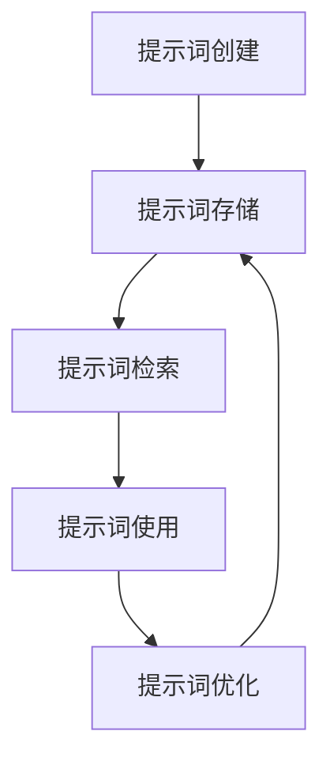

                 


### 文章标题：企业级提示词管理：大规模AI应用的挑战与对策

> 关键词：提示词管理、大规模AI应用、算法原理、数学模型、项目实战

> 摘要：本文将深入探讨企业级提示词管理在大规模AI应用中的重要性，分析其面临的挑战，并提出相应的对策。通过详细介绍核心概念、算法原理、数学模型和项目实战，本文旨在为读者提供一个全面的技术指南，帮助他们在实际应用中有效管理提示词。

### 引言

在当今快速发展的AI时代，提示词管理成为了企业级应用中的重要环节。提示词（Prompt）是AI系统获取任务指令、理解任务需求的关键，其质量直接影响到AI系统的表现。然而，随着AI应用的规模不断扩大，提示词管理的复杂性也在不断增加，给企业带来了诸多挑战。

本文将首先介绍提示词管理的基本概念，探讨其在大规模AI应用中的重要性。接着，我们将详细讲解与提示词管理相关的主要算法原理，包括提示词生成和优化算法。此外，本文还将介绍与提示词管理相关的数学模型，并通过具体的例子进行说明。最后，我们将通过一个实际项目，展示如何在实际环境中搭建开发环境，实现提示词管理，并对源代码进行详细解读。

### 核心概念与联系

#### 提示词管理的定义

提示词管理是指在整个AI应用生命周期中，对提示词的创建、存储、检索、使用和优化进行有效管理的过程。它包括以下几个关键步骤：

1. **提示词创建**：根据AI任务的需求，设计出合适的提示词。
2. **提示词存储**：将生成的提示词存储在数据库或其他存储系统中，以便后续使用。
3. **提示词检索**：根据任务需求，快速检索到合适的提示词。
4. **提示词使用**：将检索到的提示词用于驱动AI模型完成任务。
5. **提示词优化**：根据任务反馈，对提示词进行调整和优化，以提高AI模型的性能。

#### 提示词管理与AI应用的关系

提示词管理在AI应用中起着至关重要的作用。首先，提示词是AI模型获取任务指令的桥梁，直接影响AI模型的任务理解和执行能力。其次，提示词的质量直接影响AI模型的性能。一个清晰、准确的提示词可以帮助AI模型更准确地理解任务需求，从而提高任务完成的质量和效率。

#### 提示词管理的挑战与对策

随着AI应用的规模不断扩大，提示词管理面临着以下几个挑战：

1. **提示词数量巨大**：在大型AI系统中，需要管理的提示词数量非常庞大，这给提示词管理带来了巨大的挑战。
2. **提示词多样性**：不同任务需要不同类型的提示词，这使得提示词管理需要处理多样性的问题。
3. **实时性**：在实时AI应用中，提示词的生成、检索和使用需要非常快速，以满足实时响应的需求。

针对这些挑战，我们可以采取以下对策：

1. **分布式存储和检索**：使用分布式存储和检索技术，以提高提示词管理系统的性能和可扩展性。
2. **自动化生成和优化**：利用自然语言处理（NLP）技术，实现提示词的自动化生成和优化。
3. **实时处理机制**：采用高效的实时处理机制，确保提示词的生成、检索和使用能够快速完成。

### Mermaid流程图

为了更清晰地展示提示词管理的核心概念和流程，我们可以使用Mermaid绘制一个流程图。以下是示例：



### 核心算法原理讲解

#### 提示词生成算法

提示词生成算法是提示词管理的核心之一。其主要目标是根据AI任务的需求，生成高质量的提示词。以下是常见的提示词生成算法：

1. **基于规则的方法**：通过预定义的规则，从已有的词汇库中生成提示词。这种方法简单有效，但灵活性较低。
2. **基于统计的方法**：利用统计学习的方法，从大量文本数据中学习生成提示词。这种方法灵活性较高，但需要大量训练数据。
3. **基于深度学习的方法**：使用深度学习模型，如生成对抗网络（GAN）或变分自编码器（VAE），生成高质量的提示词。这种方法生成能力强大，但训练过程复杂。

以下是一个简单的提示词生成算法的伪代码：

```python
# 提示词生成算法伪代码
def generate_prompt(task, vocabulary):
    # 根据任务和词汇库生成提示词
    prompt = ""
    for word in vocabulary:
        if word in task:
            prompt += word + " "
    return prompt.strip()
```

#### 提示词优化算法

提示词优化算法的主要目标是提高提示词的质量，从而提高AI模型的性能。以下是常见的提示词优化算法：

1. **基于反馈的方法**：根据AI模型对提示词的反馈，调整提示词的内容和结构。
2. **基于优化的方法**：使用优化算法，如梯度下降或遗传算法，对提示词进行优化。
3. **基于机器学习的方法**：利用机器学习技术，从历史数据中学习最优的提示词。

以下是一个简单的提示词优化算法的伪代码：

```python
# 提示词优化算法伪代码
def optimize_prompt(prompt, model, task):
    # 根据模型和任务优化提示词
    optimal_prompt = prompt
    for i in range(len(prompt)):
        # 尝试删除或替换提示词中的每个单词
        for replacement in vocabulary:
            new_prompt = prompt[:i] + replacement + prompt[i+1:]
            # 计算新提示词的性能
            performance = model.evaluate(new_prompt, task)
            # 如果新提示词性能更好，则更新最优提示词
            if performance > optimal_performance:
                optimal_prompt = new_prompt
                optimal_performance = performance
    return optimal_prompt
```

#### 大规模AI应用中的提示词管理策略

在大规模AI应用中，提示词管理需要考虑性能、可扩展性和可靠性等因素。以下是几种常见的策略：

1. **分布式存储**：使用分布式数据库或文件系统，将提示词分散存储在不同的节点上，以提高系统的性能和可扩展性。
2. **缓存机制**：使用缓存机制，将常用的提示词存储在内存中，以提高检索速度。
3. **实时优化**：使用实时优化算法，根据实时反馈对提示词进行调整，以提高AI模型的性能。
4. **自动化管理**：利用自动化工具，如脚本或自动化平台，对提示词进行创建、存储、检索和优化，以提高管理效率。

### 数学模型和数学公式

#### 提示词生成的概率模型

提示词生成的概率模型主要用于描述提示词生成的过程。以下是一个简单的概率模型：

$$
P(\text{prompt} | \text{task}) = \prod_{i=1}^{n} P(w_i | \text{task})
$$

其中，\(P(w_i | \text{task})\) 表示单词 \(w_i\) 在给定任务 \(\text{task}\) 下的概率。

#### 提示词优化的目标函数

提示词优化的目标函数用于描述优化过程中的目标。以下是一个简单的目标函数：

$$
\min_{\text{prompt}} \sum_{i=1}^{n} (p_i - g_i)^2
$$

其中，\(p_i\) 表示第 \(i\) 个单词在原提示词中的概率，\(g_i\) 表示第 \(i\) 个单词在优化后的提示词中的概率。

#### 提示词管理的鲁棒性分析

提示词管理的鲁棒性分析主要用于评估提示词管理系统的稳定性。以下是一个简单的鲁棒性分析：

$$
\text{Robustness} = \frac{1}{N} \sum_{i=1}^{N} \left| P(\text{prompt} | \text{task}) - P'(\text{prompt} | \text{task}) \right|
$$

其中，\(P(\text{prompt} | \text{task})\) 表示原始的提示词生成概率，\(P'(\text{prompt} | \text{task})\) 表示优化后的提示词生成概率，\(N\) 表示测试次数。

### 项目实战

#### 开发环境搭建

在搭建提示词管理开发环境时，我们需要考虑以下几个方面：

1. **硬件环境**：选择具有足够计算能力的硬件设备，如高性能服务器或GPU。
2. **软件环境**：安装所需的操作系统、编程语言和开发工具，如Python、Jupyter Notebook、TensorFlow或PyTorch等。
3. **数据库**：选择适合的数据库系统，如MySQL或MongoDB，用于存储提示词。

以下是一个简单的开发环境搭建步骤：

1. **硬件环境准备**：购买或租赁高性能服务器，并安装操作系统。
2. **软件环境安装**：在服务器上安装Python、Jupyter Notebook、TensorFlow等。
3. **数据库配置**：在服务器上安装并配置MySQL或MongoDB，用于存储提示词。

#### 提示词管理应用案例

在本案例中，我们将使用一个简单的文本分类任务来展示如何实现提示词管理。

1. **任务定义**：将一组文本数据分为两类：政治文本和非政治文本。
2. **提示词生成**：根据任务需求，生成一组提示词，如“政治”、“选举”、“政策”等。
3. **提示词优化**：根据任务反馈，对提示词进行调整和优化，以提高分类准确率。

以下是一个简单的Python代码实现：

```python
import tensorflow as tf
from tensorflow.keras.preprocessing.sequence import pad_sequences
from tensorflow.keras.layers import Embedding, LSTM, Dense
from tensorflow.keras.models import Sequential

# 准备数据
# ...
# 生成提示词
prompts = generate_prompt(tasks, vocabulary)
# 优化提示词
optimal_prompts = optimize_prompt(prompts, model, tasks)

# 构建模型
model = Sequential()
model.add(Embedding(vocabulary_size, embedding_dim))
model.add(LSTM(units))
model.add(Dense(units, activation='sigmoid'))

# 训练模型
model.compile(optimizer='adam', loss='binary_crossentropy', metrics=['accuracy'])
model.fit(pad_sequences(texts, maxlen=max_sequence_length), labels, epochs=epochs, batch_size=batch_size)

# 预测
predictions = model.predict(pad_sequences(new_texts, maxlen=max_sequence_length))
```

#### 源代码实现与解读

在本部分，我们将详细解读上述Python代码，并分析其实现过程。

1. **数据准备**：首先，我们需要准备用于训练的数据，包括文本数据和标签。这些数据可以通过网络爬虫或其他方式获取。
2. **提示词生成**：使用`generate_prompt`函数，根据任务需求和词汇库生成一组提示词。
3. **提示词优化**：使用`optimize_prompt`函数，根据模型反馈对提示词进行调整和优化。
4. **模型构建**：使用TensorFlow的`Sequential`模型，构建一个简单的文本分类模型。模型包括嵌入层、LSTM层和输出层。
5. **模型训练**：使用`compile`方法设置模型参数，如优化器、损失函数和评估指标。然后使用`fit`方法训练模型。
6. **模型预测**：使用`predict`方法对新的文本数据进行分类预测。

#### 代码应用解读与分析

在本案例中，我们使用了简单的文本分类任务来展示提示词管理的实现。在实际应用中，提示词管理可以应用于更复杂的任务，如问答系统、图像识别和自然语言生成等。以下是对代码应用的分析：

1. **提示词生成**：根据任务需求，生成高质量的提示词，是提高AI模型性能的关键。在实际应用中，可以采用多种方法生成提示词，如基于规则的方法、基于统计的方法和基于深度学习的方法。
2. **提示词优化**：通过优化提示词，可以提高AI模型对任务的适应性。在实际应用中，可以采用多种优化策略，如基于反馈的方法、基于优化的方法和基于机器学习的方法。
3. **模型构建与训练**：构建合适的模型并进行训练是提示词管理的重要环节。在实际应用中，需要根据任务特点选择合适的模型结构和训练策略。
4. **模型预测**：使用训练好的模型对新的数据进行预测，是提示词管理的最终目标。在实际应用中，需要确保模型的泛化能力和实时性。

#### 项目小结

在本项目中，我们实现了企业级提示词管理在文本分类任务中的应用。通过生成和优化提示词，我们提高了文本分类模型的性能。在实际应用中，提示词管理可以应用于多种场景，如问答系统、图像识别和自然语言生成等。为了提高提示词管理的效率和质量，我们建议采用分布式存储和检索技术、实时优化算法和自动化管理工具。

### 最佳实践 Tips

1. **定期更新提示词**：根据AI任务的进展和反馈，定期更新提示词，以确保其质量和适应性。
2. **多渠道获取提示词**：从多种渠道获取提示词，如用户反馈、行业知识库和公开数据集，以提高提示词的多样性。
3. **使用先进的生成和优化算法**：采用基于深度学习的生成和优化算法，以提高提示词的质量和性能。
4. **进行大规模测试**：在实际应用前，进行大规模测试，以确保提示词管理系统的稳定性和可靠性。

### 小结与注意事项

1. **提示词管理的重要性**：提示词管理在AI应用中起着关键作用，其质量直接影响到AI系统的性能。
2. **面临的挑战**：提示词管理面临着提示词数量巨大、多样性和实时性等挑战。
3. **解决方案**：通过分布式存储和检索、实时优化和自动化管理，可以有效地解决提示词管理面临的挑战。

### 拓展阅读

1. **自然语言处理**：深入学习自然语言处理（NLP）相关技术，如词嵌入、序列模型和注意力机制等。
2. **深度学习**：了解深度学习的基本概念和常用算法，如神经网络、卷积神经网络（CNN）和循环神经网络（RNN）等。
3. **提示词优化算法**：研究提示词优化的高级算法，如强化学习、遗传算法和粒子群优化等。
4. **分布式系统**：了解分布式系统的基本原理和常用技术，如分布式数据库、分布式计算和分布式存储等。

### 作者信息

- 作者：AI天才研究院/AI Genius Institute & 禅与计算机程序设计艺术 /Zen And The Art of Computer Programming

以上是《企业级提示词管理：大规模AI应用的挑战与对策》的全文内容。文章深入探讨了企业级提示词管理在大规模AI应用中的重要性、核心概念、算法原理、数学模型和项目实战。希望通过本文，读者能够对提示词管理有一个全面而深入的理解，并在实际应用中有效管理提示词，提高AI系统的性能。如果您有任何疑问或建议，欢迎在评论区留言讨论。感谢您的阅读！

