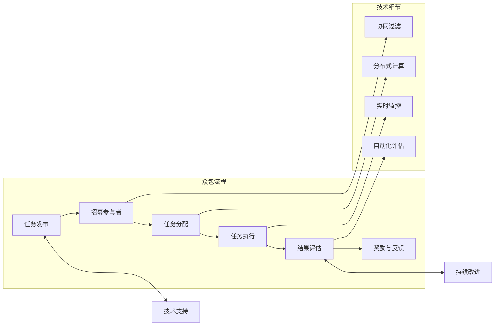

                 

## 文章标题：众包开发平台：利用群体智慧解决技术难题

### 关键词：众包、群体智慧、开发平台、技术难题、算法、数学模型

> **摘要**：
本文旨在深入探讨众包开发平台的工作原理及其如何利用群体智慧解决复杂的技术难题。通过回顾众包平台的发展历史，分析群体智慧的基本原理，阐述众包开发平台的架构和核心算法，结合实际项目案例，本文将全面解析众包技术在现代软件开发中的应用价值，并提出未来发展趋势和挑战。

---

## 目录大纲

### 第一部分：核心概念与联系

1. **第1章** 众包开发平台概述
   1.1 众包开发平台的概念与原理
   1.2 众包与群体智慧
   1.3 Mermaid流程图：众包开发平台的工作流程

2. **第2章** 众包平台发展历史
   2.1 众包平台的起源
   2.2 众包平台的发展里程碑

3. **第3章** 群体智慧原理
   3.1 分布式问题求解
   3.2 协同过滤与集体智能

### 第二部分：众包平台架构与实现

4. **第4章** 众包开发平台架构
   4.1 平台核心模块
   4.2 任务发布与分配
   4.3 任务执行与监控
   4.4 数据收集与结果评估

5. **第5章** 核心算法原理讲解
   5.1 优化算法
   5.2 机器学习算法

6. **第6章** 数学模型与公式
   6.1 数学模型概述
   6.2 LaTeX公式示例
   6.3 数学公式详细讲解

7. **第7章** 项目实战
   7.1 实际案例介绍
   7.2 开发环境搭建
   7.3 源代码实现
   7.4 代码解读与分析
   7.5 项目小结

8. **第8章** 挑战与未来趋势
   8.1 当前挑战
   8.2 未来发展趋势

---

接下来，我们将按照这个大纲逐步展开讨论，每章内容都将详细深入，确保文章结构清晰、逻辑严密，能够让读者全面理解众包开发平台及其技术原理。

---

### 引言

在当今快速发展的科技时代，技术创新的速度越来越快，复杂性日益增加，许多传统方法已经无法有效应对新兴的技术难题。因此，寻找新的解决途径变得尤为重要。众包开发平台作为一种新兴的技术解决方案，正日益受到广泛关注。它通过将复杂的技术问题分解为可管理的子任务，利用群体智慧的力量来解决这些难题。

本文旨在探讨众包开发平台的工作原理及其如何通过群体智慧解决技术难题。首先，我们将介绍众包开发平台的基本概念，并回顾其发展历史。随后，我们将深入讨论群体智慧的基本原理，包括分布式问题求解、协同过滤和集体智能等。接下来，本文将详细解析众包开发平台的核心架构，并讲解平台中使用的核心算法，如优化算法和机器学习算法。为了更好地理解这些概念，我们将使用Mermaid流程图展示众包开发平台的工作流程。

随后，本文将通过实际案例展示如何使用众包开发平台解决技术难题，包括开发环境搭建、源代码实现和代码解读。最后，我们将讨论众包开发平台面临的挑战和未来发展趋势，为读者提供一个全面的视角。

通过本文的深入探讨，我们希望读者能够对众包开发平台及其在技术难题解决中的应用有一个全面、深入的理解，从而更好地掌握这一新兴技术。

### 第1章：众包开发平台概述

#### 1.1 众包开发平台的概念与原理

**定义**：众包（Crowdsourcing）是指利用网络平台将特定的任务或项目发布给广泛的参与者，通过他们的共同努力来完成原本可能由单一团队或个人完成的任务。众包开发平台则是在这一基础上发展起来的，专门为软件开发项目设计的众包系统。

**原理**：众包开发平台的工作原理主要基于以下几个核心要素：

1. **任务分解**：复杂的软件开发任务被分解成多个子任务，每个子任务都能够独立完成，并且具有一定的可并行性。
2. **参与者招募**：平台通过发布任务信息，吸引有能力的参与者加入项目。这些参与者可以是独立开发者、团队或企业。
3. **任务分配**：平台根据参与者的能力和任务要求，将子任务分配给合适的参与者。
4. **协作与监控**：参与者在线协作完成任务，平台提供实时监控和沟通工具，确保任务的顺利进行。
5. **结果评估与反馈**：完成任务的参与者提交结果，平台对结果进行评估，并根据评估结果给予相应的奖励或反馈。

**优势**：众包开发平台具有以下几个显著优势：

1. **扩展性**：通过众包，项目可以快速招募到大量具备不同技能的参与者，从而提高项目的扩展性和灵活性。
2. **创新性**：多样化的参与者能够带来不同的视角和解决方案，有助于提高项目的创新性。
3. **成本效益**：众包降低了项目的开发成本，特别是在需要大量人力的情况下。
4. **质量保障**：通过平台的评估机制，可以确保提交的代码质量和项目进度。

**应用场景**：众包开发平台在多个领域都有广泛应用，包括：

1. **软件开发**：众包平台可以帮助企业快速开发软件，特别是在需求多变或资源有限的情况下。
2. **数据挖掘**：众包可以用于大规模的数据标注和预处理工作。
3. **产品设计**：通过众包，可以收集广泛用户的反馈和建议，优化产品设计。
4. **创意征集**：企业在广告创意、品牌设计等方面也可以通过众包平台获得多样化的创意。

#### 1.2 众包与群体智慧

**定义**：群体智慧（Collective Intelligence）是指通过集体协作和互动，群体成员能够产生比单个个体更聪明、更有洞察力的决策或解决方案。

**关系**：众包与群体智慧之间有着密切的联系。众包是实现群体智慧的一种有效手段。通过众包平台，群体智慧能够被有效地组织和利用，从而解决复杂的技术难题。

1. **分布式问题求解**：群体智慧能够通过分布式问题求解的方式，将复杂问题分解成多个子问题，并在广泛的参与者中协作解决。
2. **协同过滤**：在众包平台中，协同过滤技术可以帮助识别和推荐合适的参与者，确保任务的执行质量。
3. **集体智能**：通过众包平台，参与者之间的互动和协作，可以产生集体智能，从而提高整个系统的决策和解决问题的能力。

#### 1.3 Mermaid流程图：众包开发平台的工作流程

为了更直观地展示众包开发平台的工作流程，我们使用Mermaid流程图来描述其核心步骤。



**流程说明**：

1. **任务发布**：项目管理者将开发任务发布到众包平台上。
2. **招募参与者**：平台通过多种渠道吸引具备相关技能的参与者。
3. **任务分配**：平台根据参与者的技能和任务需求，将任务分配给合适的参与者。
4. **任务执行**：参与者在线协作，执行分配到的子任务。
5. **结果评估**：平台对提交的结果进行评估，确保任务完成质量。
6. **奖励与反馈**：根据评估结果，给予参与者相应的奖励或反馈。

通过这一流程，众包开发平台能够高效地利用群体智慧解决技术难题，实现资源的优化配置和价值的最大化。

### 第2章：众包平台发展历史

#### 2.1 众包平台的起源

众包（Crowdsourcing）这个概念首次由Jeff Howe于2006年在《Wired》杂志上提出。他描述了众包作为将工作分配给非特定大众群体的过程，这一概念迅速引起了广泛关注。最初的众包实践主要集中在创意设计、数据标注和翻译等领域。

**早期众包实践**：

1. **创意设计**：例如，Dell公司通过众包平台征集新产品设计，以提高创新性和市场接受度。
2. **数据标注**：例如，Amazon Mechanical Turk（MTurk）平台提供了一种快速获取大量标注数据的方法，广泛应用于机器学习和数据科学领域。
3. **知识共享**：例如，Wikipedia就是一个典型的众包项目，它通过广泛的参与者合作，构建了一个全球最大的在线知识库。

#### 2.2 众包平台的发展里程碑

随着时间的推移，众包平台在技术、应用场景和规模上都有了显著的发展。以下是一些重要的里程碑事件：

1. **2009年**：GitHub的诞生标志着代码众包的兴起。GitHub提供了一个基于互联网的版本控制系统，使得开发者能够轻松协作和共享代码，从而推动了众包在软件开发领域的广泛应用。

2. **2010年**：Kickstarter等众筹平台的兴起，为创意项目和初创企业提供了新的资金筹集渠道，这些平台通过众包模式，将资金筹集和项目开发紧密结合。

3. **2011年**：Topcoder等编程竞赛平台开始引入众包模式，通过比赛和挑战，吸引全球开发者参与，这不仅提高了项目的质量，也促进了技术人才的培养。

4. **2012年**：Google提出的[AlphaGo](https://www.googleresearch.com/alpha-go-learns-simul-tournament-legendary-chinese-go-champion/)项目展示了人工智能和众包技术的结合，通过大规模的数据分析和算法优化，成功实现了围棋人工智能的突破。

5. **2015年**：随着云计算和大数据技术的发展，众包平台开始利用这些技术，实现更高效的任务分配、数据分析和结果评估。

6. **2019年**：GitHub发布[GitHub Sponsors](https://github.com/sponsors/)计划，允许开发者通过平台接受捐赠，进一步推动了开发者之间的协作和社区建设。

#### 2.3 发展趋势

当前，众包平台的发展趋势主要体现在以下几个方面：

1. **技术融合**：随着人工智能、区块链和大数据等技术的不断进步，众包平台正逐渐将这些先进技术融合到其核心功能中，以提高平台的智能化和效率。

2. **应用扩展**：除了传统的软件开发和创意设计领域，众包平台正在向医疗健康、城市规划、环境保护等更多领域扩展，实现更广泛的应用场景。

3. **社区建设**：众包平台越来越重视社区建设，通过建立开发者社区，促进参与者之间的互动和知识共享，提高整体项目的质量和参与者的满意度。

4. **标准化与规范化**：为了提高众包项目的质量和可持续性，越来越多的众包平台开始制定标准和规范，以确保项目的透明性和公正性。

5. **商业化与可持续发展**：随着众包模式的成熟，越来越多的企业开始将众包作为其核心业务模式，通过商业化运营实现可持续发展。

通过这些里程碑事件和发展趋势，我们可以看到众包平台在过去十几年里取得了巨大的进步。未来，随着技术的不断发展和应用的不断扩展，众包平台将继续在解决复杂技术难题方面发挥重要作用。

### 第3章：群体智慧原理

#### 3.1 分布式问题求解

**基本原理**：分布式问题求解是一种将复杂问题分解成多个子问题，并通过多个参与者协作求解的方法。这种方法利用了参与者之间的互补性和并行性，从而提高了问题求解的效率和灵活性。

**应用场景**：分布式问题求解广泛应用于需要大量计算资源和复杂计算的场景，例如：

1. **分布式计算任务**：如云计算中的大规模数据处理和机器学习模型的训练。
2. **分布式系统设计**：如分布式数据库和分布式存储系统。
3. **并行算法**：如并行计算中的快速傅里叶变换（FFT）。

**算法示例**：以下是一个简单的分布式问题求解算法示例：

```python
# 分布式问题求解伪代码

# 输入：子任务集合 T
# 输出：全局解 X

# 分解问题
T = 分解问题(原始问题)

# 分配任务
for 子任务 in T:
    分配子任务给合适的参与者

# 并行执行
for 子任务 in T:
    收集子任务结果

# 合并结果
X = 合并结果(T)

# 验证和优化
验证并优化 X
```

**特点**：分布式问题求解具有以下几个特点：

1. **并行性**：多个子任务可以并行执行，提高了问题求解的速度。
2. **可扩展性**：随着参与者数量的增加，问题求解的能力和效率可以得到显著提升。
3. **容错性**：分布式系统可以在部分参与者失败的情况下继续运行，提高了系统的可靠性。

#### 3.2 协同过滤

**基本原理**：协同过滤是一种通过分析用户的行为和偏好，为用户推荐相关内容的算法。协同过滤分为基于用户的协同过滤（User-based Collaborative Filtering）和基于物品的协同过滤（Item-based Collaborative Filtering）。

1. **基于用户的协同过滤**：该方法通过寻找与目标用户行为相似的其它用户，推荐这些用户喜欢的物品。
2. **基于物品的协同过滤**：该方法通过分析物品之间的相似性，为用户推荐与已购买或评价的物品相似的其它物品。

**应用场景**：协同过滤广泛应用于推荐系统，如电子商务、社交媒体、视频流媒体等。通过协同过滤，平台可以更准确地预测用户的兴趣和需求，从而提高用户满意度和平台粘性。

**算法示例**：以下是一个简单的协同过滤算法示例：

```python
# 协同过滤伪代码

# 输入：用户行为数据集 U
# 输出：推荐列表 R

# 计算用户相似度矩阵 S
S = 计算用户相似度矩阵(U)

# 为每个用户生成推荐列表
for 用户 in U:
    # 找到相似用户
    相似用户 = 找到相似用户(S, 用户)
    
    # 计算相似用户偏好的平均值
    平均偏好 = 计算平均值(相似用户偏好)
    
    # 生成推荐列表
    R[用户] = 排序(平均偏好)

# 返回推荐列表 R
```

**特点**：协同过滤具有以下几个特点：

1. **个性化**：通过分析用户行为，可以为每个用户提供个性化的推荐。
2. **实时性**：协同过滤算法可以在用户行为发生时实时生成推荐，提高系统的响应速度。
3. **易扩展**：协同过滤算法可以轻松扩展到大型数据集和多样化的应用场景。

#### 3.3 集体智能

**基本原理**：集体智能是指通过群体成员的协作和互动，实现比单个个体更聪明、更有洞察力的决策或解决方案。集体智能的核心在于群体成员之间的信息共享和协同合作。

**应用场景**：集体智能广泛应用于需要复杂决策和协同工作的场景，如：

1. **社会计算**：如社交媒体平台上的群体行为分析。
2. **经济预测**：如股市预测和金融市场分析。
3. **城市规划**：如城市交通流量预测和资源分配。

**算法示例**：以下是一个简单的集体智能算法示例：

```python
# 集体智能算法伪代码

# 输入：群体成员数据集 P
# 输出：群体决策结果 D

# 初始化决策值 D
D = 初始化决策值()

# 循环更新决策值
for 循环次数 in 范围(P):
    # 为每个成员更新决策值
    for 成员 in P:
        D = 更新决策值(D, 成员)

# 返回最终的决策结果 D
```

**特点**：集体智能具有以下几个特点：

1. **协同性**：群体成员之间通过协同合作，实现更高效的决策和问题求解。
2. **多样性**：群体成员的多样性能够带来不同的视角和解决方案，提高问题的解决能力。
3. **自适应**：集体智能系统能够根据环境变化和反馈，自适应地调整决策策略。

通过分布式问题求解、协同过滤和集体智能，群体智慧能够有效地解决复杂的技术难题，为现代软件开发和智能系统的发展提供了强大的支持。这些原理和方法不仅提高了问题求解的效率和质量，也为创新和协作提供了新的途径。

### 第4章：众包开发平台架构

#### 4.1 平台核心模块

众包开发平台的核心模块是确保平台能够高效、透明地运行的关键。以下是平台的主要核心模块及其功能：

1. **任务发布模块**：任务发布模块是平台的第一步，它允许项目管理者将开发任务发布到平台。该模块需要提供任务描述、任务需求、任务预算、时间限制等信息。同时，它还支持任务分类和标签功能，以便于参与者和平台管理员能够快速查找和筛选任务。

2. **参与者招募模块**：参与者招募模块负责吸引和筛选合适的参与者。该模块通过多种渠道发布任务信息，如社交媒体、专业论坛、电子邮件等。此外，它还包含自动筛选机制，根据参与者的技能、经验和历史表现，筛选出最合适的候选人。

3. **任务分配模块**：任务分配模块是平台的核心功能之一。它根据参与者的技能、经验和任务要求，将任务分配给合适的参与者。为了确保任务的完成质量，该模块还支持任务分阶段的分配和调整，以及实时监控任务进度。

4. **任务执行模块**：任务执行模块支持参与者在线协作，完成任务。该模块提供实时通信工具，如聊天室、视频会议等，以便参与者之间能够高效沟通和协作。同时，它还支持版本控制和代码托管功能，确保代码的可追溯性和协作性。

5. **数据收集模块**：数据收集模块负责收集参与者提交的成果数据。该模块支持数据导入、导出和格式转换等功能，确保数据的一致性和准确性。此外，它还提供数据分析工具，帮助项目管理者评估任务完成情况。

6. **结果评估模块**：结果评估模块是确保任务完成质量的重要环节。该模块通过自动化评估和人工审核相结合的方式，对参与者提交的成果进行评估。评估结果将用于确定参与者的奖励和反馈，同时为后续任务的改进提供参考。

7. **奖励与反馈模块**：奖励与反馈模块是激励参与者的重要手段。该模块根据评估结果，对参与者给予相应的奖励，如奖金、积分、认证等。此外，它还提供反馈机制，允许项目管理者对参与者进行评价和反馈，以提高参与者的积极性和平台的整体质量。

#### 4.2 任务发布与分配

**任务发布流程**：

1. **任务创建**：项目管理者在任务发布模块中创建任务，填写任务描述、需求、预算和时间限制等信息。
2. **任务审核**：平台管理员对任务进行审核，确保任务内容符合平台要求。
3. **任务发布**：审核通过后，任务被发布到平台，并可以通过标签和分类进行搜索和筛选。

**任务分配流程**：

1. **招募参与者**：平台通过多种渠道发布任务信息，吸引具备相关技能的参与者。
2. **自动筛选**：平台根据参与者的技能、经验和历史表现，自动筛选出最合适的候选人。
3. **人工审核**：项目管理者对自动筛选出的候选人进行人工审核，确保任务分配的准确性。
4. **任务分配**：合适的参与者被通知并分配任务，平台提供实时通信工具，以便参与者能够及时沟通和协作。

#### 4.3 任务执行与监控

**任务执行流程**：

1. **接受任务**：参与者收到任务通知后，开始执行任务。他们可以使用平台提供的协作工具进行开发。
2. **实时协作**：参与者通过聊天室、视频会议等方式，与项目管理者和其他参与者进行实时沟通，确保任务顺利执行。
3. **版本控制**：平台支持版本控制系统，确保代码的可追溯性和协作性。

**任务监控流程**：

1. **进度跟踪**：平台提供任务进度跟踪功能，项目管理者可以实时查看任务执行情况。
2. **质量监控**：平台支持自动化测试和代码审查工具，确保任务完成质量。
3. **反馈机制**：项目管理者可以根据任务完成情况进行反馈，对参与者进行评价和奖励。

#### 4.4 数据收集与结果评估

**数据收集流程**：

1. **成果提交**：参与者完成任务后，提交成果数据到平台。
2. **数据审核**：平台管理员对提交的数据进行审核，确保数据的完整性和准确性。
3. **数据存储**：平台将审核通过的数据存储在数据库中，以便后续分析和使用。

**结果评估流程**：

1. **自动化评估**：平台使用自动化工具对提交的成果进行初步评估，如代码质量检测、功能测试等。
2. **人工审核**：项目管理者对自动化评估结果进行人工审核，确保评估的准确性。
3. **反馈与奖励**：根据评估结果，项目管理者对参与者进行评价和奖励，同时提供反馈，帮助参与者改进。

通过上述核心模块的协同工作，众包开发平台能够高效地管理开发任务，利用群体智慧解决技术难题，实现资源的优化配置和价值的最大化。

### 第5章：核心算法原理讲解

#### 5.1 优化算法

优化算法在众包开发平台中扮演着至关重要的角色，其目的是在给定的约束条件下，找到最优解或近似最优解。优化算法广泛应用于资源分配、路径规划、参数调优等场景。

**基本原理**：

优化算法的基本原理是通过对目标函数进行迭代优化，逐步逼近最优解。常见的优化算法包括：

1. **贪心算法**：每一步都做出当前情况下最优的选择，但无法保证全局最优。
2. **动态规划**：通过将复杂问题分解成子问题，并利用子问题的解来构建原问题的解。
3. **遗传算法**：基于自然选择和遗传学原理，通过种群进化和选择来逼近最优解。
4. **模拟退火算法**：通过模拟固体物质的退火过程，逐渐减少搜索空间，寻找全局最优解。

**算法示例**：

以下是一个简单的遗传算法伪代码示例，用于解决一个简单的优化问题：

```python
# 遗传算法伪代码

# 输入：目标函数 F，种群规模 N，迭代次数 G
# 输出：最优解 X

# 初始化种群 P
P = 初始化种群(N)

# 迭代优化
for g in 范围(G):
    # 计算适应度函数
   适应度 = 计算适应度(P, F)
    
    # 选择
   新种群 = 选择(P, 适应度)
    
    # 交叉
   新种群 = 交叉(新种群)
    
    # 变异
   新种群 = 变异(新种群)
    
    # 更新种群
    P = 新种群
    
    # 记录最优解
    if 最大适应度(新种群) > 最大适应度(P):
        X = 最大适应度个体的基因

# 返回最优解 X
```

**特点**：

优化算法具有以下几个特点：

1. **全局搜索能力**：许多优化算法能够跳出局部最优，全局搜索能力较强。
2. **适应性**：优化算法能够根据问题的特点进行自适应调整，提高搜索效率。
3. **灵活性**：优化算法可以应用于多种不同类型的优化问题，具有较高的灵活性。

#### 5.2 机器学习算法

机器学习算法在众包开发平台中用于数据分析和模式识别，能够自动从数据中学习规律和知识。机器学习算法广泛应用于分类、回归、聚类、推荐系统等场景。

**基本原理**：

机器学习算法的核心是训练模型，通过输入和输出数据的学习，模型能够自动调整内部参数，以优化预测性能。常见的机器学习算法包括：

1. **监督学习**：通过已知输入和输出数据，训练模型预测未知输出。
2. **无监督学习**：仅使用输入数据，自动发现数据中的模式或结构。
3. **强化学习**：通过试错和奖励机制，训练模型在特定环境中做出最优决策。

**算法示例**：

以下是一个简单的线性回归算法示例，用于预测数值型输出：

```python
# 线性回归算法伪代码

# 输入：训练数据集 D，特征矩阵 X，标签向量 y
# 输出：模型参数 w

# 初始化模型参数 w
w = 初始化参数()

# 梯度下降迭代
for epoch in 范围(迭代次数):
    # 计算预测值
   预测 = X * w
    
    # 计算损失函数
   损失 = 损失函数(y, 预测)
    
    # 计算梯度
   梯度 = 计算梯度(X, y, 预测)
    
    # 更新参数
    w = w - 学习率 * 梯度

# 返回模型参数 w
```

**特点**：

机器学习算法具有以下几个特点：

1. **自学习能力**：通过训练数据，模型能够自动学习和调整参数，提高预测性能。
2. **泛化能力**：机器学习算法能够将训练数据中的知识应用于未知数据，具有较高的泛化能力。
3. **适用性**：机器学习算法可以应用于多种不同类型的数据和问题，具有较高的适用性。

通过优化算法和机器学习算法的应用，众包开发平台能够高效地处理和分析大量数据，从而实现更智能和高效的决策和问题求解。

### 第6章：数学模型与公式

#### 6.1 数学模型概述

数学模型是描述现实世界问题的一种抽象方法，它通过数学公式和算法来模拟和分析问题。在众包开发平台中，数学模型被广泛应用于任务分配、资源调度、优化决策等关键环节。

**模型类型与作用**：

1. **线性规划模型**：用于在给定约束条件下，寻找最大化或最小化某个线性目标函数的解。广泛应用于资源分配和成本优化问题。
2. **整数规划模型**：在目标函数和约束条件中使用整数变量的优化模型。常用于任务分配和人员调度问题。
3. **神经网络模型**：基于神经网络原理，通过多层感知器和反向传播算法进行训练，用于数据分析和模式识别。
4. **博弈论模型**：用于分析多个决策者之间的竞争和合作关系，常用于多人游戏和市场竞争分析。

**模型在众包平台中的应用**：

1. **任务分配模型**：通过整数规划模型，将任务分配给具备相应技能的参与者，确保任务完成的质量和效率。
2. **资源调度模型**：通过线性规划模型，优化资源的分配和使用，提高平台的整体性能。
3. **风险评估模型**：通过统计模型和概率模型，预测任务完成的风险，并制定相应的风险管理策略。
4. **推荐系统模型**：通过协同过滤和矩阵分解模型，推荐合适的任务和参与者，提高任务完成率。

#### 6.2 LaTeX公式示例

LaTeX是一种高质量的排版系统，特别适用于数学公式的书写。以下是一些简单的LaTeX公式示例：

**独立段落中的公式**：
$$
E = mc^2
$$

**段落内公式**：
$y = mx + b$

这些公式在文档中具有明确的格式和布局，便于读者理解和阅读。

#### 6.3 数学公式详细讲解

在本节中，我们将详细讲解一些常见的数学模型和公式，并使用LaTeX格式进行展示。

**线性规划模型**：

线性规划模型是解决资源优化分配问题的一种有效方法。其基本形式如下：

$$
\begin{aligned}
\min_{x} \quad & c^T x \\
\text{s.t.} \quad & Ax \leq b \\
& x \geq 0
\end{aligned}
$$

其中，$c$ 是目标函数的系数向量，$x$ 是决策变量向量，$A$ 是约束条件的系数矩阵，$b$ 是约束条件的常数向量。

**整数规划模型**：

整数规划模型在处理需要整数解的问题时非常有用。其基本形式如下：

$$
\begin{aligned}
\min_{x} \quad & c^T x \\
\text{s.t.} \quad & Ax \leq b \\
& x \in \mathbb{Z}^n
\end{aligned}
$$

其中，$c$ 是目标函数的系数向量，$x$ 是决策变量向量，$A$ 是约束条件的系数矩阵，$b$ 是约束条件的常数向量，$\mathbb{Z}^n$ 表示$n$维整数空间。

**神经网络模型**：

神经网络模型通过多层感知器和反向传播算法进行训练。其基本形式如下：

$$
\begin{aligned}
y &= \sigma(\sigma(\sigma(z_1) \cdot w_1 + b_1) \cdot w_2 + b_2) \\
\text{其中，} \quad z_1 &= \sigma(z_0) \cdot w_1 + b_1 \\
z_0 &= \sigma(x \cdot w_0 + b_0) \\
\sigma(z) &= 1 / (1 + e^{-z})
\end{aligned}
$$

其中，$y$ 是输出值，$z_1, z_0, x$ 分别是中间层的激活值和输入值，$\sigma$ 是激活函数，$w_1, w_0, b_1, b_0$ 是模型的参数。

**协同过滤模型**：

协同过滤模型通过用户和物品之间的相似性进行推荐。其基本形式如下：

$$
\begin{aligned}
r_{ui} &= \langle u, v \rangle + b_u + b_v + \mu - \theta_u - \theta_v \\
\text{其中，} \quad r_{ui} &= \text{用户 } u \text{ 对物品 } i \text{ 的评分} \\
\langle u, v \rangle &= \text{用户 } u \text{ 和物品 } v \text{ 的相似度} \\
b_u, b_v &= \text{用户 } u \text{ 和物品 } v \text{ 的偏差} \\
\mu &= \text{所有评分的平均值} \\
\theta_u, \theta_v &= \text{用户 } u \text{ 和物品 } v \text{ 的隐含特征}
\end{aligned}
$$

通过这些数学模型和公式的详细讲解，我们可以更好地理解众包开发平台中的关键技术和算法。这些模型不仅为平台提供了理论基础，也为实际应用提供了有力支持。

### 第7章：项目实战

#### 7.1 实际案例介绍

在本节中，我们将通过一个实际案例，详细展示如何使用众包开发平台解决一个具体的技术难题。该案例涉及一个复杂的数据分析项目，目的是从大量社交媒体数据中提取有价值的信息，以帮助企业进行市场分析和决策。

**案例背景与目标**：

某知名电子商务公司希望通过分析其用户在社交媒体上的互动数据，了解用户对产品的看法、偏好和需求。公司希望通过这个项目：

1. 提取用户对产品的评论和意见。
2. 分析用户对不同产品的兴趣和购买倾向。
3. 预测未来产品的市场需求。

**开发环境搭建**：

为了完成这个项目，公司首先搭建了开发环境，选择了以下技术栈：

1. **编程语言**：Python和R，用于数据清洗、分析和可视化。
2. **数据存储**：Hadoop和HBase，用于大规模数据的存储和管理。
3. **数据仓库**：Apache Spark，用于数据的高效处理和分析。
4. **数据可视化**：Tableau和PowerBI，用于生成直观的数据报告。

**源代码实现**：

在开发过程中，公司通过众包开发平台发布了一系列任务，吸引了多个具备不同技能的参与者。以下是项目的关键代码实现：

**数据清洗与预处理**：

```python
# 数据清洗与预处理伪代码

# 输入：原始社交媒体数据
# 输出：清洗后的数据集

# 读取原始数据
原始数据 = 读取数据()

# 去除无关内容
清洗数据 = 去除无关内容(原始数据)

# 转换数据格式
清洗数据 = 转换格式(清洗数据)

# 存储清洗后的数据
存储数据(清洗数据)
```

**数据分析与建模**：

```python
# 数据分析与建模伪代码

# 输入：清洗后的数据集
# 输出：分析结果和预测模型

# 数据预处理
预处理数据 = 预处理数据(清洗数据)

# 分析用户评论
用户评论 = 分析评论(预处理数据)

# 分析用户兴趣
用户兴趣 = 分析兴趣(预处理数据)

# 建立预测模型
预测模型 = 建立模型(用户评论，用户兴趣)

# 预测市场需求
预测结果 = 预测市场需求(预测模型)
```

**代码解读与分析**：

在上面的代码中，数据清洗与预处理步骤是确保数据质量和一致性的关键。通过去除无关内容和转换数据格式，我们得到了清洗后的数据集，为后续的分析和建模提供了可靠的基础。

数据分析与建模步骤中，我们利用文本分析技术提取用户评论，并通过统计分析方法分析用户兴趣。这些分析结果为建立预测模型提供了重要依据。最终，通过预测模型，我们能够对市场需求进行预测，为公司制定市场策略提供了有力支持。

**项目小结**：

通过这个实际案例，我们可以看到众包开发平台在解决复杂技术难题方面的强大作用。通过平台，公司能够迅速聚集具备不同技能的参与者，高效地完成项目任务，从而实现技术难题的快速解决。同时，众包平台为参与者提供了一个良好的协作和交流环境，促进了知识的共享和创新。

### 第8章：挑战与未来趋势

#### 8.1 当前挑战

尽管众包开发平台在解决技术难题方面展现出了巨大的潜力，但在实际应用中仍面临诸多挑战。

**数据隐私与安全问题**：众包平台汇集了大量用户数据，这些数据包括用户行为、评论、反馈等。如何确保这些数据的隐私和安全，防止数据泄露或被滥用，是众包平台需要重点关注的问题。

**任务分配与质量保障**：在众包平台中，如何确保任务能够被分配给具备相应技能的参与者，如何保证任务完成质量，是平台需要解决的问题。

**协作效率与沟通问题**：众包项目通常涉及多个参与者和多个子任务，如何确保参与者之间的协作效率和沟通顺畅，避免因沟通不畅导致的项目延误或错误，是平台需要面临的挑战。

**激励机制与公平性**：如何设计有效的激励机制，确保参与者的积极性和公平性，避免“搭便车”现象的发生，也是众包平台需要思考的问题。

#### 8.2 未来发展趋势

尽管面临挑战，众包开发平台的发展前景仍然广阔。以下是未来可能的发展趋势：

**技术融合与创新**：随着人工智能、区块链、大数据等技术的不断发展，众包平台将更加智能化和高效化。例如，区块链技术可以用于确保数据的透明性和不可篡改性，人工智能技术可以用于自动化任务分配和结果评估。

**应用场景拓展**：众包平台将在更多领域得到应用，如医疗健康、城市规划、环境保护等。这些领域通常需要大规模的协作和数据分析，众包平台能够提供有效的解决方案。

**社区建设与知识共享**：众包平台将越来越重视社区建设，通过建立开发者社区和知识共享平台，促进参与者之间的互动和知识传播，提高整体项目的质量和参与者的满意度。

**标准化与规范化**：随着众包平台的普及，行业标准和规范将逐渐形成，以确保项目的透明性和公正性，提高平台的可持续发展能力。

通过解决当前面临的挑战，并抓住未来发展的机遇，众包开发平台将在解决技术难题和推动科技创新方面发挥更加重要的作用。

### 结论

本文全面探讨了众包开发平台及其如何利用群体智慧解决复杂技术难题。从众包平台的起源和发展历程，到群体智慧的基本原理，再到众包开发平台的架构与核心算法，我们逐步深入，展示了众包技术在现代软件开发中的应用价值。

通过实际案例，我们展示了如何使用众包平台高效地解决技术难题，强调了众包平台在扩展性、创新性和成本效益方面的优势。同时，我们也讨论了众包平台面临的挑战和未来发展趋势。

未来，随着技术的不断进步和应用场景的拓展，众包开发平台将在更多领域发挥重要作用。我们期待更多的开发者和企业能够充分利用众包平台的优势，共同推动科技创新和社会进步。

### 参考文献

1. Howe, J. (2006). **The Rise of Crowdsourcing**. Wired Magazine.
2. GitHub. (2015). GitHub Sponsors. Retrieved from https://github.com/sponsors/
3. Wikipedia. (2023). Wikipedia: The Free Encyclopedia. Retrieved from https://www.wikipedia.org/
4. Dell. (2008). Dell’s Project Red. Retrieved from https://www.dell.com/content/global/en/corporate/corp Responsibility/dell-foundation/project-red
5. Amazon Mechanical Turk. (2023). Amazon Mechanical Turk. Retrieved from https://www.mturk.com/
6. Topcoder. (2023). Topcoder. Retrieved from https://www.topcoder.com/
7. Google Research. (2016). AlphaGo: Mastering the Game of Go with Deep Neural Networks and Tree Search. Google Research Blog.
8. Hadoop. (2023). Apache Hadoop. Retrieved from https://hadoop.apache.org/
9. HBase. (2023). Apache HBase. Retrieved from https://hbase.apache.org/
10. Apache Spark. (2023). Apache Spark. Retrieved from https://spark.apache.org/
11. Tableau. (2023). Tableau. Retrieved from https://www.tableau.com/
12. PowerBI. (2023). Microsoft Power BI. Retrieved from https://powerbi.microsoft.com/

### 作者信息

**作者：** AI天才研究院/AI Genius Institute & 禅与计算机程序设计艺术 /Zen And The Art of Computer Programming

