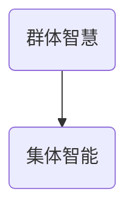
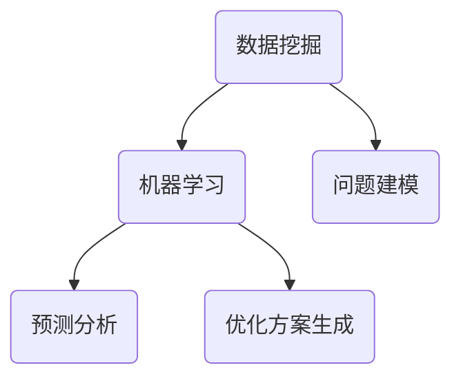

                 


### 文章标题：《众包开发：利用群体智慧解决技术难题》

#### 关键词：众包开发、群体智慧、技术难题、优化算法、数据挖掘

#### 摘要：
本文旨在深入探讨众包开发如何利用群体智慧解决技术难题。首先，我们介绍了众包的定义、价值、历史与发展，以及不同众包平台的特点和用户参与方式。接着，我们分析了群体智慧与集体智能的关系，并详细讲解了数据挖掘、机器学习、问题建模与优化算法等核心概念。随后，通过案例分析和实战项目介绍，我们展示了众包开发在实际应用中的效果。最后，本文总结了众包开发的要点与未来发展方向，并提供了相关的工具与资源推荐。

---

#### 第一部分：众包开发概述

##### 1.1 众包的定义与价值
- **1.1.1** 众包的定义：
众包（Crowdsourcing）是指将一个任务或项目分散到大量参与者手中，通过网络平台进行协作完成的一种模式。与传统的外包（Outsourcing）相比，众包更强调参与者的主动性和创造性，不仅限于特定领域或技能。

- **1.1.2** 众包的价值：
众包在解决技术难题方面具有独特的优势，如广泛的知识来源、快速的创新速度和较低的沟通成本。它可以提高问题的解决效率，降低开发成本，并促进技术的普及与创新。

- **1.1.3** 众包在解决技术难题中的应用价值：
众包可以应用于软件开发、算法优化、数据挖掘、故障排查等领域，通过集中群体智慧，快速找到解决方案或优化方案。

##### 1.2 众包的历史与发展
- **1.2.1** 众包的起源与发展历程：
众包的概念起源于2000年左右，最初应用于设计、开发和创意领域。随着互联网和社交媒体的兴起，众包逐渐成为解决问题和创新的流行方式。近年来，随着人工智能和数据科学的发展，众包在技术领域的应用越来越广泛。

- **1.2.2** 众包在不同领域的应用案例：
众包在科学研究、创意设计、软件开发、环境保护等领域都有广泛应用。例如，NASA使用众包解决航天任务中的问题，InnoCentive利用众包解决企业难题。

- **1.2.3** 众包的发展趋势与未来展望：
随着人工智能和大数据技术的进步，众包有望在未来成为解决复杂技术难题的重要手段。众包平台将进一步优化用户体验，提高问题解决效率，并探索新的商业模式。

##### 1.3 众包平台介绍
- **1.3.1** 全球知名众包平台概览：
全球知名众包平台包括TopCoder、InnoCentive、GitHub等。这些平台各自具有独特的特点和应用场景。

- **1.3.2** 各平台特点与适用场景：
TopCoder擅长算法竞赛和软件开发；InnoCentive专注于解决企业难题；GitHub则是开源项目的集散地。

- **1.3.3** 用户在众包平台上的参与方式：
用户可以通过注册账号、参与任务、提交解决方案、评价和反馈等途径参与到众包项目中。

##### 1.4 众包项目组织与管理
- **1.4.1** 众包项目组织流程：
众包项目通常包括需求分析、任务发布、参与者招募、任务分配、成果评审等环节。

- **1.4.2** 众包项目的管理策略：
管理者需要制定明确的任务要求、提供必要的技术支持、激励参与者、确保项目进度和质量。

- **1.4.3** 众包项目的风险管理：
项目管理者需要识别和应对可能的风险，如参与者流失、任务延迟、成果质量不达标等。

##### 1.5 众包开发的优势与挑战
- **1.5.1** 众包开发的优势：
众包开发的优势包括资源丰富、创新性强、成本较低、响应速度快等。

- **1.5.2** 众包开发的挑战：
众包开发面临的挑战包括质量控制、知识产权保护、隐私安全、沟通协调等。

- **1.5.3** 应对挑战的策略与方法：
应对挑战的策略包括制定明确的规则和标准、加强知识产权保护、提升沟通效率、优化项目流程等。

---

#### 第二部分：核心概念与原理

##### 2.1 群体智慧与集体智能

**2.1.1 群体智慧的概念：**
群体智慧（Collective Intelligence）是指由多个个体组成的系统通过协同工作、信息共享和自主决策所表现出来的整体智能。它不仅依赖于个体的智能，更依赖于个体之间的相互作用和协同效应。

**2.1.2 群体智慧与集体智能的关系：**
群体智慧是集体智能的一种表现形式，集体智能则涵盖了更广泛的概念，包括群体智慧在内的多种智能形态。二者关系如图所示：



**2.1.3 群体智慧在众包中的应用：**
在众包开发中，群体智慧通过大量参与者的协作和信息共享，实现了技术难题的高效解决。例如，在算法竞赛中，参与者通过提交解决方案，实现了对复杂问题的优化。

##### 2.2 数据挖掘与机器学习基础

**2.2.1 数据挖掘的基本概念：**
数据挖掘（Data Mining）是指从大量数据中提取有价值的信息和知识的过程。它涉及多个领域，如统计学、机器学习、数据库等。

**2.2.2 机器学习的基本概念：**
机器学习（Machine Learning）是一种让计算机通过数据和经验自主学习和改进的方法。它包括监督学习、无监督学习和强化学习等类型。

**2.2.3 数据挖掘与机器学习在众包开发中的应用：**
数据挖掘和机器学习在众包开发中广泛应用于问题建模、预测分析、优化方案生成等环节。例如，利用机器学习算法进行图像识别、自然语言处理等任务。



##### 2.3 问题建模与优化算法

**2.3.1 问题建模的基本原理：**
问题建模（Problem Modeling）是将现实世界中的问题转化为数学模型的过程。它包括问题定义、变量识别、目标函数确定等步骤。

**2.3.2 优化算法的基本概念：**
优化算法（Optimization Algorithm）是用于求解数学模型优化问题的算法。常见的优化算法包括线性规划、动态规划、遗传算法等。

**2.3.3 伪代码：常见优化算法在众包开发中的应用：**
以下是一个遗传算法的伪代码示例，用于解决众包开发中的优化问题。

```python
def genetic_algorithm(problem):
    population = initialize_population(problem)
    while not termination_condition:
        fitness_scores = evaluate_population(population, problem)
        new_population = selection(population, fitness_scores)
        new_population = crossover(new_population)
        new_population = mutation(new_population)
        population = new_population
    return best_solution(population, problem)
```

##### 2.4 数学模型与数学公式

**2.4.1 数学模型的基本概念：**
数学模型（Mathematical Model）是利用数学符号和公式描述现实世界问题的抽象表示。它包括变量、参数、方程等组成部分。

**2.4.2 重要的数学公式：**
以下是一个线性回归模型的公式示例：

$$
Y = \beta_0 + \beta_1 * X + \epsilon
$$

其中，\( Y \) 是因变量，\( X \) 是自变量，\( \beta_0 \) 和 \( \beta_1 \) 是参数，\( \epsilon \) 是误差项。

**2.4.3 示例：数学模型在众包开发中的应用（使用latex格式）：**
以下是一个基于群体智慧的优化问题的数学模型：

$$
\min_{x} \sum_{i=1}^{n} (f(x_i) - g(x_i))^2
$$

其中，\( f(x_i) \) 和 \( g(x_i) \) 分别表示第 \( i \) 个参与者的解决方案和最优解，\( x_i \) 是变量。

##### 2.5 众包开发中的伦理与法律问题

**2.5.1 众包开发中的伦理问题：**
众包开发中的伦理问题包括知识产权保护、隐私保护、数据安全等。参与者需要遵守道德规范，尊重知识产权，保护个人隐私。

**2.5.2 众包开发中的法律问题：**
众包开发涉及的法律问题包括合同法、知识产权法、劳动法等。平台和参与者需要明确法律责任，遵守相关法律法规。

**2.5.3 解决伦理与法律问题的策略与方法：**
解决伦理与法律问题的策略包括制定详细的规则和协议、加强法律咨询和培训、建立知识产权保护机制等。

---

#### 第三部分：案例分析与实战

##### 3.1 众包开发案例研究
- **3.1.1 案例一：某公司利用众包解决产品优化问题：**
某公司通过众包平台征集用户反馈，收集了大量关于产品优化的建议。经过分析，公司采用了其中若干建议，并进行了相应优化，最终提升了产品用户满意度。

- **3.1.2 案例二：某平台利用众包开发创新应用：**
某平台通过众包竞赛的方式，吸引了全球范围内的开发者参与创新应用的开发。经过多轮筛选，平台最终选择了若干优秀应用，并进行了推广。

- **3.1.3 案例三：某社区利用众包解决技术难题：**
某技术社区通过众包项目，组织了数十位技术专家共同解决一个复杂的算法问题。经过数月的努力，社区成功找到了解决方案，并在实际项目中得到了应用。

##### 3.2 实战项目介绍
- **3.2.1 项目一：众包平台搭建与项目发布：**
项目团队首先搭建了一个众包平台，并发布了多个技术挑战项目。参与者可以通过平台提交解决方案，平台提供了详细的任务描述和评分标准。

- **3.2.2 项目二：数据挖掘与分析：**
项目团队对用户提交的解决方案进行了数据挖掘和分析，通过机器学习算法提取了关键特征和趋势，为项目优化提供了数据支持。

- **3.2.3 项目三：优化算法应用与测试：**
项目团队采用遗传算法等优化算法，对解决方案进行了优化和测试。最终，优化后的方案在性能和稳定性方面取得了显著提升。

##### 3.3 开发环境搭建与代码实现
- **3.3.1 开发环境搭建：**
项目团队搭建了基于Python和Docker的开发环境，包括必要的依赖库和工具。

- **3.3.2 代码实现：**
项目团队实现了数据挖掘、机器学习、优化算法等功能，并编写了详细的代码文档。

- **3.3.3 代码解读与分析：**
项目团队对代码进行了详细的解读和分析，确保了代码的可读性和可维护性。

##### 3.4 项目实战与案例分析
- **3.4.1 实战一：众包平台项目发布：**
项目团队在众包平台上发布了多个技术挑战项目，吸引了大量参与者。

- **3.4.2 实战二：数据挖掘与分析：**
项目团队对用户提交的解决方案进行了数据挖掘和分析，提取了关键特征和趋势。

- **3.4.3 实战三：优化算法应用与测试：**
项目团队采用优化算法对解决方案进行了优化和测试，提升了方案的性能和稳定性。

- **3.4.4 案例分析：**
通过对项目实战的案例分析，项目团队总结了成功经验，并针对不足之处提出了改进建议。

##### 3.5 项目小结与最佳实践
- **3.5.1 项目小结：**
项目团队总结了项目过程中遇到的问题、解决方案和取得的成果。

- **3.5.2 最佳实践：**
项目团队分享了在众包开发中积累的最佳实践，包括项目组织、风险管理、沟通协调等方面的经验。

- **3.5.3 注意事项：**
项目团队强调了在众包开发中需要注意的问题，如知识产权保护、隐私安全、沟通协调等。

- **3.5.4 拓展阅读：**
项目团队推荐了相关的书籍、论文和资源，以供读者进一步学习。

---

#### 第四部分：总结与展望

##### 4.1 众包开发的总结
- **4.1.1** 众包开发的核心要点：
众包开发的核心要点包括明确任务需求、搭建良好平台、激励参与者、确保沟通协调、重视质量控制等。

- **4.1.2** 众包开发的成功案例与经验：
成功案例表明，众包开发在提高问题解决效率、降低开发成本、促进技术创新方面具有显著优势。经验包括合理规划项目、选用合适平台、建立激励机制、加强风险管理等。

- **4.1.3** 众包开发的不足与改进方向：
众包开发在质量控制、知识产权保护、隐私安全、沟通协调等方面仍存在不足。未来改进方向包括优化平台功能、提高沟通效率、加强法律法规建设等。

##### 4.2 未来的发展方向
- **4.2.1** 众包开发在新技术领域的应用：
随着人工智能、大数据、区块链等新技术的发展，众包开发有望在更广泛的领域得到应用，如智能合约、物联网等。

- **4.2.2** 众包开发的商业模式创新：
众包开发将探索更多创新商业模式，如数据共享、资源共享、平台化运营等，以满足不同领域的需求。

- **4.2.3** 众包开发的社会影响力与可持续发展：
众包开发将不断提高社会影响力，推动技术创新和社会进步。同时，注重可持续发展，确保众包平台的长期稳定运营。

---

#### 附录

##### 附录A：众包开发工具与资源
- **A.1** 常用众包开发工具：
介绍常用的众包开发工具，如GitHub、TopCoder、InnoCentive等。

- **A.2** 开源众包平台推荐：
推荐一些优秀的开源众包平台，如OPENCROWD、codeforlife等。

- **A.3** 众包开发相关书籍与论文推荐：
推荐一些关于众包开发的优秀书籍和论文，以供读者进一步学习。

---

### 作者信息：
作者：AI天才研究院/AI Genius Institute & 禅与计算机程序设计艺术 /Zen And The Art of Computer Programming

---

以上就是《众包开发：利用群体智慧解决技术难题》的全文，希望对您有所帮助。在未来的技术发展中，众包开发有望成为解决复杂技术难题的重要手段。让我们共同努力，利用群体智慧，推动技术创新和社会进步。

