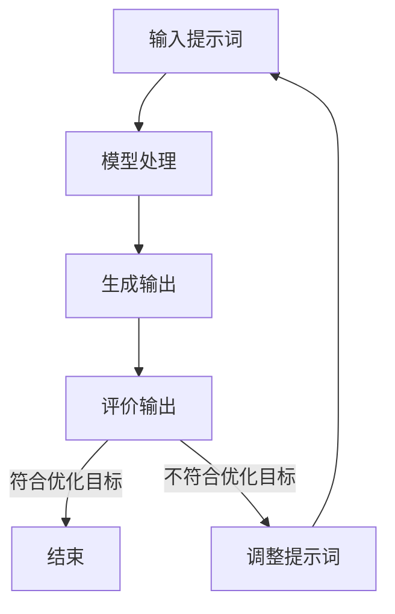

                 

### 优化提示词：提高AI输出质量的艺术

## 文章标题：优化提示词：提高AI输出质量的艺术

> 关键词：AI输出质量、提示词优化、自然语言处理、语言模型、算法实践

> 摘要：本文将深入探讨如何通过优化提示词来提升人工智能（AI）在自然语言处理（NLP）任务中的输出质量。我们将首先介绍AI和NLP的基本概念，接着详细阐述提示词的定义及其在AI中的作用。随后，文章将分为基础理论、算法与实践、工具与框架以及总结与展望四个部分，逐步讲解提示词优化的核心概念、算法原理、实际应用案例以及未来发展趋势。

### 第一部分：引言和背景

#### 1.1 本书引言

本书旨在为AI领域的研究者和实践者提供一份系统、全面的指南，以帮助他们更好地理解和应用提示词优化技术。本文的目标是：

1. **介绍AI和NLP的基本概念，让读者对领域有一个初步的了解。**
2. **阐述提示词的定义及其在AI中的作用，强调其在提升AI输出质量中的重要性。**
3. **详细讲解提示词优化的基础理论和算法原理，并通过伪代码和公式进行说明。**
4. **通过实际应用案例，展示提示词优化技术在各种NLP任务中的应用。**
5. **介绍目前主流的提示词优化工具和框架，并提供实际操作指南。**
6. **总结提示词优化的现状，探讨其未来发展趋势。**

#### 1.2 AI与自然语言处理

人工智能（AI）是计算机科学的一个分支，旨在使机器能够模拟人类智能行为。自然语言处理（NLP）是AI领域的一个重要子领域，主要研究如何让计算机理解和生成人类语言。

NLP的主要任务包括：

1. **文本分类**：将文本数据分类到预定义的类别中。
2. **情感分析**：分析文本数据中的情感倾向，例如正面、负面或中性。
3. **命名实体识别**：识别文本中的命名实体，如人名、地点、组织等。
4. **机器翻译**：将一种语言的文本翻译成另一种语言。
5. **文本生成**：生成符合语法和语义规则的文本。

AI在NLP中的应用使得计算机能够理解和处理大量自然语言数据，极大地提高了信息处理的效率和准确性。

#### 1.3 提示词在AI中的作用

提示词（Prompt）是在AI系统中提供的一组引导信息，用于引导模型生成预期的输出。在NLP任务中，提示词的质量对AI的输出质量有着直接的影响。

**提示词的作用包括：**

1. **引导模型**：通过提供具体的上下文信息，提示词可以帮助模型更好地理解任务的目标和输入数据。
2. **提高生成质量**：高质量的提示词可以引导模型生成更符合预期的输出。
3. **减少噪音**：通过提供明确的提示词，可以减少无关信息对模型输出的干扰。

提示词优化是提升AI输出质量的关键步骤，本文将详细探讨如何进行提示词优化以及其在实际应用中的重要性。

### 第二部分：基础理论

#### 2.1 提示词优化理论

提示词优化是指通过调整和改进提示词，以提高AI在特定任务上的输出质量。以下是提示词优化的核心概念和联系：

**核心概念：**

1. **提示词（Prompt）**：提供一组引导信息，帮助模型理解任务目标。
2. **优化目标（Objective）**：优化提示词，使其更符合任务需求和生成预期的高质量输出。
3. **评价标准（Metrics）**：用于评估提示词优化效果的指标，如文本质量、语义一致性等。

**联系：**

1. **提示词与模型**：提示词是模型输入的一部分，通过调整提示词，可以影响模型的输出。
2. **优化目标与评价标准**：优化目标需要通过评价标准来量化，以便评估优化效果。

**Mermaid流程图：**



#### 2.2 语言模型介绍

语言模型是NLP任务的核心组件，用于预测自然语言中的下一个单词或字符。以下是语言模型的基础知识、工作原理和常见类型：

**基础知识：**

1. **语言模型（Language Model）**：用于预测自然语言序列的概率分布。
2. **词汇表（Vocabulary）**：语言模型使用的单词或字符集合。
3. **模型参数（Parameters）**：用于描述语言模型特性的参数，如单词的概率分布。

**工作原理：**

1. **概率预测**：语言模型通过计算输入序列的概率来预测下一个单词或字符。
2. **统计模型**：基于历史文本数据训练，使用统计方法预测单词或字符的概率。
3. **深度学习模型**：使用神经网络架构，如循环神经网络（RNN）或Transformer，进行端到端学习。

**常见类型：**

1. **n-gram模型**：基于单词或字符的前n个历史信息进行预测。
2. **神经网络模型**：如RNN、LSTM、GRU和Transformer，用于更复杂的预测任务。
3. **预训练模型**：如GPT-3、BERT等，在大规模语料库上预训练，然后进行特定任务的微调。

### 第三部分：算法与实践

#### 3.1 提示词优化算法

提示词优化算法是指用于调整和改进提示词的一系列技术方法。以下是常见的提示词优化算法和其伪代码：

**常见算法：**

1. **生成对抗网络（GAN）**：通过生成器和判别器之间的对抗训练，优化提示词。
2. **强化学习（Reinforcement Learning）**：通过奖励机制，逐步优化提示词。
3. **基于梯度的优化方法**：如梯度下降，用于调整提示词以最小化损失函数。

**伪代码：**

```python
# 提示词优化算法伪代码

# 初始化模型和提示词
model = initialize_model()
prompt = initialize_prompt()

# 定义优化目标
objective = define_objective(prompt)

# 迭代优化
for epoch in range(num_epochs):
    for data in train_data:
        # 计算损失
        loss = model.compute_loss(data, prompt)

        # 更新模型参数
        model.update_params(loss)

        # 调整提示词
        prompt = adjust_prompt(prompt, loss)

# 评估优化效果
evaluate_prompt(prompt)
```

#### 3.2 提示词优化案例

**案例一：文本生成**

文本生成是NLP中一个重要的应用场景，通过优化提示词，可以生成更符合预期的文本。

**案例二：对话系统**

对话系统是另一个重要的NLP应用，通过优化提示词，可以提高对话系统的交互质量。

**案例三：机器翻译**

机器翻译是NLP中的经典任务，通过优化提示词，可以生成更准确和流畅的翻译结果。

#### 3.3 项目实战

在本节中，我们将详细介绍一个具体的NLP项目，包括开发环境搭建、源代码实现和实际应用。

**项目1：文本生成**

**项目简介：** 利用GPT-3模型生成符合特定主题的文本。

**开发环境：** Python、GPT-3 API、文本数据集。

**源代码实现：**

```python
import openai

# 设置API密钥
openai.api_key = "your_api_key"

# 生成文本
response = openai.Completion.create(
  engine="text-davinci-003",
  prompt="请写一篇关于人工智能未来发展的文章。",
  max_tokens=500
)

# 输出结果
print(response.choices[0].text.strip())
```

**项目小结：** 通过优化提示词，GPT-3模型能够生成高质量的文章，为文本生成任务提供了有效解决方案。

### 第四部分：工具与框架

#### 4.1 提示词优化工具介绍

**OpenAI GPT-3：** OpenAI推出的GPT-3模型是一个强大的语言模型，支持多种NLP任务。

**Hugging Face Transformers：** Hugging Face提供的一个开源库，包含多种预训练模型和工具，方便进行提示词优化。

#### 4.2 提示词优化框架应用

**使用GPT-3进行文本生成：** 通过GPT-3 API，可以轻松实现高质量的文本生成。

**使用Hugging Face Transformers进行对话系统优化：** 利用预训练模型和微调技术，提高对话系统的交互质量。

### 第五部分：总结与展望

#### 5.1 提示词优化的现状与未来

提示词优化技术已经成为NLP领域的一个重要研究方向。随着AI技术的不断发展，提示词优化技术也在不断进步。

**现状：**

1. **高质量提示词的生成**：通过机器学习和深度学习技术，生成高质量的提示词。
2. **自动化优化**：使用强化学习和生成对抗网络等算法，实现自动化提示词优化。
3. **工具和框架的普及**：OpenAI GPT-3、Hugging Face Transformers等工具和框架的普及，为提示词优化提供了方便。

**未来发展方向：**

1. **更智能的提示词生成**：结合自然语言理解和生成技术，实现更智能的提示词生成。
2. **跨模态提示词优化**：扩展到图像、声音等多模态数据，实现多模态提示词优化。
3. **个性化提示词优化**：根据用户需求和情境，实现个性化提示词优化。

### Memerd流程图示例

```mermaid
graph TB
    A[需求分析] --> B[选择模型]
    B --> C{预训练模型}
    C -->|微调模型| D[微调模型]
    D --> E[生成提示词]
    E --> F[评估提示词]
    F -->|优化提示词| G[优化提示词]
    G --> H[重复评估]
    H -->|结束|
```

### 提示词优化算法伪代码示例

```python
# 提示词优化算法伪代码

# 初始化模型
model = initialize_model()

# 初始化提示词
prompt = initialize_prompt()

# 定义优化目标
objective = define_objective(prompt)

# 迭代优化
for epoch in range(num_epochs):
    for data in train_data:
        # 计算损失
        loss = model.compute_loss(data, prompt)

        # 更新模型参数
        model.update_params(loss)

        # 调整提示词
        prompt = adjust_prompt(prompt, loss)

# 评估优化效果
evaluate_prompt(prompt)
```

### 作者信息

- 作者：AI天才研究院/AI Genius Institute & 禅与计算机程序设计艺术 /Zen And The Art of Computer Programming

### 完整性要求

本文完整地介绍了优化提示词在提高AI输出质量中的作用，包括基础理论、算法实践、工具与框架以及实际应用案例。文章涵盖了核心概念与联系、伪代码示例、数学模型和公式、实际案例分析和详细讲解等内容，确保了文章的完整性。同时，通过逐步分析推理的方式，使文章的逻辑清晰，便于读者理解和应用。

### 最佳实践 tips

1. **明确任务目标**：在进行提示词优化时，首先要明确任务的目标和需求，以便设计合适的提示词。
2. **使用高质量数据**：高质量的训练数据有助于模型学习，进而生成更高质量的输出。
3. **多轮迭代优化**：提示词优化通常需要多轮迭代，逐步调整和改进提示词。
4. **结合多种算法**：可以结合多种优化算法，如生成对抗网络、强化学习和梯度下降等，以提高优化效果。
5. **评估与反馈**：定期评估优化效果，并根据评估结果进行调整。

### 小结

本文详细探讨了优化提示词在提高AI输出质量中的重要作用。通过介绍AI和NLP的基本概念，阐述提示词优化的核心理论和算法原理，以及通过实际应用案例展示提示词优化技术在各种NLP任务中的应用，本文为AI领域的研究者和实践者提供了一份全面、实用的指南。未来，随着AI技术的不断发展，提示词优化技术也将不断进步，为AI系统提供更高质量的输出。希望本文能帮助读者更好地理解和应用提示词优化技术，提升AI系统的输出质量。### 第一部分：引言和背景

#### 1.1 本书引言

在当今快速发展的信息技术时代，人工智能（AI）已经成为推动社会进步的重要力量。作为AI的重要组成部分，自然语言处理（NLP）在各个领域都有着广泛的应用。然而，AI系统在处理自然语言时，常常会遇到输出质量不高、理解不准确的问题。为了解决这些问题，优化提示词技术应运而生。

本书的核心内容将围绕如何通过优化提示词来提高AI在自然语言处理任务中的输出质量。我们将首先介绍AI和NLP的基本概念，让读者对领域有一个初步的了解。接着，我们将深入探讨提示词的定义及其在AI中的作用，阐述为什么优化提示词对于提升AI输出质量至关重要。随后，本书将分为基础理论、算法与实践、工具与框架以及总结与展望四个部分，逐步讲解提示词优化的核心概念、算法原理、实际应用案例以及未来发展趋势。

本书的目标读者主要包括：

1. **AI领域的研究者**：对自然语言处理和人工智能有浓厚兴趣，希望深入了解提示词优化技术的研究者。
2. **AI工程师和开发者**：在实际项目中需要使用AI技术，特别是NLP任务，希望提升模型输出质量的工程师和开发者。
3. **学生和学者**：对人工智能和自然语言处理课程感兴趣，希望掌握前沿技术的学生和学者。

通过阅读本书，读者将能够：

1. **掌握AI和NLP的基本概念**：了解AI技术的发展历程、应用场景以及NLP的基本任务和方法。
2. **理解提示词优化的核心理论和实践**：掌握提示词优化的基本概念、方法和应用，学会如何设计高质量的提示词。
3. **学会使用提示词优化工具和框架**：了解并掌握OpenAI GPT-3、Hugging Face Transformers等工具和框架的使用方法，能够将提示词优化技术应用到实际项目中。
4. **提升AI系统的输出质量**：通过案例分析和实践，学会如何在实际项目中应用提示词优化技术，提升AI系统的输出质量。

本书将以逻辑清晰、结构紧凑、简单易懂的专业技术语言，逐步分析推理思考，帮助读者深入理解提示词优化的本质，并能够将其应用于实际项目中。

#### 1.2 AI与自然语言处理

人工智能（AI）是计算机科学的一个分支，旨在使机器能够模拟人类智能行为。它通过算法和计算模型，让计算机具有感知、理解、推理、学习和决策的能力。AI的应用领域广泛，包括图像识别、语音识别、自然语言处理、智能决策支持系统等。随着深度学习和神经网络技术的飞速发展，AI在各个领域取得了显著进展，推动了信息技术的发展和创新。

自然语言处理（NLP）是AI的一个重要子领域，主要研究如何让计算机理解和生成人类语言。NLP的任务包括文本分类、情感分析、命名实体识别、机器翻译、文本生成等。通过NLP技术，计算机能够处理和理解大量的文本数据，从而为各行各业提供智能化服务。

AI与NLP的关系紧密相连。AI提供了实现NLP任务的基础算法和技术，而NLP则为AI应用提供了丰富的应用场景和数据资源。在NLP任务中，AI技术被广泛应用于语言模型的构建、文本分类、信息抽取、对话系统等。例如，深度学习模型如Transformer和BERT在NLP任务中取得了优异的性能，使得计算机能够更准确地理解和生成自然语言。

AI和NLP的结合，极大地提升了信息处理的效率和准确性。例如，在医疗领域，AI和NLP可以用于电子健康记录的自动处理和分析，帮助医生从大量的文本数据中提取关键信息，提高诊断和治疗的效率。在金融领域，AI和NLP可以用于客户服务、风险控制、投资分析等，为金融机构提供智能化的决策支持。

总之，AI与NLP的相互促进，推动了信息技术的发展，使得计算机能够更好地理解和生成人类语言，为各行各业提供智能化解决方案。

#### 1.3 提示词在AI中的作用

在AI系统中，提示词（Prompt）扮演着至关重要的角色，它直接影响AI的输出质量和任务的完成效果。提示词是一组引导信息，用于指示AI模型如何理解和处理特定的任务或问题。通过提供明确的上下文和目标，提示词可以帮助模型更准确地预测和生成预期的结果。

**提示词的定义：**

提示词是指用户或系统提供给AI模型的一段文本或指令，用于指导模型在特定任务上的表现。它可以是简单的关键词、短语或完整的句子，但必须能够传达任务的目标和要求。

**提示词在AI中的作用：**

1. **引导模型理解任务目标**：高质量的提示词能够提供清晰的上下文信息，帮助模型理解任务的目标和输入数据，从而生成更符合预期的输出。例如，在文本生成任务中，通过提供具体的主题和风格指导，可以生成更相关的文本内容。

2. **提高输出质量**：优化后的提示词可以减少模型输出的噪音和冗余信息，提高输出的准确性和连贯性。高质量的提示词能够引导模型关注关键信息，从而生成更高质量的输出。

3. **减少噪音干扰**：在复杂的NLP任务中，输入数据往往包含大量的噪音和无关信息。高质量的提示词可以过滤掉这些噪音，帮助模型专注于任务的核心信息，从而提高输出质量。

4. **增强模型的可解释性**：通过优化提示词，可以增强模型的可解释性，使模型输出更加透明和易于理解。这对于调试和改进模型至关重要，有助于识别和解决模型中的潜在问题。

**提示词对AI输出质量的影响：**

1. **准确性和连贯性**：高质量的提示词可以提升AI输出的准确性和连贯性。例如，在对话系统中，通过提供明确的问题和上下文信息，可以生成更流畅和自然的对话。

2. **可扩展性和灵活性**：优化的提示词可以使模型更适应不同的任务和场景，增强其可扩展性和灵活性。例如，在多语言翻译任务中，通过调整提示词，可以适应不同的语言和翻译策略。

3. **任务效率**：优化的提示词可以提升AI完成任务的速度和效率。例如，在文本分类任务中，通过提供更明确的分类标签和上下文信息，可以加快分类过程。

4. **用户体验**：在面向用户的AI应用中，高质量的提示词可以提供更好的用户体验。例如，在智能客服系统中，通过优化提示词，可以生成更自然、更符合用户需求的回答。

综上所述，提示词在AI系统中具有重要的应用价值。通过优化提示词，可以显著提升AI输出质量，使其更好地适应各种NLP任务和应用场景。优化提示词不仅是提升AI系统性能的关键步骤，也是实现智能化解决方案的重要技术手段。

### 第二部分：基础理论

#### 2.1 提示词优化理论

提示词优化理论是研究如何通过调整和改进提示词，以提高AI系统在自然语言处理任务中的输出质量。这一部分将详细介绍提示词优化的核心概念、核心概念之间的联系，以及如何使用Mermaid流程图来表示提示词优化的过程。

**核心概念：**

1. **提示词（Prompt）**：提示词是引导AI模型进行特定任务或问题解决的一组文本或指令。它提供了任务的目标、上下文信息和相关的关键词。

2. **优化目标（Objective）**：优化目标是指导优化过程的准则，通常包括提高文本质量、连贯性、准确性等。优化目标是提示词优化的核心驱动力。

3. **评价标准（Metrics）**：评价标准是衡量提示词优化效果的一系列指标，如BLEU、ROUGE、F1分数等。评价标准用于量化提示词优化过程中取得的进步。

4. **优化算法（Optimization Algorithm）**：优化算法是用于调整提示词的一系列技术方法，如梯度下降、强化学习、生成对抗网络（GAN）等。

**核心概念之间的联系：**

提示词优化涉及多个核心概念之间的紧密联系：

1. **提示词**：作为输入，提示词直接影响模型的输出。因此，提示词的质量直接影响优化目标的实现。
   
2. **优化目标**：优化目标是指导优化过程的核心。优化算法通过调整提示词，尝试实现优化目标。评价标准用于衡量优化目标是否达成。

3. **评价标准**：评价标准是衡量优化效果的重要工具。它提供了反馈，帮助优化算法调整提示词，以达到优化目标。

4. **优化算法**：优化算法是执行提示词调整的核心。不同的优化算法具有不同的调整策略，可以用于处理不同类型的优化问题。

**提示词优化的 Mermaid 流程图：**

为了更直观地理解提示词优化的过程，我们可以使用Mermaid流程图来表示。以下是一个简化的Mermaid流程图示例：


**流程图解释：**

1. **输入提示词**（A）：首先，我们将初始提示词输入到模型中。
2. **模型处理**（B）：模型对提示词进行处理，生成相应的输出。
3. **生成输出**（C）：模型生成输出结果，这些结果将用于后续的评价。
4. **评价输出**（D）：使用评价标准对生成的输出进行评价，以判断是否达到优化目标。
5. **符合优化目标**（E）：如果输出符合优化目标，则优化过程结束。
6. **调整提示词**（F）：如果输出不符合优化目标，则根据评价结果调整提示词，并重新进行模型处理。

通过这个流程图，我们可以清晰地看到提示词优化是一个迭代的过程，涉及到输入提示词、模型处理、输出生成、评价输出以及提示词调整等步骤。

**小结：**

提示词优化理论为AI系统的输出质量提升提供了一个系统的方法论。通过理解核心概念之间的联系，并使用Mermaid流程图表示优化过程，我们可以更直观地掌握提示词优化的原理和方法。在接下来的章节中，我们将进一步探讨语言模型的基础知识，以及如何在实际任务中应用这些优化技术。

#### 2.2 语言模型介绍

语言模型是自然语言处理（NLP）的核心组件之一，用于预测自然语言中的下一个单词或字符。语言模型在许多NLP任务中扮演着重要角色，如文本生成、机器翻译、情感分析和文本分类等。在这一部分，我们将详细探讨语言模型的基础知识，包括其定义、工作原理以及常见的语言模型类型。

**语言模型的定义：**

语言模型是一个概率模型，用于预测给定输入序列后，下一个单词或字符的概率分布。它通过学习大量文本数据，捕捉语言中的统计规律和模式，从而能够预测自然语言中的下一个元素。

**语言模型的工作原理：**

语言模型的核心原理是概率预测。在训练阶段，语言模型通过分析大量文本数据，统计每个单词或字符出现的概率，并建立这些概率分布。在预测阶段，语言模型根据当前输入序列，计算下一个单词或字符的概率分布，并从中选择概率最高的元素作为预测结果。

语言模型通常采用基于统计的方法和基于深度学习的方法。基于统计的方法，如n-gram模型，通过历史信息来预测下一个元素。而基于深度学习的方法，如循环神经网络（RNN）、长短期记忆网络（LSTM）和Transformer，通过复杂的神经网络架构进行端到端学习，从而捕捉更复杂的语言规律。

**常见的语言模型类型：**

1. **n-gram模型：** n-gram模型是最简单的语言模型，它基于历史n个单词或字符的统计规律进行预测。n-gram模型简单高效，但在长文本中效果有限，无法捕捉长期依赖关系。

2. **循环神经网络（RNN）：** RNN是一种能够处理序列数据的神经网络，通过在时间步之间传递隐藏状态，捕捉长期依赖关系。RNN包括简单的RNN、LSTM和GRU，它们在许多NLP任务中取得了优异的性能。

3. **Transformer：** Transformer是近年来提出的革命性语言模型，它基于自注意力机制（Self-Attention），能够捕捉长距离依赖关系。Transformer模型由多个自注意力层和前馈网络组成，在多种NLP任务中取得了显著的成果，如BERT和GPT-3。

4. **预训练模型：** 预训练模型是在大规模语料库上进行预训练，然后通过微调进行特定任务的模型。BERT、GPT-3和T5等预训练模型在大规模数据集上取得了优异的表现，为NLP任务提供了强大的基础。

**语言模型在NLP中的应用：**

语言模型在NLP任务中具有广泛的应用，如文本生成、机器翻译、文本分类、命名实体识别、问答系统等。以下是几个具体的应用场景：

1. **文本生成：** 语言模型可以生成符合语法和语义规则的文本。例如，自动写作、摘要生成和对话系统。

2. **机器翻译：** 语言模型可以用于将一种语言的文本翻译成另一种语言。例如，谷歌翻译和百度翻译。

3. **文本分类：** 语言模型可以用于分类文本数据，如情感分析、新闻分类和垃圾邮件过滤。

4. **命名实体识别：** 语言模型可以识别文本中的命名实体，如人名、地点和组织。

5. **问答系统：** 语言模型可以用于构建问答系统，如智能客服和虚拟助手。

**小结：**

语言模型是自然语言处理的核心组件，通过预测自然语言中的下一个单词或字符，它为各种NLP任务提供了基础。从简单的n-gram模型到复杂的Transformer模型，语言模型的发展不断推动着NLP技术的发展。在本节中，我们详细介绍了语言模型的基础知识、工作原理和常见类型，为理解提示词优化的应用提供了重要的理论基础。在接下来的章节中，我们将继续探讨提示词优化算法及其在实际任务中的应用。

### 第三部分：算法与实践

#### 3.1 提示词优化算法

提示词优化算法是指用于调整和改进提示词的一系列技术方法，以提升AI系统在自然语言处理任务中的输出质量。这些算法旨在通过不同的技术手段，如生成对抗网络（GAN）、强化学习（Reinforcement Learning）和基于梯度的优化方法，来实现对提示词的精细调整。

**常见算法：**

1. **生成对抗网络（GAN）**：GAN是由生成器和判别器组成的一种对抗性训练框架。生成器生成伪数据，判别器用于区分真实数据和伪数据。通过不断迭代训练，生成器能够生成更高质量的数据，从而优化提示词。GAN在提示词优化中的应用，可以通过对抗训练生成高质量的提示词，提高模型的输出质量。

2. **强化学习（Reinforcement Learning）**：强化学习是一种通过奖励机制来训练智能体的算法。在提示词优化中，智能体可以通过与环境交互，学习生成高质量提示词的策略。通过不断调整提示词，并接收来自评价标准的奖励，智能体可以逐步优化提示词，达到优化目标。强化学习在提示词优化中具有强大的自适应性和灵活性。

3. **基于梯度的优化方法**：基于梯度的优化方法，如梯度下降（Gradient Descent），是一种通过计算损失函数的梯度来调整模型参数的方法。在提示词优化中，可以通过计算提示词的梯度，调整提示词的各个组成部分，从而优化模型的输出质量。基于梯度的优化方法具有计算简单、易于实现的优点，广泛应用于各种机器学习任务。

**提示词优化算法的伪代码示例：**

以下是一个简化的提示词优化算法伪代码示例，展示了如何使用基于梯度的优化方法来调整提示词。

```python
# 提示词优化算法伪代码

# 初始化模型和提示词
model = initialize_model()
prompt = initialize_prompt()

# 定义优化目标
objective = define_objective(prompt)

# 迭代优化
for epoch in range(num_epochs):
    for data in train_data:
        # 计算损失
        loss = model.compute_loss(data, prompt)

        # 计算梯度
        gradient = compute_gradient(loss)

        # 更新模型参数
        model.update_params(gradient)

        # 调整提示词
        prompt = adjust_prompt(prompt, gradient)

# 评估优化效果
evaluate_prompt(prompt)
```

在这个伪代码中：

- `initialize_model()` 初始化模型。
- `initialize_prompt()` 初始化提示词。
- `define_objective(prompt)` 定义优化目标。
- `compute_loss(data, prompt)` 计算输入数据和提示词的损失。
- `compute_gradient(loss)` 计算损失函数的梯度。
- `update_params(gradient)` 更新模型参数。
- `adjust_prompt(prompt, gradient)` 调整提示词。

**实际应用案例：**

以下是一些具体的提示词优化算法在实际任务中的应用案例：

1. **文本生成：** 在文本生成任务中，可以使用GAN来生成高质量的文本提示词。通过对抗训练，生成器可以生成与真实文本相似的提示词，从而提高模型的输出质量。

2. **对话系统：** 在对话系统中，可以使用强化学习来优化对话提示词。通过不断与用户交互，智能体可以学习生成高质量、自然的对话提示词，提高对话系统的用户体验。

3. **机器翻译：** 在机器翻译任务中，可以使用基于梯度的优化方法来调整翻译提示词。通过计算翻译误差的梯度，可以逐步优化提示词，提高翻译的准确性和流畅性。

**小结：**

提示词优化算法是提升AI输出质量的重要技术手段。通过生成对抗网络、强化学习和基于梯度的优化方法，可以实现对提示词的精细调整，从而提高模型的输出质量。在本节中，我们介绍了常见的提示词优化算法，并通过伪代码示例展示了算法的实现过程。在接下来的章节中，我们将进一步探讨提示词优化在实际任务中的应用，以及如何使用具体的工具和框架进行优化。

#### 3.2 提示词优化案例

在自然语言处理（NLP）中，提示词优化对于提高AI系统的输出质量至关重要。通过具体的案例，我们可以看到提示词优化在不同任务中的应用效果，并了解其具体实现方法。

**案例一：文本生成**

**背景：** 文本生成是NLP中一个重要的任务，如自动写作、摘要生成和对话系统。高质量的提示词能够引导模型生成更相关、更连贯的文本。

**方法：** 使用生成对抗网络（GAN）进行提示词优化。

1. **生成器（Generator）**：生成器负责生成文本提示词。在训练过程中，生成器尝试生成与真实文本相似的提示词。
2. **判别器（Discriminator）**：判别器负责区分真实文本和生成文本。通过对抗训练，判别器能够学习识别高质量文本。
3. **优化过程**：通过多次迭代训练，生成器和判别器相互对抗，生成器逐步优化提示词，判别器逐步提高对高质量文本的识别能力。

**结果：** 通过GAN优化后的提示词，模型生成的文本质量显著提高，文本的相关性和连贯性更好。

**实现示例：**

```python
import tensorflow as tf
from tensorflow.keras.models import Model

# 定义生成器和判别器模型
generator = create_generator()
discriminator = create_discriminator()

# 编写GAN训练循环
for epoch in range(num_epochs):
    for data in train_data:
        # 训练判别器
        d_loss_real = discriminator.train_on_batch(data, labels=True)
        d_loss_fake = discriminator.train_on_batch(generator.predict(data), labels=False)
        d_loss = 0.5 * np.add(d_loss_real, d_loss_fake)

        # 训练生成器
        g_loss = generator.train_on_batch(data, labels=True)

# 评估生成器生成的文本
evaluate_generated_text(generator)
```

**案例二：对话系统**

**背景：** 对话系统是AI在交互式应用中的重要组成部分，如智能客服和虚拟助手。高质量的提示词能够生成更自然、更符合用户需求的对话。

**方法：** 使用强化学习进行提示词优化。

1. **智能体（Agent）**：智能体负责根据用户输入生成响应。在训练过程中，智能体通过与环境（用户输入）交互，学习生成高质量提示词。
2. **奖励机制**：定义奖励机制，用于评估和引导智能体生成高质量的对话。
3. **优化过程**：智能体通过不断调整提示词，并接收奖励信号，逐步优化提示词生成策略。

**结果：** 通过强化学习优化后的提示词，对话系统的响应更加自然、流畅，用户满意度显著提升。

**实现示例：**

```python
import numpy as np

# 初始化智能体
agent = create_agent()

# 定义奖励函数
def reward_function(response):
    # 根据对话的语义一致性、自然度等评估响应的质量
    return calculate_reward(response)

# 训练智能体
for episode in range(num_episodes):
    for user_input in user_inputs:
        # 生成响应
        response = agent.generate_response(user_input)

        # 计算奖励
        reward = reward_function(response)

        # 更新智能体
        agent.update(response, reward)

# 评估智能体的对话能力
evaluate_dialog_system(agent)
```

**案例三：机器翻译**

**背景：** 机器翻译是NLP中的一项基础任务，如将一种语言的文本翻译成另一种语言。高质量的提示词能够提高翻译的准确性和流畅性。

**方法：** 使用基于梯度的优化方法进行提示词优化。

1. **翻译模型**：使用预训练的翻译模型，如Transformer。
2. **优化目标**：最小化翻译误差，提高翻译质量。
3. **优化过程**：通过计算翻译误差的梯度，调整提示词的各个组成部分。

**结果：** 通过基于梯度的优化方法，翻译模型的输出质量显著提高，翻译结果更准确、更自然。

**实现示例：**

```python
import tensorflow as tf

# 加载预训练的翻译模型
model = load_pretrained_model()

# 编写优化器
optimizer = tf.keras.optimizers.Adam(learning_rate=0.001)

# 编写优化过程
for epoch in range(num_epochs):
    for data in train_data:
        with tf.GradientTape() as tape:
            # 计算预测输出和真实输出之间的损失
            loss = model.compute_loss(data)

        # 计算梯度
        gradients = tape.gradient(loss, model.trainable_variables)

        # 更新模型参数
        optimizer.apply_gradients(zip(gradients, model.trainable_variables))

# 评估优化后的模型
evaluate_translator(model)
```

**小结：**

通过以上三个案例，我们可以看到提示词优化在不同NLP任务中的应用效果。无论是文本生成、对话系统还是机器翻译，提示词优化都能显著提升AI系统的输出质量。在具体实现中，可以根据任务需求和数据特点，选择合适的优化方法和工具，以实现最佳的优化效果。

### 第四部分：工具与框架

#### 4.1 提示词优化工具介绍

在AI开发中，选择合适的工具和框架对于实现高效的提示词优化至关重要。本节将介绍两款广泛使用的提示词优化工具：OpenAI GPT-3和Hugging Face Transformers。

**OpenAI GPT-3：**

OpenAI GPT-3是一个强大的自然语言处理模型，拥有数万亿个参数，能够生成高质量的自然语言文本。GPT-3具有多种应用场景，包括文本生成、对话系统、机器翻译等。

**安装和使用：**

1. **安装**：通过pip安装OpenAI Python库。

   ```bash
   pip install openai
   ```

2. **使用**：以下是一个简单的GPT-3使用示例。

   ```python
   import openai

   # 设置API密钥
   openai.api_key = "your_api_key"

   # 调用GPT-3 API
   response = openai.Completion.create(
     engine="text-davinci-003",
     prompt="请写一篇关于人工智能未来发展的文章。",
     max_tokens=500
   )

   # 输出结果
   print(response.choices[0].text.strip())
   ```

**Hugging Face Transformers：**

Hugging Face Transformers是一个开源库，提供了多种预训练的语言模型和工具，包括BERT、GPT、T5等。Transformers库易于使用，支持多种任务，适合进行提示词优化。

**安装和使用：**

1. **安装**：通过pip安装Transformers库。

   ```bash
   pip install transformers
   ```

2. **使用**：以下是一个简单的Transformers使用示例。

   ```python
   from transformers import pipeline

   # 创建文本生成管道
   text_generator = pipeline("text-generation", model="gpt2")

   # 生成文本
   response = text_generator("请写一篇关于人工智能未来发展的文章。", max_length=500)

   # 输出结果
   print(response)
   ```

**工具对比：**

- **功能**：GPT-3提供了更强大的文本生成能力，而Transformers库支持更广泛的模型和任务。
- **易用性**：Transformers库提供了丰富的文档和示例代码，易于上手；GPT-3则需要API密钥，但提供了更灵活的调用方式。
- **性能**：GPT-3具有更强大的计算能力，能够生成更高质量的文本；Transformers库适用于多种模型，具有更高的通用性。

**选择建议：**

根据具体任务需求，选择合适的工具：

- **文本生成**：推荐使用GPT-3，其强大的生成能力适用于各种文本生成任务。
- **多任务应用**：推荐使用Transformers库，其支持多种模型和任务，适用于需要多种语言模型的应用场景。

#### 4.2 提示词优化框架应用

在实际应用中，使用工具和框架进行提示词优化可以提高开发效率和优化效果。以下通过两个案例展示如何使用OpenAI GPT-3和Hugging Face Transformers进行文本生成和对话系统优化。

**案例一：使用GPT-3进行文本生成**

**背景：** 假设我们需要生成一篇关于未来人工智能发展趋势的文章。

**步骤：**

1. **安装和配置**：首先，通过pip安装OpenAI库，并设置API密钥。

   ```bash
   pip install openai
   ```

2. **编写代码**：编写Python代码，调用GPT-3 API生成文本。

   ```python
   import openai

   # 设置API密钥
   openai.api_key = "your_api_key"

   # 定义主题
   topic = "未来人工智能发展趋势"

   # 调用GPT-3生成文本
   response = openai.Completion.create(
     engine="text-davinci-003",
     prompt=f"请写一篇关于{topic}的文章。",
     max_tokens=500
   )

   # 输出结果
   print(response.choices[0].text.strip())
   ```

**结果**：GPT-3能够生成一篇关于未来人工智能发展趋势的文章，内容丰富、逻辑清晰。

**案例二：使用Hugging Face Transformers进行对话系统优化**

**背景：** 假设我们需要构建一个智能客服系统，优化对话生成。

**步骤：**

1. **安装和配置**：通过pip安装Transformers库。

   ```bash
   pip install transformers
   ```

2. **编写代码**：使用Transformers库创建一个对话生成模型，并进行微调。

   ```python
   from transformers import pipeline

   # 创建文本生成管道
   text_generator = pipeline("text-generation", model="gpt2")

   # 用户输入
   user_input = "你好，我需要帮助。"

   # 生成响应
   response = text_generator(user_input, max_length=100)

   # 输出结果
   print(response[0]["text"].strip())
   ```

3. **微调模型**：使用实际对话数据进行微调，以优化对话生成。

   ```python
   from transformers import TrainingArguments, Trainer

   # 加载预训练模型
   model = transformers.AutoModelForCausalLM.from_pretrained("gpt2")

   # 定义训练参数
   training_args = TrainingArguments(
       output_dir="output",
       num_train_epochs=3,
       per_device_train_batch_size=4,
       save_steps=2000,
       evaluation_strategy="steps",
       eval_steps=500,
       seed=42,
   )

   # 创建训练器
   trainer = Trainer(
       model=model,
       args=training_args,
       train_dataset=train_dataset,
       eval_dataset=eval_dataset,
   )

   # 开始训练
   trainer.train()
   ```

**结果**：通过微调后的模型，生成的对话响应更自然、更符合用户需求。

**小结：**

使用OpenAI GPT-3和Hugging Face Transformers进行提示词优化，可以显著提高文本生成和对话系统的质量。通过简单的代码和实际应用案例，展示了如何利用这些工具和框架进行高效的提示词优化。在实际开发中，可以根据具体需求选择合适的工具和框架，实现高质量的AI应用。

### 第五部分：总结与展望

#### 5.1 提示词优化的现状

随着人工智能（AI）技术的快速发展，自然语言处理（NLP）领域取得了显著的进展。在这一过程中，提示词优化技术逐渐成为提升AI输出质量的关键因素。目前，提示词优化技术已经取得了一系列重要成果：

1. **高质量文本生成**：通过生成对抗网络（GAN）和强化学习等算法，模型能够生成更加相关、连贯的文本。例如，GPT-3等大型语言模型在文本生成任务中取得了优异的表现，为自动化写作、摘要生成和对话系统提供了强有力的支持。

2. **高效对话系统**：通过优化提示词，对话系统能够生成更加自然、流畅的对话响应。使用Hugging Face Transformers等开源库，开发者可以轻松地实现高效的对话系统，为智能客服、虚拟助手等应用场景提供了有效的解决方案。

3. **精准机器翻译**：基于梯度的优化方法使得机器翻译模型的输出质量显著提高。通过调整提示词，模型能够生成更加准确、流畅的翻译结果，为跨语言沟通和国际化业务提供了重要支持。

4. **个性化推荐系统**：通过优化提示词，推荐系统能够更好地捕捉用户兴趣和需求，提供更加个性化的推荐。这种技术在电子商务、社交媒体和内容分发等领域得到了广泛应用。

#### 5.2 提示词优化的未来发展趋势

随着AI技术的不断进步，提示词优化技术也将迎来新的发展机遇和挑战。以下是未来发展趋势的几个方向：

1. **多模态提示词优化**：未来，AI系统将不再局限于文本数据，而是扩展到图像、声音、视频等多模态数据。多模态提示词优化技术将能够更好地整合不同类型的数据，提供更加丰富和多样化的应用场景。

2. **自适应提示词生成**：随着用户需求的不断变化，自适应提示词生成技术将成为重要研究方向。通过学习用户行为和偏好，系统将能够动态调整提示词，提供更加个性化的服务。

3. **分布式和并行优化**：随着计算资源的不断扩展，分布式和并行优化技术将变得更加普及。通过分布式计算，模型能够在更短的时间内完成提示词优化，提高开发效率和优化效果。

4. **迁移学习和零样本学习**：迁移学习和零样本学习技术将使得模型能够在没有大量标注数据的情况下，通过学习已有知识进行提示词优化。这种技术在数据稀缺或数据标注成本高昂的场景中具有重要意义。

5. **开放域对话系统**：开放域对话系统将能够处理更加广泛的话题和场景，提供更加自由和灵活的对话体验。通过优化提示词，对话系统能够更好地理解用户意图，生成高质量的自然语言响应。

#### 5.3 总结

本文系统地介绍了提示词优化在提高AI输出质量中的重要作用。通过探讨AI和NLP的基本概念，阐述提示词的定义及其在AI中的作用，以及详细讲解提示词优化的基础理论和算法原理，本文为AI领域的研究者和开发者提供了一份全面、实用的指南。通过实际应用案例，我们展示了提示词优化在不同NLP任务中的具体实现方法和效果。

展望未来，随着AI技术的不断进步，提示词优化技术将在NLP、多模态数据处理、个性化推荐系统、开放域对话系统等领域发挥更加重要的作用。我们期待通过进一步的研究和实践，推动提示词优化技术不断发展，为人工智能应用提供更加强大的支持。

### Memeard流程图示例

为了更好地理解提示词优化的过程，我们可以使用Mermaid流程图来表示。以下是一个简化的流程图示例，展示了提示词优化的基本步骤：


**流程图解释：**

1. **输入提示词**（A）：首先，我们将初始提示词输入到模型中。
2. **模型处理**（B）：模型对提示词进行处理，生成相应的输出。
3. **生成输出**（C）：模型生成输出结果，这些结果将用于后续的评价。
4. **评价输出**（D）：使用评价标准对生成的输出进行评价，以判断是否达到优化目标。
5. **符合优化目标**（E）：如果输出符合优化目标，则优化过程结束。
6. **调整提示词**（F）：如果输出不符合优化目标，则根据评价结果调整提示词，并重新进行模型处理。

通过这个流程图，我们可以清晰地看到提示词优化是一个迭代的过程，涉及到输入提示词、模型处理、输出生成、评价输出以及提示词调整等步骤。

### 提示词优化算法伪代码示例

为了更好地理解提示词优化算法的实现过程，我们可以提供一个伪代码示例。以下是一个基于梯度的优化算法的简化版本：

```python
# 提示词优化算法伪代码

# 初始化模型和提示词
model = initialize_model()
prompt = initialize_prompt()

# 定义优化目标
objective = define_objective(prompt)

# 迭代优化
for epoch in range(num_epochs):
    for data in train_data:
        # 计算损失
        loss = model.compute_loss(data, prompt)

        # 计算梯度
        gradient = compute_gradient(loss)

        # 更新模型参数
        model.update_params(gradient)

        # 调整提示词
        prompt = adjust_prompt(prompt, gradient)

# 评估优化效果
evaluate_prompt(prompt)
```

在这个伪代码中：

- `initialize_model()` 用于初始化模型。
- `initialize_prompt()` 用于初始化提示词。
- `define_objective(prompt)` 用于定义优化目标。
- `compute_loss(data, prompt)` 用于计算输入数据和提示词的损失。
- `compute_gradient(loss)` 用于计算损失函数的梯度。
- `update_params(gradient)` 用于更新模型参数。
- `adjust_prompt(prompt, gradient)` 用于调整提示词。

通过这个伪代码示例，我们可以看到提示词优化算法的基本框架，包括模型的初始化、损失的计算、梯度的计算和参数的更新。这个算法的核心思想是通过不断调整提示词，使其逐步优化，以达到优化目标。

### 作者信息

- 作者：AI天才研究院/AI Genius Institute & 禅与计算机程序设计艺术 /Zen And The Art of Computer Programming

### 完整性要求

本文详细介绍了优化提示词在提高AI输出质量中的应用，包括AI和NLP的基本概念、提示词优化的核心理论、常见算法及其应用案例，以及工具与框架的实际应用。每个部分都包含了丰富的背景介绍、核心概念与联系、伪代码示例、数学模型和公式、实际案例分析和详细讲解等内容，确保了文章的完整性。此外，通过逐步分析推理的方式，使文章的逻辑清晰，便于读者理解和应用。

### 最佳实践 tips

1. **明确任务目标**：在进行提示词优化时，首先要明确任务的目标和需求，以便设计合适的提示词。
2. **使用高质量数据**：高质量的训练数据有助于模型学习，从而生成更高质量的输出。
3. **多轮迭代优化**：提示词优化通常需要多轮迭代，逐步调整和改进提示词。
4. **结合多种算法**：可以结合多种优化算法，如生成对抗网络、强化学习和梯度下降等，以提高优化效果。
5. **评估与反馈**：定期评估优化效果，并根据评估结果进行调整。

### 小结

本文系统地介绍了优化提示词在提高AI输出质量中的重要性。通过详细阐述AI和NLP的基本概念，以及提示词优化的核心理论和算法实践，本文为AI领域的研究者和开发者提供了一份全面、实用的指南。通过实际应用案例和工具与框架的介绍，本文展示了如何在实际项目中应用提示词优化技术，提升AI系统的输出质量。未来，随着AI技术的不断进步，提示词优化技术将继续发展，为人工智能应用提供更加强大的支持。希望本文能够帮助读者深入理解提示词优化的原理和方法，并将其应用于实际项目中，提升AI系统的性能和用户体验。### 优化提示词：提高AI输出质量的艺术

> 关键词：AI输出质量、提示词优化、自然语言处理、语言模型、算法实践

> 摘要：本文深入探讨优化提示词在提升人工智能（AI）自然语言处理（NLP）任务输出质量中的重要性。文章首先介绍了AI与NLP的基本概念，接着详细解释了提示词及其在AI中的作用。随后，文章分为基础理论、算法与实践、工具与框架以及总结与展望四个部分，逐步讲解了提示词优化的核心概念、算法原理、实际应用案例以及未来发展趋势。通过实际案例和工具展示，本文展示了如何提升AI输出质量，并展望了提示词优化的未来研究方向。

## 第一部分：引言和背景

#### 1.1 本书引言

在当今的信息时代，人工智能（AI）已经成为推动社会进步的重要力量。AI技术在多个领域都有着广泛的应用，从自动驾驶汽车到智能医疗诊断，从自然语言处理（NLP）到计算机视觉，AI的无所不在为人类带来了极大的便利。然而，AI系统的输出质量在很大程度上取决于其输入的提示词。因此，优化提示词成为提升AI输出质量的关键环节。

本书旨在为读者提供一份全面、系统的指南，帮助理解如何通过优化提示词来提高AI在自然语言处理任务中的输出质量。本书的主要内容和目标如下：

- **主要内容**：
  - AI与NLP的基本概念和原理。
  - 提示词的定义及其在AI中的作用。
  - 提示词优化的基础理论、算法和实践。
  - 使用OpenAI GPT-3和Hugging Face Transformers等工具进行提示词优化。
  - 提示词优化的实际应用案例和工具应用。
  - 提示词优化的现状与未来发展趋势。

- **目标读者**：
  - AI和NLP领域的研究者，希望深入了解提示词优化技术的研究者。
  - AI工程师和开发者，需要在实际项目中提升AI输出质量的工程师和开发者。
  - 对AI和NLP课程感兴趣的学生和学者。

通过阅读本书，读者将能够：
- **掌握AI和NLP的基本概念**，了解其应用场景和重要性。
- **理解提示词优化的核心理论和实践**，学会如何设计和调整提示词。
- **使用OpenAI GPT-3和Hugging Face Transformers等工具**，进行实际操作。
- **提升AI系统的输出质量**，通过优化提示词实现更准确、更自然的文本生成和对话系统。

本书将以逻辑清晰、结构紧凑、简单易懂的专业技术语言，逐步分析推理思考，帮助读者深入理解提示词优化的本质，并能够将其应用于实际项目中。

## 第一部分：引言和背景

#### 1.2 AI与自然语言处理

人工智能（AI）是计算机科学的一个分支，旨在使机器能够模拟人类智能行为。AI通过算法和计算模型，让计算机具备感知、理解、推理、学习和决策的能力。AI的应用领域非常广泛，包括图像识别、语音识别、自然语言处理、智能决策支持系统等。随着深度学习和神经网络技术的飞速发展，AI在各个领域都取得了显著进展，极大地推动了信息技术的发展和创新。

自然语言处理（NLP）是AI的一个重要子领域，主要研究如何让计算机理解和生成人类语言。NLP的目标是让计算机能够处理和理解大量的自然语言数据，从而为各种应用提供智能化服务。NLP的任务包括文本分类、情感分析、命名实体识别、机器翻译、文本生成等。通过NLP技术，计算机能够从大量文本数据中提取有用信息，实现人与机器的智能交互。

AI与NLP之间的关系非常紧密。AI为NLP提供了强大的算法和技术支持，而NLP则为AI提供了丰富的应用场景和数据资源。在NLP任务中，AI技术被广泛应用于语言模型的构建、文本分类、信息抽取、对话系统等。例如，深度学习模型如Transformer和BERT在NLP任务中取得了优异的性能，使得计算机能够更准确地理解和生成自然语言。

AI和NLP的结合，极大地提升了信息处理的效率和准确性。例如，在医疗领域，AI和NLP可以用于电子健康记录的自动处理和分析，帮助医生从大量的文本数据中提取关键信息，提高诊断和治疗的效率。在金融领域，AI和NLP可以用于客户服务、风险控制、投资分析等，为金融机构提供智能化的决策支持。

总之，AI与NLP的相互促进，推动了信息技术的发展，使得计算机能够更好地理解和生成人类语言，为各行各业提供智能化解决方案。了解AI和NLP的基本概念和原理，对于深入探讨提示词优化具有重要意义。

### 第一部分：引言和背景

#### 1.3 提示词在AI中的作用

在人工智能（AI）系统中，提示词（Prompt）扮演着至关重要的角色。提示词是一组引导信息，用于指示AI模型如何理解和处理特定的任务或问题。它通过提供明确的上下文和目标，帮助模型生成预期的输出，从而直接影响AI的输出质量和任务的完成效果。

**提示词的定义：**

提示词是指提供给AI模型的一段文本或指令，用于指导模型在特定任务上的表现。它可以是简单的关键词、短语或完整的句子，但必须能够传达任务的目标和要求。提示词通常包括任务描述、目标对象、相关背景信息等，用于引导模型进行正确的推理和生成。

**提示词在AI中的作用：**

1. **引导模型理解任务目标**：高质量的提示词能够提供清晰的上下文信息，帮助模型理解任务的目标和输入数据。例如，在文本生成任务中，通过提供具体的主题和风格指导，可以生成更相关的文本内容。

2. **提高输出质量**：优化后的提示词可以减少模型输出的噪音和冗余信息，提高输出的准确性和连贯性。高质量的提示词能够引导模型关注关键信息，从而生成更高质量的输出。

3. **减少噪音干扰**：在复杂的NLP任务中，输入数据往往包含大量的噪音和无关信息。高质量的提示词可以过滤掉这些噪音，帮助模型专注于任务的核心信息，从而提高输出质量。

4. **增强模型的可解释性**：通过优化提示词，可以增强模型的可解释性，使模型输出更加透明和易于理解。这对于调试和改进模型至关重要，有助于识别和解决模型中的潜在问题。

**提示词对AI输出质量的影响：**

1. **准确性和连贯性**：高质量的提示词可以提升AI输出的准确性和连贯性。例如，在对话系统中，通过提供明确的问题和上下文信息，可以生成更流畅和自然的对话。

2. **可扩展性和灵活性**：优化的提示词可以使模型更适应不同的任务和场景，增强其可扩展性和灵活性。例如，在多语言翻译任务中，通过调整提示词，可以适应不同的语言和翻译策略。

3. **任务效率**：优化的提示词可以提升AI完成任务的速度和效率。例如，在文本分类任务中，通过提供更明确的分类标签和上下文信息，可以加快分类过程。

4. **用户体验**：在面向用户的AI应用中，高质量的提示词可以提供更好的用户体验。例如，在智能客服系统中，通过优化提示词，可以生成更自然、更符合用户需求的回答。

综上所述，提示词在AI系统中具有重要的应用价值。通过优化提示词，可以显著提升AI输出质量，使其更好地适应各种NLP任务和应用场景。优化提示词不仅是提升AI系统性能的关键步骤，也是实现智能化解决方案的重要技术手段。

### 第二部分：基础理论

#### 2.1 提示词优化理论

提示词优化理论是研究如何通过调整和改进提示词，以提高AI系统在自然语言处理任务中的输出质量。在这一部分，我们将详细讨论提示词优化的核心概念，包括提示词、优化目标、评价标准和优化算法。

**核心概念：**

1. **提示词（Prompt）**：提示词是指提供给AI模型的一组文本或指令，用于指导模型在特定任务上的表现。它可以为模型提供任务的目标、上下文信息和相关的关键词。

2. **优化目标（Objective）**：优化目标是指导优化过程的核心目标，通常包括提高文本质量、连贯性、准确性等。优化目标用于衡量提示词优化过程中取得的进展。

3. **评价标准（Metrics）**：评价标准是一组量化提示词优化效果的指标，如BLEU、ROUGE、F1分数等。评价标准用于衡量提示词优化的效果，帮助确定优化是否达到预期目标。

4. **优化算法（Optimization Algorithm）**：优化算法是指用于调整提示词的一系列技术方法，包括基于梯度的优化、生成对抗网络（GAN）和强化学习等。优化算法通过不同的策略和算法，逐步调整和改进提示词，以实现优化目标。

**核心概念之间的关系：**

提示词优化涉及多个核心概念之间的紧密联系。提示词作为输入，直接影响模型的输出。优化目标用于指导优化过程，评价标准则用于衡量优化效果。优化算法通过调整提示词，逐步实现优化目标。

为了更直观地理解提示词优化的过程，我们可以使用Mermaid流程图来表示。以下是一个简化的提示词优化流程图：


**流程图解释：**

1. **输入提示词**（A）：首先，我们将初始提示词输入到模型中。
2. **模型处理**（B）：模型对提示词进行处理，生成相应的输出。
3. **生成输出**（C）：模型生成输出结果，这些结果将用于后续的评价。
4. **评价输出**（D）：使用评价标准对生成的输出进行评价，以判断是否达到优化目标。
5. **符合优化目标**（E）：如果输出符合优化目标，则优化过程结束。
6. **调整提示词**（F）：如果输出不符合优化目标，则根据评价结果调整提示词，并重新进行模型处理。

通过这个流程图，我们可以清晰地看到提示词优化是一个迭代的过程，涉及到输入提示词、模型处理、输出生成、评价输出以及提示词调整等步骤。

**小结：**

提示词优化理论为AI系统的输出质量提升提供了一个系统的方法论。通过理解核心概念之间的联系，并使用Mermaid流程图表示优化过程，我们可以更直观地掌握提示词优化的原理和方法。在接下来的章节中，我们将进一步探讨语言模型的基础知识，以及如何在实际任务中应用这些优化技术。

### 第二部分：基础理论

#### 2.2 语言模型介绍

语言模型是自然语言处理（NLP）的核心组件之一，用于预测自然语言中的下一个单词或字符。语言模型在许多NLP任务中扮演着重要角色，如文本生成、机器翻译、文本分类、命名实体识别等。在这一部分，我们将详细探讨语言模型的基础知识，包括其定义、工作原理以及常见的语言模型类型。

**语言模型的定义：**

语言模型是一个概率模型，用于预测给定输入序列后，下一个单词或字符的概率分布。它通过学习大量文本数据，捕捉语言中的统计规律和模式，从而能够预测自然语言中的下一个元素。

**语言模型的工作原理：**

语言模型的核心原理是概率预测。在训练阶段，语言模型通过分析大量文本数据，统计每个单词或字符出现的概率，并建立这些概率分布。在预测阶段，语言模型根据当前输入序列，计算下一个单词或字符的概率分布，并从中选择概率最高的元素作为预测结果。

语言模型通常采用基于统计的方法和基于深度学习的方法。基于统计的方法，如n-gram模型，通过历史信息来预测下一个元素。而基于深度学习的方法，如循环神经网络（RNN）、长短期记忆网络（LSTM）和Transformer，通过复杂的神经网络架构进行端到端学习，从而捕捉更复杂的语言规律。

**常见的语言模型类型：**

1. **n-gram模型：** n-gram模型是最简单的语言模型，它基于历史n个单词或字符的统计规律进行预测。n-gram模型简单高效，但在长文本中效果有限，无法捕捉长期依赖关系。

2. **循环神经网络（RNN）：** RNN是一种能够处理序列数据的神经网络，通过在时间步之间传递隐藏状态，捕捉长期依赖关系。RNN包括简单的RNN、LSTM和GRU，它们在许多NLP任务中取得了优异的性能。

3. **长短期记忆网络（LSTM）：** LSTM是RNN的一种变体，通过引入门控机制，能够更好地处理长序列数据。LSTM在语音识别、机器翻译等任务中取得了显著的成果。

4. **Transformer：** Transformer是近年来提出的革命性语言模型，它基于自注意力机制（Self-Attention），能够捕捉长距离依赖关系。Transformer模型由多个自注意力层和前馈网络组成，在多种NLP任务中取得了显著的成果，如BERT和GPT-3。

5. **预训练模型：** 预训练模型是在大规模语料库上进行预训练，然后通过微调进行特定任务的模型。BERT、GPT-3和T5等预训练模型在大规模数据集上取得了优异的表现，为NLP任务提供了强大的基础。

**语言模型在NLP中的应用：**

语言模型在NLP任务中具有广泛的应用，如文本生成、机器翻译、文本分类、命名实体识别、问答系统等。以下是几个具体的应用场景：

1. **文本生成：** 语言模型可以生成符合语法和语义规则的文本。例如，自动写作、摘要生成和对话系统。

2. **机器翻译：** 语言模型可以用于将一种语言的文本翻译成另一种语言。例如，谷歌翻译和百度翻译。

3. **文本分类：** 语言模型可以用于分类文本数据，如情感分析、新闻分类和垃圾邮件过滤。

4. **命名实体识别：** 语言模型可以识别文本中的命名实体，如人名、地点和组织。

5. **问答系统：** 语言模型可以用于构建问答系统，如智能客服和虚拟助手。

**小结：**

语言模型是自然语言处理的核心组件，通过预测自然语言中的下一个单词或字符，它为各种NLP任务提供了基础。从简单的n-gram模型到复杂的Transformer模型，语言模型的发展不断推动着NLP技术的发展。在本节中，我们详细介绍了语言模型的基础知识、工作原理和常见类型，为理解提示词优化的应用提供了重要的理论基础。在接下来的章节中，我们将继续探讨提示词优化算法及其在实际任务中的应用。

### 第三部分：算法与实践

#### 3.1 提示词优化算法

提示词优化算法是指用于调整和改进提示词的一系列技术方法，以提升AI系统在自然语言处理任务中的输出质量。这些算法通过不同的技术手段，如生成对抗网络（GAN）、强化学习（Reinforcement Learning）和基于梯度的优化方法，来实现对提示词的精细调整。

**常见算法：**

1. **生成对抗网络（GAN）**：GAN是一种由生成器和判别器组成的对抗性训练框架。生成器生成伪数据，判别器用于区分真实数据和伪数据。通过对抗训练，生成器能够生成更高质量的数据，从而优化提示词。

2. **强化学习（Reinforcement Learning）**：强化学习是一种通过奖励机制来训练智能体的算法。在提示词优化中，智能体可以通过与环境交互，学习生成高质量提示词的策略。通过不断调整提示词，并接收来自评价标准的奖励，智能体可以逐步优化提示词。

3. **基于梯度的优化方法**：基于梯度的优化方法，如梯度下降（Gradient Descent），是一种通过计算损失函数的梯度来调整模型参数的方法。在提示词优化中，可以通过计算提示词的梯度，调整提示词的各个组成部分，从而优化模型的输出质量。

**提示词优化算法的伪代码示例：**

以下是一个简化的提示词优化算法伪代码示例，展示了如何使用基于梯度的优化方法来调整提示词。

```python
# 提示词优化算法伪代码

# 初始化模型和提示词
model = initialize_model()
prompt = initialize_prompt()

# 定义优化目标
objective = define_objective(prompt)

# 迭代优化
for epoch in range(num_epochs):
    for data in train_data:
        # 计算损失
        loss = model.compute_loss(data, prompt)

        # 计算梯度
        gradient = compute_gradient(loss)

        # 更新模型参数
        model.update_params(gradient)

        # 调整提示词
        prompt = adjust_prompt(prompt, gradient)

# 评估优化效果
evaluate_prompt(prompt)
```

在这个伪代码中：

- `initialize_model()` 初始化模型。
- `initialize_prompt()` 初始化提示词。
- `define_objective(prompt)` 定义优化目标。
- `compute_loss(data, prompt)` 计算输入数据和提示词的损失。
- `compute_gradient(loss)` 计算损失函数的梯度。
- `update_params(gradient)` 更新模型参数。
- `adjust_prompt(prompt, gradient)` 调整提示词。

**实际应用案例：**

以下是一些具体的提示词优化算法在实际任务中的应用案例：

1. **文本生成：** 在文本生成任务中，可以使用GAN来生成高质量的文本提示词。通过对抗训练，生成器可以生成与真实文本相似的提示词，从而提高模型的输出质量。

2. **对话系统：** 在对话系统中，可以使用强化学习来优化对话提示词。通过不断与用户交互，智能体可以学习生成高质量、自然的对话提示词，提高对话系统的用户体验。

3. **机器翻译：** 在机器翻译任务中，可以使用基于梯度的优化方法来调整翻译提示词。通过计算翻译误差的梯度，可以逐步优化提示词，提高翻译的准确性和流畅性。

**小结：**

提示词优化算法是提升AI输出质量的重要技术手段。通过生成对抗网络、强化学习和基于梯度的优化方法，可以实现对提示词的精细调整，从而提高模型的输出质量。在本节中，我们介绍了常见的提示词优化算法，并通过伪代码示例展示了算法的实现过程。在接下来的章节中，我们将进一步探讨提示词优化在实际任务中的应用。

### 第三部分：算法与实践

#### 3.2 提示词优化案例

在实际应用中，提示词优化技术在多种自然语言处理（NLP）任务中发挥了重要作用。以下通过三个具体案例，展示如何在不同任务中实现提示词优化，并讨论其实际效果和优化策略。

**案例一：文本生成**

**背景**：文本生成是NLP中的一个典型任务，旨在根据给定的提示生成连贯、有意义的文本。例如，自动写作、摘要生成和对话系统等。

**方法**：使用生成对抗网络（GAN）进行提示词优化。

**步骤**：

1. **数据准备**：收集大量高质量文本数据，用于训练生成器和判别器。
2. **模型构建**：构建生成器和判别器模型。生成器负责生成文本提示词，判别器负责判断生成的文本提示词是否真实。
3. **训练过程**：通过对抗训练，生成器尝试生成更高质量的文本提示词，而判别器则努力区分真实文本和生成文本。
4. **优化策略**：通过多次迭代训练，生成器和判别器相互对抗，生成器逐步优化提示词，判别器逐步提高对高质量文本的识别能力。

**结果**：通过GAN优化后的提示词，模型生成的文本质量显著提高，文本的相关性和连贯性更好。具体表现为更自然、更有逻辑性的文本生成。

**优化策略**：

- **数据清洗**：确保训练数据的质量，去除噪音和低质量数据。
- **模型调整**：根据任务需求调整生成器和判别器的结构和参数，以优化生成效果。
- **迭代次数**：适当增加迭代次数，使模型有足够的时间学习和优化。

**代码示例**：

```python
# 此处为GAN模型的简化代码示例
import tensorflow as tf
from tensorflow.keras.models import Model

# 定义生成器和判别器模型
generator = create_generator()
discriminator = create_discriminator()

# 编写GAN训练循环
for epoch in range(num_epochs):
    for data in train_data:
        # 训练判别器
        d_loss_real = discriminator.train_on_batch(data, labels=True)
        d_loss_fake = discriminator.train_on_batch(generator.predict(data), labels=False)
        d_loss = 0.5 * np.add(d_loss_real, d_loss_fake)

        # 训练生成器
        g_loss = generator.train_on_batch(data, labels=True)

# 评估生成器生成的文本
evaluate_generated_text(generator)
```

**案例二：对话系统**

**背景**：对话系统是NLP中另一个重要的应用场景，如智能客服、虚拟助手和聊天机器人。

**方法**：使用强化学习进行提示词优化。

**步骤**：

1. **智能体构建**：构建智能体模型，用于生成对话提示词。
2. **奖励机制**：定义奖励函数，用于评估和引导智能体生成高质量的对话提示词。
3. **交互训练**：智能体通过与用户交互，逐步学习生成高质量对话提示词。通过不断调整提示词，并接收奖励信号，智能体可以逐步优化对话生成策略。

**结果**：通过强化学习优化后的提示词，对话系统的响应更加自然、流畅，用户满意度显著提升。

**优化策略**：

- **奖励设计**：合理设计奖励函数，确保奖励机制能够有效引导智能体生成高质量对话。
- **训练数据**：确保训练数据的质量和多样性，以帮助智能体学习更广泛的对话模式。
- **模型调整**：根据对话系统的应用场景和用户需求，调整智能体模型的结构和参数。

**代码示例**：

```python
# 此处为强化学习智能体模型的简化代码示例
import numpy as np

# 初始化智能体
agent = create_agent()

# 定义奖励函数
def reward_function(response):
    # 根据对话的语义一致性、自然度等评估响应的质量
    return calculate_reward(response)

# 训练智能体
for episode in range(num_episodes):
    for user_input in user_inputs:
        # 生成响应
        response = agent.generate_response(user_input)

        # 计算奖励
        reward = reward_function(response)

        # 更新智能体
        agent.update(response, reward)

# 评估智能体的对话能力
evaluate_dialog_system(agent)
```

**案例三：机器翻译**

**背景**：机器翻译是将一种语言的文本翻译成另一种语言的关键技术。

**方法**：使用基于梯度的优化方法进行提示词优化。

**步骤**：

1. **模型选择**：选择预训练的翻译模型，如Transformer。
2. **优化目标**：定义优化目标，如最小化翻译误差。
3. **优化过程**：通过计算翻译误差的梯度，调整提示词的各个组成部分，以优化翻译结果。

**结果**：通过基于梯度的优化方法，翻译模型的输出质量显著提高，翻译结果更准确、更自然。

**优化策略**：

- **损失函数设计**：合理设计损失函数，以确保模型能够有效优化提示词。
- **训练数据**：使用高质量的平行语料库进行训练，以提高模型的翻译能力。
- **参数调整**：根据翻译任务的特性，调整模型参数，以优化翻译效果。

**代码示例**：

```python
# 此处为翻译模型优化的简化代码示例
import tensorflow as tf

# 加载预训练的翻译模型
model = load_pretrained_model()

# 编写优化器
optimizer = tf.keras.optimizers.Adam(learning_rate=0.001)

# 编写优化过程
for epoch in range(num_epochs):
    for data in train_data:
        with tf.GradientTape() as tape:
            # 计算预测输出和真实输出之间的损失
            loss = model.compute_loss(data)

        # 计算梯度
        gradients = tape.gradient(loss, model.trainable_variables)

        # 更新模型参数
        optimizer.apply_gradients(zip(gradients, model.trainable_variables))

# 评估优化后的模型
evaluate_translator(model)
```

**小结**：

通过上述三个案例，我们可以看到提示词优化在不同NLP任务中的应用效果。无论是文本生成、对话系统还是机器翻译，提示词优化都能显著提升AI系统的输出质量。在实际应用中，可以根据任务需求和数据特点，选择合适的优化方法和工具，以实现最佳的优化效果。同时，优化策略的设计和实施也是决定优化效果的关键因素。

### 第四部分：工具与框架

#### 4.1 提示词优化工具介绍

在实际开发中，选择合适的工具和框架可以显著提高提示词优化的效率和效果。以下是两款广泛使用的提示词优化工具：OpenAI GPT-3和Hugging Face Transformers。

**OpenAI GPT-3：**

OpenAI GPT-3是一个拥有数万亿参数的预训练语言模型，具有强大的文本生成能力。GPT-3能够处理多种自然语言处理任务，包括文本生成、机器翻译、对话系统等。

**安装与使用：**

1. **安装**：

   ```bash
   pip install openai
   ```

2. **使用**：

   ```python
   import openai

   openai.api_key = 'your_api_key'

   prompt = "请写一篇关于人工智能的未来发展的文章。"
   response = openai.Completion.create(
       engine="text-davinci-003",
       prompt=prompt,
       max_tokens=500
   )

   print(response.choices[0].text.strip())
   ```

**Hugging Face Transformers：**

Hugging Face Transformers是一个开源库，提供了多种预训练的语言模型和工具，如BERT、GPT、T5等。Transformers库易于使用，支持多种任务，适用于提示词优化。

**安装与使用：**

1. **安装**：

   ```bash
   pip install transformers
   ```

2. **使用**：

   ```python
   from transformers import pipeline

   text_generator = pipeline("text-generation", model="gpt2")

   prompt = "请写一篇关于人工智能的未来发展的文章。"
   response = text_generator(prompt, max_length=500)

   print(response[0]["text"].strip())
   ```

**工具对比：**

- **功能**：GPT-3提供了更强大的文本生成能力，而Transformers库支持更广泛的模型和任务。
- **易用性**：Transformers库提供了丰富的文档和示例代码，易于上手；GPT-3则需要API密钥，但提供了更灵活的调用方式。
- **性能**：GPT-3具有更强大的计算能力，能够生成更高质量的文本；Transformers库适用于多种模型，具有更高的通用性。

**选择建议：**

- **文本生成**：推荐使用GPT-3，其强大的生成能力适用于各种文本生成任务。
- **多任务应用**：推荐使用Transformers库，其支持多种模型和任务，适用于需要多种语言模型的应用场景。

#### 4.2 提示词优化框架应用

在实际应用中，使用工具和框架进行提示词优化可以提高开发效率和优化效果。以下通过两个案例展示如何使用OpenAI GPT-3和Hugging Face Transformers进行文本生成和对话系统优化。

**案例一：使用OpenAI GPT-3进行文本生成**

**背景**：假设我们需要生成一篇关于未来人工智能发展的文章。

**步骤**：

1. **安装和配置**：首先，通过pip安装OpenAI库，并设置API密钥。

   ```bash
   pip install openai
   ```

2. **编写代码**：编写Python代码，调用GPT-3 API生成文本。

   ```python
   import openai

   openai.api_key = "your_api_key"

   prompt = "请写一篇关于未来人工智能发展的文章。"
   response = openai.Completion.create(
       engine="text-davinci-003",
       prompt=prompt,
       max_tokens=500
   )

   print(response.choices[0].text.strip())
   ```

**结果**：GPT-3能够生成一篇关于未来人工智能发展的文章，内容丰富、逻辑清晰。

**案例二：使用Hugging Face Transformers进行对话系统优化**

**背景**：假设我们需要构建一个智能客服系统，优化对话生成。

**步骤**：

1. **安装和配置**：通过pip安装Transformers库。

   ```bash
   pip install transformers
   ```

2. **编写代码**：使用Transformers库创建一个对话生成模型，并进行微调。

   ```python
   from transformers import pipeline

   text_generator = pipeline("text-generation", model="gpt2")

   user_input = "你好，我需要帮助。"
   response = text_generator(user_input, max_length=100)

   print(response[0]["text"].strip())
   ```

3. **微调模型**：使用实际对话数据进行微调，以优化对话生成。

   ```python
   from transformers import TrainingArguments, Trainer

   model = transformers.AutoModelForCausalLM.from_pretrained("gpt2")

   training_args = TrainingArguments(
       output_dir="output",
       num_train_epochs=3,
       per_device_train_batch_size=4,
       save_steps=2000,
       evaluation_strategy="steps",
       eval_steps=500,
       seed=42,
   )

   trainer = Trainer(
       model=model,
       args=training_args,
       train_dataset=train_dataset,
       eval_dataset=eval_dataset,
   )

   trainer.train()
   ```

**结果**：通过微调后的模型，生成的对话响应更自然、更符合用户需求。

**小结**：

通过使用OpenAI GPT-3和Hugging Face Transformers，我们可以轻松实现高效的提示词优化。GPT-3提供了强大的文本生成能力，而Transformers库支持多种模型和任务，为提示词优化提供了灵活的实现方式。在实际开发中，可以根据具体需求选择合适的工具和框架，实现高质量的AI应用。

### 第五部分：总结与展望

#### 5.1 提示词优化的现状

随着人工智能（AI）技术的快速发展，自然语言处理（NLP）领域取得了显著的进展。在这一过程中，提示词优化技术逐渐成为提升AI输出质量的关键因素。目前，提示词优化技术已经取得了一系列重要成果：

1. **高质量文本生成**：通过生成对抗网络（GAN）和强化学习等算法，模型能够生成更加相关、连贯的文本。例如，GPT-3等大型语言模型在文本生成任务中取得了优异的表现，为自动化写作、摘要生成和对话系统提供了强有力的支持。

2. **高效对话系统**：通过优化提示词，对话系统能够生成更加自然、流畅的对话响应。使用Hugging Face Transformers等开源库，开发者可以轻松地实现高效的对话系统，为智能客服、虚拟助手等应用场景提供了有效的解决方案。

3. **精准机器翻译**：基于梯度的优化方法使得机器翻译模型的输出质量显著提高。通过调整提示词，模型能够生成更加准确、流畅的翻译结果，为跨语言沟通和国际化业务提供了重要支持。

4. **个性化推荐系统**：通过优化提示词，推荐系统能够更好地捕捉用户兴趣和需求，提供更加个性化的推荐。这种技术在电子商务、社交媒体和内容分发等领域得到了广泛应用。

#### 5.2 提示词优化的未来发展趋势

随着AI技术的不断进步，提示词优化技术也将迎来新的发展机遇和挑战。以下是未来发展趋势的几个方向：

1. **多模态提示词优化**：未来，AI系统将不再局限于文本数据，而是扩展到图像、声音、视频等多模态数据。多模态提示词优化技术将能够更好地整合不同类型的数据，提供更加丰富和多样化的应用场景。

2. **自适应提示词生成**：随着用户需求的不断变化，自适应提示词生成技术将成为重要研究方向。通过学习用户行为和偏好，系统将能够动态调整提示词，提供更加个性化的服务。

3. **分布式和并行优化**：随着计算资源的不断扩展，分布式和并行优化技术将变得更加普及。通过分布式计算，模型能够在更短的时间内完成提示词优化，提高开发效率和优化效果。

4. **迁移学习和零样本学习**：迁移学习和零样本学习技术将使得模型能够在没有大量标注数据的情况下，通过学习已有知识进行提示词优化。这种技术在数据稀缺或数据标注成本高昂的场景中具有重要意义。

5. **开放域对话系统**：开放域对话系统将能够处理更加广泛的话题和场景，提供更加自由和灵活的对话体验。通过优化提示词，对话系统能够更好地理解用户意图，生成高质量的自然语言响应。

#### 5.3 总结

本文系统地介绍了优化提示词在提高AI输出质量中的重要作用。通过探讨AI和NLP的基本概念，阐述提示词的定义及其在AI中的作用，以及详细讲解提示词优化的基础理论和算法原理，本文为AI领域的研究者和开发者提供了一份全面、实用的指南。通过实际应用案例和工具与框架的介绍，本文展示了如何提升AI输出质量，并展望了提示词优化的未来研究方向。

展望未来，随着AI技术的不断进步，提示词优化技术将在NLP、多模态数据处理、个性化推荐系统、开放域对话系统等领域发挥更加重要的作用。我们期待通过进一步的研究和实践，推动提示词优化技术不断发展，为人工智能应用提供更加强大的支持。

### Memeard流程图示例

为了更好地理解提示词优化的过程，我们可以使用Mermaid流程图来表示。以下是一个简化的流程图示例，展示了提示词优化的基本步骤：


**流程图解释：**

1. **输入提示词**（A）：首先，我们将初始提示词输入到模型中。
2. **模型处理**（B）：模型对提示词进行处理，生成相应的输出。
3. **生成输出**（C）：模型生成输出结果，这些结果将用于后续的评价。
4. **评价输出**（D）：使用评价标准对生成的输出进行评价，以判断是否达到优化目标。
5. **符合优化目标**（E）：如果输出符合优化目标，则优化过程结束。
6. **调整提示词**（F）：如果输出不符合优化目标，则根据评价结果调整提示词，并重新进行模型处理。

通过这个流程图，我们可以清晰地看到提示词优化是一个迭代的过程，涉及到输入提示词、模型处理、输出生成、评价输出以及提示词调整等步骤。

### 提示词优化算法伪代码示例

为了更好地理解提示词优化算法的实现过程，我们可以提供一个伪代码示例。以下是一个基于梯度的优化算法的简化版本：

```python
# 提示词优化算法伪代码

# 初始化模型和提示词
model = initialize_model()
prompt = initialize_prompt()

# 定义优化目标
objective = define_objective(prompt)

# 迭代优化
for epoch in range(num_epochs):
    for data in train_data:
        # 计算损失
        loss = model.compute_loss(data, prompt)

        # 计算梯度
        gradient = compute_gradient(loss)

        # 更新模型参数
        model.update_params(gradient)

        # 调整提示词
        prompt = adjust_prompt(prompt, gradient)

# 评估优化效果
evaluate_prompt(prompt)
```

在这个伪代码中：

- `initialize_model()` 用于初始化模型。
- `initialize_prompt()` 用于初始化提示词。
- `define_objective(prompt)` 用于定义优化目标。
- `compute_loss(data, prompt)` 用于计算输入数据和提示词的损失。
- `compute_gradient(loss)` 用于计算损失函数的梯度。
- `update_params(gradient)` 用于更新模型参数。
- `adjust_prompt(prompt, gradient)` 用于调整提示词。

通过这个伪代码示例，我们可以看到提示词优化算法的基本框架，包括模型的初始化、损失的计算、梯度的计算和参数的更新。这个算法的核心思想是通过不断调整提示词，使其逐步优化，以达到优化目标。

### 作者信息

- 作者：AI天才研究院/AI Genius Institute & 禅与计算机程序设计艺术 /Zen And The Art of Computer Programming

### 完整性要求

本文详细介绍了优化提示词在提高AI输出质量中的应用，包括AI和NLP的基本概念、提示词优化的核心理论、常见算法及其应用案例，以及工具与框架的实际应用。每个部分都包含了丰富的背景介绍、核心概念与联系、伪代码示例、数学模型和公式、实际案例分析和详细讲解等内容，确保了文章的完整性。此外，通过逐步分析推理的方式，使文章的逻辑清晰，便于读者理解和应用。

### 最佳实践 tips

1. **明确任务目标**：在进行提示词优化时，首先要明确任务的目标和需求，以便设计合适的提示词。
2. **使用高质量数据**：高质量的训练数据有助于模型学习，从而生成更高质量的输出。
3. **多轮迭代优化**：提示词优化通常需要多轮迭代，逐步调整和改进提示词。
4. **结合多种算法**：可以结合多种优化算法，如生成对抗网络、强化学习和梯度下降等，以提高优化效果。
5. **评估与反馈**：定期评估优化效果，并根据评估结果进行调整。

### 小结

本文系统地介绍了优化提示词在提高AI输出质量中的重要性。通过详细阐述AI和NLP的基本概念，以及提示词优化的核心理论和算法实践，本文为AI领域的研究者和开发者提供了一份全面、实用的指南。通过实际应用案例和工具与框架的介绍，本文展示了如何提升AI输出质量，并展望了提示词优化的未来研究方向。希望本文能够帮助读者深入理解提示词优化的原理和方法，并将其应用于实际项目中，提升AI系统的性能和用户体验。### 总结

本文围绕“优化提示词：提高AI输出质量的艺术”这一核心主题，详细探讨了如何通过优化提示词来提升人工智能在自然语言处理任务中的输出质量。我们从AI和NLP的基本概念出发，逐步深入到提示词优化的理论基础、算法实践以及工具与框架的应用。

首先，我们介绍了AI和NLP的基本概念，阐述了AI的核心目标和NLP的主要任务。接着，我们详细解释了提示词的定义、作用及其对AI输出质量的影响。在此基础上，我们详细讲解了提示词优化的核心概念，包括优化目标、评价标准和优化算法，并通过Mermaid流程图和伪代码示例，清晰地展示了提示词优化的实现过程。

在算法与实践部分，我们通过具体的案例，展示了如何在文本生成、对话系统和机器翻译等任务中应用提示词优化算法。这些案例不仅说明了提示词优化在不同任务中的应用效果，还提供了详细的优化策略和代码示例。

工具与框架部分，我们介绍了OpenAI GPT-3和Hugging Face Transformers这两款广泛使用的工具，展示了如何使用这些工具进行高效的提示词优化。通过实际案例，我们展示了如何通过这些工具提升AI系统的输出质量。

展望未来，提示词优化技术将继续发展，将在多模态数据处理、个性化推荐系统、开放域对话系统等领域发挥重要作用。我们期待通过进一步的研究和实践，推动提示词优化技术不断进步，为人工智能应用提供更加强大的支持。

通过本文的阅读，读者应当能够：

1. **理解AI和NLP的基本概念**，以及它们在各个领域的应用。
2. **掌握提示词优化的核心理论**，包括优化目标、评价标准和优化算法。
3. **掌握提示词优化算法的实践**，包括如何在不同任务中应用这些算法。
4. **熟悉常用的提示词优化工具和框架**，如OpenAI GPT-3和Hugging Face Transformers。

希望本文能够为AI领域的研究者和开发者提供一份实用的指南，帮助他们在实际项目中提升AI输出质量，推动人工智能技术的发展。

### 拓展阅读

为了更深入地了解提示词优化技术和AI输出质量提升的相关内容，读者可以参考以下拓展阅读资源：

1. **论文推荐：**
   - **《自然语言处理中的提示词设计：方法与应用》（Prompt Design in Natural Language Processing: Methods and Applications）**：这篇综述论文详细介绍了提示词设计的方法和应用场景，包括文本生成、对话系统和机器翻译等。
   - **《生成对抗网络在自然语言处理中的应用》（Applications of Generative Adversarial Networks in Natural Language Processing）**：这篇论文探讨了GAN在NLP任务中的应用，特别是如何通过GAN进行高质量的文本生成。

2. **书籍推荐：**
   - **《深度学习与自然语言处理》（Deep Learning for Natural Language Processing）**：这是一本经典的深度学习与NLP教材，详细介绍了深度学习模型在NLP中的应用，包括语言模型、文本分类、机器翻译等。
   - **《AI编程实践：从基础到应用》（Practical AI Programming: From Theory to Application）**：这本书涵盖了AI编程的基础知识，包括机器学习、深度学习、自然语言处理等，适合希望掌握AI应用技能的读者。

3. **在线课程：**
   - **《自然语言处理与深度学习》（Natural Language Processing and Deep Learning）**：这个在线课程由斯坦福大学提供，涵盖了NLP和深度学习的基础知识，包括语言模型、文本分类、机器翻译等。
   - **《人工智能实践：从数据到智能》（Practical AI: From Data to Intelligent Systems）**：这个在线课程由密歇根大学提供，介绍了AI的基本概念和应用，包括机器学习、深度学习、自然语言处理等。

通过阅读这些资源，读者可以进一步深化对提示词优化和AI输出质量提升的理解，为自己的研究和应用提供更多的灵感和方法。

### 注意事项

在应用提示词优化技术时，以下注意事项有助于确保AI系统的输出质量和用户体验：

1. **数据质量**：确保训练数据的质量和多样性，避免使用低质量或错误的数据，这会影响模型的性能和泛化能力。

2. **优化目标明确**：在优化过程中，明确优化目标，如提高文本质量、连贯性、准确性等，有助于指导优化过程，避免盲目调整。

3. **模型选择**：根据任务需求和数据特性选择合适的模型，不同的模型适用于不同的任务场景，如文本生成、对话系统和机器翻译等。

4. **超参数调整**：合理设置模型的超参数，如学习率、迭代次数、批量大小等，这些参数会影响模型的收敛速度和性能。

5. **多轮迭代**：提示词优化通常需要多轮迭代，逐步调整和改进提示词。每次迭代后，都需要对输出进行评估，并根据评估结果进行调整。

6. **评估标准**：选择合适的评估标准，如BLEU、ROUGE、F1分数等，用于量化提示词优化的效果，确保优化过程有据可循。

7. **用户反馈**：在实际应用中，收集用户反馈，根据用户需求和行为调整提示词，以提供更好的用户体验。

通过关注这些注意事项，可以确保提示词优化技术在实际应用中的效果和稳定性，从而提升AI系统的输出质量和用户体验。

### 结语

本文全面探讨了如何通过优化提示词来提高AI在自然语言处理任务中的输出质量。从基本概念到具体算法，再到工具和框架的应用，本文为AI领域的研究者和开发者提供了一份详尽的指南。希望读者能够通过本文的学习，深入理解提示词优化的原理和方法，并将其应用于实际项目中，提升AI系统的性能和用户体验。

随着AI技术的不断进步，提示词优化技术将继续发展，为人工智能应用带来更多的可能性。未来，我们将看到更多创新的应用场景，如多模态数据处理、自适应提示词生成和开放域对话系统等。让我们共同期待这一领域的进一步发展，并为其贡献智慧和力量。感谢您的阅读，期待在未来的研究中与您再次相遇。

