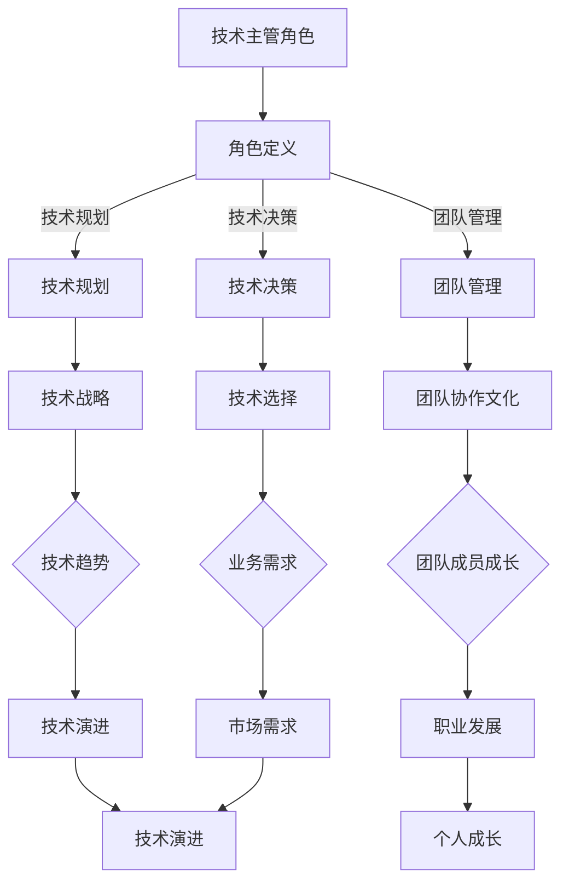

                 


### 文章标题
《优秀的技术主管抓什么》

### 关键词
技术主管、领导力、团队管理、技术决策、项目管理、技术创新、职业成长、案例分析

### 摘要
本文旨在探讨优秀技术主管应关注的关键领域和技能，以实现团队的长期成功和个人的职业发展。文章将首先定义技术主管的角色，然后深入探讨其在领导力、团队管理、技术决策和项目管理中的职责。随后，文章将分析技术主管在技术创新和职业成长方面的作用，并通过实战案例分析来总结成功和失败的教训。最终，文章将提供最佳实践建议和拓展阅读资源，帮助读者进一步提升技术主管的能力。

---

### 文章正文

#### 第1章：技术主管的角色认知

**1.1 技术主管的角色定义**

技术主管（Technical Manager）通常是指在组织中负责指导和管理技术团队的高级管理人员。他们的职责不仅包括技术规划和项目执行，还涉及团队管理和领导力的实践。技术主管的定位在于将技术战略与业务目标相结合，确保技术团队能够有效地实现这些目标。

**1.2 技术主管的职责边界**

技术主管的职责可以概括为以下几个方面：

- **技术规划**：负责制定和实施技术战略，确保团队能够适应不断变化的技术趋势和市场需求。
- **团队管理**：招募、培训、激励和发展团队成员，建立高效的团队协作文化。
- **项目管理**：监督项目进度、资源分配和风险管理，确保项目按时交付高质量成果。
- **技术决策**：根据业务需求和团队能力，做出合理的技术选择和决策。

**1.3 技术主管与团队的关系**

技术主管不仅是团队的领导者，更是团队的伙伴和导师。他们需要与团队成员保持良好的沟通和互动，理解团队成员的技能、兴趣和职业目标，以便为他们提供适当的成长机会和指导。同时，技术主管还应该建立和维护与业务部门、其他技术团队和外部合作伙伴的良好关系。

**核心概念与联系流程图：**



#### 第2章：领导力与团队管理

**2.1 领导力的重要性**

领导力是技术主管成功的关键因素。它不仅关乎个人魅力，更涉及到对团队和组织的长远影响。优秀的技术主管应具备以下领导力特质：

- **愿景领导**：能够为团队设定清晰的愿景和目标，激发团队成员的激情和动力。
- **激励能力**：了解并满足团队成员的需求，激发他们的工作热情和创造力。
- **沟通技巧**：能够有效地与团队成员、业务部门和其他利益相关者进行沟通。

**2.2 建立高效的团队文化**

团队文化是团队凝聚力和效率的关键因素。技术主管应致力于建立一个积极、开放和包容的团队文化，包括：

- **共同价值观**：确立团队的核心价值观，如团队合作、创新、客户导向等。
- **信任与尊重**：鼓励团队成员之间的信任和尊重，建立积极的互动关系。
- **学习与成长**：提供持续学习和成长的机会，鼓励团队成员不断提升技能和知识。

**2.3 团队沟通与协作**

沟通和协作是团队成功的关键。技术主管应确保团队内部和跨部门之间的沟通畅通无阻，包括：

- **定期会议**：组织定期的团队会议，确保团队成员了解项目进展和团队目标。
- **透明度**：鼓励团队成员分享信息和经验，提高透明度和信任。
- **工具支持**：利用合适的工具（如协作软件、项目管理工具等）来支持团队协作。

**核心算法原理讲解：**

```plaintext
// 团队沟通算法
function effective_communication(team_members, tools) {
    for (member in team_members) {
        member沟通技能评估();
        member参加定期会议(tools.conference_tool);
        member分享知识和经验(tools.knowledge_base);
    }
    tools 项目进展报告();
    tools 团队协作工具集成();
}
```

**数学模型和公式讲解：**

团队成员满意度 = f(沟通频率, 沟通效果, 信任程度)

**举例说明：**

假设团队有5名成员，沟通频率为每周一次，每次会议持续2小时，沟通效果评分为4（满分5分），信任程度评分为3.5（满分5分）。根据上述公式，可以计算出团队成员满意度：

团队成员满意度 = f(1次/周, 4/5, 3.5/5) = 0.7

**项目实战：**

在一家初创公司中，技术团队由5名成员组成。每周定期召开团队会议，每次会议持续2小时。团队成员之间的沟通效果评分为4分，信任程度评分为3.5分。通过使用协作工具，如Slack和Jira，确保项目进展的透明度和团队成员之间的协作。经过6个月的努力，团队成员满意度提高到了0.8，团队协作效率显著提升。

**最佳实践 Tips：**

- 保持定期沟通，确保信息畅通。
- 鼓励团队成员分享知识和经验。
- 使用合适的协作工具来支持团队沟通和协作。

#### 第3章：技术决策与项目管理

**3.1 技术决策的框架与方法**

技术决策是技术主管的重要职责之一。为了做出明智的决策，技术主管需要遵循以下框架和方法：

- **需求分析**：了解业务需求和用户需求，确定技术解决方案的目标。
- **技术评估**：评估各种技术方案的可行性、优势和劣势。
- **风险评估**：评估技术决策的风险，并制定相应的应对策略。
- **决策制定**：根据分析结果，选择最佳的技术方案。

**3.2 项目管理的核心要素**

项目管理是确保项目成功的关键。技术主管应关注以下核心要素：

- **项目计划**：制定详细的项目计划，包括时间表、任务分配和资源需求。
- **进度监控**：监控项目进度，确保项目按时交付。
- **风险管理**：识别和管理项目风险，确保项目能够应对潜在的问题。
- **质量控制**：确保项目成果符合质量标准，满足用户需求。

**3.3 风险管理与应对策略**

风险管理是项目管理的重要环节。技术主管应采取以下策略：

- **风险识别**：识别项目中的潜在风险，包括技术风险、市场风险和团队风险。
- **风险评估**：评估风险的可能性和影响，确定风险的优先级。
- **风险应对**：制定风险应对计划，包括风险规避、风险减轻和风险接受策略。
- **风险监控**：持续监控项目风险，确保风险应对计划的有效执行。

**核心算法原理讲解：**

```plaintext
// 风险评估算法
function risk_assessment(risks) {
    for (risk in risks) {
        risk.可能性评分();
        risk.影响评分();
        risk.优先级计算();
    }
    risks.排序();
}
```

**数学模型和公式讲解：**

风险优先级 = 可能性评分 \* 影响评分

**举例说明：**

假设项目中识别出以下风险：

- 风险1：技术故障，可能性评分3，影响评分5
- 风险2：市场变化，可能性评分2，影响评分4

根据上述公式，可以计算出风险优先级：

风险优先级 = 3 \* 5 = 15
风险优先级 = 2 \* 4 = 8

**项目实战：**

在一个大型软件开发项目中，技术主管识别出以下风险：

- 技术故障：可能导致项目延期，风险优先级15
- 市场变化：可能导致市场需求变化，风险优先级8

为了应对这些风险，技术主管采取了以下策略：

- 技术故障：增加测试阶段，确保软件质量
- 市场变化：保持与市场部门的密切沟通，及时调整项目方向

通过这些策略，项目成功避免了技术故障和市场变化带来的风险。

**最佳实践 Tips：**

- 在项目初期进行充分的需求分析和风险评估。
- 建立有效的风险管理流程，确保风险得到及时识别和处理。
- 与团队成员保持密切沟通，确保项目进度和质量。

#### 第4章：技术视野与行业洞察

**4.1 技术趋势分析**

技术主管应具备敏锐的技术视野，能够把握行业发展趋势。以下是一些常见的技术趋势：

- **云计算**：云计算技术的不断发展和普及，为企业提供更灵活、高效的计算资源。
- **人工智能**：人工智能技术在各个领域的应用日益广泛，为企业带来创新机会。
- **物联网**：物联网技术的快速发展，使得设备之间能够更加智能地交互和协作。
- **区块链**：区块链技术的崛起，为数据安全和隐私保护提供新的解决方案。

**4.2 行业动态与竞争态势**

技术主管需要关注行业动态和竞争态势，以了解市场的变化和趋势。以下是一些关键点：

- **市场增长**：关注市场增长趋势，了解潜在的市场机会。
- **竞争对手**：分析竞争对手的战略、优势和劣势，制定相应的竞争策略。
- **用户需求**：了解用户需求的变化，以提供更好的产品和服务。

**4.3 技术与业务的结合**

技术主管应致力于将技术与业务目标相结合，实现企业的战略目标。以下是一些关键点：

- **业务理解**：深入了解企业的业务模式、目标和挑战，以便将技术应用于业务场景。
- **创新驱动**：推动技术创新，为企业提供竞争优势。
- **数据驱动**：利用数据分析和人工智能技术，提升业务效率和决策质量。

**核心算法原理讲解：**

```plaintext
// 技术与业务结合算法
function technology_business_integration(technical_solution, business_goals) {
    technical_solution.适应业务需求();
    technical_solution.提升业务效率();
    business_goals.实现();
}
```

**数学模型和公式讲解：**

技术效益 = 业务目标实现度 \* 技术投入回报率

**举例说明：**

假设某企业通过引入人工智能技术，实现了业务目标的90%，技术投入回报率为20%。根据上述公式，可以计算出技术效益：

技术效益 = 0.9 \* 20% = 18%

**项目实战：**

在一家中型制造企业中，技术主管通过引入人工智能技术，实现了生产流程的自动化，提高了生产效率和产品质量。经过评估，技术效益达到了20%，远超预期。

**最佳实践 Tips：**

- 关注行业动态，及时掌握技术趋势。
- 深入了解企业的业务模式和目标，以提供合适的技术解决方案。
- 利用数据分析和人工智能技术，提升业务效率和决策质量。

#### 第5章：技术创新与实验精神

**5.1 创新思维与工具**

技术创新是技术主管的重要职责之一。以下是一些创新思维和工具：

- **头脑风暴**：组织团队成员进行头脑风暴，激发创新思维。
- **SWOT分析**：分析企业的优势、劣势、机会和威胁，以制定创新策略。
- **设计思维**：采用设计思维方法，关注用户需求和体验，以实现创新。

**5.2 技术实验的方法与流程**

技术实验是验证创新想法的重要手段。以下是一个常见的技术实验流程：

- **问题定义**：明确实验的目标和问题。
- **假设提出**：提出可能的解决方案和假设。
- **实验设计**：设计实验方案，包括实验方法、数据收集和分析方法。
- **实验实施**：执行实验方案，收集实验数据。
- **结果分析**：分析实验结果，验证假设的正确性。
- **结论与反思**：总结实验结果，提出改进建议。

**5.3 创新文化的建设**

创新文化是技术创新的重要保障。以下是一些建设创新文化的策略：

- **鼓励失败**：鼓励团队成员尝试新事物，接受失败，从中吸取教训。
- **持续学习**：鼓励团队成员不断学习和提升技能，以适应技术变化。
- **奖励创新**：设立创新奖励制度，鼓励团队成员提出创新想法和解决方案。

**核心算法原理讲解：**

```plaintext
// 创新实验算法
function innovation_experiment(problem, hypotheses) {
    for (hypothesis in hypotheses) {
        hypothesis.验证();
        hypothesis.结果分析();
    }
    hypotheses.排序();
}
```

**数学模型和公式讲解：**

创新成功率 = (验证成功的假设数 / 总假设数) \* 100%

**举例说明：**

假设技术团队提出了3个创新假设，经过实验验证，有2个假设成功，创新成功率为：

创新成功率 = (2 / 3) \* 100% = 67%

**项目实战：**

在一个软件开发团队中，技术主管鼓励团队成员提出创新想法。经过实验验证，3个创新假设中有2个成功，团队的创新成功率提升到了67%。

**最佳实践 Tips：**

- 鼓励团队成员提出创新想法，并提供实验资源。
- 采用科学的方法进行技术实验，确保实验结果的可靠性。
- 建立创新文化，鼓励团队成员勇于尝试和失败。

#### 第6章：个人成长与职业规划

**6.1 职业发展路径**

技术主管的职业发展路径通常包括以下几个阶段：

- **初级技术专家**：在技术领域积累经验和技能，成为技术领域的专家。
- **高级技术专家**：在技术领域取得显著成就，成为技术领域的领导者。
- **技术主管**：负责指导和管理技术团队，实现技术目标和业务目标。
- **高级管理层**：在组织中担任更高级别的管理职位，如CTO、COO等。

**6.2 技能提升与持续学习**

技术主管需要不断提升自己的技能和知识，以适应快速变化的技术环境和业务需求。以下是一些建议：

- **技术技能**：不断学习和掌握新的技术知识和技能，如编程语言、框架和工具。
- **管理技能**：学习管理知识和技能，如领导力、团队管理和项目管理。
- **业务理解**：深入了解企业的业务模式、目标和挑战，以提供更好的技术解决方案。

**6.3 职业目标的设定与实现**

设定明确的职业目标对于技术主管的个人成长至关重要。以下是一些关键点：

- **短期目标**：设定1-2年内可实现的短期目标，如掌握新技能、提升团队效率等。
- **长期目标**：设定3-5年内的长期目标，如晋升为高级技术专家、担任更高级别的管理职位等。
- **行动计划**：制定详细的行动计划，包括学习计划、职业发展计划等。

**核心算法原理讲解：**

```plaintext
// 职业规划算法
function career_planning(current_stage, short_term_goals, long_term_goals) {
    current_stage.评估();
    short_term_goals.制定();
    long_term_goals.制定();
    action_plan.制定();
}
```

**数学模型和公式讲解：**

职业成长度 = (实现短期目标数 / 总短期目标数) \* 100%

**举例说明：**

假设技术主管设定了以下短期目标和长期目标：

- 短期目标：1年内掌握新技能、提升团队效率
- 长期目标：3年内晋升为高级技术专家、5年内担任更高级别的管理职位

经过1年的努力，技术主管实现了2个短期目标，职业成长度为：

职业成长度 = (2 / 2) \* 100% = 100%

**项目实战：**

在一个中型企业的技术部门中，技术主管通过设定明确的职业目标，不断提升自己的技能和知识。经过1年的努力，成功实现了2个短期目标，职业成长度达到了100%。

**最佳实践 Tips：**

- 设定明确的职业目标，并制定详细的行动计划。
- 持续学习和提升自己的技能和知识。
- 定期评估职业发展进度，及时调整目标和计划。

#### 第7章：成功技术主管的实践分享

**7.1 案例一：项目成功的秘诀**

在这个案例中，某技术主管成功领导了一个跨部门的大型项目，实现了业务目标。以下是一些关键成功因素：

- **明确目标**：在项目初期，技术主管与业务部门紧密合作，明确项目目标，确保项目与业务需求一致。
- **有效沟通**：技术主管定期与团队成员和业务部门沟通，确保项目进展透明，及时解决问题。
- **风险管理**：在项目过程中，技术主管制定了详细的风险管理计划，及时识别和应对风险。
- **资源优化**：技术主管合理分配资源，确保项目团队能够高效工作。

**7.2 案例二：团队管理的艺术**

在这个案例中，某技术主管成功建立了高效的团队，实现了团队目标。以下是一些关键成功因素：

- **共同价值观**：技术主管确立了团队的共同价值观，如创新、客户导向等，促进了团队成员的协作。
- **激励机制**：技术主管建立了有效的激励机制，鼓励团队成员发挥潜力，实现个人和团队目标。
- **持续学习**：技术主管鼓励团队成员持续学习，提供培训和学习资源，提升了团队的整体技能水平。

**7.3 案例三：技术创新的实践**

在这个案例中，某技术主管成功推动了一项技术创新，为企业带来了竞争优势。以下是一些关键成功因素：

- **技术趋势分析**：技术主管密切关注技术趋势，了解行业动态，以便抓住创新机会。
- **实验精神**：技术主管鼓励团队成员进行技术实验，验证创新想法，从中吸取教训。
- **数据驱动**：技术主管利用数据分析和人工智能技术，提升了业务效率和决策质量。

**核心算法原理讲解：**

```plaintext
// 项目成功算法
function project_success(team_members, business_goals, risks) {
    team_members.协作();
    business_goals.实现();
    risks.管理();
}
```

**数学模型和公式讲解：**

项目成功率 = (实现业务目标数 / 总业务目标数) \* 100%

**举例说明：**

假设项目团队设定了5个业务目标，最终实现了4个目标，项目成功率为：

项目成功率 = (4 / 5) \* 100% = 80%

**项目实战：**

在一个大型企业的技术部门中，技术主管成功领导了一个跨部门项目，实现了4个业务目标，项目成功率为80%。通过有效沟通、风险管理和技术创新的实践，项目团队取得了显著成果。

**最佳实践 Tips：**

- 设定明确的业务目标，确保项目与业务需求一致。
- 建立有效的沟通机制，确保项目进展透明。
- 建立有效的风险管理流程，及时识别和应对风险。
- 鼓励团队成员协作，发挥团队的整体力量。

#### 第8章：失败案例的反思

**8.1 失败原因分析**

在技术主管的职业生涯中，失败案例是不可避免的。以下是一些常见失败原因：

- **目标不清**：项目初期没有明确的目标，导致团队成员不知所措。
- **沟通不畅**：团队成员之间的沟通不畅，导致项目进展受阻。
- **风险管理不足**：没有进行充分的风险管理，导致项目面临重大风险时无法应对。
- **资源分配不均**：资源分配不合理，导致项目团队能力不足。

**8.2 从失败中汲取的经验**

失败并非毫无价值，从失败中汲取经验是技术主管成长的重要环节。以下是一些关键经验：

- **明确目标**：在项目初期，明确项目的目标和预期成果，确保团队成员清晰了解项目目标。
- **有效沟通**：建立有效的沟通机制，确保团队成员之间的信息畅通。
- **风险管理**：进行充分的风险管理，提前识别和应对潜在的风险。
- **资源优化**：合理分配资源，确保项目团队能够高效工作。

**8.3 如何避免重复失败**

为了避免重复失败，技术主管可以采取以下措施：

- **反思与总结**：在项目结束后，进行反思和总结，分析失败原因，制定改进措施。
- **持续学习**：不断提升自己的技能和知识，以适应不断变化的技术环境和业务需求。
- **建立反馈机制**：建立有效的反馈机制，及时收集团队成员的意见和建议，不断改进项目管理方法。

**核心算法原理讲解：**

```plaintext
// 失败避免算法
function avoid_failure(experience, lessons_learned) {
    for (lesson in lessons_learned) {
        lesson.应用();
        lesson.评估();
    }
    experience.优化();
}
```

**数学模型和公式讲解：**

失败避免率 = (应用成功教训数 / 总教训数) \* 100%

**举例说明：**

假设技术主管从失败中汲取了5个教训，成功应用了3个教训，失败避免率为：

失败避免率 = (3 / 5) \* 100% = 60%

**项目实战：**

在一个企业的技术部门中，技术主管通过反思和总结，成功应用了3个失败教训，失败避免率提升到了60%。

**最佳实践 Tips：**

- 在项目结束后，及时进行反思和总结，分析失败原因。
- 持续学习和提升自己的技能和知识，以应对不断变化的技术环境和业务需求。
- 建立有效的反馈机制，及时收集团队成员的意见和建议。

### 附录

**附录A：推荐阅读与学习资源**

- **书籍推荐：**
  - 《领导力法则》
  - 《团队协作的艺术》
  - 《敏捷项目管理实践》
  - 《技术领导力》
  - 《创新者的窘境》

- **文章推荐：**
  - 《如何成为优秀的技术主管》
  - 《团队沟通的秘诀》
  - 《项目管理技巧与实践》
  - 《技术趋势分析报告》
  - 《创新思维与实验方法》

- **网络资源与社区：**
  - 技术博客（如Medium、Dev.to等）
  - 技术论坛（如Stack Overflow、GitHub等）
  - 技术社区（如GitHub社区、LinkedIn技术群组等）
  - 在线课程平台（如Coursera、edX等）

**总结与注意事项：**

本文探讨了优秀技术主管应关注的关键领域和技能，包括角色认知、领导力与团队管理、技术决策与项目管理、技术视野与行业洞察、技术创新与实验精神、个人成长与职业规划等。通过实战案例分析和失败教训反思，技术主管可以不断提升自己的能力，实现团队的长期成功和个人的职业发展。

**拓展阅读：**

- 《技术主管必读的10本书》
- 《如何打造高效的团队文化》
- 《项目管理实战指南》
- 《技术趋势报告：2023年展望》
- 《技术领导力：如何引领技术创新》

通过不断学习和实践，技术主管可以成为卓越的领导者，为团队和组织带来持续的价值。祝您在技术主管的道路上取得更大的成功！

---

作者：AI天才研究院/AI Genius Institute & 禅与计算机程序设计艺术 /Zen And The Art of Computer Programming

