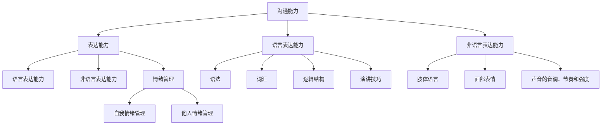

                 

# 文章标题：会'干'，更要会'说'

> 关键词：沟通能力、表达能力、职场应用、团队协作、跨文化沟通、个人品牌建设

> 摘要：本文旨在探讨沟通与表达能力的重要性，从基础技巧、职场应用、跨文化沟通和个人品牌建设等方面，全面解析如何在实际工作中有效提升沟通与表达能力，从而实现个人和团队的成长与发展。

## 引言

在信息技术飞速发展的今天，拥有扎实的专业技能无疑是职场成功的关键。然而，随着团队协作的日益复杂，跨文化交流的频繁，以及职场竞争的加剧，沟通与表达能力的重要性愈发凸显。会'干'，更要会'说'，这句话道出了在现代职场中，沟通与表达能力不可或缺的地位。

本文将从以下几个方面展开讨论：

1. 沟通与表达的重要性
2. 沟通与表达的基础技巧
3. 职场沟通与表达技巧
4. 团队协作与跨文化沟通
5. 个人品牌建设与表达
6. 实战案例与技巧
7. 综合运用与效果评估

通过以上内容的分析，希望能够帮助读者理解沟通与表达能力在职场中的重要性，并提供实用的技巧和策略，助力个人和团队的成功。

## 沟通与表达的重要性

### 社会互动中的沟通

沟通是人类社会互动的基石，无论是在个人生活中还是在职场中，沟通都是不可或缺的。有效的沟通能够促进人际关系的发展，增强团队的凝聚力，提高工作效率。在职场中，良好的沟通能力可以帮助员工更好地理解工作任务，减少误解和冲突，从而实现个人和团队的共同目标。

### 职场成功的关键因素

职场成功不仅仅依赖于专业技能的掌握，更依赖于与他人的有效沟通。沟通能力决定了一个人在职场中的影响力、领导力和职业发展。具备良好沟通能力的人，能够清晰表达自己的想法，理解他人的观点，从而在团队合作中发挥关键作用。此外，优秀的沟通能力还能帮助个人在职业发展中获得更多的机会和资源。

### 沟通障碍与解决策略

尽管沟通在职场中至关重要，但沟通障碍也是普遍存在的。语言障碍、文化差异、情绪因素等都可能影响沟通效果。要克服这些障碍，需要采取一系列解决策略，如提高语言表达能力、了解不同文化背景、掌握情绪管理技巧等。

### 表达技巧与方法

表达技巧是沟通能力的重要组成部分。清晰、简洁、有逻辑的表达能够有效地传达信息，减少误解。提升表达技巧的方法包括：练习语言表达、学习非语言沟通技巧、掌握演讲与演示技巧等。通过这些方法，可以逐步提高自己的表达水平，更好地应对职场挑战。

### 沟通中的心理因素

沟通不仅仅是信息的传递，还涉及到心理层面的互动。建立信任、倾听与反馈是有效沟通的关键心理因素。在职场中，建立信任可以促进团队合作，倾听与反馈则有助于提高沟通质量，增强团队的协作效果。

### 沟通技巧的提升

提升沟通技巧需要持续的练习和反思。通过参加沟通培训课程、阅读相关书籍、与他人交流学习等方式，可以不断改进自己的沟通能力。同时，反思自己的沟通行为，识别并改正不足之处，也是提升沟通技巧的重要方法。

## 背景介绍

沟通与表达能力的重要性在于，它不仅影响个人在职场中的表现，还直接关系到团队和组织的绩效。在快速变化的商业环境中，企业需要灵活的团队和个体来适应不断变化的市场需求。然而，现实情况是，很多职场人士过于关注技术技能的提升，而忽视了沟通与表达能力的培养。这不仅限制了他们的职业发展，也可能导致团队协作的障碍。

现代职场对沟通与表达能力的要求越来越高。随着全球化的深入，跨文化沟通成为常态；互联网的普及，使得信息传递的速度和范围大幅增加；而职场竞争的加剧，要求员工具备更强的沟通能力和表达能力，以在激烈的竞争中脱颖而出。

本篇文章将从多个维度探讨如何在实际工作中提升沟通与表达能力。首先，我们将从基础技巧入手，介绍如何通过练习和提高语言表达能力来增强沟通效果。接着，我们将讨论职场沟通中的具体应用，包括会议沟通、演讲与演示等场景中的沟通技巧。随后，我们将探讨团队协作和跨文化沟通的重要性，以及如何通过有效的沟通策略来提高团队绩效和跨文化沟通的效率。

最后，我们将讨论个人品牌建设与表达，如何通过建立个人品牌来提升个人在职场中的影响力和认可度。文章还将通过实战案例和技巧的分享，为读者提供实用的沟通策略和方法，帮助他们在实际工作中更加自如地应对各种沟通挑战。

通过本篇文章的深入探讨，读者将能够理解沟通与表达能力在职场中的关键作用，并掌握一系列实用的提升技巧，从而在实际工作中取得更好的成果。

## 核心概念与联系

为了更好地理解沟通与表达能力，我们需要明确几个核心概念，并探讨它们之间的相互关系。以下是这些核心概念的架构：

1. **沟通能力**：指个体在信息传递、接收和反馈过程中，运用语言、非语言和符号系统进行有效互动的能力。
2. **表达能力**：指个体在沟通中清晰、准确、有逻辑地表达思想、观点和信息的能力。
3. **语言表达能力**：具体包括口头表达和书面表达两个层面，是表达能力的基础。
4. **非语言沟通**：通过肢体语言、面部表情、眼神交流等非语言形式进行的沟通。
5. **情绪管理**：在沟通过程中，对自身和他人情绪进行有效调控的能力，以避免情绪干扰沟通效果。

### 沟通能力的架构

沟通能力的架构可以简化为以下部分：

- **基础技能**：包括语言表达、倾听和理解。
- **高级技能**：包括说服力、影响力、情绪管理和冲突解决。

### 表达能力的架构

表达能力的架构可以进一步细化：

- **语言表达能力**：包括语法、词汇、逻辑结构、演讲技巧。
- **非语言表达能力**：包括肢体语言、面部表情、声音的音调、节奏和强度。

### 核心概念之间的联系

- **沟通能力与表达能力**：沟通能力是表达能力的前提，表达能力是沟通能力的核心。两者相辅相成，共同决定了沟通效果。
- **语言表达与非语言表达**：语言表达是沟通的主要手段，非语言表达则可以补充和强化语言表达。例如，肢体语言可以增强语言的说服力。
- **情绪管理与沟通**：情绪管理是有效沟通的关键因素，情绪不稳定会影响沟通效果。通过情绪管理，可以更好地控制自己的情绪，避免负面情绪对沟通的干扰。

### Mermaid 流程图

以下是沟通能力与表达能力之间的 Mermaid 流程图：



通过这个流程图，我们可以清晰地看到各个核心概念之间的关系，以及它们在沟通与表达能力中的具体作用。

### 核心算法原理讲解

在沟通与表达能力中，算法原理主要体现在以下几个方面：

1. **信息编码**：个体将思想、观点和信息转化为语言、符号等可以传递的形式。
2. **信息传递**：通过语言、非语言等方式将编码后的信息传递给接收者。
3. **信息解码**：接收者接收信息后，将其还原为原始的思想、观点和信息。
4. **反馈机制**：通过反馈来检验沟通效果，并根据反馈进行适当的调整。

以下是这些算法原理的伪代码：

```python
# 信息编码
def encode_message(message):
    encoded_message = convert_to_language(message)
    return encoded_message

# 信息传递
def transmit_message(encoded_message):
    transmitted_message = send_encoded_message(encoded_message)
    return transmitted_message

# 信息解码
def decode_message(transmitted_message):
    decoded_message = convert_to_original(transmitted_message)
    return decoded_message

# 反馈机制
def feedback Mechanism(transmitted_message, original_message):
    if transmitted_message == original_message:
        print("沟通成功")
    else:
        print("沟通失败，需调整")
```

### 数学模型和公式

在沟通与表达中，可以引入一些数学模型和公式来解释和优化沟通效果：

1. **信息传输效率**：衡量信息传递的速度和质量，公式为：效率 = 传递速度 × 传递质量。
2. **沟通成本**：包括时间成本、人力成本和沟通障碍等，公式为：成本 = 时间成本 + 人力成本 + 沟通障碍成本。

这些公式可以帮助我们定量分析沟通的效果和成本，从而制定更有效的沟通策略。

### 举例说明

假设一个项目经理需要向团队传达一个关键的项目进度信息。以下是该过程的具体步骤：

1. **信息编码**：项目经理将项目进度信息转化为详细的书面报告。
2. **信息传递**：通过电子邮件将报告发送给团队成员。
3. **信息解码**：团队成员阅读报告，理解项目进度信息。
4. **反馈机制**：团队成员通过邮件回复项目经理，确认已理解报告内容。

通过以上步骤，项目经理有效地将信息传达给团队成员，并确保团队成员对项目进度有清晰的理解。

通过以上对核心概念、算法原理和数学公式的讲解，我们可以更好地理解沟通与表达能力在职场中的具体应用和重要性。接下来，我们将深入探讨职场沟通与表达的具体技巧。

### 职场沟通与表达技巧

在职场中，沟通与表达能力的重要性不言而喻。有效的沟通不仅能提升工作效率，还能增强团队凝聚力，促进个人职业发展。以下，我们将详细探讨职场中常见的沟通与表达技巧，包括会议沟通、演讲与演示、电子邮件沟通等。

#### 会议沟通技巧

1. **准备充分**：在会议前，确保对会议的主题、议程和参与人员有充分了解。准备相关的资料和数据，以便在会议中能够清晰地表达自己的观点。
2. **明确目标**：在会议开始前，明确会议的目标和期望结果，这有助于确保会议的讨论集中在关键问题上。
3. **倾听与回应**：在会议中，不仅要表达自己的观点，还要认真倾听他人的意见。对于他人的发言，给予适当的回应，以显示对他人意见的尊重。
4. **避免打断**：在他人发言时，避免打断他们的表达。如果需要发言，可以等待对方发言完毕后，再进行补充或提问。
5. **控制情绪**：在会议中，保持冷静和专业，避免因情绪波动而影响沟通效果。遇到冲突时，要冷静处理，寻求共赢的解决方案。

#### 演讲与演示技巧

1. **结构清晰**：在演讲或演示前，要确保内容的结构清晰，逻辑连贯。可以采用“开场白-主体内容-总结”的结构来组织演讲。
2. **开场吸引注意**：在演讲开始时，可以通过一个引人入胜的故事或数据来吸引听众的注意力。
3. **视觉辅助**：使用幻灯片、图表等视觉辅助工具，帮助听众更好地理解演讲内容。确保视觉辅助工具简洁、直观、与演讲内容紧密相关。
4. **语言生动**：在演讲中，使用生动的语言和案例来增强说服力。避免使用过于专业或复杂的术语，以免听众难以理解。
5. **互动与反馈**：在演讲过程中，可以适当与听众互动，如提问、邀请反馈等，以增加听众的参与感和兴趣。

#### 电子邮件沟通技巧

1. **主题明确**：在发送电子邮件时，确保邮件主题简洁明了，能够清楚地传达邮件的主要内容。
2. **正文简明**：邮件正文要简明扼要，避免冗长和复杂的句子结构。确保邮件内容有条理，逻辑清晰。
3. **礼貌用语**：在邮件中使用礼貌用语，如问候语、结束语等，以显示对收件人的尊重。
4. **避免误解**：在表达意见或建议时，要避免使用模糊或歧义的语句。可以通过举例或明确说明来确保对方理解自己的意图。
5. **及时回复**：在收到电子邮件后，要及时给予回复，以显示对工作的认真态度和责任心。

通过以上职场沟通与表达技巧，可以有效地提升沟通效率，增强团队协作，促进个人职业发展。在职场中，不断练习和提升这些技巧，将有助于我们在各种沟通场景中更加自如地应对挑战。

### 团队协作与表达

团队协作在职场中至关重要，而有效的沟通与表达是团队协作成功的关键。以下是关于团队协作中的表达技巧和沟通策略，以及跨文化团队协作的挑战和解决方法。

#### 团队协作中的表达技巧

1. **建立共同目标**：团队成员应明确共同的目标，这有助于增强团队的凝聚力，提高协作效率。在项目启动时，通过讨论和明确共同目标，可以确保团队成员对项目方向有统一的理解。
2. **主动沟通**：在团队协作中，主动沟通是关键。团队成员应主动分享自己的观点、意见和建议，同时也要倾听他人的意见。通过频繁的交流，可以确保团队在项目过程中保持同步。
3. **明确分工**：在团队中，明确每个成员的分工和职责，有助于避免任务重叠和职责不清的问题。通过明确分工，团队成员可以更专注于自己的任务，提高工作效率。
4. **积极反馈**：在团队协作中，积极的反馈可以促进成员之间的沟通和理解。通过及时反馈，团队成员可以了解自己的工作表现，以及如何改进自己的工作方式。
5. **冲突管理**：在团队协作中，冲突是不可避免的。有效的冲突管理策略可以避免冲突升级，确保团队稳定。可以通过开放对话、寻求共赢方案等方式来处理冲突。

#### 跨文化团队协作的挑战与解决方法

跨文化团队协作的挑战主要来自文化差异，如语言障碍、价值观差异、工作习惯不同等。以下是应对这些挑战的策略：

1. **尊重文化差异**：在跨文化团队中，尊重文化差异是基础。团队成员应了解并尊重彼此的文化背景，避免因文化差异而产生的误解和冲突。
2. **提高语言能力**：语言障碍是跨文化团队协作中的主要挑战之一。团队成员应努力提高自己的语言能力，至少达到可以顺畅交流的水平。对于非母语环境，可以借助翻译工具或聘请专业翻译协助。
3. **共同价值观**：尽管文化差异存在，但共同的价值观可以增强团队的凝聚力。在跨文化团队中，可以通过讨论和建立共同价值观，来提高团队协作的效率。
4. **文化培训**：为了更好地理解和适应不同文化，团队成员可以参加文化培训课程。通过了解不同文化的特点和习惯，可以减少文化冲突，提高跨文化沟通效果。
5. **灵活应对**：在跨文化团队协作中，灵活应对是关键。团队成员应学会适应不同的工作环境和习惯，以适应多元文化的工作环境。

通过以上团队协作和跨文化团队协作的技巧和策略，可以有效地提升团队协作效率，促进个人和团队的发展。在职场中，不断练习和提升这些技巧，将有助于我们在各种团队协作场景中更加自如地应对挑战。

### 个人品牌建设与表达

个人品牌建设是职场成功的关键要素之一。一个强大的个人品牌不仅能够提升个人的市场价值，还能增强个人在职场中的影响力和认可度。以下，我们将探讨如何通过个人品牌建设与表达来提升个人在职场中的地位和影响力。

#### 个人品牌的重要性

个人品牌是指个人在公众心目中的形象和声誉。一个强大的个人品牌能够为个人带来以下几个方面的优势：

1. **职业发展机会**：强大的个人品牌能够吸引更多的职业机会，包括晋升、跳槽等。在求职市场中，一个有良好个人品牌的求职者更容易获得面试机会和录用。
2. **信任和认可**：良好的个人品牌能够增强他人对个人的信任和认可。无论是在团队合作中，还是在项目管理中，信任都是成功的关键。
3. **领导力和影响力**：个人品牌能够提升个人的领导力和影响力。一个有影响力的个人品牌可以更好地推动项目进展，带领团队实现目标。

#### 建立个人品牌的方法

1. **明确个人品牌定位**：建立个人品牌的第一步是明确个人品牌定位。个人品牌定位应基于个人的专业领域、技能优势和价值观。通过明确定位，可以更好地吸引目标受众。
2. **持续学习和提升**：个人品牌的建设是一个持续的过程，需要不断学习和提升。通过参加培训课程、阅读专业书籍、参加行业会议等方式，可以不断提高自己的专业水平，增强个人品牌的影响力。
3. **建立专业网络**：建立专业网络是提升个人品牌的重要途径。通过参加行业活动、加入专业组织、参与在线讨论等方式，可以结识更多行业内的专业人士，扩大自己的影响力。
4. **社交媒体运用**：社交媒体是展示个人品牌的重要平台。通过在社交媒体上分享专业知识和见解，参与行业讨论，可以提升个人在职场中的知名度和认可度。
5. **建立个人网站或博客**：建立个人网站或博客是展示个人专业知识和经验的最佳方式。通过定期更新内容，可以吸引更多的关注，提高个人品牌的知名度。

#### 个人表达技巧

1. **清晰表达**：在任何沟通场景中，清晰表达都是关键。通过使用简单、明确的语言，确保自己的观点和想法能够被准确理解和传达。
2. **展示专业素养**：在表达过程中，展示专业素养至关重要。通过使用专业术语、引用权威资料、提供实际案例等方式，可以增强自己的专业形象。
3. **情感表达**：情感表达是提升沟通效果的重要手段。通过适当表达情感，如热情、自信、决心等，可以增强自己的说服力，赢得他人的信任和认可。
4. **互动与反馈**：在沟通过程中，积极互动和反馈可以提升沟通效果。通过提问、倾听、回应等方式，可以建立良好的沟通氛围，增强彼此的理解和信任。

通过以上方法，个人可以有效地提升个人品牌，增强在职场中的影响力和认可度。持续地建设和提升个人品牌，不仅有助于职业发展，还能为个人带来更多的机会和资源。在职场中，不断学习和提升个人品牌建设与表达的技巧，将有助于我们更好地应对各种挑战，实现职业目标。

### 实战案例与技巧

在实际工作中，提升沟通与表达能力不仅需要理论知识，更需要实战技巧。以下，我们将通过几个具体的实战案例，分享提升沟通与表达能力的实用技巧。

#### 案例一：成功的产品发布会演讲

在一次产品发布会上，某公司的产品经理需要在短时间内向数百名投资者和客户展示新产品。为了确保演讲成功，产品经理采取了以下策略：

1. **提前准备**：在演讲前，产品经理详细研究了投资者的需求和客户的痛点，准备了针对性的演讲内容。同时，他还进行了多次模拟演讲，确保演讲内容流畅、逻辑清晰。
2. **结构清晰**：产品经理采用了“开场白-产品介绍-问答环节”的结构，使演讲内容条理清晰，便于听众理解。
3. **视觉辅助**：他使用了高质量的幻灯片和视频，通过生动的视觉元素，增强了演讲的吸引力。
4. **互动与反馈**：在演讲过程中，产品经理积极与听众互动，邀请听众提问，并通过回答问题来进一步展示产品的优势。

通过以上策略，产品经理成功地吸引了投资者的注意，并获得了客户的积极反馈，为公司赢得了重要的商业机会。

#### 案例二：高效的团队沟通

在一个跨国团队项目中，团队成员来自不同的国家和文化背景，沟通成为项目成功的最大挑战。为了克服这一挑战，团队采取了以下策略：

1. **明确目标和分工**：在项目启动时，团队明确了项目目标，并制定了详细的分工计划。每个成员都清楚自己的职责和任务，确保项目进展顺利。
2. **定期会议**：团队每周举行一次视频会议，确保团队成员能够及时沟通和同步项目进展。每次会议都有明确的议程，讨论关键问题，解决问题。
3. **文化培训**：团队成员参加跨文化培训，了解不同文化的特点和沟通习惯，减少文化冲突，提高沟通效果。
4. **使用在线协作工具**：团队使用了多种在线协作工具，如Slack、Trello等，便于团队成员随时交流和共享信息，提高沟通效率。

通过以上策略，团队成功克服了文化差异带来的沟通障碍，高效地完成了项目任务。

#### 案例三：成功的危机沟通

在一次突发的市场危机中，某公司面临舆论压力和客户投诉。为了应对危机，公司采取了以下策略：

1. **实时应对**：公司立即成立了危机应对小组，通过媒体监控和客户反馈，实时了解危机的最新动态。
2. **统一信息发布**：公司确保所有对外发布的信息统一口径，通过官方渠道向公众传递准确信息，避免误导和谣言的传播。
3. **积极回应**：公司积极回应客户的投诉，通过电话、邮件、社交媒体等方式，与客户进行沟通，了解客户的需求和意见，并提供解决方案。
4. **反馈机制**：公司建立了反馈机制，及时收集和处理客户和媒体的反馈，根据反馈调整危机应对策略，提高沟通效果。

通过以上策略，公司成功地应对了危机，维护了品牌形象，并赢得了客户的信任和支持。

通过以上实战案例，我们可以看到，提升沟通与表达能力在实际工作中的重要性。无论是产品发布会、团队协作，还是危机应对，有效的沟通都是关键。在职场中，不断学习和应用这些实战技巧，将有助于我们在各种沟通场景中更加自如地应对挑战。

### 综合运用与效果评估

在职场中，提升沟通与表达能力不仅需要学习和掌握各种技巧，还需要在实际工作中不断实践和反思，以实现综合运用和效果评估。

#### 综合运用沟通技巧

1. **跨场景应用**：沟通技巧的应用不仅限于会议、演讲和电子邮件等传统场景，还可以在日常工作中得到广泛应用。例如，在与同事合作时，通过有效的沟通技巧可以更好地理解对方的需求，提高合作效率；在与客户交流时，通过有效的沟通技巧可以建立信任，提高客户满意度。

2. **多样化沟通方式**：在职场中，沟通方式多样化是非常重要的。通过书面沟通、口头沟通、非语言沟通等多种方式，可以更好地传达信息，增强沟通效果。例如，在重要决策时，可以采用书面报告和演示来详细说明；在日常交流中，可以通过口头沟通和非语言沟通来传递简单信息。

3. **适应不同受众**：在职场中，与不同的人沟通时，需要根据受众的特点调整沟通策略。例如，与上级沟通时，需要更加正式和有条理；与下属沟通时，需要更加亲和和鼓励。

#### 效果评估与反馈

1. **自我反思**：提升沟通与表达能力的过程需要自我反思。在每次沟通后，可以回顾自己的表现，识别自己的优点和不足。通过自我反思，可以不断提高自己的沟通技巧。

2. **求助反馈**：向同事、上级或专业人士寻求反馈，是提升沟通与表达能力的重要方法。他们可以提供外部视角，帮助识别自己在沟通中存在的问题，并提出改进建议。

3. **数据评估**：通过数据评估来衡量沟通效果。例如，可以通过邮件的回复率、会议的参与度、项目的完成情况等数据来评估沟通的效果。通过数据评估，可以客观地了解自己的沟通表现，为后续改进提供依据。

#### 持续提升策略

1. **学习和培训**：参加沟通培训课程，阅读相关书籍和资料，可以不断学习新的沟通技巧和方法。通过持续学习，可以不断提升自己的沟通能力。

2. **实践与应用**：将学到的沟通技巧应用到实际工作中，通过实践来提高沟通能力。例如，在项目中尝试新的沟通策略，与不同的人进行交流，以积累实际经验。

3. **反思与调整**：在实践过程中，不断反思和调整自己的沟通策略。通过反思和调整，可以不断优化自己的沟通方法，提高沟通效果。

通过综合运用和效果评估，可以更好地提升沟通与表达能力，在职场中更加自如地应对各种沟通挑战，实现个人和团队的发展。

### 最佳实践 tips、小结、注意事项、拓展阅读

#### 最佳实践 tips

1. **每日反思**：每天结束时，花几分钟时间反思今天的沟通，记录下成功和失败的原因，以及可以改进的地方。
2. **练习演讲**：定期参加演讲培训，或模拟演讲练习，提高自己的演讲技巧和自信。
3. **主动倾听**：在沟通中，专注于对方的话语，不打断，不急于表达自己的观点，以展示尊重和理解。
4. **使用可视化工具**：在书面和口头沟通中，使用图表、图片等可视化工具，帮助对方更好地理解信息。

#### 小结

本文通过详细探讨沟通与表达能力的重要性、基础技巧、职场应用、跨文化沟通和个人品牌建设等方面，为读者提供了一系列实用的提升策略和技巧。有效的沟通与表达不仅能够提高个人职业素养，还能促进团队协作和职业发展。

#### 注意事项

1. **适度练习**：提升沟通与表达能力需要持续练习，但也要避免过度练习，导致疲劳。
2. **尊重差异**：在跨文化沟通中，尊重文化差异，避免使用可能引起误解的语言和行为。
3. **反馈与调整**：定期寻求反馈，并根据反馈进行调整，以不断优化沟通技巧。

#### 拓展阅读

- 《非暴力沟通》（马歇尔·卢森堡著）：探讨如何通过非暴力沟通方法，建立和谐的人际关系。
- 《说话的力量》（克里斯·沃斯著）：详细解析如何提升说话技巧，增强说服力和影响力。
- 《跨文化沟通》（霍尔著）：深入探讨跨文化沟通的挑战和解决方法。

通过本文的阅读和拓展学习，读者可以更好地理解和应用沟通与表达能力，实现个人和职业的成长与发展。

### 作者信息

作者：AI天才研究院/AI Genius Institute & 禅与计算机程序设计艺术 /Zen And The Art of Computer Programming

本文由AI天才研究院和禅与计算机程序设计艺术共同撰写，旨在为读者提供高质量的IT领域技术博客。我们致力于通过深入分析和技术讲解，帮助读者理解和掌握前沿技术，实现职业成长。欢迎广大读者关注我们的公众号和博客，获取更多优质内容。

