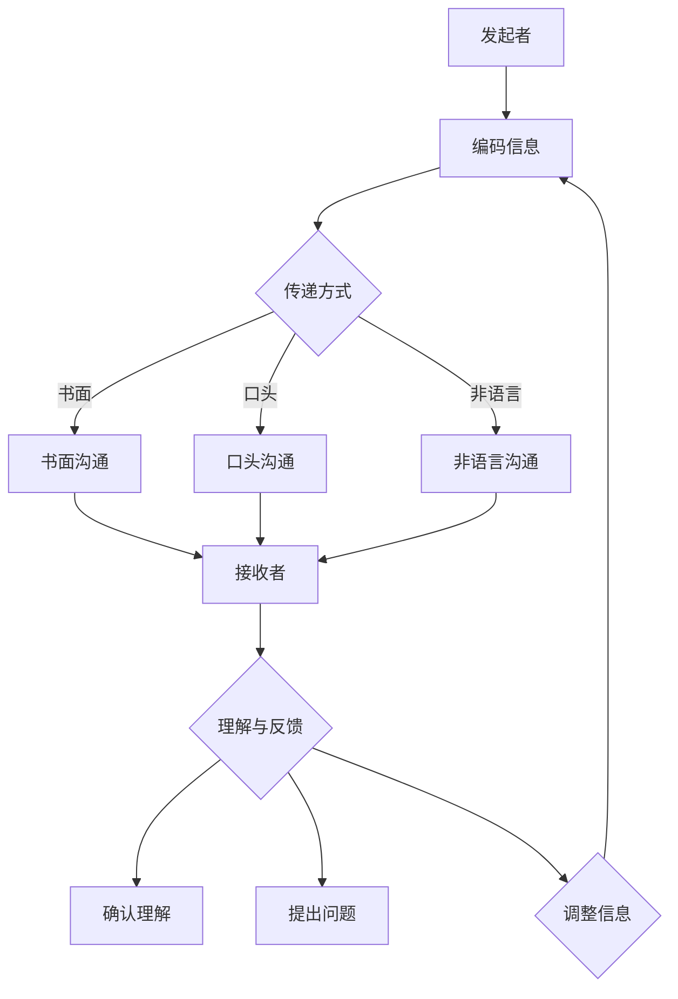

                 

### 文章标题：会"干"更要会"说"的技巧

在快速发展的科技时代，掌握高超的技术能力无疑是职场竞争的重要资本。然而，仅仅具备扎实的技术功底并不足以保证成功，会“干”更要会“说”——会表达、会沟通。本文将深入探讨在技术领域如何提升沟通技巧，使其成为个人发展的重要推动力。

> **关键词：**
> - 沟通技巧
> - 技术表达
> - 个人发展
> - 情商提升
> - 项目实战

> **摘要：**
> 本文从技术从业者的实际需求出发，阐述了提升沟通技巧的重要性。通过分析沟通的核心概念与联系，详细介绍了倾听、表达、非语言沟通等关键技巧。同时，结合实战案例和最佳实践，为读者提供了实用的沟通技巧提升策略，帮助其在技术领域脱颖而出。

---

### 沟通在技术领域的重要性

在技术领域，沟通是连接开发者、项目团队和利益相关者的桥梁。良好的沟通能力不仅能够帮助开发者更好地理解需求、解决问题，还能提高团队协作效率，减少误解和冲突。以下是沟通在技术领域中几个关键作用的具体阐述：

**1. 理解需求**

在项目开发过程中，开发者需要与产品经理、业务分析师等利益相关者进行频繁的沟通。只有通过有效的沟通，开发者才能准确理解项目需求，确保开发出的产品能够满足用户和市场的期望。

**2. 解决问题**

在技术实现过程中，开发者经常会遇到各种技术难题。此时，良好的沟通技巧能够帮助开发者更快地获取到所需的信息，从同事或外部专家那里获得宝贵的指导和帮助。

**3. 团队协作**

软件开发是一个高度协作的工作。团队成员之间的有效沟通能够确保每个人都能明确自己的任务和目标，避免重复工作或遗漏关键环节，从而提高整个团队的工作效率。

**4. 减少冲突**

在项目进展中，难免会出现意见分歧或冲突。良好的沟通技巧能够帮助团队成员通过理性讨论解决问题，避免情绪化和偏见的干扰，从而达成共识。

**5. 提升个人品牌**

在技术面试或职业发展中，沟通技巧同样至关重要。能够清晰、自信地表达自己的观点和成就，不仅能给面试官留下深刻印象，还能帮助个人在职业市场中脱颖而出。

综上所述，沟通在技术领域的作用不容小觑。掌握并提升沟通技巧，是每一位技术从业者必备的能力。接下来，我们将进一步探讨沟通的核心概念与联系，并介绍相关技巧和方法。

---

### 核心概念与联系：沟通架构

沟通是一个复杂的过程，涉及多个核心概念和环节。为了更好地理解和掌握沟通技巧，我们可以通过一个Mermaid流程图来梳理这些概念和它们之间的联系。

**流程解释：**

1. **发起者**：沟通的起点，通常为信息发送方，如开发者、项目经理等。
2. **编码信息**：发起者需要将自己的思想、观点或需求转化为可以传递的信息。
3. **传递方式**：信息可以通过书面、口头或非语言方式传递。每种方式都有其特点和适用场景。
4. **书面沟通**：包括邮件、报告、文档等，适用于正式、详细的交流。
5. **口头沟通**：包括会议、电话、即时通讯等，适用于快速、直接的交流。
6. **非语言沟通**：包括身体语言、面部表情、手势等，可以增强和补充语言沟通。
7. **接收者**：信息接收方，需要对信息进行理解和反馈。
8. **理解与反馈**：接收者需要对信息进行解码，并给出确认理解或提出问题。这一环节是沟通成功的关键。

通过这个流程图，我们可以清晰地看到沟通过程中的各个环节和它们之间的相互关系。接下来，我们将分别深入探讨倾听、表达、非语言沟通等关键技巧。

---

### 倾听的技巧

倾听是沟通的核心要素之一，是理解对方意图、建立良好关系的重要手段。在技术领域，良好的倾听能力有助于开发者准确把握需求、解决问题，从而提高项目成功率。以下是几种提升倾听技巧的方法：

**1. ** 全神贯注地听：在沟通过程中，避免分心，确保注意力集中在说话者身上。这可以通过保持眼神接触、避免做其他事情（如看手机或文件）来实现。

**2. ** 少说话，多倾听：在对方讲话时，避免打断或急于发表自己的观点。给对方足够的时间表达自己的想法，耐心倾听。

**3. ** 提问与澄清：在对方讲述过程中，适时提出问题以澄清不明之处。这不仅有助于确保理解无误，还能展现自己的认真态度。

**4. ** 使用反馈语句：在对方讲述完毕后，使用反馈语句来确认自己的理解，如“我理解您的意思是...，是这样吗？”这有助于确认双方对信息的理解一致。

**5. ** 注意非语言信号：倾听不仅仅是听语言内容，还要注意对方的身体语言、面部表情等非语言信号。这些信号往往能提供额外的信息，帮助更全面地理解对方。

**6. ** 倾听前的准备：在正式沟通前，做好充分的准备工作，了解对方的背景和需求。这有助于在沟通中更准确地理解对方，减少误解。

通过以上方法，开发者可以提升自己的倾听技巧，从而在技术领域中获得更好的沟通效果。

### 清晰表达的技巧

在技术沟通中，清晰表达是确保信息准确传达的重要手段。以下是一些提升清晰表达技巧的方法：

**1. ** 简洁明了：在表达时，尽量使用简单、直接的词汇和句子。避免使用复杂的术语或冗长的解释，以免造成误解。

**2. ** 结构清晰：在发言时，采用逻辑清晰的结构，如“总-分-总”或“问题-分析-解决方案”模式。这有助于听众更好地理解你的观点。

**3. ** 重点突出：在表达时，明确表达重点，使用强调的语气或特定的词汇来突出关键信息。这有助于听众更快地捕捉到核心内容。

**4. ** 使用例子：通过具体的例子来解释抽象概念或复杂技术，有助于听众更好地理解。例子可以是实际项目中的应用，或简化的场景模拟。

**5. ** 适当的语速和语调：在表达时，注意语速和语调的控制。过快或过慢的语速可能导致听众跟不上，而平淡的语调则可能缺乏吸引力。适当调整语速和语调，使其自然流畅。

**6. ** 避免专业术语：在非专业场合或与外行交流时，避免使用过多专业术语。如果必须使用，尽量解释其含义，以确保对方理解。

**7. ** 反馈与确认：在表达完毕后，询问听众是否理解了你的观点。这可以通过提问或请求对方复述你的观点来实现。如果对方有疑问，及时澄清。

通过以上方法，开发者可以提升自己的表达技巧，确保信息传达的准确性和有效性，从而在技术沟通中取得更好的效果。

### 非语言沟通的技巧

非语言沟通在技术领域同样重要，它包括身体语言、面部表情和手势等。以下是一些提升非语言沟通技巧的方法：

**1. ** 保持良好的姿势：在会议或演讲时，保持直立的姿势，避免懒散或交叉双臂。这显示出自信和专注。

**2. ** 眼神接触：与对方保持适度的眼神接触，以展示你的关注和诚意。但避免过于频繁或长时间的眼神凝视，以免让对方感到不舒服。

**3. ** 面部表情：通过适当的面部表情来传达情感和态度。微笑、点头或皱眉等面部表情可以增强语言沟通的效果。

**4. ** 手势和姿态：适当使用手势和姿态来辅助表达。手势可以强调重点，但避免过于夸张或频繁。

**5. ** 身体距离：根据文化差异和场合，保持适当的身体距离。太近或太远都可能影响沟通效果。

**6. ** 视觉辅助：利用PPT、图表或其他视觉辅助工具来增强非语言沟通的效果。这可以帮助听众更好地理解复杂的信息。

**7. ** 观察和模仿：观察他人的非语言沟通技巧，并适当模仿。同时，了解自己的非语言习惯，避免无意中传递错误的信息。

通过以上方法，开发者可以提升自己的非语言沟通技巧，使其在技术沟通中更加自信和有效。

### 实战案例：技术沟通中的成功与失败

**案例一：成功沟通**

某科技公司的一项新产品开发项目中，开发团队与产品经理之间建立了良好的沟通机制。每次会议前，产品经理都会详细准备需求文档，并在会议中清晰地阐述产品的功能需求。开发团队则在会议中提出技术实现上的疑问，并通过演示原型来展示自己的想法。双方在会议中保持了积极的眼神接触和适度的手势，确保了信息的准确传达和理解。最终，项目在规定的时间内高质量完成，产品得到了用户的高度评价。

**案例二：失败沟通**

另一家科技公司在新项目启动时，由于项目团队内部沟通不畅，导致项目进展缓慢。开发团队在会议中往往仅口头讨论，缺乏书面记录，导致需求理解不一致。同时，团队成员在表达时使用过多的专业术语，使部分成员感到困惑。最终，项目延期并超预算，团队内部也出现了矛盾和冲突。

**分析：**

**成功原因：**
1. 清晰的需求表达：产品经理通过详细的需求文档和明确的会议阐述，确保了需求的一致性。
2. 积极的反馈与确认：开发团队在会议中积极提问和反馈，确保了对需求的理解无误。
3. 有效的非语言沟通：双方在会议中保持了良好的眼神接触和适度的手势，增强了沟通效果。

**失败原因：**
1. 缺乏书面记录：口头讨论导致需求理解不一致，缺乏书面记录使得问题难以追踪和解决。
2. 专业术语过多：使用过多专业术语导致部分成员理解困难，影响了沟通效果。
3. 缺乏积极的眼神接触和手势：会议中缺乏眼神接触和手势，使得信息传达不够清晰和生动。

通过以上案例，我们可以看到沟通技巧在技术项目中的重要性。良好的沟通能够促进项目成功，而缺乏有效的沟通则可能导致项目失败。因此，提升沟通技巧是每一位技术从业者必须关注的重要课题。

### 高级沟通技巧提升

在技术领域，高级沟通技巧的掌握能够显著提升个人和团队的表现。以下是一些高级沟通技巧，帮助开发者进一步提升沟通效果：

**1. ** 高效会议沟通技巧：

- **准备充分**：在会议前，提前了解会议议程和参与人员，准备相关的材料和数据。
- **设定议程**：明确会议的目标和议程，确保会议内容有条不紊。
- **控制时间**：合理安排每个议程的时间，避免讨论偏离主题或时间过长。
- **积极参与**：在会议中，积极参与讨论，但也要尊重他人的发言。

**2. ** 高级谈判技巧：

- **了解对方立场**：在谈判前，充分了解对方的利益点和立场，寻找共同点和利益平衡点。
- **提出双赢方案**：在谈判中，尽量提出双方都能接受的方案，以实现双赢。
- **倾听与反馈**：在谈判过程中，积极倾听对方的意见，并给予及时的反馈。

**3. ** 国际沟通技巧：

- **了解文化差异**：不同文化背景的人有不同的沟通习惯和风格，了解并尊重这些差异。
- **适应不同沟通风格**：在不同的文化环境中，灵活调整自己的沟通方式，以适应对方的风格。
- **跨文化团队管理**：在跨文化团队中，注重团队建设，促进团队成员之间的理解和信任。

通过掌握这些高级沟通技巧，开发者可以在技术领域更自如地应对各种沟通挑战，提升个人和团队的整体表现。

### 总结与展望

在本文中，我们深入探讨了提升沟通技巧在技术领域的重要性。通过介绍倾听、表达、非语言沟通等核心技巧，并结合实战案例，我们展示了沟通技巧在实际应用中的效果。此外，我们还提出了高级沟通技巧提升策略，帮助开发者进一步提升沟通能力。

**关键点总结：**

1. **沟通是技术领域的重要技能**：有效的沟通能够提高项目成功率，促进团队协作，提升个人品牌。
2. **倾听是理解对方的关键**：全神贯注地听，使用反馈语句，确保对信息的准确理解。
3. **清晰表达是信息传达的基础**：简洁明了，结构清晰，重点突出，使用例子来辅助表达。
4. **非语言沟通增强效果**：良好的姿势、眼神接触、面部表情和手势，能够增强沟通效果。
5. **实战演练提升能力**：通过实际项目中的沟通实践，不断总结和改进。
6. **高级技巧助力突破**：掌握高效会议沟通、高级谈判和跨文化沟通等高级技巧，提升沟通效果。

**未来展望：**

随着技术的发展，沟通技巧在技术领域的应用将越来越广泛。未来，我们将看到更多创新性的沟通工具和平台的出现，帮助开发者更高效地进行沟通。同时，随着全球化的加深，跨文化沟通的技巧也将变得更加重要。技术从业者应持续关注沟通技巧的提升，以应对不断变化的职业环境。

最后，我们鼓励读者在实际工作中不断实践和提升沟通技巧，使其成为个人发展的有力助推器。

### 附录

**附录A：沟通技巧提升资源汇总**

1. **书籍推荐：**
   - 《沟通的艺术》
   - 《非暴力沟通》
   - 《说话的力量》
   - 《影响力》
2. **在线课程：**
   - Coursera的《有效沟通》
   - Udemy的《沟通技巧与职场社交》
   - edX的《沟通心理学》
3. **社交媒体资源：**
   - LinkedIn的职场沟通技巧讨论
   - Twitter上的沟通技巧专家分享
   - 微信公众号：职场沟通技巧
4. **相关网站：**
   - MindTools（提供各种沟通技巧的资源）
   - Harvard Negotiation Project（提供谈判技巧资源）
   - Communication Skills（提供全面的沟通技巧指南）

**附录B：常见沟通问题解决方案**

1. **问题：信息传递不准确**
   - **解决方案：** 使用多种沟通方式（书面、口头、非语言）来确保信息传达的准确性。
   - **技巧：** 定期进行信息反馈和确认，确保双方对信息理解一致。

2. **问题：团队内部意见分歧**
   - **解决方案：** 建立有效的沟通机制，鼓励团队成员积极表达意见，通过理性讨论解决问题。
   - **技巧：** 使用中立的语言和态度，避免情绪化，促进团队共识的形成。

3. **问题：跨部门沟通不畅**
   - **解决方案：** 加强跨部门沟通的协调，建立定期会议和沟通机制，促进信息共享和合作。
   - **技巧：** 了解不同部门的工作流程和文化，尊重彼此的差异，寻找共同点。

通过以上资源和建议，技术从业者可以不断提升自己的沟通技巧，解决常见沟通问题，提高工作效率和项目成功率。

### 作者信息

**作者：AI天才研究院/AI Genius Institute & 禅与计算机程序设计艺术 /Zen And The Art of Computer Programming**

AI天才研究院致力于推动人工智能技术的发展和普及，培养具备前瞻性和创新精神的技术人才。同时，研究院的专家团队通过撰写专业书籍和文章，分享前沿技术知识和实践经验，为业界提供有价值的指导。本书《会"干"更要会"说"的技巧》旨在帮助技术从业者提升沟通能力，助力其在职场中取得更大的成功。此外，作者还深入探讨了计算机程序设计中的哲学和艺术，通过《禅与计算机程序设计艺术》一书，引导读者在编程中寻找内心的宁静与智慧。

