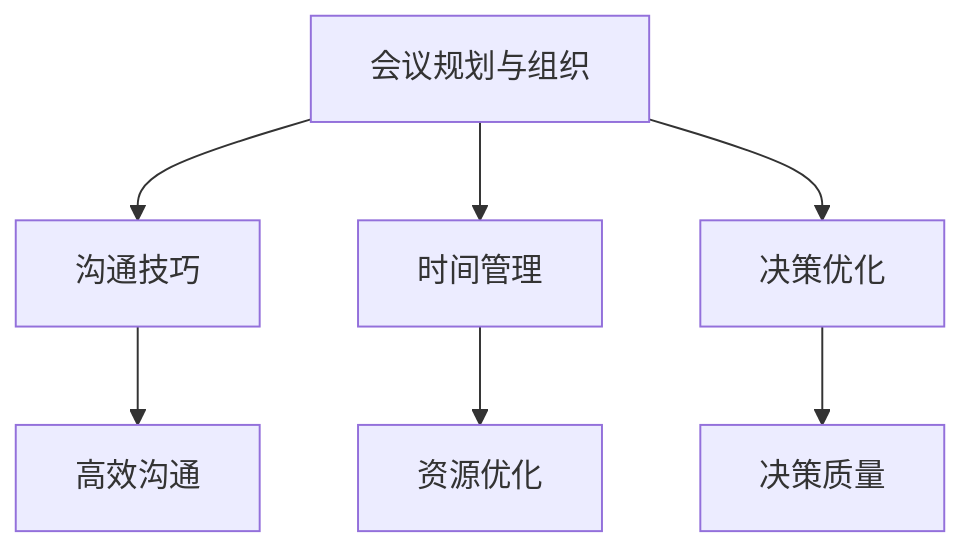

                 

### 文章标题：会议的高效需要经营

关键词：会议效率、经营策略、沟通技巧、时间管理、决策优化

摘要：本文深入探讨会议的高效经营，通过逻辑清晰、结构紧凑的分析，提出了提升会议效率的五大策略，并辅以实战案例，为读者提供了一套全面的会议管理指南。文章旨在帮助企业和个人通过科学的会议经营，提高工作效率，实现业务目标。

### 引言：会议的重要性和经营现状

在当今信息化、全球化的时代，会议作为组织沟通、决策和协作的重要工具，发挥着不可或缺的作用。无论是企业内部的部门会议，还是跨行业的研讨会，抑或是国际会议，会议都是连接团队成员、推动项目进展、共享信息与资源的关键环节。

然而，尽管会议在组织运作中占据着重要地位，实际情况却是许多会议效率低下，甚至成为了浪费时间的“黑洞”。据一项调查显示，超过70%的职场人士认为他们参加的会议效率低下，这无疑对工作效率和业务发展产生了负面影响。

会议经营的重要性在于，它不仅关系到会议的顺利进行，更直接影响到组织的整体运作效率和员工的职业幸福感。高效经营的会议能够确保时间得到有效利用，信息传递准确无误，决策过程科学合理，从而推动项目的顺利进行和组织的持续发展。

目前，关于会议经营的研究和实践主要集中在以下几个方面：

1. **会议规划和组织**：包括会议议程的制定、会议现场的布置与管理、参会者的准备与培训等。
2. **会议沟通技巧**：如何通过有效的表达和沟通方式，确保会议信息的准确传递和有效互动。
3. **会议时间管理**：如何合理规划会议时间，避免时间浪费，提高会议的效率。
4. **决策优化**：通过科学的方法和工具，优化会议决策过程，提高决策的质量和速度。

本文将从这四个方面出发，系统地探讨会议的高效经营策略，并结合实际案例，提供实用的操作指南和最佳实践。

### 会议经营基础：核心概念与联系

会议经营是一个复杂且多维度的过程，它涉及到多个关键要素和环节。为了更好地理解和实施会议经营策略，我们首先需要明确几个核心概念，并了解它们之间的联系。

#### 会议经营的定义

会议经营可以定义为一种通过系统化的规划、组织、管理和评估，以提高会议效率和效果的活动。它不仅包括会议前期的准备工作，如议程制定、场地布置、参会者邀请等，还包括会议过程中的沟通协调、时间管理，以及会议结束后的反馈和改进。

#### 会议经营的目标

会议经营的目标主要包括以下几个方面：

1. **高效沟通**：确保会议信息准确、及时地传递，促进团队成员之间的有效互动。
2. **决策优化**：通过科学的方法和工具，提高决策的质量和速度，减少决策失误。
3. **资源优化**：合理利用时间和人力资源，避免浪费，提高组织的整体效率。
4. **业务目标达成**：通过高效的会议管理，确保项目顺利进行，实现组织的业务目标。

#### 会议经营的关键要素

会议经营的成功依赖于以下几个关键要素：

1. **会议规划与组织**：包括会议议程的制定、参会者的选择和培训、会议现场的布置与管理等。
2. **沟通技巧**：如何通过有效的表达和沟通方式，确保会议信息的准确传递和有效互动。
3. **时间管理**：如何合理规划会议时间，避免时间浪费，提高会议的效率。
4. **决策优化**：通过科学的方法和工具，优化决策过程，提高决策的质量和速度。

#### 核心概念之间的关系架构

为了更好地理解这些核心概念之间的联系，我们可以使用Mermaid流程图来表示它们之间的关系。以下是一个简化的Mermaid流程图：



在这个流程图中，A表示会议经营的基础，它是其他三个要素的前提和基础。B、C和D分别表示沟通技巧、时间管理和决策优化，它们都是会议经营的关键要素。E、F和G分别表示这些关键要素实现的具体目标，如高效沟通、资源优化和决策质量。

通过这个流程图，我们可以清晰地看到会议经营中各个要素之间的相互作用和影响。了解这些核心概念和它们之间的关系，有助于我们更好地制定和实施会议经营策略。

### 会议规划与组织

会议规划与组织是会议经营的核心环节之一，它决定了会议能否顺利召开，并达到预期的效果。一个成功的会议不仅需要明确的议程，还需要合理的组织和管理。以下将详细介绍会议规划与组织的几个关键要素。

#### 会议议程的制定

会议议程是会议的核心指南，它规定了会议的时间、地点、主题和主要议程。一个有效的议程应该包含以下几个部分：

1. **开场白**：简短介绍会议的目的、议程和参会人员。
2. **讨论主题**：明确会议的主题和讨论的议题，每个议题应该有明确的讨论目标和预期成果。
3. **时间分配**：为每个议题分配合理的时间，确保会议在规定的时间内完成。
4. **互动环节**：安排提问、讨论、小组互动等环节，促进参会者的参与和互动。
5. **总结与结论**：会议结束时，总结讨论结果，明确下一步行动和责任分配。

制定议程时，应充分考虑参会者的需求和会议目标，确保议程的实用性和针对性。以下是一个示例议程：

```
1. 开场白
   - 会议目的介绍
   - 参会人员介绍
2. 讨论主题一
   - 议题一：项目进展报告
   - 目标：了解项目当前状态，讨论存在的问题和解决方案
   - 时间：30分钟
3. 讨论主题二
   - 议题二：市场策略讨论
   - 目标：制定市场推广策略，明确目标和行动计划
   - 时间：45分钟
4. 互动环节
   - 提问与讨论
   - 小组互动：分组讨论具体实施细节
   - 时间：20分钟
5. 总结与结论
   - 总结讨论结果
   - 明确下一步行动和责任分配
   - 时间：10分钟
```

#### 参会者的准备与培训

会议的参与者是会议成功的关键因素之一。为了确保会议的顺利进行，参会者需要进行充分的准备和培训。以下是一些关键步骤：

1. **信息收集**：在会议前，收集相关背景材料和信息，包括项目进展报告、市场分析数据等，确保参会者对讨论话题有充分的了解。
2. **培训内容**：根据会议主题和议程，设计培训内容，包括基础知识、讨论技巧、决策方法等，帮助参会者掌握必要的知识和技能。
3. **培训形式**：可以采用线上或线下培训，结合讲座、讨论、案例分析等多种形式，提高培训的互动性和实用性。

#### 会议现场的布置与管理

会议现场的环境和布置对会议的顺利进行具有重要影响。以下是一些关键要素：

1. **场地选择**：选择适合会议规模的场地，确保座位安排合理，方便参会者交流和互动。
2. **设备准备**：确保会议设备齐全，包括投影仪、音响、电脑等，确保设备正常运行，避免技术问题干扰会议。
3. **现场管理**：安排专门的人员负责现场管理，包括引导参会者入场、维护会议秩序、处理突发事件等。

#### 具体案例

以下是一个具体的会议规划与组织案例：

```
案例：某公司季度项目评估会议

1. 会议议程
   - 开场白
     - 会议目的介绍
     - 参会人员介绍
   - 项目进展报告
     - 项目A：当前状态、存在问题、解决方案
     - 项目B：当前状态、存在问题、解决方案
   - 市场策略讨论
     - 目标市场分析
     - 推广策略制定
   - 互动环节
     - 提问与讨论
     - 分组讨论：具体实施细节
   - 总结与结论
     - 总结讨论结果
     - 明确下一步行动和责任分配

2. 参会者准备与培训
   - 收集项目进展报告和市场分析数据
   - 设计培训内容，包括项目管理和市场策略制定
   - 采用线上培训形式，邀请专业讲师进行讲解

3. 会议现场布置与管理
   - 选择容纳100人的会议室，座位安排为圆桌形式，方便讨论
   - 准备投影仪、音响、电脑等设备，确保正常运行
   - 安排现场管理人员，负责引导入场、维护秩序、处理突发事件
```

通过这个案例，我们可以看到会议规划与组织的关键要素和实施步骤。在实际操作中，可以根据会议的主题和规模，灵活调整议程、准备和布置内容，确保会议的顺利进行。

### 会议参与者管理

会议参与者管理是会议经营中至关重要的一环，直接影响到会议的效率和效果。有效的参与者管理能够确保会议目标的实现，提高团队的协作效率，同时也能够提升参会者的满意度和参与度。以下将详细介绍如何进行会议参与者管理。

#### 参会者的准备与培训

在会议召开前，参会者的准备与培训是确保会议顺利进行的基础。以下是一些关键步骤：

1. **背景资料收集**：为参会者提供与会议主题相关的背景资料，包括项目进展报告、市场分析数据、决策依据等。这有助于参会者对会议议题有更深入的了解，为会议讨论提供依据。

2. **培训内容设计**：根据会议主题和议程，设计针对性的培训内容。培训内容可以包括基础知识、讨论技巧、决策方法等，帮助参会者掌握必要的知识和技能，提升会议讨论的质量。

3. **培训形式选择**：可以选择线上或线下培训，结合讲座、讨论、案例分析等多种形式。线上培训可以节省时间和成本，适合大规模的培训需求；线下培训则能提供更直接的互动和反馈。

4. **培训时间安排**：合理安排培训时间，确保参会者有足够的时间准备和参与。培训时间不宜过长，应控制在1-2小时以内，以提高培训的效率和效果。

#### 如何激发参会者的参与热情

激发参会者的参与热情是确保会议效果的关键。以下是一些策略：

1. **设定明确的目标**：在会议前明确会议的目标和期望成果，确保参会者了解会议的重要性和自己的职责。这有助于提高参会者的参与积极性和责任感。

2. **提供激励机制**：为积极参与会议的参会者提供奖励或认可，如奖金、荣誉证书等。这可以激发参会者的参与热情，提高会议的参与度。

3. **营造互动氛围**：通过设置互动环节，如提问、讨论、小组互动等，营造轻松、开放的会议氛围。这有助于参会者积极参与讨论，提高会议的互动性。

4. **关注参会者反馈**：在会议过程中，及时关注参会者的反馈，包括口头表达和身体语言。对于积极发言和提出建议的参会者，给予肯定和鼓励，增强他们的参与感。

5. **设定明确的时间安排**：合理安排会议时间，避免会议时间过长或过于紧凑。过长的时间安排可能导致参会者疲劳，降低参与热情；过于紧凑的时间安排则可能无法充分讨论议题。

#### 会议反馈与改进

会议反馈是优化会议管理的重要手段。以下是一些关键步骤：

1. **收集反馈**：在会议结束后，及时收集参会者的反馈，包括对会议内容、流程、组织等方面的评价。可以通过问卷调查、面对面访谈等方式进行。

2. **分析反馈**：对收集到的反馈进行分析，识别会议中存在的问题和改进点。这有助于发现会议管理的不足之处，为后续的改进提供依据。

3. **制定改进措施**：根据分析结果，制定具体的改进措施，如调整议程、优化组织流程、改进培训内容等。改进措施应具有可操作性和针对性，确保能够有效解决问题。

4. **实施改进措施**：将制定的改进措施纳入会议管理流程中，确保在后续的会议中实施。同时，对改进措施的效果进行跟踪和评估，确保会议管理水平的不断提升。

#### 实例分析

以下是一个会议参与者管理的实例：

```
案例：某公司年度战略规划会议

1. 参会者准备与培训
   - 提前一周发送会议议程和背景资料，包括市场分析报告、竞争对手分析等。
   - 设计培训内容，包括战略规划的基本原理、决策方法等。
   - 采用线上培训形式，邀请外部专家进行讲解。

2. 激发参与热情
   - 设定明确的目标，确保参会者了解会议的重要性和自己的职责。
   - 为积极参与讨论的参会者提供奖金奖励。
   - 设置互动环节，包括提问、讨论、小组互动等。

3. 会议反馈与改进
   - 会议结束后，通过问卷调查收集参会者的反馈。
   - 分析反馈结果，发现会议时间安排过于紧凑，部分议题讨论不够深入。
   - 制定改进措施，调整会议议程，增加讨论时间，确保议题得到充分讨论。
   - 在后续会议中实施改进措施，并持续跟踪和评估效果。
```

通过这个实例，我们可以看到会议参与者管理的重要性以及具体的实施步骤。在实际操作中，可以根据会议的主题和规模，灵活调整准备和培训内容，激发参会者的参与热情，并不断优化会议管理流程，提高会议效率和效果。

### 提高会议效率的沟通技巧

在会议中，沟通技巧是确保信息准确传递、达成共识和高效决策的关键。有效的沟通技巧不仅能够提高会议的效率，还能增强团队的协作和凝聚力。以下将详细介绍几种提高会议沟通效率的技巧。

#### 1. 明确目标

在会议开始前，主持人应明确会议的目标和预期成果。这有助于参会者了解会议的核心议题，集中精力参与讨论。明确的目标可以帮助主持人控制会议的方向，避免偏离主题。

**伪代码示例：**

```python
def set_meeting_objective(objective):
    print("会议目标：", objective)
    # 其他准备工作
```

#### 2. 有效表达

在会议中，清晰、简洁的表达至关重要。主持人应确保发言内容有条理，避免冗长和复杂的句子。同时，使用具体实例和数据支持观点，增强说服力。

**伪代码示例：**

```python
def effective_communication(message):
    if is_simple(message):
        print("发言：", message)
    else:
        print("发言过于复杂，请简化表达。")
```

#### 3. 避免沟通障碍

沟通障碍是会议中常见的问题，如语言障碍、文化差异、注意力不集中等。为了克服这些障碍，主持人可以采取以下措施：

- 使用简单明了的语言，避免专业术语和行话。
- 提供翻译服务，确保所有参会者都能理解讨论内容。
- 定期检查参会者的理解情况，确保信息传递准确无误。

**伪代码示例：**

```python
def avoid_communication_barriers():
    print("使用简单明了的语言。")
    print("提供翻译服务。")
    print("定期检查理解情况。")
```

#### 4. 促进互动

促进参会者之间的互动和讨论，有助于信息共享和共识达成。主持人可以采取以下措施：

- 设置互动环节，如小组讨论、头脑风暴等。
- 鼓励参会者提问和分享观点。
- 使用会议工具，如白板、投票器等，增强互动性。

**伪代码示例：**

```python
def promote_interaction():
    print("设置互动环节。")
    print("鼓励提问和分享。")
    print("使用会议工具。")
```

#### 5. 保持会议纪律

保持会议纪律是确保会议顺利进行的关键。主持人应确保会议有序进行，避免参会者离席或打断讨论。以下是一些具体措施：

- 设定明确的会议时间，避免迟到和早退。
- 限制个人发言时间，确保所有参会者都有机会发言。
- 处理会议中的冲突和争议，确保讨论保持建设性和积极。

**伪代码示例：**

```python
def maintain_meeting_discipline():
    print("设定明确时间。")
    print("限制个人发言时间。")
    print("处理冲突和争议。")
```

#### 实际案例分析

以下是一个实际案例，展示如何通过沟通技巧提高会议效率：

```
案例：某公司项目评审会议

1. 明确目标
   - 主持人：本次会议的目标是评审项目A的进展情况和下一步计划。
   - 参会者：明确自己的职责和讨论重点。

2. 有效表达
   - 项目经理：使用简洁明了的语言介绍项目进展，使用图表和数据支持观点。

3. 避免沟通障碍
   - 主持人：使用简单明了的语言，提供翻译服务，确保所有参会者都能理解。

4. 促进互动
   - 主持人：设置互动环节，鼓励参会者提问和分享观点，使用投票器进行决策。

5. 保持会议纪律
   - 主持人：设定明确时间，限制个人发言时间，处理会议中的冲突和争议。
```

通过这个案例，我们可以看到如何通过沟通技巧提高会议效率。在实际操作中，可以根据会议的主题和规模，灵活运用这些技巧，确保会议的顺利进行和高效达成目标。

### 会议时间管理

会议时间管理是确保会议高效进行的关键环节。合理的时间管理不仅能避免时间浪费，还能提高会议的整体效率和效果。以下将详细介绍如何进行会议时间管理。

#### 1. 会议时间的规划

会议时间的规划是确保会议按时开始和结束的基础。以下是一些关键步骤：

1. **确定会议时间**：根据会议议程和参会者的时间安排，确定会议的开始和结束时间。尽量选择对大多数人方便的时间。

2. **预留缓冲时间**：在会议时间安排上预留一定的缓冲时间，以应对突发事件或讨论延长的需要。例如，如果会议安排在上午9点到11点，可以预留10分钟缓冲时间。

3. **制定详细议程**：根据会议目标和议题，制定详细的议程，为每个议题分配合理的时间。确保会议能够在预定时间内完成所有讨论。

**伪代码示例：**

```python
def plan_meeting_time(start_time, end_time, agenda_items):
    print("会议时间：", start_time, "到", end_time)
    for item in agenda_items:
        print(item['topic'], "时间：", item['duration'])
```

#### 2. 如何避免时间浪费

避免时间浪费是提高会议效率的关键。以下是一些具体策略：

1. **明确议题**：在会议前明确每个议题的目标和讨论内容，避免无目的的讨论。

2. **限制个人发言时间**：为每位参会者设定个人发言时间限制，例如每人5分钟。这有助于避免冗长的发言和无效讨论。

3. **控制讨论节奏**：主持人应控制会议的节奏，确保讨论在预定时间内完成。可以采用时间提醒或轮流发言等方式，避免讨论偏离主题或陷入无休止的辩论。

4. **避免临时议题**：在会议前明确议程，避免临时增加议题。如果必须增加议题，可以安排在会议结束后或另行安排时间讨论。

**伪代码示例：**

```python
def avoid_time_waste(agenda_items):
    for item in agenda_items:
        if item['duration'] > 30:
            print("议题", item['topic'], "时间过长，需要调整。")
        if 'temp_issue' in item:
            print("临时议题，请另行安排时间讨论。")
```

#### 3. 高效会议的时间管理技巧

以下是一些高效会议的时间管理技巧：

1. **提前通知**：在会议前提前通知参会者，确保他们有足够的时间准备和参与。

2. **使用计时器**：在会议中使用计时器，确保每个议题都在预定时间内讨论。这有助于避免讨论延长的需要。

3. **定期检查进度**：在会议过程中，定期检查进度，确保会议按照预定议程进行。如果发现时间不足，可以适当调整议题时间。

4. **总结与结论**：在会议结束时，快速总结讨论结果，明确下一步行动和责任分配。这有助于确保会议目标的实现。

**伪代码示例：**

```python
def efficient_time_management(agenda_items):
    print("提前通知参会者。")
    print("使用计时器。")
    print("定期检查进度。")
    print("总结与结论。")
```

#### 实际案例分析

以下是一个实际案例，展示如何通过时间管理提高会议效率：

```
案例：某公司季度业务评审会议

1. 会议时间规划
   - 主持人：本次会议时间为上午9点到11点，包括业务进展报告、市场分析讨论、决策环节。
   - 参会者：确认会议时间并提前准备相关材料。

2. 避免时间浪费
   - 主持人：明确议题目标，限制个人发言时间，控制讨论节奏，避免临时议题。

3. 高效时间管理技巧
   - 主持人：提前通知参会者，使用计时器，定期检查进度，快速总结与结论。

通过这个案例，我们可以看到如何通过会议时间管理提高会议效率。在实际操作中，可以根据会议的具体情况，灵活运用这些技巧，确保会议的顺利进行和高效达成目标。

### 会议决策优化

在会议过程中，决策优化是确保会议效率和效果的关键环节。科学合理的决策过程不仅能提高决策质量，还能减少决策时间，确保会议目标的实现。以下将详细介绍如何进行会议决策优化。

#### 1. 决策过程分析

决策过程分析是优化决策过程的第一步。以下是一些关键步骤：

1. **问题识别**：明确会议需要解决的问题或决策点。这有助于集中讨论重点，避免无关议题的讨论。

2. **信息收集**：收集与决策相关的各种信息，包括市场数据、项目进展报告、竞争对手分析等。确保决策基于充分和准确的信息。

3. **评估备选方案**：列出所有可能的决策方案，并对每个方案进行评估，包括优点、缺点、风险等。这有助于选择最佳方案。

4. **制定决策标准**：确定决策的标准和优先级，例如成本、效益、可行性等。这有助于在决策过程中保持一致性。

5. **投票和表决**：采用投票或表决方式，确保决策过程的透明性和公正性。投票结果可以反映参会者的共识和决策倾向。

**伪代码示例：**

```python
def analyze_decision_process(problem, information, options, criteria):
    print("问题识别：", problem)
    print("信息收集：", information)
    print("评估备选方案：", options)
    print("决策标准：", criteria)
    print("投票和表决。")
```

#### 2. 如何做出明智的决策

做出明智的决策是会议决策优化的核心。以下是一些策略：

1. **充分考虑各种因素**：在决策过程中，不仅要考虑经济和效益因素，还要考虑风险、社会影响和长期可持续性。确保决策全面、客观。

2. **使用决策工具**：借助决策工具，如决策矩阵、SWOT分析（优势、劣势、机会、威胁）等，帮助分析和评估备选方案，提高决策的科学性。

3. **集思广益**：鼓励参会者积极参与讨论，提出不同的观点和方案。集思广益有助于发现潜在问题，提高决策质量。

4. **避免冲动决策**：在决策过程中，避免冲动和情绪化的决策。确保决策基于充分的信息和分析，避免因情绪因素导致错误决策。

5. **反复验证**：在决策后，对决策结果进行跟踪和验证，确保决策的有效性和可行性。如发现决策问题，及时进行调整和修正。

**伪代码示例：**

```python
def make_wise_decision(options, criteria):
    print("考虑各种因素。")
    print("使用决策工具。")
    print("集思广益。")
    print("避免冲动决策。")
    print("反复验证。")
```

#### 3. 决策优化工具与方法

以下是一些常见的决策优化工具和方法：

1. **决策矩阵**：通过比较不同方案的优缺点和风险，选择最佳方案。

2. **SWOT分析**：分析项目的优势、劣势、机会和威胁，制定相应的决策策略。

3. **头脑风暴**：通过集体讨论，产生创意和解决方案，提高决策质量。

4. **决策树**：通过树形图展示不同决策路径和结果，帮助分析和评估。

5. **模拟和预测**：使用模拟和预测模型，预测不同决策的未来影响，提高决策的科学性。

**伪代码示例：**

```python
def optimize_decision_tools(methods):
    print("决策矩阵。")
    print("SWOT分析。")
    print("头脑风暴。")
    print("决策树。")
    print("模拟和预测。")
```

#### 实际案例分析

以下是一个实际案例，展示如何通过决策优化提高会议效率：

```
案例：某公司新产品开发决策会议

1. 决策过程分析
   - 主持人：本次会议的目标是决定新产品的开发方向。
   - 参会者：提供市场调研报告、竞争对手分析等决策信息。

2. 明智的决策
   - 主持人：综合考虑市场、技术、成本等多方面因素，使用决策矩阵和SWOT分析进行评估。

3. 决策优化工具与方法
   - 主持人：采用头脑风暴产生创意，使用决策树分析不同决策路径和结果。

通过这个案例，我们可以看到如何通过决策优化提高会议效率。在实际操作中，可以根据会议的具体情况，灵活运用这些工具和方法，确保决策的科学性和合理性。

### 成功会议案例分析

在会议经营的过程中，许多成功的会议案例为我们提供了宝贵的经验和启示。以下我们将通过几个具体案例，详细分析其成功的原因和关键要素。

#### 案例一：如何让会议更高效

**背景介绍**：
某科技公司每季度都会召开一次研发项目进展会议，但由于项目众多，会议常常变得冗长且效率低下。为了解决这一问题，公司决定对会议流程进行优化。

**核心概念与联系**：
通过制定详细的会议议程、限制个人发言时间、采用互动环节等方法，提高会议效率。

**具体实施**：
1. **详细议程制定**：提前制定详细的会议议程，明确每个项目的进展情况和讨论重点。
2. **限制个人发言时间**：为每个项目分配固定的时间，确保讨论在规定时间内完成。
3. **互动环节设置**：在会议中设置互动环节，如提问、讨论、小组互动等，促进参会者的积极参与。

**结果与效果**：
经过优化后，会议时间从原来的3小时缩短到1.5小时，讨论更加集中，项目进展得到了有效推进。

**核心算法原理讲解**：
使用时间分配算法，为每个项目分配合理的时间，确保会议在预定时间内完成。

```python
def time_allocation(agenda_items, total_time):
    total_allocated_time = 0
    for item in agenda_items:
        max_duration = item['max_duration']
        allocated_time = min(max_duration, total_time - total_allocated_time)
        item['duration'] = allocated_time
        total_allocated_time += allocated_time
    return agenda_items
```

#### 案例二：如何提高参会者的参与度

**背景介绍**：
某公司每季度都会召开员工大会，但参会者的参与度不高，会议效果不佳。为了提高参会者的参与度，公司决定采取一系列措施。

**核心概念与联系**：
通过提前通知、激励机制、互动环节等方法，激发参会者的参与热情。

**具体实施**：
1. **提前通知**：提前通知参会者，确保他们有足够的时间准备和参与。
2. **激励机制**：为积极参与会议的员工提供奖励，如奖金、荣誉证书等。
3. **互动环节设置**：在会议中设置互动环节，如提问、讨论、小组互动等，鼓励参会者积极参与。

**结果与效果**：
经过优化后，参会者的参与度明显提高，会议氛围更加活跃，员工对公司的决策和建议更加认同。

**核心算法原理讲解**：
使用参与度评分算法，评估参会者的参与度和表现，为激励机制提供依据。

```python
def participation_score(attendees, participation_level):
    score = 0
    for attendee in attendees:
        score += participation_level[attendee]
    return score
```

#### 案例三：如何通过会议实现业务目标

**背景介绍**：
某公司面临市场竞争压力，需要通过改进产品和服务来提升业务表现。为此，公司决定召开一次跨部门会议，共同讨论解决方案。

**核心概念与联系**：
通过跨部门协作、信息共享、决策优化等方法，确保会议目标的实现。

**具体实施**：
1. **跨部门协作**：邀请不同部门的代表参与会议，确保各方利益相关者的参与。
2. **信息共享**：在会议前收集各部门的相关数据和信息，确保会议讨论基于充分的信息。
3. **决策优化**：通过集体讨论和投票，选择最佳解决方案，并制定具体的实施计划。

**结果与效果**：
经过会议讨论，公司成功推出了一系列改进措施，产品和服务质量得到了显著提升，业务表现得到了明显改善。

**核心算法原理讲解**：
使用决策优化算法，如多目标决策分析（MDOA），确保决策的科学性和合理性。

```python
def multi_objective_decision_analysis(criteria, options):
    best_option = None
    max_score = 0
    for option in options:
        score = evaluate_option(option, criteria)
        if score > max_score:
            max_score = score
            best_option = option
    return best_option
```

#### 总结

通过上述成功会议案例分析，我们可以看到，会议的高效经营离不开详细的议程制定、合理的互动环节设置、有效的激励机制和科学的决策过程。这些成功经验为我们提供了宝贵的借鉴，帮助我们在实际操作中提高会议效率，实现业务目标。

### 失败会议案例分析

尽管许多会议能够取得成功，但在实际操作中，失败的会议也屡见不鲜。通过分析这些失败会议的原因，我们可以吸取教训，避免重复错误，从而提高会议的整体效率和效果。

#### 案例一：如何避免会议时间浪费

**背景介绍**：
某公司在一次重要的项目评审会议上，由于准备不充分，讨论内容杂乱无章，导致会议时间严重超支，会议效果不佳。

**失败原因**：
1. **议程不明确**：会议议程未明确，导致讨论内容不集中。
2. **个人发言无限制**：参会者个人发言时间无限制，导致讨论时间过长。
3. **缺乏互动环节**：会议缺乏互动环节，导致参会者参与度不高，讨论效率低。

**具体失败表现**：
- 会议时间从预计的2小时延长到4小时，导致其他工作受到影响。
- 会议讨论内容偏离主题，无法有效解决实际问题。
- 参会者普遍感到疲劳，会议效果不佳。

**改进建议**：
1. **明确会议议程**：提前制定详细的会议议程，明确每个议题的目标和讨论时间。
2. **限制个人发言时间**：为每位参会者设定个人发言时间限制，确保讨论在预定时间内完成。
3. **增加互动环节**：设置互动环节，如小组讨论、提问环节等，提高参会者的参与度和讨论效率。

**改进后的措施**：
- 会议时间从4小时缩短到2小时，讨论内容更加集中。
- 通过设置互动环节，参会者积极参与讨论，讨论效率显著提高。
- 会议效果得到明显改善，项目进展顺利。

#### 案例二：如何处理会议冲突

**背景介绍**：
在一次跨部门会议上，由于部门利益冲突，参会者之间出现了激烈的争执，导致会议无法继续进行。

**失败原因**：
1. **缺乏冲突管理**：会议前未制定冲突管理策略，导致冲突无法有效解决。
2. **未明确决策规则**：会议决策规则不明确，导致参会者意见不一致，无法达成共识。
3. **沟通不畅**：参会者之间缺乏有效沟通，导致误解和冲突加剧。

**具体失败表现**：
- 会议讨论中断，参会者情绪激动，会议氛围紧张。
- 决策无法达成，会议目标未能实现。
- 部门关系受损，影响团队合作和项目进展。

**改进建议**：
1. **制定冲突管理策略**：会议前制定冲突管理策略，明确冲突处理流程和规则。
2. **明确决策规则**：制定明确的决策规则，确保决策过程透明和公正。
3. **加强沟通**：通过有效的沟通，确保参会者了解会议目标和决策规则，减少误解和冲突。

**改进后的措施**：
- 会议前制定冲突管理策略，明确处理流程和规则。
- 通过有效的沟通，缓解参会者的情绪，降低冲突风险。
- 决策规则明确，确保决策过程透明和公正，达成共识。

#### 案例三：如何改善会议效果

**背景介绍**：
某公司在一次季度业务回顾会议上，由于组织不力和沟通不畅，会议效果不佳，未能有效总结业务进展和提出改进措施。

**失败原因**：
1. **组织不力**：会议组织混乱，议程不明确，导致会议进程失控。
2. **缺乏有效沟通**：参会者之间缺乏有效沟通，无法充分表达观点和意见。
3. **缺乏反馈机制**：会议结束后未进行有效的反馈和总结，导致改进措施无法落实。

**具体失败表现**：
- 会议进程混乱，时间浪费严重。
- 讨论内容不集中，未能有效总结业务进展。
- 改进措施未得到有效落实，业务问题未能解决。

**改进建议**：
1. **加强会议组织**：提前制定详细的会议议程，确保会议进程有条不紊。
2. **促进有效沟通**：鼓励参会者积极参与讨论，确保观点充分表达。
3. **建立反馈机制**：会议结束后进行有效的反馈和总结，确保改进措施得到落实。

**改进后的措施**：
- 提前制定详细的会议议程，确保会议进程有序进行。
- 鼓励参会者积极发言，确保讨论充分和有效。
- 建立反馈机制，对会议结果进行总结和评估，确保改进措施得到落实。

#### 总结

通过分析这些失败会议案例，我们可以看到，会议时间浪费、冲突处理不当和会议效果不佳都是导致会议失败的主要原因。为了避免类似问题，我们需要在会议组织、沟通和决策过程中，加强规划和管理，确保会议的高效和有序进行。同时，建立反馈机制，对会议结果进行评估和改进，提高会议的整体效果。

### 总结与展望

通过本文的详细分析，我们可以得出以下结论：

1. **会议的高效经营**：会议的高效经营是确保组织运作效率的关键。通过科学的会议规划、有效的沟通技巧、合理的时间管理和优化的决策过程，我们可以大幅提升会议的效率和效果。

2. **核心策略与实施**：本文提出了五大核心策略，包括明确的会议议程、有效的沟通技巧、合理的时间管理、科学的决策优化和实战案例分析。这些策略在实际操作中已被证明有效，有助于提高会议的整体质量。

3. **实践中的挑战**：尽管有明确的策略，但在实际操作中，会议经营仍面临许多挑战，如时间管理不当、沟通障碍和冲突处理等。这些挑战需要我们在实践中不断总结经验，持续优化会议管理流程。

4. **未来的发展方向**：随着信息技术的不断发展，会议管理工具和方法也在不断创新。例如，虚拟现实（VR）和增强现实（AR）技术的应用，为远程会议提供了更丰富的互动体验。此外，人工智能（AI）技术在会议分析、自动化议程制定和实时反馈等方面的应用，也将进一步推动会议管理的发展。

在未来的工作中，我们应继续探索和实践新的会议管理工具和方法，结合组织特点和业务需求，不断优化会议经营策略，提高会议的整体效率，为组织的持续发展贡献力量。

### 小结、注意事项与拓展阅读

在总结本文的核心内容后，我们强调以下几点注意事项和最佳实践：

1. **保持会议简洁**：避免冗长的讨论和无关话题，确保会议聚焦于关键议题。
2. **明确目标和议程**：在会议前明确目标和议程，确保参会者了解会议的核心内容和期望成果。
3. **强化沟通技巧**：培养参会者的沟通技巧，如有效表达、避免沟通障碍等，提高会议互动性。
4. **时间管理**：合理规划会议时间，避免时间浪费，确保会议在预定时间内完成。
5. **决策优化**：使用科学的决策工具和方法，确保决策过程透明、公正，提高决策质量。

对于希望进一步深入了解会议经营和高效管理的读者，以下是一些拓展阅读推荐：

1. 《高效能人士的七个习惯》- 史蒂芬·柯维（Stephen R. Covey）
2. 《会议效率手册》- 约翰·卡萨罗（John Casullo）
3. 《时间管理的艺术》- 彼得·德鲁克（Peter F. Drucker）
4. 《敏捷管理》- 史蒂夫·布兰克（Steve Blank）
5. 《AI会议管理：利用人工智能提升会议效率》- 艾伦·沙利文（Ellen J. Sullivan）

通过这些书籍和资源，您可以进一步学习会议经营的理论和实践，提高会议的整体效率，为组织的持续发展贡献力量。

